# Metal Casting  Processes  

# Chapter Contents  

# 11.1 Sand Casting  

11.1.1 Patterns and Cores 11.1.2 Molds and Mold Making 11.1.3 The Casting Operation  

11.2 Other Expendable-Mold Casting  Processes  

11.2.1 Shell Molding 11.2.2 Vacuum Molding 11.2.3 Expanded Polystyrene Process 11.2.4 Investment Casting 11.2.5 Plaster-Mold and Ceramic- Mold Casting  

# 11.3 Permanent-Mold Casting Processes  

11.3.1 The Basic Permanent-Mold  Process 11.3.2 Variations of Permanent-Mold  Casting 11.3.3 Die Casting 11.3.4 Squeeze Casting and Semi- Solid Metal Casting 11.3.5 Centrifugal Casting  

11.4 Foundry Practice  

11.4.1 Furnaces 11.4.2 Pouring, Cleaning, and Heat  Treatment  

# 11.5 Casting Quality  

11.6 Metals for Casting  

11.7 Product Design Considerations  

Metal casting processes divide into two categories, based  on mold type: (1) expendable mold and (2) permanent  mold. In expendable mold casting operations, the mold  is sacrifi  ced in order to remove the cast part. Since a new  mold is required for each new casting, production rates  in expendable-mold processes are often limited by the  time required to make the mold rather than the time  to make the casting itself. However, for certain part  geometries, sand molds can be produced and castings  made at rates of 400 parts per hour and higher. In per- manent mold casting processes, the mold is fabricated  out of metal (or other durable material) and can be used  many times to make many castings. Accordingly, these  processes possess a natural advantage in terms of higher  production rates.  

The discussion of casting processes in this chapter  is organized as follows: (1) sand casting, (2) other ex- pendable mold casting processes, and (3) permanent  mold casting processes. The chapter also includes cast- ing equipment and practices used in foundries. Another  section deals with inspection and quality issues. Product  design guidelines are presented in the fi  nal section.  

# 11.1 11.1  

#  Sand Casting  

Sand casting is the most widely used casting process, ac- counting for a signifi  cant majority of the total tonnage  cast. Nearly all casting alloys can be sand cast; indeed, it  is one of the few processes that can be used for metals  with high melting temperatures, such as steels, nickels,  and titaniums. Its versatility permits the casting of parts  ranging in size from small to very large and in produc- tion quantities from one to millions. Figure 11.1 shows a  cast iron sand casting of a pump housing that has been  partially machined to create accurate holes and surfaces.  

Sand casting , also known as  sand-mold casting , con- sists of pouring molten metal into a sand mold, allowing  the metal to solidify, and then breaking up the mold to  remove the casting. The casting must then be cleaned  and inspected, and heat treatment is sometimes required  

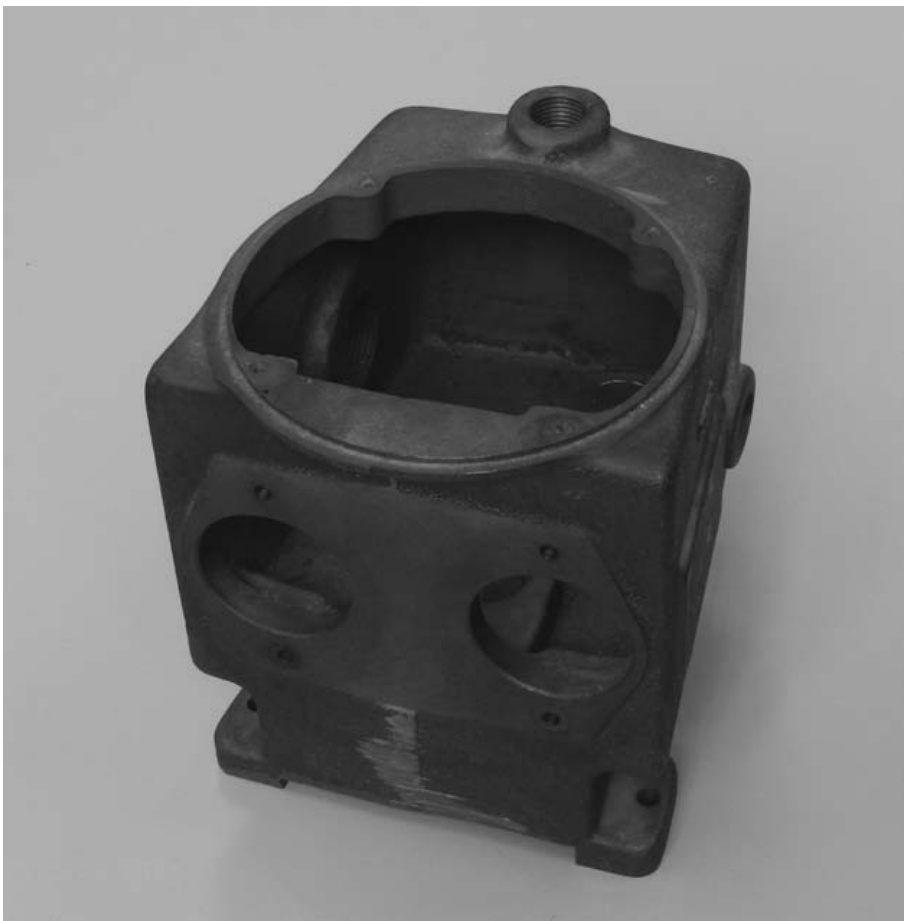  
FIGURE 11.1  A sand  casting for an  industrial pump. Holes  and surfaces have  been machined.  (Courtesy of George E.  Kane Manufacturing  Technology Laboratory,  Lehigh University.)  

to improve metallurgical properties. The cavity in the sand mold is formed by pack- ing sand around a pattern (an approximate duplicate of the part to be cast), and then  removing the pattern by separating the mold into two halves. The mold also contains  the gating and riser system. In addition, if the casting is to have internal surfaces (e.g.,  hollow parts or parts with holes), a core must be included in the mold. Since the mold  is sacrifi  ced to remove the casting, a new sand mold must be made for each part that  is produced. From this brief description, sand casting is seen to include not only the  casting operation itself, but also the fabrication of the pattern and the making of the  mold. The production sequence is outlined in Figure 11.2.  

# 11.1.1  PATTERNS AND CORES  

Sand casting requires a  pattern —a full-sized model of the part, enlarged to account  for shrinkage and machining allowances in the fi  nal casting. Materials used to make  patterns include wood, plastics, and metals. Wood is a common pattern material  because it is easily shaped. Its disadvantages are that it tends to warp, and it is  abraded by the sand being compacted around it, thus limiting the number of times  it can be reused. Metal patterns are more expensive to make, but they last much  longer. Plastics represent a compromise between wood and metal. Selection of the  appropriate pattern material depends to a large extent on the total quantity of cast- ings to be made.  

  
FIGURE 11.2  Steps in the production sequence in sand casting. The steps include not only the casting operation but  also pattern making and mold making.  

There are various types of patterns, as illustrated in Figure 11.3. The simplest is  made of one piece, called a  solid pattern —same geometry as the casting, adjusted  in size for shrinkage and machining. Although it is the easiest pattern to fabricate,  it is not the easiest to use in making the sand mold. Determining the location of the  parting line between the two halves of the mold for a solid pattern can be a problem,  and incorporating the gating system and sprue into the mold is left to the judgment  and skill of the foundry worker. Consequently, solid patterns are generally limited  to very low production quantities.  

Split patterns  consist of two pieces, dividing the part along a plane coinciding  with the parting line of the mold. Split patterns are appropriate for complex part  geometries and moderate production quantities. The parting line of the mold is pre- determined by the two pattern halves, rather than by operator judgment.  

For higher production quantities, match-plate patterns or cope-and-drag patterns  are used. In  match-plate  patterns, the two pieces of the split pattern are attached  to opposite sides of a wood or metal plate. Holes in the plate allow the top and  bottom (cope and drag) sections of the mold to be aligned accurately.  Cope-and- drag patterns  are similar to match-plate patterns except that split pattern halves are  

  
FIGURE 11.3  Types of patterns used in sand casting: (a) solid pattern, (b) split pattern, (c) match-plate pattern, and  (d) cope and drag pattern.  

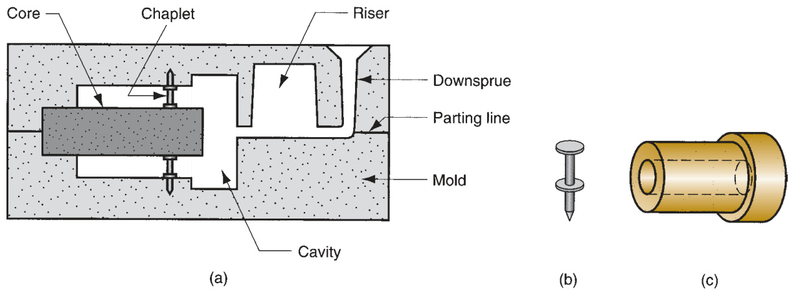  
FIGURE 11.4  (a) Core held in place in the mold cavity by chaplets, (b) possible chaplet design, and  (c) casting with internal cavity.  

attached to separate plates, so that the cope and drag sections of the mold can be  fabricated independently, instead of using the same tooling for both. Part (d) of the  fi  gure includes the gating and riser system in the cope-and-drag patterns.  

Patterns defi  ne the external shape of the cast part. If the casting is to have inter- nal surfaces, a core is required. A  core  is a full-scale model of the interior surfaces  of the part. It is inserted into the mold cavity prior to pouring, so that the molten  metal will fl  ow and solidify between the mold cavity and the core to form the cast- ing’s external and internal surfaces. The core is usually made of sand, compacted  into the desired shape. As with the pattern, the actual size of the core must include  allowances for shrinkage and machining. Depending on the geometry of the part,  the core may or may not require supports to hold it in position in the mold cavity  during pouring. These supports, called  chaplets , are made of a metal with a higher  melting temperature than the casting metal. For example, steel chaplets would  be used for cast iron castings. On pouring and solidifi  cation, the chaplets become  bonded into the casting. A possible arrangement of a core in a mold using chaplets  is sketched in Figure 11.4. The portion of the chaplet protruding from the casting is  subsequently cut off.  

# 11.1.2  MOLDS AND MOLD MAKING  

Foundry sands are silica  $(\mathrm{SiO}_{2})$  or silica mixed with other minerals. The sand should  possess good refractory properties—capacity to stand up under high temperatures  without melting or otherwise degrading. Other important features of the sand in- clude grain size, distribution of grain size in the mixture, and shape of the individual  grains (Section 15.1). Small grain size provides a better surface fi  nish on the cast  part, but large grain size is more permeable (to allow escape of gases during pour- ing). Molds made from grains of irregular shape tend to be stronger than molds of  round grains because of interlocking, yet interlocking tends to restrict permeability.  

In making the mold, the grains of sand are held together by a mixture of water  and bonding clay. A typical mixture (by volume) is  $90\%$  sand,  $3\%$  water, and  $7\%$ clay. Other bonding agents can be used in place of clay, including organic resins  (e.g., phenolic resins) and inorganic binders (e.g., sodium silicate and phosphate).  

Besides sand and binder, additives are sometimes combined with the mixture to  enhance properties such as strength and/or permeability of the mold.  

To form the mold cavity, the traditional method is to compact the molding  sand around the pattern for both cope and drag in a container called a  fl  ask . The  packing process is performed by various methods. The simplest is hand ramming,  accomplished manually by a foundry worker. In addition, various machines have  been developed to mechanize the packing procedure. These machines operate by  any of several mechanisms, including (1) squeezing the sand around the pattern  by pneumatic pressure; (2) a jolting action in which the sand, contained in the  fl  ask with the pattern, is dropped repeatedly in order to pack it into place; and  (3) a slinging action, in which the sand grains are impacted against the pattern at  high speed.  

An alternative to traditional fl  asks for each sand mold is  fl  askless molding , which  refers to the use of one master fl  ask in a mechanized system of mold production.  Each sand mold is produced using the same master fl  ask. Mold production rates up  to 600 per hour are claimed for this more automated method [8].  

Several indicators are used to determine the quality of the sand mold [7]:  (1)  strength —the mold’s ability to maintain its shape and resist erosion caused by  the fl  ow of molten metal; it depends on grain shape, adhesive qualities of the binder,  and other factors; (2)  permeability —capacity of the mold to allow hot air and  gases from the casting operation to pass through the voids in the sand; (3)  thermal  stability —ability of the sand at the surface of the mold cavity to resist cracking  and buckling upon contact with the molten metal; (4)  collapsibility —ability of  the mold to give way and allow the casting to shrink without cracking the casting;  it also refers to the ability to remove the sand from the casting during cleaning;  and (5)  reusability —can the sand from the broken mold be reused to make other  molds? These measures are sometimes incompatible; for example, a mold with  greater strength is less collapsible.  

Sand molds are often classifi  ed as green-sand, dry-sand, or skin-dried molds.  Green-sand molds  are made of a mixture of sand, clay, and water, the word  green   referring to the fact that the mold contains moisture at the time of pouring. Green- sand molds possess suffi  cient strength for most applications, good collapsibility,  good permeability, good reusability, and are the least expensive of the molds. They  are the most widely used mold type, but they are not without problems. Moisture in  the sand can cause defects in some castings, depending on the metal and geometry  of the part. A  dry-sand mold  is made using organic binders rather than clay, and the  mold is baked in a large oven at temperatures ranging from $200^{\circ}\mathrm{C}$  to $320^{\circ}\mathrm{C}$ ( $(400^{\circ}\mathrm{F}-$ $600^{\circ}\mathrm{F}$ ) [8]. Oven baking strengthens the mold and hardens the cavity surface. A  dry-sand mold provides better dimensional control in the cast product, compared  to green-sand molding. However, dry-sand molding is more expensive, and produc- tion rate is reduced because of drying time. Applications are generally limited to  medium and large castings in low to medium production rates. In a  skin-dried mold ,  the advantages of a dry-sand mold is partially achieved by drying the surface of a  green-sand mold to a depth of 10 to  $25~\mathrm{mm}$  (0.4–1 in) at the mold cavity surface,  using torches, heating lamps, or other means. Special bonding materials must be  added to the sand mixture to strengthen the cavity surface.  

The preceding mold classifi  cations refer to the use of conventional binders con- sisting of either clay-and-water or ones that require heating to cure. In addition to  these classifi  cations, chemically bonded molds have been developed that are not  based on either of these traditional binder ingredients. Some of the binder materials  

TABLE •   11.1  Densities of selected casting alloys. 
  
Source: [7]. a Density depends on composition of alloy; value given is typical.  

used in these “no-bake” systems include furan resins (consisting of furfural alcohol,  urea, and formaldehyde), phenolics, and alkyd oils. No-bake molds are growing in  popularity due to their good dimensional control in high production applications.  

# 11.1.3 THE CASTING OPERATION  

After the core is positioned (if one is used) and the two halves of the mold are  clamped together, then casting is performed. Casting consists of pouring, solidifi  ca- tion, and cooling of the cast part (Sections 10.2 and 10.3). The gating and riser system  in the mold must be designed to deliver liquid metal into the cavity and provide for  a suffi  cient reservoir of molten metal during solidifi  cation shrinkage. Air and gases  must be allowed to escape.  

One of the hazards during pouring is that the buoyancy of the molten metal will  displace the core. Buoyancy results from the weight of molten metal being displaced  by the core, according to Archimedes’ principle. The force tending to lift the core is  equal to the weight of the displaced liquid less the weight of the core itself. Expressing  the situation in equation form,  

$$
F_{b}=W_{m}-W_{c}
$$  

where $F_{b}=$  buoyancy force,  $\mathbf{N}$  (lb);  $W_{m}=$  weight of molten metal displaced, N (lb);  and $\%$ $W_{c}=$  weight of the core, $\mathbf{N}$  (lb). Weights are determined as the volume of the  core multiplied by the respective densities of the core material (typically sand) and the  metal being cast. The density of a sand core is approximately  $1.6~\mathrm{g/cm}^{3}$   $(0.058\,\mathrm{lb}/\mathrm{in}^{3})$ .  Densities of several common casting alloys are given in Table 11.1.  

A sand core has a volume $=1875\,\mathrm{cm}^{3}$  and is located inside a sand mold cavity.  Determine the buoyancy force tending to lift the core during pouring of mol- ten lead into the mold.  

Solution:  Density of the sand core is $1.6\;\mathrm{g/cm}^{3}$ . Weight of the core is  $1875(1.6)=$ $3000\:\mathrm{g}=3.0\:\mathrm{kg}$ . Density of lead, based on Table 11.1, is  $11.3\;\mathrm{g}/\mathrm{cm}^{3}$ . The weight of  lead displaced by the core is $1875(11.3)=21{,}188\:\mathrm{g}=21{.}19\:\mathrm{kg}.$ . The difference $=$ $21.19-3.0=18.19\,\mathrm{kg}$ . Given that $1\,\mathrm{kg}=9.81\,\mathrm{N}$ , the buoyancy force is therefore  $F_{b}=9.81(18.19)=\mathbf{178.4}\,\mathbf{N}$ .  

Following solidifi  cation and cooling, the sand mold is broken away from the casting  to retrieve the part. The part is then cleaned—gating and riser system are separated,  and sand is removed. The casting is then inspected (Section 11.5).  

#  Other Expendable-Mold Casting Processes  

As versatile as sand casting is, there are other casting processes that have been  developed to meet special needs. The differences between these methods are in the  composition of the mold material, or the manner in which the mold is made, or in  the way the pattern is made.  

# 11.2.1  SHELL MOLDING  

Shell molding is a casting process in which the mold is a thin shell (typically 9 mm  or 3/8 in) made of sand held together by a thermosetting resin binder. Developed in  Germany during the early 1940s, the process is described and illustrated in Figure 11.5.  

There are many advantages to the shell-molding process. The surface of the  shell-mold cavity is smoother than a conventional green-sand mold, and this  smoothness permits easier fl  ow of molten metal during pouring and better surface  fi  nish on the fi  nal casting. Finishes of  $2.5\ \mu\mathrm{m}$  ( $100~\mu$ -in) can be obtained. Good  

  
FIGURE 11.5  Steps in shell-molding: (1) a match-plate or cope-and-drag metal pattern is heated and placed over a  box containing sand mixed with thermosetting resin; (2) box is inverted so that sand and resin fall onto the hot pattern,  causing a layer of the mixture to partially cure on the surface to form a hard shell; (3) box is repositioned so that loose,  uncured particles drop away; (4) sand shell is heated in oven for several minutes to complete curing; (5) shell mold is  stripped from the pattern; (6) two halves of the shell mold are assembled, supported by sand or metal shot in a box,  and pouring is accomplished. The fi  nished casting with sprue removed is shown in (7).  

dimensional accuracy is also achieved, with tolerances of  $\pm0.25~\mathrm{mm}$  ( $(\pm0.010\$  in)  possible on small-to-medium-sized parts. The good fi  nish and accuracy often pre- cludes the need for further machining. Collapsibility of the mold is generally suf- fi  cient to avoid tearing and cracking of the casting.  

Disadvantages of shell molding include a more expensive metal pattern than the  corresponding pattern for green-sand molding. This makes shell molding diffi  cult to  justify for small quantities of parts. Shell molding can be mechanized for mass pro- duction and is very economical for large quantities. It seems particularly suited to  steel castings of less than 20 lb. Examples of parts made using shell molding include  gears, valve bodies, bushings, and camshafts.  

# 11.2.2  VACUUM MOLDING  

Vacuum molding, also called the  V-process , was developed in Japan around 1970. It  uses a sand mold held together by vacuum pressure rather than by a chemical binder.  Accordingly, the term  vacuum  in this process refers to the making of the mold rather  than the casting operation itself. The steps of the process are explained in Figure 11.6.  

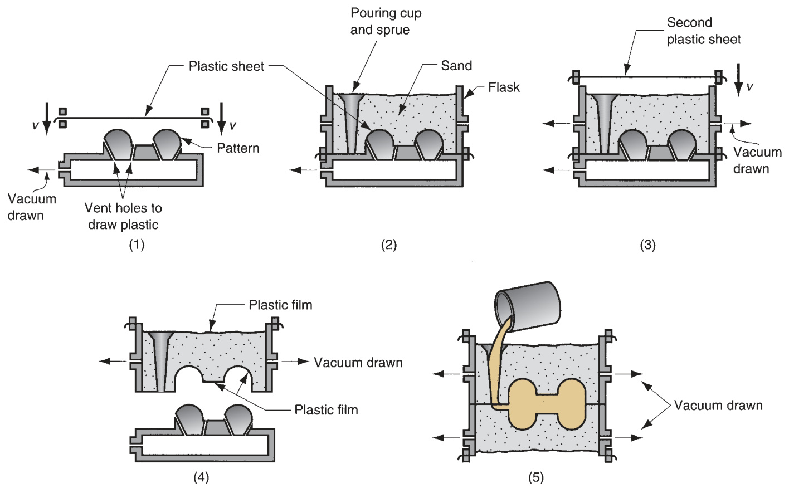  
FIGURE 11.6  Steps in vacuum molding: (1) a thin sheet of preheated plastic is drawn over a match-plate or cope- and-drag pattern by vacuum—the pattern has small vent holes to facilitate vacuum forming; (2) a specially designed  fl  ask is placed over the pattern plate and fi  lled with sand, and a sprue and pouring cup are formed in the sand;  (3) another thin plastic sheet is placed over the fl  ask, and a vacuum is drawn that causes the sand grains to be held  together, forming a rigid mold; (4) the vacuum on the mold pattern is released to permit the pattern to be stripped from  the mold; (5) this mold is assembled with its matching half to form the cope and drag, and with vacuum maintained on  both halves, pouring is accomplished. The plastic sheet quickly burns away on contacting the molten metal.  After solidifi  cation, nearly all of the sand can be recovered for reuse.  

Because no binders are used, the sand is readily recovered in vacuum molding.  Also, the sand does not require extensive mechanical reconditioning normally done  when binders are used in the molding sand. Since no water is mixed with the sand,  moisture-related defects are absent from the product. Disadvantages of the V-process  are that it is relatively slow and not readily adaptable to mechanization.  

# 11.2.3  EXPANDED POLYSTYRENE PROCESS  

The expanded polystyrene casting process uses a mold of sand packed around a  polystyrene foam pattern that vaporizes when the molten metal is poured into the  mold. The process and variations of it are known by other names, including  lost- foam process ,  lost-pattern process ,  evaporative-foam process , and  full-mold process   (the last being a trade name). The foam pattern includes the sprue, risers, and gating  system, and it may also contain internal cores (if needed), thus eliminating the need  for a separate core in the mold. Also, since the foam pattern itself becomes the cavity  in the mold, considerations of draft and parting lines can be ignored. The mold does  not have to be opened into cope and drag sections. The sequence in this casting  process is illustrated and described in Figure 11.7. Various methods for making the  pattern can be used, depending on the quantities of castings to be produced. For  one-of-a-kind castings, the foam is manually cut from large strips and assembled to  form the pattern. For large production runs, an automated molding operation can  be set up to mold the patterns prior to making the molds for casting. The pattern  is normally coated with a refractory compound to provide a smoother surface on  the pattern and to improve its high temperature resistance. Molding sands usually  include bonding agents. However, dry sand is used in certain processes in this group,  which aids recovery and reuse.  

A signifi  cant advantage for this process is that the pattern need not be removed  from the mold. This simplifi  es and expedites mold making. In a conventional green- sand mold, two halves are required with proper parting lines, draft allowances  must be provided in the mold design, cores must be inserted, and the gating and  riser system must be added. With the expanded polystyrene process, these steps  

  
FIGURE 11.7  Expanded polystyrene casting process: (1) pattern of polystyrene is coated with refractory compound;  (2) foam pattern is placed in mold box, and sand is compacted around the pattern; and (3) molten metal is poured into  the portion of the pattern that forms the pouring cup and sprue. As the metal enters the mold, the polystyrene foam is  vaporized ahead of the advancing liquid, thus allowing the resulting mold cavity to be fi  lled.  

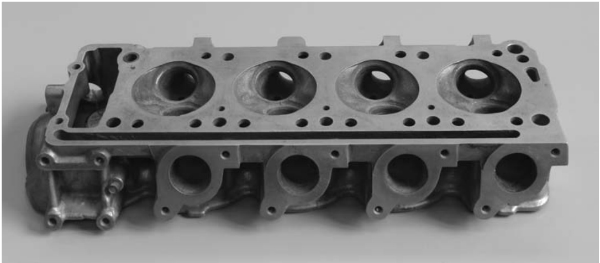  
FIGURE 11.8  An  aluminum engine head  produced by the  expanded polystyrene  casting process.  The holes and certain  surfaces have been  machined. (Courtesy of  George E. Kane  Manufacturing  Technology Laboratory,  Lehigh University.)  

are built into the pattern itself. A new pattern is needed for every casting, so the  economics of the expanded polystyrene casting process depend largely on the cost  of producing the patterns. The process has been applied to mass produce castings  for automobiles engines. Automated production systems are installed to mold the  polystyrene foam patterns for these applications. Figure 11.8 shows an aluminum  engine head that was cast by the expanded polystyrene process (the holes and some  surfaces have been machined).  

# 11.2.4  INVESTMENT CASTING  

In investment casting, a pattern made of wax is coated with a refractory material  to make the mold, after which the wax is melted away prior to pouring the molten  metal. The term  investment  comes from one of the less familiar defi  nitions of the  word  invest , which is “to cover completely,” this referring to the coating of the re- fractory material around the wax pattern. It is a precision casting process, because  it is capable of making castings of high accuracy and intricate detail. The process  dates back to ancient Egypt (Historical Note 11.1) and is also known as the  lost-wax  process , because the wax pattern is lost from the mold prior to casting.  

# Historical Note 11.1  Investment casting  

The lost wax casting process was developed by the  ancient Egyptians some 3,500 years ago. Although  written records do not identify when the invention  occurred or the artisan responsible, historians specu- late that the process resulted from the close associa- tion between pottery and molding in early times. It  was the potter who crafted the molds that were used  for casting. The idea for the lost wax process must  have originated with a potter who was familiar with  the casting process. As he was working one day on  a ceramic piece—perhaps an ornate vase or bowl—it  occurred to him that the article might be more attrac- tive and durable if made of metal. So he fashioned a  core in the general shape of the piece, but smaller  than the desired fi  nal dimensions, and coated it with  wax to establish the size. The wax proved to be  an easy material to form, and intricate designs and  shapes could be created by the craftsman. On the  wax surface, he carefully plastered several layers of  clay and devised a means of holding the resulting  

components together. He then baked the mold in a  kiln, so that the clay hardened and the wax melted  and drained out to form a cavity. At last, he poured  molten bronze into the cavity and, after the cast- ing had solidifi  ed and cooled, broke away the mold  to recover the part. Considering the education and  experience of this early pottery maker and the tools  he had to work with, development of the lost wax  casting process demonstrated great innovation and  insight. “No other process can be named by archeol- ogists so crowded with deduction, engineering ability  and ingenuity” [14].  

Steps in investment casting are described in Figure 11.9. Since the wax pattern is  melted off after the refractory mold is made, a separate pattern must be made for  every casting. Pattern production is usually accomplished by a molding operation— pouring or injecting the hot wax into a  master die  that has been designed with proper  allowances for shrinkage of both wax and subsequent metal casting. In cases where the  part geometry is complicated, several separate wax pieces must be joined to make the  pattern. In high-production operations, several patterns are attached to a sprue, also  made of wax, to form a  pattern tree ; this is the geometry that will be cast out of metal.  

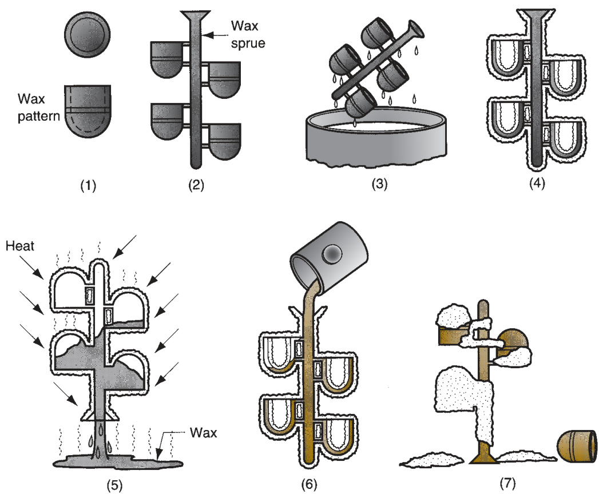  
FIGURE 11.9  Steps in investment casting: (1) wax patterns are produced; (2) several  patterns are attached to a sprue to form a pattern tree; (3) the pattern tree is coated  with a thin layer of refractory material; (4) the full mold is formed by covering the coated  tree with suffi  cient refractory material to make it rigid; (5) the mold is held in an inverted  position and heated to melt the wax and permit it to drip out of the cavity; (6) the mold  is preheated to a high temperature, which ensures that all contaminants are eliminated  from the mold; it also permits the liquid metal to fl  ow more easily into the detailed cavity;  the molten metal is poured; it solidifi  es; and (7) the mold is broken away from the fi  nished  casting. Parts are separated from the sprue.  

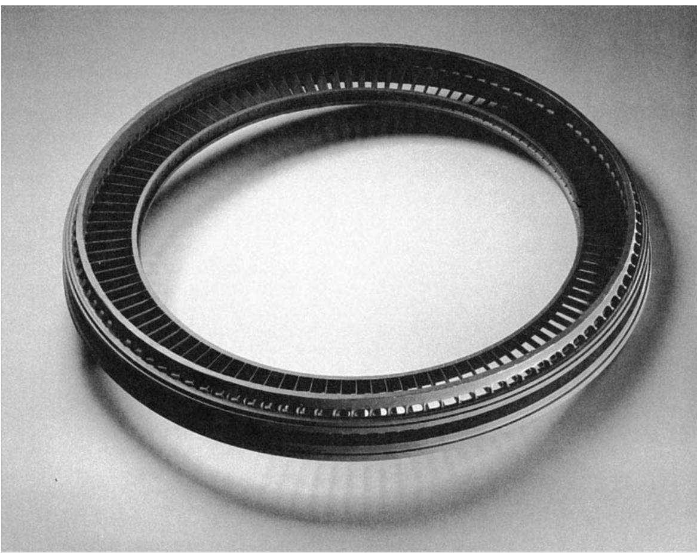  
FIGURE 11.10  A one-piece compressor stator with 108 separate airfoils made by investment  casting. (Courtesy of Alcoa Howmet.)  

Coating with refractory (step 3) is usually accomplished by dipping the pattern  tree into a slurry of very fi  ne grained silica or other refractory (almost in powder  form) mixed with plaster to bond the mold into shape. The small grain size of the  refractory material provides a smooth surface and captures the intricate details of  the wax pattern. The fi  nal mold (step 4) is accomplished by repeatedly dipping the  tree into the refractory slurry or by gently packing the refractory around the tree in  a container. The mold is allowed to air dry for about 8 hours to harden the binder.  

Advantages of investment casting include: (1) parts of great complexity and  intricacy can be cast; (2) close dimensional control—tolerances of  $\pm0.075\ \mathrm{mm}$ $(\pm0.003\;\mathrm{in})$  are possible; (3) good surface fi  nish is possible; (4) the wax can usually  be recovered for reuse; and (5) additional machining is not normally required— this is a net shape process. Because many steps are involved in this casting opera- tion, it is a relatively expensive process. Investment castings are normally small in  size, although parts with complex geometries weighing up to  $75\,\mathrm{lb}$  have been suc- cessfully cast. All types of metals, including steels, stainless steels, and other high  temperature alloys, can be investment cast. Examples of parts include complex  machinery parts, blades, and other components for turbine engines, jewelry, and  dental fi  xtures. Shown in Figure 11.10 is a part illustrating the intricate features  possible with investment casting.  

# 11.2.5 PLASTER-MOLD AND CERAMIC-MOLD CASTING  

Plaster-mold casting is similar to sand casting except that the mold is made of plas- ter of Paris (gypsum $\mathrm{-CaSO_{4}}\mathrm{-}2\mathrm{H}_{2}\mathrm{O})$  instead of sand. Additives such as talc and  silica fl  our are mixed with the plaster to control contraction and setting time, reduce  cracking, and increase strength. To make the mold, the plaster mixture combined with  water is poured over a plastic or metal pattern in a fl  ask and allowed to set. Wood  patterns are generally unsatisfactory due to the extended contact with water in the  plaster. The fl  uid consistency permits the plaster mixture to readily fl  ow around the  pattern, capturing its details and surface fi  nish. Thus, the cast product in plaster mold- ing is noted for these attributes.  

Curing of the plaster mold is one of the disadvantages of this process, at least  in high production. The mold must set for about 20 minutes before the pattern is  stripped. The mold is then baked for several hours to remove moisture. Even with  the baking, not all of the moisture content is removed from the plaster. The dilem- ma faced by foundrymen is that mold strength is lost when the plaster becomes  too dehydrated, and yet moisture content can cause casting defects in the product.  A balance must be achieved between these undesirable alternatives. Another dis- advantage with the plaster mold is that it is not permeable, thus limiting escape  of gases from the mold cavity. This problem can be solved in a number of ways:  (1) evacuating air from the mold cavity before pouring; (2) aerating the plaster  slurry prior to mold making so that the resulting hard plaster contains fi  nely dis- persed voids; and (3) using a special mold composition and treatment known as  the  Antioch process . This process involves using about $50\%$  sand mixed with the  plaster, heating the mold in an autoclave (an oven that uses superheated steam  under pressure), and then drying. The resulting mold has considerably greater  permeability than a conventional plaster mold.  

Plaster molds cannot withstand the same high temperatures as sand molds. They  are therefore limited to the casting of lower-melting-point alloys, such as alumi- num, magnesium, and some copper-base alloys. Applications include metal molds  for plastic and rubber molding, pump and turbine impellers, and other parts of rela- tively intricate geometry. Casting sizes range from about  $20~\mathrm{g}$ (less than 1 oz) to  more than  $100~\mathrm{kg}$  (more than 200 lb). Parts weighing less than about  $10~\mathrm{kg}$  (20 lb)  are most common. Advantages of plaster molding for these applications are good  surface fi  nish and dimensional accuracy and the capability to make thin cross sec- tions in the casting.  

Ceramic-mold casting  is similar to plaster-mold casting, except that the mold is  made of refractory ceramic materials that can withstand higher temperatures than  plaster. Thus, ceramic molding can be used to cast steels, cast irons, and other high- temperature alloys. Its applications (relatively intricate parts) are similar to those of  plaster mold casting except for the metals cast. Its advantages (good accuracy and  fi  nish) are also similar.  

#  Permanent-Mold Casting Processes  

The economic disadvantage of any of the expendable mold processes is that a new  mold is required for every casting. In permanent-mold casting, the mold is reused  many times. In this section, permanent-mold casting is treated as the basic process in  the group of casting processes that all use reusable metal molds. Other members of  the group include die casting and centrifugal casting.  

# 11.3.1  THE BASIC PERMANENT-MOLD PROCESS  

Permanent-mold casting uses a metal mold constructed of two sections that are  designed for easy, precise opening and closing. These molds are commonly made of  steel or cast iron. The cavity, with gating system included, is machined into the two  halves to provide accurate dimensions and good surface fi  nish. Metals commonly  cast in permanent molds include aluminum, magnesium, copper-base alloys, and  cast iron. However, cast iron requires a high pouring temperature, $1250^{\circ}\mathrm{C}$  to  $1500^{\circ}\mathrm{C}$   $(2300^{\circ}\mathrm{F}{-}2700^{\circ}\mathrm{F})$ , which takes a heavy toll on mold life. The very high pouring tem- peratures of steel make permanent molds unsuitable for this metal, unless the mold  is made of refractory material.  

Cores can be used in permanent molds to form interior surfaces in the cast product.  The cores can be made of metal, but either their shape must allow for removal from  the casting or they must be mechanically collapsible to permit removal. If withdrawal  of a metal core would be diffi  cult or impossible, sand cores can be used, in which case  the casting process is often referred to as  semipermanent-mold casting .  

Steps in the basic permanent mold casting process are described in Figure 11.11.  In preparation for casting, the mold is fi  rst preheated and one or more coatings are  

  
FIGURE 11.11  Steps in permanent-mold casting: (1) mold is preheated and coated; (2) cores (if used) are inserted,  and mold is closed; (3) molten metal is poured into the mold; and (4) mold is opened. Finished part is shown in (5).  

sprayed on the cavity. Preheating facilitates metal fl  ow through the gating system  and into the cavity. The coatings aid heat dissipation and lubricate the mold sur- faces for easier separation of the cast product. After pouring, as soon as the metal  solidifi  es, the mold is opened and the casting is removed. Unlike expendable molds,  permanent molds do not collapse, so the mold must be opened before appreciable  cooling contraction occurs in order to prevent cracks from developing in the casting.  

Advantages of permanent-mold casting include good surface fi  nish and close  dimensional control, as previously indicated. In addition, more rapid solidifi  cation  caused by the metal mold results in a fi  ner grain structure, so stronger castings are  produced. The process is generally limited to metals of lower melting points. Other  limitations include simple part geometries compared to sand casting (because of  the need to open the mold), and the expense of the mold. Because mold cost is sub- stantial, the process is best suited to high-volume production and can be automated  accordingly. Typical parts include automotive pistons, pump bodies, and certain cast- ings for aircraft and missiles.  

# 11.3.2  VARIATIONS OF PERMANENT-MOLD CASTING  

Several casting processes are quite similar to the basic permanent-mold method. These  include slush casting, low-pressure casting, and vacuum permanent-mold casting.  

Slush Casting  Slush casting is a permanent mold process in which a hollow cast- ing is formed by inverting the mold after partial freezing at the surface to drain out  the liquid metal in the center. Solidifi  cation begins at the mold walls because they  are relatively cool, and it progresses over time toward the middle of the casting  (Section 10.3.1). Thickness of the shell is controlled by the length of time allowed  before draining. Slush casting is used to make statues, lamp pedestals, and toys out  of low-melting-point metals such as zinc and tin. In these items, the exterior appear- ance is important, but the strength and interior geometry of the casting are minor  considerations.  

Low-Pressure Casting  In the basic permanent mold casting process and in slush  casting, the fl  ow of metal into the mold cavity is caused by gravity. In low-pressure  casting, the liquid metal is forced into the cavity under low pressure—approximately  $0.1\ \mathrm{MPa}$   $(15\ \mathrm{lb/in}^{2})$ )—from beneath so that the fl  ow is upward, as illustrated in  Figure 11.12. The advantage of this approach over traditional pouring is that clean  molten metal from the center of the ladle is introduced into the mold, rather  than metal that has been exposed to air. Gas porosity and oxidation defects are  thereby minimized, and mechanical properties are improved.  

Vacuum Permanent-Mold Casting   Not to be confused with vacuum molding  (Section 11.2.2), this process is a variation of low-pressure casting in which a vacuum  is used to draw the molten metal into the mold cavity. The general confi  guration of  the vacuum permanent-mold casting process is similar to the low-pressure casting  operation. The difference is that reduced air pressure from the vacuum in the mold  is used to draw the liquid metal into the cavity, rather than forcing it by positive air  pressure from below. There are several benefi  ts of the vacuum technique relative  to low-pressure casting: air porosity and related defects are reduced, and greater  strength is given to the cast product.  

  
FIGURE 11.12  Low- pressure casting. The  diagram shows how air  pressure is used to force  the molten metal in the  ladle upward into the  mold cavity. Pressure  is maintained until the  casting has solidifi  ed.  

# 11.3.3  DIE CASTING  

Die casting is a permanent-mold casting process in which the molten metal is in- jected into the mold cavity under high pressure. Typical pressures are 7 to $350\;\mathrm{MPa}$   $(1000{-}50{,}000{\,}1\mathrm{b}/\mathrm{in}^{2})$ ). The pressure is maintained during solidifi  cation, after which the  mold is opened and the part is removed. Molds in this casting operation are called  dies; hence the name die casting. The use of high pressure to force the metal into the  die cavity is the most notable feature that distinguishes this process from others in  the permanent mold category.  

Die-casting operations are carried out in special die-casting machines (Historical  Note 11.2), which are designed to hold and accurately close the two halves of the  mold, and keep them closed while the liquid metal is forced into the cavity. The gen- eral confi  guration is shown in Figure 11.13. There are two main types of die-casting  machines: (1) hot-chamber and (2) cold-chamber, differentiated by how the molten  metal is injected into the cavity.  

# Historical Note 11.2  Die-casting machines  

The modern die-casting machine has its origins in  the printing industry and the need in the mid- to late  1800s to satisfy an increasingly literate population  with a growing appetite for reading. The linotype,  invented and developed by O. Mergenthaler in the  late 1800s, is a machine that produces printing  type. It is a casting machine because it casts a line  of type characters out of lead to be used in prepar- ing printing plates. The name  linotype  derives  from the fact that the machine produces a line of  type characters during each cycle of operation.  The machine was fi  rst used successfully on a commer- cial basis in New York City by  The T ribune  in 1886.  

The linotype proved the feasibility of mechanized  casting machines. The fi  rst die-casting machine was pat- ented by H. Doehler in 1905 (this machine is displayed in  the Smithsonian Institute in Washington, D.C.). In 1907 ,  E. Wagner developed the fi  rst die-casting machine to  utilize the hot-chamber design. It was fi  rst used during  World War I to cast parts for binoculars and gas masks.  

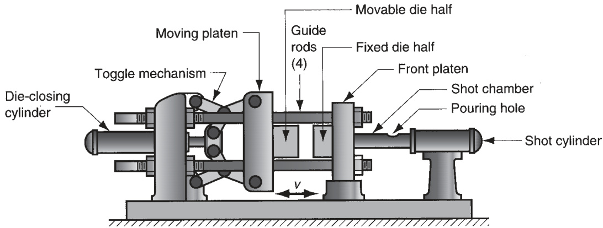  
FIGURE 11.13  General  confi  guration of a  (cold-chamber)  die-casting machine.  

In  hot-chamber machines , the metal is melted in a container attached to the ma- chine, and a piston is used to inject the liquid metal under high pressure into the die.  Typical injection pressures are 7 to $35\,\mathrm{MPa}$   $(1000{-}5000\,\mathrm{lb/in}^{2})$ . The casting cycle is sum- marized in Figure 11.14. Production rates up to 500 parts per hour are not uncommon.  Hot-chamber die casting imposes a special hardship on the injection system because  much of it is submerged in the molten metal. The process is therefore limited in its appli- cations to low-melting-point metals that do not chemically attack the plunger and other  mechanical components. The metals include zinc, tin, lead, and sometimes magnesium.  

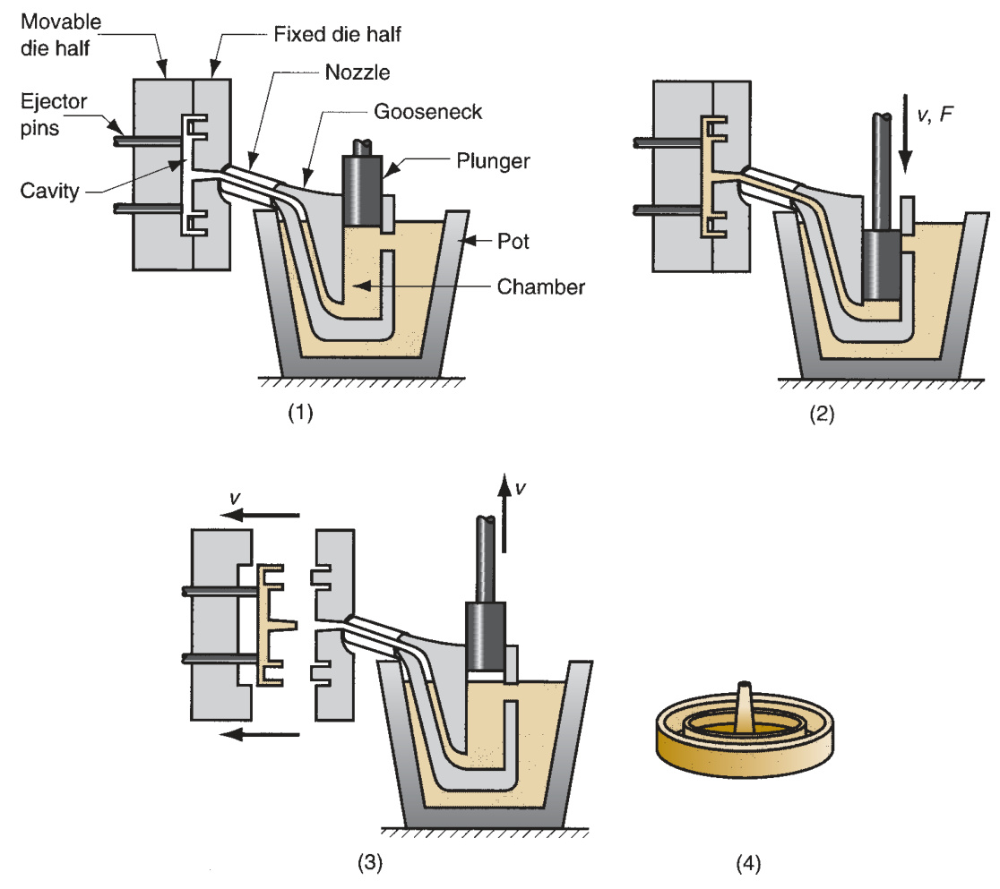  
FIGURE 11.14  Cycle  in hot-chamber casting:  (1) with die closed and  plunger withdrawn,  molten metal fl  ows  into the chamber;  (2) plunger forces metal  in chamber to fl  ow into  die, maintaining  pressure during cooling  and solidifi  cation;  and (3) plunger is  withdrawn, die is  opened, and solidifi  ed  part is ejected. Finished  part is shown in (4).  

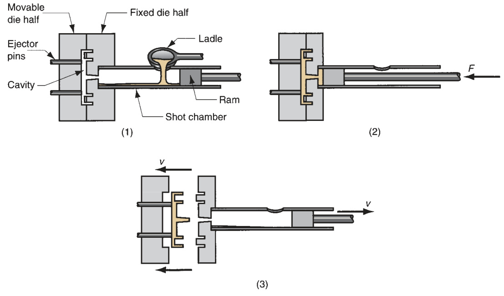  
FIGURE 11.15  Cycle  in cold-chamber  casting: (1) with  die closed and ram  withdrawn, molten  metal is poured into the  chamber; (2) ram forces  metal to fl  ow into die,  maintaining pressure  during cooling and  solidifi  cation; and  (3) ram is withdrawn,  die is opened, and part  is ejected. (Gating  system is simplifi  ed.)  

In  cold-chamber die-casting machines , molten metal is poured into an unheated  chamber from an external melting container, and a piston is used to inject the metal  under high pressure into the die cavity. Injection pressures used in these machines  are typically 14 to  $140~\mathrm{MPa}$   $(2000{-}20{,}000\ \mathrm{lb/in^{2}})$ . The production cycle is explained  in Figure 11.15. Compared to hot-chamber machines, cycle rates are not usually as  fast because of the need to ladle the liquid metal into the chamber from an external  source. Nevertheless, this casting process is a high production operation. Cold-chamber  machines are typically used for casting aluminum, brass, and magnesium alloys. Low- melting-point alloys (zinc, tin, lead) can also be cast on cold-chamber machines, but the  advantages of the hot-chamber process usually favor its use on these metals. A large  die casting produced by a cold-chamber machine is shown in Figure 11.16.  

Molds used in die-casting operations are usually made of tool steel, mold steel,  or maraging steel. Tungsten and molybdenum with good refractory qualities are also  being used, especially in attempts to die cast steel and cast iron. Dies can be single- cavity or multiple-cavity. Single-cavity dies are shown in Figures 11.14 and 11.15.  Ejector pins are required to remove the part from the die when it opens, as shown  in the diagrams. These pins push the part away from the mold surface so that it can  be removed. Lubricants must also be sprayed into the cavities to prevent sticking.  

Because the die materials have no natural porosity and the molten metal rapidly  fl  ows into the die during injection, venting holes and passageways must be built into  the dies at the parting line to evacuate the air and gases in the cavity. The vents  are quite small; yet they fi  ll with metal during injection. This metal must later be  trimmed from the part. Also, formation of  fl  ash  is common in die casting, in which  the liquid metal under high pressure squeezes into the small space between the die  halves at the parting line or into the clearances around the cores and ejector pins.  This fl  ash must be trimmed from the casting, along with the sprue and gating system. Advantages of die casting include (1) high production rates possible; (2) eco- nomical for large production quantities; (3) close tolerances possible, on the order  

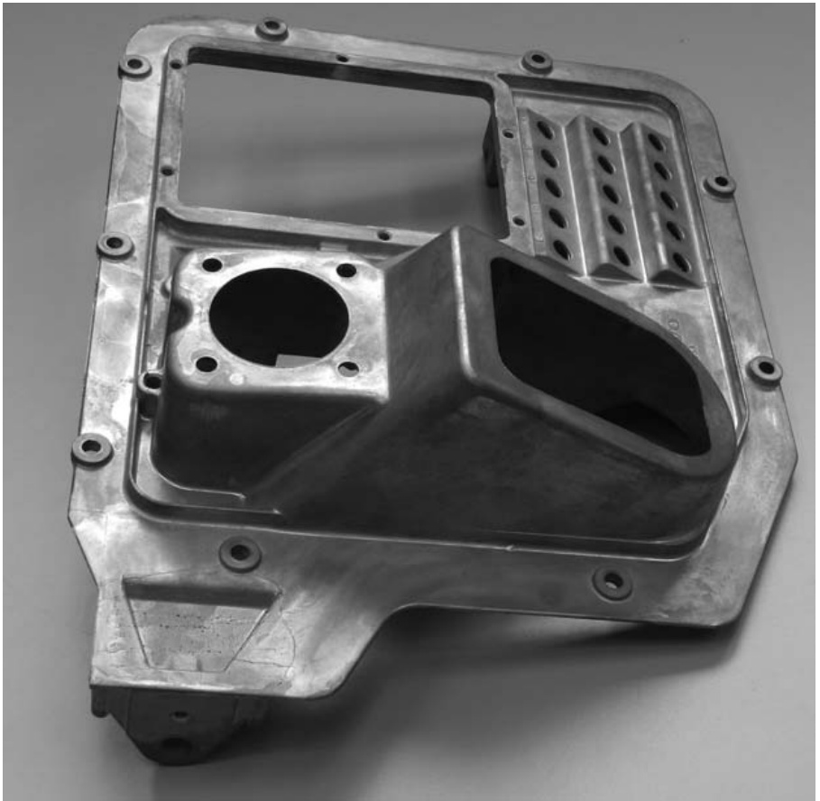  
FIGURE 11.16  A large  die casting measuring  about 400 mm diagonally  for a truck cab fl  oor.  (Courtesy of George E.  Kane Manufacturing  Technology Laboratory,  Lehigh University.)  

of  $\pm0.076\ \mathrm{mm}$  ( $'\pm0.003$  in) for small parts; (4) good surface fi  nish; (5) thin sections  are possible, down to about  $0.5\;\mathrm{mm}\;(0.020\;\mathrm{in})$ ; and (6) rapid cooling provides small  grain size and good strength to the casting. The limitation of this process, in addition  to the metals cast, is the shape restriction. The part geometry must allow for removal  from the die cavity.  

# 11.3.4 SQUEEZE CASTING AND SEMI-SOLID METAL CASTING  

These are two processes that are often associated with die casting.  Squeeze cast- ing  is a combination of casting and forging (Section 18.3) in which a molten metal  is poured into a preheated lower die, and the upper die is closed to create the  mold cavity after solidifi  cation begins. This differs from the usual permanent- mold casting process in which the die halves are closed prior to pouring or injec- tion. Owing to the hybrid nature of the process, it is also known as  liquid–metal  forging . The pressure applied by the upper die in squeeze casting causes the metal  to completely fi  ll the cavity, resulting in good surface fi  nish and low shrinkage.  The required pressures are signifi  cantly less than in forging of a solid metal billet  and much fi  ner surface detail can be imparted by the die than in forging. Squeeze  casting can be used for both ferrous and non-ferrous alloys, but aluminum and  magnesium alloys are the most common due to their lower melting temperatures.  Automotive parts are a common application.  

Semi-solid metal casting  is a family of net-shape and near net-shape processes  performed on metal alloys at temperatures between the liquidus and solidus (Sec- tion 10.3.1). Thus the alloy is a mixture of solid and molten metals during casting,  like a slurry; it is in the mushy state. In order to fl  ow properly, the mixture must  consist of solid metal globules in a liquid rather than the more typical dendritic  solid shapes that form during freezing of a molten metal. This is achieved by force- fully stirring the slurry to prevent dendrite formation and instead encourage the  spherical shapes, which in turn reduces the viscosity of the work metal. Advantages  of semi-solid metal casting include the following [16]: (1) complex part geometries,  (2) thin walls in parts, (3) close tolerances, (4) zero or low porosity, resulting in high  strength of the casting.  

There are several forms of semi-solid metal casting. When applied to aluminum,  the terms thixocasting and rheocasting are used. The prefi  x in thixocasting is derived  from the word  thixotropy , which refers to the decrease in viscosity of some fl  uid-like  materials when agitated. The prefi  x in rheocasting comes from  rheology , the science  that relates deformation and fl  ow of materials. In  thixocasting , the starting work  material is a pre-cast billet that has a non-dendritic microstructure; this is heated  into the semi-solid temperature range and injected into a mold cavity using die cast- ing equipment. In  rheocasting , a semi-solid slurry is injected into the mold cavity by  a die casting machine, very much like conventional die casting. The difference is that  the starting metal in rheocasting is at a temperature between the solidus and liq- uidus rather than above the liquidus. And the mushy mixture is agitated to prevent  dendrite formation.  

When applied to magnesium, the term is  thixomolding , which utilizes equipment  similar to an injection-molding machine (Section 13.6.3). Magnesium alloy granules  are fed into a barrel and propelled forward by a rotating screw as they are heated  into the semi-solid temperature range. The required globular form of the solid phase  is accomplished by the mixing action of the rotating screw. The slurry is then injected  into the mold cavity by a linear forward movement of the screw.  

# 11.3.5  CENTRIFUGAL CASTING  

Centrifugal casting refers to several casting methods in which the mold is rotated at  high speed so that centrifugal force distributes the molten metal to the outer regions  of the die cavity. The group includes (1) true centrifugal casting, (2) semicentrifugal  casting, and (3) centrifuge casting.  

True Centrifugal Casting   In true centrifugal casting, molten metal is poured  into a rotating mold to produce a tubular part. Examples of parts made by this  process include pipes, tubes, bushings, and rings. One possible setup is illustrated  in Figure 11.17. Molten metal is poured into a horizontal rotating mold at one end.  In some operations, mold rotation commences after pouring has occurred rather  than beforehand. The high-speed rotation results in centrifugal forces that cause  the metal to take the shape of the mold cavity. Thus, the outside shape of the cast- ing can be round, octagonal, hexagonal, and so on. However, the inside shape of  the casting is (theoretically) perfectly round, due to the radially symmetric forces  at work.  

Orientation of the axis of mold rotation can be either horizontal or vertical, the  former being more common. The question is, how fast must the mold be rotated  

  
FIGURE 11.17 Setup for true centrifugal  casting.  

for the process to work successfully? Consider  horizontal centrifugal casting  fi  rst.  Centrifugal force is defi  ned by this physics equation:  

$$
F=\frac{m\nu^{2}}{R}
$$  

where  $F=$  force, $\mathbf{N}$  (lb); $m=$ mass, kg (lbm);  $\nu=$  velocity,  $\mathrm{m/s}$  (ft/sec); and  $R={\mathrm{in}}.$ - side radius of the mold,  $\mathrm{m}$  (ft). The force of gravity is its weight  $W=m g$ , where  $W$  is  given in $\mathrm{kg}$  (lb), and $g=$  acceleration of gravity, $9.8\;\mathrm{m}/\mathrm{s}^{2}$  (32.2 ft/sec 2 ). The so-called  G-factor  $G F$  is the ratio of centrifugal force divided by weight:  

$$
G F=\frac{F}{W}=\frac{m\nu^{2}}{R m g}=\frac{\nu^{2}}{R g}
$$  

Velocity $\nu$  can be expressed as $2\pi R N/60=\pi R N/30$ , where the constant 60 converts  seconds to minutes; so that $N=$  rotational speed, rev/min. Substituting this expres- sion into Equation (11.3),  

$$
G F=\frac{\displaystyle{\bigg(\frac{\pi R N}{30}\bigg)^{2}}}{R g}=\frac{R\bigg(\displaystyle{\frac{\pi N}{30}\bigg)^{2}}}{g}
$$  

Rearranging this to solve for rotational speed  $N$ , and using diameter  $D$  rather than  radius in the resulting equation,  

$$
N=\frac{30}{\pi}\sqrt{\frac{g G F}{R}}=\frac{30}{\pi}\sqrt{\frac{2g G F}{D}}
$$  

where  $D=$  inside diameter of the mold,  $\mathrm{m}$  (ft). If the  $\mathrm{G}$ -factor is too low in cen- trifugal casting, the liquid metal will not remain forced against the mold wall during  the upper half of the circular path but will “rain” inside the cavity. Slipping occurs  between the molten metal and the mold wall, which means that the rotational speed  of the metal is less than that of the mold. On an empirical basis, values of  $G F=60$   to 80 are found to be appropriate for horizontal centrifugal casting [2], although this  depends to some extent on the metal being cast.  

A true centrifugal casting operation is to be performed horizontally to make  copper tube sections with  $O D=25\,\mathrm{{cm}}$  and  $I D=22.5\,\mathrm{cm}$ . What rotational  speed is required if a G-factor of 65 is used to cast the tubing? Solution:  The inside diameter of the mold  $D=O D$  of the casting  $=25\,\mathrm{cm}=$ $0.25\:\mathrm{m}$ . The required rotational speed can be computed from Equation (11.5)  as follows:  

$$
N={\frac{30}{\pi}}{\sqrt{\frac{2(9.8)(65)}{0.25}}}=681.7\;\mathrm{rev/min}
$$  

In  vertical centrifugal casting , the effect of gravity acting on the liquid metal  causes the casting wall to be thicker at the base than at the top. The inside profi  le of  the casting wall takes on a parabolic shape. The difference in inside radius between  top and bottom is related to speed of rotation as follows:  

$$
N=\frac{30}{\pi}\sqrt{\frac{2g L}{R_{t}^{2}-R_{b}^{2}}}
$$  

where  $L=$  vertical length of the casting, m (ft);  $R_{t}=$  inside radius at the top of  the casting, m (ft); and  $R_{b}\,=$  inside radius at the bottom of the casting, m (ft).  Equation (11.6) can be used to determine the required rotational speed for verti- cal centrifugal casting, given specifi  cations on the inside radii at top and bottom.  One can see from the formula that for  $R_{t}$  to equal  $R_{b}$ , the speed of rotation  $N$   would have to be infi  nite, which is impossible of course. As a practical matter, part  lengths made by vertical centrifugal casting are usually no more than about twice  their diameters. This is quite satisfactory for bushings and other parts that have  large diameters relatively to their lengths, especially if machining will be used to  accurately size the inside diameter.  

Castings made by true centrifugal casting are characterized by high density, espe- cially in the outer regions of the part where $F$  is greatest. Solidifi  cation shrinkage at  the exterior of the cast tube is not a factor, because the centrifugal force continually  reallocates molten metal toward the mold wall during freezing. Any impurities in the  casting tend to be on the inner wall and can be removed by machining if necessary.  

Semicentrifugal Casting   In this method, centrifugal force is used to produce  solid castings, as in Figure 11.18, rather than tubular parts. The rotation speed in  semicentrifugal casting is usually set so that G-factors of around 15 are obtained [2],  and the molds are designed with risers at the center to supply feed metal. Density of  metal in the fi  nal casting is greater in the outer sections than at the center of rota- tion. The process is often used on parts in which the center of the casting is machined  away, thus eliminating the portion of the casting where the quality is lowest. Wheels  and pulleys are examples of castings that can be made by this process. Expendable  molds are often used in semicentrifugal casting, as suggested by the illustration of  the process.  

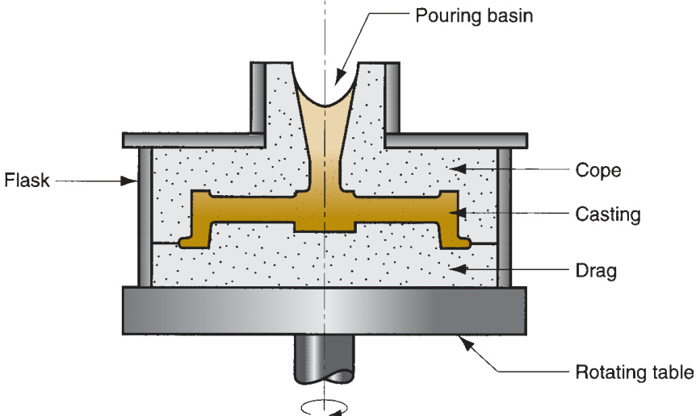  
FIGURE 11.18  Semicentrifugal casting.  

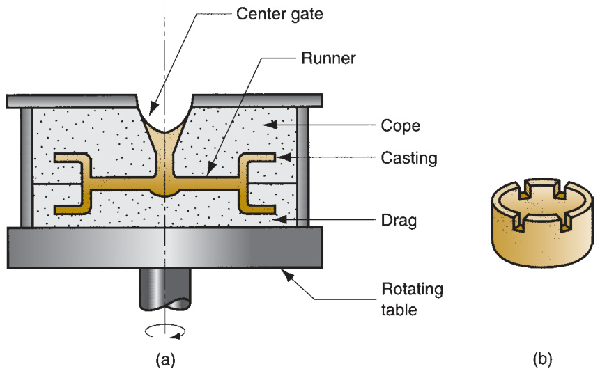  
FIGURE 11.19  (a) Centrifuge  casting—centrifugal  force causes metal to  fl  ow to the mold  cavities away from the  axis of rotation; and  (b) the casting.  

Centrifuge Casting   In centrifuge casting, Figure 11.19, the mold is designed with  part cavities located away from the axis of rotation, so that the molten metal poured  into the mold is distributed to these cavities by centrifugal force. The process is used  for smaller parts, and radial symmetry of the part is not a requirement as it is for the  other two centrifugal casting methods.  

# 11.4 11.4  Foundry Practice  

In all casting processes, the metal must be heated to the molten state to be poured or  otherwise forced into the mold. Heating and melting are accomplished in a furnace.  This section covers the various types of furnaces used in foundries and the pouring  practices for delivering the molten metal from furnace to mold.  

# 11.4.1  FURNACES  

The types of furnaces most commonly used in foundries are (1) cupolas, (2) direct  fuel-fi  red furnaces, (3) crucible furnaces, (4) electric-arc furnaces, and (5) induction  furnaces. Selection of the most appropriate furnace type depends on factors such  as the casting alloy; its melting and pouring temperatures; capacity requirements of  the furnace; costs of investment, operation, and maintenance; and environmental  pollution considerations.  

Cupolas   A cupola is a vertical cylindrical furnace equipped with a tapping spout  near its base. Cupolas are used only for melting cast irons, and although other fur- naces are also used, the largest tonnage of cast iron is melted in cupolas. General  construction and operating features of the cupola are illustrated in Figure 11.20. It  consists of a large shell of steel plate lined with refractory. The “charge,” consisting  of iron, coke, fl  ux, and possible alloying elements, is loaded through a charging door  located less than halfway up the height of the cupola. The iron is usually a mixture  of pig iron and scrap (including risers, runners, and sprues left over from previous  castings). Coke is the fuel used to heat the furnace. Forced air is introduced through  openings near the bottom of the shell for combustion of the coke. The fl  ux is a basic  

  
FIGURE 11.20  Cupola  used for melting cast  iron. Furnace shown is  typical for a small  foundry and omits  details of emissions  control system required  in a modern cupola.  

compound such as limestone that reacts with coke ash and other impurities to form  slag. The slag serves to cover the melt, protecting it from reaction with the environ- ment inside the cupola and reducing heat loss. As the mixture is heated and melting  of the iron occurs, the furnace is periodically tapped to provide liquid metal for the  pour.  

Direct Fuel-Fired Furnaces   A direct fuel-fi  red furnace contains a small open  hearth, in which the metal charge is heated by fuel burners located on the side of  the furnace. The roof of the furnace assists the heating action by refl  ecting the fl  ame  down against the charge. Typical fuel is natural gas, and the combustion products  exit the furnace through a stack. At the bottom of the hearth is a tap hole to release  the molten metal. Direct fuel-fi  red furnaces are generally used in casting for melting  nonferrous metals such as copper-base alloys and aluminum.  

Crucible Furnaces   These furnaces melt the metal without direct contact with a  burning fuel mixture. For this reason, they are sometimes called  indirect fuel-fi  red  furnaces . Three types of crucible furnaces are used in foundries: (a) lift-out type, (b)  stationary, and (c) tilting, illustrated in Figure 11.21. They all utilize a container (the  crucible) made out of a suitable refractory material (e.g., a clay–graphite mixture) or  

  
FIGURE 11.21  Three types of crucible furnaces: (a) lift-out crucible, (b) stationary pot, and (c) tilting-pot furnace.  

high-temperature steel alloy to hold the charge. In the  lift-out crucible furnace , the  crucible is placed in a furnace and heated suffi  ciently to melt the metal charge. Oil, gas,  or powdered coal are typical fuels for these furnaces. When the metal is melted, the  crucible is lifted out of the furnace and used as a pouring ladle. The other two types,  sometimes referred to as  pot furnaces , have the heating furnace and container as one  integral unit. In the  stationary pot furnace , the furnace is stationary and the molten  metal is ladled out of the container. In the  tilting-pot furnace , the entire assembly can  be tilted for pouring. Crucible furnaces are used for nonferrous metals such as bronze,  brass, and alloys of zinc and aluminum. Furnace capacities are generally limited to  several hundred pounds.  

Electric-Arc Furnaces   In this furnace type, the charge is melted by heat gener- ated from an electric arc. Various confi  gurations are available, with two or three  electrodes (Figure 6.9). Power consumption is high, but electric-arc furnaces can be  designed for high melting capacity  $(23\mathrm{,}000{-}45\mathrm{,}000\;\mathrm{kg/hr}$  or 25–50 tons/hr), and they  are used primarily for casting steel.  

Induction Furnaces   An induction furnace uses alternating current passing  through a coil to develop a magnetic fi  eld in the metal, and the resulting induced  current causes rapid heating and melting of the metal. Features of an induction  furnace for foundry operations are illustrated in Figure 11.22. The electromagnetic  

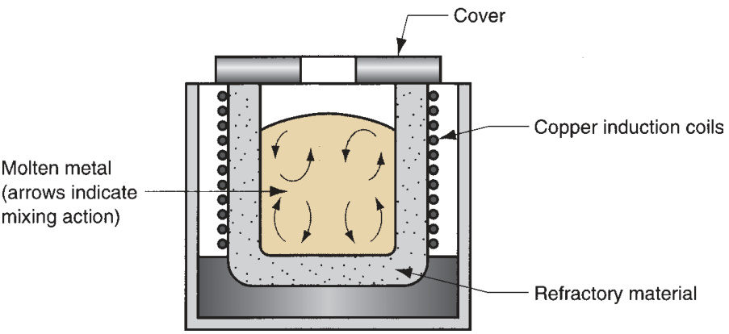  

force fi  eld causes a mixing action to occur in the liquid metal. Also, since the metal  does not come in direct contact with the heating elements, the environment in which  melting takes place can be closely controlled. All of this results in molten metals of  high quality and purity, and induction furnaces are used for nearly any casting alloy  when these requirements are important. Melting steel, cast iron, and aluminum al- loys are common applications in foundry work.  

# 11.4.2  POURING, CLEANING, AND HEAT TREATMENT  

Moving the molten metal from the melting furnace to the mold is sometimes done  using crucibles. More often, the transfer is accomplished by  ladles  of various kinds.  These ladles receive the metal from the furnace and allow for convenient pouring  into the molds. Two common ladles are illustrated in Figure 11.23, one for handling  large volumes of molten metal using an overhead crane, and the other a “two-man  ladle” for manually moving and pouring smaller amounts.  

One of the problems in pouring is that oxidized molten metal can be introduced  into the mold. Metal oxides reduce product quality, perhaps rendering the casting  defective, so measures are taken to minimize the entry of these oxides into the mold  during pouring. Filters are sometimes used to catch the oxides and other impurities  as the metal is poured from the spout, and fl  uxes are used to cover the molten metal  to retard oxidation. In addition, ladles have been devised to pour the liquid metal  from the bottom, since the top surface is where the oxides accumulate.  

After the casting has solidifi  ed and been removed from the mold, a number of  additional steps are usually required. These operations include (1) trimming, (2)  removing the core, (3) surface cleaning, (4) inspection, (5) repair, if required, and  (6) heat treatment. Steps (1) through (5) are collectively referred to in foundry work  as “cleaning.” The extent to which these additional operations are required varies  with casting processes and metals. When required, they are usually labor-intensive  and costly.  

Trimming  involves removal of sprues, runners, risers, parting-line fl  ash, fi  ns, chap- lets, and any other excess metal from the cast part. In the case of brittle casting alloys  and when the cross sections are relatively small, these appendages on the casting can  be broken off. Otherwise, hammering, shearing, hack-sawing, band-sawing, abrasive  wheel cutting, or various torch cutting methods are used.  

FIGURE 11.23  Two  common types of  ladles: (a) crane ladle  and (b) two-man ladle.  

  

If cores have been used to cast the part, they must be removed. Most cores are  chemically bonded or oil-bonded sand, and they often fall out of the casting as the  binder deteriorates. In some cases, they are removed by shaking the casting, either  manually or mechanically. In rare instances, cores are removed by chemically dis- solving the bonding agent used in the sand core. Solid cores must be hammered or  pressed out.  

Surface cleaning is most important in the case of sand casting. In many of the  other casting methods, especially the permanent mold processes, this step can be  avoided.  Surface cleaning  involves removal of sand from the surface of the cast- ing and otherwise enhancing the appearance of the surface. Methods used to clean  the surface include tumbling, air-blasting with coarse sand grit or metal shot, wire  brushing, and chemical pickling (Section 27.1).  

Defects are possible in casting, and inspection is needed to detect their presence.  These quality issues are considered in the following section.  

Castings are often heat treated to enhance their properties, either for subsequent  processing operations such as machining or to bring out the desired properties for  application of the part.  

There are numerous opportunities for things to go wrong in a casting operation,  resulting in quality defects in the cast product. In this section, the common defects  that occur in casting are listed, and the inspection procedures to detect them are  indicated.  

Casting Defects   Some defects are common to any and all casting processes.  These defects are illustrated in Figure 11.24 and briefl  y described in the following:  

(a)  Misruns ,   which are castings that solidify before completely fi  lling the mold  cavity. Typical causes include (1) fl  uidity of the molten metal is insuffi  cient, (2)  pouring temperature is too low, (3) pouring is done too slowly, and/or (4) cross  section of the mold cavity is too thin.

 (b)  Cold Shuts ,   which occur when two portions of the metal fl  ow together but there  is a lack of fusion between them due to premature freezing. Its causes are similar  to those of a misrun.

 (c)  Cold shots ,   which result from splattering during pouring, causing the forma- tion of solid globules of metal that become entrapped in the casting. Pouring  procedures and gating system designs that avoid splattering can prevent this  defect.

 (d)  Shrinkage cavity  is a depression in the surface or an internal void in the cast- ing, caused by solidifi  cation shrinkage that restricts the amount of molten metal  available in the last region to freeze. It often occurs near the top of the casting,  in which case it is referred to as a “pipe.” See Figure 10.8(3). The problem can  often be solved by proper riser design.

 (e)  Microporosity  consists of a network of small voids distributed throughout the  casting caused by localized solidifi  cation shrinkage of the fi  nal molten metal in  the dendritic structure. The defect is usually associated with alloys, because of  the protracted manner in which freezing occurs in these metals.  

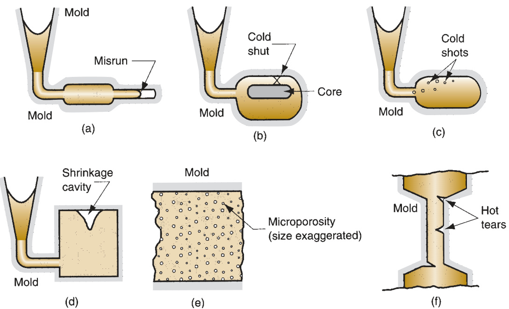  
FIGURE 11.24  Some  common defects in  castings: (a) misrun,  (b) cold shut, (c) cold  shot, (d) shrinkage  cavity, (e) microporosity,  and (f) hot tearing.  

(f)  Hot tearing ,   also called  hot cracking , occurs when the casting is restrained  from contraction by an unyielding mold during the fi  nal stages of solidifi  cation  or early stages of cooling after solidifi  cation. The defect is manifested as a sepa- ration of the metal (hence, the terms  tearing  and  cracking ) at a point of high  tensile stress caused by the metal’s inability to shrink naturally. In sand cast- ing and other expendable-mold processes, it is prevented by compounding the  mold to be collapsible. In permanent-mold processes, hot tearing is reduced by  removing the part from the mold immediately after solidifi  cation.  

Some defects are related to the use of sand molds, and therefore they occur only  in sand castings. To a lesser degree, other expendable mold processes are also sus- ceptible to these problems. Defects found primarily in sand castings are shown in  Figure 11.25 and described here:  

  
FIGURE 11.25  Common defects in  sand castings: (a) sand  blow, (b) pin holes, (c)  sand wash, (d) scabs,  (e) penetration, (f) mold  shift, (g) core shift, and  (h) mold crack.  

(a)  Sand blow  is a defect consisting of a balloon-shaped gas cavity caused by  release of mold gases during pouring. It occurs at or below the casting surface  near the top of the casting. Low permeability, poor venting, and high moisture  content of the sand mold are the usual causes.

 (b)  Pinholes ,   also caused by release of gases during pouring, consist of many small  gas cavities formed at or slightly below the surface of the casting.

 (c)  Sand wash ,   which is an irregularity in the surface of the casting that results  from erosion of the sand mold during pouring, and the contour of the erosion is  formed in the surface of the fi  nal cast part.

 (d)  Scabs  are rough areas on the surface of the casting due to encrustations of sand  and metal. It is caused by portions of the mold surface fl  aking off during solidi- fi  cation and becoming imbedded in the casting surface.

 (e)  Penetration  refers to a surface defect that occurs when the fl  uidity of the liquid  metal is high, and it penetrates into the sand mold or sand core. Upon freezing,  the casting surface consists of a mixture of sand grains and metal. Harder pack- ing of the sand mold helps to alleviate this condition.

 (f)  Mold shift  refers to a defect caused by a sidewise displacement of the mold  cope relative to the drag, the result of which is a step in the cast product at the  parting line.

 (g)  Core shift  is similar to mold shift, but it is the core that is displaced, and the dis- placement is usually vertical. Core shift and mold shift are caused by buoyancy  of the molten metal (Section 11.1.3).

 (h)  Mold crack  occurs when mold strength is insuffi  cient, and a crack develops, into  which liquid metal can seep to form a “fi  n” on the fi  nal casting.  

Inspection Methods   Foundry inspection procedures include (1) visual inspection  to detect obvious defects such as misruns, cold shuts, and severe surface fl  aws; (2)  dimensional measurements to ensure that tolerances have been met; and (3) metal- lurgical, chemical, physical, and other tests concerned with the inherent quality of  the cast metal [7]. Tests in category (3) include: (a) pressure testing—to locate leaks  in the casting; (b) radiographic methods, magnetic particle tests, the use of fl  uores- cent penetrants, and supersonic testing—to detect either surface or internal defects  in the casting; and (c) mechanical testing to determine properties such as tensile  strength and hardness. If defects are discovered but are not too serious, it is often  possible to save the casting by welding, grinding, or other salvage methods to which  the customer has agreed.  

Most commercial castings are made of alloys rather than pure metals. Alloys are  generally easier to cast, and properties of the resulting product are better. Casting  alloys can be classifi  ed as ferrous or nonferrous. The ferrous category is subdivided  into cast iron and cast steel.  

Ferrous Casting Alloys: Cast Iron   Cast iron is the most important of all cast- ing alloys (Historical Note 11.3). The tonnage of cast iron castings is several times  that of all other metals combined. There are several types of cast iron: (1) gray  cast iron, (2) nodular iron, (3) white cast iron, (4) malleable iron, and (5) alloy cast  irons (Section 6.2.4). Typical pouring temperatures for cast iron are around $1400^{\circ}\mathrm{C}$   $(2500^{\circ}\mathrm{F})$ , depending on composition.  

# H istorical  N ote  11.3   Early cast iron products  

In the early centuries of casting, bronze and brass  were preferred over cast iron as foundry metals. Iron  was more diffi  cult to cast, due to its higher melting  temperatures and lack of knowledge about its metal- lurgy. Also, there was little demand for cast iron prod- ucts. This all changed starting in the sixteenth and  seventeenth centuries.  

The art of sand casting iron entered Europe from  China, where iron was cast in sand molds more than  2,500 years ago. In 1550 the fi  rst cannons were cast  from iron in Europe. Cannon balls for these guns were  made of cast iron starting around 1568. Guns and their  projectiles created a large demand for cast iron. But  these items were for military rather than civilian use.  Two cast iron products that became signifi  cant to the  general public in the sixteenth and seventeenth centu- ries were the cast iron stove and cast iron water pipe.  

As unspectacular a product as it may seem today,  the cast iron stove brought comfort, health, and  improved living conditions to many people in Europe  and America. During the 1700s, the manufacture of  cast iron stoves was one of the largest and most prof- itable industries on these two continents. The com- mercial success of stove making was due to the large  demand for the product and the art and technology of  casting iron that had been developed to produce it.  

Cast iron water pipe was another product that  spurred the growth of the iron casting industry. Until  the advent of cast iron pipes, a variety of methods  had been tried to supply water directly to homes  and shops, including hollow wooden pipes (which  quickly rotted), lead pipes (too expensive), and open  trenches (susceptible to pollution). Development of  the iron-casting process provided the capability to  fabricate water pipe sections at relatively low cost.  Cast iron water pipes were used in France starting  in 1664, and later in other parts of Europe. By the  early 1800s, cast iron pipe lines were being widely  installed in England for water and gas delivery. The  fi  rst signifi  cant water pipe installation in the United  States was in Philadelphia in 1817 , using pipe  imported from England.  

Ferrous Casting Alloys: Steel   The mechanical properties of steel make it an  attractive engineering material, and the capability to create complex geometries  makes casting an appealing process. However, great diffi  culties are faced by the  foundry specializing in steel. First, the melting point of steel is considerably higher  than for most other metals that are commonly cast. The solidifi  cation range for low  carbon steels (Figure 6.4) begins at just under  $1540^{\circ}\mathrm{C}$   $(2800^{\circ}\mathrm{F})$ . This means that  the pouring temperature required for steel is very high—about  $1650^{\circ}\mathrm{C}$   $(3000^{\circ}\mathrm{F})$ ). At  these high temperatures, steel is chemically very reactive. It readily oxidizes, so spe- cial procedures must be used during melting and pouring to isolate the molten metal  from air. Also, molten steel has relatively poor fl  uidity, and this limits the design of  thin sections in components cast out of steel.  

Several characteristics of steel castings make it worth the effort to solve these  problems. Tensile strength is higher than for most other casting metals, ranging  upward from about  $410\,\mathrm{MPa}$   $(60,\!000\,\mathrm{lb}/\mathrm{in}^{2})$ ) [9]. Steel castings have better toughness  than most other casting alloys. The properties of steel castings are isotropic; strength  is virtually the same in all directions. By contrast, mechanically formed parts (e.g.,  rolling, forging) exhibit directionality in their properties. Depending on the require- ments of the product, isotropic behavior of the material may be desirable. Another  advantage of steel castings is ease of welding. They can be readily welded without  signifi  cant loss of strength, to repair the casting, or to fabricate structures with other  steel components.  

Nonferrous Casting Alloys   Nonferrous casting metals include alloys of aluminum,  magnesium, copper, tin, zinc, nickel, and titanium (Section 6.3).  Aluminum alloys are generally considered to be very castable. The melting point of pure aluminum is  $660^{\circ}\mathrm{C}$   $(1220^{\circ}\mathrm{F})$ , so pouring temperatures for aluminum casting alloys are low com- pared to cast iron and steel. Their properties make them attractive for castings: light  weight, wide range of strength properties attainable through heat treatment, and ease  of machining.  Magnesium alloys  are the lightest of all casting metals. Other proper- ties include corrosion resistance, as well as high strength-to-weight and stiffness-to- weight ratios.  

Copper alloys  include bronze, brass, and aluminum bronze. Properties that make  them attractive include corrosion resistance, attractive appearance, and good bearing  qualities. The high cost of copper is a limitation on the use of its alloys. Applications  include pipe fi  ttings, marine propeller blades, pump components, and ornamental  jewelry.  

Tin has the lowest melting point of the casting metals.  Tin-based alloys  are  generally easy to cast. They have good corrosion resistant but poor mechanical  strength, which limits their applications to pewter mugs and similar products not  requiring high strength.  Zinc alloys  are commonly used in die casting. Zinc has  a low melting point and good fl  uidity, making it highly castable. Its major weak- ness is low creep strength, so its castings cannot be subjected to prolonged high  stresses.  

Nickel alloys  have good hot strength and corrosion resistance, which make them  suited to high-temperature applications such as jet engine and rocket components,  heat shields, and similar components. Nickel alloys also have a high melting point  and are not easy to cast.  Titanium alloys  for casting are corrosion resistant and pos- sess high strength-to-weight ratios. However, titanium has a high melting point, low  fl  uidity, and a propensity to oxidize at high temperatures. These properties make it  and its alloys diffi  cult to cast.  

# 11.7 11.7  Product Design Considerations  

If casting is selected by the product designer as the primary manufacturing process  for a particular component, then certain guidelines should be followed to facilitate  production of the part and avoid many of the defects enumerated in Section 11.5.  Some of the important guidelines and considerations for casting are presented here.  

➢   Geometric simplicity . Although casting is a process that can be used to produce  complex part geometries, simplifying the part design will improve its castability.  Avoiding unnecessary complexities simplifi  es mold making, reduces the need  for cores, and improves the strength of the casting.

 ➢   Corners .   Sharp corners and angles should be avoided, because they are sources  of stress concentrations and may cause hot tearing and cracks in the casting.  Generous fi  llets should be designed on inside corners, and sharp edges should  be blended.  

  
FIGURE 11.26  (a) Thick section at intersection can result in a shrinkage cavity. Remedies  include (b) redesign to reduce thickness and (c) use of a core.  

$\succcurlyeq$ Section thicknesses .   Section thicknesses should be uniform in order to avoid  shrinkage cavities. Thicker sections create  hot spots  in the casting, because  greater volume requires more time for solidifi  cation and cooling. These are  likely locations of shrinkage cavities. Figure 11.26 illustrates the problem and  

➢   Draft .   Part sections that project into the mold should have a draft or taper, as  defi  ned in Figure 11.27. In expendable mold casting, the purpose of this draft  is to facilitate removal of the pattern from the mold. In permanent mold cast- ing, its purpose is to aid in removal of the part from the mold. Similar tapers  should be allowed if solid cores are used in the casting process. The required  draft need only be about $1^{\circ}$  for sand casting and $2^{\circ}$  to $3^{\circ}$  for permanent mold  processes. ➢   Use of cores.  Minor changes in part design can reduce the need for coring, as  shown in Figure 11.27. $\succcurlyeq$ Dimensional tolerances.  There are signifi  cant differences in the dimensional  accuracies that can be achieved in castings, depending on which process is used.  Table 11.2 provides a compilation of typical part tolerances for various casting  processes and metals. $\succcurlyeq$   Surface fi  nish.  Typical surface roughness achieved in sand casting is around  $6~\mu\mathrm{m}$   $250~\mu$ -in). Similarly poor fi  nishes are obtained in shell molding, while  plaster-mold and investment casting produce much better roughness values:  $0.75\ \mu\mathrm{m}$  ( $30\;\mu$ -in). Among the permanent mold processes, die casting is noted  for good surface fi  nishes at around $1\;\mu\mathrm{m}$  ( $40\,\mu$ -in). ➢   Machining allowances.  Tolerances achievable in many casting processes are  insuffi  cient to meet functional needs in many applications. Sand casting is  the most prominent example of this defi  ciency. In these cases, portions of  the casting must be machined to the required dimensions. Almost all sand  

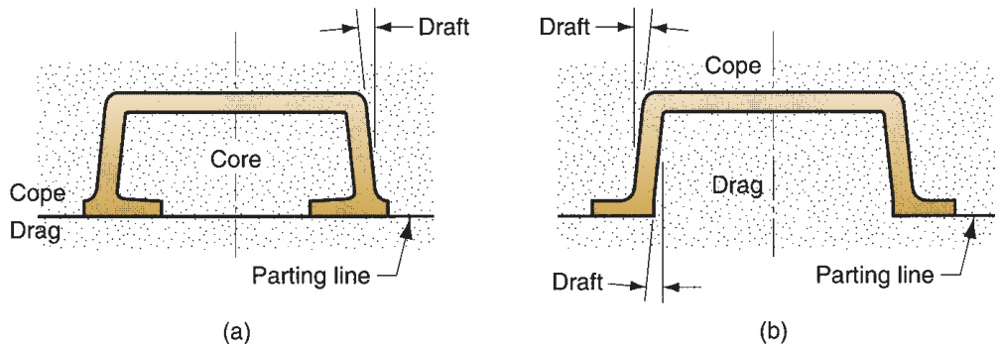  
FIGURE 11.27  Design  change to eliminate the  need for using a core:  (a) original design and  (b) redesign.  

TABLE •  11.2  Typical dimensional tolerances for various casting processes and metals. 
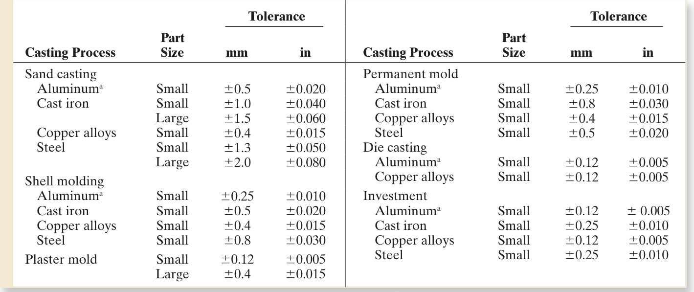  
Compiled from [7], [16], and other sources. a Values for aluminum also apply to magnesium.  

castings must be machined to some extent in order for the part to be made  functional. Therefore, additional material, called the  machining allowance , is  left on the casting for machining those surfaces where necessary. Typical ma- chining allowances for sand castings range between  $1.5~\mathrm{mm}$  and  $3~\mathrm{mm}$  (1/16  in and 1/4 in).  

# References  

[1] Amstead, B. H., Ostwald, P . F., and Begeman,  M. L.  Manufacturing Processes . John Wiley &  Sons, New York, 1987.

  [2] Beeley, P . R.  Foundry Technology . Newnes- Butterworths, London, 1972.

  [3] Black, J., and Kohser, R.  DeGarmo’s Materi- als and Processes in Manufacturing , 11th ed.  John Wiley & Sons, Hoboken, New Jersey,  2012.

  [4] Datsko, J.  Material Properties and Manu- facturing Processes . John Wiley & Sons, New  York, 1966.

  [5] Decker, R. F., D. M. Walukas, S. E. LeBeau,  R. E. Vining, and N. D. Prewitt. “Advances in  Semi-Solid Molding,”  Advanced Materials &  Processes , April 2004, pp 41–42.  

[6] Flinn, R. A.  Fundamentals of Metal Casting .  American Foundrymen’s Society, Des Plaines,  Illinois, 1987.

  [7] Heine, R. W., Loper, Jr., C R., and Rosenthal, C.  Principles of Metal Casting , 2nd ed. McGraw- Hill, New York, 1967.

  [8] Kotzin, E. L.  Metalcasting & Molding Proc- esses . American Foundrymen’s Society, Des  Plaines, Illinois, 1981.

  [9]  Metals Handbook .   Vol. 15:  Casting . ASM  International, Materials Park, Ohio, 2008.

 [10] Mikelonis, P . J. (ed.).  Foundry Technology . Amer- ican Society for Metals, Metals Park, Ohio, 1982.

 [11] Mueller, B. “Investment Casting Trends,”  Advanced Materials & Processes , March 2005,  pp. 30–32.  