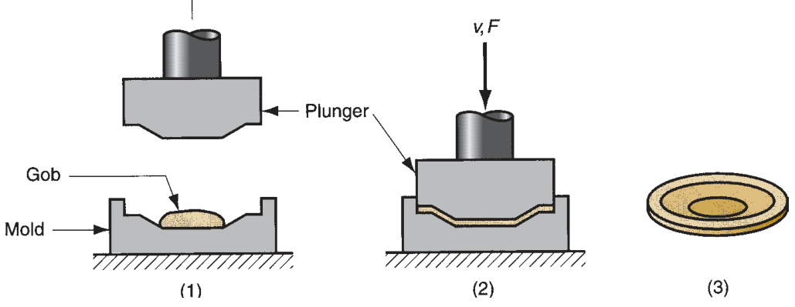
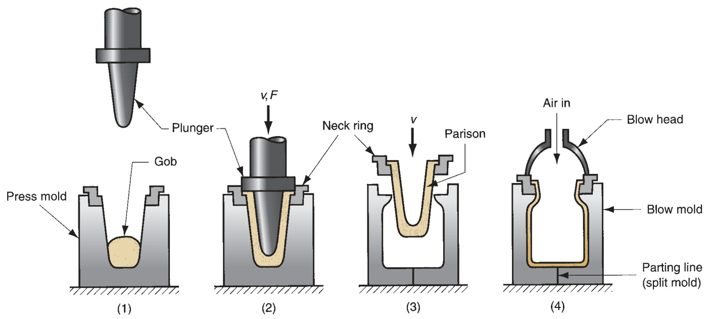
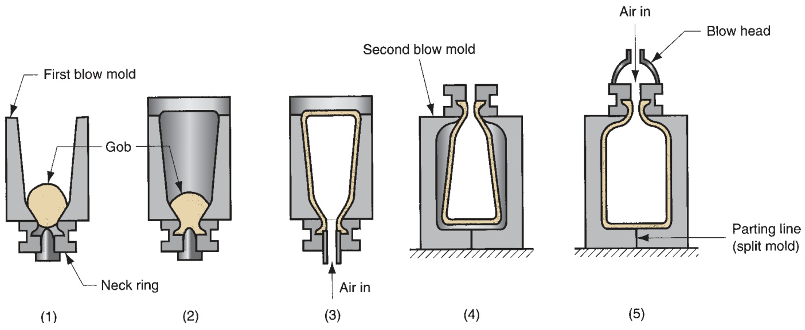
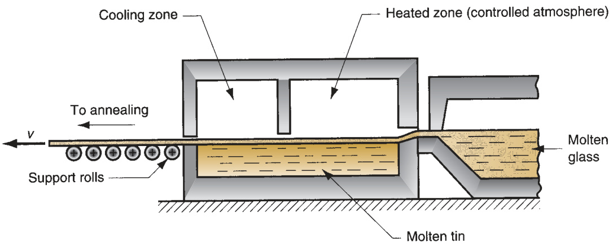
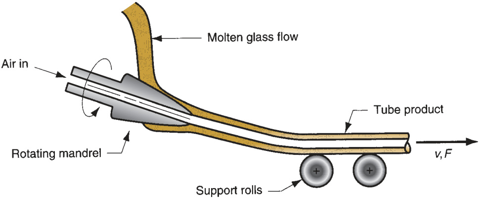

# Glassworking  

# Chapter Contents  

12.1 Raw Materials Preparation and  Melting  

12.2 Shaping Processes in Glassworking 12.2.1 Shaping of Piece Ware 12.2.2 Shaping of Flat and Tubular  Glass 12.2.3 Forming of Glass Fibers  

12.3 Heat Treatment and Finishing 12.3.1 Heat Treatment 12.3.2 Finishing  

12.4 Product Design Considerations  

Glass products are commercially manufactured in an  almost unlimited variety of shapes. Many are produced  in very large quantities, such as light bulbs, beverage  bottles, and window glass. Others, such as giant tele- scope lenses, are made individually.  

Glass is one of three basic types of ceramics (Chap- ter 7). It is distinguished by its noncrystalline (vitreous)  structure, whereas the other ceramic materials have  a crystalline structure. The methods by which glass is  shaped into useful products are quite different from  those used for the other types. In glassworking, the  principal starting material is silica  $(\mathrm{SiO}_{2})$ ; this is usually  combined with other oxide ceramics that form glasses.  The starting material is heated to transform it from a  hard solid into a viscous liquid; it is then shaped into  the desired geometry while in this highly plastic or fl  uid  condition. When cooled and hard, the material remains  in the glassy state rather than crystallizing.  

The typical manufacturing sequence in glassworking  consists of the steps pictured in Figure 12.1. Shaping is  accomplished by various processes, including casting,  pressing-and-blowing (to produce bottles and other  containers), and rolling (to make plate glass). A fi  nish- ing step is required for certain products.  

#  

# Raw Materials  Preparation and  Melting  

The main component in nearly all glasses is silica, the  primary source of which is natural quartz in sand. The  sand must be washed and classifi  ed. Washing removes  impurities such as clay and certain minerals that would  cause undesirable coloring of the glass.  Classifying  the  sand means grouping the grains according to size. The  most desirable particle size for glassmaking is in the  range of 0.1 to $0.6\;\mathrm{mm}$  (0.004–0.025 in) [3]. The various  other components, such as soda ash (source of  $\mathrm{Na}_{2}\mathrm{O}_{l}$ ),  limestone (source of  $\mathrm{CaO}$ ), aluminum oxide, potash  

  
FIGURE 12.1  The  typical   process  sequence in  glassworking:  (1) preparation of  raw materials and  melting, (2)   shaping,  and (3) heat   treatment.  

(source of  $\mathrm{K}_{2}\mathrm{O}$ ), and other minerals are added in the proper proportions to achieve  the desired composition. The mixing is usually done in batches, in amounts that are  compatible with the capacities of available melting furnaces.  

Recycled glass is usually added to the mixture in modern practice. In addition  to preserving the environment, recycled glass facilitates melting. Depending on the  amount of waste glass available and the specifi  cations of the fi  nal composition, the  proportion of recycled glass may be up to $100\%$ .  

The batch of starting materials to be melted is referred to as a  charge , and the pro- cedure of loading it into the melting furnace is called  charging  the furnace. Glass- melting furnaces can be divided into the following types [3]: (1)  pot furnaces —  ceramic pots of limited capacity in which melting occurs by heating the walls of the  pot; (2)  day tanks —larger capacity vessels for batch production in which heating is  done by burning fuels above the charge; (3)  continuous tank furnaces —long tank  furnaces in which raw materials are fed in one end, and melted as they move to the  other end where molten glass is drawn out for high production; and (4)  electric fur- naces  of various designs for a wide range of production rates.  

Glass melting is generally carried out at temperatures around  $1500^{\circ}\mathrm{C}$  to  $1600^{\circ}\mathrm{C}$ $(2700^{\circ}\mathrm{F}{-}2900^{\circ}\mathrm{F})$ ). The melting cycle for a typical charge takes 24 to 48 hours. This  is the time required for all of the sand grains to become a clear liquid and for the  molten glass to be refi  ned and cooled to the appropriate temperature for working.  Molten glass is a viscous liquid, the viscosity being inversely related to temperature.  Because the shaping operation immediately follows the melting cycle, the tempera- ture at which the glass is tapped from the furnace depends on the viscosity required  for the subsequent process.  

#  Shaping Processes in Glassworking  

The major categories of glass products were identifi  ed in Section 7.4.2 as window  glass, containers, light bulbs, laboratory glassware, glass fi  bers, and optical glass. De- spite the variety represented by this list, the shaping processes to fabricate these  products can be grouped into only three categories: (1) discrete processes for piece  ware, which includes bottles, light bulbs, and other individual items; (2) continuous  processes for making fl  at glass (sheet and plate glass for windows) and tubing (for  laboratory ware and fl  uorescent lights); and (3) fi  ber-making processes to produce  fi  bers for insulation, fi  berglass composite materials, and fi  ber optics.  

# 12.2.1  SHAPING OF PIECE WARE  

The ancient methods of hand-working glass, such as glass blowing, were briefl  y  described in Historical Note 7.3. Handicraft methods are still employed today for  making glassware items of high value in small quantities. Most of the processes  

  
FIGURE 12.2  Spinning of  funnel-shaped glass parts:  (1) gob of glass dropped into  mold; and (2) rotation of mold  to cause spreading of molten  glass on mold surface.  

discussed in this section are highly mechanized technologies for producing discrete  pieces such as jars, bottles, and light bulbs in high quantities.  

Spinning  Glass spinning is similar to  centrifugal casting  of metals, and is also  known by that name in glassworking. It is used to produce funnel-shaped compo- nents such as the back sections of cathode ray tubes for televisions and computer  monitors. The setup is pictured in Figure 12.2. A gob of molten glass is dropped into  a conical mold made of steel. The mold is rotated so that centrifugal force causes  the glass to fl  ow upward and spread itself on the mold surface. The faceplate (i.e.,  the front viewing screen) is later assembled to the funnel using a sealing glass of low  melting point.  

Pressing  This is a widely used process for mass producing glass pieces such as dishes,  bake ware, headlight lenses, TV tube faceplates, and similar items that are relatively  fl  at. The process is illustrated and described in Figure 12.3. The large quantities of most  pressed products justify a high level of automation in this production sequence.  

Blowing  Several shaping sequences include blowing as one or more of the steps.  Instead of a manual operation, blowing is performed on highly automated equip- ment. The two sequences described here are the press-and-blow and blow-and-blow  methods.  

As the name indicates, the  press-and-blow  method is a pressing operation fol- lowed by a blowing operation, as portrayed in Figure 12.4. The process is suited to  

  
FIGURE 12.3  Pressing  of a fl  at glass piece:  (1) a gob of glass fed  into mold from the  furnace; (2) pressing  into shape by plunger;  and (3) plunger is  retracted and the  fi  nished product is  removed. Symbols  v  and  $F$ indicate motion  $\left\vert v=\right\vert$   velocity) and applied  force, respectively.  

  
FIGURE 12.4  Press-and-blow forming sequence: (1) molten gob is fed into mold cavity; (2) pressing to form a  parison ; (3) the partially formed parison, held in a neck ring, is transferred to the blow mold; and (4) blown into  fi  nal shape. Symbols $v$  and $F$  indicate motion ( $v=$  velocity) and applied force, respectively.  

the production of wide-mouth containers. A split mold is used in the blowing opera- tion for part removal. The  blow-and-blow  method is used to produce smaller-mouthed bottles. The se- quence is similar to the preceding, except that two (or more) blowing operations are  used rather than pressing and blowing. There are variations to the process, depend- ing on the geometry of the product, with one possible sequence shown in Figure 12.5.  

  
FIGURE 12.5  Blow-and-blow forming sequence: (1) gob is fed into inverted mold cavity; (2) mold is covered;  (3) fi  rst blowing step; (4) partially formed piece is reoriented and transferred to second blow mold; and (5) blown  to fi  nal shape.  

Reheating is sometimes required between blowing steps. Duplicate and triplicate  molds are sometimes used along with matching gob feeders to increase production  rates. Press-and-blow and blow-and-blow methods are used to make jars, beverage  bottles, incandescent light bulb enclosures, and similar geometries.  

Casting  If the molten glass is suffi  ciently fl  uid, it can be poured into a mold. Rela- tively massive objects, such as astronomical lenses and mirrors, are made by this  method. These pieces must be cooled very slowly to avoid internal stresses and pos- sible cracking owing to temperature gradients that would otherwise be set up in  the glass. After cooling and solidifying, the piece must be fi  nished by lapping and  polishing. Casting is not much used in glassworking except for these kinds of special  jobs. Not only is cooling and cracking a problem, but also molten glass is relatively  viscous at normal working temperatures, and does not fl  ow through small orifi  ces or  into small sections as well as molten metals or heated thermoplastics. Smaller lenses  are usually made by pressing, discussed above.  

# 12.2.2  SHAPING OF FLAT AND TUBULAR GLASS  

Two methods for making plate glass and one method for producing tube stock are  described here. They are continuous processes, in which long sections of fl  at window  glass or glass tubing are made and later cut into appropriate sizes and lengths. They  are modern technologies in contrast to the ancient method described in Historical  Note 12.1.  

# Historical Note 12.1  Ancient methods of making fl  at glass  [7]  

Glass windows have been used in buildings for many  centuries. The oldest process for making fl  at window  glass was by manual glass blowing. The procedure  consisted of the following: (1) a glass globe was blown  on a blowpipe; (2) a portion of the globe was made  to stick to the end of a “punty, ” a metal rod used by  glassblowers, and then detached from the blowpipe;  and (3) after reheating the glass, the punty was rotated  with suffi  cient speed for centrifugal force to shape the  open globe into a fl  at disk. The disk, whose maximum  possible size was only about  $1\,\mathrm{~m~}$  (3 ft), was later cut  into small panes for windows.  

At the center of the disk, where the glass was  attached to the punty during the third step in the  process, a lump would tend to form that had the ap- pearance of a crown. The name “crown glass” was  derived from this resemblance. Lenses for spectacles  were ground from glass made by this method. Today,  the name crown glass is still used for certain types  of optical and ophthalmic glass, even though the an- cient method has been replaced by modern produc- tion technology.  

Rolling of Flat Plate  Flat plate glass can be produced by rolling, as illustrated in  Figure 12.6. The starting glass, in a suitably plastic condition from the furnace, is  squeezed through opposing rolls whose separation determines the thickness of the  sheet. The rolling operation is usually set up so that the fl  at glass is moved directly  into an annealing furnace. The rolled glass sheet must later be ground and polished  for parallelism and smoothness.  

  
FIGURE 12.6  Rolling  of fl  at glass.  

  
FIGURE 12.7  The fl  oat  process for producing  sheet glass.  

Float Process  This process was developed in the late 1950s. Its advantage over  other methods such as rolling is that it obtains smooth surfaces that need no sub- sequent fi  nishing. In the  fl  oat process , illustrated in Figure 12.7, the glass fl  ows di- rectly from its melting furnace onto the surface of a molten tin bath. The highly fl  uid  glass spreads evenly across the molten tin surface, achieving a uniform thickness and  smoothness. After moving into a cooler region of the bath, the glass hardens and  travels through an annealing furnace, after which it is cut to size.  

Drawing of Glass Tubes  Glass tubing is manufactured by a drawing process  known as the  Danner process , illustrated in Figure 12.8. Molten glass fl  ows around a  rotating hollow mandrel through which air is blown while the glass is being drawn.  The air temperature and its volumetric fl  ow rate, as well as the drawing velocity,  

  
FIGURE 12.8  Drawing  of glass tubes by  the Danner   process.  Symbols $v$ and $F$ indicate motion  $\vert v=$   velocity) and applied  force, respectively.  

determine the diameter and wall thickness of the tubular cross section. During hard- ening, the glass tube is supported by a series of rollers extending about  $30\:\mathrm{m}$  (100 ft)  beyond the mandrel. The continuous tubing is then cut into standard lengths.  Tubular glass products include laboratory glassware, fl  uorescent light tubes, and  thermometers.  

# 12.2.3  FORMING OF GLASS FIBERS  

Glass fi  bers are used in applications ranging from insulation wool to fi  ber optics  communications lines (Section 7.4.2). Glass fi  ber products can be divided into two  categories [6]: (1) fi  brous glass for thermal insulation, acoustical insulation, and air  fi  ltration, in which the fi  bers are in a random, wool-like condition; and (2) long, con- tinuous fi  laments suitable for fi  ber-reinforced plastics, yarns and fabrics, and fi  ber  optics. Different production methods are used for the two categories. Two methods  are described in the following paragraphs, representing each of the product catego- ries, respectively.  

Centrifugal Spraying  In a typical process for making glass wool, molten glass  fl  ows into a rotating bowl with many small orifi  ces around its periphery. Centrifugal  force causes the glass to fl  ow through the holes to become a fi  brous mass suitable for  thermal and acoustical insulation.  

Drawing of Continuous Filaments  In this process, illustrated in Figure 12.9,  continuous glass fi  bers of small diameter (lower size limit is around  $0.0025~\mathrm{mm}$  or  0.0001 in) are produced by drawing strands of molten glass through small orifi  ces in  

  

a heated plate made of a platinum alloy. The plate may have several hundred holes,  each making one fi  ber. The individual fi  bers are collected into a strand by reeling  them onto a spool. Before spooling, the fi  bers are coated with various chemicals  to lubricate and protect them. Drawing speeds of around  $50\;\mathrm{m/s}$   $(10{,}000\;\mathrm{ft/min})$ ) or  more are not unusual.  

#  Heat Treatment and Finishing  

Heat treatment of the glass product is the third step in the glassworking sequence.  For some products, additional fi  nishing operations are performed.  

# 12.3.1  HEAT TREATMENT  

Glass-ceramics were discussed in Section 7.4.3. This unique material is made by a  special heat treatment that transforms most of the vitreous state into a polycrys- talline ceramic. Other heat treatments performed on glass cause changes that are  less dramatic technologically but perhaps more important commercially; examples  include annealing and tempering.  

Annealing  Glass products usually have undesirable internal stresses after form- ing, which reduce their strength. Annealing is done to relieve these stresses; the  treatment therefore has the same function in glassworking as it does in metalwork- ing.  Annealing  involves heating the glass to an elevated temperature and holding  it for a certain period to eliminate stresses and temperature gradients, then slowly  cooling the glass to suppress stress formation, followed by more rapid cooling to  room temperature. Common annealing temperatures are around $500^{\circ}\mathrm{C}\left(900^{\circ}\mathrm{F}\right)$ . The  length of time the product is held at the temperature, as well as the heating and cool- ing rates during the cycle, depend on thickness of the glass, the usual rule being that  the required annealing time varies with the square of thickness.  

Annealing in modern glass factories is performed in tunnel-like furnaces, called  lehrs , in which the products fl  ow slowly through the hot chamber on conveyors.  Burners are located only at the front end of the chamber, so that the glass experi- ences the required heating and cooling cycle.  

Tempered Glass and Related Products  A benefi  cial internal stress pattern can be  developed in glass products by a heat treatment known as  tempering , and the result- ing material is called  tempered glass . As in the treatment of hardened steel, tempering  increases the toughness of glass. The process involves heating the glass to a tempera- ture somewhat above its annealing temperature and into the plastic range, followed by  quenching of the surfaces, usually with air jets. When the surfaces cool, they contract  and harden while the interior is still plastic and compliant. As the internal glass slowly  cools, it contracts, thus putting the hard surfaces in compression. Like other ceramics,  glass is much stronger when subjected to compressive stresses than tensile stresses. Ac- cordingly, tempered glass is much more resistant to scratching and breaking because  of the compressive stresses on its surfaces. Applications include windows for tall build- ings, all-glass doors, safety glasses, and other products requiring toughened glass.  

When tempered glass fails, it does so by shattering into numerous small frag- ments that are less likely to cut someone than conventional (annealed) window  glass.   Interestingly, automobile windshields are not made of tempered glass, because  

of the danger posed to the driver by this fragmentation. Instead, conventional glass  is used; however, it is fabricated by sandwiching two pieces of glass on either side of  a tough polymer sheet. Should this  laminated glass  fracture, the glass splinters are  retained by the polymer sheet and the windshield remains relatively transparent.  

# 12.3.2  FINISHING  

Finishing operations are sometimes required for glassware products. These sec- ondary operations include grinding, polishing, and cutting. When glass sheets are  produced by drawing and rolling, the opposite sides are not necessarily parallel, and  the surfaces contain defects and scratch marks caused by the use of hard tooling on  soft glass. The glass sheets must be ground and polished for most commercial ap- plications. In pressing and blowing operations when split dies are used, polishing is  often required to remove the seam marks from the container product.  

In continuous glassworking processes, such as plate and tube production, the con- tinuous sections must be cut into smaller pieces. This is accomplished by fi  rst scoring  the glass with a glass-cutting wheel or cutting diamond and then breaking the section  along the score line. Cutting is generally done as the glass exits the annealing lehr.  

Decorative and surface processes are performed on certain glassware products.  These processes include mechanical cutting and polishing operations; sandblasting;  chemical etching (with hydrofl  uoric acid, often in combination with other chemi- cals); and coating (for example, coating of plate glass with aluminum or silver to  produce mirrors).  

# 12.4 12.4  Product Design Considerations  

Glass possesses special properties that make it desirable in certain applications. The  following design recommendations are compiled from Bralla [1] and other sources.  

$\gg$ Glass is transparent and has certain optical properties that are unusual if not  unique among engineering materials. For applications requiring transparency,  light transmittance, magnifi  cation, and similar optical properties, glass is likely  to be the material of choice. Certain polymers are transparent and may be com- petitive, depending on design requirements.

 $\gg$   Glass is several times stronger in compression than in tension; components  should be designed so that they are subjected to compressive stresses, not ten- sile stresses.

 $\gg$ Ceramics, including glass, are brittle. Glass parts should not be used in applica- tions that involve impact loading or high stresses which might cause fracture.

 $\gg$ Certain glass compositions have very low thermal expansion coeffi  cients and  are therefore tolerant of thermal shock. These glasses can be selected for appli- cations in which this characteristic is important (e.g., cookware).

 $\gg$ Outside edges and corners on glass parts should have large radii or chamfers;  likewise, inside corners should have large radii. Both outside and inside corners  are potential points of stress concentration.

 $\gg$ Unlike parts made of traditional and new ceramics, threads may be included in  the design of glass parts; they are technically feasible with the press-and-blow  shaping processes. However, the threads should be coarse.  