# Part IV   Particulate  Processing of Metals  and Ceramics  

  

# Chapter Contents  

15.1  Characterization of Engineering Powders  

15.1.1 Geometric Features 15.1.2 Other Features  

15.2  Production of Metallic Powders  

15.2.1 Atomization 15.2.2 Other Production Methods  

# 15.3  Conventional Pressing and Sintering  

15.3.1 Blending and Mixing of the Powders 15.3.2 Compaction 15.3.3 Sintering 15.3.4 Secondary Operations  

15.4  Alternative Pressing and Sintering  Techniques  

15.4.1 Isostatic Pressing 15.4.2 Powder Injection Molding 15.4.3 Powder Rolling, Extrusion, and  Forging 15.4.4 Combined Pressing and Sintering 15.4.5 Liquid Phase Sintering  

15.5  Materials and Products for Powder  Metallurgy  

15.6  Design Considerations in Powder  Metallurgy  

This part of the book is concerned with the processing of  metals and ceramics that are in the form of powders— very small particulate solids. In the case of traditional  ceramics, the powders are produced by crushing and  grinding common materials that are found in nature,  such as silicate minerals (clay) and quartz. In the case of  metals and the new ceramics, the powders are produced  by a variety of industrial processes. The powder-making  processes as well as the methods used to shape products  out of powders are covered in two chapters: Chapter 15  on powder metallurgy and Chapter 16 on particulate  processing of ceramics and cermets.  

Powder metallurgy  (PM) is a metal processing  technology in which parts are produced from metallic  powders. In the usual PM production sequence, the  powders are compressed into the desired shape and  then heated to cause bonding of the particles into a  hard, rigid mass. Compression, called  pressing , is accom- plished in a press-type machine using tools designed  specifi  cally for the part to be manufactured. The tool- ing, which typically consists of a die and one or more  punches, can be expensive, and PM is therefore most  appropriate for medium and high production. The  heating treatment, called  sintering , is performed at a  temperature below the melting point of the metal. Con- siderations that make powder metallurgy an important  commercial technology include:  

$\succcurlyeq$ PM parts can be mass produced to  net shape  or  near net shape , eliminating or  reducing the need for subsequent processing.

 $\succcurlyeq$ The PM process itself involves very little waste of material; about $97\%$  of the starting  powders are converted to product. This compares favorably with casting pro  cesses  in which sprues, runners, and risers are wasted material in the production cycle.

 ➢   Owing to the nature of the starting material in PM, parts having a specifi  ed level  of porosity can be made. This feature lends itself to the production of porous  metal parts, such as fi  lters, and oil-impregnated bearings and gears.

 $\succcurlyeq$ Certain metals that are diffi  cult to fabricate by other methods can be shaped by  powder metallurgy. Tungsten is an example; tungsten fi  laments used in incandescent  lamp bulbs are made using PM technology.

 $\succcurlyeq$ Certain metal alloy combinations and cermets can be formed by PM that cannot  be produced by other methods.

 $\succcurlyeq$ PM compares favorably with most casting processes in terms of dimensional  control of the product. Tolerances of  $\pm0.13\;\mathrm{mm}$  ( $'\pm0.005$  in) are held routinely.

 $\succcurlyeq$ PM production methods can be automated for economical production.  

There are limitations and disadvantages associated with PM processing. These  include the following: (1) tooling and equipment costs are high, (2) metallic powders  are expensive, and (3) there are diffi  culties with storing and handling metal powders  (such as degradation of the metal over time, and fi  re hazards with particular metals).  Also, (4) there are limitations on part geometry because metal powders do not readily  fl  ow laterally in the die during pressing, and allowances must be provided for ejection  of the part from the die after pressing. In addition, (5) variations in material density  throughout the part may be a problem in PM, especially for complex part geometries. Although parts as large as $22\;\mathrm{kg}$  (50 lb) can be produced, most PM components  are less than $2.2\;\mathrm{kg}$  (5 lb). A collection of typical PM parts is shown in Figure 15.1.  

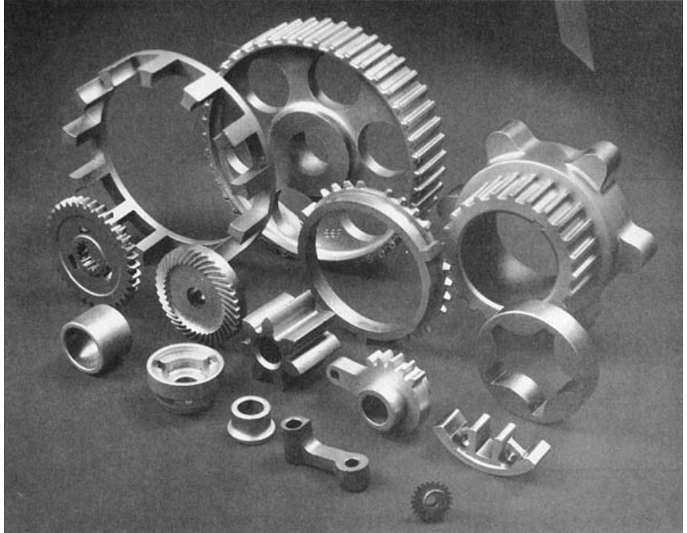  
FIGURE 15.1  A  collection of powder  metallurgy parts.  (Courtesy of Dorst  America, Inc.)  

The largest tonnage of metals for PM are alloys of iron, steel, and aluminum. Other  PM metals include copper, nickel, and refractory metals such as molybdenum and  tungsten. Metallic carbides such as tungsten carbide are often included within the  scope of powder metallurgy; however, because these materials are ceramics, their  consideration is deferred until the next chapter.  

The development of the modern fi  eld of powder metallurgy dates back to the  1800s (Historical Note 15.1). The scope of the modern technology includes not  only parts production but also preparation of the starting powders. Success in  powder metallurgy depends to a large degree on the characteristics of the start- ing powders; this topic is discussed in Section 15.1. Later sections describe pow- der production, pressing, and sintering. There is a close correlation between PM  technology and aspects of ceramics processing. In ceramics (except glass), the  starting material is also powder, so the methods for characterizing the powders  are closely related to those in PM. Several of the shape-forming methods are  similar, also.  

# Historical Note 15.1  Powder metallurgy  

Powders of metals such as gold and copper, as well  as some of the metallic oxides, have been used for  decorative purposes since ancient times. The uses  included decorations on pottery, bases for paints, and  in cosmetics. It is believed that the Egyptians used PM  to make tools as far back as 3000  B . C .  

The modern fi  eld of powder metallurgy dates to  the early nineteenth century, when there was a strong  interest in the metal platinum. Around 1815, English- man William Wollaston developed a technique for  preparing platinum powders, compacting them under  high pressure, and baking (sintering) them at red heat.  The Wollaston process marks the beginning of powder  metallurgy as it is practiced today.  

U.S. patents were issued in 1870 to S. Gwynn that  relate to PM self-lubricating bearings. He used a mix- ture of $99\%$  powdered tin and $1\,\%$  petroleum, mixing,  heating, and fi  nally subjecting the mixture to extreme  pressures to form it into the desired shape inside a  mold cavity.  

By the early 1900s, the incandescent lamp had  become an important commercial product. A variety  of fi  lament materials had been tried, including car- bon, zirconium, vanadium, and osmium; but it was  concluded that tungsten was the best fi  lament mate- rial. The problem was that tungsten was diffi  cult to  process because of its high melting point and unique  properties. In 1908, William Coolidge developed a  procedure that made production of tungsten incan- descent lamp fi  laments feasible. In his process, fi  ne  powders of tungsten oxide  $(\mathsf{W O}_{3})$  were reduced to  metallic powders, pressed into compacts, presin- tered, hot-forged into rounds, sintered, and fi  nally  drawn into fi  lament wire. The Coolidge process is  still used today to make fi  laments for incandescent  light bulbs.  

In the 1920s, cemented carbide tools (WC–Co)  were being fabricated by PM techniques (Historical  Note 7 .2). Self-lubricating bearings were produced in  large quantities starting in the 1930s. Powder metal  gears and other components were mass produced  in the 1960s and 1970s, especially in the automotive  industry; and in the 1980s, PM parts for aircraft turbine  engines were developed.  

#  Characterization of Engineering Powders  

A  powder  can be defi  ned as a fi  nely divided particulate solid. This section character- izes metallic powders. However, most of the discussion applies to ceramic powders  as well.  

# 15.1.1  GEOMETRIC FEATURES  

The geometry of the individual powders can be defi  ned by the following attributes:  (1) particle size and distribution, (2) particle shape and internal structure, and  (3) surface area.  

Particle Size and Distribution  Particle size refers to the dimensions of the in- dividual powders. If the particle shape is spherical, a single dimension is adequate.  For other shapes, two or more dimensions are needed. There are various methods  available to obtain particle size data. The most common method uses screens of  different mesh sizes. The term  mesh count  is used to refer to the number of open- ings per linear inch of screen. Higher mesh count indicates smaller particle size.  A mesh count of 200 means there are 200 openings per linear inch. Because the  mesh is square, the count is the same in both directions, and the total number of  openings per square inch is $200^{2}=40\small{,}000$ .  

Particles are sorted by passing them through a series of screens of progressively  smaller mesh size. The powders are placed on a screen of a certain mesh count and  vibrated so that particles small enough to fi  t through the openings pass through to  the next screen below. The second screen empties into a third, and so forth, so that  the particles are sorted according to size. A certain powder size might be called size  230 through 200, indicating that the powders have passed through the 200 mesh, but  not 230. The procedure of separating the powders by size is called  classifi  cation .  

The openings in the screen are less than the reciprocal of the mesh count because  of the thickness of the wire in the screen, as illustrated in Figure 15.2. Assuming that  the limiting dimension of the particle is equal to the screen opening,  

$$
P S={\frac{K}{M C}}-t_{w}
$$  

where $P S=$  particle size, mm (in); $M C=$  mesh count, openings per linear inch; and  $t_{w}=$  wire thickness of screen mesh, mm (in); and $K=\mathrm{a}$  constant whose value $=25.4$   when the size units are millimeters (and $K=1.0$  when the units are inches). The  fi  gure shows how smaller particles would pass through the openings, whereas larger  powders would not. Variations occur in the powder sizes sorted by screening owing  to differences in particle shapes, the range of sizes between mesh count steps, and  variations in screen openings within a given mesh count. Also, the screening method  has a practical upper limit of $M C=400$  (approximately), because of the diffi  culty in  making such fi  ne screens and because of agglomeration of the small powders. Other  methods to measure particle size include microscopy and X-ray techniques.  

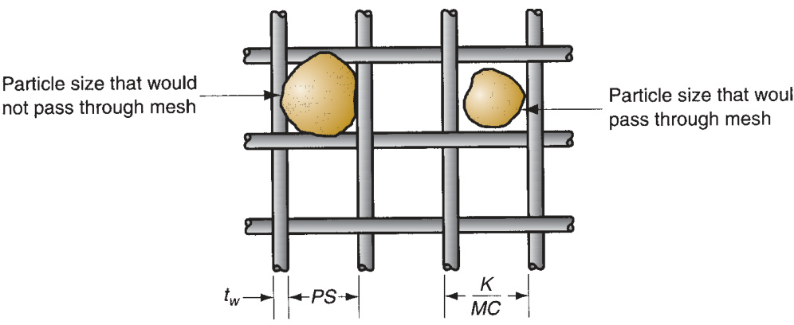  

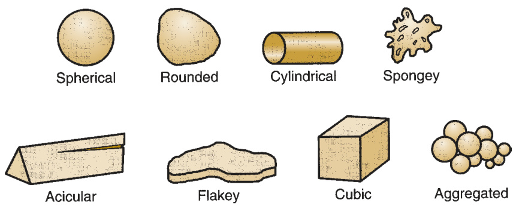  
FIGURE 15.3  Several  of the possible (ideal)  particle shapes in  powder metallurgy.  

Typical particle sizes used in conventional powder metallurgy (press and sinter)  range between 25 and $300\,\mu m$  (0.001 and 0.012 in).  The low end of the range corre- sponds to a mesh count of about 500, which is too small to be measured by the mesh  count method; and the high end of the range corresponds to a mesh count of around 50.  

Particle Shape and Internal Structure   Metal powder shapes can be cataloged  into various types, several of which are illustrated in Figure 15.3. There will be a vari- ation in the particle shapes in a collection of powders, just as the particle size will  vary. A simple and useful measure of shape is the aspect ratio—the ratio of maximum  dimension to minimum dimension for a given particle. The aspect ratio for a spherical  particle is 1.0, but for an acicular grain the ratio might be 2 to 4. Microscopic tech- niques are required to determine shape characteristics.  

Any volume of loose powders will contain pores between the particles. These are  called  open pores  because they are external to the individual particles. Open pores  are spaces into which a fl  uid such as water, oil, or a molten metal, can penetrate. In  addition, there are  closed pores— internal voids in the structure of an individual  particle. The existence of these internal pores is usually minimal, and their effect  when they do exist is minor, but they can infl  uence density measurements.  

Surface Area   Assuming that the particle shape is a perfect sphere, its area $A$  and  volume $V$  are given by  

$$
A=\pi D^{2}
$$  

$$
V=\frac{\pi D^{3}}{6}
$$  

where  $D\,=$ diameter of the spherical particle, mm (in). The area-to-volume ratio  $A V$  for a sphere is then given by  

$$
{\frac{A}{V}}={\frac{6}{D}}
$$  

In general, the area-to-volume ratio can be expressed for any particle shape—spherical  or nonspherical—as follows:  

$$
{\frac{A}{V}}={\frac{K_{s}}{D}}\quad{\mathrm{or}}\quad K_{s}={\frac{A D}{V}}
$$  

where $K_{s}=$  shape factor; $D$  in the general case $=$  the diameter of a sphere of equivalent  volume as the nonspherical particle, mm (in). Thus, $K_{s}=6.0$  for a sphere. For particle  shapes other than spherical, $K_{s}>6$ .  

The following can be inferred from these equations. Smaller particle size and  higher shape factor  $(K_{s})$  mean higher surface area for the same total weight of metal  powders. This means greater area for surface oxidation to occur. Small powder size  also leads to more agglomeration of the particles, which is a problem in automatic  feeding of the powders. The reason for using smaller particle sizes is that they provide  more uniform shrinkage and better mechanical properties in the fi  nal PM product.  

# 15.1.2  OTHER FEATURES  

Other features of engineering powders include interparticle friction, fl  ow character- istics, packing, density, porosity, chemistry, and surface fi  lms.  

Interparticle Friction and Flow Characteristics  Friction between particles affects  the ability of a powder to fl  ow readily and pack tightly. A common measure of inter- particle friction is the  angle of repose , which is the angle formed by a pile of powders  as they are poured from a narrow funnel, as in Figure 15.4. Larger angles indicate  greater friction between particles. Smaller particle sizes generally show greater fric- tion and steeper angles. Spherical shapes result in the lowest interparticle friction; as  shape deviates more from spherical, friction between particles tends to increase.  

Flow characteristics are important in die fi  lling and pressing. Automatic die fi  lling  depends on easy and consistent fl  ow of the powders. In pressing, resistance to fl  ow  increases density variations in the compacted part; these density gradients are generally  undesirable. A common measure of fl  ow is the time required for a certain amount of  powder (by weight) to fl  ow through a standard-sized funnel. Smaller fl  ow times indicate  easier fl  ow and lower interparticle friction. To reduce interparticle friction and facilitate  fl  ow during pressing, lubricants are often added to the powders in small amounts.  

Packing, Density, and Porosity  Packing characteristics depend on two density  measures. First,  true density  is the density of the true volume of the material. This is  the density when the powders are melted into a solid mass, values of which are given  in Table 4.1. Second,  bulk density  is the density of the powders in the loose state  after pouring, which includes the effect of pores between particles. Because of the  pores, bulk density is less than true density.  

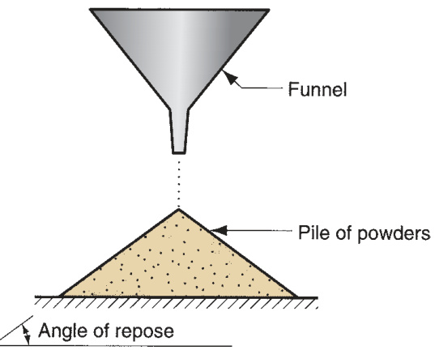  
FIGURE 15.4  Interparticle friction as  indicated by the angle of repose of a pile  of powders poured from a narrow funnel.  Larger angles indicate greater interparticle  friction.  

The  packing factor  is the bulk density divided by the true density. Typical  values for loose powders range between 0.5 and 0.7. The packing factor depends  on particle shape and the distribution of particle sizes. If powders of various  sizes are present, the smaller powders will fi  t into the interstices of the larger  ones that would otherwise be taken up by air, thus resulting in a higher packing  factor. Packing can also be increased by vibrating the powders, causing them  to settle more tightly. Finally, the external pressure applied during compaction  greatly increases packing of powders through rearrangement and deformation  of the particles.  

Porosity represents an alternative way of considering the packing characteris- tics of a powder.  Porosity  is defi  ned as the ratio of the volume of the pores (empty  spaces) in the powder to the bulk volume. In principle,  

$$
\mathrm{Porous+Pacute}=1.0
$$  

The issue is complicated by the possible existence of closed pores in some of the  particles. If these internal pore volumes are included in the above porosity, then the  equation is exact.  

Chemistry and Surface Films  Characterization of the powder would not be  complete without an identifi  cation of its chemistry. Metallic powders are classifi  ed  as either elemental, consisting of a pure metal, or pre-alloyed, wherein each particle  is an alloy. These classes and the metals commonly used in PM are discussed more  thoroughly in Section 15.5.  

Surface fi  lms are a problem in powder metallurgy because of the large area per  unit weight of metal when dealing with powders. The possible fi  lms include oxides,  silica, adsorbed organic materials, and moisture [6]. Generally, these fi  lms must be  removed before shape processing.  

#  Production of Metallic Powders  

In general, producers of metallic powders are not the same companies as those that  make PM parts. The powder producers are the suppliers; the plants that manufacture  components out of powder metals are the customers. It is therefore appropriate to  separate the discussion of powder production (this section) from the processes used  to make PM products (later sections).  

Virtually any metal can be made into powder form. There are three principal  methods by which metallic powders are commercially produced, each of which  involves energy input to increase the surface area of the metal. The methods are  (1) atomization, (2) chemical, and (3) electrolytic [13]. In addition, mechanical  methods are occasionally used to reduce powder sizes; however, these methods  are much more commonly associated with ceramic powder production and are  covered in the next chapter.  

# 15.2.1  ATOMIZATION  

This method involves the conversion of molten metal into a spray of droplets that  solidify into powders. It is the most versatile and popular method for producing metal  powders today, applicable to almost all metals, alloys as well as pure metals. There  are multiple ways of creating the molten metal spray, several of which are illustrated  in Figure 15.5. Two of the methods shown are based on  gas atomization , in which a  high velocity gas stream (air or inert gas) is utilized to atomize the liquid metal. In  Figure 15.5(a), the gas fl  ows through an expansion nozzle, siphoning molten metal  from the melt below and spraying it into a container. The droplets solidify into pow- der form. In a closely related method shown in Figure 15.5(b), molten metal fl  ows by  gravity through a nozzle and is immediately atomized by air jets. The resulting metal  powders, which tend to be spherical, are collected in a chamber below.  

The approach shown in Figure 15.5(c) is similar to (b), except that a high-velocity  water stream is used instead of air. This is known as  water atomization  and is the  most common of the atomization methods, particularly suited to metals that melt  below  $1600^{\circ}\mathrm{C}$   $(2900^{\circ}\mathrm{F})$ . Cooling is more rapid, and the resulting powder shape is  irregular rather than spherical. The disadvantage of using water is oxidation on the  particle surface. A recent innovation involves the use of synthetic oil rather than  water to reduce oxidation. In both air and water atomization processes, particle  size is controlled largely by the velocity of the fl  uid stream; particle size is inversely  related to velocity.  

Several methods are based on  centrifugal atomization . In one approach, the  rotat- ing disk method  shown in Figure 15.5(d), the liquid metal stream pours onto a rapidly  rotating disk that sprays the metal in all directions to produce powders.  

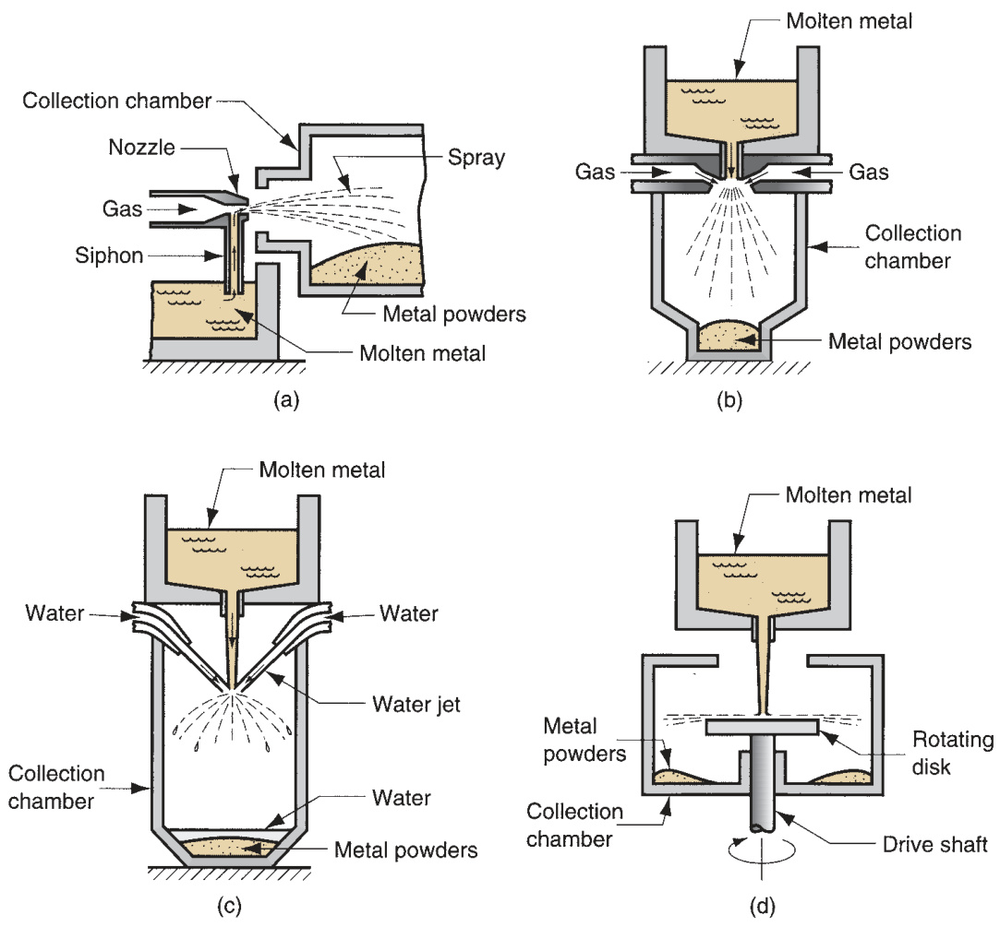  
FIGURE 15.5  Several  atomization methods for  producing metallic  powders: (a) and (b) two  gas atomization methods;  (c) water atomization;  and (d) centrifugal  atomization by the  rotating disk method.  

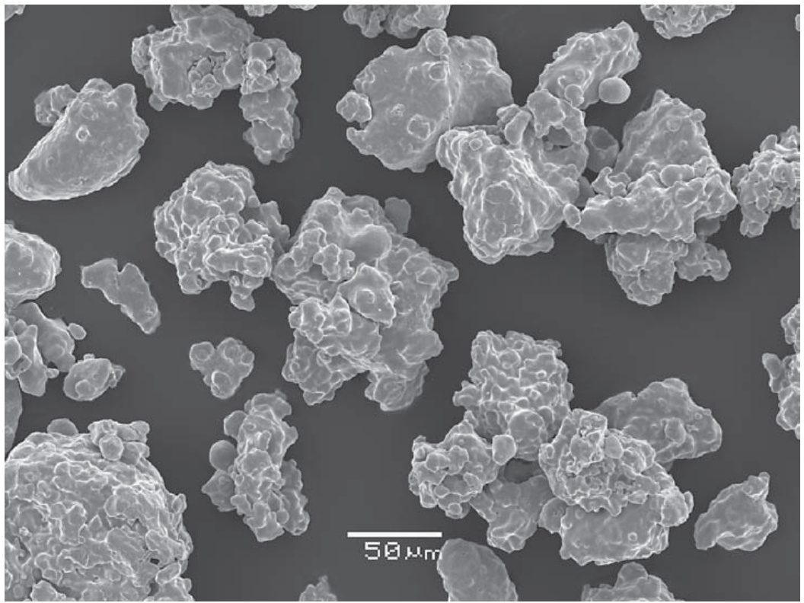  
FIGURE 15.6  Iron powders produced by  water atomization; particle  sizes vary. (Photo courtesy  of T. F. Murphy and  Hoeganaes Corporation.)  

# 15.2.2  OTHER PRODUCTION METHODS  

Other metal powder production methods include various chemical reduction processes,  precipitation methods, and electrolysis.  

Chemical reduction  includes a variety of chemical reactions by which metallic com- pounds are reduced to elemental metal powders. A common process involves libera- tion of metals from their oxides by use of reducing agents such as hydrogen or carbon  monoxide. The reducing agent is made to combine with the oxygen in the compound to  free the metallic element. This approach is used to produce powders of iron, tungsten,  and copper. Another chemical process for iron powders involves the decomposition  of iron pentacarbonyl  $(\mathrm{Fe}(\mathrm{Co})_{5})$ ) to produce spherical particles of high purity. Powders  produced by this method are illustrated in the photomicrograph of Figure 15.6. Other  chemical processes include  precipitation  of metallic elements from salts dissolved in  water. Powders of copper, nickel, and cobalt can be produced by this approach.  

In  electrolysis , an electrolytic cell is set up in which the source of the desired  metal is the anode. The anode is slowly dissolved under an applied voltage, trans- ported through the electrolyte, and deposited on the cathode. The deposit is removed,  washed, and dried to yield a metallic powder of very high purity. The technique is  used for producing powders of beryllium, copper, iron, silver, tantalum, and titanium.  

#  Conventional Pressing and Sintering  

After the metallic powders have been produced, the conventional PM sequence  consists of three steps: (1) blending and mixing of the powders; (2) compaction,  in which the powders are pressed into the desired part shape; and (3) sintering,  which involves heating to a temperature below the melting point to cause solid-state  

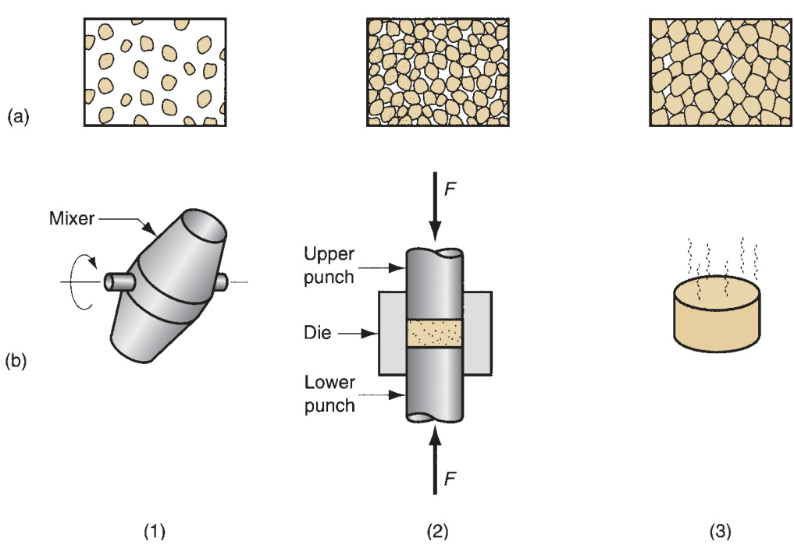  
FIGURE 15.7  The  conventional powder  metallurgy production  sequence: (1) blending,  (2) compacting, and  (3) sintering; (a) shows  the condition of the  particles while (b)  shows the operation  and/or work part during  the sequence.  

bonding of the particles and strengthening of the part. The three steps, sometimes  referred to as primary operations in PM, are portrayed in Figure 15.7. In addition,  secondary operations are sometimes performed to improve dimensional accuracy,  increase density, and for other reasons.  

# 15.3.1  BLENDING AND MIXING OF THE POWDERS  

To achieve successful results in compaction and sintering, the metallic powders  must be thoroughly homogenized beforehand. The terms blending and mixing are  both used in this context.  Blending  refers to when powders of the same chemical  composition but possibly different particle sizes are intermingled. Different particle  sizes are often blended to reduce porosity.  Mixing  refers to powders of different  chemistries being combined. An advantage of PM technology is the opportunity to  mix various metals into alloys that would be diffi  cult or impossible to produce by  other means. The distinction between blending and mixing is not always precise in  industrial practice.  

Blending and mixing are accomplished by mechanical means. Four alternatives  are illustrated in Figure 15.8: (a) rotation in a drum; (b) rotation in a double-cone  container; (c) agitation in a screw mixer; and (d) stirring in a blade mixer. There  is more science to these devices than one would suspect. Best results seem to  occur when the container is between $20\%$  and $40\%$  full. The containers are usually  designed with internal baffl  es or other ways of preventing free-fall during blending  of powders of different sizes, because variations in settling rates between sizes result  in segregation—just the opposite of what is wanted in blending. Vibration of the  powder is undesirable, because it also causes segregation.  

Other ingredients are usually added to the metallic powders during the blending  and/or mixing step. These additives include (1)  lubricants , such as stearates of zinc and  aluminum, in small amounts to reduce friction between particles and at the die wall  

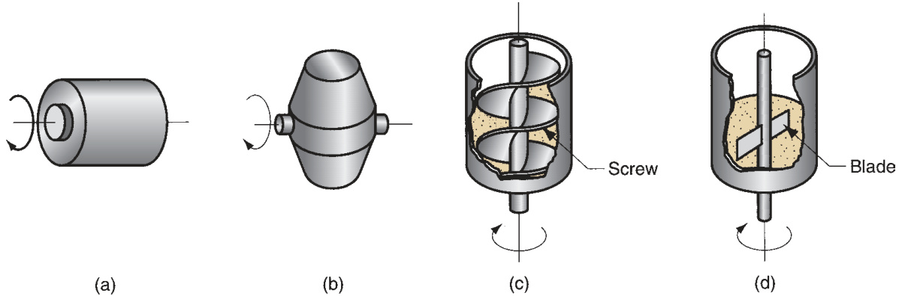  
FIGURE 15.8  Several blending and mixing devices: (a) rotating drum, (b) rotating double-cone, (c) screw mixer, and  (d) blade mixer.  

during compaction; (2)  binders , which are required in some cases to achieve adequate  strength in the pressed but unsintered part; and (3)  defl  occulants , which inhibit agglo- meration of powders for better fl  ow characteristics during subsequent processing.  

# 15.3.2  COMPACTION  

In compaction, high pressure is applied to the powders to form them into the  required shape. The conventional compaction method is  pressing , in which oppos- ing punches squeeze the powders contained in a die. The steps in the pressing cycle  are shown in Figure 15.9. The work part after pressing is called a  green compact ,  the word  green  meaning not yet fully processed. As a result of pressing, the density  of the part, called the  green density , is much greater than the starting bulk density.  

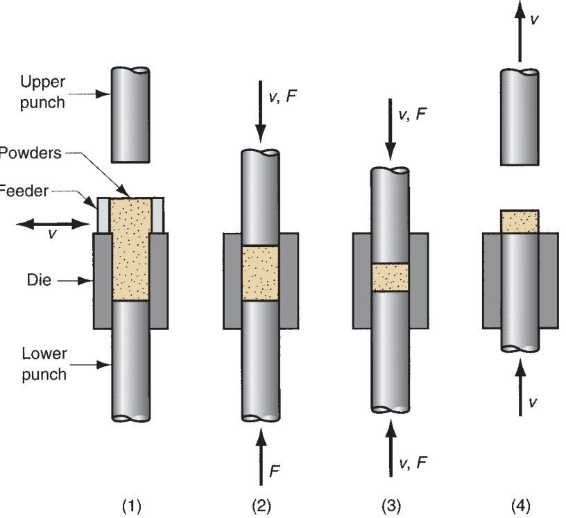  
FIGURE 15.9  Pressing,  the conventional method  of compacting metal  powders in PM: (1) fi  lling  the die cavity with  powder, done by auto- matic feed in  production, (2) initial,  and (3) fi  nal positions  of upper and lower  punches during  compaction, and (4)  ejection of part.  

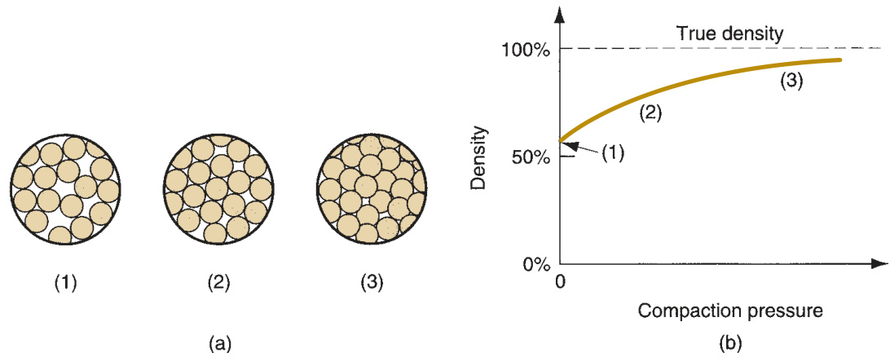  
FIGURE 15.10  (a) Effect  of applied pressure  during compaction:  (1) initial loose powders  after fi  lling, (2) repacking,  and (3) deformation of  particles; and (b) density  of the powders as a  function of pressure.  The sequence here  corresponds to steps  1, 2, and 3 in Figure 15.9.  

The  green strength  of the part when pressed is adequate for handling but far less  than that achieved after sintering.  

The applied pressure in compaction results initially in repacking of the powders  into a more effi  cient arrangement, eliminating “bridges” formed during fi  lling, reduc- ing pore space, and increasing the number of contacting points between particles. As  pressure increases, the particles are plastically deformed, causing interparticle con- tact area to increase and additional particles to make contact. This is accompanied  by a further reduction in pore volume. The progression is illustrated in three views  in Figure 15.10 for starting particles of spherical shape. Also shown is the associated  density represented by the three views as a function of applied pressure.  

Presses used in conventional PM compaction are mechanical, hydraulic, or a  combination of the two. A  $450~\mathrm{kN}$  (50 ton) hydraulic unit is shown in Figure 15.11.  Because of differences in part complexity and associated pressing requirements,  presses can be distinguished as (1) pressing from one direction, referred to as single- action presses; or (2) pressing from two directions, any of several types including  opposed ram, double-action, and multiple action. Current available press technology  can provide up to 10 separate action controls to produce parts of signifi  cant geomet- ric complexity. Part complexity and other design issues are examined in Section 15.6.  

The capacity of a press for PM production is generally given in tons or $\mathbf{kN}$  or MN.  The required force for pressing depends on the projected area of the PM part (area  in the horizontal plane for a vertical press) multiplied by the pressure needed to  compact the given metal powders. Reducing this to equation form,  

$$
F=A_{p}p_{c}
$$  

where $F=$  required force, N (lb); $A_{p}=$  projected area of the part,  $\mathrm{mm}^{2}$   $(\mathrm{in}^{2})$ ; and  $p_{c}~=$ compaction pressure required for the given powder material, MPa  $\left(1\mathbf{b}/\mathrm{in}^{2}\right)$ .  Compaction pressures typically range from  $70~\mathrm{MPa}$   $(10{,}000\ \mathbf{lb}/\mathbf{in}^{2})$  for aluminum  powders to $700\;\mathrm{MPa}$  ( $\{100,\!000\,\mathrm{lb}/\mathrm{in}^{2}\}$ ) for iron and steel powders.  

15.3.3  SINTERING  

After pressing, the green compact lacks strength and hardness; it is easily crumbled  under low stresses.  Sintering  is a heat treatment operation performed on the compact  to bond its metallic particles, thereby increasing strength and hardness. The treatment  

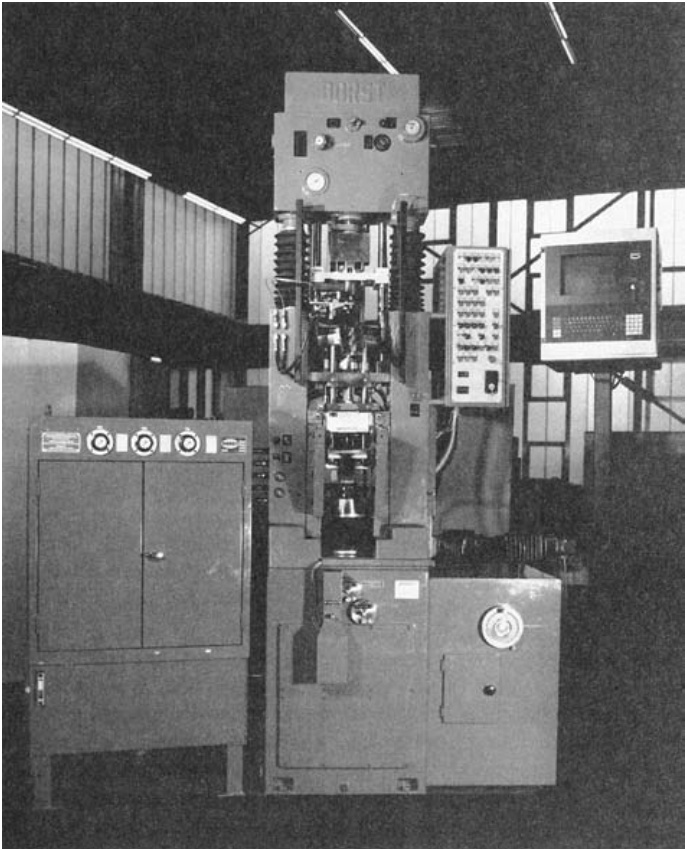  
FIGURE 15.11  A 450-kN  (50-ton) hydraulic press for  compaction of powder  metallurgy components.  (Photo courtesy of Dorst  America, Inc.)  

is usually carried out at temperatures between 0.7 and 0.9 of the metal’s melting  point (absolute scale). The terms  solid-state sintering  or  solid-phase sintering  are  sometimes used for this conventional sintering because the metal remains unmelted  at these treatment temperatures.  

It is generally agreed among researchers that the primary driving force for  sintering is reduction of surface energy [6], [16]. The green compact consists of  many distinct particles, each with its own individual surface, and so the total sur- face area contained in the compact is very high. Under the infl  uence of heat, the  surface area is reduced through the formation and growth of bonds between the  particles, with associated reduction in surface energy. The fi  ner the initial powder  size, the higher the total surface area, and the greater the driving force behind  the process.  

The series of sketches in Figure 15.12 shows on a microscopic scale the changes  that occur during sintering of metallic powders. Sintering involves mass transport to  create the necks and transform them into grain boundaries. The principal mecha- nism by which this occurs is diffusion; other possible mechanisms include plastic fl  ow.  Shrinkage occurs during sintering as a result of pore size reduction. This depends to  a large extent on the density of the green compact, which depends on the pressure  during compaction. Shrinkage is generally predictable when processing conditions  are closely controlled.  

Because PM applications usually involve medium-to-high production, most  sintering furnaces are designed with mechanized fl  ow-through capability for  the work parts. The heat treatment consists of three steps, accomplished in three  chambers in these continuous furnaces: (1) preheat, in which lubricants and  

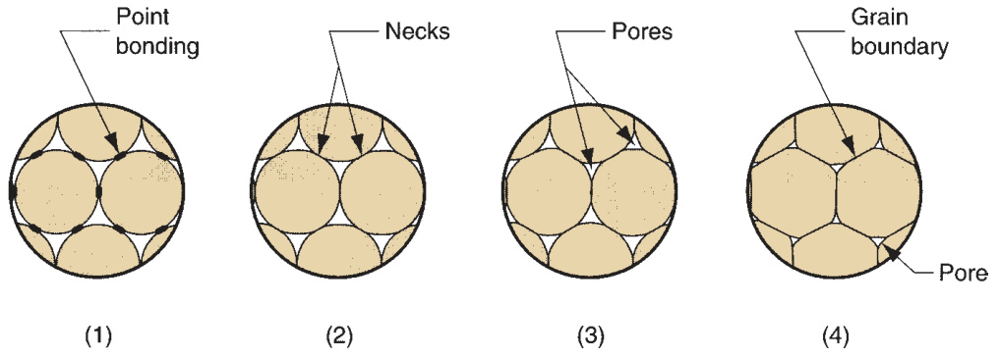  
FIGURE 15.12  Sintering on a  microscopic scale:  (1) particle bonding is  initiated at contact  points; (2) contact  points grow into  “necks”; (3) the pores  between particles are  reduced in size; and  (4) grain boundaries  develop between  particles in place of the  necked regions.  

binders are burned off; (2) sinter; and (3) cool down. The treatment is illustrated  in Figure 15.13. Typical sintering temperatures and times are given for selected  metals in Table 15.1.  

In modern sintering practice, the atmosphere in the furnace is controlled. The  purposes of a controlled atmosphere include (1) protection from oxidation, (2) pro- viding a reducing atmosphere to remove existing oxides, (3) providing a carburizing  atmosphere, and (4) assisting in removing lubricants and binders used in pressing.  Common sintering furnace atmospheres are inert gas, nitrogen-based, dissociated  ammonia, hydrogen, and natural gas [6]. Vacuum atmospheres are used for certain  metals, such as stainless steel and tungsten.  

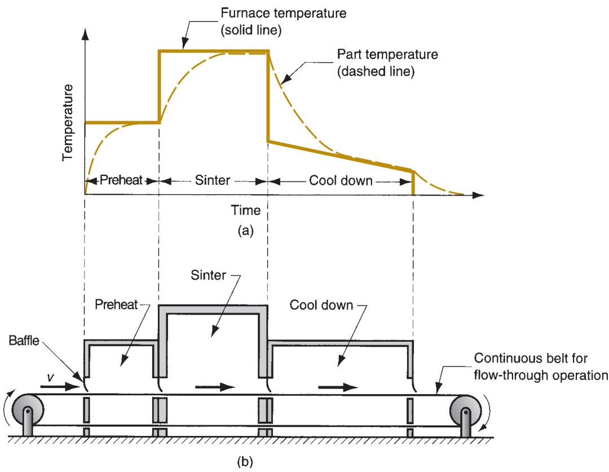  
FIGURE 15.13  (a) Typical heat treatment  cycle in sintering; and  (b) schematic cross  section of a continuous  sintering furnace.  

TABLE  •  15.1  Typical sintering temperatures and times for selected powder metals. 
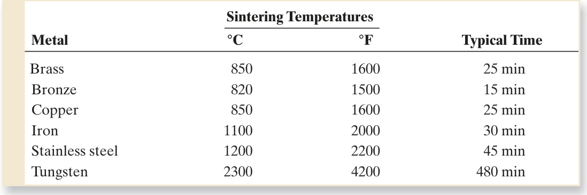  
Compiled from [10] and [17].  

# 15.3.4 SECONDARY OPERATIONS  

PM secondary operations include densifi  cation, sizing, impregnation, infi  ltration,  heat treatment, and fi  nishing.  

Densifi  cation and Sizing  A number of secondary operations are performed to  increase density, improve accuracy, or accomplish additional shaping of the sintered  part.  Repressing  is a pressing operation in which the part is squeezed in a closed die  to increase density and improve physical properties.  Sizing  is the pressing of a sin- tered part to improve dimensional accuracy.  Coining  is a pressworking operation on  a sintered part to press details into its surface.  

Some PM parts require  machining  after sintering. Machining is rarely done to  size the part, but rather to create geometric features that cannot be achieved by  pressing, such as internal and external threads, side holes, and other details.  

Impregnation and Infi  ltration  Porosity is a unique and inherent characteristic  of powder metallurgy technology. It can be exploited to create special products by  fi  lling the available pore space with oils, polymers, or metals that have lower melting  temperatures than the base powder metal.  

Impregnation  is the term used when oil or other fl  uid is permeated into the pores  of a sintered PM part. The most common products of this process are oil-impreg- nated bearings, gears, and similar machinery components. Self-lubricating bearings,  usually made of bronze or iron with  $10\%$  to  $30\%$  oil by volume, are widely used in  the automotive industry. The treatment is accomplished by immersing the sintered  parts in a bath of hot oil.  

An alternative application of impregnation involves PM parts that must be made  pressure tight or impervious to fl  uids. In this case, the parts are impregnated with  various types of polymer resins that seep into the pore spaces in liquid form and then  solidify. In some cases, resin impregnation is used to facilitate subsequent processing,  for example, to permit the use of processing solutions (such as plating chemicals)  that would otherwise soak into the pores and degrade the product, or to improve  machinability of the PM work part.  

Infi  ltration  is an operation in which the pores of the PM part are fi  lled with a mol- ten metal. The melting point of the fi  ller metal must be below that of the PM part. The  process involves heating the fi  ller metal in contact with the sintered component so  that capillary action draws the fi  ller into the pores. The resulting structure is relatively  nonporous, and the infi  ltrated part has a more uniform density, as well as improved  toughness and strength. An application of the process is copper infi  ltration of iron  PM parts.  

Heat Treatment and Finishing  Powder metal components can be heat treated  (Chapter 26) and finished (electroplated or painted, Chapter 27) by most of  the same processes used on parts produced by casting and other metalworking  processes. Special care must be exercised in heat treatment because of porosity;  for example, salt baths are not used for heating PM parts. Plating and coating  opera  tions are applied to sintered parts for appearance purposes and corrosion  resistance. Again, precautions must be taken to avoid entrapment of chemical  solutions in the pores; impregnation and infiltration are frequently used for this  purpose. Common platings for PM parts include copper, nickel, chromium, zinc,  and cadmium.  

#  Alternative Pressing and Sintering Techniques  

The conventional press and sinter sequence is the most widely used shaping  technology in powder metallurgy. Additional methods for processing PM parts are  discussed in this section.  

# 15.4.1 ISOSTATIC PRESSING  

A feature of conventional pressing is that pressure is applied uniaxially. This imposes  limitations on part geometry, because metallic powders do not readily fl  ow in direc- tions perpendicular to the applied pressure. Uniaxial pressing also leads to density  variations in the compact after pressing. In  isostatic pressing , pressure is applied  from all directions against the powders that are contained in a fl  exible mold; hydrau- lic pressure is used to achieve compaction. Isostatic pressing takes two alternative  forms: (1) cold isostatic pressing and (2) hot isostatic pressing.  

Cold isostatic pressing  (CIP) involves compaction performed at room tempera- ture. The mold, made of rubber or other elastomer material, is oversized to compen- sate for shrinkage. Water or oil is used to provide the hydrostatic pressure against  the mold inside the chamber. Figure 15.14 illustrates the processing sequence in  cold isostatic pressing. Advantages of CIP include more uniform density, less expen- sive tooling, and greater applicability to shorter production runs. Good dimensional  accuracy is diffi  cult to achieve in isostatic pressing, because of the fl  exible mold.  Consequently, subsequent fi  nish shaping operations are often required to obtain the  required dimensions, either before or after sintering.  

Hot isostatic pressing  (HIP) is carried out at high temperatures and pressures,  using a gas such as argon or helium as the compression medium. The mold in  which the powders are contained is made of sheetmetal to withstand the high  temperatures. HIP accomplishes pressing and sintering in one step. Despite this  apparent advantage, it is a relatively expensive process and its applications seem  to be concentrated in the aerospace industry. PM parts made by HIP are charac- terized by high density (porosity near zero), thorough interparticle bonding, and  good mechanical strength.  

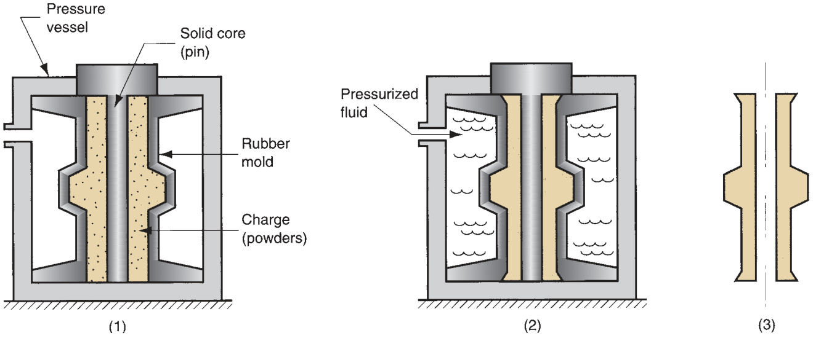  
FIGURE 15.14  Cold isostatic pressing: (1) powders are placed in the fl  exible mold; (2) hydrostatic pressure is  applied against the mold to compact the powders; and (3) pressure is reduced, and the part is removed.  

# 15.4.2  POWDER INJECTION MOLDING  

Injection molding is closely associated with the plastics industry (Section 13.6).  The same basic process can be applied to form parts of metal or ceramic powders,  the difference being that the starting polymer contains a high content of particulate  matter, typically from  $50\%$  to  $85\%$  by volume. When used in powder metallurgy,  the term  metal injection molding  (MIM) is used. The more general process is  pow- der injection molding  (PIM), which includes both metal and ceramic powders. The  steps in MIM proceed as follows [7]: (1) Metallic powders are mixed with an appro- priate binder. (2) Granular pellets are formed from the mixture. (3) The pellets are  heated to molding temperature, injected into a mold cavity, and the part is cooled  and removed from the mold. (4) The part is processed to remove the binder using  any of several thermal or solvent techniques. (5) The part is sintered. (6) Secondary  operations are performed as appropriate.  

The binder in powder injection molding acts as a carrier for the particles. Its func- tions are to provide proper fl  ow characteristics during molding and hold the pow- ders in the molded shape until sintering. The fi  ve basic types of binders in PIM are  (1) thermosetting polymers, such as phenolics; (2) thermoplastic polymers, such as  polyethylene; (3) water; (4) gels; and (5) inorganic materials [7]. Polymers are the  most frequently used.  

Powder injection molding is suited to part geometries similar to those in plastic  injection molding. It is not cost competitive for simple axisymmetric parts, because  the conventional press-and-sinter process is quite adequate for these cases. PIM  seems most economical for small, complex parts of high value. Dimensional accu- racy is limited by the shrinkage that accompanies densifi  cation during sintering.  

# 15.4.3 POWDER ROLLING, EXTRUSION, AND FORGING  

Rolling, extrusion, and forging are familiar bulk deformation processes (Chapter 18).  Their applications are described here in the context of powder metallurgy.  

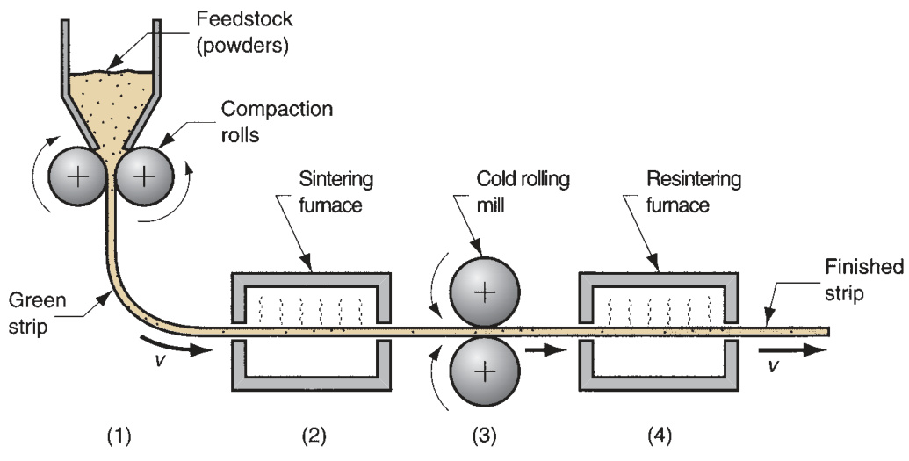  
FIGURE 15.15  Powder  rolling: (1) powders are  fed through compaction  rolls to form a green  strip; (2) sintering; (3)  cold rolling; and (4)  resintering.  

Powder Rolling  Powders can be compressed in a rolling mill operation to form  metal strip stock. The process is usually set up to run continuously or semicontinu- ously, as shown in Figure 15.15. The metallic powders are compacted between rolls  into a green strip that is fed directly into a sintering furnace. It is then cold rolled  and resintered.  

Powder Extrusion  In the most popular PM extrusion method, powders are placed  in a vacuum-tight sheet metal can, heated, and extruded with the container. In  another variation, billets are preformed by a conventional press and sinter process,  and then the billet is hot extruded. These methods achieve a high degree of densifi  - cation in the PM product.  

Powder Forging  In powder forging, the starting work part is a powder metal- lurgy part preformed to proper size by pressing and sintering. Advantages of this  approach are: (1) densifi  cation of the PM part, (2) lower tooling costs and fewer  forging “hits” (and therefore higher production rate) because the starting work part  is preformed, and (3) reduced material waste.  

# 15.4.4  COMBINED PRESSING AND SINTERING  

Hot isostatic pressing (Section 15.4.1) accomplishes compaction and sintering  in one step. Other techniques that combine the two steps are hot pressing and  spark sintering.  

Hot Pressing  The setup in uniaxial hot pressing is very similar to conventional PM  pressing, except that heat is applied during compaction. The resulting product is gen- erally dense, strong, hard, and dimensionally accurate. Despite these advantages, the  process presents certain technical problems that limit its adoption. Principal among  these are (1) selecting a suitable mold material that can withstand the high sinter- ing temperatures; (2) longer production cycle required to accomplish sintering; and  (3) heating and maintaining atmospheric control in the process [2]. Hot pressing  has found some application in the production of sintered carbide products using  graphite molds.  

Spark Sintering  An alternative approach that combines pressing and sintering but  overcomes some of the problems in hot pressing is spark sintering. The process con- sists of two basic steps [2], [17]: (1) powder or a green compacted preform is placed  in a die; and (2) upper and lower punches, which also serve as electrodes, compress  the part and simultaneously apply a high-energy electrical current that burns off  surface contaminants and sinters the powders, forming a dense, solid part in about  15 seconds. The process has been applied to a variety of metals.  

# 15.4.5  LIQUID PHASE SINTERING  

Conventional sintering (Section 15.3.3) is solid-state sintering; the metal is sintered  at a temperature below its melting point. In systems involving a mixture of two  powder metals, in which there is a difference in melting temperature between the  metals, an alternative type of sintering is used, called liquid phase sintering. In this  process, the two powders are initially mixed, and then heated to a temperature that  is high enough to melt the lower-melting-point metal but not the other. The melted  metal thoroughly wets the solid particles, creating a dense structure with strong  bonding between the metals upon solidifi  cation. Depending on the metals involved,  prolonged heating may result in alloying of the metals by gradually dissolving the  solid particles into the liquid melt and/or diffusion of the liquid metal into the  solid. In either case, the resulting product is fully densifi  ed (no pores) and strong.  Examples of systems that involve liquid phase sintering include Fe–Cu, W–Cu, and  Cu–Co [6].  

#  Materials and Products for Powder Metallurgy  

The raw materials for PM processing are more expensive than for other metal- working because of the additional energy required to reduce the metal to powder  form. Accordingly, PM is competitive only in a certain range of applications. This  section identifi  es the materials and products that seem most suited to powder  metallurgy.  

Powder Metallurgy Materials  From a chemistry standpoint, metal powders can  be classifi  ed as either elemental or pre-alloyed.  Elemental  powders consist of a pure  metal and are used in applications in which high purity is important. For example,  pure iron might be used where its magnetic properties are important. The most  common elemental powders are those of iron, aluminum, and copper.  

Elemental powders are also mixed with other metal powders to produce special  alloys that are diffi  cult to formulate using conventional processing methods. Tool  steels are an example; PM permits blending of ingredients that is diffi  cult or impossi- ble by traditional alloying techniques. Using mixtures of elemental powders to form  an alloy provides a processing benefi  t, even where special alloys are not involved.  Because the powders are pure metals, they are not as strong as pre-alloyed metals.  Therefore, they deform more readily during pressing, so that density and green  strength are higher than with pre-alloyed compacts.  

In  pre-alloyed  powders, each particle is an alloy composed of the desired chemical  composition. Pre-alloyed powders are used for alloys that cannot be formulated by  mixing elemental powders; stainless steel is an important example. The most common  pre-alloyed powders are certain copper alloys, stainless steel, and high-speed steel.  

The commonly used elemental and pre-alloyed powdered metals, in approximate  order of tonnage usage, are: (1) iron, by far the most widely used PM metal, fre- quently mixed with graphite to make steel parts, (2) aluminum, (3) copper and its  alloys, (4) nickel, (5) stainless steel, (6) high-speed steel, and (7) other PM materials  such as tungsten, molybdenum, titanium, tin, and precious metals.  

Powder Metallurgy Products  A substantial advantage offered by PM technol- ogy is that parts can be made to near net shape or net shape; they require little  or no additional shaping after PM processing. Some of the components commonly  manufactured by powder metallurgy are gears, bearings, sprockets, fasteners, elec- trical contacts, cutting tools, and various machinery parts. When produced in large  quantities, metal gears and bearings are particularly well suited to PM for two rea- sons: (1) the geometry is defi  ned principally in two dimensions, so the part has a top  surface of a certain shape, but there are no features along the sides; and (2) there is a  need for porosity in the material to serve as a reservoir for lubricant. More complex  parts with true three-dimensional geometries are also feasible in powder metallurgy,  by adding secondary operations such as machining to complete the shape of the  pressed and sintered part, and by observing certain design guidelines such as those  outlined in the following section.  

#  Design Considerations in Powder Metallurgy  

Use of PM techniques is generally suited to a certain class of production situations  and part designs. This section defi  nes the characteristics of this class of applications  for which powder metallurgy is most appropriate.  

The Metal Powder Industries Federation (MPIF) defi  nes four classes of powder  metallurgy part designs, by level of diffi  culty in conventional pressing. The system is  useful because it indicates some of the limitations on shape that can be achieved with  conventional PM processing. The four part classes are illustrated in Figure 15.16.  

The MPIF classifi  cation system provides some guidance concerning part geo- metries suited to conventional PM pressing techniques. Additional advice is offered  in the following design guidelines, compiled from [3], [13], and [17].  

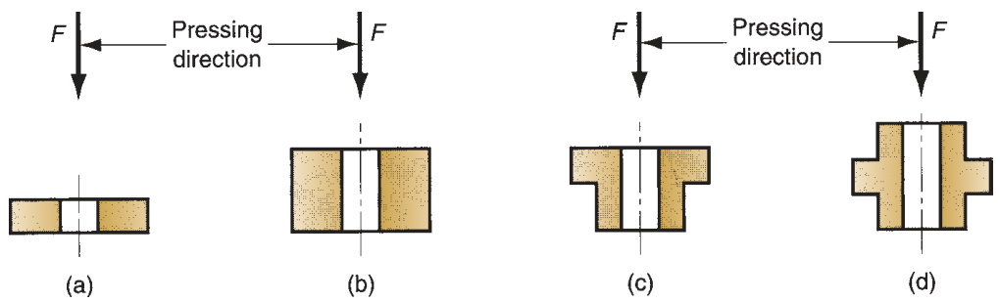  
FIGURE 15.16  Four classes of PM parts side view shown; cross section is circular  (a) Class I—simple thin shapes that can be pressed from one direction; (b) Class II—simple  but thicker shapes that require pressing from two directions; (c) Class III—two levels of  thickness, pressed from two directions; and (d) Class IV—multiple levels of thickness,  pressed from two directions, with separate controls for each level to achieve proper  densifi  cation throughout the compact.  

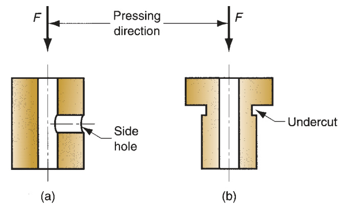  
FIGURE 15.17  Part features to be  avoided in PM: (a) side holes and  (b) side undercuts. Part ejection  is impossible.  

➢   Economics of PM processing usually require large part quantities to justify the  cost of equipment and special tooling required. Minimum quantities of 10,000  units are suggested [17], although exceptions exist. $\gg$ Powder metallurgy is unique in its capability to fabricate parts with a controlled  level of porosity. Porosities up to $50\%$  are possible. $\gg$ PM can be used to make parts out of unusual metals and alloys—materials that  would be diffi  cult if not impossible to fabricate by other means. $\gg$ The geometry of the part must permit ejection from the die after pressing; this  generally means that the part must have vertical or near-vertical sides, although  steps in the part are permissible as suggested by the MPIF classifi  cation system  (Figure 15.16). Design features such as undercuts and holes on the part sides,  as shown in Figure 15.17, must be avoided. Vertical under  cuts and holes, as in  Figure 15.18, are permissible because they do not inter  fere with ejection. Verti- cal holes can be of cross-sectional shapes other than round (e.g., squares, key- ways) without signifi  cant increases in tooling or processing diffi  culty. $\gg$ Screw threads cannot be fabricated by PM pressing; if required, they must be  machined into the PM component after sintering. $\gg$ Chamfers and corner radii are possible by PM pressing, as shown in Figure 15.19.  Problems are encountered in punch rigidity when angles are too acute. $\gg$ Wall thickness should be a minimum of  $1.5~\mathrm{mm}$  (0.060 in) between holes or a  hole and the outside part wall, as indicated in Figure 15.20. Minimum recom- mended hole diameter is $1.5\:\mathrm{mm}$  (0.060 in).  

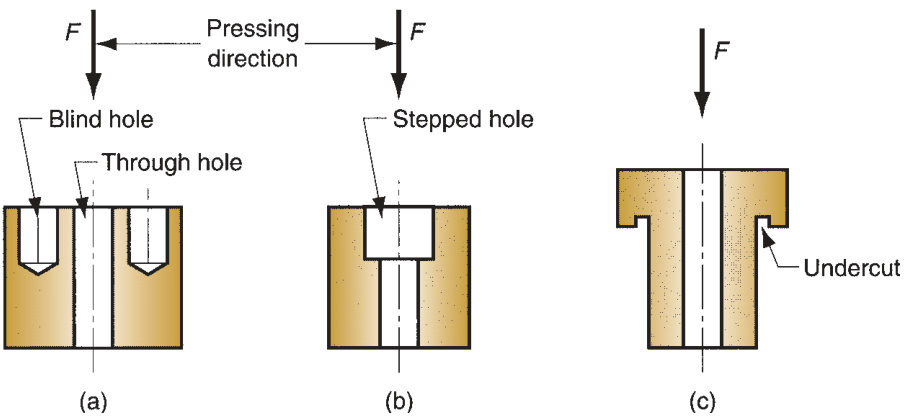  
FIGURE 15.18  Permissible part  features in PM: (a)  vertical hole, blind and  through, (b) vertical  stepped hole, and (c)  undercut in vertical  direction. These  features allow part  ejection.  

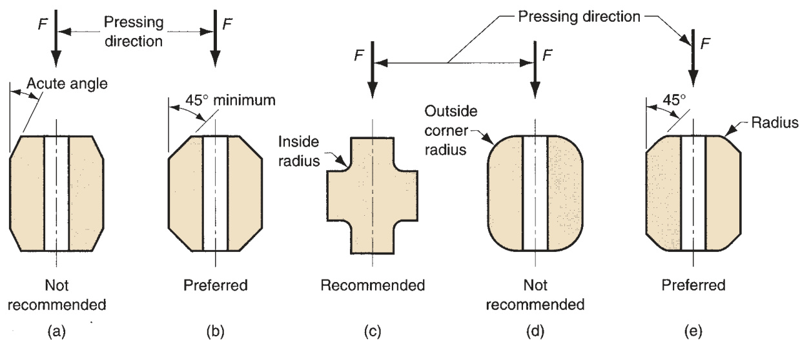  
FIGURE 15.19  Chamfers and corner radii are accomplished,  but certain rules should be observed: (a) avoid acute  chamfer angles; (b) larger angles are preferred for punch rigidity; (c) small inside radius is desirable; (d) full outside  corner radius is diffi  cult because punch is fragile at corner’s edge; (e) outside corner problem can be solved by  combining radius and chamfer.  

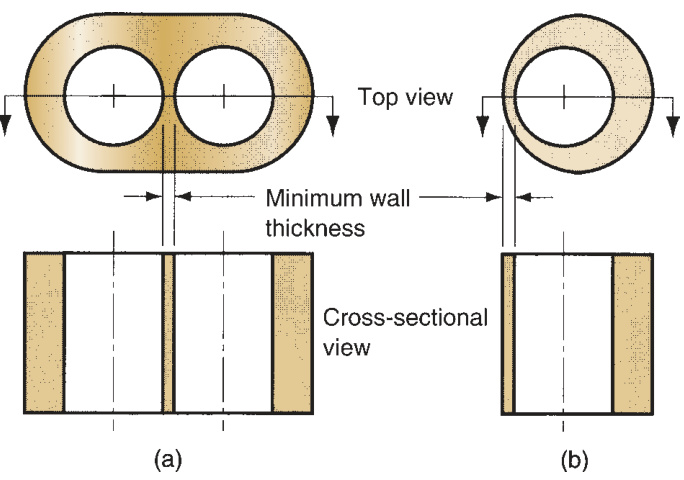  
FIGURE 15.20  Minimum recom- mended wall thickness  (a) between holes or (b)  between a hole and an  outside wall should be  1.5 mm (0.060 in).  

# References  

[1]  ASM Handbook , Vol. 7:  Powder Metal  Technologies and Applications . ASM Inter- national, Materials Park, Ohio, 1998.

  [2]  Amstead, B. H., Ostwald, P . F., and Begeman,  M. L.  Manufacturing Processes , 8th ed. John  Wiley & Sons, New York, 1987.

  [3]  Bralla, J. G. (ed.).  Design for Manufactur- ability Handbook , 2nd ed. McGraw-Hill,  New York, 1998.

  [4]  Bulger, M. “Metal Injection Molding,”  Advanced Materials & Processes , March  2005, pp. 39–40.  

[5]  Dixon, R. H. T., and Clayton, A.  Powder Metal- lurgy for Engineers . The Machinery Publishing  Co. Brighton, U.K., 1971.

  [6]  German, R. M.  Powder Metallurgy Science ,  2nd ed. Metal Powder Industries Federation,  Princeton, New Jersey, 1994.

  [7]  German, R. M.  Powder Injection Mold- ing . Metal Powder Industries Federation,  Princeton, New Jersey, 1990.

  [8]  German, R. M.  A-Z of Powder Metallurgy .  Elsevier Science, Amsterdam, Netherlands,  2006.  