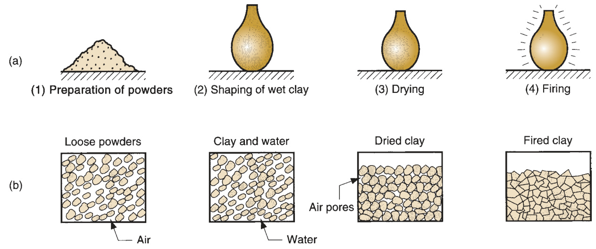
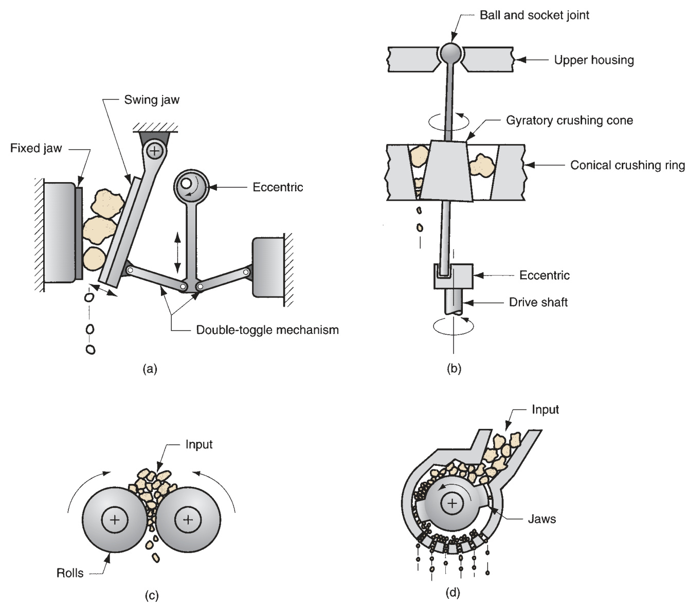
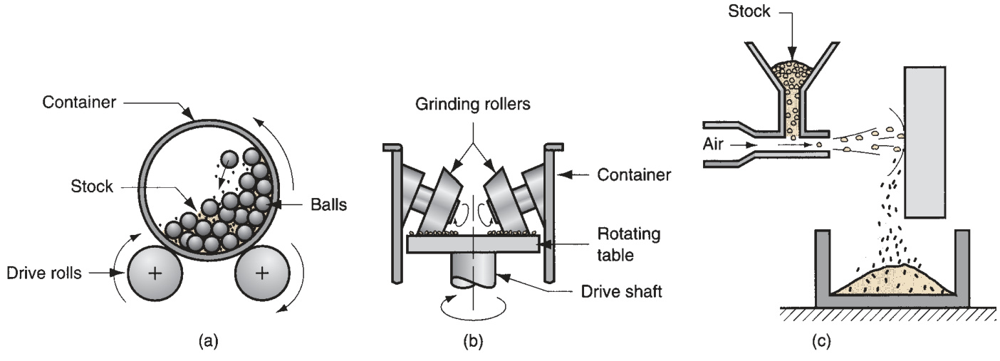
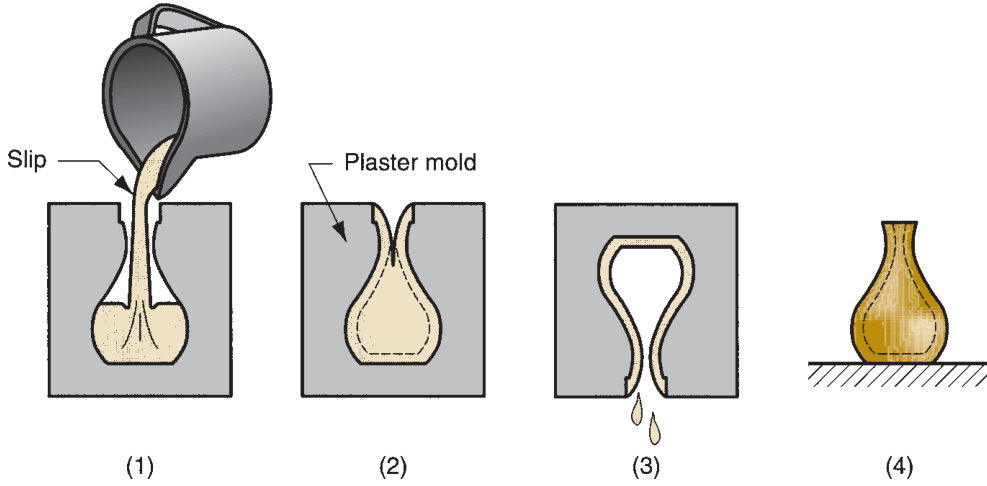
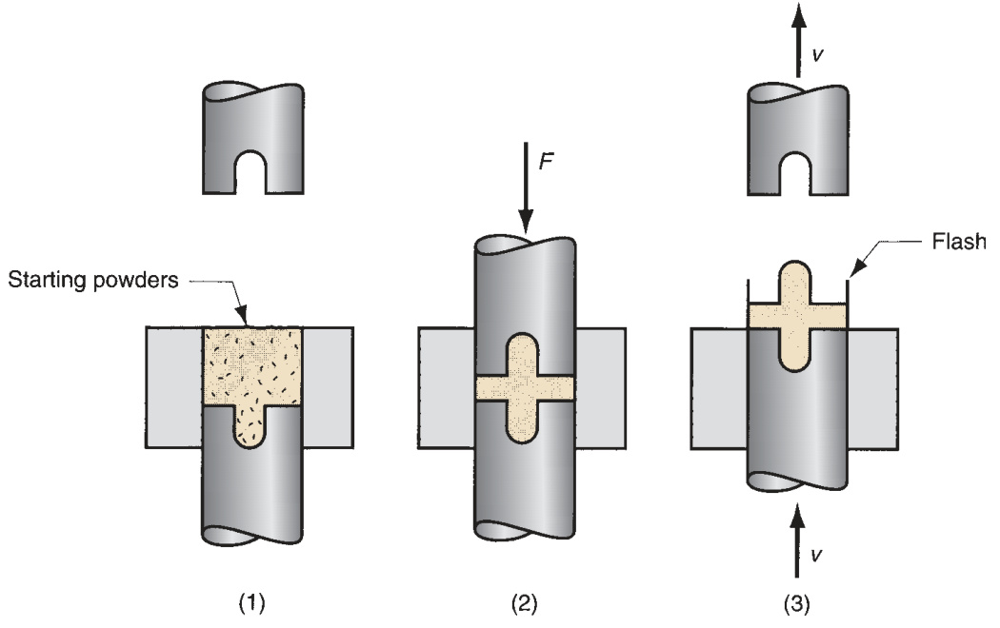
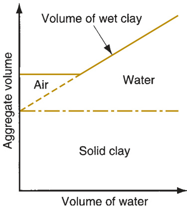
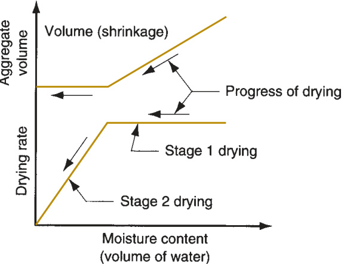
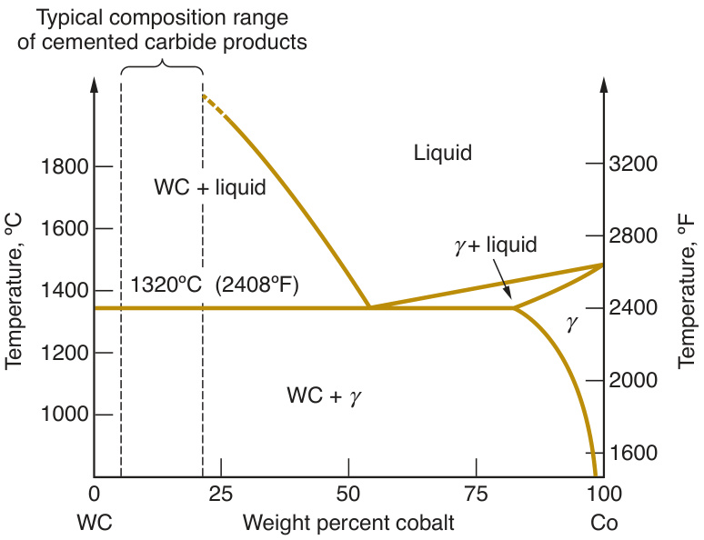

# Processing of  Ceramics and  Cermets  

# Chapter Contents  

16.1  Processing of Traditional Ceramics  

16.1.1 Preparation of the Raw Material 16.1.2 Shaping Processes 16.1.3 Drying 16.1.4 Firing (Sintering)  

16.2  Processing of New Ceramics  

16.2.1 Preparation of Starting Materials 16.2.2 Shaping 16.2.3 Sintering 16.2.4 Finishing  

16.3  Processing of Cermets  

16.3.1 Cemented Carbides 16.3.2 Other Cermets and Ceramic  Matrix Composites  

16.4  Product Design Considerations  

Ceramic materials divide into three categories:  (1) traditional ceramics, (2) new ceramics, and (3)  glasses. The processing of glass involves solidifi  cation  primarily and is covered in Chapter 12. The present  chapter considers the particulate processing methods  used for traditional and new ceramics. Also included is  the processing of metal matrix composites and ceramic  matrix composites.  

Traditional ceramics are made from minerals occur- ring in nature. They include pottery, porcelain, bricks,  and cement. New ceramics are made from synthetically  produced raw materials and cover a wide spectrum of  products such as cutting tools, artifi  cial bones, nuclear  fuels, and substrates for electronic circuits. The starting  material for all of these items is powder. In the case of  the traditional ceramics, the powders are usually mixed  with water to temporarily bind the particles together  and achieve the proper consistency for shaping. For  new ceramics, other substances are used as binders  during shaping. After shaping, the green parts are sin- tered. This is often called  fi  ring  in ceramics, but the  function is the same as in powder metallurgy: to effect  a solid-state reaction that bonds the material into a  hard solid mass.  

The processing methods discussed in this chap- ter are commercially and technologically important  because virtually all ceramic products are formed by  these methods (except, of course, glass products). The  manufacturing sequence is similar for traditional and  new ceramics because the form of the starting material  is the same: powder. However, the processing methods  for the two categories are suffi  ciently different that  they are discussed separately.  

#  Processing of Traditional Ceramics  

This section describes the production technology used to make traditional ceramic  products such as pottery, stoneware and other dinnerware, bricks, tile, and ceramic  refractories. Bonded grinding wheels are also produced by the same basic methods.  What these products have in common is that their raw materials consist primarily of  silicate ceramics—clays. The processing sequence for most of the traditional ceramics  consists of the steps depicted in Figure 16.1.  

# 16.1.1  PREPARATION OF THE RAW MATERIAL  

The shaping processes for traditional ceramics require that the starting material be  in the form of a plastic paste. This paste is made of fi  ne ceramic powders mixed with  water, and its consistency determines the ease of forming the material and the qual- ity of the fi  nal product. The raw ceramic material usually occurs in nature as rocky  lumps, and reduction to powder is the purpose of the preparation step in ceramics  processing.  

Techniques for reducing particle size in ceramics processing involve mechanical  energy in various forms, such as impact, compression, and attrition. The term  com- minution  is used for these techniques, which are most effective on brittle materials,  including cement, metallic ores, and brittle metals. Two general categories of com- minution operations are distinguished: crushing and grinding.  

Crushing  refers to the reduction of large lumps from the mine to smaller sizes for  subsequent further reduction. Several stages may be required (e.g., primary crushing,  secondary crushing), the reduction ratio in each stage being in the range 3 to 6. Crush- ing of minerals is accomplished by compression against rigid surfaces or by impact  against surfaces in a rigid constrained motion [1]. Figure 16.2 shows several types of  equipment used to perform crushing: (a) jaw crushers, in which a large jaw toggles  back and forth to crush lumps against a hard, rigid surface; (b) gyratory crushers, which  use a gyrating cone to compress lumps against a rigid surface; (c) roll crushers, in which  

  
FIGURE 16.1  Usual steps in traditional ceramics processing: (1) preparation of raw materials, (2) shaping, (3) drying,  and (4) fi  ring. Part (a) shows the work part during the sequence, whereas (b) shows the condition of the powders.  

  
FIGURE 16.2  Crushing operations: (a) jaw crusher, (b) gyratory crusher, (c) roll crusher, and (d) hammer mill.  

the ceramic lumps are squeezed between rotating rolls; and (d) hammer mills, which  use rotating hammers impacting the material to break up the lumps.  

Grinding , in the context here, refers to the operation of reducing the small pieces  produced by crushing into a fi  ne powder. Grinding is accomplished by mechanisms  such as abrasion, compaction, and impact of the crushed mineral by hard bodies such  as balls, rollers, or surfaces. Examples of grinding include (a) ball mill, (b) roller mill,  and (c) impact grinding, illustrated in Figure 16.3.  

In a  ball mill , hard spheres mixed with the stock to be comminuted are tumbled  inside a rotating cylindrical container. The rotation causes the balls and stock to be  carried up the container wall, and then pulled back down by gravity to accomplish a  grinding action by a combination of impact and attrition. These operations are often  carried out with water added to the mixture, so that the ceramic is in the form of a  slurry. In a  roller mill , stock is compressed against a fl  at horizontal grinding table by  rollers riding over the table surface. Although not clearly shown in the sketch, the  

  
FIGURE 16.3  Mechanical methods of producing ceramic powders: (a) ball mill, (b) roller mill, and (c) impact grinding.  

pressure of the grinding rollers against the table is regulated by mechanical springs  or hydraulic-pneumatic means. In  impact grinding , which seems to be less frequently  used, particles of stock are thrown against a hard fl  at surface, either in a high velocity  air stream or a high-speed slurry. The impact fractures the pieces into smaller particles.  

The plastic paste required for shaping consists of ceramic powders and water. Clay  is usually the main ingredient in the paste because it has ideal forming characteristics.  The more water there is in the mixture, the more plastic and easily formed is the clay  paste. However, when the formed part is later dried and fi  red, shrinkage occurs that  can lead to cracking in the product. To address this problem, other ceramic raw mate- rials that do not shrink on drying and fi  ring are usually added to the paste, often in sig- nifi  cant amounts. Also, other components can be included to serve special functions.  Thus, the ingredients of the ceramic paste can be divided into the following three cat- egories [3]: (1) clay, which provides the consistency and plasticity required for shaping;  (2) nonplastic raw materials, such as alumina and silica, which do not shrink in drying  and fi  ring but unfortunately reduce plasticity in the mixture during forming; and (3)  other ingredients, such as fl  uxes that melt (vitrify) during fi  ring and promote sintering  of the ceramic material, and wetting agents that improve mixing of ingredients.  

These ingredients must be thoroughly mixed, either wet or dry. The ball mill often  serves this purpose in addition to its grinding function. Also, the proper amounts of  powder and water in the paste must be attained, so water must be added or removed,  depending on the prior condition of the paste and its desired fi  nal consistency.  

# 16.1.2  SHAPING PROCESSES  

The optimum proportions of powder and water depend on the shaping process  used. Some shaping processes require high fl  uidity; others act on a composition that  contains very low water content. At about  $50\%$  water by volume, the mixture is a  slurry that fl  ows like a liquid. As the water content is reduced, increased pressure  is required on the paste to produce a similar fl  ow. Thus, the shaping processes can  be divided according to the consistency of the mixture: (1) slip casting, in which the  mixture is a slurry with $25\%$  to  $40\%$  water; (2) plastic-forming methods that shape  the clay in a plastic condition at  $15\%$  to  $25\%$  water; (3) semi-dry pressing, in which  

  
FIGURE 16.4  Four categories of  shaping processes used for  traditional ceramics, compared with  water content and pressure required  to form the clay.  

the clay is moist  $(10\%–15\%$  water) but has low plasticity; and (4) dry pressing, in  which the clay is basically dry, containing less than $5\%$  water. Dry clay has no plastic- ity. The four categories are represented in the chart of Figure 16.4, which compares  the categories with the condition of the clay used as starting material. Each category  includes several different shaping processes.  

Slip Casting  In slip casting, a suspension of ceramic powders in water, called a  slip , is poured into a porous plaster of paris  $(\mathrm{CaSO}_{4}{-}2\mathrm{H}_{2}\mathrm{O})$ ) mold so that water from  the mix is gradually absorbed into the plaster to form a fi  rm layer of clay at the mold  surface. The composition of the slip is typically  $25\%$  to  $40\%$  water, the remainder  being clay often mixed with other ingredients. It must be suffi  ciently fl  uid to fl  ow  into the crevices of the mold cavity, yet lower water content is desirable for faster  production rates. Slip casting has two principal variations: drain casting and solid  casting. In  drain casting , which is the traditional process, the mold is inverted to  drain excess slip after the semi-solid layer has been formed, thus leaving a hollow  part in the mold; the mold is then opened and the part removed. The sequence,  which is very similar to slush casting of metals, is illustrated in Figure 16.5. It is  used to make tea pots, vases, art objects, and other hollow-ware products. In  solid  casting , used to produce solid products, adequate time is allowed for the entire body  

  
FIGURE 16.5  Sequence of steps in  drain casting, a form of  slip casting: (1) slip is  poured into mold cavity;  (2) water is absorbed  into plaster mold to  form a fi  rm layer;  (3) excess slip is poured  out; and (4) part is  removed from mold and  trimmed.  

to become fi  rm. Additional slip must be periodically added to account for shrinkage  as water is absorbed into the mold.  

Plastic Forming  This category includes a variety of methods, both manual and mech- anized. They all require the starting mixture to have a plastic consistency, which is gen- erally achieved with $15\%$  to $25\%$  water. Manual methods generally make use of clay  at the upper end of the range because it provides a material that is more easily formed;  however, this is accompanied by greater shrinkage in drying. Mechanized methods  generally employ a mixture with lower water content so that the starting clay is stiffer.  

Although manual forming methods date back thousands of years, they are still  used today by skilled artisans, either in production or for artworks.  Hand modeling   involves the creation of the ceramic product by manipulating the mass of plastic clay  into the desired geometry. In addition to art pieces, patterns for plaster molds in slip  casting are often made this way.  Hand molding  is a similar method, only a mold or  form is used to defi  ne portions of the geometry.  Hand throwing  on a potter’s wheel  is another refi  nement of the handicraft methods. The  potter’s wheel  is a round table  that rotates on a vertical spindle, powered either by motor or foot-operated treadle.  Ceramic products of circular cross section can be formed on the rotating table by  throwing and shaping the clay, sometimes using a mold to provide the internal shape.  

Strictly speaking, use of a motor-driven potter’s wheel is a mechanized method.  However, most mechanized clay-forming methods are characterized by much less  manual participation than the hand-throwing method described above. These more  mechanized methods include jiggering, plastic pressing, and extrusion.  Jiggering   is an extension of the potter’s wheel methods, in which hand throwing is replaced  by mechanized techniques. It is used to produce large numbers of identical items  such as houseware plates and bowls. Although there are variations in the tools and  methods used, refl  ecting different levels of automation and refi  nements to the basic  process, a typical sequence is as follows, depicted in Figure 16.6: (1) a wet clay slug  is placed on a convex mold; (2) a forming tool is pressed into the slug to provide the  initial rough shape—the operation is called  batting  and the workpiece thus created  is called a  bat ; and (3) a heated jigger tool is used to impart the fi  nal contoured  shape to the product by pressing the profi  le into the surface during rotation of the  work part. The reason for heating the tool is to produce steam from the wet clay that  prevents sticking. Closely related to jiggering is  jolleying , in which the basic mold  shape is concave, rather than convex [8]. In both of these processes, a rolling tool is  sometimes used in place of the nonrotating jigger (or jolley) tool; this rolls the clay  into shape, avoiding the need to fi  rst bat the slug.  

  
FIGURE 16.6  Sequence in  jiggering: (1) wet clay  slug is placed on a  convex mold; (2) batting;  and (3) a jigger tool  imparts the fi  nal product  shape. Symbols  v  and $F$ indicate motion  $\nu\!=$  velocity) and  applied force,  respectively.  

Plastic pressing  is a forming process in which a plastic clay slug is pressed  between upper and lower molds, contained in metal rings. The molds are made of a  porous material such as gypsum, so that when a vacuum is drawn on the backs of the  mold halves, moisture is removed from the clay. The mold sections are then opened,  using positive air pressure to prevent sticking of the part in the mold. Plastic press- ing achieves a higher production rate than jiggering and is not limited to radially  symmetric parts.  

Extrusion  is used in ceramics processing to produce long sections of uniform  cross section, which are then cut to required piece length. The extrusion equip- ment utilizes a screw-type action to assist in mixing the clay and pushing the plastic  material through the die opening. This production sequence is widely used to make  hollow bricks, shaped tiles, drain pipes, tubes, and insulators. It is also used to make  the starting clay slugs for other ceramics processing methods such as jiggering and  plastic pressing.  

Semi-dry Pressing  In semi-dry pressing, the proportion of water in the starting  clay is typically  $10\%$  to  $15\%$ . This results in low plasticity, precluding the use of  plastic forming methods that require a very plastic clay. Semi-dry pressing uses high  pressure to overcome the material’s low plasticity and force it to fl  ow into a die cav- ity, as depicted in Figure 16.7. Flash is often formed from excess clay being squeezed  between the die sections.  

Dry Pressing  The main distinction between semi-dry and dry pressing is the mois- ture content of the starting mix. The moisture content of the starting clay in dry  pressing is typically below $5\%$ . Binders are usually added to the dry powder mix to  provide suffi  cient strength in the pressed part for subsequent handling. Lubricants  are also added to prevent die sticking during pressing and ejection. Because dry clay  has no plasticity and is very abrasive, there are differences in die design and operat- ing procedures, compared with semi-dry pressing. The dies must be made of hard- ened tool steel or cemented tungsten carbide to reduce wear. Because dry clay will  

  
FIGURE 16.7  Semi-dry  pressing: (1) depositing  moist powder into die  cavity, (2) pressing, and  (3) opening the die  sections and  ejection. Symbols  v  and  $F$  indicate motion  ( $V=$  velocity) and  applied force,  respectively.  

  
FIGURE 16.8  Volume of clay as a function of water  content. Relationship shown here is typical; it varies for  different clay compositions.  

not fl  ow during pressing, the geometry of the part must be relatively simple, and the  amount and distribution of starting powder in the die cavity must be right. No fl  ash is  formed in dry pressing, and no drying shrinkage occurs, so drying time is eliminated  and good accuracy can be achieved in the dimensions of the fi  nal product. The proc- ess sequence in dry pressing is similar to semi-dry pressing. Typical products include  bathroom tile, electrical insulators, and refractory brick.  

16.1.3  DRYING  

Water plays an important role in most of the traditional ceramics shaping proc- esses. Thereafter, it serves no purpose and must be removed from the body of the  clay piece before fi  ring. Shrinkage is a problem during this step in the processing  sequence because water contributes volume to the piece, and when it is removed, the  volume is reduced. The effect can be seen in Figure 16.8. As water is initially added  to dry clay, it simply replaces the air in the pores between ceramic grains, and there is  no volumetric change. Increasing the water content above a certain point causes the  grains to become separated and the volume to grow, resulting in a wet clay that has  plasticity and formability. As more water is added, the mixture eventually becomes  a liquid suspension of clay particles in water.  

The reverse of this process occurs in drying. As water is removed from the wet  clay, the volume of the piece shrinks. The drying process occurs in two stages, as  depicted in Figure 16.9. In the fi  rst stage, the rate of drying is rapid and constant,  

  
FIGURE 16.9  Typical drying rate curve  and associated volume reduction  (drying shrinkage) for a ceramic body in  drying. Drying rate in the second stage  of drying is depicted here as a straight  line (constant rate decrease as a  function of water content); the  function is variously shown as concave  or convex in the literature [3], [8].  

as water is evaporated from the surface of the clay into the surrounding air, and  water from the interior migrates by capillary action toward the surface to replace  it. It is during this stage that shrinkage occurs, with the associated risk of warping  and cracking because of variations in drying in different sections of the piece. In the  second stage of drying, the moisture content has been reduced to where the ceramic  grains are in contact, and little or no further shrinkage occurs. The drying process  slows, and this is seen in the decreasing rate in the plot.  

In production, drying is usually accomplished in drying chambers in which tem- perature and humidity are controlled to achieve the proper drying schedule. Care  must be taken so that water is not removed too rapidly, lest large moisture gradients  be set up in the piece, making it more prone to crack. Heating is usually by a com- bination of convection and radiation, using infrared sources. Typical drying times  range between a quarter of an hour for thin sections to several days for very thick  sections.  

# 16.1.4  FIRING (SINTERING)  

After shaping but before fi  ring, the ceramic piece is said to be  green  (same term as  in powder metallurgy), meaning not fully processed or treated. The green piece lacks  hardness and strength; it must be fi  red to fi  x the part shape and achieve hardness and  strength in the fi  nished ware.  Firing  is the heat treatment process that sinters the  ceramic material; it is performed in a furnace called a  kiln . In  sintering , bonds are  developed between the ceramic grains, and this is accompanied by densifi  cation and  reduction of porosity. Therefore, shrinkage occurs in the polycrystalline material in  addition to the shrinkage that has already occurred in drying. Sintering in ceramics  is basically the same mechanism as in powder metallurgy. In the fi  ring of traditional  ceramics, certain chemical reactions between the components in the mixture may also  take place, and a glassy phase also forms among the crystals that acts as a binder. Both  of these phenomena depend on the chemical composition of the ceramic material and  the fi  ring temperatures used.  

Unglazed ceramic ware is fi  red only once; glazed products are fi  red twice.  Glazing  refers to the application of a ceramic surface coating to make the piece  more impervious to water and enhance its appearance (Section 7.2.2). The usual  processing sequence with glazed ware is (1) fi  re the ware once before glazing to  harden the body of the piece, (2) apply the glaze, and (3) fi  re the piece a second time  to harden the glaze.  

#  Processing of New Ceramics  

Most of the traditional ceramics are based on clay, which possesses a unique capacity  to be plastic when mixed with water but hard when dried and fi  red. Clay consists of  various formulations of hydrous aluminum silicate, usually mixed with other ceramic  materials, to form a rather complex chemistry. New ceramics (Section 7.3) are based  on simpler chemical compounds, such as oxides, carbides, and nitrides. These materi- als do not possess the plasticity and formability of traditional clay when mixed with  water. Accordingly, other ingredients must be combined with the ceramic powders  to achieve plasticity and other desirable properties during forming, so that conven- tional shaping methods can be used. The new ceramics are generally designed for  applications that require higher strength, hardness, and other properties not found  in the traditional ceramic materials. These requirements have motivated the intro- duction of several new processing techniques not previously used for traditional  ceramics.  

The manufacturing sequence for the new ceramics can be summarized in the  following steps: (1) preparation of starting materials, (2) shaping, (3) sintering, and  (4) fi  nishing. Although the sequence is nearly the same as for traditional ceramics,  the details are often quite different.  

# 16.2.1  PREPARATION OF STARTING MATERIALS  

Because the strength specifi  ed for these materials is usually much greater than for  traditional ceramics, the starting powders must be more homogeneous in size and  composition, and particle size must be smaller (strength of the resulting ceramic  product is inversely related to grain size). All of this means that greater control  of the starting powders is required. Powder preparation includes mechanical and  chemical methods. The mechanical methods consist of the same ball mill grinding  operations used for traditional ceramics. The trouble with these methods is that the  ceramic particles become contaminated from the materials used in the balls and  walls of the mill. This compromises the purity of the ceramic powders and results in  microscopic fl  aws that reduce the strength of the fi  nal product.  

Two chemical methods are used to achieve greater homogeneity in the powders  of new ceramics: freeze drying and precipitation from solution. In  freeze drying ,   salts of the appropriate starting chemistry are dissolved in water and the solution is  sprayed to form small droplets, which are rapidly frozen. The water is then removed  from the droplets in a vacuum chamber, and the resulting freeze-dried salt is decom- posed by heating to form the ceramic powders. Freeze drying is not applicable to all  ceramics, because in some cases a suitable water-soluble salt cannot be identifi  ed as  the starting material.  

Precipitation from solution  is another preparation method used for new ceramics.  In the typical process, the desired ceramic compound is dissolved from the starting  mineral, thus permitting impurities to be fi  ltered out. An intermediate compound is  then precipitated from solution, which is converted into the desired compound by  heating. An example of the precipitation method is the  Bayer process  for produc- ing high purity alumina (also used in the production of aluminum). In this process,  aluminum oxide is dissolved from the mineral bauxite so that iron compounds and  other impurities can be removed. Then, aluminum hydroxide  $(\mathrm{Al}(\mathrm{OH})_{3})$ ) is precipi- tated from solution and reduced to ${\mathrm{Al}}_{2}{\mathrm{O}}_{3}$  by heating.  

Further preparation of the powders includes classifi  cation by size and mixing  before shaping. Very fi  ne powders are required for new ceramics applications, and  so the grains must be separated and classifi  ed according to size. Thorough mixing of  the particles, especially when different ceramic powders are combined, is required  to avoid segregation.  

Various additives are often combined with the starting powders, usually in small  amounts. The additives include (1)  plasticizers  to improve plasticity and workability;  (2)  binders  to bond the ceramic particles into a solid mass in the fi  nal product, (3)  wetting agents  for better mixing; (4)  defl  occulants , which help to prevent clump- ing and premature bonding of the powders; and (5)  lubricants , to reduce friction  between ceramic grains during forming and to reduce sticking during mold release.  

# 16.2.2  SHAPING  

Many of the shaping processes for new ceramics are borrowed from powder met- allurgy (PM) and traditional ceramics. The PM press and sinter methods discussed  in Section 15.3 have been adapted to the new ceramic materials. And some of the  traditional ceramics forming techniques (Section 16.1.2) are used to shape the new  ceramics, including slip casting, extrusion, and dry pressing. The following processes  are not normally associated with the forming of traditional ceramics, although several  are associated with PM.  

Hot Pressing  Hot pressing is similar to dry pressing (Section 16.1.2), except that  the process is carried out at elevated temperatures, so that sintering of the product is  accomplished simultaneously with pressing. This eliminates the need for a separate  fi  ring step in the sequence. Higher densities and fi  ner grain size are obtained, but die  life is reduced by the hot abrasive particles against the die surfaces.  

Isostatic Pressing  Isostatic pressing of ceramics is the same process used in pow- der metallurgy (Section 15.4.1). It uses hydrostatic pressure to compact the ceramic  powders from all directions, thus avoiding the problem of nonuniform density in the  fi  nal product that is often observed in the traditional uniaxial pressing method.  

Doctor-blade Process  This process is used for making thin sheets of ceramic.  One common application of the sheets is in the electronics industry as a substrate  material for integrated circuits. The process is diagrammed in Figure 16.10. A ceramic  slurry is introduced onto a moving carrier fi  lm such as cellophane. Thickness of the  ceramic on the carrier is determined by a wiper, called a  doctor-blade . As the slurry  moves down the line, it is dried into a fl  exible green ceramic tape. At the end of the  line, a take-up spool reels in the tape for later processing. In its green condition, the  tape can be cut or otherwise shaped before fi  ring.  

Powder Injection Molding  Powder injection molding (PIM) is the same as the  powder metallurgy process (Section 15.4.2), except that the powders are ceramic  rather than metallic. Ceramic particles are mixed with a thermoplastic polymer that  acts as a carrier and provides the proper fl  ow characteristics at molding tempera- tures. The mix is then heated and injected into a mold cavity. Upon cooling, which  hardens the polymer, the mold is opened and the part is removed. Because the tem- peratures needed to plasticize the carrier are much lower than those required for  sintering the ceramic, the piece is green after molding. Before sintering, the plastic  

  
FIGURE 16.10  The  doctor-blade process,  used to fabricate thin  ceramic sheets. Symbol  v  indicates motion  ( $V=$  velocity).  

binder must be removed. This is called  debinding , which is usually accomplished by  a combination of thermal and solvent treatments.  

Applications of ceramic PIM are currently inhibited by diffi  culties in debinding  and sintering. Burning off the polymer is relatively slow, and its removal signifi  cantly  weakens the green strength of the molded part. Warping and cracking often occur  during sintering. Further, ceramic products made by powder injection molding are  especially vulnerable to microstructural fl  aws that limit their strength.  

# 16.2.3  SINTERING  

Because the plasticity needed to shape the new ceramics is not normally based on  a water mixture, the drying step so commonly required to remove water from the  traditional green ceramics can be omitted in the processing of most new ceramic  products. The sintering step, however, is still very much required to obtain maximum  possible strength and hardness. The functions of sintering are the same as before, to  (1) bond individual grains into a solid mass, (2) increase density, and (3) reduce or  eliminate porosity.  

Temperatures around $80\%$  to $90\%$  of the melting temperature of the material are  commonly used in sintering ceramics. Sintering mechanisms differ somewhat between  the new ceramics, which are based predominantly on a single chemical compound  (e.g., ${\mathrm{Al}}_{2}{\mathrm{O}}_{3,}$ ), and the clay-based ceramics, which usually consist of several compounds  having different melting points. In the case of the new ceramics, the sintering mecha- nism is mass diffusion across the contacting particle surfaces, probably accompanied  by some plastic fl  ow. This mechanism causes the centers of the particles to move closer  together, resulting in densifi  cation of the fi  nal material. In the sintering of traditional  ceramics, this mechanism is complicated by the melting of some constituents and the  formation of a glassy phase that acts as a binder between the grains.  

# 16.2.4  FINISHING  

Parts made of new ceramics sometimes require fi  nishing. In general, these operations  have one or more of the following purposes, to (1) increase dimensional accuracy,  (2) improve surface fi  nish, and (3) make minor changes in part geometry. Finishing  operations usually involve grinding and other abrasive processes (Chapter 24). Dia- mond abrasives must be used to cut the hardened ceramic materials.  

#  Processing of Cermets  

Many metal matrix composites (MMCs) and ceramic matrix composites (CMCs)  are processed by particulate processing methods. The most prominent examples are  cemented carbides and other cermets.  

# 16.3.1  CEMENTED CARBIDES  

The cemented carbides are a family of composite materials consisting of carbide  ceramic particles embedded in a metallic binder. They are classifi  ed as metal matrix  composites because the metallic binder is the matrix that holds the bulk material  together; however, the carbide particles constitute the largest proportion of the  composite material, normally ranging between $80\%$  and $96\%$  by volume. Cemented  carbides are technically classifi  ed as cermets, although they are often distinguished  from the other materials in this class.  

The most important cemented carbide is tungsten carbide in a cobalt binder  (WC–Co). Generally included within this category are certain mixtures of WC, TiC,  and TaC in a Co matrix, in which tungsten carbide is the major component. Other  cemented carbides include titanium carbide in nickel (TiC–Ni) and chromium car- bide in nickel  $\mathrm{(Cr}_{3}\mathrm{C}_{2}\mathrm{-Ni)}$ . These composites are discussed in Section 9.2.1, and the  carbide ingredients are described in Section 7.3.2. The present discussion is directed  at the particulate processing of cemented carbide.  

To provide a strong and pore-free part, the carbide powders must be sintered  with a metal binder. Cobalt works best with WC, whereas nickel is better with TiC  and  $\mathrm{Cr}_{3}\mathrm{C}_{2}$ . The usual proportion of binder metal is from around  $4\%$  up to  $20\%$ .  Powders of carbide and binder metal are thoroughly mixed wet in a ball mill (or  other suitable mixing machine) to form a homogeneous sludge. Milling also serves  to refi  ne particle size. The sludge is then dried in a vacuum or controlled atmosphere  to prevent oxidation in preparation for compaction.  

Compaction  Various methods are used to shape the powder mix into a green  compact of the desired geometry. The most common process is cold pressing,  described earlier and used for high production of cemented carbide parts such  as cutting tool inserts. The dies used in cold pressing must be made oversized to  account for shrinkage during sintering. Linear shrinkage can be  $20\%$  or more.  For high production, the dies themselves are made with WC–Co liners to reduce  wear, because of the abrasive nature of carbide particles. For smaller quantities,  large fl  at sections are sometimes pressed and then cut into smaller pieces of the  specifi ed size.  

Other compaction methods used for cemented carbide products include  iso- static pressing  and  hot pressing  for large pieces, such as draw dies and ball mill  balls; and  extrusion , for long sections of circular, rectangular, or other cross sec- tion. Each of these processes has been described previously, either in this or the  preceding chapter.  

Sintering  Although it is possible to sinter WC and TiC without a binder metal, the  resulting material is somewhat less than $100\%$  of true density. Use of a binder yields  a structure that is virtually free of porosity.  

Sintering of WC–Co involves liquid phase sintering (Section 15.4.5). The process  can be explained with reference to the binary phase diagram for these constituents in  Figure 16.11. The typical composition range for commercial cemented carbide prod- ucts is identifi  ed in the diagram. The usual sintering temperatures for WC–Co are  in the range 1370 to  $1425^{\circ}\mathrm{C}$   $(2500{-}2600^{\circ}\mathrm{F})$ ), which is below cobalt’s melting point  of $1495^{\circ}\mathbf{C}$   $(2716^{\circ}\mathrm{F})$ ). Thus, the pure binder metal does not melt at the sintering tem- perature. However, as the phase diagram shows, WC dissolves in Co in the solid state.  During the heat treatment, WC is gradually dissolved into the gamma phase, and its  melting point is reduced so that melting fi  nally occurs. As the liquid phase forms, it  fl  ows and wets the WC particles, further dissolving the solid. The presence of the mol- ten metal also serves to remove gases from the internal regions of the compact. These  mechanisms combine to effect a rearrangement of the remaining WC particles into a  closer packing, which results in signifi  cant densifi  cation and shrinkage of the WC–Co  

  
FIGURE 16.11  WC–Co phase diagram.  (Source: [7]).  

mass. Later, during cooling in the sintering cycle, the dissolved carbide is precipitated  and deposited onto the existing crystals to form a coherent WC skeleton, throughout  which the Co binder is embedded.  

Secondary Operations  Subsequent processing is usually required after sintering  to achieve adequate dimensional control of cemented carbide parts. Grinding with  a diamond abrasive wheel is the most common secondary operation performed for  this purpose. Other processes used to shape the hard cemented carbides include  electric discharge machining and ultrasonic machining, two nontraditional material  removal processes discussed in Chapter 25.  

# 16.3.2  OTHER CERMETS AND CERAMIC MATRIX COMPOSITES  

In addition to cemented carbides, other cermets are based on oxide ceramics such  as ${\mathrm{Al}}_{2}{\mathrm{O}}_{3}$  and  $\mathrm{MgO}$ . Chromium is a common metal binder used in these compos- ite materials. The ceramic-to-metal proportions cover a wider range than those of  the cemented carbides; in some cases, the metal is the major ingredient. These cer- mets are formed into useful products by the same basic shaping methods used for  cemented carbides.  

The current technology of ceramic matrix composites (Section 9.3) includes  ceramic materials (e.g., ${\mathrm{Al}}_{2}{\mathrm{O}}_{3}$ , BN,  $\mathrm{Si}_{3}\mathrm{N}_{4}$ , and glass) reinforced by fi  bers of carbon,  SiC, or  ${\mathrm{Al}}_{2}{\mathrm{O}}_{3}$ . If the fi  bers are whiskers (fi  bers consisting of single crystals), these  CMCs can be processed by particulate methods used for new ceramics (Section 16.2).  

#  Product Design Considerations  

Ceramic materials have special properties that make them attractive to designers  if the application is right. The following design recommendations, compiled from  Bralla [2] and other sources, apply to both new and traditional ceramic materials,  

although designers are more likely to fi  nd opportunities for new ceramics in engi- neered products. In general, the same guidelines apply to cemented carbides.  

➢   Ceramic materials are several times stronger in compression than in tension;  accordingly, ceramic components should be designed to be subjected to com- pressive stresses, not tensile stresses.

 $\succcurlyeq$ Ceramics are brittle and possess almost no ductility. Ceramic parts should not  be used in applications that involve impact loading or high stresses that might  cause fracture.

 $\succcurlyeq$   Although many of the ceramic shaping processes allow complex geometries to  be formed, it is desirable to keep shapes simple for both economic and technical  reasons. Deep holes, channels, and undercuts should be avoided, as should large  cantilevered projections.

 ➢   Outside edges and corners should have radii or chamfers; likewise, inside corners  should have radii. This guideline is, of course, violated in cutting tool applications,  in which the cutting edge must be sharp to function. The cutting edge is often  fabricated with a very small radius or chamfer to protect it from microscopic  chipping, which could lead to failure.

 ➢   Part shrinkage in drying and fi  ring (for traditional ceramics) and sintering (for  new ceramics) may be signifi  cant and must be taken into account by the designer  in dimensioning and tolerancing. This is mostly a problem for manufacturing  engineers, who must determine appropriate size allowances so that the fi  nal  dimensions will be within the tolerances specifi  ed.

 ➢   Screw threads in ceramic parts should be avoided. They are diffi  cult to fabricate  and do not have adequate strength in service after fabrication.  

# References  

[1] Bhowmick, A. K. Bradley Pulverizer Company,  Allentown, Pennsylvania, personal communi- cation, February 1992.

 [2] Bralla, J. G. (ed.).  Design for Manufactur- ability Handbook . 2nd ed. McGraw-Hill, New  York, 1999.

 [3] Hlavac, J.  The Technology of Glass and  Ceramics . Elsevier Scientifi  c Publishing, New  York, 1983.

 [4] Kingery, W. D., Bowen, H. K., and Uhlmann,  D. R.  Introduction to Ceramics , 2nd ed. John  Wiley & Sons, New York, 1995.

 [5] Rahaman, M. N.  Ceramic Processing . CRC  Taylor & Francis, Boca Raton, Florida, 2007.  

[6] Richerson, D. W.  Modern Ceramic Engineer- ing: Properties, Processing, and Use in Design ,  3rd ed. CRC Taylor & Francis, Boca Raton,  Florida, 2006.

 [7] Schwarzkopf, P ., and Kieffer, R.  Cemented  Carbides . Macmillan, New York, 1960.

 [8] Singer, F., and Singer, S. S.  Industrial Ceram- ics . Chemical Publishing Company, New York,  1963.

 [9] Somiya, S. (ed.).  Advanced Technical Ceram- ics . Academic Press, San Diego, California,  1989.  