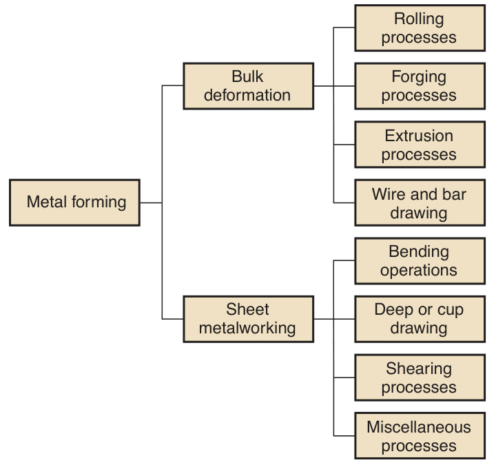
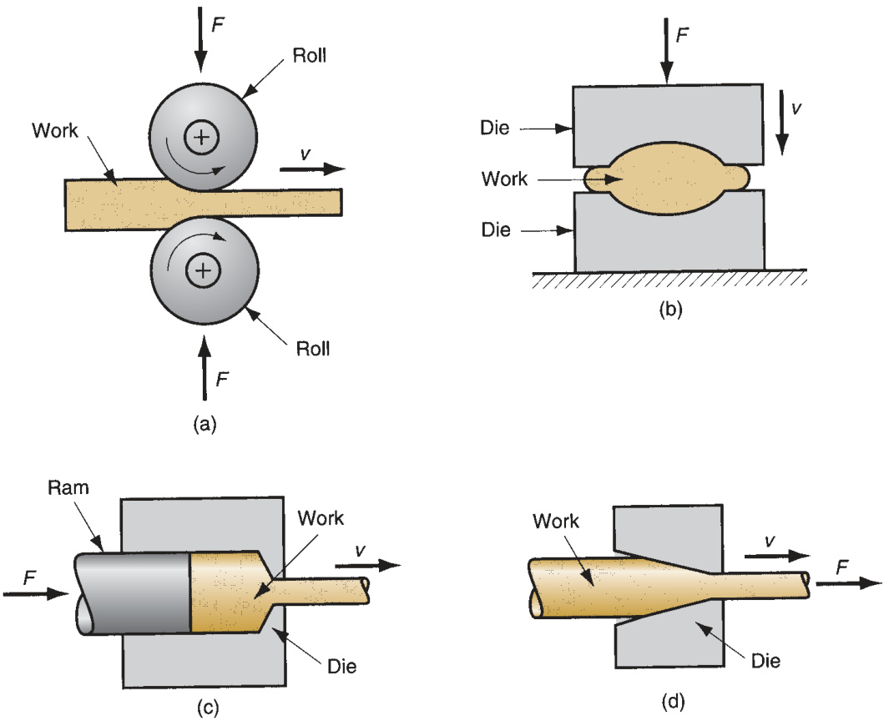
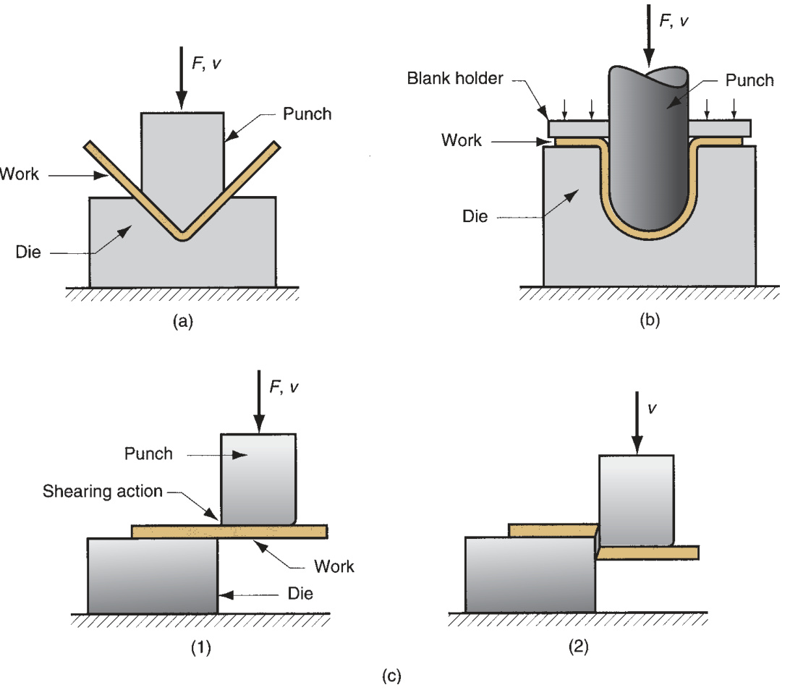
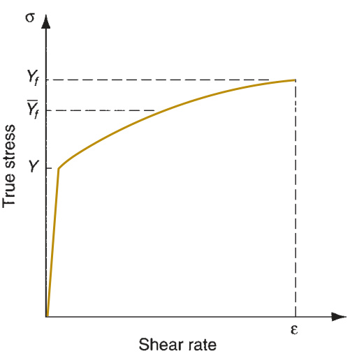
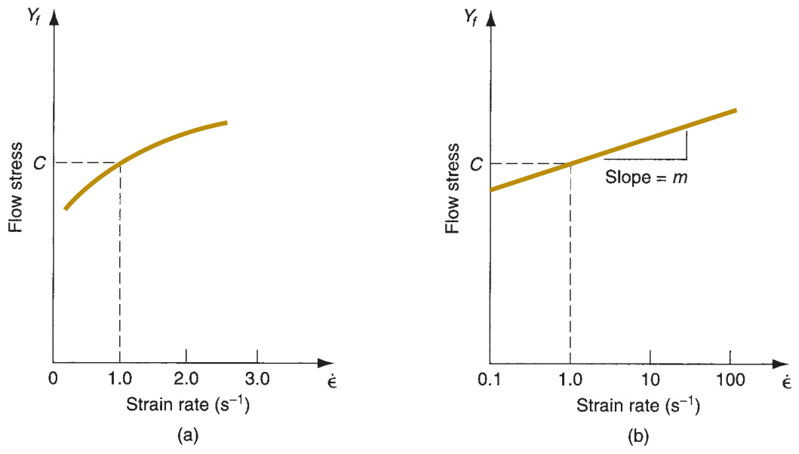
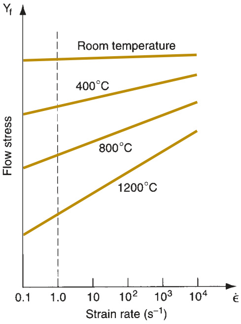
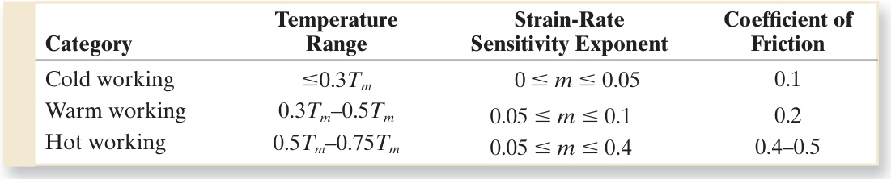

# Part V   Metal Forming and  Sheet Metalworking  

# 17 Fundamentals  of Metal Forming  

# Chapter Contents  

17.1 Overview of Metal Forming  

17.2 Material Behavior in Metal Forming  

17.3 Temperature in Metal Forming  

17.4 Strain Rate Sensitivity  

17.5 Friction and Lubrication in Metal  Forming  

Metal forming  includes a large group of manufacturing  processes in which plastic deformation is used to change  the shape of metal workpieces. Deformation results from  the use of a tool, usually called a  die  in metal forming,  which applies stresses that exceed the yield strength of  the metal. The metal therefore deforms to take a shape  determined by the geometry of the die. Metal forming  dominates the class of shaping operations identifi  ed in  Chapter 1 as the  deformation processes  (Figure 1.5).  

Stresses applied to plastically deform the metal are  usually compressive. However, some forming processes  stretch the metal, while others bend the metal, and still  others apply shear stresses to the metal. To be success- fully formed, a metal must possess certain properties.  Desirable properties include low yield strength and  high ductility. These properties are affected by tempera- ture. Ductility is increased and yield strength is reduced  when work temperature is raised. The effect of temper- ature gives rise to distinctions between cold working,  warm working, and hot working. Strain rate and friction  are additional factors that affect performance in metal  forming. All of these issues are examined in this chapter,  following an overview of the metal forming processes.  

# Overview of Metal  Forming  

Metal forming processes can be classifi  ed into two basic  categories: bulk deformation processes and sheet met- alworking processes. These two categories are covered  

  
FIGURE 17.1  Classifi  cation  of metal forming operations.  

in detail in Chapters 18 and 19, respectively. Each category includes several major  classes of shaping operations, as indicated in Figure 17.1.  

Bulk Deformation Processes  Bulk deformation processes are generally charac- terized by signifi  cant deformations and massive shape changes, and the surface area– to–volume of the work is relatively small. The term  bulk  describes the work parts  that have this low area–to–volume ratio. Starting work shapes for these processes  include cylindrical billets and rectangular bars. Figure 17.2 illustrates the following  basic operations in bulk deformation:  

➢   Rolling . This is a compressive deformation process in which the thickness of a  slab or plate is reduced by two opposing cylindrical tools called rolls. The rolls  rotate so as to draw the work into the gap between them and squeeze it.

 $\gg$ Forging . In forging, a workpiece is compressed between two opposing dies, so  that the die shapes are imparted to the work. Forging is traditionally a hot work- ing process, but many types of forging are performed cold.

 $\gg$ Extrusion . This is a compression process in which the work metal is forced to  fl  ow through a die opening, thereby taking the shape of the opening as its own  cross section.

 $\gg$ Drawing . In this forming process, the diameter of a round wire or bar is reduced  by pulling it through a die opening.  

Sheet Metalworking  Sheet metalworking processes are forming and cutting  operations performed on metal sheets, strips, and coils. The surface area–to–volume  ratio of the starting metal is high; thus, this ratio is a useful means to distinguish bulk  deformation from sheet metal processes.  Pressworking  is the term often applied to  sheet metal operations because the machines used to perform these operations are  

  
FIGURE 17.2  Basic  bulk deformation  processes: (a) rolling,  (b) forging,  (c) extrusion, and  (d) drawing. Relative  motion in the  operations is indicated  by   $v_{r}$ ; forces are  indicated by $F$ .  

presses (presses of various types are also used in other manufacturing processes).  A part produced in a sheet metal operation is often called a  stamping .  

Sheet metal operations are always performed as cold working processes and are  usually accomplished using a set of tools called a  punch  and  die . The punch is the  positive portion and the die is the negative portion of the tool set. The basic sheet  metal operations are sketched in Figure 17.3 and are defi  ned as follows:  

$\succcurlyeq$ Bending.  Bending involves straining of a metal sheet or plate to take an angle  along a (usually) straight axis.

 $\succcurlyeq$ Drawing.  In sheet metalworking, drawing refers to the forming of a fl  at metal  sheet into a hollow or concave shape, such as a cup, by stretching the metal. A  blankholder is used to hold down the blank while the punch pushes into the  sheet metal, as shown in Figure 17.3(b). To distinguish this operation from bar  and wire drawing, the terms  cup drawing  or  deep drawing  are often used.

 ➢   Shearing.  This process seems somewhat out-of-place in a list of deformation  processes, because it involves cutting rather than forming. A shearing operation  cuts the work using a punch and die, as in Figure 17.3(c). Although it is not a  forming process, it is included here because it is a necessary and very common  operation in sheet metalworking.  

The miscellaneous processes within the sheet metalworking classifi  cation in  Figure 17.1 include a variety of related shaping processes that do not use punch and  die tooling. Examples of these processes are stretch forming, roll bending, spinning,  and bending of tube stock.  

  
FIGURE 17.3  Basic  sheet metalworking  operations: (a) bending,  (b) drawing, and (c)  shearing: (1) as punch  fi  rst contacts sheet,  and (2) after cutting.  Force and relative  motion in these  operations are  indicated by $F$  and $v$ .  

17.2 17.2  

#  Material Behavior in Metal Forming  

Considerable insight about the behavior of metals during forming can be obtained  from the stress–strain curve. The typical stress–strain curve for most metals is divided  into an elastic region and a plastic region (Section 3.1.1). In metal forming, the plas- tic region is of primary interest because the material is plastically and permanently  deformed in these processes.  

The typical stress–strain relationship for a metal exhibits elasticity below the  yield point and strain hardening above it. Figures 3.4 and 3.5 indicate this behavior  in linear and logarithmic axes. In the plastic region, the metal’s behavior is expressed  by the fl  ow curve:  

$$
\sigma=K\epsilon^{n}
$$  

where $K=$  the strength coeffi  cient, MPa  $\mathrm{(lb/in^{2})}$ ; and $n$  is the strain hardening expo- nent. The stress  $\sigma$  and strain  $\epsilon$  in the fl  ow curve are true stress and true strain. The  fl  ow curve is generally valid as a relationship that defi  nes a metal’s plastic behavior  in cold working. Typical values of $K$  and $n$  for different metals at room temperature  are listed in Table 3.4.  

Flow Stress  The fl  ow curve describes the stress–strain relationship in the region  in which metal forming takes place. It indicates the fl  ow stress of the metal—the  strength property that determines forces and power required to accomplish a par- ticular forming operation. For most metals at room temperature, the stress–strain  plot of Figure 3.5 indicates that as the metal is deformed, its strength increases  due to strain hardening. The stress required to continue deformation must be  increased to match this increase in strength.  Flow stress  is defi  ned as the instan- taneous value of stress required to continue deforming the material—to keep the  metal “fl  owing.” It is the yield strength of the metal as a function of strain, which  can be expressed:  

$$
Y_{f}=K\epsilon^{n}
$$  

where  $Y_{f}=$  fl  ow stress, MPa  $\mathrm{(lb/in^{2})}$ .  

In the individual forming operations discussed in the following two chapters, the  instantaneous fl  ow stress can be used to analyze the process as it is occurring. For  example, in certain forging operations, the instantaneous force during compression  can be determined from the fl  ow stress value. Maximum force can be calculated  based on the fl  ow stress that results from the fi  nal strain at the end of the forging  stroke.  

In other cases, the analysis is based on the average stresses and strains that occur  during deformation rather than instantaneous values. Extrusion represents this case,  Figure 17.2(c). As the billet is reduced in cross section to pass through the extrusion  die opening, the metal gradually strain hardens to reach a maximum value. Rather  than determine a sequence of instantaneous stress–strain values during the reduc- tion, which would be not only diffi  cult but also of limited interest, it is more useful to  analyze the process based on the average fl  ow stress during deformation.  

Average Flow Stress  The average fl  ow stress (also called the  mean fl  ow stress ) is  the average value of stress over the stress–strain curve from the beginning of strain  to the fi  nal (maximum) value that occurs during deformation. The value is illustrated  in the stress–strain plot of Figure 17.4. The average fl  ow stress is determined by inte- grating the fl  ow curve equation, Equation (17.1), between zero and the fi  nal strain  value defi  ning the range of interest. This yields the equation:  

$$
\overline{{Y}}_{f}=\frac{K\epsilon^{n}}{1+n}
$$  

  
FIGURE 17.4  Stress–strain curve indicating  location of average fl  ow stress Y   in relation  to yield strength  Y  and fi  nal fl  ow stress  $Y_{f\ast}$  

where   $\overline{{Y}}_{f}\,=$  average fl  ow stress, MPa  $\mathrm{(lb/in^{2})}$ ; and  $\epsilon=$ maximum strain value during  the deformation process.  

Extensive use is made of the average fl  ow stress in the study of the bulk deforma- tion processes in the following chapter. Given values of $K$  and $n$  for the work mate- rial, a method of computing fi  nal strain will be developed for each process. Based on  this strain, Equation (17.2) can be used to determine the average fl  ow stress to which  the metal is subjected during the operation.  

#  Temperature in Metal Forming  

The fl  ow curve is a valid representation of stress–strain behavior of a metal dur- ing plastic deformation, particularly for cold working operations. For any metal, the  values of  $K$  and $n$  depend on temperature. Strength and strain hardening are both  reduced at higher temperatures. These property changes are important because they  result in lower forces and power during forming. In addition, ductility is increased  at higher temperatures, which allows greater plastic deformation of the work metal.  Three temperature ranges used in metal forming can be distinguished: cold, warm,  and hot working.  

Cold Working  Cold working (also known as  cold forming ) is metal forming per- formed at room temperature or slightly above. Signifi  cant advantages of cold forming  compared to hot working are (1) greater accuracy, meaning closer tolerances can be  achieved; (2) better surface fi  nish; (3) higher strength and hardness of the part due to  strain hardening; (4) grain fl  ow during deformation provides the opportunity for desir- able directional properties to be obtained in the resulting product; and (5) no heating  of the work is required, which saves on furnace and fuel costs and permits higher pro- duction rates. Owing to this combination of advantages, many cold forming processes  have become important mass-production operations. They provide close tolerances  and good surfaces, minimizing the amount of machining required so that these opera- tions can be classifi  ed as net shape or near net shape processes (Section 1.3.1).  

There are certain disadvantages or limitations associated with cold forming oper- ations: (1) higher forces and power are required to perform the operation; (2) care  must be taken to ensure that the surfaces of the starting workpiece are free of scale  and dirt; and (3) ductility and strain hardening of the work metal limit the amount  of forming that can be done to the part. In some operations, the metal must be  annealed (Section 26.1) in order to allow further deformation to be accomplished.  In other cases, the metal is simply not ductile enough to be cold worked.  

To overcome the strain hardening problem and reduce force and power require- ments, many forming operations are performed at elevated temperatures. There are  two elevated temperature ranges involved, giving rise to the terms warm working  and hot working.  

Warm Working  Because plastic deformation properties are normally enhanced  by increasing workpiece temperature, forming operations are sometimes performed  at temperatures somewhat above room temperature but below the recrystallization  temperature. The term  warm working  is applied to this second temperature range.  The dividing line between cold working and warm working is often expressed in  terms of the melting point for the metal. The dividing line is usually taken to be $0.3T_{m}$ ,  where  $T_{m}$  is the melting point (absolute temperature) for the particular metal.  

The lower strength and strain hardening at the intermediate temperatures, as well  as higher ductility, provide warm working with the following advantages over cold  working: (1) lower forces and power, (2) more intricate work geometries possible,  and (3) need for annealing may be reduced or eliminated.  

Hot Working  Hot working (also called  hot forming ) involves deformation at  temperatures above the recrystallization temperature (Section 3.3). The recrystal- lization temperature for a given metal is about one-half of its melting point on the  absolute scale. In practice, hot working is usually carried out at temperatures some- what above $0.5T_{m}$ . The work metal continues to soften as temperature is increased  beyond $0.5T_{m}$ , thus enhancing the advantage of hot working above this level. How- ever, the deformation process itself generates heat, which increases work tempera- tures in localized regions of the part. This can cause melting in these regions, which  is highly undesirable. Also, scale on the work surface is accelerated at higher tem- peratures. Accordingly, hot working temperatures are usually maintained within the  range $0.5T_{m}$  to $0.75\,T_{m}$ .  

The most signifi  cant advantage of hot working is the capability to produce substan- tial plastic deformation of the metal—far more than is possible with cold working or  warm working. The principal reason for this is that the fl  ow curve of the hot-worked  metal has a strength coeffi  cient that is substantially less than at room temperature,  the strain hardening exponent is zero (at least theoretically), and the ductility of the  metal is signifi  cantly increased. All of this results in the following advantages relative  to cold working: (1) the shape of the work part can be signifi  cantly altered, (2) lower  forces and power are required to deform the metal, (3) metals that usually fracture  in cold working can be hot formed, (4) strength properties are generally isotropic  because of the absence of the oriented grain structure typically created in cold work- ing, and (5) no strengthening of the part occurs from work hardening. This last advan- tage may seem inconsistent, since strengthening of the metal is often considered an  advantage for cold working. However, there are applications in which it is undesir- able for the metal to be work hardened because it reduces ductility, for example, if the  part is to be subsequently processed by cold forming. Disadvantages of hot working  include (1) lower dimensional accuracy, (2) higher total energy required (due to the  thermal energy to heat the workpiece), (3) work surface oxidation (scale), (4) poorer  surface fi  nish, and (5) shorter tool life.  

Recrystallization of the metal in hot working involves atomic diffusion, which  is a time-dependent process. Metal forming operations are often performed at  high speeds that do not allow suffi  cient time for complete recrystallization of the  grain structure during the deformation cycle itself. However, because of the high  temperatures, recrystallization eventually does occur. It may occur immediately  following the forming process or later, as the workpiece cools. Even though recrys- tallization may occur after the actual deformation, its eventual occurrence, and  the substantial softening of the metal at high temperatures, are the features that  distinguish hot working from warm working or cold working.  

Isothermal Forming  Certain metals, such as highly alloyed steels, many titanium  alloys, and high-temperature nickel alloys, possess good hot hardness, a property that  makes them useful for high-temperature service. However, this very property that  makes them attractive in these applications also makes them diffi  cult to form with  conventional methods. The problem is that when these metals are heated to their  hot working temperatures and then come in contact with the relatively cold forming  tools, heat is quickly transferred away from the part surfaces, thus raising the strength  in these regions. The variations in temperature and strength in different regions of  the workpiece cause irregular fl  ow patterns in the metal during deformation, leading  to high residual stresses and possible surface cracking.  

Isothermal forming  refers to forming operations that are carried out in such a  way as to eliminate surface cooling and the resulting thermal gradients in the work  part. It is accomplished by preheating the tools that come in contact with the part  to the same temperature as the work metal. This weakens the tools and reduces  tool life, but it avoids the problems described above when these diffi  cult metals are  formed by conventional methods. In some cases, isothermal forming represents the  only way in which these work materials can be formed. The procedure is most closely  associated with forging, and isothermal forging is discussed in the following chapter.  

Theoretically, a metal in hot working behaves like a perfectly plastic material, with  strain hardening exponent  $n\,=\,0$ . This means that the metal should continue to  fl  ow under the same level of fl  ow stress, once that stress level is reached. However,  there is an additional phenomenon that characterizes the behavior of metals during  deformation, especially at the elevated temperatures of hot working. That phenom- enon is strain rate sensitivity. Discussion of this topic begins with a defi  nition of  strain rate.  

The rate at which the metal is strained in a forming process is directly related to  the speed of deformation $\nu$ . In many forming operations, deformation speed is equal  to the velocity of the ram or other moving element of the equipment. It is most easily  visualized in a tensile test as the velocity of the testing machine head relative to its  fi  xed base. Given the deformation speed,  strain rate  is defi  ned:  

$$
\dot{\epsilon}\ =\frac{\nu}{h}
$$  

where  $\dot{\epsilon}=$  true strain rate,  $\mathrm{m/s/m\(in/sec/in)}$ , or simply  $\mathbf{S}^{-1}$ ; and  $h=$ instantaneous  height of the workpiece being deformed, m (in). If deformation speed  $\nu$  is constant  during the operation, strain rate will change as $h$  changes. In most practical forming  operations, valuation of strain rate is complicated by the geometry of the work part  and variations in strain rate in different regions of the part. Strain rate can reach  $1000~\mathrm{s}^{-1}$  or more for some metal forming processes such as high-speed rolling and  forging.  

It has already been observed that the fl  ow stress of a metal is a function of tem- perature. At the temperatures of hot working, fl  ow stress depends on strain rate. The  effect of strain rate on strength properties is known as  strain rate sensitivity . The  effect can be seen in Figure 17.5. As strain rate is increased, resistance to deforma- tion increases. This usually plots approximately as a straight line on a log–log graph,  thus leading to the relationship:  

$$
Y_{f}\,=\,C\dot{\epsilon}^{m}
$$  

where  $C$  is the strength constant (similar but not equal to the strength coeffi  cient in  the fl  ow curve equation), and $m$  is the strain rate sensitivity exponent. The value of  $C$ is determined at a strain rate of 1.0, and $m$  is the slope of the curve in Figure 17.5(b).  

  
FIGURE 17.5  (a) Effect  of strain rate on fl  ow  stress at an elevated  work temperature.  (b) Same relationship  plotted on log–log  coordinates.  

The effect of temperature on the parameters of Equation (17.4) is pronounced.  Increasing temperature decreases the value of  $C$  (consistent with its effect on  $K$  in  the fl  ow curve equation) and increases the value of $m$ . The general result can be seen  in Figure 17.6. At room temperature, the effect of strain rate is almost negligible,  indicating that the fl  ow curve is a good representation of the material behavior. As  temperature is increased, strain rate plays a more important role in determining  fl  ow stress, as indicated by the steeper slopes of the strain rate relationships. This is  important in hot working because deformation resistance of the material increases  so dramatically as strain rate is increased. To give a sense of the effect, typical values  of $m$  for the three temperature ranges of metal working are given in Table 17.1.  

Thus, even in cold working, strain rate can have an effect, if small, on fl  ow stress.  In hot working, the effect can be signifi  cant. A more complete expression for fl  ow  stress as a function of both strain and strain rate would be the following:  

  
FIGURE 17.6  Effect of temperature on fl  ow  stress for a typical metal. The constant $c$  in  Equation (17.4), indicated by the intersection of  each plot with the vertical dashed line at strain  rate $=1.0$ , decreases, and $m$  (slope of each  plot) increases with increasing temperature.  

TABLE  •  17.1  Typical values of temperature, strain-rate sensitivity, and coeffi  cient  of friction in cold, warm, and hot working. 
  

$$
Y_{f}\ ={\cal A}\epsilon^{n}\dot{\epsilon}^{m}
$$  

where $A=\mathrm{a}$  strength coeffi  cient, combining the effects of the previous  $K$  and  $C$  val- ues. Of course, $A,n$ , and $m$  would all be functions of temperature, and the enormous  task of testing and compiling the values of these parameters for different metals and  various temperatures would be forbidding.  

In the coverage of the bulk deformation processes in Chapter 18, many of which  are performed hot, the effect of strain rate is neglected in analyzing forces and power.  For cold working and warm working, and for hot working operations at relatively  low deformation speeds, this neglect represents a reasonable assumption.  

#  Friction and Lubrication in Metal Forming  

Friction in metal forming arises because of the close contact between the tool and  work surfaces and the high pressures that drive the surfaces together in these opera- tions. In most metal forming processes, friction is undesirable for the following rea- sons: (1) metal fl  ow in the work is retarded, causing residual stresses and sometimes  defects in the product; (2) forces and power to perform the operation are increased,  and (3) tool wear can lead to loss of dimensional accuracy, resulting in defective parts  and requiring replacement of the tooling. Since tools in metal forming are generally  expensive, tool wear is a major concern. Friction and tool wear are more severe in  hot working because of the much harsher environment.  

Friction in metal forming is different from that encountered in most mechanical  systems, such as gear trains, shafts and bearings, and other components involving rel- ative motion between surfaces. These other cases are generally characterized by low  contact pressures, low to moderate temperatures, and ample lubrication to minimize  metal-to-metal contact. By contrast, the metal forming environment features high  pressures between a hardened tool and a soft work part, plastic deformation of the  softer material, and high temperatures (at least in hot working). These conditions  can result in relatively high coeffi  cients of friction in metal working, even in the pres- ence of lubricants. Typical values of coeffi  cient of friction for the three categories of  metal forming are listed in Table 17.1.  

If the coeffi  cient of friction becomes large enough, a condition known as sticking  occurs.  Sticking  in metalworking (also called  sticking friction ) is the tendency for the  two surfaces in relative motion to adhere to each other rather than slide. It means  that the friction stress between the surfaces exceeds the shear fl  ow stress of the work  metal, thus causing the metal to deform by a shear process beneath the surface rather  than slip at the surface. Sticking occurs in metal forming operations and is a prominent  problem in rolling; it is discussed in that context in the following chapter.  

Metalworking lubricants are applied to the tool—work interface in many forming  operations to reduce the harmful effects of friction. Benefi  ts include reduced stick- ing, forces, power, and tool wear; and better surface fi  nish on the product. Lubricants  also serve other functions, such as removing heat from the tooling. Considerations in  choosing an appropriate metalworking lubricant include (1) type of forming process  (rolling, forging, sheet metal drawing, and so on), (2) whether used in hot working or  cold working, (3) work material, (4) chemical reactivity with the tool and work metals  (it is generally desirable for the lubricant to adhere to the surfaces to be most effective  in reducing friction), (5) ease of application, (6) toxicity, (7) fl  ammability, and (8) cost.  

Lubricants used for cold working operations include [4], [7] mineral oils, fats and  fatty oils, water-based emulsions, soaps, and other coatings. Hot working is some- times performed dry for certain operations and materials (e.g., hot rolling of steel  and extrusion of aluminum). When lubricants are used in hot working, they include  mineral oils, graphite, and glass. Molten glass becomes an effective lubricant for hot  extrusion of steel alloys. Graphite contained in water or mineral oil is a common  lubricant for hot forging of various work materials. More detailed treatments of  lubricants in metalworking are found in references [7] and [9].  

# References  

[1] Altan, T., Oh, S.-I., and Gegel, H. L.  Metal  Forming: Fundamentals and Applications .  ASM International, Materials Park, Ohio, 1983.

 [2] Cook, N. H.  Manufacturing Analysis . Addison- Wesley, Reading, Massachusetts, 1966.

 [3] Hosford, W. F., and Caddell, R. M.  Metal  Forming: Mechanics and Metallurgy , 3rd ed.  Cambridge University Press, Cambridge, U. K.,  2007.

 [4] Lange, K.  Handbook of Metal Forming . Soci- ety of Manufacturing Engineers, Dearborn,  Michigan, 2006.

 [5] Lenard, J. G.  Metal Forming Science and  Practice , Elsevier Science, Amsterdam, The  Netherlands, 2002.  

# Review Questions  

17.1 What are the differences between bulk defor- mation processes and sheet metal processes?

  17.2 Extrusion is a fundamental shaping process.  Describe it. 

  17.3 Why is the term pressworking often used for  sheet metal processes?  

[6] Mielnik, E. M.  Metalworking Science and  Engineering . McGraw-Hill, New York, 1991.

 [7] Nachtman, E. S., and Kalpakjian, S.  Lubricants  and Lubrication in Metalworking Operations .  Marcel Dekker, New York, 1985.

 [8] Wagoner, R. H., and Chenot, J.-L.  Fundamen- tals of Metal Forming . John Wiley & Sons,  New York, 1997.

 [9] Wick, C., Benedict, J. T., and Veilleux, R. F.,  (eds.).  Tool and Manufacturing Engineers  Handbook , 4th ed. Vol. II,  Forming . Soci- ety of Manufacturing Engineers, Dearborn,  Michigan, 1984.  

17.4 What is the difference between deep drawing  and bar drawing?

  17.5 Indicate the mathematical equation for the  fl  ow curve.

  17.6 How does increasing temperature affect the  parameters in the fl  ow curve equation?  