# Machining  Operations and  Machine Tools  

# Chapter Contents  

21.1 Machining and Part Geometry  

21.2 Turning and Related Operations  

21.2.1 Cutting Conditions in Turning 21.2.2 Operations Related to Turning 21.2.3 The Engine Lathe 21.2.4 Other Lathes and Turning  Machines 21.2.5 Boring Machines  

21.3 Drilling and Related Operations  

21.3.1 Cutting Conditions in Drilling 21.3.2 Operations Related to Drilling 21.3.3 Drill Presses  

# 21.4 Milling  

21.4.1 Types of Milling Operations 21.4.2 Cutting Conditions in Milling 21.4.3 Milling Machines  

21.5 Machining Centers and Turning Centers  

21.6 Other Machining Operations  

21.6.1 Shaping and Planing 21.6.2 Broaching 21.6.3 Sawing  

Machining is the most versatile and accurate of all  manufacturing processes in its capability to produce  a diversity of part geometries and geometric features.  Casting can also produce a variety of shapes, but it  lacks the precision and accuracy of machining. This  chapter describes the important machining operations  and the machine tools used to perform them. Historical  Note 21.1 provides a brief narrative of the develop- ment of machine tool technology.  

# 21.1 21.1  

# Machining and Part  Geometry  

Machined parts can be classifi  ed as rotational or non- rotational (Figure 21.1). A  rotational  work part has a  cylindrical or disk-like shape. The characteristic opera- tion that produces this geometry is one in which a cut- ting tool removes material from a rotating work part.  Examples include turning and boring. Drilling is closely  related except that an internal cylindrical shape is created  and the tool rotates (rather than the work) in most drill- ing operations. A  nonrotational  (also called  prismatic )  work part is block-like or plate-like, as in Figure 21.1(b).  This geometry is achieved by linear motions of the work  part, combined with either rotating or linear tool motions.  Operations in this category include milling, shaping, plan- ing, and sawing.  

21.7 Machining Operations for Special  Geometries  

21.7.1 Screw Threads 21.7.2 Gears  

21.8 High-Speed Machining  

  
FIGURE 21.1  Machined parts are classifi  ed as (a) rotational, or (b) nonrotational, shown here by block and fl  at parts.  

# Historical Note 21.1  Machine tool technology  

Material removal as a means of making things dates  back to prehistoric times, when man learned to carve  wood and chip stones to make hunting and farming  implements. There is archaeological evidence that  the ancient Egyptians used a rotating bowstring  mechanism to drill holes.  

Development of modern machine tools is closely  related to the Industrial Revolution. When James Watt  designed his steam engine in England around 1763,  one of the technical problems he faced was to make  the bore of the cylinder suffi  ciently accurate to prevent  steam from escaping around the piston. John  Wilkinson  built a water-wheel powered  boring   machine  around  1775, which permitted Watt to build his steam engine.  This boring machine is often recognized as the fi  rst  machine tool.  

Another Englishman, Henry Maudsley, developed  the fi  rst  screw-cutting   lathe  around 1800. Although  the turning of wood had been accomplished for many  centuries, Maudsley’s machine added a mechanized  tool carriage with which feeding and threading opera- tions could be performed with much greater precision  than any means before.  

Eli Whitney is credited with developing the fi  rst  milling   machine  in the United States around 1818.  Development of the  planer  and  shaper  occurred in  England between 1800 and 1835, in response to the  need to make components for the steam engine, tex- tile equipment, and other machines associated with  the Industrial Revolution.  The powered  drill   press  was  developed by James Nasmyth around 1846, which  permitted drilling of accurate holes in metal.  

Most of the conventional boring machines, lathes,  milling machines, planers, shapers, and drill presses  used today have the same basic designs as the early  versions developed during the last two centuries.  Modern machining centers—machine tools capable of  performing more than one type of cutting operation— were introduced in the late 1950s, after numerical con- trol had been developed (Historical Note 37 .1).  

Each machining operation produces a characteristic geometry due to two factors:  (1) the relative motions between the tool and the work part and (2) the shape of  the cutting tool. These operations that create part shape are classifi  ed as generating  and forming. In  generating , the geometry of the work part is determined by the feed  trajectory of the cutting tool. The path followed by the tool during its feed motion is  imparted to the work surface in order to create shape. Examples of generating include  straight turning, taper turning, contour turning, peripheral milling, and profi  le milling,  all illustrated in Figure 21.2. In each of these operations, material removal is accom- plished by the speed motion in the operation, but part shape is determined by the feed  motion. The feed trajectory may involve variations in depth or width of cut during the  operation. For example, in the contour turning and profi  le milling operations shown  in the fi  gure, the feed motion results in changes in depth and width, respectively, as  cutting proceeds.  

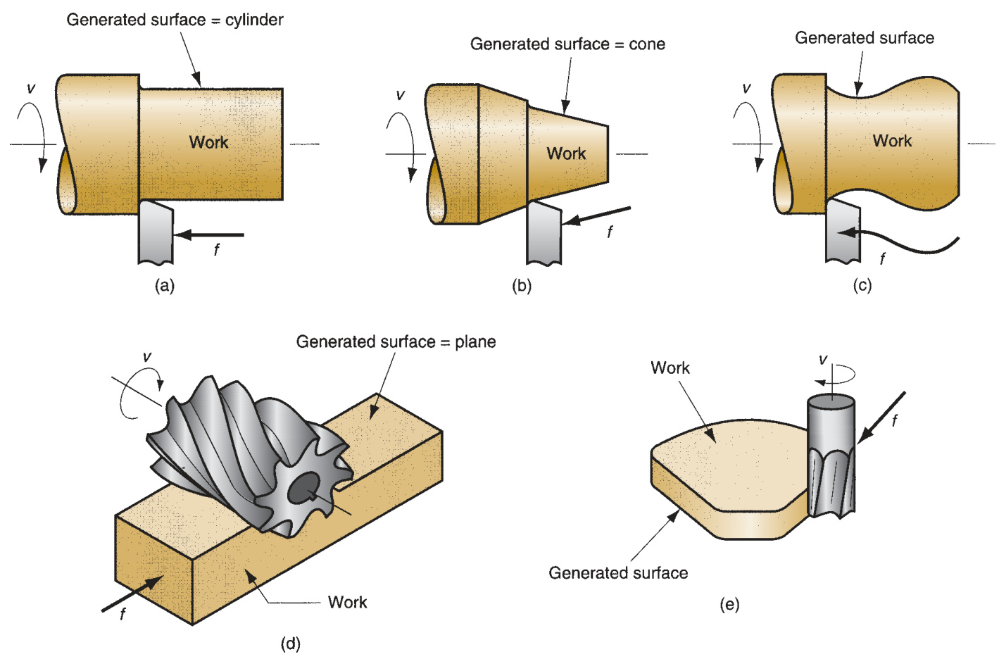  
FIGURE 21.2  Generating shape in machining: (a) straight turning, (b) taper turning, (c) contour turning, (d) plain milling,  and (e) profi  le milling.  

In  forming , the shape of the part is created by the geometry of the cutting tool.  In effect, the cutting edge of the tool has the reverse of the shape to be produced  on the part surface. Form turning, drilling, and broaching are examples of this  case. In these operations, illustrated in Figure 21.3, the shape of the cutting tool  is imparted to the work in order to create part geometry. The cutting conditions  in forming usually include the primary speed motion combined with a feeding  motion that is directed into the work. Depth of cut in this category of machining  usually refers to the fi  nal penetration into the work after the feed motion has  been completed.  

Forming and generating are sometimes combined in one operation, as illustrated  in Figure 21.4 for thread cutting on a lathe and slotting on a milling machine. In  thread cutting, the pointed shape of the cutting tool determines the form of the  threads, but the large feed rate generates the threads. In slotting (also called slot  milling), the width of the cutter determines the width of the slot, but the feed motion  creates the slot.  

Machining is classifi  ed as a secondary process. In general, secondary processes  follow basic processes, whose purpose is to establish the initial shape of a workpiece.  Examples of basic processes include casting, forging, and bar rolling (to produce rod  and bar stock). The shapes produced by these processes usually require refi  nement  

  
FIGURE 21.3  Forming to create shape in machining: (a) form turning, (b) drilling, and (c) broaching.  

by secondary processes. Machining operations serve to transform the starting shapes  into the fi  nal geometries specifi  ed by the part designer. For example, bar stock is the  initial shape, but the fi  nal geometry after a series of machining operations is a shaft.  The basic and secondary processes are described in more detail in Section 39.1.1 on  process planning.  

FIGURE 21.4  Combination of forming  and generating to create  shape: (a) thread cutting  on a lathe, and (b) slot  milling.  

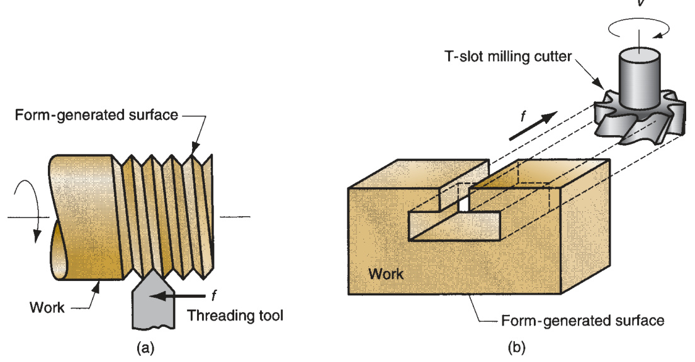  

#  Turning and Related Operations  

Turning is a machining process in which a single-point tool removes material from  the surface of a rotating workpiece. The tool is fed linearly in a direction parallel to  the axis of rotation to generate a cylindrical geometry, as illustrated in Figures 21.2(a)  and 21.5. Single-point tools used in turning and other machining operations are dis- cussed in Section 22.3.1. Turning is traditionally carried out on a machine tool called  a  lathe , which provides power to turn the part at a given rotational speed and to feed  the tool at a specifi  ed rate and depth of cut.  

# 21.2.1  CUTTING CONDITIONS IN TURNING  

The rotational speed in turning is related to the desired cutting speed at the surface  of the cylindrical workpiece by the equation  

$$
N=\frac{\nu}{\pi D_{o}}
$$  

where  $N=$  rotational speed, rev/min;  $\nu=$  cutting speed,  $\mathbf{m}/\mathbf{min}$  (ft/min); and  $D_{o}=$ original diameter of the part, m (ft).  

The turning operation reduces the diameter of the work from its original diameter  $D_{o}$ to a fi  nal diameter $D_{f},$  as determined by the depth of cut  $d$ :  

$$
D_{f}=D_{o}-2d
$$  

The feed in turning is generally expressed in  $\mathrm{mm/rev}$  (in/rev). This feed can be  converted to a linear travel rate in mm/min  $(\mathrm{in}/\mathrm{min})$ ) by the formula  

$$
f_{r}=N f
$$  

where $f_{r}=$  feed rate, $\mathrm{mm/min}\,(\mathrm{in/min})$ ; and $f\!=$  feed, mm/rev (in/rev).  

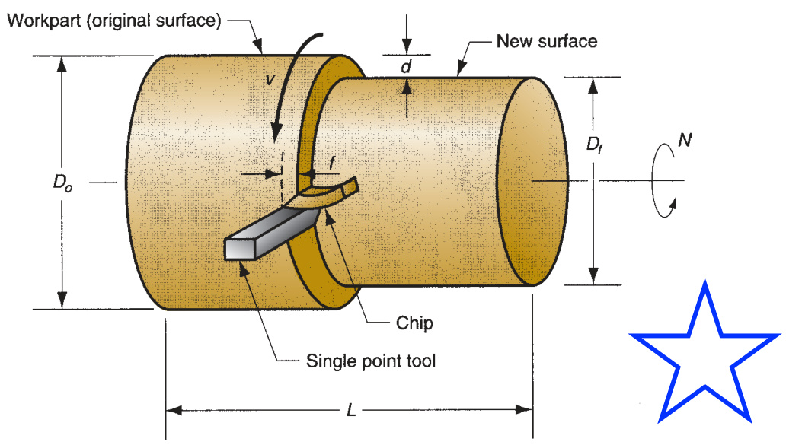  
FIGURE 21.5  Turning operation.  

The time to machine from one end of a cylindrical work part to the other is given by  

$$
T_{m}={\frac{L}{f_{r}}}
$$  

where  $T_{m}=$  machining time, min; and $L=$ length of the cylindrical work part, mm (in).  A more direct computation of the machining time is provided by the following equation:  

$$
T_{m}=\frac{\pi D_{o}L}{f\nu}
$$  

where $D_{o}=$  work diameter, mm (in); $L=$  work part length, $\mathrm{mm}$  (in); $f\!=$  feed, mm/rev  $\mathrm{(in/rev)}$ ; and $\nu=$  cutting speed, $\mathrm{mm/min}\,(\mathrm{in/min})$ . As a practical matter, a small distance  is usually added to the work part length at the beginning and end of the piece to allow  for approach and overtravel of the tool. Thus, the duration of the feed motion past the  work will be longer than  $T_{m}$ .  

The volumetric rate of material removal can be most conveniently determined by  the following equation:  

$$
R_{M R}=\nu f d
$$  

where  $R_{\scriptscriptstyle M R}\,=$  material removal rate,  $\mathrm{mm}^{3}/\mathrm{min}\ (\mathrm{in}^{3}/\mathrm{min})$ . In using this equation, the  units for $f$  are expressed simply as mm (in), in effect neglecting the rotational character  of turning. Also, care must be exercised to ensure that the units for speed are consistent  with those for $f$  and $d$ .  

# Example 21.1  Machining time  in turning  

A turning operation is performed on a cylindrical work part whose diameter $=$   $120\,\mathrm{mm}$  and length $=450\,\mathrm{mm}$ . Cutting speed $=2.0\:\mathrm{m/s},$ , feed $=0.25\,\mathrm{mm/rev}$ , and  depth of cut $\cdot=2.2\:\mathrm{mm}$ . Determine (a) cutting time and (b) material removal rate.  

Solution:  (a) For consistency of units, cutting speed $\nu=2000\,\mathrm{mm/s}$ . Using  Equation (21.5),  

$$
T_{m}={\frac{\pi D_{o}L}{f\nu}}={\frac{\pi(120)(450)}{(2000)(0.25)}}=339.3\ \mathrm{s}=5.65\ \mathrm{min}
$$  

$\mathrm{(b)}\,R_{M R}=2000(0.25)(2.2)=1100\,\,{\mathrm{mm}}^{3}/{\mathrm{s}}$  

# 21.2.2  OPERATIONS RELATED TO TURNING  

A variety of other machining operations can be performed on a lathe in addition to  turning; these include the following, illustrated in Figure 21.6:  

(a)  Facing . The tool is fed radially into the rotating work on one end to create a fl  at  surface on the end.

 (b)  Taper turning . Instead of feeding the tool parallel to the axis of rotation of the  work, the tool is fed at an angle, thus creating a tapered cylinder or conical shape.

 (c)  Contour turning . Instead of feeding the tool along a straight line parallel to  the axis of rotation as in turning, the tool follows a contour that is other than  straight, thus creating a contoured form in the turned part.  

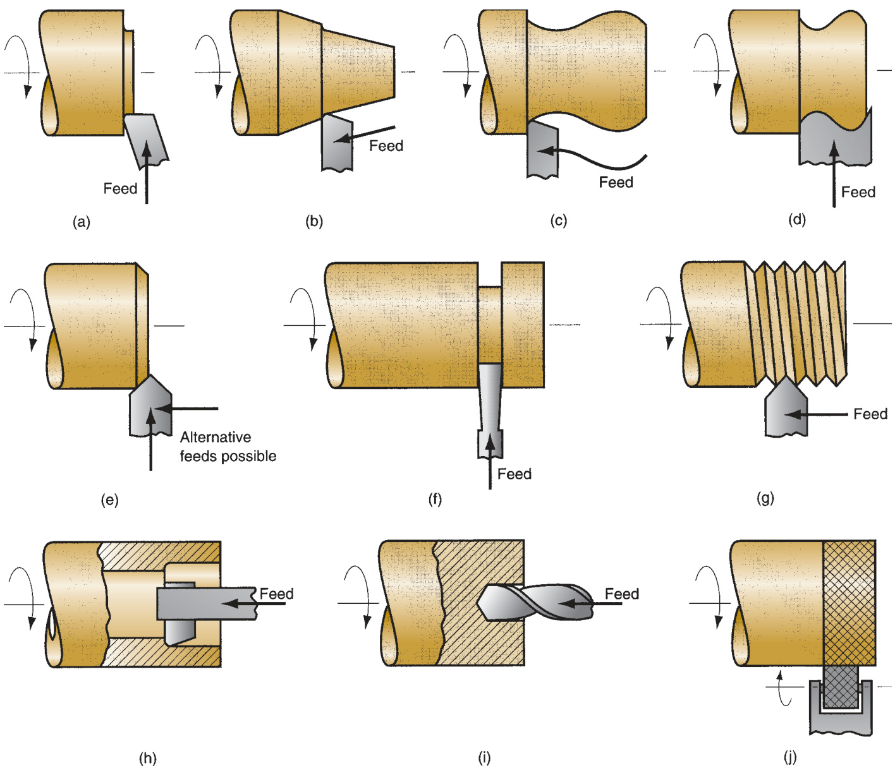  
FIGURE 21.6  Machining operations other than turning that are performed on a lathe: (a) facing, (b) taper turning,  (c) contour turning, (d) form turning, (e) chamfering, (f) cutoff, (g) threading, (h) boring, (i) drilling, and (j) knurling.  

(d)  Form turning . In this operation, sometimes called  forming , the tool has a shape  that is imparted to the work by plunging the tool radially into the work.

 (e)  Chamfering . The cutting edge of the tool is used to cut an angle on the corner  of the cylinder, forming a “chamfer.”

 (f)  Cutoff . The tool is fed radially into the rotating work at some location along  its length to cut off the end of the part. This operation is sometimes referred to  as  parting .

 (g)  Threading . A pointed tool is fed linearly across the outside surface of the rotat- ing work part in a direction parallel to the axis of rotation at a large effective  feed rate, thus creating threads in the cylinder. Methods of machining screw  threads are discussed in greater detail in Section 21.7.1.  

(h)  Boring . A single-point tool is fed linearly, parallel to the axis of rotation, on the  inside diameter of an existing hole in the part.

 (i)  Drilling . Drilling can be performed on a lathe by feeding the drill into the  rotating work along its axis.  Reaming  can be performed in a similar way.

 (j)  Knurling . This is not a machining operation because it does not involve cutting  of material. Instead, it is a metal forming operation used to produce a regular  cross-hatched pattern in the work surface.  

Most lathe operations use single-point tools. Turning, facing, taper turning, con- tour turning, chamfering, and boring are all performed with single-point tools. A  threading operation is accomplished using a single-point tool designed with a geom- etry that shapes the thread. Certain operations require tools other than single-point.  Form turning is performed with a specially designed tool called a form tool. The  profi  le shape ground into the tool establishes the shape of the work part. A cutoff  tool is basically a form tool. Drilling is accomplished by a drill bit (Section 22.3.2).  Knurling is performed by a knurling tool, consisting of two hardened forming rolls,  each mounted between centers. The forming rolls have the desired knurling pattern  on their surfaces. To perform knurling, the tool is pressed against the rotating work  part with suffi  cient pressure to impress the pattern onto the work surface.  

# 21.2.3  THE ENGINE LATHE  

The basic lathe used for turning and related operations is an  engine lathe . It is a versatile  machine tool, manually operated, and widely used in low and medium production. The  term  engine  dates from the time when these machines were driven by steam engines.  

Engine Lathe Technology   Figure 21.7 is a sketch of an engine lathe showing its  principal components. The  headstock  contains the drive unit to rotate the spindle,  which rotates the work. Opposite the headstock is the  tailstock , in which a center is  mounted to support the other end of the workpiece.  

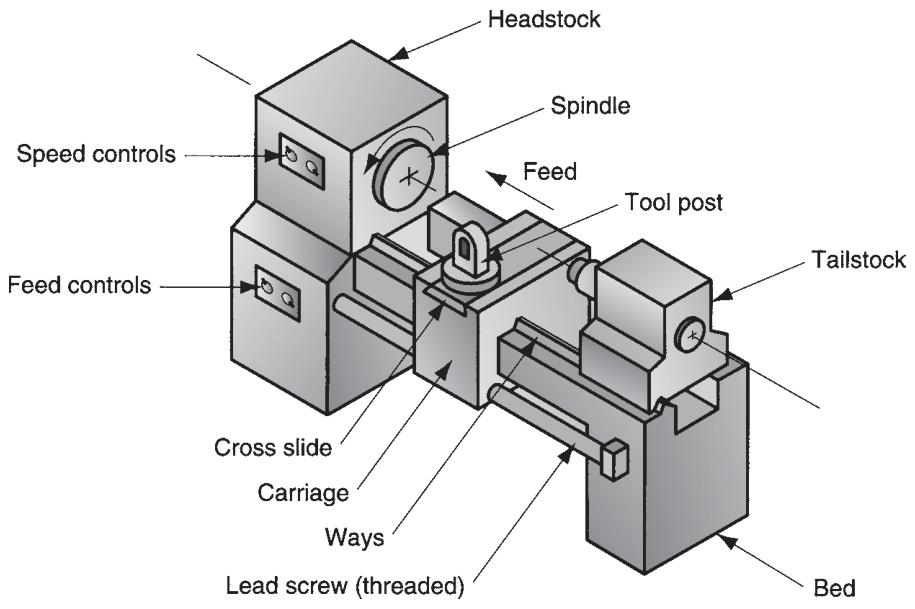  
FIGURE 21.7  Diagram  of an engine lathe,  indicating its principal  components.  

The cutting tool is held in a  tool post  fastened to the  cross-slide , which is assembled  to the  carriage . The carriage is designed to slide along the  ways  of the lathe in order  to feed the tool parallel to the axis of rotation. The ways are like tracks along which  the carriage rides, and they are made with great precision to achieve a high degree  of parallelism relative to the spindle axis. The ways are built into the  bed  of the lathe,  providing a rigid frame for the machine tool.  

The carriage is driven by a leadscrew that rotates at the proper speed to obtain the  desired feed rate. The cross-slide is designed to feed in a direction perpendicular to  the carriage movement. Thus, by moving the carriage, the tool can be fed parallel to  the work axis to perform straight turning; or by moving the cross-slide, the tool can  be fed radially into the work to perform facing, form turning, or cutoff operations.  

The conventional engine lathe and most other machines described in this section are  horizontal turning machines ; that is, the spindle axis is horizontal. This is appropriate  for the majority of turning jobs, in which the length is greater than the diameter. For  jobs in which the diameter is large relative to length and the work is heavy, it is more  convenient to orient the work so that it rotates about a vertical axis; these are  vertical  turning machines .  

The size of a lathe is designated by swing and maximum distance between centers.  The  swing  is the maximum work part diameter that can be rotated in the spindle,  determined as twice the distance between the centerline of the spindle and the  ways of the machine. The actual maximum size of a cylindrical workpiece that  can be accommodated on the lathe is smaller than the swing because the carriage  and cross-slide assembly are in the way. The  maximum distance between centers   indicates the maximum length of a workpiece that can be mounted between head- stock and tailstock centers. For example, a  $350~\mathrm{mm}\times1.2~\mathrm{m}$ ( $14~\mathrm{in}\times48$  in) lathe  designates that the swing is  $350~\mathrm{mm}$  (14 in) and the maximum distance between  centers is $1.2\:\mathrm{m}$  (48 in).  

Methods of Holding the Work in a Lathe   There are four common methods  used to hold work parts in turning. These workholding methods consist of various  mechanisms to grasp the work, center and support it in position along the spindle  axis, and rotate it. The methods, illustrated in Figure 21.8, are (a) mounting the work  between centers, (b) chuck, (c) collet, and (d) face plate.  

Holding the work  between centers  refers to the use of two centers, one in the head- stock and the other in the tailstock, as in Figure 21.8(a). This method is appropriate  for parts with large length-to-diameter ratios. At the headstock center, a device called  a  dog  is attached to the outside of the work and is used to drive the rotation from the  spindle. The tailstock center has a cone-shaped point which is inserted into a tapered  hole in the end of the work. The tailstock center is either a “live” center or a “dead”  center. A  live center  rotates in a bearing in the tailstock, so that there is no relative  rotation between the work and the live center, hence, no friction between the center  and the workpiece. In contrast, a  dead center  is fi  xed to the tailstock, so that it does  not rotate; instead, the workpiece rotates about it. Because of friction and the heat  buildup that results, this setup is normally used at lower rotational speeds. The live  center can be used at higher speeds.  

The  chuck , Figure 21.8(b), is available in several designs, with three or four jaws to  grasp the cylindrical work part on its outside diameter. The jaws are often designed so  they can also grasp the inside diameter of a tubular part. A  self-centering  chuck has a  mechanism to move the jaws in or out simultaneously, thus centering the work at the  spindle axis. Other chucks allow independent operation of each jaw. Chucks can be  

  
FIGURE 21.8  Four workholding methods used in lathes: (a) mounting the work between centers using a dog,  (b) three-jaw chuck, (c) collet, and (d) faceplate for noncylindrical work parts.  

used with or without a tailstock center. For parts with low length-to-diameter ratios,  holding the part in the chuck in a cantilever fashion is usually suffi  cient to withstand  the cutting forces. For long workbars, the tailstock center is needed for support.  

A  collet  consists of a tubular bushing with longitudinal slits running over half  its length and equally spaced around its circumference, as in Figure 21.8(c). The  inside diameter of the collet is used to hold cylindrical work such as barstock.  Owing to the slits, one end of the collet can be squeezed to reduce its diameter  and provide a secure grasping pressure against the work. Because there is a limit  to the reduction obtainable in a collet of any given diameter, these workholding  devices must be made in various sizes to match the particular work part size in  the operation.  

A  face plate , Figure 21.8(d), is a workholding device that fastens to the lathe spindle  and is used to grasp parts with irregular shapes. Because of their irregular shape, these  parts cannot be held by other workholding methods. The faceplate is therefore equipped  with the custom-designed clamps for the particular geometry of the part.  

# 21.2.4  OTHER LATHES AND TURNING MACHINES  

In addition to the engine lathe, other turning machines have been developed to satisfy  particular functions or to automate the turning process. Among these machines are  (1) toolroom lathe, (2) speed lathe, (3) turret lathe, (4) chucking machine, (5) auto- matic screw machine, and (6) numerically controlled lathe.  

The toolroom lathe and speed lathe are closely related to the engine lathe. The  toolroom lathe  is smaller and has a wider available range of speeds and feeds. It is  also built for higher accuracy, consistent with its purpose of fabricating components  for tools, fi  xtures, and other high-precision devices.  

The  speed lathe  is simpler in construction than the engine lathe. It has no carriage  and cross-slide assembly, and therefore no leadscrew to drive the carriage. The cutting  tool is held by the operator using a rest attached to the lathe for support. The speeds  are higher on a speed lathe, but the number of speed settings is limited. Applications  of this machine type include wood turning, metal spinning (Section 19.6.3), and polish- ing operations (Section 24.2.4).  

A  turret lathe  is a manually operated lathe in which the tailstock is replaced  by a turret that holds up to six cutting tools. These tools can be rapidly brought  into action against the work one by one by indexing the turret. In addition, the  conventional tool post used on an engine lathe is replaced by a four-sided turret  that is capable of indexing up to four tools into position. Hence, because of the  capacity to quickly change from one cutting tool to the next, the turret lathe is  used for high-production work that requires a sequence of cuts to be made on  the part.  

As the name suggests, a  chucking machine  (nicknamed  chucker ) uses a chuck  in its spindle to hold the work part. The tailstock is absent on a chucker, so parts  cannot be mounted between centers. This restricts the use of a chucking machine  to short, light-weight parts. The setup and operation are similar to a turret lathe  except that the feeding actions of the cutting tools are controlled automatically  rather than by a human operator. The function of the operator is to load and  unload the parts.  

A  bar machine  is similar to a chucking machine except that a collet is used (instead  of a chuck), which permits long bar stock to be fed through the headstock into position.  At the end of each machining cycle, a cutoff operation separates the new part. The bar  stock is then indexed forward to present stock for the next part. Feeding the stock as  well as indexing and feeding the cutting tools is accomplished automatically. Owing to  its high level of automatic operation, it is often called an  automatic bar machine . One  of its important applications is in the production of screws and similar small hardware  items; the name  automatic screw machine  is frequently used for machines used in  these applications.  

Bar machines can be classifi  ed as single spindle or multiple spindle. A  single spindle  bar machine  has one spindle that normally allows only one cutting tool to be used at a  time on the single work part being machined. Thus, while each tool is cutting the work,  the other tools are idle. (Turret lathes and chucking machines are also limited by this  sequential, rather than simultaneous, tool operation). To increase cutting tool utiliza- tion and production rate,  multiple spindle bar machines  are available. These machines  have more than one spindle, so multiple parts are machined simultaneously by multiple  tools. For example, a six-spindle automatic bar machine works on six parts at a time,  as in Figure 21.9. At the end of each machining cycle, the spindles (including collets  and workbars) are indexed (rotated) to the next position. In the illustration, each part  is cut sequentially by fi  ve sets of cutting tools, which takes six cycles (position 1 is for  advancing the bar stock to a “stop”). With this arrangement, a part is completed at the  end of each cycle. As a result, a six-spindle automatic screw machine has a very high  production rate.  

The sequencing and actuation of the motions on screw machines and chucking  machines have traditionally been controlled by cams and other mechanical devices.  

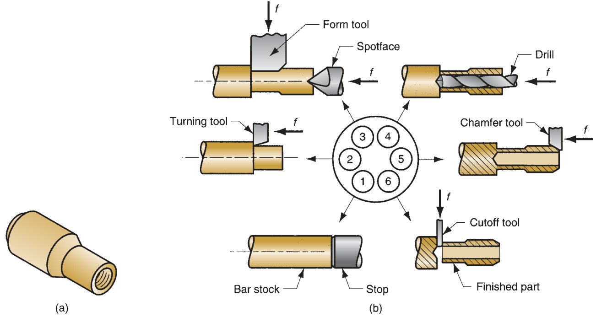  
FIGURE 21.9  (a) Type of part produced on a six-spindle automatic bar machine; and (b) sequence of operations  to produce the part: (1) feed stock to stop, (2) turn main diameter, (3) form second diameter and spotface, (4) drill,  (5) chamfer, and (6) cutoff.  

The modern form of control is  computer numerical control  (CNC), in which the  machine tool operations are controlled by a “program of instructions” consisting  of alphanumeric code (Section 37.3). CNC provides a more sophisticated and ver- satile means of control than mechanical devices. CNC has led to the development  of machine tools capable of more complex machining cycles and part geometries,  and a higher level of automated operation than conventional screw machines and  chucking machines. The CNC lathe is an example of these machines in turning. It  is especially useful for contour turning operations and close tolerance work. Today,  automatic chuckers and bar machines are implemented by CNC.  

# 21.2.5  BORING MACHINES  

Boring is similar to turning. It uses a single-point tool against a rotating work part.  The difference is that boring is performed on the inside diameter of an existing hole  rather than the outside diameter of an existing cylinder. In effect, boring is an inter- nal turning operation. Machine tools used to perform boring operations are called  boring machines  (also  boring mills ). One might expect that boring machines would  have features in common with turning machines; indeed, as previously indicated,  lathes are sometimes used to accomplish boring.  

Boring mills can be horizontal or vertical. The designation refers to the orienta- tion of the axis of rotation of the machine spindle or work part. In a  horizontal  boring  operation, the setup can be arranged in either of two ways. The fi  rst setup is  one in which the work is fi  xtured to a rotating spindle, and the tool is attached to  a cantilevered boring bar that feeds into the work, as illustrated in Figure 21.10(a).  

  
FIGURE 21.10  Two forms of horizontal boring: (a) boring bar is fed into a rotating work part, and (b) work is fed past  a rotating boring bar.  

The boring bar in this setup must be very stiff to avoid defl  ection and vibration  during cutting. To achieve high stiffness, boring bars are often made of cemented  carbide, whose modulus of elasticity approaches  $620\times10^{3}$  MPa  $(90\times10^{6}\;\mathrm{lb/in^{2}})$ .  Figure 21.11 shows a carbide boring bar.  

The second possible setup is one in which the tool is mounted to a boring bar,  and the boring bar is supported and rotated between centers. The work is fastened  to a feeding mechanism that feeds it past the tool. This setup, Figure 21.10(b), can be  used to perform a boring operation on a conventional engine lathe.  

  
FIGURE 21.11  Boring  bar made of cemented  carbide (WC–Co)  that uses indexable  cemented carbide  inserts. (Courtesy of  Kennametal Inc.)  

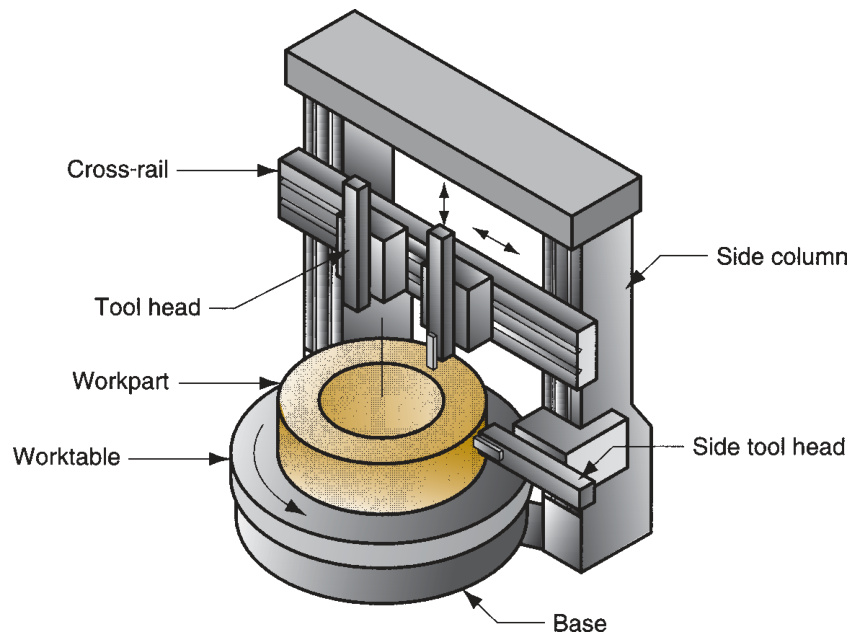  
FIGURE 21.12  A vertical boring  mill.  

A  vertical boring machine  is used for large, heavy work parts with large diameters;  usually the work part diameter is greater than its length. As in Figure 21.12, the part  is clamped to a worktable that rotates relative to the machine base. Worktables up to  40 ft in diameter are available. The typical boring machine can position and feed  several cutting tools simultaneously. The tools are mounted on tool heads that can  be fed horizontally and vertically relative to the worktable. One or two heads are  mounted on a horizontal cross-rail assembled to the machine tool housing above  the worktable. The cutting tools mounted above the work can be used for facing and  boring. In addition to the tools on the cross-rail, one or two additional tool heads  can be mounted on the side columns of the housing to enable turning on the outside  diameter of the work.  

The tool heads used on a vertical boring machine often include turrets to accom- modate several cutting tools. This results in a loss of distinction between this machine  and a  vertical turret lathe . Some machine tool builders make the distinction that the  vertical turret lathe is used for work diameters up to $2.5\,\mathrm{m}$  (100 in), while the vertical  boring mill is used for larger diameters [7]. Also, vertical boring mills are often applied  to one-of-a-kind jobs, while vertical turret lathes are used for batch production.  

#  Drilling and Related Operations  

Drilling, Figure 21.3(b), is a machining operation used to create a round hole in a  work part. This contrasts with boring, which can only be used to enlarge an existing  hole. Most drilling operations are performed using a rotating cylindrical tool that has  two cutting edges on its working end. The tool is called a  drill  or  drill bit , the most  common form of which is the twist drill (Section 22.3.2). The rotating drill feeds into  the stationary work part to form a hole whose diameter is equal to the drill diameter.  Drilling is customarily performed on a  drill press , although other machine tools also  perform this operation.  

# 21.3.1  CUTTING CONDITIONS IN DRILLING  

The cutting speed in a drilling operation is the surface speed at the outside diameter  of the drill. It is specifi  ed in this way for convenience, even though nearly all of the  cutting is actually performed at lower speeds closer to the axis of rotation. To set the  desired cutting speed in drilling, it is necessary to determine the rotational speed of  the drill. Letting $N$  represent the spindle rev/min,  

$$
N={\frac{\nu}{\pi D}}
$$  

where  $\nu=$  cutting speed,  $\mathrm{mm/min}\,(\mathrm{in/min})$ ; and  $D=$  the drill diameter, mm (in). In  some drilling operations, the workpiece is rotated about a stationary tool, but the  same formula applies.  

Feed $f$  in drilling is specifi  ed in mm/rev (in/rev). Recommended feeds are roughly  proportional to drill diameter; higher feeds are used with larger diameter drills. Since  there are (usually) two cutting edges at the drill point, the uncut chip thickness (chip  load) taken by each cutting edge is half the feed. Feed can be converted to feed rate  using the same equation as for turning:  

$$
f_{r}=N f
$$  

where $f_{r}=$  feed rate, $\mathrm{mm/min}\,(\mathrm{in/min})$ .  

Drilled holes are either through holes or blind holes, shown in Figure 21.13 with  a twist drill at the beginning of the operation. In  through holes , the drill exits the  opposite side of the work; in  blind holes , it does not. The machining time required  to drill a through hole can be determined by the following formula:  

$$
T_{m}=\frac{t+A}{f_{r}}
$$  

where  $T_{m}=$  machining (drilling) time, min;  $t=$  work thickness, mm (in); $f_{r}=$  feed  rate, $\mathrm{mm/min}\ (\mathrm{in/min})$ ; and  $A\,=$  an approach allowance that accounts for the drill  point angle, representing the distance the drill must feed into the work before reach- ing full diameter, Figure 21.13(a). This allowance is given by  

$$
A=0.5\,D\,\tan\left(90-{\frac{\theta}{2}}\right)
$$  

where  $A\,=$  approach allowance, mm (in); and  $\theta\,=\,\mathrm{drift}$  point angle,  % . In drilling a  through hole, the feed motion usually proceeds slightly beyond the opposite side of the  work, thus making the actual duration of the cut greater than  $T_{m}$  in Equation (21.9) by  a small amount.  

In a blind-hole, hole depth $d$  is defi  ned as the distance from the work surface to  the depth of the full diameter, Figure 21.13(b). Thus, for a blind hole, machining time  is given by  

$$
T_{m}=\frac{d+A}{f_{r}}
$$  

where $A=$  the approach allowance by Equation (21.10).  

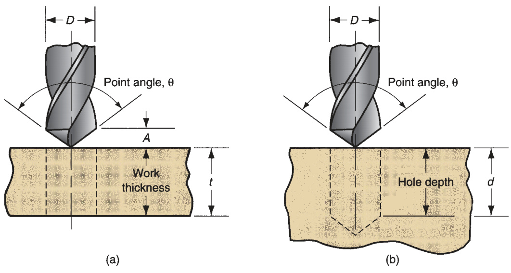  
FIGURE 21.13  Two  hole types: (a) through  hole and (b) blind hole.  

The rate of metal removal in drilling is determined as the product of the drill  cross-sectional area and the feed rate:  

$$
R_{M R}=\frac{\pi D^{2}\,f_{r}}{4}
$$  

This equation is valid only after the drill reaches full diameter and excludes the initial  approach of the drill into the work.  

# Example 21.2  Machining time  in drilling  

A drilling operation is performed to create a through hole on a steel plate that  is $15\:\mathrm{mm}$  thick. Cutting speed $=0.5\;\mathrm{m}/\mathrm{s}.$ , and feed $=0.22~\mathrm{mm/r}$ ev. The ${20}\mathrm{-mm}$ - diameter twist drill has a point angle of  $118^{\circ}$ . Determine (a) the machining  time and (b) metal removal rate once the drill reaches full diameter.  

$N=\nu/\pi D=0.5(10^{3})/\;\pi(20)=7.96\;\mathrm{rev/s}$ $f_{r}=N f=7.96(0.22)=1.75\:\mathrm{mm/s}$ $A=0.5(20)\tan(90-118/2)=6.01\;\mathrm{mm}$ $T_{m}=(t+A)/f_{r}=(15+6.01)/1.75=12.0\ \mathrm{s}=\mathbf{0.20}\ \mathrm{min}$ $R_{M R}=\pi(20)^{2}(1.75)/4=549.8\,\mathrm{{mm^{3}/s}}$  

# 21.3.2  OPERATIONS RELATED TO DRILLING  

Several operations related to drilling are illustrated in Figure 21.14 and described in  this section. Most of the operations follow drilling; a hole must be made fi  rst by drill- ing, and then the hole is modifi  ed by one of the other operations. Centering and spot  facing are exceptions to this rule. All of the operations use rotating tools.  

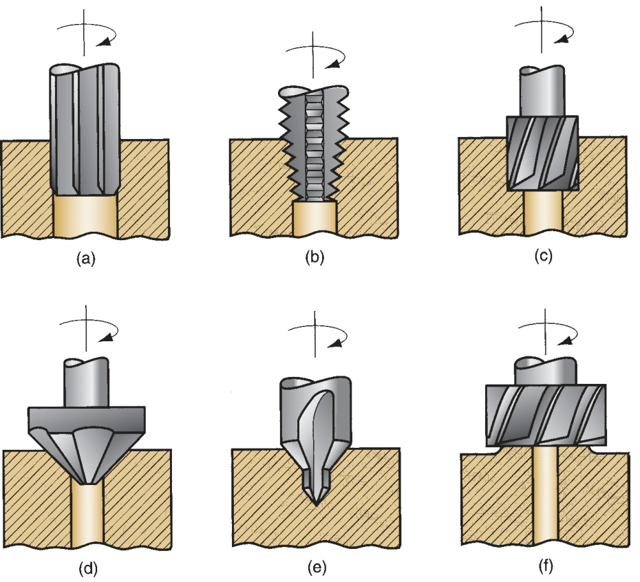  
FIGURE 21.14  Machining operations  related to drilling:  (a) reaming, (b) tapping,  (c) counterboring,  (d) countersinking,  (e) center drilling, and  (f) spot facing.  

(a)  Reaming . Reaming is used to slightly enlarge a hole, to provide a better tolerance  on its diameter, and to improve its surface fi  nish. The tool is called a  reamer , and  it usually has straight fl  utes.

 (b)  Tapping . This operation is performed by a  tap  and is used to provide internal screw  threads on an existing hole. Tapping is discussed in more detail in Section 21.7.1.

 (c)  Counterboring . Counterboring provides a stepped hole, in which a larger diameter  follows a smaller diameter partially into the hole. A counterbored hole is used to  seat a bolt head into a hole so the head does not protrude above the surface.

 (d)  Countersinking . This is similar to counterboring, except that the step in the  hole is cone-shaped for fl  at head screws and bolts.

 (e)  Centering . Also called center drilling, this operation drills a starting hole to  accurately establish its location for subsequent drilling. The tool is called a  center drill .

 (f)  Spot facing . Spot facing is similar to milling. It is used to provide a fl  at machined  surface on the work part in a localized area.  

# 21.3.3  DRILL PRESSES  

The standard machine tool for drilling is the drill press. There are various types of  drill press, the most basic of which is the upright drill, Figure 21.15. The  upright drill   stands on the fl  oor and consists of a table for holding the work part, a drilling head  

  
FIGURE 21.15  Upright drill press.  

with powered spindle for the drill bit, and a base and column for support. A similar  drill press, but smaller, is the  bench drill , which is mounted on a table or bench rather  than the fl  oor.  

The  radial drill , Figure 21.16, is a large drill press designed to cut holes in  large parts. It has a radial arm along which the drilling head can be moved and  clamped. The head therefore can be positioned along the arm at locations that  are a signifi  cant distance from the column to accommodate large work. The radial  arm can also be swiveled about the column to drill parts on either side of the  worktable.  

The  gang drill  is a drill press consisting basically of two to six upright drills con- nected together in an in-line arrangement. Each spindle is powered and operated  independently, and they share a common worktable, so that a series of drilling and  related operations can be accomplished in sequence (e.g., centering, drilling, ream- ing, tapping) simply by sliding the work part along the worktable from one spindle  to the next. A related machine is the  multiple-spindle drill , in which several drill  spindles are connected together to drill multiple holes simultaneously into the  work part.  

In addition,  computer numerical control drill presses  are available to control the  positioning of the holes in the work parts. These drill presses are often equipped with  turrets to hold multiple tools that can be indexed under control of the NC program.  The term  CNC turret drill  is used for these machine tools.  

Workholding on a drill press is accomplished by clamping the part in a vise, fi  xture,  or jig. A  vise  is a general-purpose workholding device possessing two jaws that grasp  the work in position. A  fi  xture  is a workholding device that is usually custom-designed  for the particular work part. The fi  xture can be designed to achieve higher accuracy  in positioning the part relative to the machining operation, faster production rates,  and greater operator convenience in use. A  jig  is a workholding device that is also  specially designed for the work part. The distinguishing feature between a jig and a  fi  xture is that the jig provides a means of guiding the tool during the drilling opera- tion. A fi  xture does not have this tool guidance feature. A jig used for drilling is called  a  drill jig .  

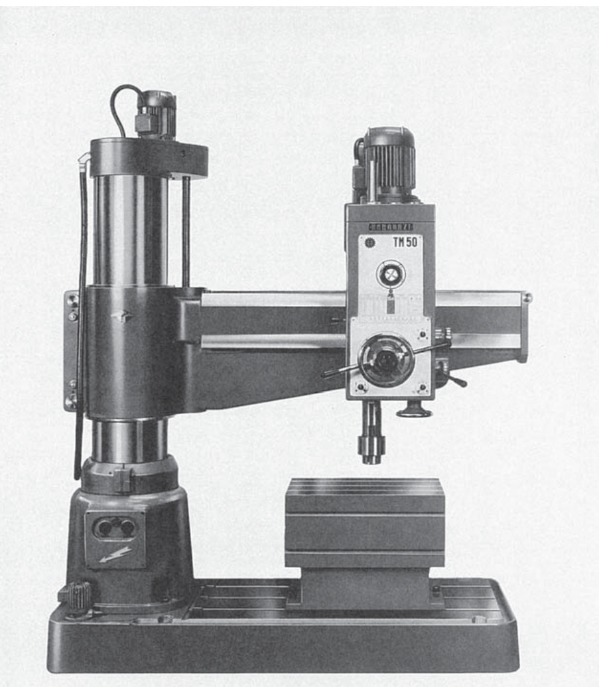  
FIGURE 21.16  Radial  drill press. (Courtesy of  Willis Machinery and  Tools.)  

Milling is a machining operation in which a work part is fed past a rotating cylindrical  tool with multiple cutting edges, as illustrated in Figure 21.2 (d) and (e). (In rare cases, a  tool with one cutting edge, called a  fl  y-cutter , is used). The axis of rotation of the cutting  tool is perpendicular to the direction of feed. This orientation between the tool axis  and the feed direction is one of the features that distinguishes milling from drilling. In  drilling, the cutting tool is fed in a direction parallel to its axis of rotation. The cutting  tool in milling is called a  milling cutter  and the cutting edges are called teeth. Aspects  of milling cutter geometry are discussed in Section 22.3.2. The conventional machine  tool that performs this operation is a  milling machine .  

The geometric form created by milling is a plane surface. Other work geometries  can be created either by means of the cutter path or the cutter shape. Owing to the  variety of shapes possible and its high production rates, milling is one of the most  versatile and widely used machining operations.  

  
FIGURE 21.17  Two basic types of  milling operations:  (a) peripheral or plain  milling and (b) face  milling.  

Milling is an  interrupted cutting  operation; the teeth of the milling cutter enter  and exit the work during each revolution. This interrupted cutting action subjects  the teeth to a cycle of impact force and thermal shock on every rotation. The tool  material and cutter geometry must be designed to withstand these conditions.  

# 21.4.1 TYPES OF MILLING OPERATIONS  

There are two basic types of milling operations, shown in Figure 21.17: (a) peripheral  milling and (b) face milling. Most milling operations create geometry by generating  the shape (Section 21.1).  

Peripheral Milling   In peripheral milling, also called  plain milling , the axis of the tool  is parallel to the surface being machined, and the operation is performed by cutting  edges on the outside periphery of the cutter. Several types of peripheral milling are  shown in Figure 21.18: (a)  slab milling , the basic form of peripheral milling in which  

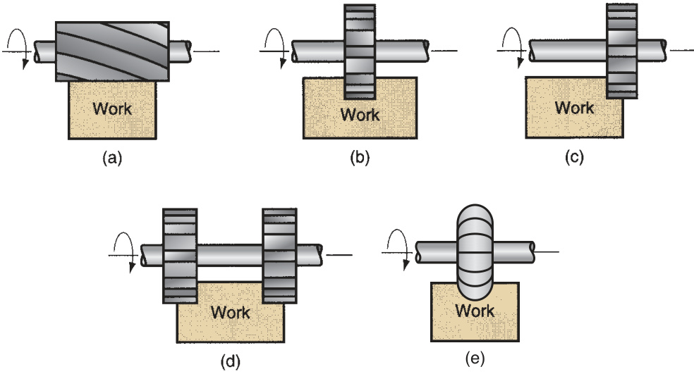  
FIGURE 21.18  Peripheral milling:  (a) slab milling,  (b) slotting,  (c) side milling,  (d) straddle milling, and  (e) form milling.  

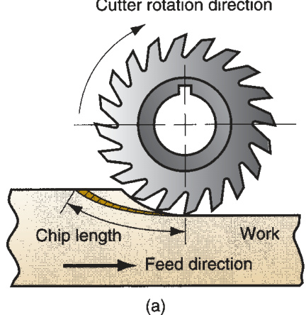  
FIGURE 21.19  Two  forms of peripheral  milling operation with  20-tooth cutter:  (a) up milling, and  (b) down milling.  

  

the cutter width extends beyond the workpiece on both sides; (b)  slotting , also called  slot milling , in which the width of the cutter is less than the workpiece width, creating a  slot in the work—when the cutter is very thin, this operation can be used to mill narrow  slots or cut a work part in two, called  saw milling ; (c)  side milling , in which the cutter  machines the side of the workpiece; (d)  straddle milling , the same as side milling, only  cutting takes place on both sides of the work; and (e)  form milling , in which the milling  teeth have a special profi  le that determines the shape of the slot that is cut in the work.  Form milling is therefore classifi  ed as a forming operation (Section 21.1).  

In peripheral milling, the direction of cutter rotation distinguishes two forms of  milling: up milling and down milling, illustrated in Figure 21.19. In  up milling , also  called  conventional milling , the direction of motion of the cutter teeth is opposite  the feed direction when the teeth cut into the work. It is milling “against the feed.” In  down milling , also called  climb milling , the direction of cutter motion is the same as  the feed direction when the teeth cut the work. It is milling “with the feed.”  

The relative geometries of these two forms of milling result in differences in their  cutting actions. In up milling, the chip formed by each cutter tooth starts out very thin  and increases in thickness during the sweep of the cutter. In down milling, each chip  starts out thick and reduces in thickness throughout the cut. The length of a chip in  down milling is less than in up milling (the difference is exaggerated in the fi  gure).  This means that the cutter is engaged in the work for less time per volume of material  cut, and this tends to increase tool life in down milling.  

The cutting force direction is tangential to the periphery of the cutter for the  teeth that are engaged in the work. In up milling, this has a tendency to lift the work  part as the cutter teeth exit the material. In down milling, this cutter force direction  is downward, tending to hold the work against the milling machine table.  

Face Milling   In face milling, the axis of the cutter is perpendicular to the surface be- ing milled, and machining is performed by cutting edges on both the end and outside  periphery of the cutter. As in peripheral milling, various forms of face milling exist,  several of which are shown in Figure 21.20: (a)  conventional face milling , in which the  diameter of the cutter is greater than the work part width, so the cutter overhangs the  work on both sides; (b)  partial face milling , where the cutter overhangs the work on  only one side; (c)  end milling , in which the cutter diameter is less than the work width,  so a slot is cut into the part; (d)  profi  le milling , a form of end milling in which the out- side periphery of a fl  at part is cut; (e)  pocket milling , another form of end milling used  

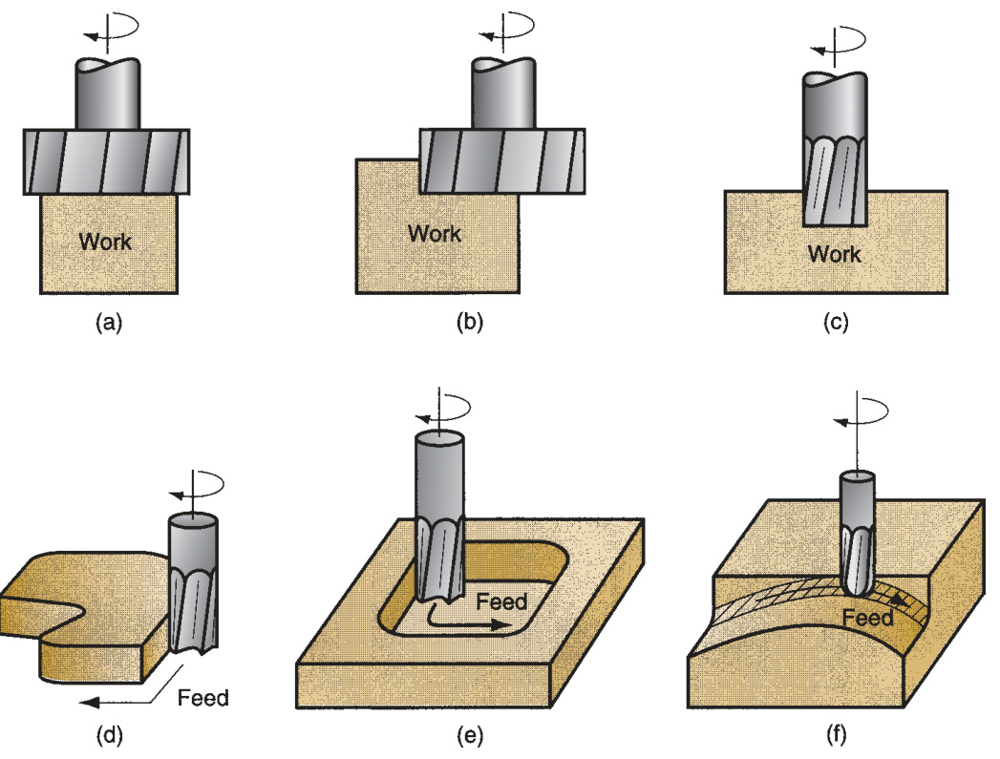  
FIGURE 21.20  Face  milling: (a) conventional  face milling, (b) partial  face milling, (c) end  milling, (d) profi  le  milling, (e) pocket  milling, and (f) surface  contouring.  

to mill shallow pockets into fl  at parts; and (f)  surface contouring , in which a ball-nose  cutter (rather than square-end cutter) is fed back and forth across the work along a  curvilinear path at close intervals to create a three-dimensional surface form. The same  basic cutter control is required to machine the contours of mold and die cavities, in  which case the operation is called  die sinking .  

# 21.4.2  CUTTING CONDITIONS IN MILLING  

The cutting speed is determined at the outside diameter of a milling cutter. This can  be converted to spindle rotation speed using a formula that should now be familiar:  

$$
N=\frac{\nu}{\pi D}
$$  

The feed $f$  in milling is usually given as a feed per cutter tooth; called the  chip load ,  it represents the size of the chip formed by each cutting edge. This can be converted  to feed rate by taking into account the spindle speed and the number of teeth on the  cutter as follows:  

$$
f_{r}=N n_{t}f
$$  

where $f_{r}=$  feed rate, mm/min  $(\mathrm{in}/\mathrm{min})$ ); $N=$  spindle speed, rev/min; $n_{t}=$  number of  teeth on the cutter; and $\overline{{f\!\equiv\!}}$  chip load in mm/tooth (in/tooth).  

Material removal rate in milling is determined using the product of the cross- sectional area of the cut and the feed rate. Accordingly, if a slab-milling operation is  cutting a workpiece with width $w$  at a depth $d$ , the material removal rate is  

$$
R_{M R}=w d\,f_{r}
$$  

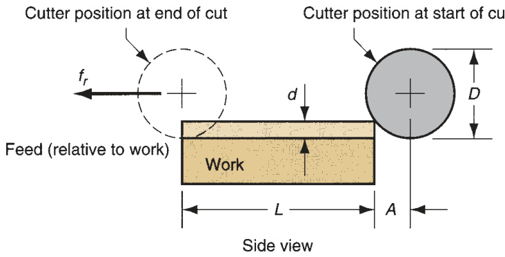  
FIGURE 21.21  Slab (peripheral) milling  showing entry of cutter  into the workpiece.  

This neglects the initial entry of the cutter before full engagement. Equation (21.15)  can be applied to end milling, side milling, face milling, and other milling operations,  making the proper adjustments in the computation of cross-sectional area of cut.  

The time required to mill a workpiece of length  $L$  must account for the approach  distance required to fully engage the cutter. First, consider the case of slab milling,  Figure 21.21. To determine the time to perform a slab milling operation, the approach  distance $A$  to reach full cutter depth is given by  

$$
A=\sqrt{d(D-d)}
$$  

where  $d=$  depth of cut, mm (in); and  $D=$  diameter of the milling cutter, mm (in).  The time $T_{m}$  in which the cutter is engaged milling the workpiece is therefore  

$$
T_{m}=\frac{L+A}{f_{r}}
$$  

For face milling, consider the two possible cases pictured in Figure 21.22. The fi  rst  case is when the cutter is centered over a rectangular workpiece as in Figure 21.22(a).  The cutter feeds from right to left across the workpiece. In order for the cutter to  reach the full width of the work, it must travel an approach distance given by  

$$
A=0.5\big(D-\sqrt{D^{2}-w^{2}}\big)
$$  

where  $D=$ cutter diameter, mm (in) and  $w=$ width of the workpiece,  $\mathrm{mm}$  (in). If  $D=w$ , then Equation (21.18) reduces to  $A=0.5D$ . And if  $D<w$ , then a slot is cut  into the work and $A=0.5D$ .  

The second case is when the cutter is offset to one side of the work, as in Figure  21.22(b). In this case, the approach distance is given by  

$$
A={\sqrt{w(D-w)}}
$$  

where $w=$  width of the cut, $\mathrm{mm}$  (in). In either case, the machining time is given by  

$$
T_{m}=\frac{L+A}{f_{r}}
$$  

It should be emphasized in all of these milling scenarios that  $T_{m}$  represents the  time the cutter teeth are engaged in the work, making chips. Overtravel distances are  usually added at the beginning and end of each cut to allow access to the work for  loading and unloading. Thus the actual duration of the cutter feed motion is likely  to be greater than  $T_{m}$ .  

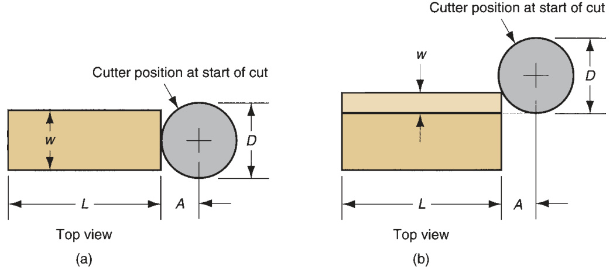  
FIGURE 21.22  Face milling showing  approach and  overtravel distances  for two cases: (a) when  cutter is centered over  the workpiece, and  (b) when cutter is  offset to one side over  the work.  

# Example 21.3  Machining time  in peripheral  milling  

A peripheral milling operation is performed on a rectangular workpiece that is  $320\,\mathrm{mm}$  long by $60\,\mathrm{mm}$  wide by $56\,\mathrm{mm}$  thick. The  $65\mathrm{.mm}$ -diameter milling cutter  has 4 teeth, is $80\,\mathrm{mm}$  long, and overhangs the work on either side by $10\,\mathrm{mm}$ . The  operation reduces the thickness of the piece to $50\,\mathrm{mm}$ . Cutting speed $=0.50\,\mathrm{m/s}$   and chip load $=0.24\,\mathrm{mm}/$ tooth. Determine (a) machining time and (b) metal  removal rate once the cutter reaches full depth.  

$N=\nu/\pi D=0.50(10^{3})/\,\pi(65)=2.45\,\mathrm{rev/s}$ $f_{r}=N n_{t}f=2.45(4)(0.24)=2.35\,\mathrm{mm/s}$ Depth of cut $d=56-50=6\,\mathrm{mm}$ $A=(6(65-6))^{0.5}=18.8\,\mathrm{mm}$ $T_{m}=(320+18.8)/2.35=144.2\,\mathrm{s}=2.40\,\mathrm{min}$ $)\,R_{M R}=w d f_{r}=60(6)(2.35)=846\,\mathbf{mm}^{3}/\mathrm{s}$  

# 21.4.3  MILLING MACHINES  

Milling machines must provide a rotating spindle for the cutter and a table for fasten- ing, positioning, and feeding the work part. Various machine tool designs satisfy these  requirements. To begin with, milling machines can be classifi  ed as horizontal or vertical.  A  horizontal milling machine  has a horizontal spindle, and this design is well suited  for performing peripheral milling (e.g., slab milling, slotting, side and straddle milling)  on work parts that are roughly cube shaped. A  vertical milling machine  has a vertical  spindle, and this orientation is appropriate for face milling, end milling, surface contour- ing, and die-sinking on relatively fl  at work parts.  

Other than spindle orientation, milling machines can be classifi  ed into the following  types: (1) knee-and-column, (2) bed type, (3) planer type, (4) tracer mills, and (5) CNC  milling machines.  

The  knee-and-column milling machine  is the basic machine tool for milling. It  derives its name from the fact that its two main components are a  column  that supports  the spindle, and a  knee  (roughly resembling a human knee) that supports the worktable.  

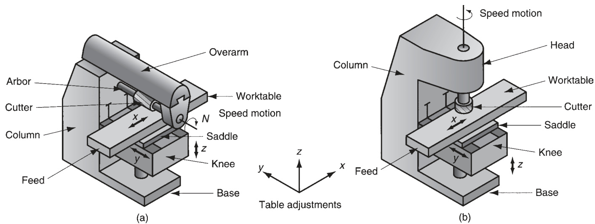  
FIGURE 21.23  Two basic types of knee-and-column milling machine: (a) horizontal and (b) vertical.  

It is available as either a horizontal or a vertical machine, as illustrated in Figure 21.23.  In the horizontal version, an arbor usually supports the cutter. The  arbor  is basically a  shaft that holds the milling cutter and is driven by the spindle. An overarm is provided  on horizontal machines to support the arbor. On vertical knee-and-column machines,  milling cutters can be mounted directly in the spindle without an arbor.  

One of the features of the knee-and-column milling machine that makes it so  versatile is its capability for worktable feed movement in any of the $x{-}y{-}z$  axes.  The worktable can be moved in the $x$ -direction, the saddle can be moved in the  $y$ -direction, and the knee can be moved vertically to achieve the  $z$ -movement.  

Two special knee-and-column machines should be identifi  ed. One is the  universal   milling machine, Figure 21.24(a), which has a table that can be swiveled in a horizon- tal plane (about a vertical axis) to any specifi  ed angle. This facilitates the cutting of  angular shapes and helixes on work parts. Another special machine is the  ram mill ,  

  
FIGURE 21.24  Special types of knee-and-column milling machine: (a) universal—overarm, arbor, and cutter omitted  for clarity: and (b) ram type.  

Figure 21.24(b), in which the toolhead containing the spindle is located on the end of  a horizontal ram; the ram can be adjusted in and out over the worktable to locate the  cutter relative to the work. The toolhead can also be swiveled to achieve an angular  orientation of the cutter with respect to the work. These features provide consider- able versatility in machining a variety of work shapes.  

Bed-type milling machines  are designed for high production. They are constructed  with greater rigidity than knee-and-column machines, thus permitting them to achieve  heavier feed rates and depths of cut needed for high material removal rates. The  characteristic construction of the bed-type milling machine is shown in Figure 21.25.  The worktable is mounted directly to the bed of the machine tool, rather than using  the less rigid knee-type design. This construction limits the possible motion of the table  to longitudinal feeding of the work past the milling cutter. The cutter is mounted in a  spindle head that can be adjusted vertically along the machine column. Single spindle  bed machines are called  simplex  mills, as in Figure 21.25, and are available in either  horizontal or vertical models.  Duplex  mills use two spindle heads. The heads are usually  positioned horizontally on opposite sides of the bed to perform simultaneous opera- tions during one feeding pass of the work.  Triplex  mills add a third spindle mounted  vertically over the bed to further increase machining capability.  

Planer type mills  are the largest milling machines. Their general appearance and  construction are those of a large planer (see Figure 21.31); the difference is that  milling is performed instead of planing. Accordingly, one or more milling heads are  substituted for the single-point cutting tools used on planers, and the motion of the  work past the tool is a feed rate motion rather than a cutting speed motion. Planer  mills are built to machine very large parts. The worktable and bed of the machine  are heavy and relatively low to the ground, and the milling heads are supported by a  bridge structure that spans across the table.  

A  tracer mill , also called a  profi  ling mill , is designed to reproduce an irregular part  geometry that has been created on a template. Using either manual feed by a human  operator or automatic feed by the machine tool, a tracing probe is controlled to follow  the template while a milling head duplicates the path taken by the probe to machine  the desired shape. Tracer mills are of two types: (1)  x – y   tracing , in which the contour  of a fl  at template is profi  le milled using two-axis control; and (2)  x – y – z tracing , in  which the probe follows a three dimensional pattern using three-axis control. Tracer  mills have been used for creating shapes that cannot easily be generated by a simple  feeding action of the work against the milling cutter. Applications include molds and  dies. In recent years, many of these applications have been taken over by computer  numerical control (CNC) milling machines.  

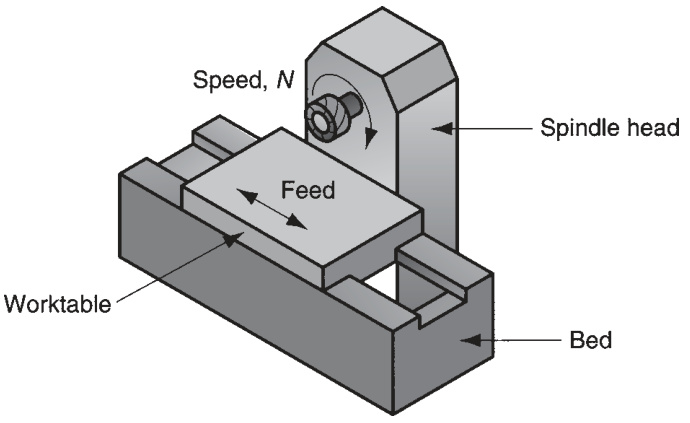  
FIGURE 21.25  Simplex bed- type milling machine horizontal  spindle.  

CNC milling machines  are milling machines in which the cutter path is controlled  by alphanumerical data rather than a physical template. They are especially suited to  profi  le milling, pocket milling, surface contouring, and die sinking operations, in which  two or three axes of the worktable must be simultaneously controlled to achieve the  required cutter path. An operator is normally required to change cutters as well as  load and unload work parts.  

#  Machining Centers and Turning Centers  

A  machining center , illustrated in Figure 21.26, is a highly automated machine tool  capable of performing multiple machining operations under computer numerical  control in one setup with minimal human attention. Workers are needed to load and  unload parts, which usually takes considerable less time than the machine cycle time,  so one worker may be able to tend more than one machine. Typical operations per- formed on a machining center are milling and drilling, which use rotating cutting tools. The typical features that distinguish a machining center from conventional machine  tools and make it so productive include:  

➢   Multiple operations in one setup . Most work parts require more than one operation  to completely machine the specifi  ed geometry. Complex parts may require dozens  of separate machining operations, each requiring its own machine tool, setup, and  cutting tool. Machining centers are capable of performing most or all of the opera- tions at one location, thus minimizing setup time and production lead time.  

➢   Automatic tool changing . To change from one machining operation to the next, the  cutting tools must be changed. This is done on a machining center under CNC pro- gram control by an automatic tool-changer designed to exchange cutters between  the machine tool spindle and a  tool storage carousels . Capacities of these carousels  

  
FIGURE 21.26  A  universal machining  center. Capability to  orient the workhead  makes this a fi  ve-axis  machine. (Courtesy of  Cincinnati Milacron.)  

commonly range from 16 to 80 cutting tools. The machine in Figure 21.26 has two  storage carousels on the left side of the column.  

➢   Pallet shuttles . Some machining centers are equipped with pallet shuttles, which  are automatically transferred between the spindle position and the loading sta- tion, as shown in Figure 21.26. Parts are fi  xtured on pallets that are attached to  the shuttles. In this arrangement, the operator can be unloading the previous  part and loading the next part while the machine tool is engaged in machining  the current part. Nonproductive time on the machine is thereby reduced.   Automatic work part positioning . Many machining centers have more than  three axes. One of the additional axes is often designed as a rotary table to posi- tion the part at some specifi  ed angle relative to the spindle. The rotary table per- mits the cutter to perform machining on four sides of the part in a single setup.  

Machining centers are classifi  ed as horizontal, vertical, or universal. The designation  refers to spindle orientation. Horizontal machining centers (HMCs) normally machine  cube-shaped parts, in which the four vertical sides of the cube can be accessed by the  cutter. Vertical machining centers (VMCs) are suited to fl  at parts on which the tool  can machine the top surface. Universal machining centers have workheads that swivel  their spindle axes to any angle between horizontal and vertical, as in Figure 21.26.  

Success of CNC machining centers led to the development of CNC turning centers. A  modern  CNC turning center , Figure 21.27, is capable of performing various turning and  related operations, contour turning, and automatic tool indexing, all under computer con- trol. In addition, the most sophisticated turning centers can accomplish (1) work part gag- ing (checking key dimensions after machining), (2) tool monitoring (sensors to indicate  

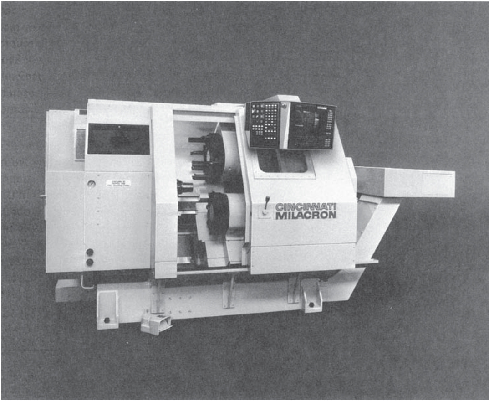  
FIGURE 21.27  CNC  four-axis turning center.  (Courtesy of Cincinnati  Milacron).  

  
FIGURE 21.28  Operation of a mill-turn center: (a) example part with turned, milled, and drilled surfaces; and  (b) sequence of operations on a mill-turn center: (1) turn second diameter, (2) mill fl  at with part in programmed  angular position, (3) drill hole with part in same programmed position, and (4) cutoff.  

when the tools are worn), (3) automatic tool changing when tools become worn, and  even (4) automatic work part changing at the completion of the work cycle [14].  

Another type of machine tool related to machining centers and turning centers is  the  CNC mill-turn center . This machine has the general confi  guration of a turning  center; in addition, it can position a cylindrical work part at a specifi  ed angle so that  a rotating cutting tool (e.g., milling cutter) can machine features into the outside  surface of the part, as illustrated in Figure 21.28. An ordinary turning center does not  have the capability to stop the work part at a defi  ned angular position, and it does  not possess rotating tool spindles.  

Further progress in machine tool technology has taken the mill-turn center one  step further by integrating additional capabilities into a single machine. The addi- tional capabilities include (1) combining milling, drilling, and turning with grind- ing, welding, and inspection operations, all in one machine tool; (2) using multiple  spindles simultaneously, either on a single workpiece or two different workpieces;  and (3) automating the part handling function by adding industrial robots to the  machine [2], [20]. The terms  multitasking machine  and  multifunction machine  are  sometimes used for these machine tools.  

#  Other Machining Operations  

In addition to turning, drilling, and milling, several other machining operations should  be included in this survey: (1) shaping and planing, (2) broaching, and (3) sawing.  

# 21.6.1  SHAPING AND PLANING  

Shaping and planing are similar operations, both involving the use of a single-point  cutting tool moved linearly relative to the work part. In conventional shaping and  

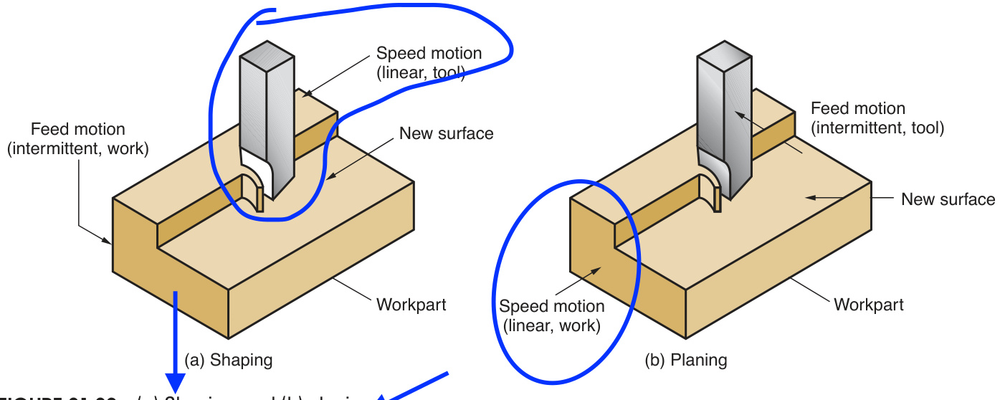  
FIGURE 21.29  (a) Shaping, and (b) planing.  

planing, a straight, fl  at surface is created by this action. The difference between the  two operations is illustrated in Figure 21.29. In shaping, the speed motion is accom- plished by moving the cutting tool; while in planing, the speed motion is accom- plished by moving the work part.  

Cutting tools used in shaping and planing are single-point tools. Unlike turning,  interrupted cutting occurs in shaping and planing, subjecting the tool to an impact  loading upon entry into the work. In addition, these machine tools are limited to low  speeds due to their start-and-stop motion. The conditions normally dictate use of  high-speed steel cutting tools.  

Shaping   Shaping is performed on a machine tool called a  shaper , Figure 21.30.  The components of the shaper include a  ram , which moves relative to a  column  to  provide the cutting motion, and a worktable that holds the part and accomplishes  the feed motion. The motion of the ram consists of a forward stroke to achieve the  cut, and a return stroke during which the tool is lifted slightly to clear the work and  then reset for the next pass. On completion of each return stroke, the worktable is  advanced laterally relative to the ram trajectory to feed the part. Feed is specifi  ed  in mm/stroke (in/stroke). The drive mechanism for the ram can be either hydraulic  

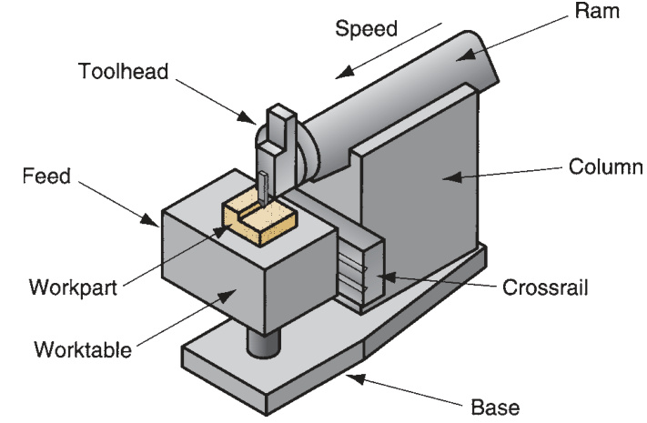  
FIGURE 21.30  Components  of a shaper.  

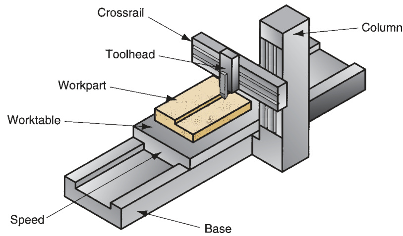  
FIGURE 21.31  Open side planer.  

or mechanical. Hydraulic drive has greater fl  exibility in adjusting the stroke length  and a more uniform speed during the forward stroke, but it is more expensive than a  mechanical drive unit. Both mechanical and hydraulic drives are designed to achieve  higher speeds on the return (noncutting) stroke than on the forward (cutting) stroke,  thereby increasing the proportion of time spent cutting.  

Planing   The machine tool for planing is a  planer . Cutting speed is achieved by a  reciprocating worktable that moves the part past the single point cutting tool. The con- struction and motion capability of a planer permit much larger parts to be machined  than on a shaper. Planers can be classifi  ed as open side planers or double-column  planers. The  open-side planer , also known as a  single-column planer , Figure 21.31, has  a single column supporting the cross-rail on which a toolhead is mounted. Another  toolhead can also be mounted and fed along the vertical column. Multiple toolheads  permit more than one cut to be taken on each pass. At the completion of each stroke,  each toolhead is moved relative to the cross-rail (or column) to achieve the intermit- tent feed motion. The confi  guration of the open-side planer permits very wide work  parts to be machined.  

A  double-column planer  has two columns, one on either side of the base and  worktable. The columns support the cross-rail, on which one or more toolheads are  mounted. The two columns provide a more rigid structure for the operation; however,  the two columns limit the width of the work that can be handled on this machine.  

Shaping and planing can be used to machine shapes other than fl  at surfaces. The  restriction is that the cut surface must be straight. This allows the cutting of grooves,  slots, gear teeth, and other shapes as illustrated in Figure 21.32. Special machines and  tool geometries must be specifi  ed to cut some of these shapes. An important example  is the  gear shaper , a vertical shaper with a specially designed rotary feed table and  synchronized tool head used to generate teeth on spur gears. Gear shaping and other  methods of producing gears are discussed inSection 21.7.2.  

  
FIGURE 21.32  Types of  shapes that can cut by  shaping and planing:  (a) V-groove, (b) square  groove, (c) T-slot,  (d) dovetail slot, and  (e) gear teeth.  

  
FIGURE 21.33  The  broaching operation.  

# 21.6.2 BROACHING  

Broaching is performed using a multiple teeth cutting tool by moving the tool linearly  relative to the work in the direction of the tool axis, as in Figure 21.33. The machine  tool is called a  broaching machine , and the cutting tool is called a  broach . Aspects of  broach geometry are discussed in Section 22.3.2. In certain jobs for which broaching  can be used, it is a highly productive method of machining. Advantages include good  surface fi  nish, close tolerances, and a variety of work shapes. Owing to the complicated  and often custom-shaped geometry of the broach, tooling is expensive.  

There are two principal types of broaching: external (also called surface broach- ing) and internal.  External broaching  is performed on the outside surface of the  work to create a certain cross-sectional shape on the surface. Figure 21.34(a) shows  some possible cross sections that can be formed by external broaching.  Internal  broaching  is accomplished on the internal surface of a hole in the part. Accordingly,  a starting hole must be present in the part so as to insert the broach at the beginning  of the broaching stroke. Figure 21.34(b) indicates some of the shapes that can be  produced by internal broaching.  

  
FIGURE 21.34  Work shapes that can be cut by: (a) external broaching, and (b) internal broaching. Cross-hatching  indicates the surfaces broached.  

The basic function of a broaching machine is to provide a precise linear motion  of the tool past a stationary work position, but there are various ways in which this  can be done. Most broaching machines can be classifi  ed as either vertical or hori- zontal machines. The  vertical broaching machine  is designed to move the broach  along a vertical path, while the  horizontal broaching machine  has a horizontal  tool path. Most broaching machines pull the broach past the work. However, there  are exceptions to this pull action. One exception is a relatively simple type called  a  broaching press , used only for internal broaching, that pushes the tool through  the work part. Another exception is the  continuous broaching machine , in which  the work parts are fi  xtured to an endless belt loop and moved past a stationary  broach. Because of its continuous operation, this machine can be used only for  surface broaching.  

Sawing is a process in which a narrow slit is cut into the work by a tool consisting of  a series of narrowly spaced teeth. Sawing is normally used to separate a work part  into two pieces, or to cut off an unwanted portion of a part. These operations are  often referred to as  cutoff  operations. Since many factories require cutoff operations  at some point in the production sequence, sawing is an important manufacturing  process.  

In most sawing operations, the work is held stationary and the  saw blade  is moved  relative to it. Saw blade tooth geometry is discussed in Section 22.3.2. There are  three basic types of sawing, as in Figure 21.35, according to the type of blade motion  involved: (a) hacksawing, (b) bandsawing, and (c) circular sawing.  

Hacksawing , Figure 21.35(a), involves a linear reciprocating motion of the saw  against the work. This method of sawing is often used in cutoff operations. Cutting is  accomplished only on the forward stroke of the saw blade. Because of this intermittent  cutting action, hacksawing is inherently less effi  cient than the other sawing methods,  both of which are continuous. The  hacksaw  blade is a thin straight tool with cutting  teeth on one edge. Hacksawing can be done either manually or with a power hacksaw.  A  power hacksaw  provides a drive mechanism to operate the saw blade at a desired  speed; it also applies a given feed rate or sawing pressure.  

Bandsawing  involves a linear continuous motion, using a  bandsaw blade  made  in the form of an endless fl  exible loop with teeth on one edge. The sawing machine  is a  bandsaw , which provides a pulley-like drive mechanism to continuously move  and guide the bandsaw blade past the work. Bandsaws are classifi  ed as vertical or  horizontal. The designation refers to the direction of saw blade motion during cutting.  Vertical bandsaws are used for cutoff as well as other operations such as contouring  and slotting.  Contouring  on a bandsaw involves cutting a part profi  le from fl  at stock.  Slotting  is the cutting of a thin slot into a part, an operation for which bandsawing is  well suited. Contour sawing and slotting are operations in which the work is fed into  the saw blade.  

Vertical bandsaw machines can be operated either manually, in which the operator  guides and feeds the work past the bandsaw blade, or automatically, in which the work  is power fed past the blade. Recent innovations in bandsaw design have permitted  the use of CNC to perform contouring of complex outlines. Some of the details of the  vertical bandsawing operation are illustrated in Figure 21.35(b). Horizontal bandsaws  are normally used for cutoff operations as alternatives to power hacksaws.  

  
FIGURE 21.35  Three types of sawing operations: (a) power hacksaw, (b) bandsaw (vertical), and (c) circular saw.  

Circular sawing , Figure 21.35(c), uses a rotating saw blade to provide a continuous  motion of the tool past the work. Circular sawing is often used to cut long bars, tubes,  and similar shapes to specifi  ed length. The cutting action is similar to a slot milling  operation, except that the saw blade is thinner and contains many more cutting teeth  than a slot milling cutter. Circular sawing machines have powered spindles to rotate  the saw blade and a feeding mechanism to drive the rotating blade into the work.  

Two operations related to circular sawing are abrasive cutoff and friction sawing.  In  abrasive cutoff , an abrasive disk is used to perform cutoff operations on hard  materials that would be diffi  cult to saw with a conventional saw blade. In  friction  sawing , a steel disk is rotated against the work at very high speeds, resulting in fric- tion heat that causes the material to soften suffi  ciently to permit penetration of the  disk through the work. The cutting speeds in both of these operations are much faster  than in circular sawing.  

#  Machining Operations for Special Geometries  

One of the reasons for the technological importance of machining is its capability to  produce unique geometric features such as screw threads and gear teeth. This section  discusses the cutting processes that are used to accomplish these shapes, most of which  are adaptations of machining operations discussed earlier in the chapter.  

# 21.7.1  SCREW THREADS  

Threaded hardware components are widely used as fasteners in assembly (screws,  bolts, and nuts, Section 31.1) and for transmission of motion in machinery (e.g., lead  screws in positioning systems, Section 37.3.2). Threads can be defi  ned as grooves  that form a spiral around the outside of a cylinder (external threads) or the inside  of a round hole (internal threads). Thread rolling (Section 18.2) is by far the most  common method for producing external threads, but the process is not economical  for low production quantities and the work metal must be ductile. Metallic threaded  components can also be made by casting, especially investment casting and die  casting (Sections 11.2.4 and 11.3.3), and plastic parts with threads can be injection  molded (Section 13.6). Finally, threaded components can be machined, and this  is the topic addressed here. The discussion is organized into external and internal  thread machining.  

External Threads  The simplest and most versatile method of cutting an external  thread on a cylindrical work part is  single-point threading , which employs a single- point cutting tool on a lathe. This process is illustrated in Figure $21.6(\mathrm{g})$ . The starting  diameter of the workpiece is equal to the major diameter of the screw thread. The  tool must have the profi  le of the thread groove, and the lathe must be capable of  maintaining the same relationship between the tool and the workpiece on successive  passes in order to cut a consistent spiral. This relationship is achieved by means of the  lathe’s lead screw (see Figure 21.7). More than one turning pass is usually required.  The fi  rst pass takes a light cut; the tool is then retracted and rapidly traversed back  to the starting point; and each ensuing pass traces the same spiral using ever greater  depths of cut until the desired form of the thread groove has been established. Single- point threading is suitable for low or even medium production quantities, but less  time-consuming methods are more economical for high production.  

An alternative to using a single-point tool is a  threading die , shown in Figure 21.36.  To cut an external thread, the die is rotated around the starting cylindrical stock of the  proper diameter, beginning at one end and proceeding to the other end. The cutting  teeth at the opening of the die are tapered so that the starting depth of cut is less at the  beginning of the operation, fi  nally reaching full thread depth at the trailing side of the  die. The pitch of the threading die teeth determines the pitch of the screw that is being  cut. The die in Figure 21.36 has a slit that allows the size of the opening to be adjusted  to compensate for tool wear on the teeth or to provide for minor differences in screw  size. Threading dies cut the threads in a single pass rather than multiple passes as in  single-point threading.  

Threading dies are typically used in manual operations, in which the die is fi  xed in  a holder that can be rotated by hand. If the workpiece has a head or other obstacle  at the other end, the die must be unwound from the screw just created in order to  remove it. This is not only time consuming, but it also risks possible damage to the  

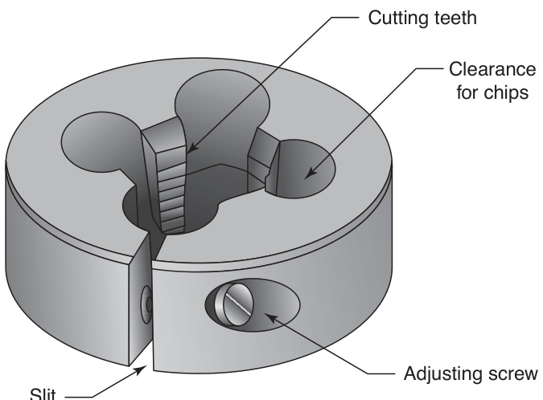  
FIGURE 21.36  Threading die.  

thread surfaces. In mechanized threading operations, cycle times can be reduced by  using  self-opening threading dies , which are designed with an automatic device that  opens the cutting teeth at the end of each cut. This eliminates the need to unwind the  die from the work and avoids possible damage to the threads. Self-opening dies are  equipped with four sets of cutting teeth, similar to the threading die in Figure 21.36,  except that the teeth can be adjusted and removed for resharpening, and the tool- holder mechanism possesses the self-opening feature. Different sets of cutting teeth  are required for different thread sizes.  

The term  thread chasing  is often applied to production operations that utilize  self-opening dies. Two types of thread chasing equipment are available: (1) stationary  self-opening dies, in which the workpiece rotates and the die does not, like a turning  operation; and (2) revolving self-opening dies, in which the die rotates and the work- piece does not, like a drilling operation.  

Two additional external threading operations should be mentioned: thread mill- ing and thread grinding.  Thread milling  involves the use of a milling cutter to shape  the threads of a screw. One possible setup is illustrated in Figure 21.37. In this opera- tion a form-milling cutter, whose profi  le is that of the thread groove, is oriented at an  angle equal to the helix angle of the thread and fed longitudinally as the workpiece  is slowly rotated. In a variation of this operation, a multiple-form cutter is used, so  that multiple screw threads can be cut simultaneously to increase production rates.  Possible reasons for preferring thread milling over thread chasing include (1) the  size of the thread is too large to be readily cut with a die and (2) thread milling is  generally noted to produce more accurate and smoother threads.  

Thread grinding  is similar to thread milling except the cutter is a grinding wheel  with the shape of the thread groove, and the rotational speed of the grinding wheel  is much greater than in milling. The process can be used to completely form the  

  
FIGURE 21.37  Thread milling using a  form-milling cutter.  

threads or to fi  nish threads that have been formed by one of the previously dis- cussed processes. Thread grinding is especially applicable for threads that have been  hardened by heat treatment.  

Internal Threads  The most common process for cutting internal threads is  tapping ,  in which a cylindrical tool with cutting teeth arranged in a spiral whose pitch is equal  to that of the screw threads, is simultaneously rotated and fed into a pre-existing hole.  The operation is illustrated in Figure 21.14(b), and the cutting tool is called a  tap . The  end of the tool is slightly conical to facilitate entry into the hole. The initial hole size  is approximately equal to the minor diameter of the screw thread. In the simplest  version of the process, the tap is a solid piece and the tapping operation is performed  on a drill press equipped with a tapping head, which allows penetration into the hole  at a rate that corresponds to the screw pitch. At the end of the operation, the spindle  rotation is reversed so the tap can be unscrewed from the hole.  

In addition to solid taps, collapsible taps are available, just as self-opening dies are  available for external threading.  Collapsible taps  have cutting teeth that automati- cally retract into the tool when the thread has been cut, allowing it to be quickly  removed from the tapped hole without reversing spindle direction. Thus, shorter  cycle times are possible.  

Although production tapping can be accomplished on drill presses and other  conventional machine tools (e.g., lathes, turret lathes), several types of specialized  machines have been developed for higher production rates. Single-spindle tapping  machines perform tapping one workpiece at a time, with manual or automatic load- ing and unloading of the starting blanks. Multiple-spindle tapping machines operate  on multiple work parts simultaneously and provide for different hole sizes and screw  pitches to be accomplished together. Finally gang drills (Section 21.3.3) can be set up  to perform drilling, reaming, and tapping in rapid sequence on the same part.  

Gears are machinery components used to transmit motion and power between  rotat  ing shafts. As illustrated in Figure 21.38, the transmission of rotational motion  is achieved between meshing gears by teeth located around their respective circum- ferences. The teeth have a special curved shape called an involute, which minimizes  friction and wear between contacting teeth of meshing gears. Depending on the  relative numbers of teeth of the two gears, the speed of rotation can be increased  or decreased from one gear to the next, with a corresponding decrease or increase  in torque. These speed effects are examined in Section 37.3.2 on numerical control  positioning systems.  

There are various gear types, the most basic and least complicated to produce is  the  spur gear  represented in Figure 21.38. It has teeth that are parallel to the axis of  the gear’s rotation. A gear with teeth that form an angle relative to the axis of rota- tion is called a  helical gear . The helical tooth design allows more than one tooth to be  in contact for smoother operation. Spur and helical gears provide rotation between  shafts whose axes are parallel. Other types, such as  bevel gears , provide motion  between shafts that are at an angle with each other, usually $90^{\circ}$ . A  rack  is a straight  gear (a gear of infi  nite radius), which allows rotational motion to be converted  into linear motion (e.g., rack-and-pinion steering on automobiles). The variety of  gear types is far too great for us to discuss them all, and the interested reader is  

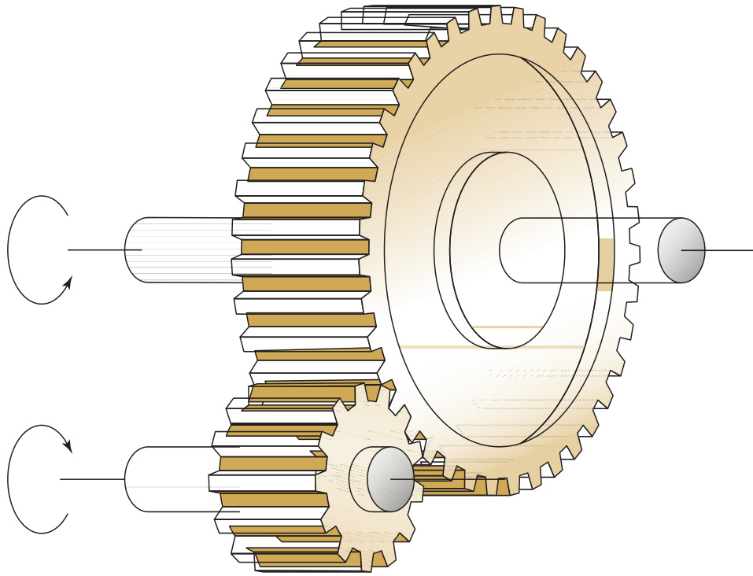  
FIGURE 21.38  Two  meshing spur gears.  

referred to texts on machine design for coverage of gear design and mechanics. This  section is concerned with the manufacture of gears.  

Several of the shape processing operations discussed in previous chapters can be  used to produce gears. These include investment casting, die casting, plastic injection  molding, powder metallurgy, forging, and other bulk deformation operations (e.g., gear  rolling, Section 18.2). The advantage of these operations over machining is material  savings because no chips are produced. Sheet metal stamping operations (Section 19.1)  are used to produce thin gears in watches and clocks. The gears produced by all of the  preceding operations can often be used without further processing. In other cases, a  basic shape processing operation such as casting or forging is used to produce a starting  metal blank, and these parts are then machined to form the gear teeth. Finishing opera- tions are often required to achieve the specifi  ed accuracies of the teeth dimensions.  

The principal machining operations used to cut gear teeth are form milling, gear  hobbing, gear shaping, and gear broaching. Form milling and gear broaching are  considered to be forming operations in the sense of Section 21.1, while gear hobbing  and gear shaping are classifi  ed as generating operations. Finishing processes for gear  teeth include gear shaving, gear grinding, and burnishing. Many of the processes  used to make gears are also used to produce splines, sprockets, and other special  machinery components.  

Form Milling  In this process, illustrated in Figure 21.39, the teeth on a gear blank are  machined individually by a form-milling cutter whose cutting edges have the shape  of the spaces between the teeth on the gear. The machining operation is classifi  ed  as forming (Section 21.1) because the shape of the cutter determines the geometry  of the gear teeth. The disadvantage of form milling is that production rates are slow  because each tooth space is created one at a time and the gear blank must be indexed  between each pass to establish the correct size of the gear tooth, which also takes time.  The advantage of form milling over gear hobbing (discussed next) is that the milling  

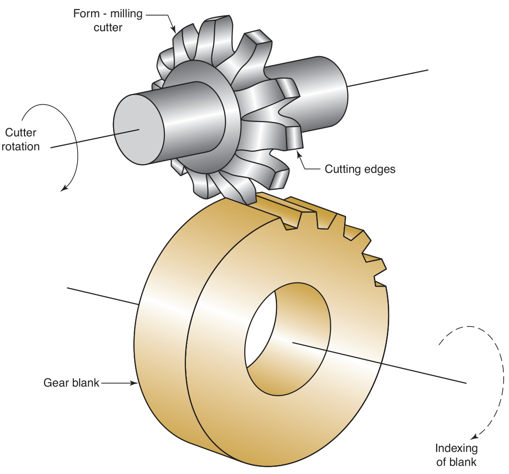  
FIGURE 21.39  Form  milling of gear teeth on  a starting blank.  

cutter is much less expensive. The slow production rates and relatively low cost tool- ing make form milling appropriate for low production quantities.  

Gear Hobbing  Gear hobbing is also a milling operation, but the cutter, called a  hob , is much more complex and therefore much more expensive than a form milling  cutter. In addition, special milling machines (called  hobbing machines ) are required  to accomplish the relative speed and feed motions between the cutter and the gear  blank. Gear hobbing is illustrated in Figure 21.40. As shown in the fi  gure, the hob has a  slight helix and its rotation must be coordinated with the much slower rotation of the  gear blank in order for the hob’s cutting teeth to mesh with the blank’s teeth as they  are being cut. This is accomplished for a spur gear by offsetting the axis of rotation of  the hob by an amount equal to  $90^{\circ}$  less the helix angle relative to the axis of the gear  blank. In addition to these rotary motions of the hob and the workpiece, a straight-line  motion is also required to feed the hob relative to the gear blank throughout its thick- ness. Several teeth are cut simultaneously in hobbing, which allows for higher produc- tion rates than form milling. Accordingly, it is a widely used gear making process for  medium and high production quantities.  

Gear Shaping  In gear shaping, a reciprocating cutting tool motion is used rather  than a rotational motion as in form milling and gear hobbing. Two quite different  forms of shaping operation (Section 21.6.1) are used to produce gears. In the fi  rst type,  a single-point tool takes multiple passes to gradually shape each tooth profi  le using  

  
FIGURE 21.40  Gear hobbing.  

computerized controls or a template. The gear blank is slowly rotated or indexed, with  the same profi  le being imparted to each tooth. The procedure is slow and applied only  in the fabrication of very large gears.  

In the second type of gear shaping operation, the cutter has the general shape of  a gear, with cutting teeth on one side. The axes of the cutter and the gear blank are  parallel, as illustrated in Figure 21.41, and the action is similar to a pair of conjugate  gears except that the reciprocation of the cutter is gradually creating the form of  the matching teeth in its mating component. At the beginning of the operation for a  given gear blank, the cutter is fed into the blank after each stroke until the required  depth has been reached. Then, after each successive pass of the tool, both the cutter  and the blank are rotated a small amount (indexed) so as to maintain the same tooth  spacing on each. Gear shaping by this second method is widely used in industry, and  specialized machines (called  gear shapers ) are available to accomplish the process.  

Gear Broaching  Broaching (Section 21.6.2) as a gear making process is noted for  short production cycle times and high tooling cost. It is therefore economical only for  high volumes. Good dimensional accuracy and fi  ne surface fi  nish are also features of  gear broaching. The process can be applied for both external gears (the conventional  gear) and internal gears (teeth on the inside of the gear). For making internal gears,  the operation is similar to that shown in Figure 21.3(c), except the cross section of the  tool consists of a series of gear-shaped cutting teeth of increasing size to form the gear  

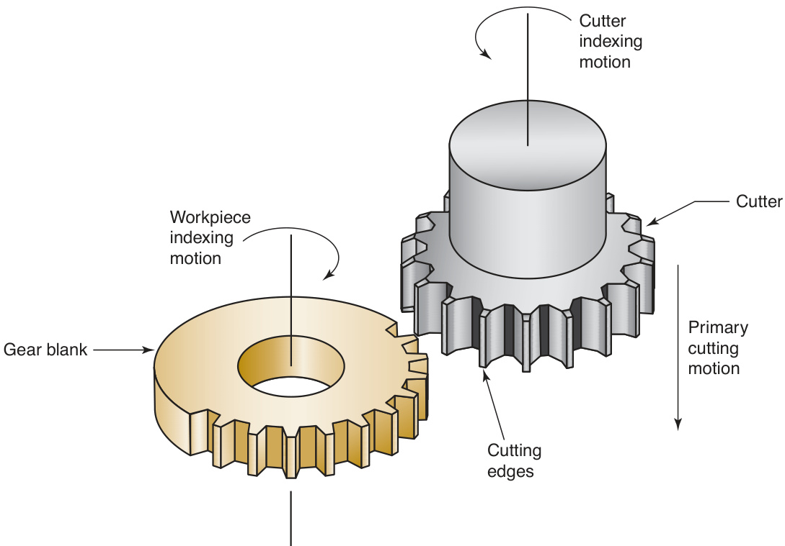  
FIGURE 21.41  Gear  shaping.  

teeth in successive steps as the broach is drawn through the work blank. To produce  external gears, the broach is tubular with inward-facing teeth. As mentioned, the cost  of tooling in both cases is high due to the complex geometry.  

Finishing Operations  Some metal gears can be used without heat treatment, while  those used in more demanding applications are usually heat treated to harden the  teeth for maximum wear resistance. Unfortunately, heat treatment (Chapter 26) often  results in warpage of the workpiece, and the proper gear-tooth shape must be restored.  Whether heat treated or not, some type of fi  nishing operation is generally required to  improve dimensional accuracy and surface fi  nish of the gear after machining. Finish- ing processes applied to gears that have not been heat treated include shaving and  burnishing. Finishing processes applied to hardened gears include grinding, lapping,  and honing (Chapter 24).  

Gear shaving  involves the use of a gear-shaped cutter that is meshed and rotated  with the gear. Cutting action results from reciprocation of the cutter during rota- tion. Each tooth of the gear-shaped cutter has multiple cutting edges along its width,  producing very small chips and removing very little metal from the surface of each  gear tooth. Gear shaping is probably the most common industrial process for fi  nish- ing gears. It is often applied to a gear prior to heat treatment, and then followed by  grinding and/or lapping after heat treatment.  

Gear burnishing  is a plastic deformation process in which one or more hardened  gear-shaped dies are rolled in contact with the gear, and pressure is applied by the  dies to effect cold working of the gear teeth. Thus, the teeth are strengthened through  strain hardening, and surface fi  nish is improved.  

Grinding, honing, and lapping are three fi  nishing processes that can be used on  hardened gears.  Gear grinding  can be based on either of two methods. The fi  rst is  form grinding, in which the grinding wheel has the exact shape of the tooth spacing  (similar to form milling), and a grinding pass or series of passes are made to fi  nish  form each tooth in the gear. The other method involves generating the tooth profi  le  using a conventional straight-sided grinding wheel. Both of these grinding methods  are very time consuming and expensive.  

Honing and lapping, discussed in Section 24.2.1 and 24.2.2, respectively, are two  fi  nishing processes that can be adapted to gear fi  nishing using very fi  ne abrasives. The  tools in both processes usually possess the geometry of a gear that meshes with the  gear to be processed. Gear honing uses a tool that is made of either plastic impreg- nated with abrasives or steel coated with carbide. Gear lapping uses a cast iron tool  (other metals are sometimes substituted), and the cutting action is accomplished by  the lapping compound containing abrasives.  

#  High-Speed Machining  

One persistent trend throughout the history of metal machining has been the use of  higher and higher cutting speeds. In recent years, there has been renewed interest in this  area due to its potential for faster production rates, shorter lead times, reduced costs,  and improved part quality. In its simplest defi  nition,  high-speed machining  (HSM)  means using cutting speeds that are signifi  cantly higher than those used in conven- tional machining operations. Some examples of cutting speed values for conventional  and HSM are presented in Table 21.1, according to data compiled by Kennametal Inc.  

Other defi  nitions of HSM have been developed to deal with the wide variety of  work materials and tool materials used in machining. One popular HSM defi  nition is  the  DN ratio —the bearing bore diameter (mm) multiplied by the maximum spindle  speed (rev/min). For high-speed machining, the typical DN ratio is between 500,000  and 1,000,000. This defi  nition allows larger diameter bearings to fall within the HSM  range, even though they operate at lower rotational speeds than smaller bearings.  

TABLE  •  21.1  Comparison of cutting speeds used in conventional versus high-speed machining for selected  work materials. 
  
Source:  Kennametal Inc. [3]. a  Solid tools are made of one solid piece, indexable tools use indexable inserts. Appropriate tool materials include cemented carbide  and coated carbide of various grades for all materials, ceramics for all materials, polycrystalline diamond tools for aluminum, and cubic  boron nitride for steels (see Section 22.2 for discussion of these tool materials).  

# Typical HSM spindle velocities range between 8000 and $35{,}000\,\mathrm{rpm}$ , although some  spindles today are designed to rotate at 100,000 rpm.  

Another HSM defi  nition is based on the ratio of horsepower to maximum spindle  speed, or  hp/rpm ratio . Conventional machine tools usually have a higher  $\mathrm{{hpm/rpm}}$   ratio than machines equipped for high-speed machining. By this metric, the dividing  line between conventional machining and HSM is around  $0.005\;\mathrm{hp/rpm.}$ . Thus, high- speed machining includes $50\,\mathrm{hp}$  spindles capable of  $10{,}000\;\mathrm{rpm}$   $(0.005\;\mathrm{hp/rpm})$  and  $15\,\mathrm{hp}$  spindles that can rotate at $30{,}000\,\mathrm{rpm}$   $(0.0005\,\mathrm{hp/rpm})$ ).  

Other defi  nitions emphasize higher production rates and shorter lead times,  rather than functions of spindle speed. In this case, important noncutting factors  come into play, such as high rapid traverse speeds and quick automatic tool changes  (“chip-to-chip” times of 7 s and less).  

Requirements for high-speed machining include the following: (1) high-speed spin- dles using special bearings designed for high rpm operation; (2) high feed rate capa- bility, typically around $50\,\mathrm{m/min}$   $(2000\,\mathrm{in/min})$ ; (3) CNC motion controls with “look- ahead” features that allow the controller to see upcoming directional changes and  to make adjustments to avoid undershooting or overshooting the desired tool path;  (4) balanced cutting tools, toolholders, and spindles to minimize vibration effects;  (5) coolant delivery systems that provide pressures an order of magnitude greater  than in conventional machining; and (6) chip control and removal systems to cope  with the much larger metal removal rates in HSM. Also important are the cutting  tool materials. As listed in Table 21.1, various tool materials are used for high-speed  machining, and these materials are discussed in the following chapter.  

Applications of HSM seem to divide into three categories [3]. One is in the  aircraft industry, by companies such as Boeing, in which long airframe structural  components are machined from large aluminum blocks. Much metal removal is  required, mostly by milling. The resulting pieces are characterized by thin walls and  large surface-to-volume ratios, but they can be produced more quickly and are more  reliable than assemblies involving multiple components and riveted joints. A second  category involves the machining of aluminum by multiple operations to produce a  variety of components for industries such as automotive, computer, and medical.  Multiple cutting operations mean many tool changes as well as many accelerations  and decelerations of the tooling. Thus, quick tool changes and tool path control are  important in these applications. The third application category for HSM is in the die  and mold industry, which fabricates complex geometries from hard materials. In this  case, high-speed machining involves much metal removal to create the mold or die  cavity and fi  nishing operations to achieve fi  ne surface fi  nishes.  

# References  

[1]  Aronson, R. B. “Spindles are the Key to  HSM.”  Manufacturing Engineering , October  2004, pp. 67–80.

  [2]  Aronson, R. B. “Multitalented Machine  Tools.”  Manufacturing Engineering , January  2005, pp. 65–75.

  [3]  Ashley, S. “High-speed Machining Goes  Mainstream.”  Mechanical Engineering , May  1995, pp. 56–61.  

[4]  ASM Handbook , Vol. 16:  Machining . ASM  International, Materials Park, Ohio, 1989.

  [5]  Black, J, and Kohser, R.  DeGarmo’s Materials  and Processes in Manufacturing , 11th ed. John  Wiley & Sons, Hoboken, New Jersey, 2012.

  [6]  Boston, O. W.  Metal Processing . 2nd ed. John  Wiley & Sons, New York, 1951.

  [7]  Drozda, T. J., and Wick, C. (eds.).  Tool and  Manufacturing Engineers Handbook . 4th ed.  