22 22  

# Cutting-Tool  Cutting-Tool  Technology Technology  

Machining operations are accomplished using cutting  tools. The high forces and temperatures during ma- chining create a very harsh environment for the tool.  If   cutting force becomes too high, the tool fractures. If  cutting temperature becomes too high, the tool materi- al softens and fails. If neither of these conditions causes  the tool to fail, continual wear of the cutting edge ulti- mately leads to failure.  

# Chapter Contents Chapter Contents  

#  

22.1.1 Tool Wear 22.1.2 Tool Life and the Taylor Tool  Life Equation  

Cutting tool technology has two principal aspects:  tool material and tool geometry. The fi  rst is concerned  with developing materials that can withstand the   forces,  temperatures, and wearing action in the machining  process. The second deals with optimizing the geometry  of the cutting tool for the tool material and for a given  operation. It is appropriate to begin by considering tool  life, because this is a prerequisite for much of the subse- quent discussion on tool materials. It also seems appro- priate to include a section on cutting fl  uids at the end of  this chapter; cutting fl  uids are often used in machining  operations to prolong the life of a cutting tool.  

# 22.2 Tool Materials  

22.2.1 High-Speed Steel and Its  Predecessors 22.2.2 Cast Cobalt Alloys 22.2.3 Cemented Carbides, Cermets,  and Coated Carbides 22.2.4 Ceramics 22.2.5 Synthetic Diamonds and Cubic  Boron Nitride  

# 22.3 Tool Geometry  

22.3.1 Single-Point Tool Geometry 22.3.2 Multiple-Cutting-Edge Tools  

#  Tool Life  

# 22.4 Cutting Fluids  

As suggested by the opening paragraph, there are  three possible modes by which a cutting tool can fail in  machining:  

22.4.1 Types of Cutting Fluids 22.4.2 Application of Cutting Fluids  

1.  Fracture failure . This mode of failure occurs when  the cutting force at the tool point becomes exces- sive, causing it to fail suddenly by brittle fracture.

 2.  Temperature failure . This failure occurs when the  cutting temperature is too high for the tool mate- rial, causing the material at the tool point to soften,  which leads to plastic deformation and loss of the  sharp edge.

 3.  Gradual wear . Gradual wearing of the cutting  edge causes loss of tool shape, reduction in cutting  effi  ciency, an acceleration of wearing as the tool  becomes heavily worn, and fi  nally tool failure in a  manner similar to a temperature failure. Fracture and temperature failures result in premature loss of the cutting tool.  

These two modes of failure are therefore undesirable. Of the three possible tool  failures, gradual wear is preferred because it leads to the longest possible use of the  tool, with the associated economic advantage of that longer use.  

Product quality must also be considered when attempting to control the mode of  tool failure. When the tool point fails suddenly during a cut, it often causes damage  to the work surface. This damage requires either rework of the surface or possible  scrapping of the part. The damage can be avoided by selecting cutting conditions  that favor gradual wearing of the tool rather than fracture or temperature failure,  and by changing the tool before the fi  nal catastrophic loss of the cutting edge occurs.  

# 22.1.1  TOOL WEAR  

Gradual wear occurs at two principal locations on a cutting tool: the top rake face  and the fl  ank. Accordingly, two main types of tool wear can be distinguished: crater  wear and fl  ank wear, illustrated in Figures 22.1 and 22.2. A single-point tool is used to  explain tool wear and the mechanisms that cause it.  Crater wear , Figure 22.2(a), con- sists of a cavity in the rake face of the tool that forms and grows from the action of the  chip sliding against the surface. High stresses and temperatures characterize the tool– chip contact interface, contributing to the wearing action. The crater can be measured  either by its depth or its area.  Flank wear , Figure 22.2(b), occurs on the fl  ank, or relief  face, of the tool. It results from rubbing between the newly generated work surface  and the fl  ank face adjacent to the cutting edge. Flank wear is measured by the width of  the wear band, FW. This wear band is sometimes called the fl  ank wear  land .  

Certain features of fl  ank wear can be identifi  ed. First, an extreme condition of  fl  ank wear often appears on the cutting edge at the location corresponding to the  original surface of the work part. This is called  notch wear . It occurs because the  original work surface is harder and/or more abrasive than the internal material,  which could be caused by work hardening from cold drawing or previous machining,  sand particles in the surface from casting, or other reasons. As a consequence of the  harder surface, wear is accelerated at this location. A second region of fl  ank wear  that can be identifi  ed is  nose radius wear ; this occurs on the nose radius leading into  the end cutting edge.  

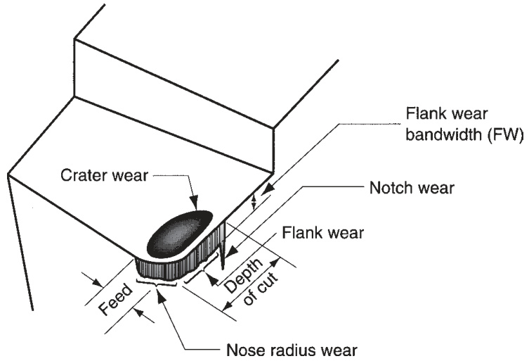  
FIGURE 22.1  Diagram  of worn cutting tool,  showing the principal  locations and types of  wear that occur.  

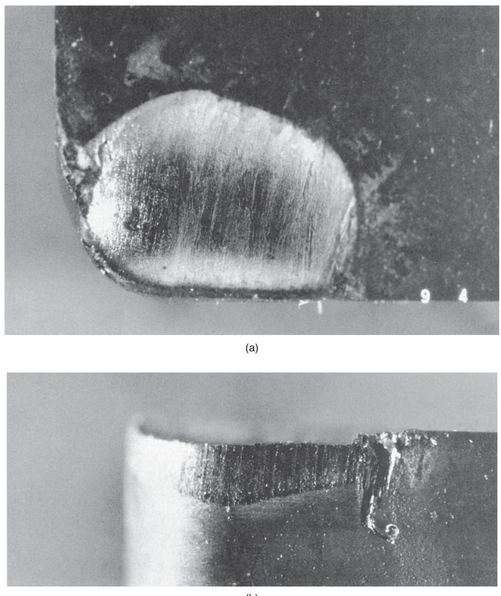  
FIGURE 22.2  (a) Crater wear and (b) fl  ank wear on a cemented carbide tool, as seen through a toolmaker’s  microscope. (Courtesy of George E. Kane Manufacturing Technology Laboratory, Lehigh University; photos by  J. C. Keefe.)  

The mechanisms that cause wear at the tool–chip and tool–work interfaces in  machining can be summarized as follows:  

➢   Abrasion . This is a mechanical wearing action caused by hard particles in the work  material gouging and removing small portions of the tool. This abrasive action  occurs in both fl  ank wear and crater wear; it is a signifi  cant cause of fl  ank wear.

 ➢   Adhesion . When two metals are forced into contact under high pressure and  temperature, adhesion (welding) occurs between them. These conditions are  present between the chip and the rake face of the tool. As the chip fl  ows across  the tool, small particles of the tool adhere to the chip and are broken away from  the surface, resulting in attrition of the surface.  

Diffusion . This is a process in which an exchange of atoms takes place across  a close contact boundary between two materials (Section 4.3). In the case of  tool wear, diffusion occurs at the tool–chip boundary, causing the tool surface  to become depleted of the atoms responsible for its hardness. As this process  continues, the tool surface becomes more susceptible to abrasion and adhesion.  Diffusion is believed to be a principal mechanism of crater wear.  

Chemical reactions . The high temperatures and clean surfaces at the tool–chip  interface in machining at high speeds can result in chemical reactions, in particu- lar, oxidation, on the rake face of the tool. The oxidized layer, being softer than  the parent tool material, is sheared away, exposing new material to sustain the  reaction process.  

Plastic deformation . Another mechanism that contributes to tool wear is plastic  deformation of the cutting edge. The cutting forces acting on the cutting edge at  high temperature cause the edge to deform plastically, making it more vulnerable  to abrasion of the tool surface. Plastic deformation contributes mainly to fl  ank wear.  

Most of these tool-wear mechanisms are accelerated at higher cutting speeds and  temperatures. Diffusion and chemical reaction are especially sensitive to elevated  temperature.  

# 22.1.2  TOOL LIFE AND THE TAYLOR TOOL LIFE EQUATION  

As cutting proceeds, the various wear mechanisms result in increasing levels of  wear on the cutting tool. The general relationship of tool wear versus cutting time  is shown in Figure 22.3. Although the relationship shown is for fl  ank wear, a similar  relationship occurs for crater wear. Three regions can usually be identifi  ed in the  typical wear growth curve. The fi  rst is the  break-in period , in which the sharp cut- ting edge wears rapidly at the beginning of its use. This fi  rst region occurs within the  fi  rst few minutes of cutting. The break-in period is followed by wear that occurs at  a fairly uniform rate. This is called the  steady-state wear  region. In the fi  gure, this  region is pictured as a linear function of time, although there are deviations from the  straight line in actual machining. Finally, wear reaches a level at which the wear rate  begins to accelerate. This marks the beginning of the  failure region , in which cutting  

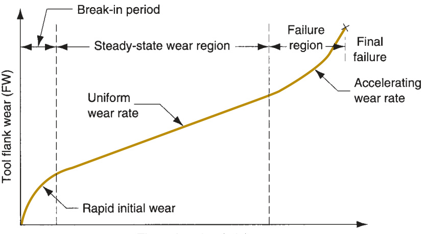  

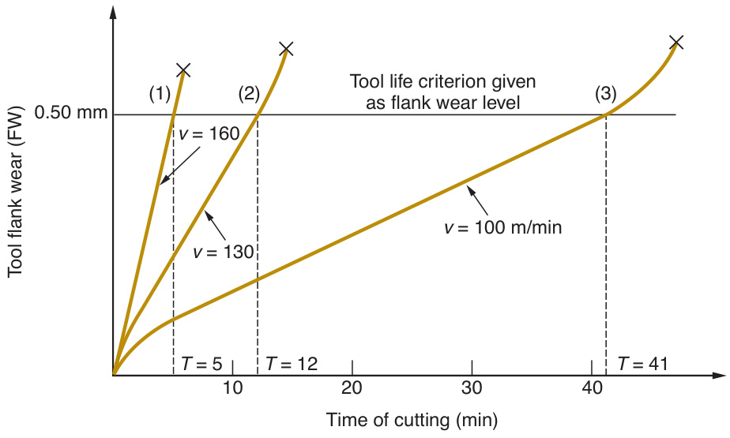  
FIGURE 22.4  Effect of  cutting speed on tool  fl  ank wear (FW) for  three cutting speeds.  Hypothetical values of  speed and tool life are  shown for a tool life  criterion of ${\mathsf{0.50}}{\mathsf{-m m}}$   fl  ank wear.  

temperatures are higher, and the general effi  ciency of the machining process is re- duced. If allowed to continue, the tool fi  nally fails by temperature failure.  

The slope of the tool wear curve in the steady-state region is affected by work mate- rial and cutting conditions. Harder work materials cause the wear rate (slope of the tool  wear curve) to increase. Increased speed, feed, and depth of cut have a similar effect,  with speed being the most important of the three. If the tool wear curves are plotted for  several different cutting speeds, the results appear as in Figure 22.4. As cutting speed is  increased, wear rate increases so the same level of wear is reached in less time.  

Tool life  is defi  ned as the length of cutting time that the tool can be used. Operat- ing the tool until fi  nal catastrophic failure is one way of defi  ning tool life. This is in- dicated in Figure 22.4 by the end of each tool wear curve. However, in production, it  is often a disadvantage to use the tool until this failure occurs because of diffi  culties  in resharpening the tool and problems with work surface quality. As an alternative,  a level of tool wear can be selected as a criterion of tool life, and the tool is replaced  when wear reaches that level. A convenient tool life criterion is a certain fl  ank wear  value, such as $0.5\,\mathrm{mm}\,(0.020\,\mathrm{in})$ , illustrated as the horizontal line on the graph. When  each of the three wear curves intersects that line, the life of the corresponding tool is  defi  ned as ended. If the intersection points are projected down to the time axis, the  values of tool life can be identifi  ed.  

Taylor Tool Life Equation  If the tool life values for the three wear curves in  Figure 22.4 are plotted on a natural log–log graph of cutting speed versus tool life,  the resulting relationship is a straight line as shown in Figure 22.5.  

The discovery of this relationship around 1900 is credited to F. W. Taylor. It can be  expressed in equation form and is called the Taylor tool life equation:  

$$
\nu T^{n}=C
$$  

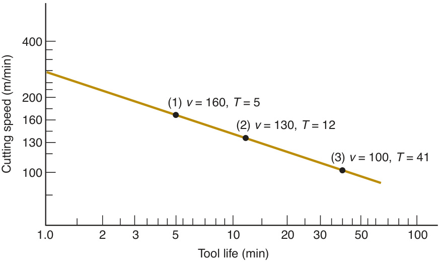  
FIGURE 22.5  Natural  log–log plot of cutting  speed vs. tool life.  

where  $\nu=$  cutting speed, $\mathrm{m/min}$   $(\mathrm{ft/min})$ ); $T=$  tool life, min; and $n$  and  $C$  are param- eters whose values depend on feed, depth of cut, work material, tooling (material in  particular), and the tool life criterion used. The value of  $n$  is relative constant for a  given tool material, whereas the value of $C$  depends on tool material, work material,  and cutting conditions.  

Basically, Equation (22.1) states that higher cutting speeds result in shorter tool  lives. Relating the parameters $n$  and  $C$  to Figure 22.5,  $n$  is the slope of the plot (ex- pressed in linear terms rather than in the scale of the axes), and $C$  is the intercept on  the speed axis.  $C$  represents the cutting speed that results in a 1-min tool life.  

The problem with Equation (22.1) is that the units on the right-hand side of the  equation are not consistent with the units on the left-hand side. To make the units  consistent, the equation should be expressed in the form  

$$
\nu T^{n}=C\left(T_{\mathrm{ref}}^{n}\right)
$$  

where  $T_{\mathrm{ref}}=\mathrm{a}$  reference value for  $C$ .  $T_{\mathrm{ref}}$  is simply  $1\;\mathrm{{min}}$  when  $\mathbf{m}/\mathbf{min}$  (ft/min) and  minutes are used for  $\nu$  and  $T$ , respectively. The advantage of Equation (22.2) is seen  when it is desired to use the Taylor equation with units other than  $\mathrm{m/min}\ \mathrm{(ft/min)}$   and minutes—for example, if cutting speed were expressed as $\mathrm{m/sec}$  and tool life as  sec. In this case,  $T_{\mathrm{ref}}$  would be $60\;\mathrm{sec}$  and  $C$  would therefore be the same speed value  as in Equation (22.1), although converted to units of  $\mathrm{m/sec}$ . The slope $n$  would have  the same numerical value as in Equation (22.1).  

# Example 22.1  Taylor tool life  equation  

Determine the values of $C$  and $n$  in the plot of Figure 22.5, using two of the  three points on the curve and solving simultaneous equations of the form of  Equation (22.1).  

Solution:  Choosing the two extreme points: $\nu=160\:\mathrm{m/min}$ ,  $T=5$  min; and  $\nu=100\:\mathrm{m/\min}$ ,  $T=41$  min; the two equations are:  

$$
{\frac{160(5)^{n}=C}{100(41)^{n}=C}}
$$  

  

Setting the left-hand sides of each equation equal,  

$$
160(5)^{n}=100\,(41)^{n}
$$  

Taking the natural logarithms of each term,  

$$
\begin{array}{c}{\ln(160)+n\ln(5)=\ln(100)+n\ln(41)}\\ {{}}\\ {5.0752+1.6094\,n=4.6052+3.7136\,n}\\ {{}}\\ {0.4700=2.1042\,n}\\ {{}}\\ {n=\underline{{0.4700}}=\mathbf{0.223}}\end{array}
$$  

Substituting this value of  $n$  into either starting equation, the value of  $C$  is  obtained:  

$$
\begin{array}{l}{{C=160(5)^{0.223}=229}}\\ {{\ }}\\ {{C=100(41)^{0.223}=229}}\end{array}
$$  

The Taylor tool life equation for the data of Figure 22.5 is therefore  $\nu T^{\,0.223}=229$  

An expanded version of Equation (22.2) can be formulated to include the effects  of feed, depth of cut, and even work material hardness:  

$$
\nu T^{n}f^{m}d^{p}H^{q}=K T_{\mathrm{ref}}{}^{n}f_{\mathrm{ref}}{}^{m}d_{\mathrm{ref}}{}^{p}H_{\mathrm{ref}}{}^{q}
$$  

where $f=$  feed, mm (in);  $d=$  depth of cut,  $\mathrm{mm}$  (in);  $H\,=$  hardness, expressed  in an appropriate hardness scale;  $m,p$ , and  $q$  are exponents whose values are  experimentally determined for the conditions of the operation;  $K=$  a constant  analogous to  $C$  in Equation (22.2); and $f_{\mathrm{ref}},d_{\mathrm{ref}},$  and  $H_{\mathrm{ref}}$  are reference values for  feed, depth of cut, and hardness. The values of  $m$  and $p$ ,  the exponents for feed  and depth, are less than 1.0. This indicates the greater effect of cutting speed on  tool life because the exponent of $\nu$  is 1.0. After speed, feed is next in importance,  so $m$  has a value greater than $p$ .  The exponent for work hardness,  $q$ ,  is also less  than 1.0.  

Perhaps the greatest diffi  culty in applying Equation (22.3) in a practical machin- ing operation is the tremendous amount of machining data that would be required  to determine the parameters of the equation. Variations in work materials and test- ing conditions also cause diffi  culties by introducing statistical variations in the data.  Equation (22.3) is valid in indicating general trends among its variables, but not in  its ability to accurately predict tool life performance. To reduce these problems and  make the scope of the equation more manageable, some of the terms are usually  

eliminated. For example, omitting depth and hardness reduces Equation (22.3) to  the following:  

$$
\nu T^{n}\,f^{m}=K T_{\mathrm{ref}}{}^{n}\,f_{\mathrm{ref}}{}^{m}
$$  

where the terms have the same meaning as before, except that the constant  $K$  will  have a slightly different interpretation.  

Tool Life Criteria in Production  Although fl  ank wear is the tool life criterion in  the previous discussion of the Taylor equation, this criterion is not very practical  in a factory environment because of the diffi  culties and time required to measure  fl  ank wear. Following are nine alternative tool life criteria that are more conven- ient to use in a production machining operation, some of which are admittedly  subjective:  

1.  Complete failure of the cutting edge (fracture failure, temperature failure, or  wearing until complete breakdown of the tool has occurred). This criterion has  disadvantages, as discussed earlier.

 2.  Visual inspection of fl  ank wear (or crater wear) by the machine operator (with- out a toolmaker’s microscope). This criterion is limited by the operator’s judg- ment and ability to observe tool wear with the naked eye.

 3.  Fingernail test across the cutting edge by the operator to test for irregularities.

 4.  Changes in the sound emitting from the operation, as judged by the operator.

 5.  Chips become ribbony, stringy, and diffi  cult to dispose of.

 6.  Degradation of the surface fi  nish on the work.

 7.  Increased power consumption in the operation, as measured by a wattmeter  connected to the machine tool.

 8.  Workpiece count. The operator is instructed to change the tool after a certain  specifi  ed number of parts have been machined.

 9.  Cumulative cutting time. This is similar to the previous workpiece count, except  that the length of time the tool has been cutting is monitored. This is possible  on machine tools controlled by computer; the computer is programmed to keep  data on the total cutting time for each tool.  

The three modes of tool failure allow us to identify three important properties re- quired in a tool material:  

➢   Toughness . To avoid fracture failure, the tool material must possess high tough- ness. Toughness is the capacity of a material to absorb energy without failing. It is  usually characterized by a combination of strength and ductility in the material.

 $\gg$ Hot hardness . Hot hardness is the ability of a material to retain its hardness at  high temperatures. This is required because of the high-temperature environ- ment in which the tool operates.  

➢   Wear resistance . Hardness is the single most important property needed to  resist abrasive wear. All cutting-tool materials must be hard. However, wear  resistance in metal cutting depends on more than just tool hardness, because  of the other tool-wear mechanisms. Other characteristics affecting wear re- sistance include surface fi  nish on the tool (a smoother surface means a lower  coeffi  cient of friction), chemistry of tool and work materials, and whether a  cutting fl  uid is used.  

Cutting-tool materials achieve this combination of properties in varying degrees.  In this section, the following cutting-tool materials are discussed: (1) high-speed  steel and its predecessors, plain carbon and low alloy steels, (2) cast cobalt alloys,  (3) cemented carbides, cermets, and coated carbides, (4) ceramics, (5) synthetic dia- mond and cubic boron nitride. Before examining these individual materials, a brief  overview and technical comparison will be helpful. The historical development of  these materials is described in Historical Note 22.1. Commercially, the most impor- tant tool materials are high-speed steel and cemented carbides, cermets, and coated  carbides. These two categories account for more than $90\%$  of the cutting tools used  in machining operations.  

Table 22.1 and Figure 22.6 present data on properties of various tool materials.  The properties are those related to the requirements of a cutting tool: hardness,  toughness, and hot hardness. Table 22.1 lists room temperature hardness and trans- verse rupture strength for selected materials. Transverse rupture strength (Section  3.1.3) is a property used to indicate toughness for hard materials. Figure 22.6 shows  hardness as a function of temperature for several of the tool materials discussed in  this section.  

TABLE  •  22.1  Typical hardness values (at room temperature) and transverse rupture  strengths for various tool materials. 
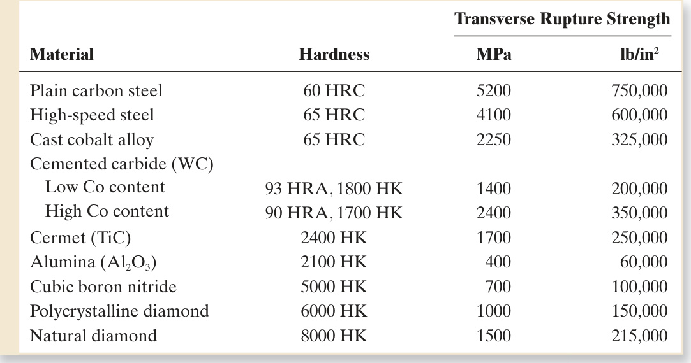  
Compiled from [4], [9], [17], and other sources. a Note:  The values of hardness and TRS are intended to be comparative and typical. Variations in prop- erties result from differences in composition and processing.  

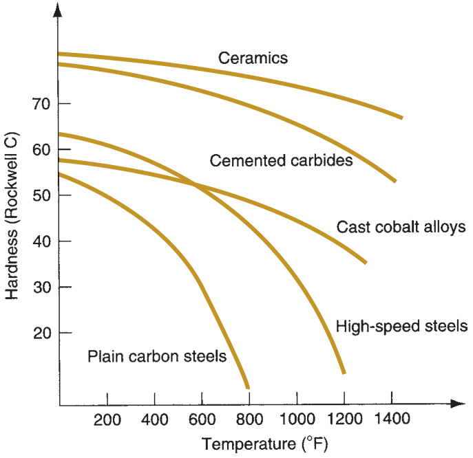  
FIGURE 22.6  Typical hot  hardness relationships for  selected tool materials.  Plain carbon steel shows  a rapid loss of hardness as  temperature increases. High- speed steel is   substantially  better, while cemented  carbides and ceramics  are signifi  cantly harder  at   elevated temperatures.  

# Historical Note 22.1  Cutting-tool materials  

In 1800, England was leading the Industrial Revolution,  and iron was the leading metal in the revolution. The  best tools for cutting iron were made of cast steel by  the crucible process, invented in 1742 by B. Huntsman.  Cast steel, whose carbon content lies between wrought  iron and cast iron, could be hardened by heat treatment  to machine the other metals. In 1868, R. Mushet dis- covered that by alloying about  $7\%$  tungsten in crucible  steel, a hardened tool steel was obtained by air quench- ing after heat treatment. Mushet’s tool steel was far su- perior to its predecessor in machining.  

Frederick W. Taylor stands as an important fi  gure  in the history of cutting tools. Starting around 1880 at  Midvale Steel in Philadelphia and later at Bethlehem  Steel in Bethlehem, Pennsylvania, he began a series  of experiments that lasted a quarter century, yielding  a much improved understanding of the metal-cutting  process. Among the developments resulting from the  work of Taylor and colleague Maunsel White at Beth- lehem was  high-speed steel  (HSS), a class of highly  alloyed tool steels that permitted substantially higher  cutting speeds than previous cutting tools. The supe- riority of HSS resulted not only from greater alloying,  but also from refi  nements in heat treatment. Tools of  the new steel allowed cutting speeds more than twice  those of Mushet’s steel and almost four times those of  plain carbon cast steels.  

Tungsten carbide (WC) was fi  rst synthesized in  the late 1890s. It took nearly three decades before a  useful cutting tool material was developed by sinter- ing the WC with a metallic binder to form  cemented  carbides.  These were fi  rst used in metal cutting in  the mid-1920s in Germany, and in the late 1920s in  the United States (Historical Note 7 .2).  Cermet  cutting  tools based on titanium carbide were fi  rst introduced  in the 1950s, but their commercial importance dates  from the 1970s. The fi  rst  coated carbides,  consisting  of one coating on a WC–Co substrate, were fi  rst used  around 1970. Coating materials included TiC, TiN, and  $\mathsf{A l}_{2}\mathsf{O}_{3}$ . Modern coated carbides have three or more  coatings of these and other hard materials.  

Attempts to use  alumina ceramics  in machining  date from the early 1900s in Europe. Their brittleness  inhibited success in these early applications. Process- ing refi  nements over many decades have resulted in  property improvements in these materials. U.S. com- mercial use of ceramic cutting tools dates from the  mid-1950s.  

The fi  rst industrial diamonds were produced by  the General Electric Company in 1954. They were  single crystal diamonds that were applied with some  success in grinding operations starting around 1957 .  Greater acceptance of diamond cutting tools has  resulted from the use of  sintered polycrystalline  diamond  (SPD), dating from the early 1970s. A simi- lar tool material, sintered  cubic boron nitride,  was  fi  rst introduced in 1969 by GE under the trade name  Borazon.  

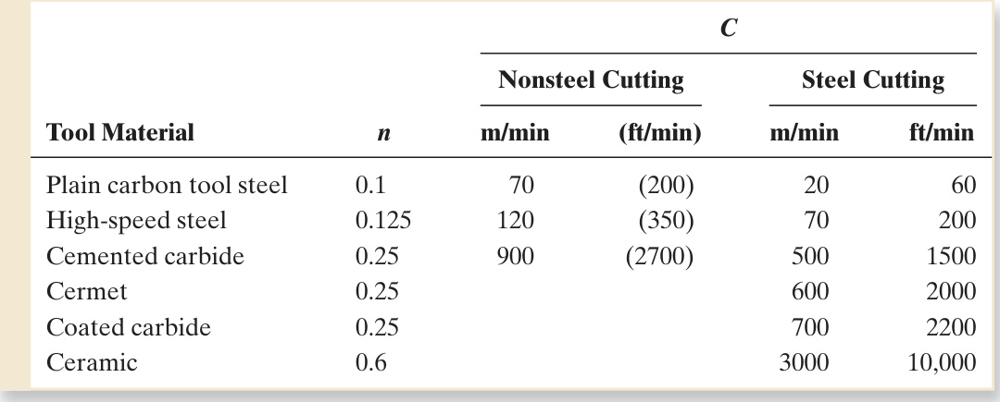  

In addition to these property comparisons, it is useful to compare the materials  in terms of the parameters  $n$  and  $C$  in the Taylor tool life equation. In general, the  development of new cutting-tool materials has resulted in increases in the values of  these two parameters. Table 22.2 lists representative values of  $n$  and  $C$  for selected  cutting-tool materials.  

The chronological development of tool materials has generally followed a path in  which new materials have permitted higher and higher cutting speeds to be achieved.  Table 22.3 identifi  es the cutting-tool materials, together with their approximate year of  introduction and typical maximum allowable cutting speeds at which they can be used.  

TABLE  •  22.3  Cutting-tool materials with their approximate dates of initial use and  allowable cutting speeds. 
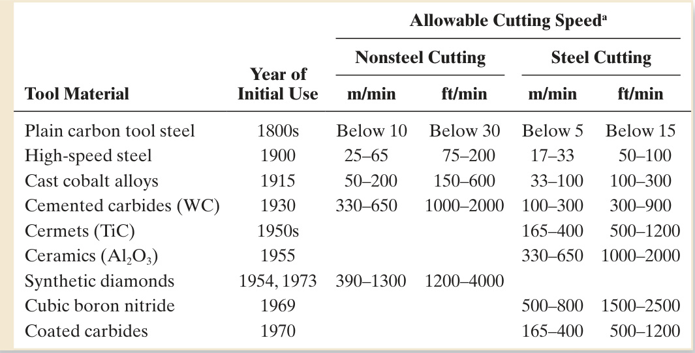  
a Compiled from [9], [12], [16], [19], and other sources.  

Dramatic increases in machining productivity have been made possible by advances in  tool material technology, as indicated in the table. Machine tool practice has not always  kept pace with cutting-tool technology. Limitations on horsepower, machine tool rigid- ity, spindle bearings, and the widespread use of older equipment in industry have acted  to underutilize the possible upper speeds permitted by available cutting tools.  

# 22.2.1 HIGH-SPEED STEEL AND ITS PREDECESSORS  

Before the development of high-speed steel, plain carbon steel and Mushet’s steel  were the principal tool materials for metal cutting. Today, these steels are rarely  used in industrial machining applications. The plain carbon steels used as cutting  tools could be heat-treated to achieve relatively high hardness ( $\sim$  Rockwell C 60),  because of their fairly high carbon content. However, with low alloying levels, they  possess poor hot hardness (Figure 22.6), which renders them unusable in metal cut- ting except at speeds too slow to be practical by today’s standards. Mushet’s steel  contained alloying elements tungsten  $(4\%-12\%)$  and manganese  $(2\%-4\%)$  in ad- dition to carbon. It was displaced by the introduction of high speed steel and other  advances in tool steel metallurgy.  

High-speed steel  (HSS) is a highly alloyed tool steel capable of maintaining hard- ness at elevated temperatures better than high carbon and low alloy steels. Its good hot  hardness permits tools made of HSS to be used at higher cutting speeds. Compared  with the other tool materials at the time of its development, it was truly deserving of its  name “high speed.” A wide variety of high-speed steels is available, but they can be di- vided into two basic types: (1) tungsten-type, designated T-grades by the American Iron  and Steel Institute (AISI); and (2) molybdenum-type, designated M-grades by AISI.  

Tungsten-type HSS  contains tungsten (W) as its principal alloying ingredient. Ad- ditional alloying elements are chromium  $(\mathrm{Cr})$ , and vanadium (V). One of the origi- nal and best known HSS grades is T1, or 18-4-1 high-speed steel, containing  $18\%$  W,  $4\%$  Cr, and  $1\%$  V.  Molybdenum HSS  grades contain combinations of tungsten and  molybdenum (Mo), plus the same additional alloying elements as in the T-grades.  Cobalt  $\left(\mathrm{Co}\right)$  is sometimes added to HSS to enhance hot hardness. Of course, high- speed steel contains carbon, the element common to all steels. Typical alloying con- tents and functions of each alloying element in HSS are listed in Table 22.4.  

Commercially, high-speed steel is one of the most important cutting-tool materi- als in use today, despite the fact that it was introduced more than a century ago. HSS  is especially suited to applications involving complicated tool geometries, such as  drills, taps, milling cutters, and broaches. These complex shapes are generally easier  and less expensive to produce from unhardened HSS than other tool materials. They  can then be heat-treated so that cutting-edge hardness is very good (Rockwell C 65)  whereas toughness of the internal portions of the tool is also good. HSS cutters  possess better toughness than any of the harder nonsteel tool materials used for  machining, such as cemented carbides and ceramics. Even for single-point tools, HSS  is popular among machinists because of the ease with which a desired tool geometry  can be ground into the tool point. Over the years, improvements have been made in  the metallurgical formulation and processing of HSS so that this class of tool mate- rial remains competitive in many applications. Also, HSS tools, drills in particular,  are often coated with a thin fi  lm of titanium nitride (TiN) to provide   signifi  cant  increases in cutting performance. Physical vapor deposition processes (Section  27.5.1) are commonly used to coat these HSS tools.  

TABLE  •  22.4  Typical contents and functions of alloying elements in high-speed steel. 
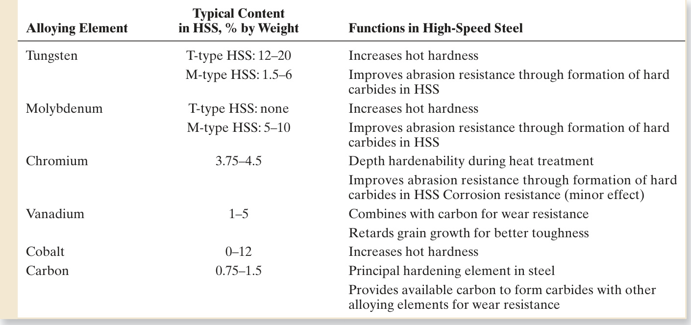  

# 22.2.2  CAST COBALT ALLOYS  

Cast cobalt alloy cutting tools consist of cobalt, around  $40\%$  to  $50\%$ ; chromium,  about  $25\%$  to  $35\%$ ; and tungsten, usually  $15\%$  to  $20\%$ ; with trace amounts of  other elements. These tools are made into the desired shape by casting in graph- ite molds and then grinding to fi  nal size and cutting-edge sharpness. High hard- ness is achieved as cast, an advantage over HSS, which requires heat treatment to  achieve its hardness. Wear resistance of the cast cobalts is better than high-speed  steel, but not as good as cemented carbide. Toughness of cast cobalt tools is better  than carbides but not as good as HSS. Hot hardness also lies between these two  materials.  

As might be expected from their properties, applications of cast cobalt tools are  generally between those of high-speed steel and cemented carbides. They are ca- pable of heavy roughing cuts at speeds greater than HSS and feeds greater than  carbides. Work materials include both steels and nonsteels, as well as nonmetallic  materials such as plastics and graphite. Today, cast cobalt alloy tools are not nearly as  important commercially as either high-speed steel or cemented carbides. They were  introduced around 1915 as a tool material that would allow higher cutting speeds  than HSS. The carbides were subsequently developed and proved to be superior to  the cast Co alloys in most cutting situations.  

# 22.2.3  CEMENTED CARBIDES, CERMETS, AND COATED CARBIDES  

Cermets  are defi  ned as composites of  cer amic and  met allic materials (Section 9.2.1).  Technically speaking, cemented carbides are included within this defi  nition; how- ever, cermets based on WC–Co, including WC–TiC–TaC–Co, are known as carbides  (cemented carbides) in common usage. In cutting-tool terminology, the term cer- met is applied to ceramic-metal composites containing TiC, TiN, and certain other  ceramics not including WC. One of the advances in cutting-tool materials involves  the application of a very thin coating to a WC–Co substrate. These tools are called  coated carbides. Thus, there are three important and closely related tool materials to  discuss: (1) cemented carbides, (2) cermets, and (3) coated carbides.  

Cemented Carbides  Cemented carbides (also called  sintered carbides ) are a  class of hard tool material formulated from tungsten carbide (WC, Section 7.3.2)  using powder metallurgy techniques (Chapter 15) with cobalt (Co) as the binder  (Sections 9.2.1 and 16.3.1). There may be other carbide compounds in the mixture,  such as titanium carbide (TiC) and/or tantalum carbide (TaC), in addition to WC.  

The fi  rst cemented carbide cutting tools were made of WC–Co (Historical  Note 7.2) and could be used to machine cast irons and nonsteel materials at cut- ting speeds faster than those possible with high-speed steel and cast cobalt alloys.  However, when the straight WC–Co tools were used to cut steel, crater wear oc- curred rapidly, leading to early failure of the tools. A strong chemical affi  nity exists  between steel and the carbon in WC, resulting in accelerated wear by diffusion  and chemical reaction at the tool–chip interface for this work-tool combination.  Consequently, straight WC–Co tools cannot be used effectively to machine steel. It  was subsequently discovered that additions of titanium carbide and tantalum car- bide to the WC–Co mix signifi  cantly retarded the rate of crater wear when cutting  steel. These new WC–TiC–TaC–Co tools could be used for steel machining. The re- sult is that cemented carbides are divided into two basic types: (1) nonsteel-cutting  grades, consisting of only WC–Co; and (2) steel-cutting grades, with combinations  of TiC and TaC added to the WC–Co.  

The general properties of the two types of cemented carbides are similar: (1) high  compressive strength but low-to-moderate tensile strength; (2) high hardness (90 to  95 HRA); (3) good hot hardness; (4) good wear resistance; (5) high thermal conduc- tivity; (6) high modulus of elasticity $\cdot\!-\!E$  values up to around  $600\times10^{3}$  MPa ( $(90\times$ $10^{6}\mathrm{lb/in}^{2}$ ); and (7) toughness lower than high-speed steel.  

Nonsteel-cutting grades  refer to those cemented carbides that are suitable for  machining aluminum, brass, copper, magnesium, titanium, and other nonferrous  metals; anomalously, gray cast iron is included in this group of work materials. In  the nonsteel-cutting grades, grain size and cobalt content are the factors that infl  u- ence properties of the cemented carbide material. The typical grain size found in  conventional cemented carbides ranges between 0.5 and $5\,\mu\mathrm{m}$  (20 and $200\,\mu$ -in). As  grain size is increased, hardness and hot hardness decrease, but transverse rupture  strength increases.  The typical cobalt content in cemented carbides used for cutting  tools is 3 to  $12\%$ . The effect of cobalt content on hardness and transverse rupture  strength is shown in Figure 9.9. As cobalt content increases, TRS improves at the  expense of hardness and wear resistance. Cemented carbides with low percentages  of cobalt content  $(3\%{-}6\%)$  have high hardness and low TRS, whereas carbides with  high  $\mathrm{Co}$   $(6\%–12\%)$  have high TRS but lower hardness (Table 22.1). Accordingly,  cemented carbides with higher cobalt are used for roughing operations and inter- rupted cuts (such as milling), while carbides with lower cobalt (therefore, higher  hardness and wear resistance) are used in fi  nishing cuts.  

TABLE •  22.5  The ANSI C-grade classifi  cation system for cemented carbides. 
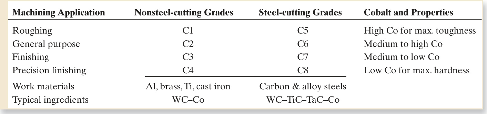  

Steel-cutting grades  are used for low carbon, stainless, and other alloy steels. For  these carbide grades, titanium carbide and/or tantalum carbide is substituted for  some of the tungsten carbide. TiC is the more popular additive in most applications.  Typically, from  $10\%$  to  $25\%$  of the WC might be replaced by combinations of TiC  and TaC. This composition increases the crater wear resistance for steel cutting, but  tends to adversely affect fl  ank wear resistance for nonsteel-cutting applications. That  is why two basic categories of cemented carbide are needed.  

One of the important developments in cemented carbide technology in recent  years is the use of very fi  ne grain sizes (submicron sizes) of the various carbide ingre- dients (WC, TiC, and TaC). Although small grain size is usually associated with   higher  hardness but lower transverse rupture strength, the decrease in TRS is reduced or  reversed at the submicron particle sizes. Therefore, these ultrafi  ne grain carbides  possess high hardness combined with good toughness.  

Since the two basic types of cemented carbide were introduced in the 1920s and  1930s, the increasing number and variety of engineering materials have complicat- ed the selection of the most appropriate cemented carbide for a given machining  application. To address the problem of grade selection, two classifi  cation systems  have been developed: (1) the ANSI 3  C-grade system, developed in the United States  starting around 1942; and (2) the ISO R513-1975(E) system, introduced by the  International Organization for Standardization (ISO) around 1964. In the C-grade  system, summarized in Table 22.5, machining grades of cemented carbide are divided  into two basic groups, corresponding to nonsteel-cutting and steel-cutting categories.  Within each group there are four levels, corresponding to roughing, general purpose,  fi  nishing, and precision fi  nishing.  

The ISO R513-1975(E) system, titled “Application of Carbides for Machining by  Chip Removal,” classifi  es all machining grades of cemented carbides into three basic  groups, each with its own letter and color code, as summarized in Table 22.6. Within  each group, the grades are numbered on a scale that ranges from maximum hard- ness to maximum toughness. Harder grades are used for fi  nishing operations (high  speeds, low feeds and depths), whereas tougher grades are used for roughing opera- tions. The ISO classifi  cation system can also be used to recommend applications for  cermets and coated carbides.  

The two systems map into each other as follows: The ANSI C1 through C4-grades  map into the ISO K-grades, but in reverse numerical order, and the ANSI C5 through  C8 grades translate into the ISO P-grades, but again in reverse numerical order.  

TABLE •  22.6  ISO R513-1975(E) “Application of Carbides for Machining by Chip Removal.” 
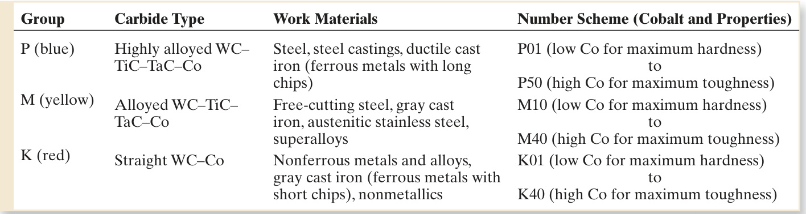  

Cermets  Although cemented carbides are technically classifi  ed as cermet compos- ites, the term  cermet  in cutting-tool technology is generally reserved for combina- tions of TiC, TiN, and titanium carbonitride (TiCN), with nickel and/or molybdenum  as binders. Some of the cermet chemistries are more complex (e.g., ceramics such  as $\mathrm{Ta}_{\mathrm{x}}\mathrm{Nb}_{\mathrm{y}}\mathrm{C}$  and binders such as  $\mathrm{Mo}_{2}\mathrm{C}$ ). However, cermets exclude metallic compos- ites that are primarily based on WC–Co. Applications of cermets include high-speed  fi  nishing and semifi  nishing of steels, stainless steels, and cast irons. Higher speeds are  generally allowed with these tools compared with steel-cutting carbide grades. Lower  feeds are typically used so that better surface fi  nish is achieved, often eliminating the  need for grinding.  

Coated Carbides  The development of coated carbides around 1970 represented  a signifi  cant advance in cutting-tool technology.  Coated carbides  are a cemented  carbide insert coated with one or more thin layers of wear resistant material, such  as titanium carbide, titanium nitride, and/or aluminum oxide  $(\mathrm{Al}_{2}\mathrm{O}_{3,\right.}$ ). The coating is  applied to the substrate by chemical vapor deposition or physical vapor deposition  (Section 27.5). The coating thickness is only 2.5 to $13\;\mu\mathrm{m}$ (0.0001–0.0005 in). It has  been found that thicker coatings tend to be brittle, resulting in cracking, chipping,  and separation from the substrate.  

The fi  rst generation of coated carbides had only a single layer coating (TiC, TiN,  or ${\mathrm{Al}}_{2}{\mathrm{O}}_{3}$ ). More recently, coated inserts have been developed that consist of multiple  layers. The fi  rst layer applied to the WC–Co base is usually TiN or TiCN because of  good adhesion and similar coeffi  cient of thermal expansion. Additional layers of  various combinations of TiN, TiCN, ${\mathrm{Al}}_{2}{\mathrm{O}}_{3}$ , and TiAlN are subsequently applied (see  Figure 27.8).  

Coated carbides are used to machine cast irons and steels in turning and mill- ing operations. They are best applied at high cutting speeds in situations in which  dynamic force and thermal shock are minimal. If these conditions become too  severe, as in some interrupted cut operations, chipping of the coating can occur,  resulting in premature tool failure. In this situation, uncoated carbides formulated  for toughness are preferred. When properly applied, coated carbide tools usually  permit increases in allowable cutting speeds compared with uncoated cemented  carbides.  

Use of coated carbide tools is expanding to nonferrous metal and nonmetal  applications for improved tool life and higher cutting speeds. Different coating  materials are required, such as chromium carbide  $\mathrm{(CrC)}$ , zirconium nitride  $(Z\mathrm{r}\mathbf{N})$ ,  and diamond [11].  

# 22.2.4  CERAMICS  

Cutting tools made from ceramics were fi  rst used commercially in the United States  in the mid-1950s, although their development and use in Europe dates back to the  early 1900s. Today’s ceramic cutting tools are composed primarily of fi  ne-grained  aluminum oxide   $(\mathrm{Al}_{2}\mathrm{O}_{3})$ , pressed and sintered at high pressures and temperatures  with no binder into insert form. The aluminum oxide is usually very pure  $(99\%$  is  typical), although some manufacturers add other oxides (such as zirconium oxide) in  small amounts. In producing ceramic tools, it is important to use a very fi  ne grain size  in the alumina powder, and to maximize density of the mix through high-pressure  compaction to improve the material’s low toughness.  

Aluminum oxide cutting tools are most successful in high-speed turning of cast  iron and steel. Applications also include fi  nish turning of hardened steels using  high cutting speeds, low feeds and depths, and a rigid work setup. Many premature  fracture failures of ceramic tools occur because of nonrigid machine tool setups,  which subject the tools to mechanical shock. When properly applied, ceramic cut- ting tools can be used to obtain very good surface fi  nish. Ceramics are not recom- mended for heavy interrupted cut operations (e.g., rough milling) because of their  low toughness. In addition to its use as inserts in conventional machining opera- tions, ${\mathrm{Al}}_{2}{\mathrm{O}}_{3}$  is widely used as an abrasive in grinding and other abrasive processes 

 (Chapter 24).  

Other commercially available ceramic cutting-tool materials include silicon nitride 

 (SiN),  sialon  (silicon nitride and aluminum oxide,  $\mathrm{SiN\mathrm{-Al}_{2}O_{3}}$ ), aluminum oxide and  titanium carbide  $(\mathrm{Al}_{2}\mathrm{O}_{3}\mathrm{-TiC})$ ), and aluminum oxide reinforced with single crystal- whiskers of silicon carbide. These tools are usually intended for special applications, a  discussion of which is beyond the scope of this introductory treatment.  

# 22.2.5  SYNTHETIC DIAMONDS AND CUBIC BORON NITRIDE  

Diamond is the hardest material known (Section 7.6.1). By some measures of hard- ness, diamond is three to four times as hard as tungsten carbide or aluminum oxide.  Since high hardness is one of the desirable properties of a cutting tool, it is natural to  think of diamonds for machining and grinding applications. Synthetic diamond cut- ting tools are made of sintered polycrystalline diamond (SPD), which dates from the  early 1970s.  Sintered polycrystalline diamond  is fabricated by sintering fi  ne-grained  diamond crystals under high temperatures and pressures into the desired shape. Lit- tle or no binder is used. The crystals have a random orientation and this adds con- siderable toughness to the SPD tools compared with single crystal diamonds. Tool  inserts are typically made by depositing a layer of SPD about $0.5\,\mathrm{mm}\,(0.020\,\mathrm{in})$  thick  on the surface of a cemented carbide base. Very small inserts have also been made  of $100\%$  SPD.  

Applications of diamond cutting tools include high-speed machining of non- ferrous metals and abrasive nonmetals such as fi  berglass, graphite, and wood.  Machining of steel, other ferrous metals, and nickel-based alloys with SPD tools is  not practical because of the chemical affi  nity that exists between these metals and  carbon (a diamond, after all, is carbon).  

Next to diamond,  cubic boron nitride  (Section 7.3.3) is the hardest material  known, and its fabrication into cutting tool inserts is basically the same as SPD,  that is, coatings on WC–Co inserts. Cubic boron nitride (symbolized cBN) does not  react chemically with iron and nickel as SPD does; therefore, the applications of  cBN-coated tools are for machining steel and nickel-based alloys. Both SPD and  cBN tools are expensive, as one might expect, and the applications must justify the  additional tooling cost.  

#  Tool Geometry  

One important way to classify cutting tools is according to the machining process.  Thus, there are turning tools, cutoff tools, milling cutters, drill bits, reamers, taps, and  many other cutting tools that are named for the operation in which they are used,  each with its own tool geometry—in some cases quite unique.  

As indicated in Section 20.1, cutting tools can be divided into single- point tools and multiple-cutting-edge tools. Single-point tools are used in turn- ing, boring, shaping, and planing. Multiple-cutting-edge tools are used in drill- ing, reaming, tapping, milling, broaching, and sawing. Many of the principles that  apply to single-point tools also apply to the other cutting-tool types, simply be- cause the mechanism of chip formation is basically the  same for all machining  operations.  

Table 22.7 presents a troubleshooting guide that summarizes many of the actions  that can be taken to reduce tooling problems that might result from nonoptimal  application of cutting conditions, tool material, and/or tool geometry.  

TABLE  •  22.7  Troubleshooting Guide for Cutting Tool Problems. 
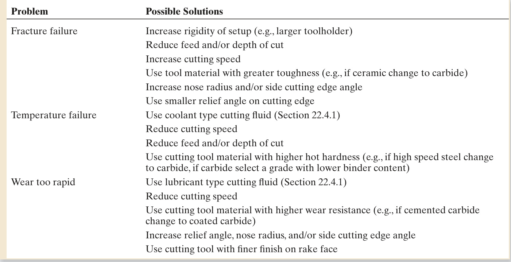  

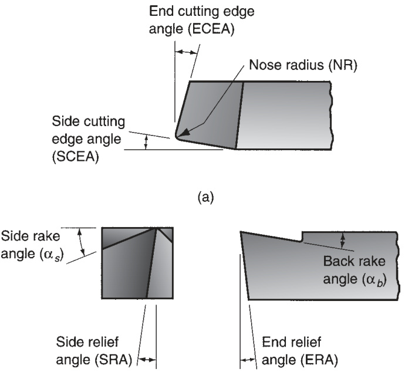  
$\alpha_{b},\alpha_{s},$  

# 22.3.1 SINGLE-POINT TOOL GEOMETRY  

The general shape of a single-point cutting tool is illustrated in Figure 20.4(a).  Figure 22.7 shows a more detailed drawing.  

The rake angle of a cutting tool has previously been treated as one parameter.  In a single-point tool, the orientation of the rake face is defi  ned by two angles,  back  rake angle   $\left(\alpha_{b}\right)$  and  side rake angle   $\left(\alpha_{s}\right)$ . Together, these angles are infl  uential in  determining the direction of chip fl  ow across the rake face. The fl  ank surface of the  tool is defi  ned by the  end relief angle  (ERA) and  side relief angle  (SRA). These  angles determine the amount of clearance between the tool and the freshly cut work  surface. The cutting edge of a single-point tool is divided into two sections, side cut- ting edge and end cutting edge. These two sections are separated by the tool point,  which has a certain radius, called the nose radius. The  side cutting edge angle  (SCEA)  determines the entry of the tool into the work and can be used to reduce the sudden  force the tool experiences as it enters a work part.  Nose radius  (NR) determines to  a large degree the texture of the surface generated in the operation. A very pointed  tool (small nose radius) results in very pronounced feed marks on the surface (Sec- tion 23.2.2).  End cutting edge angle  (ECEA) provides a clearance between the trail- ing edge of the tool and the newly generated work surface, thus reducing rubbing and  friction against the surface.  

In all, there are seven elements of tool geometry for a single-point tool. When  specifi  ed in the following order, they are collectively called the  tool geometry signa- ture : back rake angle, side rake angle, end relief angle, side relief angle, end cutting  edge angle, side cutting edge angle, and nose radius. For example, a single-point tool  used in turning might have the following signature: 5, 5, 7, 7, 20, 15, 0.8 mm.  

Chip Breakers  Chip disposal is a problem that is often encountered in turning and  other continuous operations. Long, stringy chips are often generated, especially when  turning ductile materials at high speeds. These chips cause a hazard to the machine  FIGURE 22.8  Two  methods of chip  breaking in single-point  tools: (a) groove-type  and (b) obstruction-type  chip breakers.  

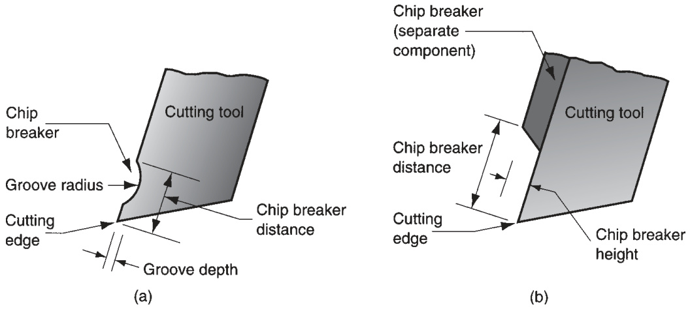  

operator and the work part fi  nish, and they interfere with automatic operation of the  turning process.  Chip breakers  are frequently used with single-point tools to force the  chips to curl more tightly than they would naturally be inclined to do, thus causing  them to fracture. There are two principal forms of chip breaker design commonly used  on single-point turning tools, illustrated in Figure 22.8: (a) groove-type chip breaker  designed into the cutting tool itself, and (b) obstruction-type chip breaker designed  as an additional device on the rake face of the tool. The chip breaker distance can be  adjusted in the obstruction-type device for different cutting conditions.  

Effect of Tool Material on Tool Geometry  It was noted in the discussion of the  Merchant equation (Section 20.3.2) that a positive rake angle is generally desirable  because it reduces cutting forces, temperature, and power consumption. High speed  steel cutting tools are almost always ground with positive rake angles, typically rang- ing from $+5^{\circ}$  to  $+20^{\circ}$ . HSS has good strength and toughness, so that the thinner cross  section of the tool created by high positive rake angles does not usually cause a prob- lem with tool breakage. HSS tools are predominantly made of one piece. The heat  treatment of high-speed steel can be controlled to provide a hard cutting edge while  maintaining a tough inner core.  

With the development of the very hard tool materials (e.g., cemented carbides  and ceramics), changes in tool geometry were required. As a group, these mate- rials have higher hardness and lower toughness than HSS. Also, their shear and  tensile strengths are low relative to their compressive strengths, and their prop- erties cannot be manipulated through heat treatment like those of HSS. Finally,  cost per unit weight for these very hard materials is higher than the cost of HSS.  These factors have affected cutting-tool design for the very hard tool materials in  several ways.  

First, the very hard materials must be designed with either negative rake or small  positive angles. This change tends to load the tool more in compression and less in  shear, thus favoring the high compressive strength of these harder materials. Cement- ed carbides, for example, are used with rake angles typically in the range from  $-5^{\circ}$   to  $+10^{\circ}$ . Ceramics have rake angles between  $-5^{\circ}$  and $-15^{\circ}$ . Relief angles are made  as small as possible ( $5^{\circ}$  is typical) to provide as much support for the cutting edge as  possible.  

Another difference is the way in which the cutting edge of the tool is held  in position. The alternative ways of holding and presenting the cutting edge for  

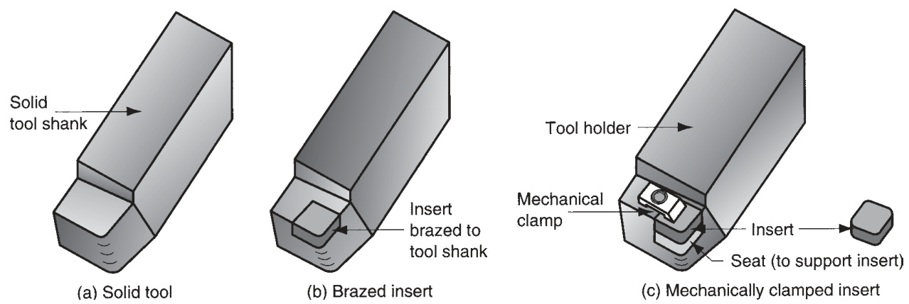  
FIGURE 22.9  Three ways of holding and presenting the cutting edge for a single-point tool: (a) solid tool, typical of  HSS; (b) brazed insert, one way of holding a cemented carbide insert; and (c) mechanically clamped insert, used for  cemented carbides, ceramics, and other very hard tool materials.  

a   single-point tool are illustrated in Figure 22.9. The geometry of a HSS tool is  ground from a solid shank, as shown in part (a) of the fi  gure. The higher cost and  differences in properties and processing of the harder tool materials have given  rise to the use of inserts that are either brazed or mechanically clamped to a tool- holder. Part (b) shows a brazed insert, in which a cemented carbide insert is brazed  to a tool shank. The shank is made of tool steel for strength and toughness. Part (c)  illustrates one possible design for mechanically clamping an insert in a toolholder.  Mechanical clamping is used for cemented carbides, ceramics, and the other hard  materials. The signifi  cant advantage of the mechanically clamped insert is that  each insert contains multiple cutting edges. When an edge wears out, the insert is  unclamped, indexed (rotated in the toolholder) to the next edge, and reclamped  in the toolholder. When all of the cutting edges are worn, the insert is discarded  and replaced.  

Inserts  Cutting-tool inserts are widely used in machining because they are eco- nomical and adaptable to many different types of machining operations: turning,  boring, threading, milling, and even drilling. They are available in a variety of shapes  and sizes for the variety of cutting situations encountered in practice. A square  insert is shown in Figure 22.9(c). Other common shapes used in turning opera- tions are displayed in Figure 22.10. In general, the largest point angle should be  selected for strength and economy. Round inserts possess large point angles (and  large nose radii) just because of their shape. Inserts with large point angles are  inherently stronger and less likely to chip or break during cutting, but they require  more power, and there is a greater likelihood of vibration. The economic advan- tage of round inserts is that they can be indexed multiple times for more cuts per  insert. Square inserts present four cutting edges, triangular shapes have three edges,  whereas rhombus shapes have only two. Fewer edges are a cost disadvantage. If  both sides of the insert can be used (e.g., in most negative rake angle applications),  then the number of cutting edges is doubled. Rhombus shapes are used (especially  with acute point angles) because of their versatility and accessibility when a variety  of operations are to be performed. These shapes can be more readily positioned in  tight spaces and can be used not only for turning but also for facing, Figure 21.6(a),  and contour turning, Figure 21.6(c).  

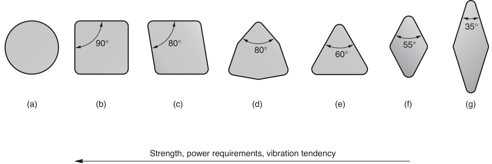  

Versatility and accessibility  

FIGURE 22.10  Common insert shapes: (a) round, (b) square, (c) rhombus with two $80^{\circ}$  point angles, (d) hexagon  with three $80^{\circ}$  point angles, (e) triangle (equilateral), (f) rhombus with two $55^{\circ}$  point angles, (g) rhombus with two  $35^{\circ}$  point angles. Also shown are typical features of the geometry. Strength, power requirements, and tendency for  vibration increase with geometries on the left; whereas versatility and accessibility tend to be better with geometries  on the right  

Inserts are usually not made with perfectly sharp cutting edges, because a sharp  edge is weaker and fractures more easily, especially for the very hard and brittle  tool materials from which inserts are made (cemented carbides, coated carbides,  cermets, ceramics, cBN, and diamond). Some kind of shape alteration is commonly  performed on the cutting edge at an almost microscopic level. The effect of this  edge preparation  is to increase the strength of the cutting edge by providing a  more gradual transition between the clearance edge and the rake face of the tool.  Three common edge preparations are shown in Figure 22.11: (a) radius or edge  rounding, also referred to as honed edge, (b) chamfer, and (c) land. For compari- son, a perfectly sharp cutting edge is shown in (d). The radius in (a) is typically  only about  $0.025\;\mathrm{mm}$  (0.001 in), and the land in (c) is  $15^{\circ}$  or $20^{\circ}$ . Combinations of  these edge preparations are often applied to a single cutting edge to maximize the  strengthening effect.  

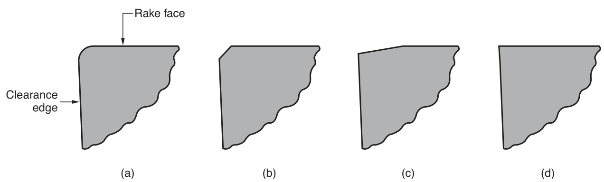  
FIGURE 22.11  Three types of edge preparation that are applied to the cutting edge of an insert: (a) radius,  (b) chamfer, (c) land, and (d) perfectly sharp edge (no edge preparation).  

# 22.3.2  MULTIPLE-CUTTING-EDGE TOOLS  

Most multiple-cutting-edge tools are used in machining operations in which the tool is  rotated. Primary examples are drilling and milling. On the other hand, broaching and  some sawing operations (hack sawing and band sawing) use multiple-cutting-edge  tools that operate with a linear motion. Other sawing operations (circular sawing) use  rotating saw blades.  

Drills  Various cutting tools are available for hole making, but the  twist drill  is by  far the most common. It comes in diameters ranging from about $0.15\;\mathrm{mm}$  (0.006 in)  to as large as $75\,\mathrm{mm}$  (3.0 in). Twist drills are widely used in industry to produce holes  rapidly and economically.  

The standard twist drill geometry is illustrated in Figure 22.12. The body of the drill  has two spiral  fl  utes  (the spiral gives the twist drill its name). The angle of the spiral  fl  utes is called the  helix angle , a typical value of which is around  $30^{\mathrm{o}}$ . While drilling,  the fl  utes act as passageways for extraction of chips from the hole. Although it is de- sirable for the fl  ute openings to be large to provide maximum clearance for the chips,  the body of the drill must be supported over its length. This support is provided by the  web , which is the thickness of the drill between the fl  utes.  

The point of the twist drill has a conical shape. A typical value for the  point angle   is  $118^{\circ}$ . The point can be designed in various ways, but the most common design is  a  chisel edge , as in Figure 22.12. Connected to the chisel edge are two cutting edges  (sometimes called lips) that lead into the fl  utes. The portion of each fl  ute adjacent to  the cutting edge acts as the rake face of the tool.  

The cutting action of the twist drill is complex. The rotation and feeding of the  drill bit result in relative motion between the cutting edges and the workpiece to  form the chips. The cutting speed along each cutting edge varies as a function of the  distance from the axis of rotation. Accordingly, the effi  ciency of the cutting action  varies, being most effi  cient at the outer diameter of the drill and least effi  cient at the  center. In fact, the relative velocity at the drill point is zero, so no cutting takes place.  Instead, the chisel edge of the drill point pushes aside the material at the center as  it penetrates into the hole; a large thrust force is required to drive the twist drill for- ward into the hole. Also, at the beginning of the operation, the rotating chisel edge  tends to wander on the surface of the work part, causing loss of positional accuracy.  Various alternative drill point designs have been developed to address this problem.  

Chip removal can be a problem in drilling. The cutting action takes place inside  the hole, and the fl  utes must provide suffi  cient clearance throughout the length of  

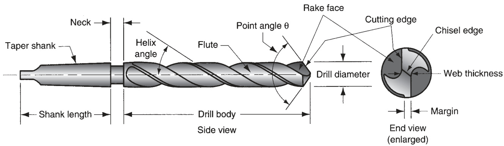  
FIGURE 22.12  Standard geometry of a twist drill.  

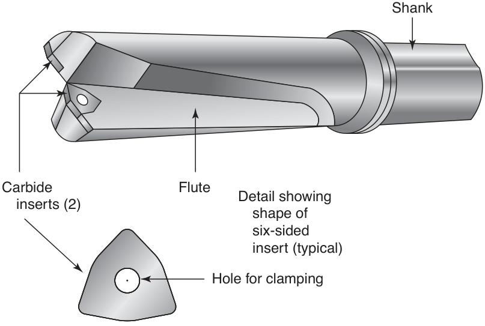  
FIGURE 22.13  Straight-fl  ute drill that  uses indexable inserts.  

the drill to allow the chips to be extracted from the hole. As the chip is formed it is  forced through the fl  utes to the work surface. Friction makes matters worse in two  ways. In addition to the usual friction in metal cutting between the chip and the rake  face of the cutting edge, friction also results from rubbing between the outside diam- eter of the drill bit and the newly formed hole. This increases the temperature of the  drill and work. Delivery of cutting fl  uid to the drill point to reduce the friction and  heat is diffi  cult because the chips are fl  owing in the opposite direction. Because of  chip removal and heat, a twist drill is normally limited to a hole depth of about four  times its diameter. Some twist drills are designed with internal holes running their  lengths, through which cutting fl  uid can be pumped to the hole near the drill point,  thus delivering the fl  uid directly to the cutting operation. An alternative approach  with twist drills that do not have fl  uid holes is to use a “pecking” procedure during  the drilling operation. In this procedure, the drill is periodically withdrawn from the  hole to clear the chips before proceeding deeper.  

Twist drills are normally made of high-speed steel. The geometry of the drill is  fabricated before heat treatment, and then the outer shell of the drill (cutting edges  and friction surfaces) is hardened while retaining an inner core that is relatively  tough. Grinding is used to sharpen the cutting edges and shape the drill point.  

Although twist drills are the most common hole-making tools, other drill types  are also available.  Straight-fl  ute drills  operate like twist drills except that the fl  utes  for chip removal are straight along the length of the tool rather than spiraled. The  simpler design of the straight-fl  ute drill permits carbide tips to be used as the cutting  edges, either as brazed or indexable inserts. Figure 22.13 illustrates the straight-fl  ute  indexable-insert drill. The cemented carbide inserts allow higher cutting speeds and  greater production rates than HSS twist drills. However, the inserts limit how small  the drills can be made. Thus, the diameter range of commercially available indexa- ble-insert drills runs from about $16\:\mathrm{mm}$  (0.625 in) to about $127\;\mathrm{mm}$  (5 in) [9].  

A straight-fl  ute drill designed for deep-hole drilling is the  gun drill , shown in  Figure 22.14. Whereas the twist drill is usually limited to a depth-to-diameter ratio  of 4:1, and the straight-fl  ute drill to about 3:1, the gun drill can cut holes up to 125  times its diameter. As shown in the fi  gure, the gun drill has a carbide cutting edge, a  single fl  ute for chip removal, and a coolant hole running its complete length. In the  typical gun drilling operation, the work rotates around the stationary drill (opposite  

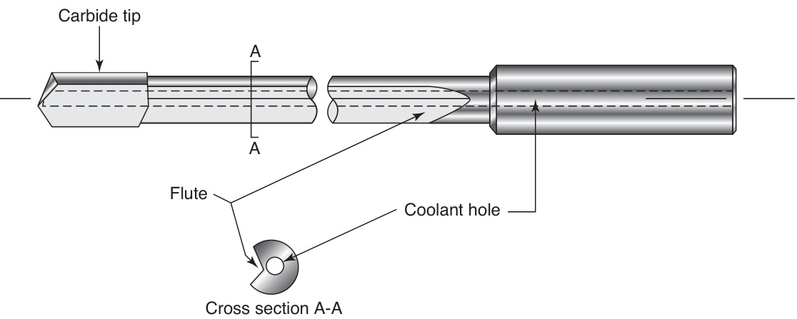  
FIGURE 22.14  Gun drill.  

of most drilling operations), and the coolant fl  ows into the cutting process and out of  the hole along the fl  ute, carrying the chips with it. Gun drills range in diameter from  less than $2\:\mathrm{mm}$  (0.075 in) to about  $50\,\mathrm{mm}$  (2 in).  

It was previously mentioned that twist drills are available with diameters up to  $75\,\mathrm{mm}$  (3 in). Twist drills that large are uncommon because so much metal is required  in the drill bit. An alternative for large diameter holes is the  spade drill , illustrated in  Figure 22.15. Standard sizes range from 25 to  $152\,\mathrm{mm}$  (1–6 in). The interchangeable  drill bit is held in a toolholder, which provides rigidity during cutting. The mass of the  spade drill is much less than a twist drill of the same diameter.  

More information on hole-making tools can be found in references [3] and [9].  

Milling Cutters  Classifi  cation of milling cutters is closely associated with the mill- ing operations described in Section 21.4.1. The major types of milling cutters are the  following:  

➢   Plain milling cutters . These are used for peripheral or slab milling. As Figures  21.17(a) and 21.18(a) indicate, they are cylinder shaped with several rows of  

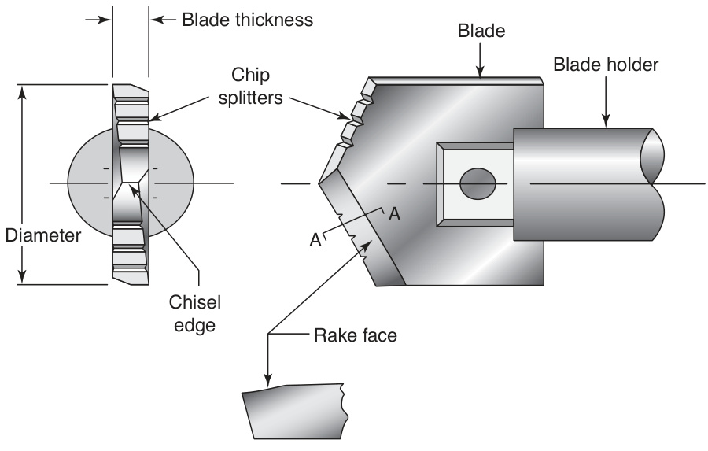  
Cross section A-A  

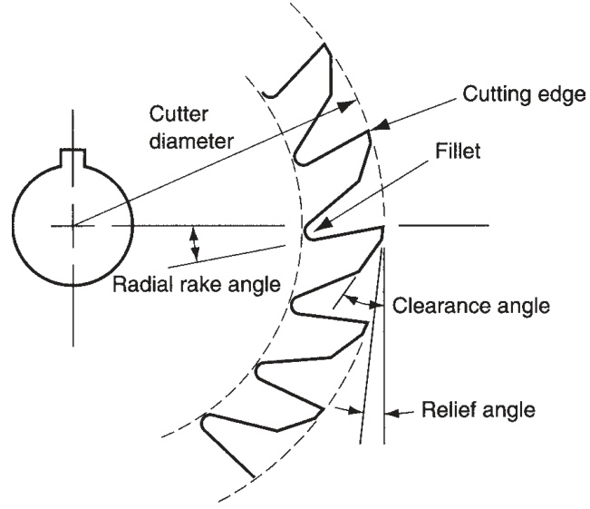  
FIGURE 22.16  Tool geometry  elements of an 18-tooth plain  milling cutter.  

teeth. The cutting edges are usually oriented at a helix angle (as in the fi  gures)  to reduce impact on entry into the work, and these cutters are called  helical  milling cutters . Tool geometry elements of a plain milling cutter are shown in  Figure 22.16.  

$\gg$ Form milling cutters . These are peripheral milling cutters in which the cutting  edges have a special profi  le that is to be imparted to the work, as in Figure  21.18(e). An important application is in gear making, in which the form milling  cutter is shaped to cut the slots between adjacent gear teeth, thereby leaving the  geometry of the gear teeth. ➢   Face milling cutters . These are designed with teeth that cut on both the periph- ery as well as the end of the cutter. Face milling cutters can be made of HSS,  as in Figure 21.17(b), or they can be designed to use cemented carbide inserts.  Figure 22.17 shows a four-tooth face-milling cutter that uses inserts.  

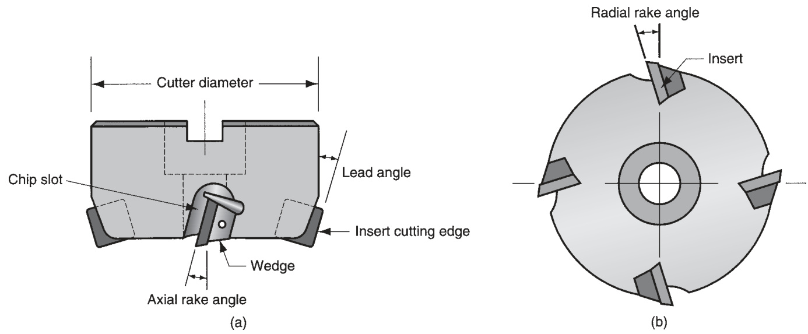  
FIGURE 22.17  Tool geometry elements of a four-tooth face milling cutter: (a) side view and (b) bottom view.  

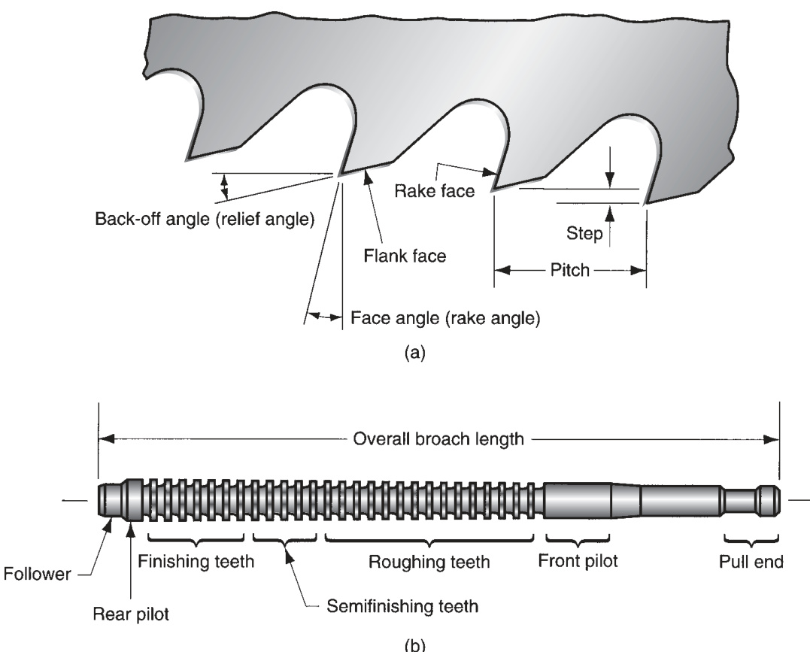  
FIGURE 22.18  The  broach: (a) terminology  of the tooth geometry,  and (b) a typical broach  used for internal  broaching.  

➢   End milling cutters . As shown in Figure 21.20(c), an end milling cutter looks  like a drill bit, but close inspection indicates that it is designed for primary cut- ting with its peripheral teeth rather than its end. (A drill bit cuts only on its end  as it penetrates into the work.) End mills are designed with square ends, ends  with radii, and ball ends. End mills can be used for face milling, profi  le milling  and pocketing, cutting slots, engraving, surface contouring, and die sinking.  

Broaches  The terminology and geometry of the broach are illustrated in  Figure 22.18. The broach consists of a series of distinct cutting teeth along its length.  Feed is accomplished by the increased step between successive teeth on the broach.  This feeding action is unique among machining operations, because most operations  accomplish feeding by a relative feed motion that is carried out by either the tool or  the work. The total material removed in a single pass of the broach is the cumulative  result of all the steps in the tool. The speed motion is accomplished by the linear  travel of the tool past the work surface. The shape of the cut surface is determined  by the contour of the cutting edges on the broach, particularly the fi  nal cutting edge.  Owing to its complex geometry and the low speeds used in broaching, most broaches  are made of HSS. In broaching of certain cast irons, the cutting edges are cemented  carbide inserts either brazed or mechanically held in place on the broaching tool.  

Saw Blades  For each of the three sawing operations (Section 21.5.3), the saw blades  possess certain common features, including tooth form, tooth spacing, and tooth set,  as seen in Figure 22.19.  Tooth form  is concerned with the geometry of each cutting  tooth. Rake angle, clearance angle, tooth spacing, and other features of geometry are  

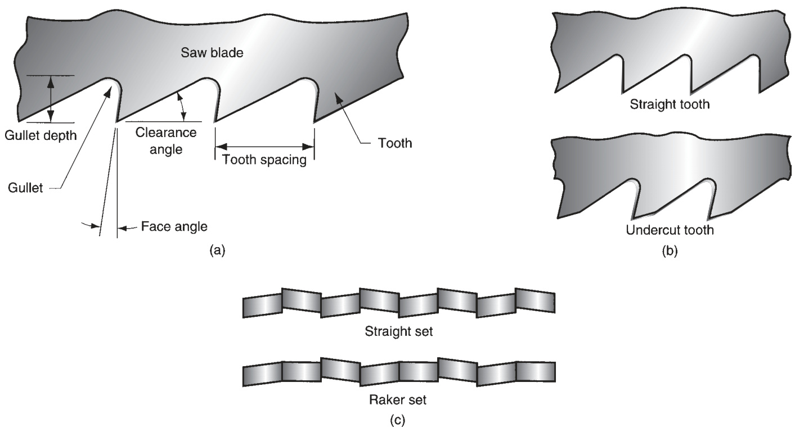  
FIGURE 22.19  Features of saw blades: (a) nomenclature for saw blade geometries, (b) two common tooth forms,  and (c) two types of tooth set.  

shown in Figure 22.19(a).  Tooth spacing  is the distance between adjacent teeth on the  saw blade. This parameter determines the size of the teeth and the size of the gullet  between teeth. The gullet allows space for the formation of the chip by the adjacent  cutting tooth. Different tooth forms are appropriate for different work materials and  cutting situations. Two forms commonly used in hacksaw and bandsaw blades are shown  in Figure 22.19(b). The  tooth set  permits the kerf cut by the saw blade to be wider than  the width of the blade itself; otherwise the blade would bind against the walls of the slit  made by the saw. Two common tooth sets are illustrated in Figure 22.19(c).  

A  cutting fl  uid  is any liquid or gas that is applied directly to the machining opera- tion to improve cutting performance. Cutting fl  uids address two main problems: (1)  heat generation at the shear zone and friction zone, and (2) friction at the tool–chip  and tool–work interfaces. In addition to removing heat and reducing friction, cutting  fl  uids provide additional benefi  ts, such as washing away chips (especially in grinding  and milling), reducing the temperature of the work part for easier handling, reduc- ing cutting forces and power requirements, improving dimensional stability of the  work part, and improving surface fi  nish.  

# 22.4.1 TYPES OF CUTTING FLUIDS  

A variety of cutting fl  uids are commercially available. It is appropriate to discuss them  fi  rst according to function and then to classify them according to chemical formulation.  

Cutting Fluid Functions  There are two general categories of cutting fl  uids, cor- responding to the two main problems they are designed to address: coolants and  lubricants.  Coolants  are cutting fl  uids designed to reduce the effects of heat in the  machining operation. They have a limited effect on the amount of heat energy gener- ated in cutting; instead, they carry away the heat that is generated, thereby reducing  the temperature of tool and workpiece. This helps to prolong the life of the cutting  tool. The capacity of a cutting fl  uid to reduce temperatures in machining depends on  its thermal properties. Specifi  c heat and thermal conductivity are the most impor- tant properties (Section 4.2.1). Water has high specifi  c heat and thermal conductivity  relative to other liquids, which is why water is used as the base in coolant-type cut- ting fl  uids. These properties allow the coolant to draw heat away from the operation,  thereby reducing the temperature of the cutting tool.  

Coolant-type cutting fl  uids seem to be most effective at relatively high cutting  speeds in which heat generation and high temperatures are problems. They are most  effective on tool materials that are most susceptible to temperature failures, such as  high-speed steels, and are used frequently in turning and milling operations in which  large amounts of heat are generated.  

Lubricants  are usually oil-based fl  uids (because oils possess good lubricating qual- ities) formulated to reduce friction at the tool–chip and tool–work interfaces. Lubri- cant cutting fl  uids operate by  extreme pressure lubrication , a special form of lubrica- tion that involves formation of thin solid salt layers on the hot, clean metal surfaces  through chemical reaction with the lubricant. Compounds of sulfur, chlorine, and  phosphorous in the lubricant cause the formation of these surface layers, which act to  separate the two metal surfaces (i.e., chip and tool). These extreme pressure fi  lms are  signifi  cantly more effective in reducing friction in metal cutting than conventional  lubrication, which is based on the presence of liquid fi  lms between the two surfaces.  

Lubricant-type cutting fl  uids are most effective at lower cutting speeds. They tend  to lose their effectiveness at high speeds, above about  $120~\mathrm{m/min}$   $(400~\mathrm{ft/min})$ ), be- cause the motion of the chip at these speeds prevents the cutting fl  uid from reaching  the tool–chip interface. In addition, high cutting temperatures at these speeds cause  the oils to vaporize before they can lubricate. Machining operations such as drilling  and tapping usually benefi  t from lubricants. In these operations, built-up edge for- mation is retarded, and torque on the tool is reduced.  

Although the principal purpose of a lubricant is to reduce friction, it also reduces  the temperature in the operation through several mechanisms. First, the specifi  c heat  and thermal conductivity of the lubricant help to remove heat from the operation,  thereby reducing temperatures. Second, because friction is reduced, the heat gener- ated from friction is also reduced. Third, a lower coeffi  cient of friction means a lower  friction angle. According to Merchant’s equation, Equation 21.16, a lower friction  angle causes the shear plane angle to increase, hence reducing the amount of heat  energy generated in the shear zone.  

There is typically an overlapping effect between the two types of cutting fl  uids.  Coolants are formulated with ingredients that help reduce friction. And lubricants  have thermal properties that, although not as good as those of water, act to remove  heat from the cutting operation. Cutting fl  uids (both coolants and lubricants) mani- fest their effect on the Taylor tool life equation through higher $C$  values. Increases of  $10\%$  to $40\%$  are typical. The slope $n$  is not signifi  cantly affected.  

Chemical Formulation of Cutting Fluids  There are four categories of cut- ting fl  uids according to chemical formulation: (1) cutting oils, (2) emulsifi  ed oils,  (3)   semichemical fl  uids, and (4) chemical fl  uids. All of these cutting fl  uids provide  both coolant and lubricating functions. The cutting oils are most effective as lubri- cants, whereas the other three categories are more effective as coolants because they  are primarily water.  

Cutting oils  are based on oil derived from petroleum, animal, marine, or veg- etable origin. Mineral oils (petroleum based) are the principal type because of  their abundance and generally desirable lubricating characteristics. To achieve  maximum lubricity, several types of oils are often combined in the same fl  uid.  Chemical additives are also mixed with the oils to increase lubricating qualities.  These additives contain compounds of sulfur, chlorine, and phosphorous, and are  designed to react chemically with the chip and tool surfaces to form solid fi  lms  (extreme pressure lubrication) that help to avoid metal-to-metal contact between  the two.  

Emulsifi  ed oils  consist of oil droplets suspended in water. The fl  uid is made by  blending oil (usually mineral oil) in water using an emulsifying agent to promote  blending and stability of the emulsion. A typical ratio of water to oil is 30:1. Chemi- cal additives based on sulfur, chlorine, and phosphorous are often used to promote  extreme pressure lubrication. Because they contain both oil and water, the emulsifi  ed  oils combine cooling and lubricating qualities in one cutting fl  uid.  

Chemical fl  uids  are chemicals in a water solution rather than oils in emulsion.  The dissolved chemicals include compounds of sulfur, chlorine, and phosphorous,  plus wetting agents. The chemicals are intended to provide some degree of lubrica- tion to the solution. Chemical fl  uids provide good coolant qualities but their lubri- cating qualities are less than the other cutting fl  uid types.  Semichemical fl  uids  have  small amounts of emulsifi  ed oil added to increase the lubricating characteristics  of the cutting fl  uid. In effect, they are a hybrid class between chemical fl  uids and  emulsifi  ed oils.  

Table 22.8 presents a troubleshooting guide for machining problems related to  the use of cutting fl  uids.  

TABLE  •  22.8  Troubleshooting Guide for Problems Related to Cutting Fluids. 
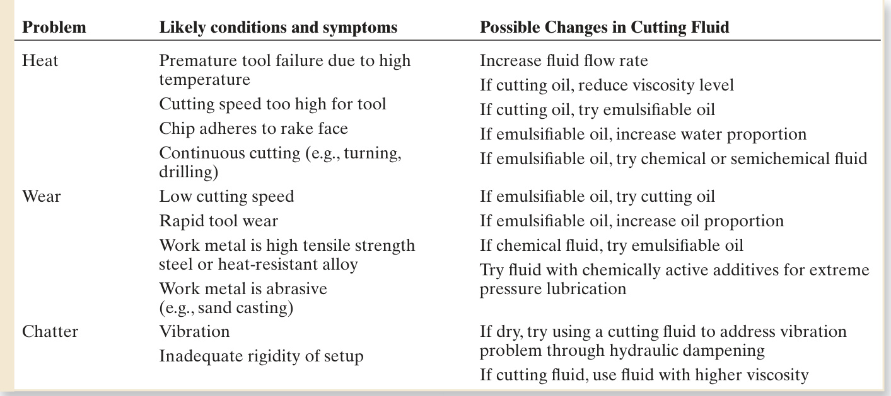  

# 22.4.2  APPLICATION OF CUTTING FLUIDS  

Cutting fl  uids are applied to machining operations in various ways, and this section  considers these application methods. Also considered is the problem of cutting-fl  uid  contamination and what steps can be taken to address this problem.  

Application Methods  The most common method is  fl  ooding , sometimes called  fl  ood-cooling because it is generally used with coolant-type cutting fl  uids. In fl  ood- ing, a steady stream of fl  uid is directed at the tool–work or tool–chip interface of  the machining operation. A second method of delivery is  mist application , prima- rily used for water-based cutting fl  uids. In this method the fl  uid is directed at the  operation in the form of a high-speed mist carried by a pressurized air stream. Mist  application is generally not as effective as fl  ooding in cooling the tool. However,  because of the high-velocity air stream, mist application may be more effective  in delivering the cutting fl  uid to areas that are diffi  cult to access by conventional  fl  ooding.  

Manual application  by means of a squirt can or paint brush is sometimes used  for applying lubricants in tapping and other operations in which cutting speeds are  low and friction is a problem. It is generally not preferred by most production ma- chine shops because of its variability in application.  

Cutting Fluid Filtration and Dry Machining  Cutting fl  uids become contaminat- ed over time with a variety of foreign substances, such as tramp oil (machine oil,  hydraulic fl  uid, etc.), garbage (cigarette butts, food, etc.), small chips, molds, fungi,  and bacteria. In addition to causing odors and health hazards, contaminated cutting  fl  uids do not perform their lubricating function as well. Alternative ways of deal- ing with this problem are to (1) replace the cutting fl  uid at regular and frequent  intervals (perhaps twice per month); (2) use a fi  ltration system to continuously or  periodically clean the fl  uid; or (3) dry machining, that is, machining without cutting  fl  uids. Because of growing concern about environmental pollution and associated  legislation, disposing old fl  uids has become both costly and contrary to the general  public welfare.  

Filtration systems are being installed in numerous machine shops today to solve  the contamination problem. Advantages of these systems include (1) prolonged  cutting fl  uid life between changes—instead of replacing the fl  uid once or twice per  month, coolant lives of 1 year have been reported; (2) reduced fl  uid disposal cost,  since disposal is much less frequent when a fi  lter is used; (3) cleaner cutting fl  uid for  better working environment and reduced health hazards; (4) lower machine tool  maintenance; and (5) longer tool life. There are various types of fi  ltration systems for  fi  ltering cutting fl  uids. For the interested reader, fi  ltration systems and the benefi  ts of  using them are discussed in reference [19].  

The third alternative is called  dry machining , meaning that no cutting fl  uid is  used. Dry machining avoids the problems of cutting fl  uid contamination, disposal,  and fi  ltration, but can lead to problems of its own: (1) overheating the tool, (2)  operating at lower cutting speeds and production rates to prolong tool life, and  (3) absence of chip removal benefi  ts in grinding and milling. Cutting-tool produc- ers have developed certain grades of carbides and coated carbides for use in dry  machining.  