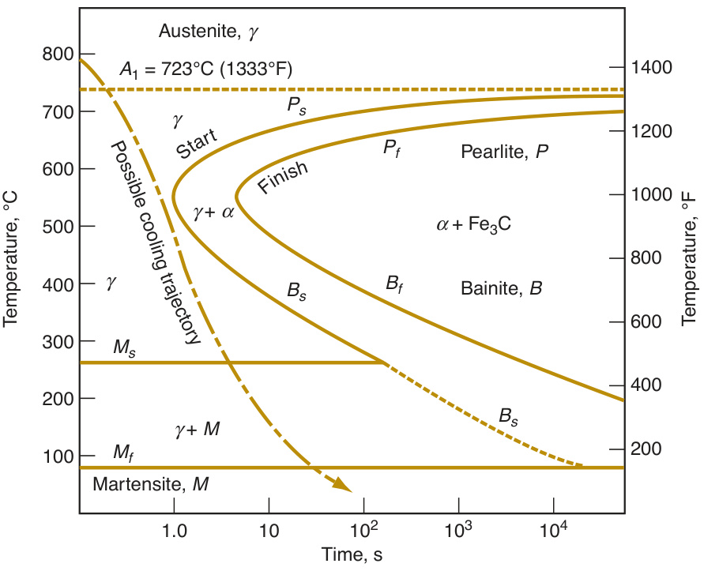
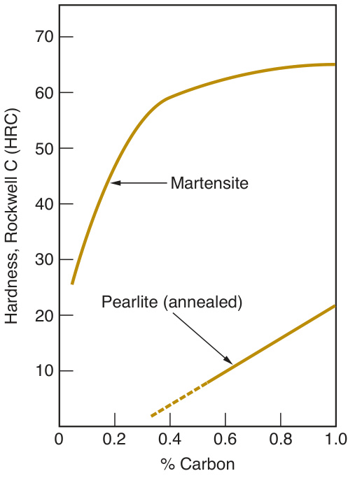
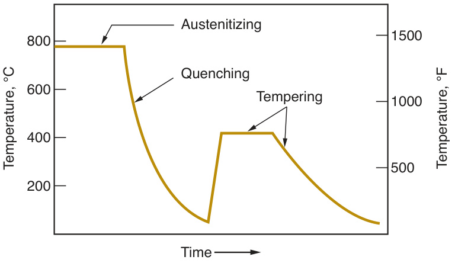
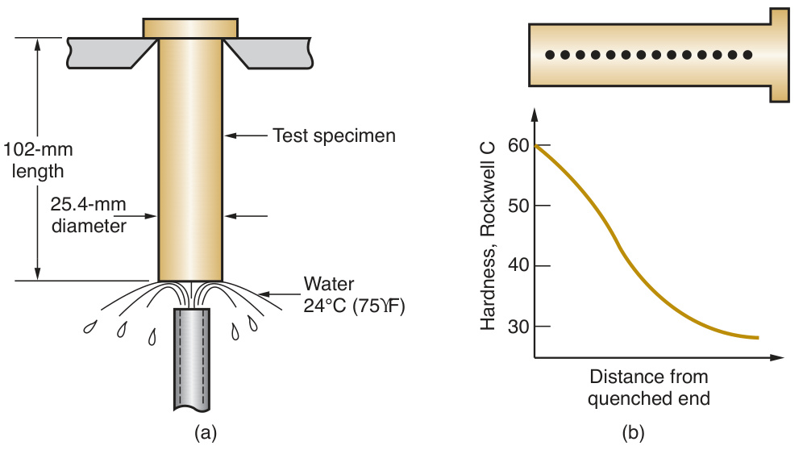
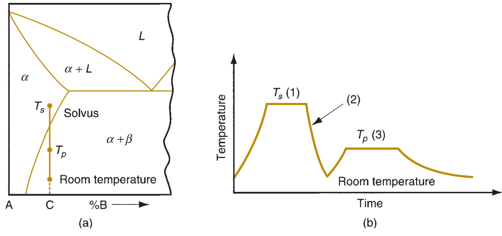
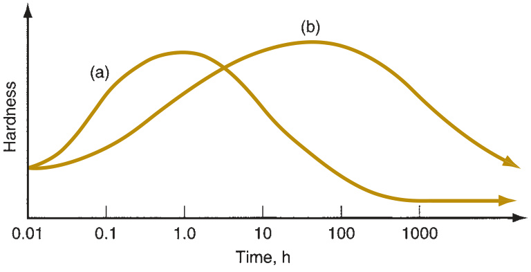
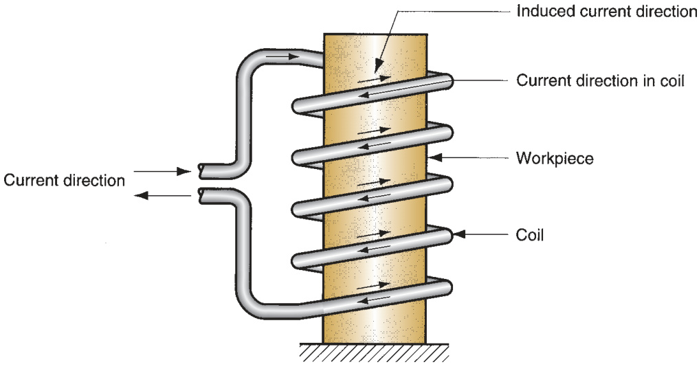
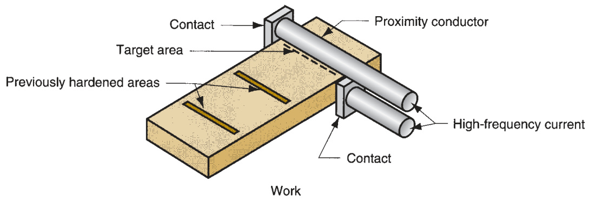

# Part VII   Property Enhancing  and Surface  Processing  Operations  

  

# Heat Treatment  of Metals  

The manufacturing processes covered in the preceding  chapters involve the creation of part geometry. This part  of the book considers processes that either enhance the  properties of a work part (Chapter 26) or apply some sur- face treatment to it, such as cleaning or coating (Chap- ter 27). Property-enhancing operations are performed to  improve mechanical or physical properties of the work  material. They do not alter part geometry, at least not  intentionally. The most important property-enhancing  operations are heat treatments.  Heat treatment  involves  various heating and cooling procedures performed to  effect microstructural changes in a material, which in turn  affect its mechanical properties. Its most common appli- cations are on metals, discussed in this chapter. Similar  treatments are performed on glass-ceramics (Sec  tion  7.4.3), tempered glass (Section 12.3.1), and powder met- als and ceramics (Sections 15.3.3 and 16.2.3).  

# Chapter Contents  

# 26.1 Annealing  

26.2 Martensite Formation in Steel  

26.2.1 The Time-Temperature- Transformation Curve 26.2.2 The Heat Treatment Process 26.2.3 Hardenability  

26.3 Precipitation Hardening  

26.4 Surface Hardening  

26.5 Heat Treatment Methods and Facilities 26.5.1 Furnaces for Heat Treatment 26.5.2 Selective Surface-Hardening  Methods  

Heat treatment operations can be performed on a  metallic work part at various times during its manufac- turing sequence. In some cases, the treatment is applied  before shaping (e.g., to soften the metal so that it can  be more easily formed while hot). In other cases, heat  treatment is used to relieve the effects of strain harden- ing that occur during forming, so that the material can  be subjected to further deformation. Heat treatment can also be accomplished at or  near the end of the sequence to achieve the fi  nal strength and hardness required in  the fi  nished product. The principal heat treatments are annealing, martensite forma- tion in steel, precipitation hardening, and surface hardening.  

Annealing consists of heating the metal to a suitable temperature, holding at that tem- perature for a certain time (called  soaking ), and slowly cooling. It is performed on a  metal for any of the following reasons: (1) to reduce hardness and brittleness, (2) to  alter microstructure so that desirable mechanical properties can be obtained, (3) to sof- ten metals for improved machinability or formability, (4) to recrystallize cold-worked  (strain-hardened) metals, and (5) to relieve residual stresses induced by prior processes.  Different terms are used in annealing, depending on the details of the process and the  temperature used relative to the recrystallization temperature of the metal being treated.  

Full annealing  is associated with ferrous metals (usually low and medium carbon  steels); it involves heating the alloy into the austenite region, followed by slow cool- ing in the furnace to produce coarse pearlite.  Normalizing  involves similar heating  and soaking cycles, but the cooling rates are faster. The steel is allowed to cool in air  to room temperature. This results in fi  ne pearlite, higher strength and hardness, but  lower ductility than the full anneal treatment.  

Cold-worked parts are often annealed to reduce effects of strain hardening and  increase ductility. The treatment allows the strain-hardened metal to recrystallize  partially or completely, depending on temperatures, soaking periods, and cooling  rates. When annealing is performed to allow for further cold working of the part, it  is called a  process anneal . When performed on the completed (cold-worked) part to  remove the effects of strain hardening and where no subsequent deformation will  be accomplished, it is simply called an  anneal . The process itself is pretty much the  same, but different terms are used to indicate the purpose of the treatment.  

If annealing conditions permit full recovery of the cold-worked metal to its origi- nal grain structure, then  recrystallization  has occurred. After this type of anneal, the  metal has the new geometry created by the forming operation, but its grain structure  and associated properties are essentially the same as before cold working. The con- ditions that tend to favor recrystallization are higher temperature, longer holding  time, and slower cooling rate. If the annealing process only permits partial return of  the grain structure toward its original state, it is termed a  recovery anneal . Recovery  allows the metal to retain most of the strain hardening obtained in cold working, but  the toughness of the part is improved.  

The preceding annealing operations are performed primarily to accomplish func- tions other than stress relief. However, annealing is sometimes performed solely to re- lieve residual stresses in the workpiece. Called  stress-relief annealing , it helps to reduce  distortion and dimensional variations that might otherwise occur in the stressed parts.  

#  Martensite Formation in Steel  

The iron–carbon phase diagram in Figure 6.4 indicates the phases of iron and iron  carbide (cementite) present under equilibrium conditions. It assumes that cooling  from high temperature is slow enough to permit austenite to decompose into a  mixture of ferrite and cementite  $(\mathrm{Fe}_{3}\mathrm{C})$  at room temperature. This decomposition  reaction requires diffusion and other processes that depend on time and tempera- ture to transform the metal into its preferred fi  nal form. However, under conditions  of rapid cooling, so that the equilibrium reaction is inhibited, austenite transforms  into a nonequilibrium phase called martensite.  Martensite  is a hard, brittle phase  that gives steel its unique ability to be strengthened to very high levels.  

# 26.2.1  THE TIME-TEMPERATURE-TRANSFORMATION CURVE  

The nature of the martensite transformation can best be understood using the time- temperature-transformation curve (TTT curve) for eutectoid steel, illustrated in  Figure 26.1. The TTT curve shows how cooling rate affects the transformation of  austenite into various possible phases. The phases can be divided between (1) alter- native forms of ferrite and cementite and (2) martensite. Time is displayed (loga- rithmically for convenience) along the horizontal axis, and temperature is scaled  on the vertical axis. The curve is interpreted by starting at time zero in the austen- ite region (somewhere above the $A_{1}$  temperature line for the given composition)  and proceeding downward and to the right along a trajectory representing how the  metal is cooled as a function of time. The TTT curve shown in the fi  gure is for a  specifi  c composition of steel ( $0.80\%$  carbon). The shape of the curve is different for  other compositions.  

At slow cooling rates, the trajectory proceeds through the region indicating trans- formation into pearlite or bainite, which are alternative forms of ferrite–carbide  mixtures. Because these transformations take time, the TTT diagram shows two  lines—the start and fi  nish of the transformation as time passes, indicated for the dif- ferent phase regions by the subscripts  $s$  and $f_{;}$ , respectively.  Pearlite  is a mixture of  ferrite and carbide phases in the form of thin parallel plates. It is obtained by slow  cooling from austenite, so that the cooling trajectory passes through  $P_{s}$  above the  “nose” of the TTT curve.  Bainite  is an alternative mixture of the same phases that  

  
FIGURE 26.1  The  TTT curve, showing  the transformation of  austenite into other  phases as a function of  time and temperature  for a composition of  about $0.8\dot{0}\%$  C steel. The  cooling trajectory shown  here yields martensite.  

  
FIGURE 26.2  Hardness of plain  carbon steel as a function of carbon  content in (hardened) martensite and  pearlite (annealed).  

can be produced by initial rapid cooling to a temperature somewhat above  $M_{s}$ , so  that the nose of the TTT curve is avoided; this is followed by much slower cooling  to pass through  $B_{s}$  and into the ferrite–carbide region. Bainite has a needle-like or  feather-like structure consisting of fi  ne carbide regions.  

If cooling occurs at a suffi  ciently rapid rate (indicated by the dashed line in  Figure 26.1), austenite is transformed into martensite.  Martensite  is a unique  phase consisting of an iron–carbon solution whose composition is the same as  the austenite from which it was derived. The face-centered cubic structure of  austenite is transformed into the body-centered tetragonal (BCT) structure of  martensite almost instantly—without the time-dependent diffusion process need- ed to separate ferrite and iron carbide in the preceding transformations.  

During cooling, the martensite transformation begins at a certain temperature  $M_{s}$ , and fi  nishes at a lower temperature $M_{f},$  as shown in the TTT diagram. At points  between these two levels, the steel is a mixture of austenite and martensite. If cooling  is stopped at a temperature between the $M_{s}$  and $M_{f}$ lines, the austenite will transform  to bainite as the time-temperature trajectory crosses the  $B_{s}$  threshold. The level of  the $M_{s}$  line is infl  uenced by alloying elements, including carbon. In some cases, the  $M_{s}$  line is depressed below room temperature, making it impossible for these steels  to form martensite by traditional heat-treating methods.  

The extreme hardness of martensite results from the lattice strain created by car- bon atoms trapped in the BCT structure, thus providing a barrier to slip. Figure 26.2  shows the signifi  cant effect that the martensite transformation has on the hardness  of steel for increasing carbon contents.  

# 26.2.2  THE HEAT TREATMENT PROCESS  

The heat treatment to form martensite consists of two steps: austenitizing and  quenching. These steps are often followed by tempering to produce tempered mar- tensite.  Austenitizing  involves heating the steel to a suffi  ciently high temperature  that it is converted entirely or partially to austenite. This temperature can be deter- mined from the phase diagram for the particular alloy composition. The transfor- mation to austenite involves a phase change, which requires time as well as heat.  Accordingly, the steel must be held at the elevated temperature for a suffi  cient  period of time to allow the new phase to form and the required homogeneity of  composition to be achieved.  

The  quenching  step involves cooling the austenite rapidly enough to avoid pass- ing through the nose of the TTT curve, as indicated in the cooling trajectory shown  in Figure 26.1. The cooling rate depends on the quenching medium and the rate  of heat transfer within the steel workpiece. Various quenching media are used in  commercial heat treatment practice: (1) brine—salt water, usually agitated; (2) fresh  water—still, not agitated; (3) still oil; and (4) air. Quenching in agitated brine pro- vides the fastest cooling of the heated part surface, whereas air quench is the slowest.  Trouble is, the more effective the quenching media is at cooling, the more likely it is  to cause internal stresses, distortion, and cracks in the product.  

The rate of heat transfer within the part depends largely on its mass and geom- etry. A large cubic shape will cool much more slowly than a small, thin sheet. The  coeffi  cient of thermal conductivity $k$  of the particular composition is also a factor  in the fl  ow of heat in the metal. There is considerable variation in  $k$  for different  grades of steel; for example, plain low carbon steel has a typical  $k$  value equal  to 0.046 J/sec-mm-C (2.2 Btu/hr-in-F), whereas a highly alloyed steel might have  one-third that value.  

Martensite is hard and brittle.  Tempering  is a heat treatment applied to hard- ened steels to reduce brittleness, increase ductility and toughness, and relieve  stresses in the martensite structure. It involves heating and soaking at a tempera- ture below the austenitizing level for about one hour, followed by slow cooling.  This results in precipitation of very fi  ne carbide particles from the martensitic  iron–carbon solution, and gradually transforms the crystal structure from BCT  to BCC. This new structure is called  tempered martensite . A slight reduction in  strength and hardness accompanies the improvement in ductility and toughness.  The temperature and time of the tempering treatment control the degree of sof- tening in the hardened steel, because the change from untempered to tempered  martensite involves diffusion.  

Taken together, the three steps in the heat treatment of steel to form tempered  martensite can be pictured as in Figure 26.3. There are two heating and cooling  cycles, the fi  rst to produce martensite and the second to temper the martensite.  

  
FIGURE 26.3  Typical  heat treatment of steel:  austenitizing, quenching,  and tempering.  

  
FIGURE 26.4  The  Jominy end-quench  test: (a) setup of the test,  showing end quench of  the test specimen; and  (b) typical pattern of  hardness readings as  a function of distance  from quenched end.  

# 26.2.3  HARDENABILITY  

Hardenability refers to the relative capacity of a steel to be hardened by transforma- tion to martensite. It is a property that determines the depth below the quenched  surface to which the steel is hardened, or the severity of the quench required to  achieve a certain hardness penetration. Steels with good hardenability can be hard- ened more deeply below the surface and do not require high cooling rates. Harden- ability does not refer to the maximum hardness that can be attained in the steel; that  depends on the carbon content.  

The hardenability of a steel is increased through alloying. Alloying elements  having the greatest effect are chromium, manganese, molybdenum (and nickel, to  a lesser extent). The mechanism by which these alloying ingredients operate is to  extend the time before the start of the austenite-to-pearlite transformation in the  TTT diagram. In effect, the TTT curve is moved to the right, thus permitting slower  quenching rates during quenching. Therefore, the cooling trajectory is able to follow  a less hastened path to the $M_{s}$  line, more easily avoiding the nose of the TTT curve.  

The most common method for measuring hardenability is the  Jominy end-quench  test . The test involves heating a standard specimen of diameter  $=25.4\;\mathrm{mm}$  (1.0 in)  and length $=102\;\mathrm{mm}$  (4.0 in) into the austenite range, and then quenching one end  with a stream of cold water while the specimen is supported vertically as shown  in Figure 26.4(a). The cooling rate in the test specimen decreases with increased  distance from the quenched end. Hardenability is indicated by the hardness of the  specimen as a function of distance from quenched end, as in Figure 26.4(b).  

#  Precipitation Hardening  

Precipitation hardening involves the formation of fi  ne particles (precipitates) that act  to block the movement of dislocations and thus strengthen and harden the metal. It  is the principal heat treatment for strengthening alloys of aluminum, copper, magne- sium, nickel, and other nonferrous metals. Precipitation hardening can also be used to  strengthen certain steel alloys. When applied to steels, the process is called  maraging

 (an abbreviation of martensite and aging), and the steels are called maraging steels 

 (Section 6.2.3).  

# FIGURE 26.5  

Precipitation hardening:  (a) phase diagram of an  alloy system consisting  of metals A and B that  can be precipitation  hardened; and (b) heat  treatment: (1) solution  treatment, (2) quench- ing, and (3) precipita- tion treatment.  

  

The necessary condition that determines whether an alloy system can be strength- ened by precipitation hardening is the presence of a sloping solvus line, as shown in  the phase diagram of Figure 26.5(a). A composition that can be precipitation hard- ened is one that contains two phases at room temperature, but which can be heated to  a temperature that dissolves the second phase. Composition C satisfi  es this require- ment. The heat treatment process consists of three steps, illustrated in Figure 26.5(b):  (1)  solution treatment , in which the alloy is heated to a temperature  $T_{s}$  above the  solvus line into the alpha phase region and held for a period suffi  cient to dissolve the  beta phase; (2)  quenching  to room temperature to create a supersaturated solid solu- tion; and (3)  precipitation treatment , in which the alloy is heated to a temperature  $T_{p}$ , below  $T_{s}$ , to cause precipitation of fi  ne particles of the beta phase. This third step  is called  aging , and for this reason the whole heat treatment is sometimes called  age  hardening . However, aging can occur in some alloys at room temperature, and so the  term  precipitation hardening  seems more precise for the three-step heat treatment  process under discussion here. When the aging step is performed at room tempera- ture, it is called  natural aging . When it is accomplished at an elevated temperature,  as in the fi  gure, the term  artifi  cial aging  is often used.  

It is during the aging step that high strength and hardness are achieved in the  alloy. The combination of temperature and time during the precipitation treat- ment (aging) is critical in bringing out the desired properties in the alloy. At higher  precipitation treatment temperatures, as in Figure 26.6(a), the hardness peaks in  a relatively short time; whereas at lower temperatures, as in (b), more time is re- quired to harden the alloy but its maximum hardness is likely to be greater than  

  
FIGURE 26.6  Effect of  temperature and time  during precipitation  treatment (aging):  (a) high precipitation  temperature; and  (b) lower precipitation  temperature.  

in the fi  rst case. As seen in the plot, continuation of the aging process results in a  reduction in hardness and strength properties, called  overaging . Its overall effect  is similar to annealing.  

#  Surface Hardening  

Surface hardening refers to any of several thermochemical treatments applied to  steels in which the composition of the part surface is altered by addition of carbon,  nitrogen, or other elements. The most common treatments are carburizing, nitriding,  and carbonitriding. These processes are commonly applied to low carbon steel parts  to achieve a hard, wear-resistant outer shell while retaining a tough inner core. The  term  case hardening  is often used for these treatments.  

Carburizing  is the most common surface-hardening treatment. It involves heat- ing a part of low carbon steel in the presence of a carbon-rich environment so that C  is diffused into the surface. In effect the surface is converted to a high carbon steel,  capable of higher hardness than the low-C core. The carbon-rich environment can be  created in several ways. One method involves the use of carbonaceous materials such  as charcoal or coke packed in a closed container with the parts. This process, called  pack carburizing , produces a relatively thick layer on the part surface, ranging from  around 0.6 to $4\;\mathrm{mm}$  (0.025–0.150 in). Another method, called  gas carburizing , uses  hydrocarbon fuels such as propane  $\left(\mathrm{C}_{3}\mathrm{H}_{8}\right)$  inside a sealed furnace to diffuse carbon  into the parts. The case thickness in this treatment is thin, 0.13 to $0.75\;\mathrm{mm}$  (0.005 to  0.030 in). Another process is  liquid carburizing , which employs a molten salt bath  containing sodium cyanide (NaCN), barium chloride  $\left(\mathrm{{BaCl}}_{2}\right)$ , and other compounds  to diffuse carbon into the steel. This process produces surface layer thicknesses gen- erally between those of the other two treatments. Typical carburizing temperatures  are $875^{\circ}$  to $925^{\circ}\mathrm{C}$  ( $(1600^{\circ}{-}1700^{\circ}\mathrm{F})$ ), well into the austenite range.  

Carburizing followed by quenching produces a case hardness of around $\mathrm{HRC}=60$ .  However, because the internal regions of the part consist of low carbon steel, and its  hardenability is low, it is unaffected by the quench and remains relatively tough and  ductile to withstand impact and fatigue stresses.  

$\checkmark$ Nitriding  is a treatment in which nitrogen is diffused into the surfaces of special  alloy steels to produce a thin hard casing without quenching. To be most effective,  the steel must contain certain alloying ingredients such as aluminum  $(0.85–1.5\%)$  or  chromium ( $(5\%$  or more). These elements form nitride compounds that precipitate  as very fi  ne particles in the casing to harden the steel. Nitriding methods include:  gas nitriding , in which the steel parts are heated in an atmosphere of ammonia  $\left(\mathrm{NH}_{3}\right)$  or other nitrogen-rich gas mixture; and  liquid nitriding , in which the parts  are dipped in molten cyanide salt baths. Both processes are carried out at around  $500^{\circ}\mathrm{C}$   $(950^{\circ}\mathrm{F})$ . Case thicknesses range as low as  $0.025~\mathrm{mm}$  (0.001 in) and up to  around $0.5\;\mathrm{mm}$  (0.020 in), with hardnesses up to HRC 70.  

As its name suggests,  carbonitriding  is a treatment in which both carbon and  nitrogen are absorbed into the steel surface, usually by heating in a furnace contain- ing carbon and ammonia. Case thickness is usually 0.07 to  $\overline{{0.5}}\,\mathrm{mm}$  (0.003–0.020 in),  with hardness comparable with those of the other two treatments. Two additional surface-hardening treatments diffuse chromium and boron, re-  

spectively, into the steel to produce casings that are typically only 0.025 to  $\overline{{0.05\ \mathrm{mm}}}$ (0.001–0.002 in) thick.  Chromizing  requires higher temperatures and longer treatment  times than the preceding surface-hardening treatments, but the resulting casing is not  only hard and wear resistant, it is also heat and corrosion resistant. The process is usu- ally applied to low carbon steels. Techniques for diffusing chromium into the surface  include: packing the steel parts in chromium-rich powders or granules, dipping in a mol- ten salt bath containing Cr and Cr salts, and chemical vapor deposition (Section 27.5.2).  

Boronizing  is performed on tool steels, nickel- and cobalt-based alloys, and cast  irons, in addition to plain carbon steels, using powders, salts, or gas atmospheres  containing boron. The process results in a thin casing with high abrasion resistance  and low coeffi  cient of friction. Casing hardnesses reach 70 HRC. When boronizing is  used on low carbon and low alloy steels, corrosion resistance is also improved.  

#  Heat Treatment Methods and Facilities  

Most heat treatment operations are performed in furnaces. In addition, other tech- niques can be used to selectively heat only the work surface or a portion of the  work surface. It should be mentioned that some of the equipment described in this  section is utilized for other processes in addition to heat treatment; these include  melting metals for casting (Section 11.4.1); heating before warm and hot working  (Section 17.3); brazing, soldering, and adhesive curing (Chapter 30); and semicon- ductor processing (Chapter 33).  

# 26.5.1  FURNACES FOR HEAT TREATMENT  

Furnaces vary greatly in heating technology, size and capacity, construction, and at- mosphere control. They usually heat the work parts by a combination of radiation,  convection, and conduction. Heating technologies divide between fuel-fi  red and elec- tric heating.  Fuel-fi  red furnaces  are normally  direct-fi  red , which means that the work  is exposed directly to the combustion products. Fuels include gases (such as natural  gas or propane) and oils that can be atomized (such as diesel fuel and fuel oil). The  chemistry of the combustion products can be controlled by adjusting the fuel-air or  fuel-oxygen mixture to minimize scaling (oxide formation) on the work surface.  Elec- tric furnaces  use electric resistance for heating; they are cleaner, quieter, and provide  more uniform heating, but they are more expensive to purchase and operate.  

A conventional furnace is an enclosure designed to resist heat loss and accom- modate the size of the work to be processed. Furnaces are classifi  ed as batch or  continuous.  Batch furnaces  are simpler, basically consisting of a heating system in  an insulated chamber, with a door for loading and unloading the work.  Continuous  furnaces  are generally used for higher production rates and provide a means of  moving the work through the interior of the heating chamber.  

Special atmospheres are required in certain heat treatment operations, such as  some of the surface hardening treatments. These atmospheres include carbon- and  nitrogen-rich environments for diffusion of these elements into the surface of the  work. Atmosphere control is also desirable in conventional heat treatment operations  to avoid excessive oxidation or decarburization.  

Other furnace types include salt bath and fl  uidized bed.  Salt bath furnaces  consist  of vessels containing molten salts of chlorides and/or nitrates. Parts to be treated are  immersed in the molten media.  Fluidized bed furnaces  have a container in which  small inert particles are suspended by a high-velocity stream of hot gas. Under proper  conditions, the aggregate behavior of the particles is fl  uid-like; thus, rapid heating of  parts immersed in the particle bed occurs.  

# 26.5.2  SELECTIVE SURFACE-HARDENING METHODS  

These methods heat only the surface of the work, or local areas of the work sur- face. They differ from surface-hardening methods (Section 26.4) in that no chemical  changes occur. Here the treatments are only thermal. The selective surface harden- ing methods include fl  ame hardening, induction hardening, high-frequency resistance  heating, electron beam heating, and laser beam heating.  

Flame hardening  involves heating the work surface by means of one or more  torches followed by rapid quenching. As a hardening process, it is applied to carbon  and alloy steels, tool steels, and cast irons. Fuels include acetylene  $\left(\mathrm{C}_{2}\mathrm{H}_{2}\right)$ , propane  $\left(\mathrm{C}_{3}\mathrm{H}_{8}\right)$ , and other gases. The name fl  ame hardening invokes images of a highly man- ual operation with general lack of control over the results; however, the process can  be set up to include temperature control, fi  xtures for positioning the work relative to  the fl  ame, and indexing devices that operate on a precise cycle time, all of which pro- vide close control over the resulting heat treatment. It is fast and versatile, lending  itself to high production as well as big components such as large gears that exceed  the capacity of furnaces.  

Induction heating  involves application of electromagnetic ally induced energy  supplied by an induction coil to an electrically conductive work part. Induction  heating is widely used in industry for processes such as brazing, soldering, adhesive  curing, and various heat treatments. When used for hardening steel, quenching fol- lows heating. A typical setup is illustrated in Figure 26.7. The induction heating coil  carries a high-frequency alternating current that induces a current in the encircled  work part to effect heating. The surface, a portion of the surface, or the entire mass  of the part can be heated by the process. Induction heating provides a fast and effi  - cient method of heating any electrically conductive material. Heating cycle times are  short, so the process lends itself to high production as well as midrange production.  

High-frequency (HF) resistance heating  is used to harden specifi  c areas of steel  work surfaces by application of localized resistance heating at high frequency  ( $(400\;\mathrm{kHz}$  typical). A typical setup is shown in Figure 26.8. The apparatus consists  of a water-cooled proximity conductor located over the area to be heated. Con- tacts are attached to the work part at the outer edges of the area. When the HF  current is applied, the region beneath the proximity conductor is heated rapidly  to high temperature—heating to the austenite range typically requires less than  

  
FIGURE 26.7  Typical  induction heating  setup. High-frequency  alternating current in a  coil induces current in  the work part to effect  heating.  

  
FIGURE 26.8  Typical  setup for high-frequency  resistance heating.  

a second. When the power is turned off, the area, usually a narrow line as in the  fi  gure, is quenched by heat transfer to the surrounding metal. Depth of the treated  area is around  $0.63\ \mathrm{mm}$  (0.025 in.); hardness depends on carbon content of the  steel and can range up to  $60\,\mathrm{HRC}$  [11].  

Electron beam  $(E B)$  heating  involves localized surface hardening of steel in  which the electron beam is focused onto a small area, resulting in rapid heat buildup.  Austenitizing temperatures can often be achieved in less than a second. When the  directed beam is removed, the heated area is immediately quenched and hardened  by heat transfer to the surrounding cold metal. A disadvantage of EB heating is  that best results are achieved when the process is performed in a vacuum. A special  vacuum chamber is needed, and time is required to draw the vacuum, thus slowing  production rates.  

Laser beam  $(L B)$  heating  uses a high-intensity beam of coherent light focused on a  small area. The beam is usually moved along a defi  ned path on the work surface, caus- ing heating of the steel into the austenite region. When the beam is moved, the area  is immediately quenched by heat conduction to the surrounding metal.  Laser  is an  acronym for  l ight  a mplifi  cation by  s timulated  e mission of  r adiation. The advantage of  LB over EB heating is that laser beams do not require a vacuum to achieve best results.  Energy density levels in EB and LB heating are lower than in cutting or welding.  

# References  

[1]  ASM Handbook . Vol. 4,  Heat Treating . ASM  International, Materials Park, Ohio, 1991.

  [2] Babu, S. S., and Totten, G. E.  Steel Heat Treat- ment Handbook , 2nd ed. CRC Taylor & Francis,  Boca Raton, Florida, 2006.

  [3] Brick, R. M., Pense, A. W., and Gordon, R. B.  Structure and Properties of Engineering Ma- terials , 4th ed. McGraw-Hill, New York, 1977.

  [4] Chandler, H. (ed.).  Heat Treater’s Guide:  Practices and Procedures for Irons and Steels .  ASM International, Materials Park, Ohio,  1995.

  [5] Chandler, H. (ed.).  Heat Treater’s Guide:  Practices and Procedures for Nonferrous  Alloys . ASM International, Materials Park,  Ohio, 1996.  

[6] Dossett, J. L., and Boyer, H. E.  Practical Heat  Treating , 2nd ed. ASM International, Materials  Park, Ohio, 2006.

  [7] Flinn, R. A., and Trojan, P. K.  Engineering Ma- terials and Their Applications , 5th ed. John  Wiley & Sons, New York, 1995.

  [8] Guy, A. G., and Hren, J. J.  Elements of Physical  Metallurgy , 3rd ed. Addison-Wesley, Reading,  Massachusetts, 1974.

  [9] Ostwald, P . F., and Munoz, J.  Manufacturing  Processes and Systems , 9th ed. John Wiley &  Sons, New York, 1997.  