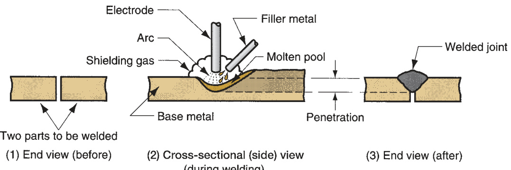
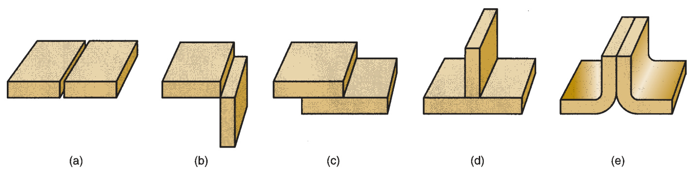
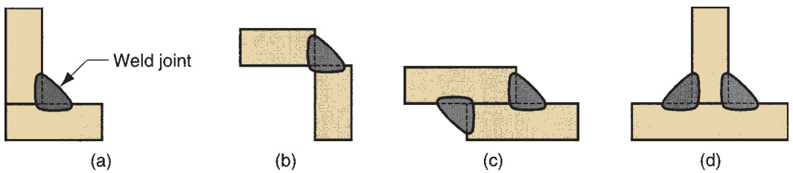
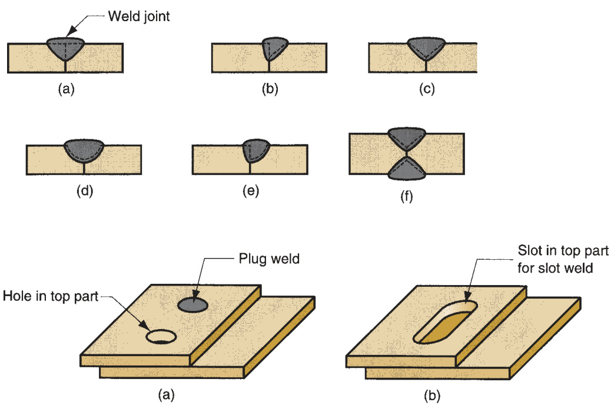
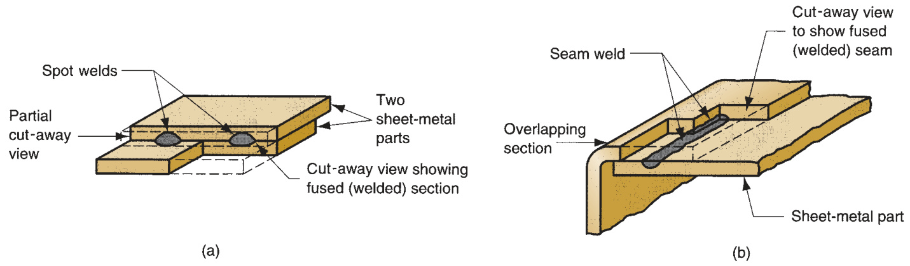
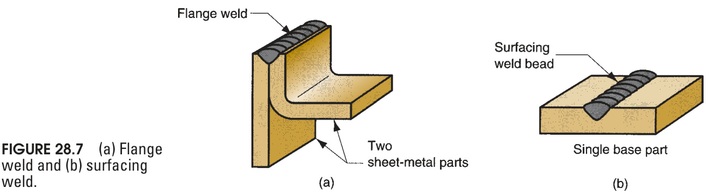
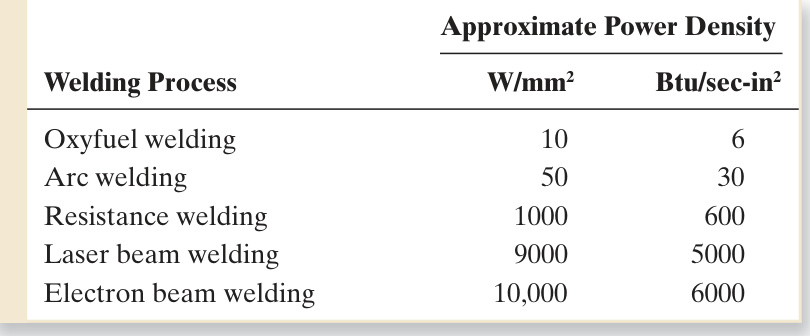
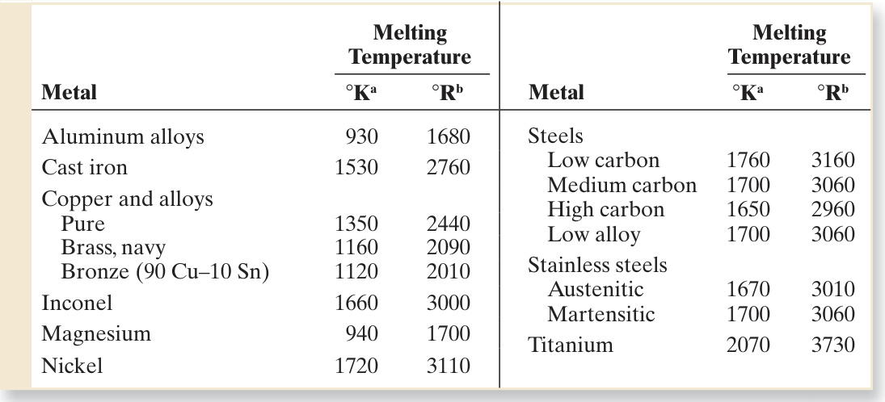
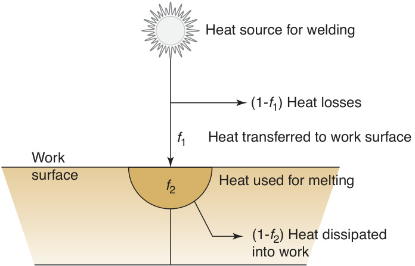
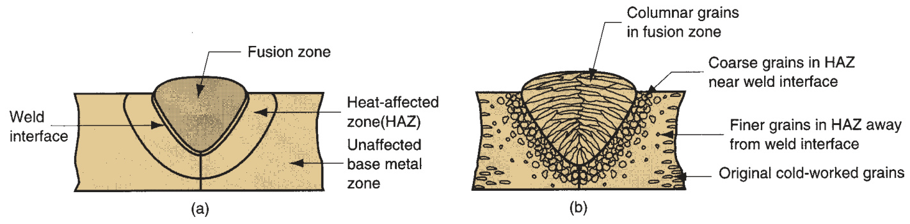

# Part VIII   Joining and  Assembly Processes  

# Fundamentals of Welding  

# Chapter Contents  

28.1 Overview of Welding Technology 28.1.1 Types of Welding Processes 28.1.2 Welding as a Commercial  Operation  

28.2 The Weld Joint 28.2.1 Types of Joints 28.2.2 Types of Welds  

28.3 Physics of Welding 28.3.1 Power Density 28.3.2 Heat Balance in Fusion  Welding  

28.4 Features of a Fusion-Welded Joint This part of the book considers processes used to join  two or more parts into an assembled entity. These proc- esses are labeled in the lower stem of Figure 1.5. The  term  joining  is generally used for welding, brazing, sol- dering, and adhesive bonding, which form a permanent  joint between the parts—a joint that cannot easily be  separated. The term  assembly  usually refers to mechan- ical methods of fastening parts together. Mechanical  assembly is covered in Chapter 31. Some of these meth- ods allow for easy disassembly, while others do not.  Brazing, soldering, and adhesive bonding are discussed  in Chapter 30. Coverage of the joining and   assembly  processes begins with welding, addressed in this chapter  and the following.  

Welding  is a materials joining process in which two  or more parts are coalesced at their contacting sur- faces by a suitable application of heat and/or pressure.  Many welding processes are accomplished by heat  alone, with no pressure applied; others by a combina- tion of heat and pressure; and still others by pressure  alone, with no external heat supplied. In some welding  processes a  fi  ller  material is added to facilitate coales- cence. The assemblage of parts that are joined by weld- ing is called a  weldment . Welding is most commonly  associated with metal parts, but the process is also used  for joining plastics. Here, the discussion will focus on  metals.  

Welding is a relatively new process (Historical  Note 28.1). Its commercial and technological impor- tance derives from the following:  

Welding provides a permanent joint. The welded parts become a single entity. The welded joint can be stronger than the parent materials if a fi  ller metal is  used that has strength properties superior to those of the parents, and if proper  welding techniques are used. Welding is usually the most economical way to join components in terms of  material usage and fabrication costs. Alternative mechanical methods of assem- bly require more complex shape alterations (e.g., drilling of holes) and addition  of fasteners (e.g., rivets or bolts). The resulting mechanical assembly is usually  heavier than a corresponding weldment. Welding is not restricted to the factory environment. It can be accomplished “in  the fi  eld.”  

Although welding has the advantages indicated above, it also has certain limita- tions and drawbacks (or potential drawbacks):  

Most welding operations are performed manually and are expensive in terms  of labor cost. Many welding operations are considered “skilled trades,” and the  labor to perform these operations may be scarce. Most welding processes are inherently dangerous because they involve the use  of high energy.   Because welding accomplishes a permanent bond between the components, it  does not allow for convenient disassembly. If the product must occasionally be  disassembled (e.g., for repair or maintenance), then welding should not be used  as the assembly method. The welded joint can suffer from certain quality defects that are diffi  cult to  detect. The defects can reduce the strength of the joint.  

# Historical Note 28.1  Origins of welding  

Although welding is considered a relatively new proc- ess as practiced today, its origins can be traced to an- cient times. Around 1000  BCE , the Egyptians and others  in the eastern Mediterranean area learned to accom- plish forge welding (Section 29.5.2). It was a natural  extension of hot forging, which they used to make  weapons, tools, and other implements. Forge-welded  articles of bronze have been recovered by archeolo- gists from the pyramids of Egypt. From these early  beginnings through the Middle Ages, the blacksmith  trade developed the art of welding by hammering to a  high level of maturity. Welded objects of iron and other  metals dating from these times have been found in  India and Europe.  

It was not until the 1800s that the technological  foundations of modern welding were established. Two  important discoveries were made, both attributed to  English scientist Sir Humphrey Davy: (1) the electric  arc, and (2) acetylene gas.  

Around 1801, Davy observed that an electric arc  could be struck between two carbon electrodes. How- ever, not until the mid-1800s, when the electric genera- tor was invented, did electrical power become available  in amounts suffi  cient to sustain  arc welding . It was a  Russian, Nikolai Benardos, working out of a laboratory  in France, who was granted a series of patents for the  carbon arc–welding process (one in England in 1885,  and another in the United States in 1887). By the turn  of the century, carbon arc welding had become a popu- lar commercial process for joining metals.  

Benardos’ inventions seem to have been limited  to carbon arc welding. In 1892, an American named  Charles Coffi  n was awarded a U.S. patent for develop- ing an arc–welding process utilizing a metal electrode.  The unique feature was that the electrode added fi  ller  metal to the weld joint (the carbon arc process does not  deposit fi  ller). The idea of coating the metal electrode  (to shield the welding process from the   atmosphere)  

was developed later, with enhancements to the metal  arc–welding process being made in England and  Sweden starting around 1900.  

Between 1885 and 1900, several forms of  resistance  welding  were developed by Elihu Thompson. These  included spot welding and seam welding, two joining  methods widely used today in sheet metalworking. Although Davy discovered acetylene gas early in the  1800s,  oxyfuel gas welding  required the subsequent  development of torches for combining acetylene and  oxygen around 1900. During the 1890s, hydrogen and  natural gas were mixed with oxygen for welding, but  the oxyacetylene fl  ame achieved signifi  cantly higher  temperatures.  

These  three  welding  processes—arc  weld- ing, resistance welding, and oxyfuel gas welding— constitute by far the majority of welding operations  performed today.  

#  Overview of Welding Technology  

Welding involves localized coalescence or joining together of two metallic parts at  their faying surfaces. The  faying surfaces  are the part surfaces in contact or close  proximity that are to be joined. Welding is usually performed on parts made of the  same metal, but some welding operations can be used to join dissimilar metals.  

# 28.1.1  TYPES OF WELDING PROCESSES  

Some 50 different types of welding operations have been cataloged by the American  Welding Society. They use various types or combinations of energy to provide the  required power. The welding processes can be divided into two major groups: (1) fu- sion welding and (2) solid-state welding.  

Fusion Welding  Fusion-welding processes use heat to melt the base metals. In  many fusion welding operations, a fi  ller metal is added to the molten pool to facili- tate the process and provide bulk and strength to the welded joint. A fusion-welding  operation in which no fi  ller metal is added is referred to as an  autogenous  weld.  The fusion category includes the most widely used welding processes, which can be  organized into the following general groups (initials in parentheses are designations  of the American Welding Society):  

$\succcurlyeq$ Arc welding  (AW). Arc welding refers to a group of welding processes in which  heating of the metals is accomplished by an electric arc, as shown in Figure 28.1.  Some arc-welding operations also apply pressure during the process and most  utilize a fi  ller metal.  

  
FIGURE 28.1  Basics of  arc welding: (1) before  the weld; (2) during the  weld (the base metal is  melted and fi  ller metal is  added to the molten pool);  and (3) the completed  weldment. There are  many variations of the  arc-welding process.  

➢   Resistance welding  (RW). Resistance welding achieves coalescence using heat  from electrical resistance to the fl  ow of a current passing between the faying  surfaces of two parts held together under pressure.

 $\gg$ Oxyfuel gas welding  (OFW). These joining processes use an oxyfuel gas, such as  a mixture of oxygen and acetylene, to produce a hot fl  ame for melting the base  metal and fi  ller metal, if one is used.

 $\gg$ Other fusion-welding processes. Other welding processes that produce fusion of  the metals joined include  electron beam welding  and  laser beam welding .  

Certain arc and oxyfuel processes are also used for cutting metals (Sections 25.3.4  and 25.3.5).  

Solid-State Welding  Solid-state welding refers to joining processes in which coa- lescence results from application of pressure alone or a combination of heat and  pressure. If heat is used, the temperature in the process is below the melting point  of the metals being welded. No fi  ller metal is utilized. Representative welding proc- esses in this group include:  

$\gg$ Diffusion welding  (DFW). Two surfaces are held together under pressure at an  elevated temperature and the parts coalesce by solid-state diffusion.

 $\gg$ Friction welding  (FRW). Coalescence is achieved by the heat of friction  between two surfaces.

 $\gg$ Ultrasonic welding  (USW). Moderate pressure is applied between the two parts  and an oscillating motion at ultrasonic frequencies is used in a direction paral- lel to the contacting surfaces. The combination of normal and vibratory forces  results in shear stresses that remove surface fi  lms and achieve atomic bonding  of the surfaces.  

The various welding processes are described in greater detail in Chapter 29. The  preceding survey should provide a suffi  cient framework for the discussion of weld- ing terminology and principles in the present chapter.  

# 28.1.2 WELDING AS A COMMERCIAL OPERATION  

The principal applications of welding are (1) construction, such as buildings and  bridges; (2) piping, pressure vessels, boilers, and storage tanks; (3) shipbuilding; (4)  aircraft and aerospace; and (5) automotive and railroad [1]. Welding is performed in  a variety of locations and in a variety of industries. Owing to its versatility as an as- sembly technique for commercial products, many welding operations are performed  in factories. However, several of the traditional processes, such as arc welding and  oxyfuel gas welding, use equipment that can be readily moved, so these operations  are not limited to the factory. They can be performed at construction sites, in ship- yards, at customers’ plants, and in automotive repair shops.  

Most welding operations are labor intensive. For example, arc welding is usu- ally performed by a skilled worker, called a  welder , who manually controls the  path or placement of the weld to join individual parts into a larger unit. In factory  operations in which arc welding is manually performed, the welder often works  with a second worker, called a  fi  tter . It is the fi  tter’s job to arrange the individual  components for the welder prior to making the weld. Welding fi  xtures and position- ers are used for this purpose. A  welding fi  xture  is a device for clamping and hold- ing the components in fi  xed position for welding. It is custom-fabricated for the  particular geometry of the weldment and therefore must be economically justifi  ed  on the basis of the quantities of assemblies to be produced. A  welding positioner   is a device that holds the parts and also moves the assemblage to the desired posi- tion for welding. This differs from a welding fi  xture that only holds the parts in a  single fi  xed position. The desired position is usually one in which the weld path is  fl  at and horizontal.  

The Safety Issue  Welding is inherently dangerous to human workers. Strict safety  precautions must be practiced by those who perform these operations. The high tem- peratures of the molten metals in welding are an obvious danger. In gas welding,  the fuels (e.g., acetylene) are a fi  re hazard. Most of the processes use high energy to  cause melting of the part surfaces to be joined. In many welding processes, electrical  power is the source of thermal energy, so there is the hazard of electrical shock to  the worker. Certain welding processes have their own particular perils. In arc weld- ing, for example, ultraviolet radiation is emitted that is injurious to human vision.  A special helmet that includes a dark viewing window must be worn by the welder.  This window fi  lters out the dangerous radiation but is so dark that it renders the  welder virtually blind, except when the arc is struck. Sparks, spatters of molten metal,  smoke, and fumes add to the risks associated with welding operations. Ventilation fa- cilities must be used to exhaust the dangerous fumes generated by some of the fl  uxes  and molten metals used in welding. If the operation is performed in an enclosed area,  special ventilation suits or hoods are required.  

Automation in Welding  Because of the hazards of manual welding, and in efforts  to increase productivity and improve product quality, various forms of mechaniza- tion and automation have been developed. The categories include machine welding,  automatic welding, and robotic welding.  

Machine welding  can be defi  ned as mechanized welding with equipment that per- forms the operation under the continuous supervision of an operator. It is normally  accomplished by a welding head that is moved by mechanical means relative to a  stationary work, or by moving the work relative to a stationary welding head. The  human worker must continually observe and interact with the equipment to control  the operation.  

If the equipment is capable of performing the operation without control by a  human operator, it is referred to as  automatic welding . A human worker is usually  present to oversee the process and detect variations from normal conditions. What  distinguishes automatic welding from machine welding is a weld cycle controller to  regulate the arc movement and workpiece positioning without continuous human  attention. Automatic welding requires a welding fi  xture and/or positioner to position  the work relative to the welding head. It also requires a higher degree of consistency  and accuracy in the component parts used in the weldment. For these reasons, auto- matic welding can be justifi  ed only for large quantity production.  

In  robotic welding   an industrial robot or programmable manipulator is used to  automatically control the movement of the welding head relative to the work (Sec- tion 37.4). The versatile reach of the robot arm permits the use of relatively simple  fi  xtures, and the robot’s capacity to be reprogrammed for new part confi  gurations al- lows this form of automation to be justifi  ed for relatively low production quantities.  

A typical robotic arc-welding cell consists of two welding fi  xtures and a human fi  tter  to load and unload parts while the robot welds. In addition to arc welding, industrial  robots are also used in automobile fi  nal assembly plants to perform resistance spot  welding on car bodies (Figure 37.16).  

Welding produces a solid connection between two pieces, called a weld joint. A  weld  joint  is the junction of the edges or surfaces of parts that have been joined by weld- ing. This section covers two classifi  cations related to weld joints: (1) types of joints  and (2) the types of welds used to join the pieces that form the joints.  

# 28.2.1  TYPES OF JOINTS  

There are fi  ve basic types of joints for bringing two parts together for joining. The  fi  ve joint types are not limited to welding; they apply to other joining and fastening  techniques as well. With reference to Figure 28.2, the fi  ve joint types can be defi  ned  as follows:  

(a)  Butt joint . In this joint type, the parts lie in the same plane and are joined at  their edges.

 (b)  Corner joint . The parts in a corner joint form a right angle and are joined at the  corner of the angle.

 (c)  Lap joint . This joint consists of two overlapping parts.

 (d)  Tee joint . In a tee joint, one part is perpendicular to the other in the approxi- mate shape of the letter “T.”

 (e)  Edge joint . The parts in an edge joint are parallel with at least one of their edges  in common, and the joint is made at the common edge(s).  

# 28.2.2  TYPES OF WELDS  

Each of the preceding joints can be made by welding. It is appropriate to distinguish  between the joint type and the way in which it is welded—the weld type. Differences  among weld types are in geometry (joint type) and welding process.  

  
FIGURE 28.2  Five basic types of joints: (a) butt, (b) corner, (c) lap, (d) tee, and (e) edge.  

  
FIGURE 28.3  Various forms of fi  llet welds: (a) inside single   fi  llet corner joint; (b) outside  single fi  llet corner joint; (c) double   fi  llet lap joint; and (d) double fi  llet tee joint. Dashed  lines show the original part edges.  

A  fi  llet weld  is used to fi  ll in the edges of plates created by corner, lap, and tee  joints, as in Figure 28.3. Filler metal is used to provide a cross section approximately  the shape of a right triangle. It is the most common weld type in arc and oxyfuel  welding because it requires minimum edge preparation—the basic square edges of  the parts are used. Fillet welds can be single or double (i.e., welded on one side or  both) and can be continuous or intermittent (i.e., welded along the entire length of  the joint or with unwelded spaces along the length).  

Groove welds  usually require that the edges of the parts be shaped into a groove  to facilitate weld penetration. The grooved shapes include square, bevel, V, U, and J,  in single or double sides, as shown in Figure 28.4. Filler metal is used to fi  ll in the  joint, usually by arc or oxyfuel welding. Preparation of the part edges beyond the basic  square edge, although requiring additional processing, is often done to increase the  strength of the welded joint or where thicker parts are to be welded. Although most  closely associated with a butt joint, groove welds are used on all joint types except lap.  

Plug welds  and  slot welds  are used for attaching fl  at plates, as shown in  Figure 28.5, using one or more holes or slots in the top part and then fi  lling with fi  ller  metal to fuse the two parts together.  

  
FIGURE 28.4  Some  typical groove welds:  (a) square groove weld,  one side; (b) single bevel  groove weld; (c) single  V-groove weld; (d) single  U-groove weld; (e) single  J-groove weld; (f) double  V-groove weld for thicker  sections. Dashed lines  show the original part  edges.  

  
FIGURE 28.6  (a) Spot weld and (b) seam weld.  

  

Spot welds and seam welds, used for lap joints, are diagrammed in Figure 28.6.  A  spot weld  is a small fused section between the surfaces of two sheets or plates.  Multiple spot welds are typically required to join the parts. It is most closely  associated with resistance welding. A  seam weld  is similar to a spot weld except  it consists of a more or less continuously fused section between the two sheets or  plates.  

Flange welds and surfacing welds are shown in Figure 28.7. A  fl  ange weld  is made  on the edges of two (or more) parts, usually sheet metal or thin plate, at least one of  the parts being fl  anged as in Figure 28.7(a). A  surfacing weld  is not used to join parts,  but rather to deposit fi  ller metal onto the surface of a base part in one or more weld  beads. The weld beads can be made in a series of overlapping parallel passes, thereby  covering large areas of the base part. The purpose is to increase the thickness of the  plate or to provide a protective coating on the surface.  

#  Physics of Welding  

Although several coalescing mechanisms are available for welding, fusion is by  far the most common means. This section considers the physical relationships that  allow fusion welding to be performed. Power density and its importance are fi  rst  examined, and then the heat and power equations that describe a welding process  are defi  ned.  

# 28.3.1  POWER DENSITY  

To accomplish fusion, a source of high-density heat energy is supplied to the faying  surfaces, and the resulting temperatures are suffi  cient to cause localized melting of  the base metals. If a fi  ller metal is added, the heat density must be high enough to  melt it also. Heat density can be defi  ned as the power transferred to the work per  unit surface area, $\mathbf{W}/\mathbf{mm}^{2}$  (Btu/sec-in 2 ). The time to melt the metal is inversely pro- portional to the power density. At low power densities, a signifi  cant amount of time  is required to cause melting. If power density is too low, the heat is conducted into  the work as rapidly as it is added at the surface, and melting never occurs. It has been  found that the minimum power density required to melt most metals in welding is  about  $10\,\mathrm{W}/\mathrm{mm}^{2}$   $(6{\mathrm{\Btu/sec}}–\mathrm{in}^{2})$ ). As heat density increases, melting time is reduced.  If power density is too high—above around  $10^{5}~\mathrm{W/mm^{2}}$   $(60{,}000\mathrm{\Btu/sec{-}i n^{2}})$ —the  localized temperatures vaporize the metal in the affected region. Thus, there is a  practical range of values for power density within which welding can be performed.  Differences among welding processes in this range are (1) the rate at which welding  can be performed and/or (2) the size of the region that can be welded. Table 28.1  provides a comparison of power densities for the major fusion welding processes.  Oxyfuel gas welding is capable of developing large amounts of heat, but the heat  density is relatively low because it is spread over a large area. Oxyacetylene gas, the  hottest of the OFW fuels, burns at a top temperature of around $3500^{\circ}\mathrm{C}\left(6300^{\circ}\mathrm{F}\right)$ . By  comparison, arc welding produces high energy over a smaller area, resulting in local  temperatures of  $5500^{\circ}\mathrm{C}$  to $600^{\circ}\mathrm{C}$  ( $(10,\!000^{\circ}\mathrm{F}\!\!-\!\!12,\!000^{\circ}\mathrm{F})$ ). For metallurgical reasons, it  is desirable to melt the metal with minimum energy, and high power densities are  generally preferable.  

Power density can be computed as the power entering the surface divided by the  corresponding surface area:  

$$
P D={\frac{P}{A}}
$$  

where $P D={\mathrm{power}}$  density, $\mathbf{W}/\mathbf{mm}^{2}$  (Btu/sec-in 2 );  $P=$  power entering the surface,  W (Btu/sec); and $A=$  surface area over which the energy is entering, $\mathrm{mm}^{2}\left(\mathrm{in}^{2}\right)$ . The  issue is more complicated than indicated by Equation (28.1). One complication is  that the power source (e.g., the arc) is moving in many welding processes, which  results in preheating ahead of the operation and postheating behind it. Another  complication is that power density is not uniform throughout the affected surface; it  is distributed as a function of area, as demonstrated by the following example.  

TABLE  •  28.1  Comparison of several fusion welding processes  on the basis of their power densities. 
  

# Example 28.1 Power density in  welding  

A heat source transfers $3000\,\mathrm{W}$  to the surface of a metal part. The heat  impinges the surface in a circular area, with intensities varying inside the circle.  The distribution is as follows: $70\%$  of the power is transferred within a circle of  diameter $=5\,\mathrm{mm}$ , and $90\%$  is transferred within a concentric circle of  diameter $=12\,\mathrm{mm}$ . What are the power densities in (a) the $5{\mathrm{-mm}}$ -diameter  inner circle and (b) the  $12{\mathrm{-mm}}$ -diameter ring that lies around the inner circle? Solution:  (a) The inner circle has an area  $\overset{\cdot}{A}=\frac{\pi(5)^{2}}{4}=19.63\:\mathrm{mm}^{2}$ The power inside this area $P=0.70\times3000=2100\,\mathrm{W}$ Thus the power density $P D={\frac{2100}{19.63}}=107\,\mathbf{W}/\mathbf{mm}^{2}$ (b) The area of the ring outside the inner circle is  $A={\frac{\pi(12^{2}-5^{2})}{4}}=93.4\,\mathrm{mm}^{2}$ The power in this region $P=0.9\,(3000)-2100=600\,\mathrm{W}.$ The power density is therefore  $\mathrm{PD}\frac{600}{93.4}=6.4\:\mathrm{W}/\mathrm{mm}^{2}$   Observation:  The power density seems high enough for melting in the inner  circle, but probably not suffi  cient in the ring that lies outside this inner circle.  

# 28.3.2  HEAT BALANCE IN FUSION WELDING  

The quantity of heat required to melt a given volume of metal depends on (1) the  heat to raise the temperature of the solid metal to its melting point, which depends  on the metal’s volumetric specifi  c heat, (2) the melting point of the metal, and (3)  the heat to transform the metal from solid to liquid phase at the melting point, which  depends on the metal’s heat of fusion. To a reasonable approximation, this quantity  of heat can be estimated by the following equation [5]:  

$$
U_{m}=K T_{\mathrm{m}}^{2}
$$  

where  $U_{m}=$  the unit energy for melting (i.e., the quantity of heat required to melt a  unit volume of metal starting from room temperature), $\mathrm{J}/\mathrm{mm}^{3}\left(\mathrm{Btu}/\mathrm{in}^{3}\right)$ ;  $T_{m}=$ melt- ing point of the metal on an absolute temperature scale, $^{\circ}\mathrm{K}\left(^{\circ}\mathrm{R}\right)$ ; and  $K=$  constant  whose value is $3.33\times10^{-6}$  when the Kelvin scale is used (and  $K=1.467\times10^{-5}$  for  the Rankine temperature scale). Absolute melting temperatures for selected metals  are presented in Table 28.2.  

Not all of the energy generated at the heat source is used to melt the weld metal.  There are two heat transfer mechanisms at work, both of which reduce the amount  of generated heat that is used by the welding process. The situation is depicted in  Figure 28.8. The fi  rst mechanism involves the transfer of heat between the heat source  and the surface of the work. This process has a certain  heat transfer factor $f_{1}$ , defi  ned as  the ratio of the actual heat received by the workpiece divided by the total heat gener- ated at the source. The second mechanism involves the conduction of heat away from  the weld area to be dissipated throughout the work metal, so that only a portion of the  heat transferred to the surface is available for melting. This  melting factor $f_{2}$  is the pro- portion of heat received at the work surface that can be used for melting. The combined  effect of these two factors is to reduce the heat energy available for welding as follows:  

$$
H_{w}=f_{1}f_{2}H
$$  

TABLE •  28.2  Melting temperatures on the absolute temperature scale for  selected metals. 
  
Based on values in [2]. a  Kelvin scale $=$  Centigrade (Celsius) temperature $+~273$ . b  Rankine scale $=$  Fahrenheit temperature $\mathrm{~\,~+~}460$ .  

where $H_{w}\!=$  net heat available for welding, J (Btu), $f_{1}=$  heat transfer factor, $f_{2}=$  the  melting factor, and $H=$  the total heat generated by the welding process, J (Btu).  

The factors $f_{1}$  and $f_{2}$  range in value between zero and one. It is appropriate to  separate $f_{1}$  and $f_{2}$  in concept, even though they act in concert during the welding  process. The heat transfer factor $f_{1}$  is determined largely by the welding process and  the capacity to convert the power source (e.g., electrical energy) into usable heat at  the work surface. Arc-welding processes are relatively effi  cient in this regard, while  oxyfuel gas-welding processes are relatively ineffi  cient.  

The melting factor $f_{2}$  depends on the welding process, but it is also infl  uenced  by the thermal properties of the metal, joint confi  guration, and work thickness.  Metals with high thermal conductivity, such as aluminum and copper, present a  problem in welding because of the rapid dissipation of heat away from the heat  contact area. The problem is exacerbated by welding heat sources with low energy  

  
FIGURE 28.8  Heat transfer  mechanisms in fusion  welding.  

densities (e.g., oxyfuel welding) because the heat input is spread over a larger  area, thus facilitating conduction into the work. In general, a high power density  combined with a low conductivity work material results in a high melting factor.  

A balance equation between the energy input and the energy needed for welding  can now be written:  

$$
H_{w}=U_{m}V
$$  

where  $H_{w}=$  net heat energy used by the welding operation,  $\mathrm{J}$  (Btu);  $U_{m}\,=$  unit  energy required to melt the metal,  $\mathrm{J}/\mathrm{mm}^{3}$   $\left(\mathrm{{Btu}}/\mathrm{{in}}^{3}\right)$ ; and  $V=$  the volume of metal  melted, $\mathrm{mm}^{3}\,(\mathrm{in}^{3})$ .  

Most welding operations are rate processes; that is, the net heat energy  $H_{w}$  is  delivered at a given rate, and the weld bead is made at a certain travel velocity. This  is characteristic for example of most arc welding, many oxyfuel gas-welding opera- tions, and even some resistance welding operations. It is therefore appropriate to  express Equation (28.4) as a rate balance equation:  

$$
R_{H w}=U_{m}R_{W V}
$$  

where  $R_{{\scriptscriptstyle H}w}\;=\;$  rate of heat energy delivered to the operation for welding,  $\mathrm{{\bfJ/s}}\;=\;$   W  $\mathrm{(Btw/min)}$ ; and $R_{W V}=$  volume rate of metal welded, $\mathrm{mm}^{3}/\mathrm{s}$   $(\mathrm{in}^{3}/\mathrm{min})$ . In the weld- ing of a continuous bead, the volume rate of metal welded is the product of weld  area $A_{w}$  and travel velocity $\nu$ . Substituting these terms into the above equation, the  rate balance equation can now be expressed as  

$$
R_{H w}=f_{1}f_{2}R_{H}=U_{m}A_{w}\nu
$$  

where $f_{1}$  and $f_{2}$  are the heat transfer and melting factors;  $R_{H}=$  rate of input energy  generated by the welding power source, W  $\mathrm{(Btw/min)}$ ;  $A_{\scriptscriptstyle w}=$ weld cross-sectional  area, $\mathrm{mm}^{2}\left(\mathrm{in}^{2}\right)$ ; and $\nu=$  the travel velocity of the welding operation, $\mathrm{mm/s}$   $(\mathrm{in}/\mathrm{min})$ .  Chapter 29 examines how the power density in Equation (28.1) and the input energy  rate for Equation (28.6) are generated for some of the individual welding processes.  

# Example 28.2 Welding travel  

The power source in a particular welding setup generates 3500 W that can be  transferred to the work surface with a heat transfer factor $=0.7$ . The metal to  be welded is low carbon steel, whose melting temperature, from Table 28.2, is  $1760^{\circ}\mathrm{K}$ . The melting factor in the operation is 0.5. A continuous fi  llet weld is to  be made with a cross-sectional area $=20\:\mathrm{mm}^{2}$ . Determine the travel speed at  which the welding operation can be accomplished.  

Solution:  First fi  nd the unit energy required to melt the metal  $U_{m}$  from  Equation (28.2).  

$$
U_{m}=3.33(10^{-6})\times1760^{2}=10.3\;\mathrm{J/mm^{3}}
$$  

Rearranging Equation (28.6) to solve for travel velocity,  $\nu=\frac{f_{1}f_{2}R_{H}}{U_{m}A_{w}}$ , and  solving for the conditions of the problem,  $\nu={\frac{0.7(0.5)(3500)}{10.3(20)}}={\bf5.95\;mm/s}$  

#  Features of a Fusion-Welded Joint  

Most weld joints are fusion welded. As illustrated in the cross-sectional view of  Figure 28.9(a), a typical fusion-weld joint in which fi  ller metal has been added con- sists of several zones: (1) fusion zone, (2) weld interface, (3) heat-affected zone, and  (4) unaffected base metal zone.  

The  fusion zone  consists of a mixture of fi  ller metal and base metal that have com- pletely melted. This zone is characterized by a high degree of homogeneity among  the component metals that have been melted during welding. The mixing of these  components is motivated largely by convection in the molten weld pool. Solidifi  ca- tion in the fusion zone has similarities to a casting process. In welding the mold is  formed by the unmelted edges or surfaces of the components being welded. The  signifi  cant difference between solidifi  cation in casting and in welding is that epitaxial  grain growth occurs in welding. The reader may recall that in casting, the metallic  grains are formed from the melt by nucleation of solid particles at the mold wall,  followed by grain growth. In welding, by contrast, the nucleation stage of solidifi  ca- tion is avoided by the mechanism of  epitaxial grain growth , in which atoms from  the molten pool solidify on preexisting lattice sites of the adjacent solid base metal.  Consequently, the grain structure in the fusion zone near the heat affected zone  tends to mimic the crystallographic orientation of the surrounding heat-affected  zone. Further into the fusion zone, a preferred orientation develops in which the  grains are roughly perpendicular to the boundaries of the weld interface. The result- ing structure in the solidifi  ed fusion zone tends to feature coarse columnar grains, as  depicted in Figure 28.9(b). The grain structure depends on various factors, includ- ing welding process, metals being welded (e.g., identical metals vs. dissimilar metals  welded), whether a fi  ller metal is used, and the feed rate at which welding is accom- plished. A detailed discussion of welding metallurgy is beyond the scope of this text,  and interested readers can consult any of several references [1], [4], [5].  

The second zone in the weld joint is the  weld interface , a narrow boundary that  separates the fusion zone from the heat-affected zone. The interface consists of a thin  band of base metal that was melted or partially melted (localized melting within the  grains) during the welding process but then immediately solidifi  ed before any mixing  with the metal in the fusion zone. Its chemical composition is therefore identical to  that of the base metal.  

The third zone in the typical fusion weld is the  heat-affected zone  (HAZ). The  metal in this zone has experienced temperatures that are below its melting point, yet  

  
FIGURE 28.9  Cross section of a typical fusion-welded joint: (a) principal zones in the joint and (b) typical grain structure.  

high enough to cause microstructural changes in the solid metal. The chemical com- position in the heat-affected zone is the same as the base metal, but this region has  been heat treated due to the welding temperatures so that its properties and struc- ture have been altered. The amount of metallurgical damage in the HAZ depends  on factors such as the amount of heat input and peak temperatures reached, distance  from the fusion zone, length of time the metal has been subjected to the high tem- peratures, cooling rate, and the metal’s thermal properties. The effect on mechanical  properties in the heat-affected zone is usually negative, and it is in this region of the  weld joint that welding failures often occur.  

As the distance from the fusion zone increases, the  unaffected base metal zone   is fi  nally reached, in which no metallurgical change has occurred. Nevertheless,  the base metal surrounding the HAZ is likely to be in a state of high residual stress,  the result of shrinkage in the fusion zone.  

# References  

[1]  ASM Handbook , Vol. 6,  Welding, Brazing, and  Soldering . ASM International, Materials Park,  Ohio, 1993.

 [2] Cary, H. B., and Helzer, S. C.  Modern Weld- ing Technology , 6th ed. Pearson/Prentice-Hall,  Upper Saddle River, New Jersey, 2005.

 [3] Datsko, J.  Material Properties and Manu- facturing Processes . John Wiley & Sons, New  York, 1966.  

# Review Questions  

28.1 What are the advantages and disadvantages  of welding compared to other types of assem- bly operations?

  28.2 What were the two discoveries of Sir Hum- phrey Davy that led to the development of  modern welding technology?

  28.3 What is meant by the term faying surface?

  28.4 Defi  ne the term fusion weld.

  28.5 What is the fundamental difference between  a fusion weld and a solid state weld?

  28.6 What is an autogenous weld?

  28.7 Discuss the reasons why most welding opera- tions are inherently dangerous.

  28.8 What is the difference between machine  welding and automatic welding?  

[4] Messler, R. W., Jr.  Principles of Welding: Proc- esses, Physics, Chemistry, and Metallurgy .  John Wiley & Sons, New York, 1999.

 [5]  Welding Handbook , 9th ed., Vol. 1,  Welding  Science and Technology . American Welding  Society, Miami, Florida, 2007.

 [6]  Wick, C., and Veilleux, R. F.  Tool and Manufac- turing Engineers Handbook ,   4th ed., Vol. IV,  Quality Control and Assembly . Society of Man- ufacturing Engineers, Dearborn, Michigan, 1987.  

28.9 Name and sketch the fi  ve joint types.

 28.10 Defi  ne and sketch a fi  llet weld.

 28.11 Defi  ne and sketch a groove weld.

 28.12 Why is a surfacing weld different from the  other weld types?

 28.13 Why is it desirable to use energy sources for  welding that have high heat densities?

 28.14 What is the unit melting energy in weld- ing, and what are the factors on which it  depends?

 28.15 Defi  ne and distinguish the two terms heat  transfer factor and melting factor in welding.

 28.16 What is the heat-affected zone (HAZ) in a  fusion weld?  