# Grinding and  Other Abrasive  Processes  

# 24  

Abrasive machining involves material removal by the  action of hard, abrasive particles that are usually in the  form of a bonded wheel. Grinding is the most important  abrasive process. In terms of number of machine tools  in use, grinding is the most common of all metalworking  operations [11]. Other traditional abrasive processes in- clude honing, lapping, superfi  nishing, polishing, and buff- ing. The abrasive machining processes are generally used  as fi  nishing operations, although some abrasive proc- esses are capable of high material removal rates rivaling  those of conventional machining operations.  

# Chapter Contents  

# 24.1 Grinding  

24.1.1 The Grinding Wheel

 24.1.2 Analysis of the Grinding  Process

 24.1.3 Application Considerations  in Grinding

 24.1.4 Grinding Operations and  Grinding Machines  

The use of abrasives to shape parts is probably the  oldest material removal process (Historical Note 24.1).  Abrasive processes are important commercially and  technologically for the following reasons:  

# 24.2 Related Abrasive Processes  

24.2.1 Honing

 24.2.2 Lapping

 24.2.3 Superfi  nishing

 24.2.4 Polishing and Buffi  ng  

➢   They can be used on all types of materials ranging  from soft metals to hardened steels and hard non- metallic materials such as ceramics and silicon. $\gg$   Some of these processes can produce extremely  fi  ne surface fi  nishes, to $0.025\;\mu\mathrm{m}$  ( $1\,\mu$ -in). $\gg$   For certain abrasive processes, dimensions can be  held to extremely close tolerances. Abrasive water jet cutting and ultrasonic machining  are also abrasive processes, because material removal is  accomplished by means of abrasives. However, they are  commonly classifi  ed as nontraditional processes and  are covered in the Chapter 25.  

#  Grinding  

Grinding is a material removal process accomplished  by abrasive particles that are contained in a bonded  grinding wheel rotating at very high surface speeds. The  grinding wheel is usually disk shaped, and is precisely  balanced for high rotational speeds.  

# Historical Note 24.1  Development of abrasive processes  

Use of abrasives predates any of the other machining  operations. There is archaeological evidence that an- cient people used abrasive stones such as sandstone  found in nature to sharpen tools and weapons and  scrape away unwanted portions of softer materials to  make domestic implements.  

Grinding became an important technical trade in  ancient Egypt.  The large stones used to build the Egyp- tian pyramids were cut to size by a rudimentary grind- ing process. The grinding of metals dates to around  2000  B . C . E . and was a highly valued skill at that time.  

Early abrasive materials were those found in nature,  such as sandstone, which consists primarily of quartz  $(\mathsf{S i O}_{2})$ ; emery, consisting of corundum  $(\mathsf{A}|_{2}\mathsf{O}_{3})$  plus  equal or lesser amounts of the iron minerals hematite  $(\mathsf{F}\mathsf{e}_{2}\mathsf{O}_{3})$  and magnetite  $(\mathsf{F}\mathsf{e}_{3}\mathsf{O}_{4})$ ; and diamond. The fi  rst  grinding wheels were likely cut out of sandstone and  were no doubt rotated under manual power. However,  grinding wheels made in this way were not consistent  in quality.  

In the early 1800s, the fi  rst solid bonded grinding  wheels were produced in India. They were used to  grind gems, an important trade in India at the time.  The abrasives were corundum, emery, or diamond.  The  bonding material was natural gum-resin shellac. The  technology was exported to Europe and the United  States, and other bonding materials were subsequent- ly introduced: rubber bond in the mid-1800s, vitrifi  ed  bond around 1870, shellac bond around 1880, and resi- noid bond in the 1920s with the development of the  fi  rst thermosetting plastics (phenol-formaldehyde).  

In the late 1800s, synthetic abrasives were fi  rst  produced: silicon carbide (SiC) and aluminum oxide  $(\mathsf{A}|_{2}\mathsf{O}_{3})$ . By manufacturing the abrasives, chemistry and  size of the individual abrasive grains could be control- led more closely, resulting in higher quality grinding  wheels.  

The fi  rst real grinding machines were made by the  U.S. fi  rm Brown & Sharpe in the 1860s for grinding  parts for sewing machines, an important industry dur- ing the period. Grinding machines also contributed to  the development of the bicycle industry in the 1890s  and later the U.S. automobile industry. The grinding  process was used to size and fi  nish heat-treated (hard- ened) parts in these products.  

The superabrasives diamond and cubic boron   nitride  are products of the twentieth century. Synthetic dia- monds were fi  rst produced by the General Electric  Company in 1955. These abrasives were used to  grind cemented carbide cutting tools, and today this  remains one of the important applications of diamond  abrasives. Cubic boron nitride (cBN), second only to  diamond in hardness, was fi  rst synthesized in 1957 by  GE using a similar process to that for making artifi  cial  diamonds. Cubic BN has become an important abra- sive for grinding hardened steels.  

Grinding can be likened to the milling process. Cutting occurs on either the pe- riphery or the face of the grinding wheel, similar to peripheral and face milling.  Peripheral grinding is much more common than face grinding. The rotating grinding  wheel consists of many cutting teeth (the abrasive particles), and the work is fed rel- ative to the wheel to accomplish material removal. Despite these similarities, there  are signifi  cant differences between grinding and milling: (1) the abrasive grains in  the wheel are much smaller and more numerous than the teeth on a milling cutter;  (2) cutting speeds in grinding are much higher than in milling; (3) the abrasive grits  in a grinding wheel are randomly oriented and possess on average a very high nega- tive rake angle; and (4) a grinding wheel is self-sharpening—as the wheel wears, the  abrasive particles become dull and either fracture to create fresh cutting edges or  are pulled out of the surface of the wheel to expose new grains.  

# 24.1.1  THE GRINDING WHEEL  

A grinding wheel consists of abrasive particles and bonding material. The bonding  material holds the particles in place and establishes the shape and structure of the  wheel. These two ingredients and the way they are fabricated determine the fi  ve  basic parameters of a grinding wheel: (1) abrasive material, (2) grain size, (3) bonding  

material, (4) wheel grade, and (5) wheel structure. To achieve the desired perform- ance in a given application, each parameter must be carefully selected.  

Abrasive Material  Different abrasive materials are appropriate for grinding dif- ferent work materials. General properties of an abrasive material used in grinding  wheels include high hardness, wear resistance, toughness, and friability. Hardness,  wear resistance, and toughness are desirable properties of any cutting-tool material.  Friability  refers to the capacity of the abrasive material to fracture when the cutting  edge of the grain becomes dull, thereby exposing a new sharp edge.  

The development of grinding abrasives is described in Historical Note 24.1.  Today, the abrasive materials of greatest commercial importance are aluminum  oxide, silicon carbide, cubic boron nitride, and diamond. They are briefl  y described  in Table 24.1, together with their relative hardness values.  

Grain Size  The grain size of the abrasive particle is important in determining  surface fi  nish and material removal rate. Small grit sizes produce better fi  nishes,  whereas larger grain sizes permit larger material removal rates. Thus, a choice must  be made between these two objectives when selecting abrasive grain size. The selec- tion of grit size also depends to some extent on the hardness of the work material.  Harder work materials require smaller grain sizes to cut effectively, whereas softer  materials require larger grit sizes.  

The grit size is measured using a screen mesh procedure, as explained in Sec- tion 15.1. In this procedure, smaller grit sizes have larger numbers and vice versa.  Grain sizes used in grinding wheels typically range between 8 and 250. Grit size 8 is  very coarse and size 250 is very fi  ne. Even fi  ner grit sizes are used for lapping and  superfi  nishing (Section 24.2).  

Bonding Materials  The bonding material holds the abrasive grains and establish- es the shape and structural integrity of the grinding wheel. Desirable properties of  the bond material include strength, toughness, hardness, and temperature   resistance.  

TABLE  •  24.1  Abrasives of greatest importance in grinding. 
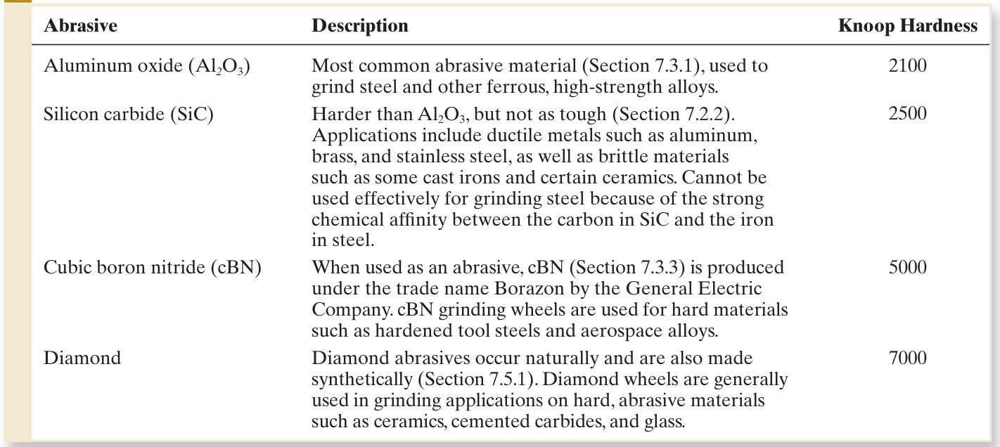  

TABLE  •  24.2  Bonding materials used in grinding wheels. 
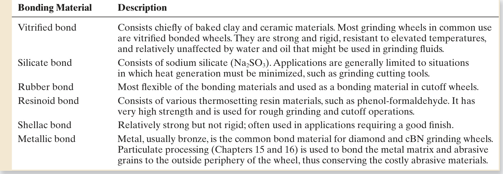  

The bonding material must be able to withstand the centrifugal forces and high tem- peratures experienced by the grinding wheel, resist shattering in shock loading of  the wheel, and hold the abrasive grains rigidly in place to accomplish the cutting  action while allowing those grains that are worn to be dislodged so that new grains  can be exposed. Bonding materials commonly used in grinding wheels are identifi  ed  and briefl  y described in Table 24.2.  

Wheel Structure and Wheel Grade   Wheel structure  refers to the relative spac- ing of the abrasive grains in the wheel. In addition to the abrasive grains and bond  material, grinding wheels contain air gaps or pores, as illustrated in Figure 24.1. The  volumetric proportions of grains, bond material, and pores can be expressed as  

$$
P_{g}+P_{b}+P_{p}=1.0
$$
  1.0  

where $P_{g}=$  proportion of abrasive grains in the total wheel volume, $P_{b}=$  proportion  of bond material, and $P_{p}=$  proportion of pores (air gaps).  

Wheel structure is measured on a scale that ranges between “open” and “dense.”  An open structure is one in which  $P_{p}$  is relatively large, and  $P_{g}$  is relatively small.  That is, there are more pores and fewer grains per unit volume in a wheel of open  structure. By contrast, a dense structure is one in which $P_{p}$  is relatively small, and $P_{g}$   is larger. Generally, open structures are recommended in situations in which clear- ance for chips must be provided. Dense structures are used to obtain better surface  fi  nish and dimensional control.  

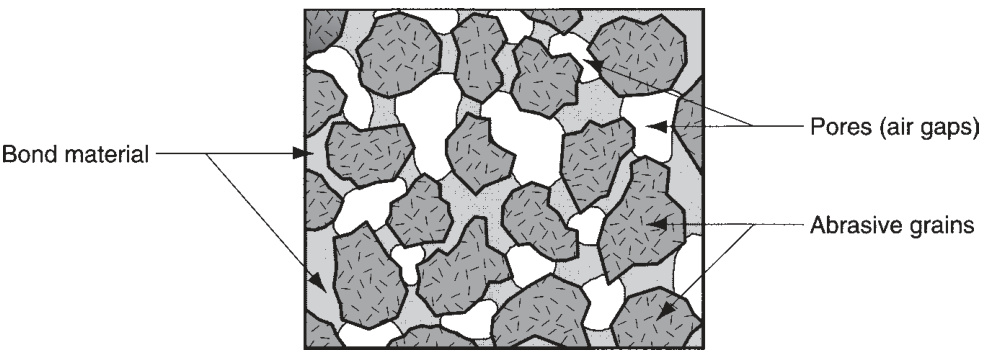  
FIGURE 24.1  Typical  structure of a grinding  wheel.  

TABLE  •  24.3  Marking system for conventional grinding wheels as defi  ned by ANSI Standard B74.13-1977 [2].  

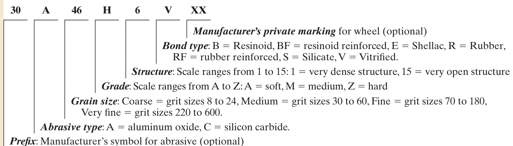  

Wheel grade  indicates the grinding wheel’s bond strength in retaining the abra- sive grits during cutting. This is largely dependent on the amount of bonding mate- rial present in the wheel structure $-P_{b}$  in Equation (24.1). Grade is measured on a  scale that ranges between soft and hard. “Soft” wheels lose grains readily, whereas  “hard” wheels retain their abrasive grains. Soft wheels are generally used for appli- cations requiring low material removal rates and grinding of hard work materials.  Hard wheels are typically used to achieve high stock removal rates and for grinding  of relative soft work materials.  

Grinding Wheel Specifi  cation  The preceding parameters can be concisely desig- nated in a standard grinding wheel marking system defi  ned by the American National  Standards Institute (ANSI) [2]. This marking system uses numbers and letters to spec- ify abrasive type, grit size, grade, structure, and bond material. Table 24.3 presents an  abbreviated version of the ANSI Standard, indicating how the numbers and letters  are interpreted. The standard also provides for additional identifi  cations that might be  used by the grinding wheel manufacturers. The ANSI Standard for diamond and cubic  boron nitride grinding wheels is slightly different than for conventional wheels. The  marking system for these newer grinding wheels is presented in Table 24.4.  

TABLE  •  24.4  Marking system for diamond and cubic boron nitride grinding wheels as defi  ned by ANSI  Standard B74.13-1977 [2].  

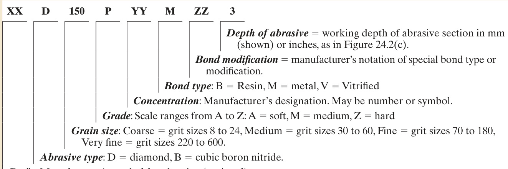  

Prefi  x : Manufacturer’s symbol for abrasive (optional)  

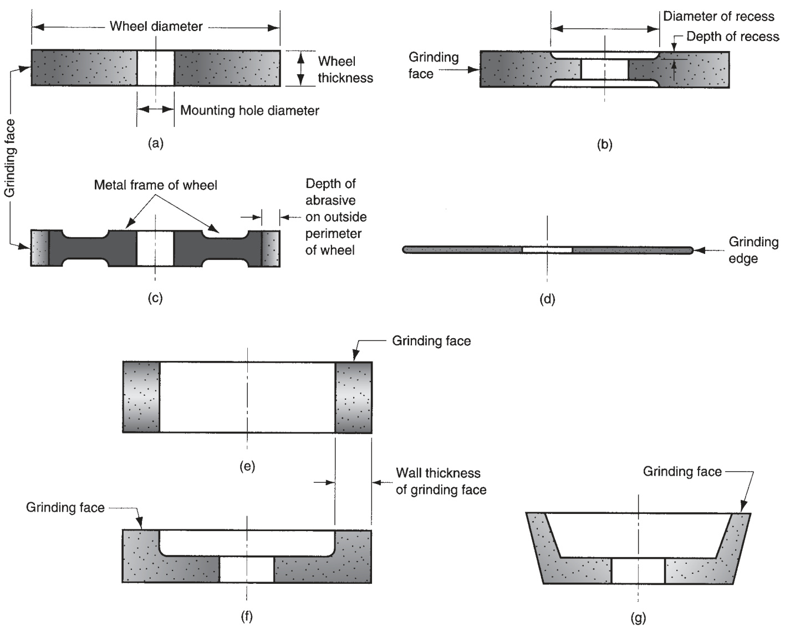  
FIGURE 24.2  Some standard grinding wheel shapes: (a) straight, (b) recessed two sides, (c) metal wheel frame with  abrasive bonded to outside circumference, (d) abrasive cutoff wheel, (e) cylinder wheel, (f) straight cup wheel, and  (g) fl  aring cup wheel.  

Grinding wheels come in a variety of shapes and sizes, as shown in Figure 24.2.  Confi  gurations (a), (b), and (c) are peripheral grinding wheels, in which material re- moval is accomplished by the outside circumference of the wheel. A typical abrasive  cutoff wheel is shown in (d), which also involves peripheral cutting. Wheels (e), (f),  and (g) are face grinding wheels, in which the fl  at face of the wheel removes material  from the work surface.  

# 24.1.2  ANALYSIS OF THE GRINDING PROCESS  

The cutting conditions in grinding are characterized by very high speeds and very  small cut size, compared to milling and other traditional machining operations. Us- ing surface grinding to illustrate, Figure 24.3(a) shows the principal features of the  

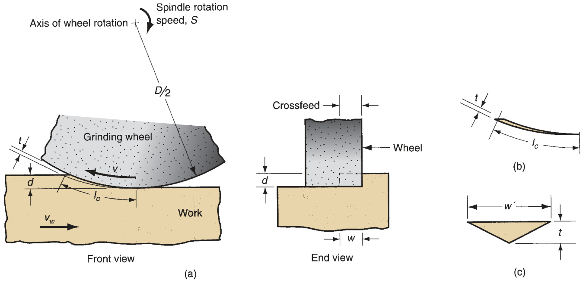  
FIGURE 24.3  (a) The geometry of surface grinding, showing the cutting conditions; (b) assumed longitudinal shape  and (c) cross section of a single chip.  

process. The peripheral speed of the grinding wheel is determined by the rotational  speed of the wheel:  

$$
\nu=\pi D N
$$  

where  $\nu=$  surface speed of wheel, $\mathbf{m}/\mathbf{min}$  (ft/min); $N=$ spindle speed, rev/min; and  $D=$  wheel diameter, m (ft).  

Depth of cut $d$ , called the  infeed , is the penetration of the wheel below the origi- nal work surface. As the operation proceeds, the grinding wheel is fed laterally  across the surface on each pass by the work. This is called the  crossfeed , and it  determines the width of the grinding path $w$  in Figure 24.3(a). This width, multi- plied by depth $d$  determines the cross-sectional area of the cut. In most grinding  operations, the work moves past the wheel at a certain speed $\nu_{_{w}}$ , so that the material  removal rate is  

$$
R_{M R}=\nu_{w}w d
$$  

Each grain in the grinding wheel cuts an individual chip whose longitudinal shape  before cutting is shown in Figure 24.3(b) and whose assumed cross-sectional shape  is triangular, as in Figure 24.3(c). At the exit point of the grit from the work, where  the chip cross section is largest, this triangle has height $t$  and width $w^{\prime}$ .  

In a grinding operation, one is interested in how the cutting conditions combine  with the grinding wheel parameters to affect (1) surface fi  nish, (2) forces and energy,  (3) temperature of the work surface, and (4) wheel wear.  

Surface Finish  Most commercial grinding is performed to achieve a surface fi  nish  that is superior to that which can be accomplished with conventional machining. The  surface fi  nish of the work part is affected by the size of the individual chips formed  during grinding. One obvious factor in determining chip size is grit size—smaller grit  sizes yield better fi  nishes.  

Consider the dimensions of an individual chip. From the geometry of the grinding  process in Figure 24.3, it can be shown that the average length of a chip is given by  

$$
l_{c}=\sqrt{D d}
$$  

where  $l_{c}$  is the length of the chip, mm (in); $D=$ wheel diameter, mm (in); and  $d=$ depth of cut, or infeed, mm (in). This assumes the chip is formed by a grit that acts  throughout the entire sweep arc shown in the diagram.  

Figure 24.3(c) shows the assumed cross section of a chip in grinding. The cross- sectional shape is triangular with width  $w^{\prime}$  being greater than the thickness  $t$  by a  factor called the grain aspect ratio $r_{g}$ , defi  ned by  

$$
r_{g}={\frac{w^{\prime}}{t}}
$$  

Typical values of grain aspect ratio are between 10 and 20.  

The number of active grits (cutting teeth) per square inch on the outside periph- ery of the grinding wheel is denoted by  $C$ . In general, smaller grain sizes give larger  $C$  values.  $C$  is also related to the wheel structure. A denser structure means more  grits per area. Based on the value of  $C$ , the number of chips formed per time $n_{c}$  is  given by  

$$
n_{c}=\nu w C
$$  

where $\nu=$  wheel speed, $\mathrm{mm/min}\,(\mathrm{in/min})$ ; $w=$  crossfeed,  $\mathrm{mm}$  (in); and  $C=$  grits per  area on the grinding wheel surface, grits $\mathrm{/mm^{2}}$  (grits/in 2 ). It stands to reason that sur- face fi  nish will be improved by increasing the number of chips formed per unit time  on the work surface for a given width  $w$ . Therefore, according to Equation (24.6),  increasing $\nu$  and/or  $C$  will improve fi  nish.  

Forces and Energy  If the force required to drive the work past the grinding  wheel were known, the specifi  c energy in grinding could be determined as  

$$
U=\frac{F_{c}\nu}{\nu_{w}w d}
$$  

where  $U=$  specifi  c energy, $\mathrm{J}/\mathrm{mm}^{3}$  (in-lb/in 3 ); $\boldsymbol{F_{c}}=$  cutting force, which is the force to  drive the work past the wheel,  $\mathbf{N}$  (lb);  $\nu=$  wheel speed, $\mathrm{m/min}$   $(\mathrm{ft/min})$ );  $\nu_{\scriptscriptstyle w}=$  work  speed, $\mathrm{mm/min}\,(\mathrm{in/min})$ ; $w=$  width of cut, $\mathrm{mm}$  (in); and  $d=$  depth of cut, $\mathrm{mm}$  (in).  

In grinding, the specifi  c energy is much greater than in conventional machining.  There are several reasons for this. First is the  size effect  in machining. The chip thick- ness in grinding is much smaller than for other machining operations, such as milling.  According to the size effect (Section 20.4), the small chip sizes in grinding cause the  energy required to remove each unit volume of material to be signifi  cantly higher  than in conventional machining—roughly 10 times higher.  

Second, the individual grains in a grinding wheel possess extremely negative rake  angles. The average rake angle is about  $-30^{\circ}$ , with values on some individual grains  believed to be as low as  $-60^{\circ}$ . These very low rake angles result in low values of  shear plane angle and high shear strains, both of which mean higher energy levels  in grinding.  

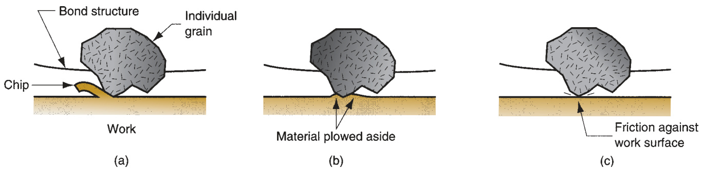  
FIGURE 24.4  Three types of grain action in grinding: (a) cutting, (b) plowing, and (c) rubbing.  

Third, specifi  c energy is higher in grinding because not all of the individual grits  are engaged in actual cutting. Because of the random positions and orientations of  the grains in the wheel, some grains do not project far enough into the work surface  to accomplish cutting. Three types of grain actions can be recognized, as illustrated  in Figure 24.4: (a)  cutting , in which the grit projects far enough into the work surface  to form a chip and remove material; (b)  plowing , in which the grit projects into the  work, but not far enough to cause cutting; instead, the work surface is deformed and  energy is consumed without any material removal; and (c)  rubbing , in which the grit  contacts the surface during its sweep, but only rubbing friction occurs, thus consum- ing energy without removing any material.  

The size effect, negative rake angles, and ineffective grain actions combine to  make the grinding process ineffi  cient in terms of energy consumption per volume of  material removed.  

Using the specifi  c energy relationship in Equation (24.7), and assuming that the  cutting force acting on a single grain in the grinding wheel is proportional to  $r_{g}t$ , it  can be shown [10] that  

$$
{F_{c}}^{\prime}=K_{1}{\left(\frac{r_{g}\nu_{w}}{\nu C}\right)}^{0.5}\,{\left(\frac{d}{D}\right)}^{0.25}
$$  

where  ${F_{c}}^{\prime}$  is the cutting force acting on an individual grain,  $K_{1}$  is a constant of pro- portionality that depends on the strength of the material being cut and the sharpness  of the individual grain, and the other terms have been previously defi  ned. The prac- tical signifi  cance of this relationship is that  ${F_{c}}^{\prime}$  affects whether an individual grain  will be pulled out of the grinding wheel, an important factor in the wheel’s capacity  to “resharpen” itself. Referring back to the discussion on wheel grade, a hard wheel  can be made to appear softer by increasing the cutting force acting on an individual  grain through appropriate adjustments in  $\nu_{w},\nu$ , and $d$ , according to Equation (24.8).  

Temperatures at the Work Surface  Because of the size effect, high negative  rake angles, and plowing and rubbing of the abrasive grits against the work surface,  the grinding process is characterized by high temperatures. Unlike conventional ma- chining operations in which most of the heat energy generated in the process is  carried off in the chip, much of the energy in grinding remains in the ground surface  [11], resulting in high work surface temperatures. The high surface temperatures  have several possible damaging effects, primarily surface burns and cracks. The burn  marks show themselves as discolorations on the surface caused by oxidation. Grind- ing burns are often a sign of metallurgical damage immediately beneath the surface.  

The surface cracks are perpendicular to the wheel speed direction. They indicate an  extreme case of thermal damage to the work surface.  

A second harmful thermal effect is softening of the work surface. Many grinding  operations are carried out on parts that have been heat-treated to obtain high hard- ness. High grinding temperatures can cause the surface to lose some of its hardness.  Third, thermal effects in grinding can cause residual stresses in the work surface,  possibly decreasing the fatigue strength of the part.  

It is important to understand what factors infl  uence work surface temperatures in  grinding. Experimentally, it has been observed that surface temperature is depend- ent on energy per surface area ground (closely related to specifi  c energy  $U$ ). Because  this varies inversely with chip thickness, it can be shown that surface temperature  $T_{s}$  is related to grinding parameters as follows [10]:  

$$
T_{s}=K_{2}d^{0.75}\left(\frac{r_{g}C\nu}{\nu_{w}}\right)^{0.5}D^{0.25}
$$  

where $K_{2}=\mathrm{a}$  constant of proportionality. The practical implication of this relation- ship is that surface damage caused by high work temperatures can be mitigated  by decreasing depth of cut $d$ , wheel speed $\nu$ , and number of active grits per square  inch on the grinding wheel  $C$ , or by increasing work speed  $\nu_{_{w}}$ . In addition, dull  grinding wheels and wheels that have a hard grade and dense structure tend to  cause thermal problems. Of course, using a cutting fl  uid can also reduce grinding  temperatures.  

Wheel Wear  Grinding wheels wear, just as conventional cutting tools wear. Three  mechanisms are recognized as the principal causes of wear in grinding wheels: (1)  grain fracture, (2) attritious wear, and (3) bond fracture.  Grain fracture  occurs when  a portion of the grain breaks off, but the rest of the grain remains bonded in the  wheel. The edges of the fractured area become new cutting edges on the grinding  wheel. The tendency of the grain to fracture is called  friability . High friability means  that the grains fracture more readily because of the cutting forces on the grains  ${F_{c}}^{\prime}$ .  

Attritious wear  involves dulling of the individual grains, resulting in fl  at spots and  rounded edges. Attritious wear is analogous to tool wear in a conventional cutting  tool. It is caused by similar physical mechanisms including friction and diffusion, as  well as chemical reactions between the abrasive material and the work material in  the presence of very high temperatures.  

Bond fracture  occurs when the individual grains are pulled out of the bonding  material. The tendency toward this mechanism depends on wheel grade, among  other factors. Bond fracture usually occurs because the grain has become dull from  attritious wear, and the resulting cutting force is excessive. Sharp grains cut more ef- fi  ciently with lower cutting forces; hence, they remain attached in the bond structure.  

The three mechanisms combine to cause the grinding wheel to wear as depicted  in Figure 24.5. Three wear regions can be identifi  ed. In the fi  rst region, the grains are  initially sharp, and wear is accelerated because of grain fracture. This corresponds to  the “break-in” period in conventional tool wear. In the second region, the wear rate  is fairly constant, resulting in a linear relationship between wheel wear and volume  of metal removed. This region is characterized by attritious wear, with some grain  and bond fracture. In the third region of the wheel wear curve, the grains become  dull, and the amount of plowing and rubbing increases relative to cutting. In addi- tion, some of the chips become clogged in the pores of the wheel. This is called  wheel  loading , and it impairs the cutting action and leads to higher heat and work surface  

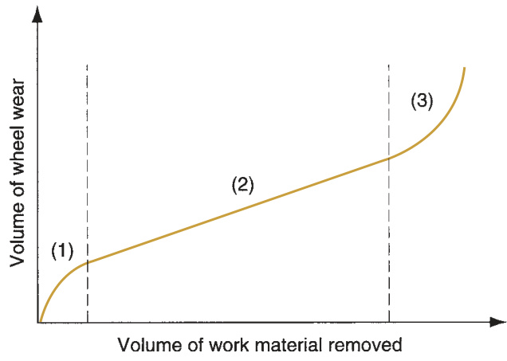  
FIGURE 24.5  Typical wear curve  of a grinding wheel. Wear is  conveniently plotted as a function  of volume of material removed,  rather than as a function of time.  (Based on [16].)  

temperatures. As a consequence, grinding effi  ciency decreases, and the volume of  wheel removed increases relative to the volume of metal removed.  

The  grinding ratio  is a term used to indicate the slope of the wheel wear curve.  Specifi cally,  

$$
G R={\frac{V_{w}}{V_{g}}}
$$  

where  $G R\,=$  the grinding ratio,  $V_{w}=$  the volume of work material removed, and  $V_{g}=$  the corresponding volume of the grinding wheel that is worn in the process.  The grinding ratio has the most signifi  cance in the linear wear region of Figure 24.5.  Typical values of  $G R$  range between 95 and 125 [5], which is about fi  ve orders of  magnitude less than the analogous ratio in conventional machining. Grinding ratio  is generally increased by increasing wheel speed $\nu$ . The reason for this is that the size  of the chip formed by each grit is smaller with higher speeds, so the amount of grain  fracture is reduced. Because higher wheel speeds also improve surface fi  nish, there  is a general advantage in operating at high grinding speeds. However, when speeds  become too high, attritious wear and surface temperatures increase. As a result, the  grinding ratio is reduced and the surface fi  nish is impaired. This effect was originally  reported by Krabacher [14], as in Figure 24.6.  

When the wheel is in the third region of the wear curve, it must be resharpened  by a procedure called  dressing , which consists of (1) breaking off the dulled grits on  

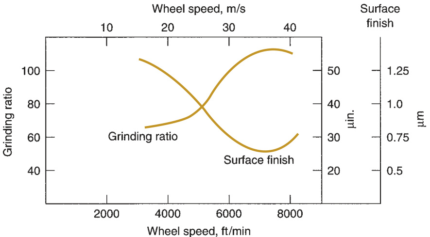  
FIGURE 24.6  Grinding  ratio and surface fi  nish  as a function of wheel  speed. (Based on data  in Krabacher [14].)  

the outside periphery of the grinding wheel in order to expose fresh sharp grains  and (2) removing chips that have become clogged in the wheel. It is accomplished  by a rotating disk, an abrasive stick, or another grinding wheel operating at high  speed, held against the wheel being dressed as it rotates. Although dressing sharp- ens the wheel, it does not guarantee the shape of the wheel.  Truing  is an alterna- tive procedure that not only sharpens the wheel, but also restores its cylindrical  shape and insures that it is straight across its outside perimeter. The procedure uses  a diamond-pointed tool (other types of truing tools are also used) that is fed slowly  and precisely across the wheel as it rotates. A very light depth is taken ( $0.025\:\mathrm{mm}$  or  less) against the wheel.  

# 24.1.3  APPLICATION CONSIDERATIONS IN GRINDING  

This section attempts to bring together the previous discussion of wheel parameters  and theoretical analysis of grinding and consider their practical application. Also  considered are grinding fl  uids, which are commonly used in grinding operations.  

Application Guidelines  There are many variables in grinding that affect the per- formance and success of the operation. The guidelines listed in Table 24.5 are helpful  in sorting out the many complexities and selecting the proper wheel parameters and  grinding conditions.  

Grinding Fluids  The proper application of cutting fl  uids has been found to be ef- fective in reducing the thermal effects and high work surface temperatures described  previously. When used in grinding operations, cutting fl  uids are called grinding fl  uids.  The functions performed by grinding fl  uids are similar to those performed by cutting  

TABLE  •  24.5  Application guidelines for grinding. 
  

fl  uids (Section 22.4). Reducing friction and removing heat from the process are the  two common functions. In addition, washing away chips and reducing temperature  of the work surface are very important in grinding.  

Types of grinding fl  uids by chemistry include grinding oils and emulsifi  ed oils.  The grinding oils are derived from petroleum and other sources. These products are  attractive because friction is such an important factor in grinding. However, they  pose hazards in terms of fi  re and operator health, and their cost is high relative to  emulsifi  ed oils. In addition, their capacity to carry away heat is less than fl  uids based  on water. Accordingly, mixtures of oil in water are most commonly recommended as  grinding fl  uids. These are usually mixed with higher concentrations than emulsifi  ed  oils used as conventional cutting fl  uids. In this way, the friction reduction mechanism  is emphasized.  

# 24.1.4 GRINDING OPERATIONS AND GRINDING MACHINES  

Grinding is traditionally used to fi  nish parts whose geometries have already been  created by other operations. Accordingly, grinding machines have been developed  to grind plain fl  at surfaces, external and internal cylinders, and contour shapes such  as threads. The contour shapes are often created by special formed wheels that have  the opposite of the desired contour to be imparted to the work. Grinding is also used  in tool rooms to form the geometries on cutting tools. In addition to these traditional  uses, applications of grinding are expanding to include more high speed, high mate- rial removal operations. The discussion of operations and machines in this section  includes the following types: (1) surface grinding, (2) cylindrical grinding, (3) center- less grinding, (4) creep feed grinding, and (5) other grinding operations.  

Surface Grinding  Surface grinding is normally used to grind plain fl  at surfaces.  It is performed using either the periphery of the grinding wheel or the fl  at face of  the wheel. Because the work is normally held in a horizontal orientation, periph- eral grinding is performed by rotating the wheel about a horizontal axis, and face  grinding is performed by rotating the wheel about a vertical axis. In either case,  the relative motion of the work part is achieved by reciprocating the work past  the wheel or by rotating it. These possible combinations of wheel orientations and  work part motions provide the four types of surface grinding machines illustrated  in Figure 24.7.  

Of the four types, the horizontal spindle machine with reciprocating worktable is  the most common, shown in Figure 24.8. Grinding is accomplished by reciprocating  the work longitudinally under the wheel at a very small depth (infeed) and by feed- ing the wheel transversely into the work a certain distance between strokes. In these  operations, the width of the wheel is usually less than that of the workpiece.  

In addition to its conventional application, a grinding machine with horizontal  spindle and reciprocating table can be used to form special contoured surfaces by  employing a formed grinding wheel. Instead of feeding the wheel transversely across  the work as it reciprocates, the wheel is  plunge-fed  vertically into the work. The  shape of the formed wheel is therefore imparted to the work surface.  

Grinding machines with vertical spindles and reciprocating tables are set up so  that the wheel diameter is greater than the work width. Accordingly, these opera- tions can be performed without using a transverse feed motion. Instead, grinding  is accomplished by reciprocating the work past the wheel, and feeding the wheel  

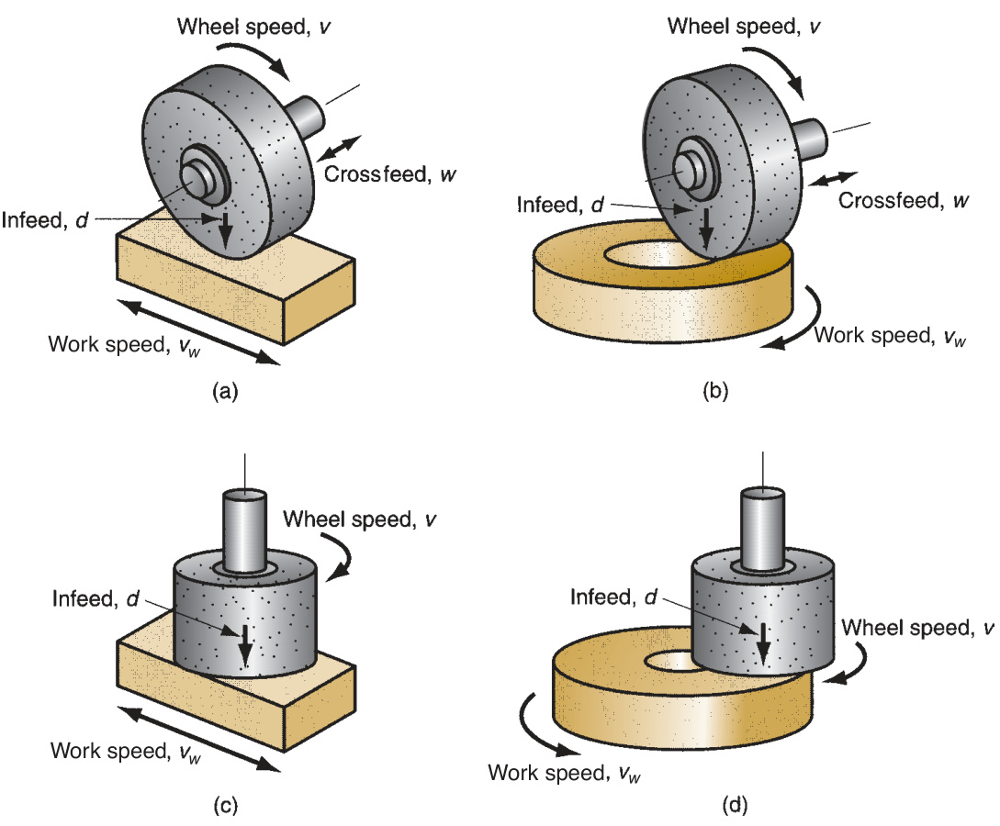  
FIGURE 24.7  Four types  of surface grinding:  (a) horizontal spindle  with reciprocating  worktable, (b) horizontal  spindle with rotating  worktable, (c) vertical  spindle with reciprocating  worktable, and (d) vertical  spindle with rotating  worktable.  

vertically into the work to the desired dimension. This confi  guration is capable of  achieving a very fl  at surface on the work.  

Of the two types of rotary table grinding in Figure 24.7(b) and (d), the vertical  spindle machines are more common. Owing to the relatively large surface contact  area between wheel and work part, vertical spindle-rotary table grinding machines  are capable of high metal removal rates when equipped with appropriate grinding  wheels.  

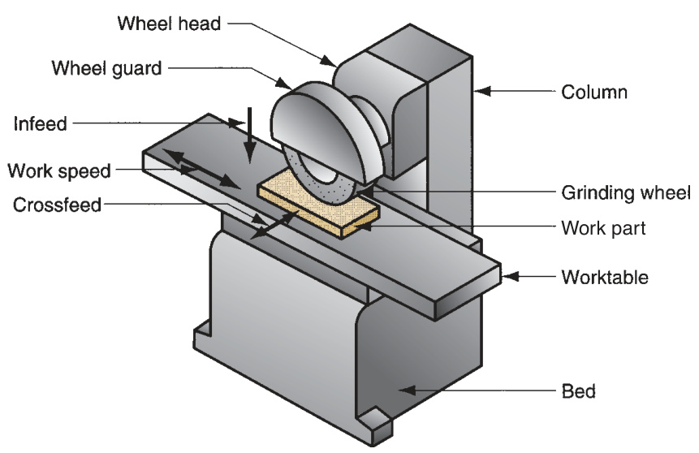  
FIGURE 24.8  Surface  grinder with horizontal  spindle and reciprocating  worktable.  

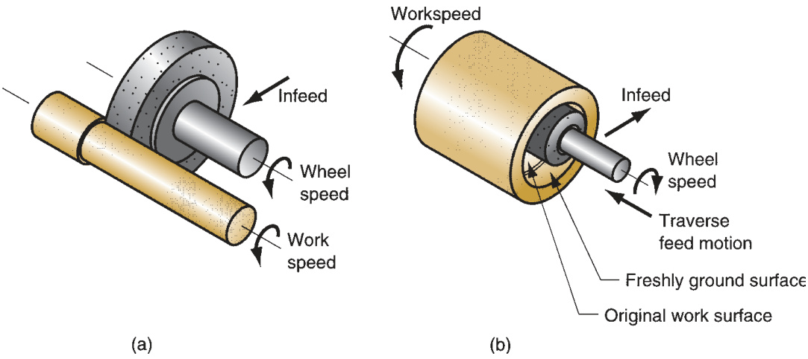  
FIGURE 24.9  Two  types of cylindrical  grinding: (a) external,  and (b) internal.  

Cylindrical Grinding  As its name suggests, cylindrical grinding is used for ro- tational parts. These grinding operations divide into two basic types, Figure 24.9:  (a) external cylindrical grinding and (b) internal cylindrical grinding.  

External cylindrical grinding  (also called  center-type grinding  to distinguish it from  centerless grinding) is performed much like a turning operation. The grinding machines  used for these operations closely resemble a lathe in which the tool post has been  replaced by a high-speed motor to rotate the grinding wheel. The cylindrical workpiece  is rotated between centers to provide a surface speed of $18{-}30\:\mathrm{m/min}$   $(60{-}100\,\mathrm{ft/min})$ )  [16], and the grinding wheel, rotating at  $1200{-}2000\ \mathrm{m/min}$   $(4000{-}6500\ \mathrm{ft/min})$ , is  engaged to perform the cut. There are two types of feed motion possible, traverse feed  and plunge-cut, shown in Figure 24.10. In traverse feed, the grinding wheel is fed in  a direction parallel to the axis of rotation of the work part. The infeed is set within a  range typically from 0.0075 to $0.075\,\mathrm{mm}$  (0.0003–0.003 in). A longitudinal reciprocating  motion is sometimes given to either the work or the wheel to improve surface fi  nish.  In plunge-cut, the grinding wheel is fed radially into the work. Formed grinding wheels  use this type of feed motion.  

External cylindrical grinding is used to fi  nish parts that have been machined  to approximate size and heat treated to desired hardness. The parts include   axles,  

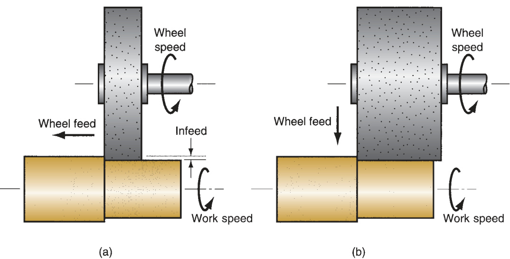  
FIGURE 24.10  Two  types of feed motion  in external cylindrical  grinding: (a) traverse  feed, and (b) plunge-cut.  

crankshafts, spindles, bearings and bushings, and rolls for rolling mills. The grind- ing operation produces the fi  nal size and required surface fi  nish on these hard- ened parts.  

Internal cylindrical grinding  operates somewhat like a boring operation. The  workpiece is usually held in a chuck and rotated to provide surface speeds of  20 to  $60\,\mathrm{\m/min}$  ( $(75{-}200\ \mathrm{ft/min})$ ) [16]. Wheel surface speeds similar to external  cylindrical grinding are used. The wheel is fed in either of two ways: traverse feed,  Figure 24.9(b), or plunge feed. Obviously, the wheel diameter in internal cylindri- cal grinding must be smaller than the original bore hole. This often means that the  wheel diameter is quite small, necessitating very high rotational speeds in order  to achieve the desired surface speed. Internal cylindrical grinding is used to fi  nish  the hardened inside surfaces of bearing races and bushing surfaces.  

Centerless Grinding  Centerless grinding is an alternative process for grinding  external and internal cylindrical surfaces. As its name suggests, the workpiece is  not held between centers. This results in a reduction in work handling time; hence,  centerless grinding is often used for high-production work. The setup for  external  centerless grinding  (Figure 24.11), consists of two wheels: the grinding wheel and a  regulating wheel. The work parts, which may be many individual short pieces or long  rods (e.g.,  $^{3-4}\mathrm{\,m}$  long), are supported by a rest blade and fed through between the  two wheels. The grinding wheel does the cutting, rotating at surface speeds of 1200 to  $1800\;\mathrm{m/min}$  (4000–6000 ft/min). The regulating wheel rotates at much lower speeds  and is inclined at a slight angle $I$ to control throughfeed of the work. The following  equation can be used to predict throughfeed rate, based on inclination angle and  other parameters of the process [16]:  

$$
f_{r}=\pi\,D_{r}\,N_{r}\sin I
$$  

where  $f_{r}\,=$  throughfeed rate,  $\mathrm{mm/min}\ (\mathrm{in/min})$ ;  $D_{r}\,=$  diameter of the regulating  wheel, mm (in); $N_{r}=$  rotational speed of the regulating wheel, rev/min; and $I=$  incli- nation angle of the regulating wheel.  

The typical setup in  internal centerless grinding  is shown in Figure 24.12. In place  of the rest blade, two support rolls are used to maintain the position of the work.  The regulating wheel is tilted at a small inclination angle to control the feed of the  work past the grinding wheel. Because of the need to support the grinding wheel,  throughfeed of the work as in external centerless grinding is not possible. There- fore this grinding operation cannot achieve the same high-production rates as in the  external centerless process. Its advantage is that it is capable of providing very close  

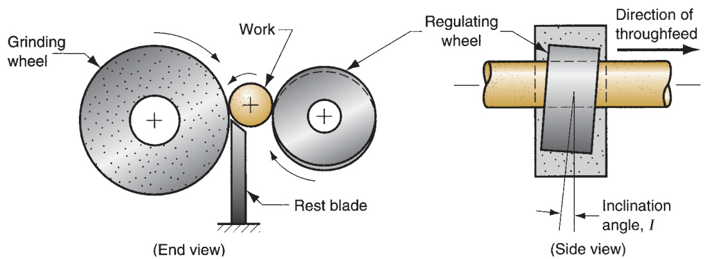  
FIGURE 24.11  External  centerless grinding.  

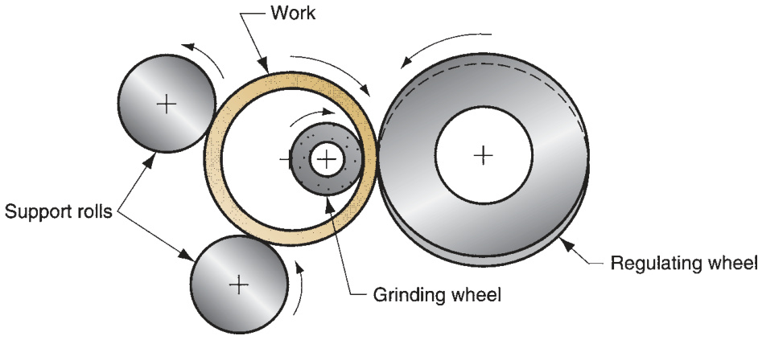  
FIGURE 24.12  Internal  centerless grinding.  

concentricity between internal and external diameters on a tubular part such as a  roller bearing race.  

Creep Feed Grinding  A relatively new form of grinding is creep feed grinding,  developed around 1958. Creep feed grinding is performed at very high depths of cut  and very low feed rates; hence, the name creep feed. The comparison with conven- tional surface grinding is illustrated in Figure 24.13.  

Depths of cut in creep feed grinding are 1000 to 10,000 times greater than in con- ventional surface grinding, and the feed rates are reduced by about the same propor- tion. However, material removal rate and productivity are increased in creep feed  grinding because the wheel is continuously cutting. This contrasts with conventional  surface grinding in which the reciprocating motion of the work results in signifi  cant  lost time during each stroke.  

Creep feed grinding can be applied in both surface grinding and external cylindri- cal grinding. Surface grinding applications include grinding of slots and profi  les. The  process seems especially suited to those cases in which depth-to-width ratios are  relatively large. The cylindrical applications include threads, formed gear shapes, and  other cylindrical components. The term  deep grinding  is used in Europe to describe  these external cylindrical creep feed grinding applications.  

The introduction of grinding machines designed with special features for creep  feed grinding has spurred interest in the process. The features include [11] high static  

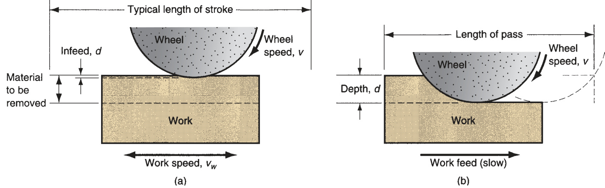  
FIGURE 24.13  Comparison of (a) conventional surface grinding and (b) creep feed grinding.  

and dynamic stability, highly accurate slides, two to three times the spindle power of  conventional grinding machines, consistent table speeds for low feeds, high-pressure  grinding fl  uid delivery systems, and dressing systems capable of dressing the grinding  wheels during the process. Typical advantages of creep feed grinding include (1) high  material removal rates, (2) improved accuracy for formed surfaces, and (3)   reduced  temperatures at the work surface.  

Other Grinding Operations  Several other grinding operations should be briefl  y  mentioned to complete the survey. These include tool grinding, jig grinding, disk  grinding, snag grinding, and abrasive belt grinding.  

Cutting tools are made of hardened tool steel and other hard materials.  Tool  grinders  are special grinding machines of various designs to sharpen and recondi- tion cutting tools. They have devices for positioning and orienting the tools to grind  the desired surfaces at specifi  ed angles and radii. Some tool grinders are general pur- pose while others cut the unique geometries of specifi  c tool types. General-purpose  tool and cutter grinders use special attachments and adjustments to accommodate a  variety of tool geometries. Single-purpose tool grinders include gear cutter sharpeners,  milling cutter grinders of various types, broach sharpeners, and drill point grinders.  

Jig grinders  are grinding machines traditionally used to grind holes in hardened  steel parts to high accuracies. The original applications included pressworking dies  and tools. Although these applications are still important, jig grinders are used to- day in a broader range of applications in which high accuracy and good fi  nish are  required on hardened components. Numerical control is available on modern jig  grinding machines to achieve automated operation.  

Disk grinders  are grinding machines with large abrasive disks mounted on either  end of a horizontal spindle as in Figure 24.14. The work is held (usually manually)  against the fl  at surface of the wheel to accomplish the grinding operation. Some disk  grinding machines have double opposing spindles. By setting the disks at the de- sired separation, the work part can be fed automatically between the two disks and  ground simultaneously on opposite sides. Advantages of the disk grinder are good  fl  atness and parallelism at high production rates.  

The  snag grinder  is similar in confi  guration to a disk grinder. The difference is that  the grinding is done on the outside periphery of the wheel rather than on the side fl  at  surface. The grinding wheels are therefore different in design than those in disk grind- ing. Snag grinding is generally a manual operation, used for rough grinding operations  such as removing the fl  ash from castings and forgings, and smoothing weld joints.  

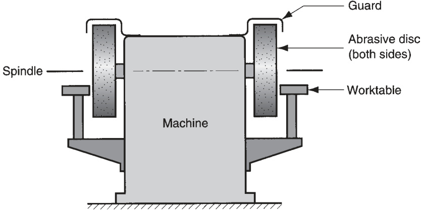  
FIGURE 24.14  Typical  confi  guration of a disc  grinder.  

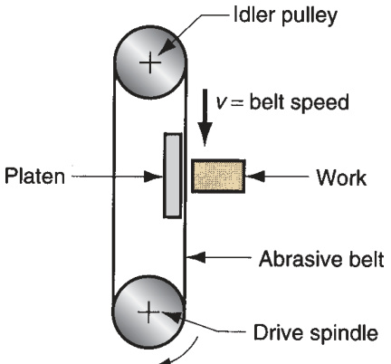  
FIGURE 24.15  Abrasive belt grinding.  

Abrasive belt grinding  uses abrasive particles bonded to a fl  exible (cloth) belt. A  typical setup is illustrated in Figure 24.15. Support of the belt is required when the  work is pressed against it, and this support is provided by a roll or platen located be- hind the belt. A fl  at platen is used for work that will have a fl  at surface. A soft platen  can be used if it is desirable for the abrasive belt to conform to the general contour of  the part during grinding. Belt speed depends on the material being ground; a range  of 750 to  $1700\;\mathrm{m/min}$   $(2500{-}5500\;\mathrm{ft/min})$  is typical [16]. Owing to improvements in  abrasives and bonding materials, abrasive belt grinding is being used increasingly for  heavy stock removal rates, rather than light grinding, which was its traditional ap- plication. The term  belt sanding  refers to the light grinding applications in which the  work part is pressed against the belt to remove burrs and high spots, and to produce  an improved fi  nish quickly by hand.  

#  Related Abrasive Processes  

Other abrasive processes include honing, lapping, superfi  nishing, polishing, and buff- ing. They are used exclusively as fi  nishing operations. The initial part shape is created  by some other process; then the part is fi  nished by one of these operations to achieve  superior surface fi  nish. The usual part geometries and typical surface roughness val- ues for these processes are indicated in Table 24.6. For comparison, corresponding  data for grinding are also presented.  

TABLE  •  24.6  Usual part geometries for honing, lapping, superfi  nishing, polishing,  and buffi  ng. 
  

Another class of fi  nishing operations, called mass fi  nishing (Section 27.1.2), is  used to fi  nish parts in bulk rather than individually. These mass fi  nishing methods  are also used for cleaning and deburring.  

# 24.2.1  HONING  

Honing is an abrasive process performed by a set of bonded abrasive sticks. A com- mon application is to fi  nish the bores of internal combustion engines. Other ap- plications include bearings, hydraulic cylinders, and gun barrels. Surface fi  nishes of  around  $0.12\ \mu\mathrm{m}$  ( $(5~\mu$ -in) or slightly better are typically achieved in these applica- tions. In addition, honing produces a characteristic cross-hatched surface that tends  to retain lubrication during operation of the component, thus contributing to its  function and service life.  

The honing process for an internal cylindrical surface is illustrated in Figure 24.16.  The honing tool consists of a set of bonded abrasive sticks. Four sticks are used on  the tool shown in the fi  gure, but the number depends on hole size. Two to four sticks  would be used for small holes (e.g., gun barrels), and a dozen or more would be used  for larger diameter holes. The motion of the honing tool is a combination of rotation  and linear reciprocation, regulated in such a way that a given point on the abrasive  stick does not trace the same path repeatedly. This rather complex motion accounts  for the cross-hatched pattern on the bore surface. Honing speeds are 15 to  $150~\mathrm{m}/$ min ( $(50{-}500~\mathrm{ft/min})$  [3]. During the process, the sticks are pressed outward against  the hole surface to produce the desired abrasive cutting action. Hone pressures of  1 to  $3\;\mathrm{MPa}$  ( $(150{-}450\;\mathrm{lb/in^{2}})$  are typical. The honing tool is supported in the hole by  two universal joints, thus causing the tool to follow the previously defi  ned hole axis.  Honing enlarges and fi  nishes the hole but cannot change its location.  

Grit sizes in honing range between 30 and 600. The same trade-off between better  fi  nish and faster material removal rates exists in honing as in grinding. The amount  of material removed from the work surface during a honing operation may be as  much as $0.5\;\mathrm{mm}$  (0.020 in), but is usually much less than this. A cutting fl  uid must be  used in honing to cool and lubricate the tool and to help remove the chips.  

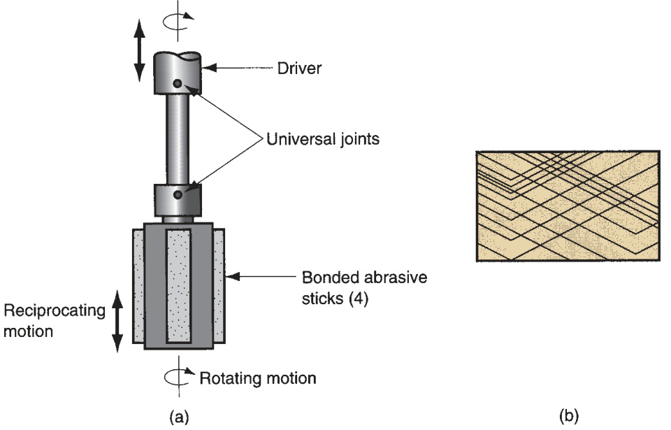  
FIGURE 24.16  The  honing process: (a) the  honing tool used for  internal bore surface,  and (b) cross-hatched  surface pattern created  by the action of the  honing tool.  

# 24.2.2  LAPPING  

Lapping is an abrasive process used to produce surface fi  nishes of extreme accuracy  and smoothness. It is used in the production of optical lenses, metallic bearing sur- faces, gages, and other parts requiring very good fi  nishes. Metal parts that are subject  to fatigue loading or surfaces that must be used to establish a seal with a mating part  are often lapped.  

Instead of a bonded abrasive tool, lapping uses a fl  uid suspension of very small  abrasive particles between the workpiece and the lapping tool. The process is illus- trated in Figure 24.17 as applied in lens-making. The fl  uid with abrasives is referred  to as the  lapping compound  and has the general appearance of a chalky paste. The  fl  uids used to make the compound include oils and kerosene. Common abrasives are  aluminum oxide and silicon carbide with typical grit sizes between 300 and 600. The  lapping tool is called a  lap , and it has the reverse of the desired shape of the work  part. To accomplish the process, the lap is pressed against the work and moved back  and forth over the surface in a fi  gure-eight or other motion pattern, subjecting all  portions of the surface to the same action. Lapping is sometimes performed by hand,  but lapping machines accomplish the process with greater consistency and effi  ciency.  

Materials used to make the lap range from steel and cast iron to copper and lead.  Wood laps have also been made. Because a lapping compound is used rather than  a bonded abrasive tool, the mechanism by which this process works is somewhat  different than grinding and honing. It is hypothesized that two alternative cutting  mechanisms are at work in lapping [3]. The fi  rst mechanism is that the abrasive par- ticles roll and slide between the lap and the work, with very small cuts occurring in  both surfaces. The second mechanism is that the abrasives become imbedded in the  lap surface and the cutting action is very similar to grinding. It is likely that lapping  is a combination of these two mechanisms, depending on the relative hardnesses of  the work and the lap. For laps made of soft materials, the embedded grit mechanism  is emphasized; and for hard laps, the rolling and sliding mechanism dominates.  

# 24.2.3  SUPERFINISHING  

Superfi  nishing is an abrasive process similar to honing. Both processes use a bond- ed abrasive stick moved with a reciprocating motion and pressed against the sur- face to be fi  nished. Superfi  nishing differs from honing in the following respects  [4]: (1) the strokes are shorter, $5\:\mathrm{mm}$  (3/16 in); (2) higher frequencies are used, up  to 1500 strokes per minute; (3) lower pressures are applied between the tool and  the surface, below $0.28\;\mathrm{MPa}$   $(40\,|\mathbf{b}/\mathrm{in}^{2})$ ; (4) workpiece speeds are lower, $15~\mathrm{m/min}$   $(50~\mathrm{ft/min})$  or less; and (5) grit sizes are generally smaller. The relative motion  between the abrasive stick and the work surface is varied so that individual grains  do not retrace the same path. A cutting fl  uid is used to cool the work surface and  FIGURE 24.17  The  lapping process in  lens-making.  

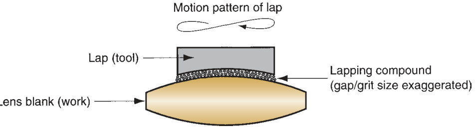  

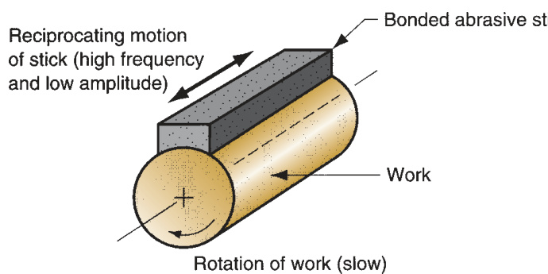  

wash away chips. In addition, the fl  uid tends to separate the abrasive stick from  the work surface after a certain level of smoothness is achieved, thus preventing  further cutting action. The result of these operating conditions is mirror-like fi  n- ishes with surface roughness values around  $0.025\;\mu\mathrm{m}$  ( $1\;\mu$ -in). Superfi  nishing can  be used to fi  nish fl  at and external cylindrical surfaces. The process is illustrated in  Figure 24.18 for the latter geometry.  

# 24.2.4  POLISHING AND BUFFING  

Polishing is used to remove scratches and burrs and to smooth rough surfaces by  means of abrasive grains attached to a polishing wheel rotating at high speed— around $2300~\mathrm{m/min}$   $(7500~\mathrm{ft/min})$ ). The wheels are made of canvas, leather, felt, and  even paper; thus, the wheels are somewhat fl  exible. The abrasive grains are glued to  the outside periphery of the wheel. After the abrasives have been worn down and  used up, the wheel is replenished with new grits. Grit sizes of 20 to 80 are used for  rough polishing, 90 to 120 for fi  nish polishing, and above 120 for fi  ne fi  nishing. Pol- ishing operations are often accomplished manually.  

Buffi  ng  is similar to polishing in appearance, but its function is different. Buffi  ng is  used to provide attractive surfaces with high luster. Buffi  ng wheels are made of mate- rials similar to those used for polishing wheels—leather, felt, cotton, etc.—but buffi  ng  wheels are generally softer. The abrasives are very fi  ne and are contained in a buffi  ng  compound that is pressed into the outside surface of the wheel while it rotates. This  contrasts with polishing in which the abrasive grits are glued to the wheel surface. As  in polishing, the abrasive particles must be periodically replenished. Buffi  ng is usually  done manually, although machines have been designed to perform the process auto- matically. Speeds are generally 2400 to  $5200\:\mathrm{m/min}$  (8000–17,000 ft/min).  

# References  

[1] Andrew, C., Howes, T. D., and Pearce, T. R. A.  Creep Feed Grinding . Holt, Rinehart and Win- ston, London, 1985.

  [2]  ANSI Standard B74.13-1977 , “Markings for  Identifying Grinding Wheels and Other   Bonded  Abrasives.” American National Standards Insti- tute, New York, 1977.  

[3] Armarego, E. J. A., and Brown, R. H.  The Ma- chining of Metals . Prentice-Hall, Englewood  Cliffs, New Jersey, 1969.  