# Part X   Manufacturing  Systems  

#  

# Chapter Contents  

# 37.1 Automation Fundamentals  

37.1.1 Three Components of an Automated  System

 37.1.2 Types of Automation  

# 37.2 Hardware for Automation  

37.2.1 Sensors

 37.2.2 Actuators

 37.2.3 Interface Devices

 37.2.4 Process Controllers  

# 37.3 Computer Numerical Control  

37.3.1 The Technology of Numerical Control

 37.3.2 Analysis of NC Positioning Systems

 37.3.3 NC Part Programming

 37.3.4 Applications of Numerical Control  

# 37.4 Industrial Robotics  

37.4.1 Robot Anatomy

 37.4.2 Control Systems and Robot Programming

 37.4.3 Applications of Industrial Robots  

This part of the book describes the manufacturing sys- tems that are commonly used to implement the pro- duction and assembly processes discussed in preceding  chapters. A  manufacturing system  can be defi  ned as  a collection of integrated equipment and human re- sources that performs one or more processing and/or  assembly operations on a starting work material, part,  or set of parts. The integrated equipment consists of  production machines, material handling and position- ing devices, and computer systems. Human resources  are required either full-time or part-time to keep the  equipment operating. The position of the manufactur- ing systems in the larger production system is shown in  Figure 37.1. As the diagram indicates, the manufactur- ing systems are located in the factory. They accomplish  the value-added work on the part or product.  

Manufacturing systems include both automated and  manually operated systems. The distinction between the  two categories is not always clear, because many manu- facturing systems consist of both automated and manu- al work elements (e.g., a machine tool that operates on  a semiautomatic processing cycle but must be loaded  and unloaded each cycle by a human worker). The cov- erage includes both categories and is organized into  

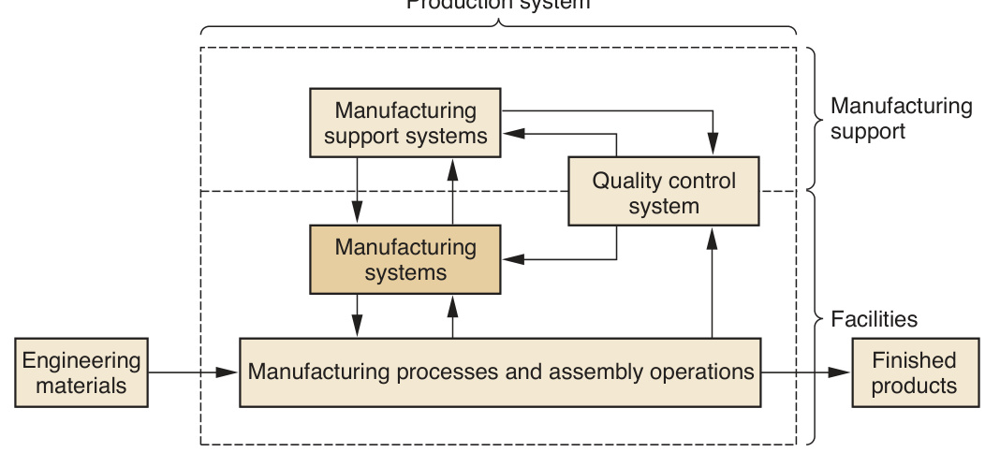  
FIGURE 37.1  The position of the  manufacturing systems  in the larger production  system.  

two chapters: Chapter 37 on automation technologies and Chapter 38 on integrated  manufacturing systems. Chapter 37 provides an introductory treatment of automa- tion technology and the components that make up an automated system. Also, two  important automation technologies used in manufacturing are described: numerical  control and industrial robotics. Chapter 38 examines how these automation technol- ogies are integrated into more sophisticated manufacturing systems. Topics include  production lines, cellular manufacturing, fl  exible manufacturing systems, and com- puter integrated manufacturing. A more detailed discussion of the topics in these  two chapters can be found in [5].  

#  Automation Fundamentals  

Automation can be defi  ned as the technology by which a process or procedure is  performed without human assistance. Humans may be present as observers or even  participants, but the process itself operates under its own self-direction. Automation  is implemented by means of a control system that executes a program of instruc- tions. To automate a process, power is required to operate the control system and to  drive the process itself.  

# 37.1.1 THREE COMPONENTS OF AN AUTOMATED SYSTEM  

As indicated above, an automated system consists of three basic components: (1)  power, (2) a program of instructions, and (3) a control system to carry out the in- structions. The relationship among these components is shown in Figure 37.2.  

The form of power used in most automated systems is electrical. The advantages  of electrical power include that it (1) is widely available, (2) can be readily converted  FIGURE 37.2  Elements of an auto- mated system:  (1) power, (2) program  of instructions, and  (3) control system.  

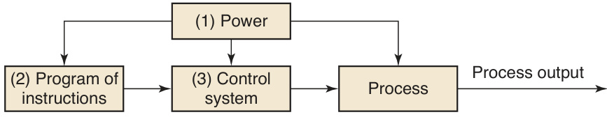  

to other forms of power such as mechanical, thermal, or hydraulic, (3) can be used at  very low power levels for functions such as signal processing, communication, data  storage, and data processing, and (4) can be stored in long-life batteries [5].  

In a manufacturing process, power is required to accomplish the activities associ- ated with the particular process. Examples of these activities include (1) melting a  metal in a casting operation, (2) driving the motions of a cutting tool relative to a  workpiece in a machining operation, and (3) pressing and sintering parts in a powder  metallurgy process. Power is also used to accomplish any material handling activities  needed in the process, such as loading and unloading parts, if these activities are not  performed manually. Finally, power is used to operate the control system.  

The activities in an automated process are determined by a program of instruc- tions. In the simplest automated processes, the only instruction may be to maintain  a certain controlled variable at a specifi  ed level, such as regulating the temperature  in a heat treatment furnace. In more complex processes, a sequence of activities is  required during the work cycle, and the order and details of each activity are de- fi  ned by the program of instructions. Each activity involves changes in one or more  process parameters, such as changing the  $x$ -coordinate position of a machine tool  worktable, opening or closing a valve in a fl  uid fl  ow system, or turning a motor on or  off. Process parameters are inputs to the process. They may be continuous (continu- ously variable over a given range, such as the $x$ -position of a worktable) or discrete  (On or Off). Their values affect the outputs of the process, which are called process  variables. Like process parameters, process variables can be continuous or discrete.  Examples include the actual position of the machine worktable, the rotational speed  of a motor shaft, or whether a warning light is on or off. The program of instruc- tions specifi  es the changes in process parameters and when they should occur dur- ing the work cycle, and these changes determine the resulting values of the process  variables. For example, in computer numerical control, the program of instructions  is called a part program. The part program specifi  es the individual sequence of steps  required to machine a given part, including worktable and cutter positions, cutting  speeds, feeds, and other details of the operation.  

In some automated processes, the work cycle program must contain instruc- tions for making decisions or reacting to unexpected events during the work  cycle. Examples of situations requiring this kind of capability include (1) variations  in raw materials that require adjusting certain process parameters to compensate,  (2) interactions and communications with humans such as responding to requests  for system status information, (3) safety monitoring requirements, and (4) equip- ment malfunctions.  

The program of instructions is executed by a control system, the third basic com- ponent of an automated system. Two types of control system can be distinguished:  closed loop and open loop. A  closed-loop system , also known as a  feedback control  system , is one in which the process variable of interest (output of the process) is  compared with the corresponding process parameter (input to the process), and any  difference between them is used to drive the output value into agreement with the  input. Figure 37.3(a) shows the six elements of a closed loop system: (1) input pa- rameter, (2) process, (3) output variable, (4) feedback sensor, (5) controller, and (6)  actuator. The input parameter represents the desired value of the output variable.  The process is the operation or activity being controlled; more specifi  cally, the out- put variable is being controlled by the system. A sensor is used to measure the out- put variable and feed back its value to the controller, which compares output with  input and makes the required adjustment to reduce any difference. The adjustment  

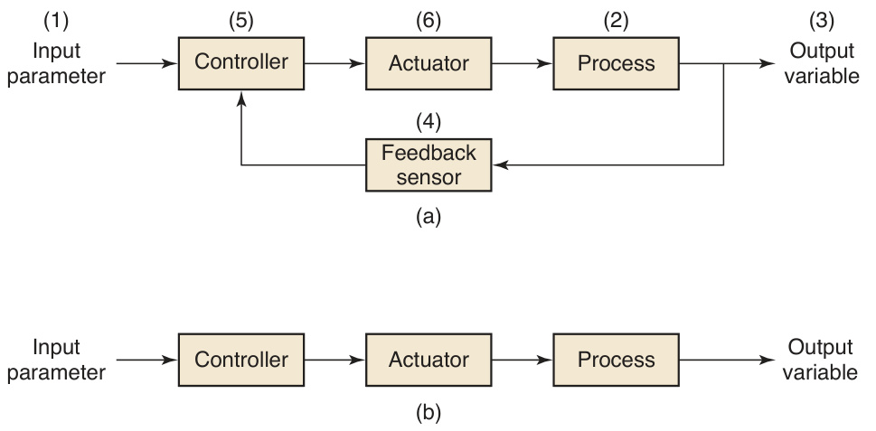  
FIGURE 37.3  Two basic types of  control systems:  (a) closed loop and  (b) open loop.  

is made by means of one or more actuators, which are hardware devices that physi- cally accomplish the control actions.  

The other type of control system is an open-loop system, presented in Fig- ure 37.3(b). As shown in the diagram, an  open-loop system  executes the program  of instructions without a feedback loop. No measurement of the output variable is  made, so there is no comparison between output and input in an open loop system.  In effect, the controller relies on the expectation that the actuator will have the  intended effect on the output variable. Thus, there is always a risk in an open-loop  system that the actuator will not function properly or that its actuation will not have  the expected effect on the output. On the other hand, the advantage of an open-loop  system is that its cost is less than a comparable closed-loop system.  

# 37.1.2  TYPES OF AUTOMATION  

Automated systems used in manufacturing can be classifi  ed into three basic types:  (1) fi  xed automation, (2) programmable automation, and (3) fl  exible automation.  

Fixed Automation   In fi  xed automation, the processing or assembly steps and  their sequence are fi  xed by the equipment confi  guration. The program of instruc- tions is determined by the equipment design and cannot be easily changed. Each  step in the sequence usually involves a simple action, such as feeding a rotating spin- dle along a linear trajectory. Although the work cycle consists of simple operations,  integrating and coordinating the actions can result in the need for a rather sophisti- cated control system, and computer control is often required.  

Typical features of fi  xed automation include (1) high initial investment for spe- cialized equipment, (2) high production rates, and (3) little or no fl  exibility to accom- modate product variety. Automated systems with these features can be justifi  ed for  parts and products that are produced in very large quantities. The high investment  cost can be spread over many units, thus making the cost per unit relatively low com- pared to alternative production methods. The automated production lines discussed  in the following chapter are examples of fi  xed automation.  

Programmable Automation   As its name suggests, the equipment in pro- grammable automation is designed with the capability to change the program of  instructions to allow production of different parts or products. New programs can be  prepared for new parts, and the equipment can read each program and execute the  encoded instructions. Thus the features that characterize programmable automation  are (1) high investment in general purpose equipment that can be reprogrammed,  (2) lower production rates than fi  xed automation, (3) ability to cope with product  variety by reprogramming the equipment, and (4) suitability for batch production  of various part or product styles. Examples of programmable automation include  computer numerical control and industrial robotics, discussed in Sections 37.3 and  37.4, respectively.  

Flexible Automation   Suitability for batch production is mentioned as one of the  features of programmable automation. As discussed in Chapter 1, the disadvantage  of batch production is that lost production time occurs between batches due to  equipment and/or tooling changeovers that are required to accommodate the next  batch. Thus, programmable automation usually suffers from this disadvantage. Flex- ible automation is an extension of programmable automation in which there is virtu- ally no lost production time for setup changes and/or reprogramming. Any required  changes in the program of instructions and/or setup can be accomplished quickly;  that is, within the time needed to move the next work unit into position at the ma- chine. A fl  exible system is therefore capable of producing a mixture of different  parts or products one right after the other instead of in batches. Features usually  associated with fl  exible automation include (1) high investment cost for custom- engineered equipment, (2) medium production rates, and (3) continuous production  of different part or product styles.  

Using terminology developed in Chapter 1, one might say that fi  xed automation  is applicable in situations of hard product variety, programmable automation is ap- plicable to medium product variety, and fl  exible automation can be used for soft  product variety.  

#  Hardware for Automation  

Automation and process control are implemented using various hardware devices  that interact with the production operation and associated processing equipment.  Sensors are required to measure the process variables. Actuators are used to drive  the process parameters. And various additional devices are needed to interface the  sensors and actuators with the process controller, which is usually a digital computer.  

# 37.2.1  SENSORS  

A sensor is a device that converts a physical stimulus or variable of interest (e.g.,  temperature, force, pressure, or other characteristic of the process) into a more con- venient physical form (e.g., electrical voltage) for the purpose of measuring the vari- able. The conversion allows the variable to be interpreted as a quantitative value.  

Sensors of various types are available to collect data for feedback control in man- ufacturing automation. They are often classifi  ed according to type of stimulus; thus,  there are mechanical, electrical, thermal, radiation, magnetic, and chemical variables.  Within each category, multiple variables can be measured. For example, within the  mechanical category, the physical variables include position, velocity, force, torque,  and many others. Electrical variables include voltage, current, and resistance. And so  on for the other major categories.  

In addition to type of stimulus, sensors are also classifi  ed as analog or discrete. An  analog   sensor  measures a continuous analog variable and converts it into a continu- ous signal such as electrical voltage. Thermocouples, strain gages, and ammeters are  examples of analog sensors. A  discrete sensor  produces a signal that can have only a  limited number of values. Within this category, there are binary sensors and digital  sensors. A  binary sensor  can take on only two possible values, such as off and on, or 0  and 1. Limit switches operate this way. A  digital sensor  produces a digital output sig- nal, either in the form of parallel status bits, such as a photoelectric sensor array) or a  series of pulses that can be counted, such as an optical encoder. Digital sensors have  an advantage that they can be readily interfaced to a digital computer, whereas the  signals from analog sensors must be converted to digital to be read by the computer.  

lus and the value of the signal produced by the sensor. This input/output relationship  is called the sensor’s  transfer function , which can be expressed as:  

$$
S=f(s)
$$
 )  

where  $S=$  the output signal of the sensor (typically voltage),  $s=$  the stimulus or  input, and  $f(s)$  is the functional relationship between them. The ideal form for an  analog sensor is a proportional relationship:  

$$
S=C+m s
$$  

where  $C\,=$  the value of the sensor output when the stimulus value is zero, and  $m=$  the constant of proportionality between $s$  and  S . The constant $m$  indicates how  much the output  $S$  is affected by the input  $s$ . This is referred to as the  sensitivity  of  the measuring device. For example, a standard Chromel/Alumel thermocouple pro- duces 40.6 microvolts per degree $^{\circ}\mathrm{C}$  change in temperature.  

A binary sensor (e.g., limit switch, photoelectric switch) exhibits a binary relation- ship between stimulus and sensor output:  

$$
S=1\;{\mathrm{if}}\;s>0\;{\mathrm{and}}\;S=0\;{\mathrm{if}}\;s\leq0
$$  

Before a measuring device can be used, it must be calibrated, which basically  means determining the transfer function of the sensor; specifi  cally, how is the value  of the stimulus $s$  determined from the value of the output signal  $S?$  Ease of calibra- tion is one criterion by which a measuring device can be selected. Other criteria  include accuracy, precision, operating range, speed of response, reliability and cost.  

# 37.2.2  ACTUATORS  

In automated systems, an actuator is a device that converts a control signal into a  physical action, which usually refers to a change in a process input parameter. The  action is typically mechanical, such as a change in position of a worktable or rota- tional speed of a motor. The control signal is generally a low level signal, and an  amplifi  er may be required to increase the power of the signal to drive the actuator.  

Actuators can be classifi  ed according to type of amplifi  er as (1) electrical, (2)  hydraulic, or (3) pneumatic. Electrical actuators include AC and DC electric mo- tors, stepper motors, and solenoids. The operations of two types of electric motors  (servomotors and stepper motors) are described in Section 37.3.2, which deals with  the analysis of positioning systems. Hydraulic actuators utilize hydraulic fl  uid to am- plify the control signal and are often specifi  ed when large forces are required in the  application. Pneumatic actuators are driven by compressed air, which is commonly  used in factories. All three actuator types are available as linear or rotational devices.  This designation distinguishes whether the output action is a linear motion or a ro- tational motion. Electric motors and stepper motors are more common as rotational  actuators, whereas most hydraulic and pneumatic actuators provide a linear output.  

# 37.2.3  INTERFACE DEVICES  

Interface devices allow the process to be connected to the computer controller and  vice versa. Sensor signals from the manufacturing process are fed into the compu- ter, and command signals are sent to actuators that operate the process. This section  describes the hardware devices that enable this communication between the proc- ess and the controller. The devices include analog–to–digital converters, digital–to–  analog converters, contact input/output interfaces, and pulse counters and generators.  

Continuous analog signals from sensors attached to the process must be trans- formed into digital values that can be used by the control computer, a function that  is accomplished by an  analog-to-digital converter  (ADC). As illustrated in Figure  37.4, an ADC (1) samples the continuous signal at periodic intervals, (2) converts  the sampled data into one of a fi  nite number of defi  ned amplitude levels, and (3)  encodes each amplitude level into a sequence of binary digits that can be inter- preted by the control computer. Important characteristics of an analog-to-digital  converter include sampling rate and resolution. Sampling rate is the frequency with  which the continuous signal is sampled. A faster sampling rate means that the actual  form of the continuous signal can be more closely approximated. Resolution refers  to the precision with which the analog value can be converted into binary code. This  depends on the number of bits used in the encoding procedure, the more bits, the  higher the resolution. Unfortunately, using more bits requires more time to make  the conversion, which can impose a practical limit on the sampling rate.  

A  digital-to-analog converter  (DAC) accomplishes the reverse process of the  ADC. It converts the digital output of the control computer into a quasi-continuous  signal capable of driving an analog actuator or other analog device. The DAC per- forms its function in two steps: (1) decoding, in which the sequence of digital out- put values is transformed into a corresponding series of analog values at discrete  time intervals, and (2) data holding, in which each analog value is changed into a  continuous signal during the duration of the time interval. In the simplest case, the  

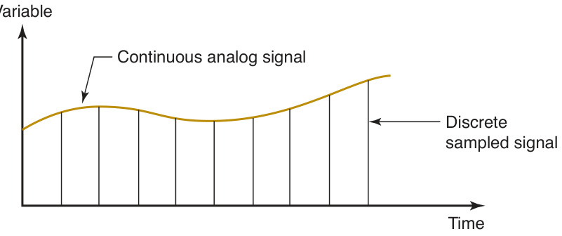  
FIGURE 37.4  An  analog-to-digital  converter works by  converting a continu- ous analog signal into  a series of discrete  sampled data.  

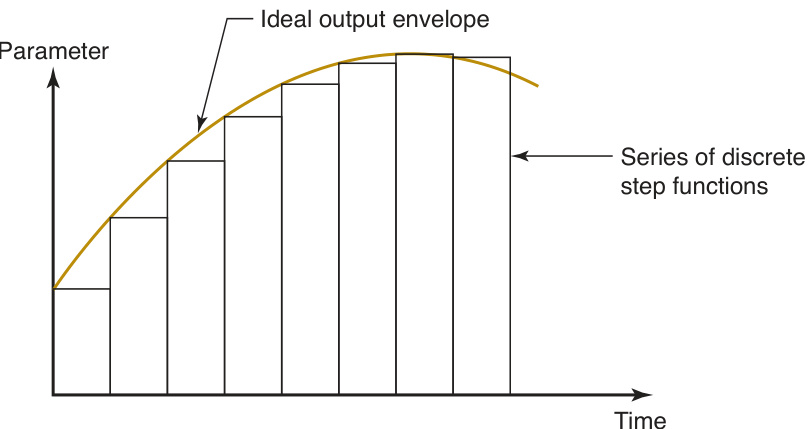  
FIGURE 37.5  An analog-to-digital  converter works by  converting a continu- ous analog signal into  a series of discrete  sampled data.  

continuous signal consists of a series of step functions, as in Figure 37.5, which are  used to drive the analog actuator.  

Many automated systems operate by turning on and off motors, switches, and  other devices to respond to conditions and as a function of time. These control de- vices use binary variables. They can have either of two possible values, 1 or 0, inter- preted as ON or OFF, object present or not present, high or low voltage level, and so  on. Binary sensors commonly used in process control systems include limit switches  and photocells. Common binary actuators solenoids, valves, clutches, lights, control  relays, and certain motors.  

Contact input/output interfaces  are components used to communicate binary  data back and forth between the process and the control computer. A  contact in- put interface  is a device that reads binary data into the computer from an external  source. It consists of a series of binary electrical contacts that indicate the status  of a binary device such as a limit switch attached to the process. The status of each  contact is periodically scanned by the computer to update values used by the control  program. A  contact output interface  is a device used to communicate on/off signals  from the computer to external binary components such as solenoids, alarms, and  indicator lights. It can also be used to turn on and off constant speed motors.  

As mentioned earlier, discrete data sometimes exist in the form of a series of  pulses. For example, an optical encoder (Section 37.3.2) emits its measurement of  position and velocity as a series of pulses. A  pulse counter  is a device that converts a  series of pulses from an external source into a digital value, which is entered into the  control computer. In addition to reading the output of an optical encoder, applica- tions of pulse counters include counting the number of parts fl  owing along a convey- or past a photoelectric sensor. The opposite of a pulse counter is a  pulse generator ,  a device that produces a series of electrical pulses based on digital values generated  by a control computer. Both the number and frequency of the pulses are controlled.  An important pulse generator application is to drive stepper motors, which respond  to each step by rotating through a small incremental angle, called a step angle.  

# 37.2.4 PROCESS CONTROLLERS  

Most process control systems use some type of digital computer as the controller.  Whether control involves continuous or discrete parameters and variables, or a  combination of continuous and discrete, a digital computer can be connected to the  

process to communicate and interact with it using the interface devices discussed in  Section 37.2.3. Requirements generally associated with real-time computer control  include the following:  

➢   The capability of the computer to respond to incoming signals from the proc- ess and if necessary, to interrupt execution of a current program to service the  incoming signal. 

 $\succcurlyeq$ The capability to transmit commands to the process that are implemented by  means of actuators connected to the process. These commands may be the re- sponse to incoming signals from the process. 

 $\succcurlyeq$ The capability to execute certain actions at specifi  c points in time during process  operation.

 $\succcurlyeq$ The capability to communicate and interact with other computers that may be  connected to the process. The term  distributed process control  is used to de- scribe a control system in which multiple microcomputers are used to share the  process control workload.

 $\succcurlyeq$ The capability to accept input from operating personnel for purposes such as  entering new programs or data, editing existing programs, and stopping the  process in an emergency.  

A widely used process controller that satisfi  es these requirements is a program- mable logic controller. A  programmable logic controller  (PLC) is a microcomputer- based controller that uses stored instructions in programmable memory to implement  logic, sequencing, timing, counting, and arithmetic control functions, through digital  or analog input/output modules, for controlling various machines and processes. The  major components of a PLC, shown in Figure 37.6, are (1)  input and output   modules ,  which connect the PLC to the industrial equipment to be controlled; (2)  processor  —  the central processing unit (CPU), which executes the logic and sequencing functions  to control the process by operating on the input signals and determining the proper  output signals specifi  ed by the control program; (3)  PLC memory , which is connected  to the processor and contains the logic and sequencing instructions; (4)  power supply

 $-\,115\,\mathrm{V}\,\mathrm{AC}$  is typically used to drive the PLC. In addition, (5) a  programming device

 (usually detachable) is used to enter the program into the PLC.  

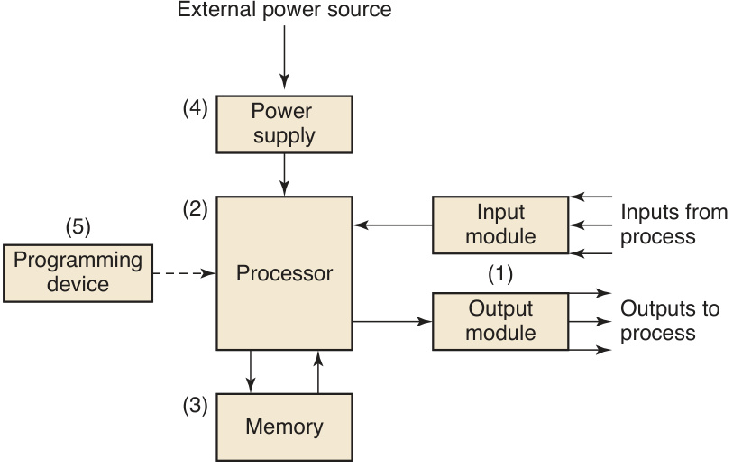  
FIGURE 37.6  Major components of  a programmable logic  controller.  

Programming involves entry of the control instructions to the PLC using the pro- gramming device. The most common control instructions include logical operations,  sequencing, counting, and timing. Many control applications require additional in- structions for analog control, data processing, and computations. A variety of PLC  programming languages have been developed, ranging from ladder logic diagrams  to structured text. A discussion of these languages is beyond the scope of this text,  and the interested reader should consult the end-of-chapter references.  

Advantages associated with programmable logic controllers include (1) pro- gramming a PLC is easier than wiring a relay control panel; (2) PLCs can be repro- grammed, whereas conventional hard-wired controls must be rewired and are often  scrapped instead because of the diffi  culty in rewiring; (3) a PLC can be interfaced  with the plant computer system more readily than conventional controls; (4) PLCs  require less fl  oor space than relay controls, and (5) PLCs offer greater reliability and  easier maintenance.  

#  Computer Numerical Control  

Numerical control (NC) is a form of programmable automation in which the me- chanical actions of a piece of equipment are controlled by a program containing  coded alphanumeric data. The data represent relative positions between a work  head and a work part. The work head is a tool or other processing element, and the  work part is the object being processed. The operating principle of NC is to control  the motion of the work head relative to the work part and to control the sequence in  which the motions are carried out. The fi  rst application of numerical control was in  machining (Historical Note 37.1), and this is still an important application area. NC  machine tools are shown in Figures 21.26 and 21.27.  

# Historical Note 37.1  Numerical control   [3], [5]  

The initial development work on numerical control is  credited to John Parsons and Frank Stulen at the Parsons  Corporation in Michigan in the late 1940s. Parsons was  a machining contractor for the Air Force and had devised  a means of using numerical coordinate data to move the  worktable of a milling machine for producing complex  parts for aircraft. On the basis of Parson’s work, the U.S.  Air Force awarded a contract to the company in 1949 to  study the feasibility of the new control concept for ma- chine tools. The project was subcontracted to the Mas- sachusetts Institute of  Technology to develop a prototype  machine tool that utilized the new numerical data prin- ciple. The M.I.T . study confi  rmed that the concept was  feasible and proceeded to adapt a three-axis vertical mill- ing machine using combined analog-digital controls. The  name  numerical control  (NC) was given to the system  by which the machine tool motions were accomplished.  The prototype machine was demonstrated in 1952.  

The accuracy and repeatability of the NC  system was far better than the manual machining  methods then available. The potential for reduc- ing nonproductive time in the machining cycle was  also apparent. In 1956, the Air Force sponsored the  development of NC machine tools at several differ- ent companies. These machines were placed in op- eration at various aircraft plants between 1958 and  1960. The advantages of NC soon became clear, and  aerospace companies began placing orders for new  NC machines.  

The importance of part programming was clear  from the start. The Air Force continued to encourage  the development and application of NC by sponsoring  research at M.I.T . for a part programming language to  control NC machines. This research resulted in the de- velopment of  APT  in 1958 (APT stands for Automati- cally Programmed Tooling). APT is a part programming  language by which a user could write the machining  instructions in simple English-like statements, and the  statements were coded to be interpreted by the NC  system.  

# 37.3.1  THE TECHNOLOGY OF NUMERICAL CONTROL  

This section defi  nes the components of a numerical control system and describes the  coordinate axis system and motion controls.  

Components of an NC System  A numerical control system consists of three basic  components: (1) part program, (2) machine control unit, and (3) processing equip- ment. The  part program  (the term commonly used in machine tool technology) is the  detailed set of commands to be followed by the processing equipment. It is the pro- gram of instructions in the NC control system. Each command specifi  es a position or  motion that is to be accomplished by the work head relative to the work part. A posi- tion is defi  ned by its $x$ -y-z  coordinates. In machine tool applications, additional details  in the NC program include spindle rotation speed, spindle direction, feed rate, tool  change instructions, and other commands related to the operation. The part program  is prepared by a  part programmer , a person who is familiar with the details of the pro- gramming language and also understands the technology of the processing equipment.  

The  machine control unit  (MCU) in modern NC technology is a microcomputer  that stores and executes the program by converting each command into actions by the  processing equipment, one command at a time. The MCU consists of both hardware  and software. The hardware includes the microcomputer, components to interface with  the processing equipment, and certain feedback control elements. The software in the  MCU includes control system software, calculation algorithms, and translation soft- ware to convert the NC part program into a usable format for the MCU. The MCU  also permits the part program to be edited in case the program contains errors, or  changes in cutting conditions are required. Because the MCU is a computer, the term  computer numerical control  (CNC) is often used to distinguish this type of NC from  its technological predecessors that were based entirely on hard-wired electronics.  

The  processing equipment  accomplishes the sequence of processing steps to  transform the starting work part into a completed part. It operates under the control  of the MCU according to the instructions in the part program. The variety of appli- cations and processing equipment are surveyed in Section 37.3.4.  

Coordinate System and Motion Control in NC   A standard coordinate axis  system is used to specify positions in numerical control. The system consists of the  three linear axes  $(x,y,z)$  of the Cartesian coordinate system, plus three rotational  axes  $(a,b,c)$ , as shown in Figure 37.7(a). The rotational axes are used to rotate the  

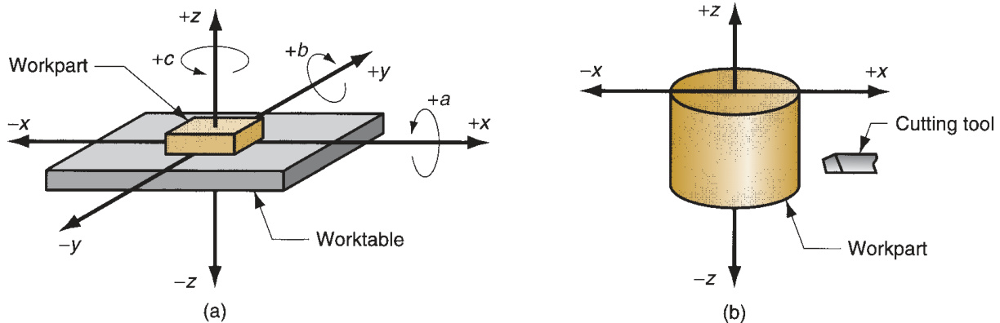  
FIGURE 37.7  Coordinate systems used in numerical control: (a) for fl  at and prismatic work, and (b) for rotational work.  

work part to present different surfaces for machining, or to orient the tool or work  head at some angle relative to the part. Most NC systems do not require all six axes.  The simplest NC systems (e.g., plotters, pressworking machines for fl  at sheet-metal  stock, and component insertion machines) are positioning systems whose locations  can be defi  ned in an $x$ - y  plane. Programming of these machines involves specifying a  sequence of $x$ - y  coordinates. By contrast, some machine tools have fi  ve-axis control  to shape complex work part geometries. These systems typically include three linear  axes plus two rotational axes.  

The coordinates for a rotational NC system are illustrated in Figure 37.7(b). These  systems are associated with turning operations on NC lathes. Although the work ro- tates, this is not one of the controlled axes in a conventional NC turning system. The  cutting path of the tool relative to the rotating workpiece is defi  ned in the  x-z  plane,  as shown in the fi  gure.  

In many NC systems, the relative movements between the processing tool and  the work part are accomplished by fi  xing the part to a worktable and then control- ling the positions and motions of the table relative to a stationary or semi-stationary  work head. Most machine tools and component insertion machines are based on this  method of operation. In other systems, the work part is held stationary and the work  head is moved along two or three axes. Flame cutters,  $x{-}y$  plotters, and coordinate  measuring machines operate in this mode.  

Motion control systems based on NC can be divided into two types: (1) point- to-point and (2) continuous path.  Point-to-point systems , also called  positioning  systems , move the work head (or workpiece) to a programmed location with no  regard for the path taken to get to that location. Once the move is completed, some  processing action is accomplished by the work head at the location, such as drilling  or punching a hole. Thus, the program consists of a series of point locations at which  operations are performed.  

Continuous path systems  provide continuous simultaneous control of more than  one axis, thus controlling the path followed by the tool relative to the part. This per- mits the tool to perform a process while the axes are moving, enabling the system to  generate angular surfaces, two-dimensional curves, or three-dimensional contours in  the work part. This operating scheme is required in drafting machines, certain mill- ing and turning operations, and fl  ame cutting. In machining, continuous path control  also goes by the name  contouring .  

An important aspect of continuous path motion is  interpolation , which is con- cerned with calculating the intermediate points along a path to be followed by  the work head relative to the part. Two common forms of interpolation are linear  and circular.  Linear interpolation  is used for straight line paths, in which the part  programmer specifi  es the coordinates of the beginning point and end point of the  straight line as well as the feed rate to be used. The interpolator then computes the  travel speeds of the two or three axes that will accomplish the specifi  ed trajectory.  Circular interpolation  allows the work head to follow a circular arc by specifying  the coordinates of its beginning and end points together with either the center or  radius of the arc. The interpolator computes a series of small straight line segments  that will approximate the arc within a defi  ned tolerance.  

Another aspect of motion control is concerned with whether the positions in the  coordinate system are defi  ned absolutely or incrementally. In  absolute positioning ,  the work head locations are always defi  ned with respect to the origin of the axis  system. In  incremental positioning , the next work head position is defi  ned relative  to the present location. The difference is illustrated in Figure 37.8.  

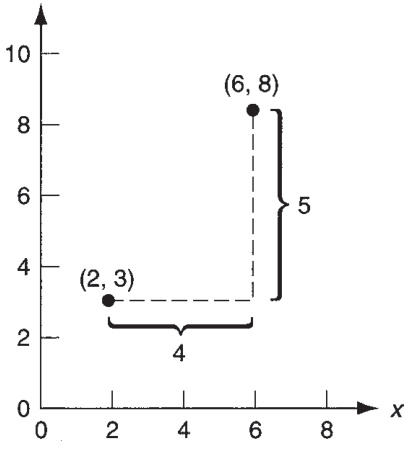  
FIGURE 37.8  Absolute vs. in- cremental positioning. The work  head is at point  $\left(2,3\right)$  and is to be  moved to point (6, 8). In absolute  positioning, the move is specifi  ed  by $x=\mathfrak{6},\bar{\gamma}=\mathfrak{8}$ ; while in incre- mental positioning, the move is  specifi ed by$x={\bar{4}}$,$\gamma=5$.  

# 37.3.2  ANALYSIS OF NC POSITIONING SYSTEMS  

The function of the positioning system is to convert the coordinates specifi  ed in  the NC part program into relative positions between the tool and work part during  processing. Consider how a simple positioning system, shown in Figure 37.9, might  operate. The system consists of a worktable on which a work part is fi  xtured. The  purpose of the table is to move the part relative to a tool or work head. To accom- plish this purpose, the worktable is moved linearly by means of a rotating leadscrew  that is driven by a motor. For simplicity, only one axis is shown in the sketch. To pro- vide $x$ - y  capability, the system shown would be piggybacked on top of a second axis  perpendicular to the fi  rst. The leadscrew has a certain pitch $p$ , $\mathrm{mm}/\AA$ thread (in/thread)  or mm/rev (in/rev). Thus, the table is moved a distance equal to the leadscrew pitch  for each revolution. The velocity at which the worktable moves is determined by the  rotational speed of the leadscrew.  

Two basic types of motion control are used in NC: (a) open loop and (b) closed  loop, as shown in Figure 37.10. The difference is that an open-loop system operates  without verifying that the desired position of the worktable has been achieved. A  closed-loop control system uses feedback measurement to verify that the position of  the worktable is indeed the location specifi  ed in the program. Open-loop systems are  less expensive than closed-loop systems and are appropriate when the force resisting  the actuating motion is minimal, as in point-to-point drilling, for example. Closed- loop systems are normally specifi  ed for machine tools that perform continuous path  operations such as milling or turning, in which the resisting forces can be signifi  cant.  

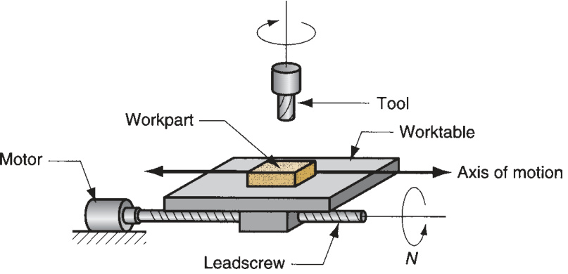  
FIGURE 37.9  Motor  and leadscrew  arrangement in an NC  positioning system.  

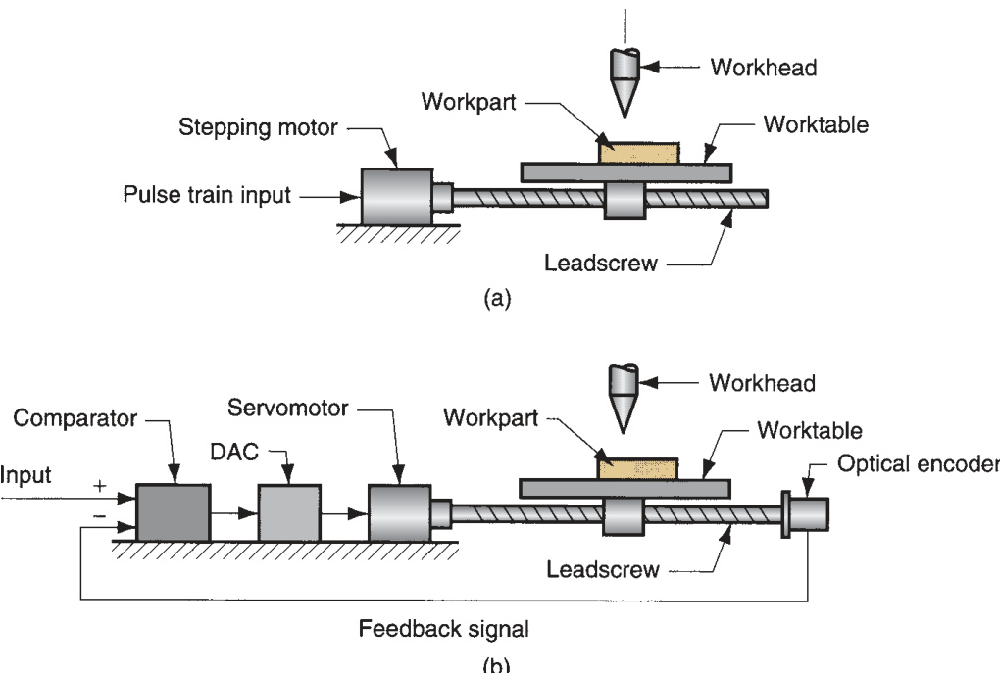  
FIGURE 37.10  Two  types of motion control  in NC: (a) open loop and  (b) closed loop.  

Open-Loop Positioning Systems  To turn the leadscrew, an open-loop  positioning system typically uses a stepping motor (a.k.a. stepper motor). In  NC, the stepping motor is driven by a series of electrical pulses generated by the  machine control unit. Each pulse causes the motor to rotate a fraction of one  revolution, called the step angle. The allowable step angles must conform to the  relationship  

$$
\alpha=\frac{360}{n_{s}}
$$  

where  $\alpha\,=$ step angle, degrees; and  $n_{s}=$  the number of step angles for the motor,  which must be an integer. The angle through which the motor shaft rotates is given  by  

$$
A_{m}=\alpha n_{p}
$$  

where $A_{m}=$  angle of motor shaft rotation, degrees; $n_{p}=$ number of pulses received  by the motor; and  $\alpha\,=$  step angle, here defi  ned as degrees/pulse. Finally, the rota- tional speed of the motor shaft is determined by the frequency of pulses sent to the  motor:  

$$
N_{m}=\frac{60\,\alpha\,f_{p}}{360}
$$  

where $N_{m}=$  speed of motor shaft rotation, $\scriptstyle{\mathrm{rev/min}};f_{p}\;=$ frequency of pulses driving  the stepper motor, $\mathrm{Hz}$  (pulses/sec), the constant 60 converts pulses/sec to pulses/min;  the constant 360 converts degrees of rotation to full revolutions; and  $\alpha=$  step angle  of the motor, as before.  

The motor shaft drives the leadscrew that determines the position and veloc- ity of the worktable. The connection is often designed using a gear reduction to  increase the precision of table movement. However, the angle of rotation and  rotational speed of the leadscrew are reduced by this gear ratio. The relationships  are as follows:  

$$
A_{m}=r_{g}A_{l s}
$$  

and  

$$
N_{m}=r_{g}N_{l s}
$$  

where $A_{m}$  and $N_{m}$  are the angle of rotation, degrees, and rotational speed, rev/min, of  the motor, respectively; $A_{l s}$  and $N_{l s}$  are the angle of rotation, degrees, and rotational  speed, $\mathrm{rev/min}$ , of the leadscrew, respectively; and  $r_{g}=$  gear reduction between the  motor shaft and the leadscrew; for example, a gear reduction of 2 means that the mo- tor shaft rotates through two revolutions for each rotation of the leadscrew.  

The linear position of the table in response to the rotation of the leadscrew de- pends on the leadscrew pitch $p$ , and can be determined as follows:  

$$
x=\frac{p A_{l s}}{360}
$$  

where $x=x$ -axis position relative to the starting position, ${\mathrm{mm~(in)}};p=$ pitch of the  leadscrew, mm/rev (in/rev); and $A_{l s}/360\,=$  the number of revolutions (and partial  revolutions) of the leadscrew. By combining Equations (37.5), (37.7a), and (37.8)  and rearranging, the number of pulses required to achieve a specifi  ed  $x$ -position  increment in a point-to-point system can be found:  

$$
n_{p}=\frac{360r_{g}x}{p\alpha}{=}\frac{r_{g}n_{s}A_{l s}}{360}
$$  

The velocity of the worktable in the direction of the leadscrew axis can be deter- mined as follows:  

$$
\nu_{t}=f_{r}=N_{l s}\,p
$$  

where  $\nu_{t}=$  table travel speed, $\mathrm{mm/min}\ (\mathrm{in/min});f_{r}=$ table feed rate,  $\mathrm{mm/min}$   $\mathrm{(in/}$ min);  $N_{l s}\,=$  rotational speed of the leadscrew, rev/min; and  $p\ =$ leadscrew pitch,  mm/rev (in/rev). The rotational speed of the leadscrew depends on the frequency of  pulses driving the stepping motor:  

$$
N_{l s}=\frac{60f_{p}}{n_{s}r_{g}}
$$  

where  $N_{l s}=$  leadscrew rotational speed, rev/min;  $f_{p}\,=$  pulse train frequency,  $\mathrm{Hz}$ (pulses/sec); $n_{s}=$  steps/rev, or pulses/rev, and $r_{g}=$  gear reduction between the mo- tor and the leadscrew. For a two-axis table with continuous path control, the rela- tive velocities of the axes are coordinated to achieve the desired travel direction.  Finally, the required pulse frequency to drive the table at a specifi  ed feed rate can  be obtained by combining Equations (37.10) and (37.11) and rearranging to solve  for $f_{p}$ :  

$$
f_{p}=\frac{\nu_{t}n_{s}r_{g}}{60p}\!=\frac{f_{r}n_{s}r_{g}}{60p}=\frac{N_{l s}n_{s}r_{g}}{60}=\frac{N_{m}n_{s}}{60}
$$  

  

A stepping motor has 48 step angles. Its output shaft is coupled to a leadscrew  with a 4:1 gear reduction (four turns of the motor shaft for each turn of the  leadscrew). The leadscrew pitch $=5.0\:\mathrm{mm}$ . The worktable of a positioning sys- tem is driven by the leadscrew. The table must move a distance of $75.0\,\mathrm{mm}$  from  its current position at a travel speed of $400\:\mathrm{mm/min}$ . Determine (a) how many  pulses are required to move the table the specifi  ed distance, (b) motor speed,  and (c) pulse frequency required to achieve the desired table speed.  

Solution:  (a) To move a distance $x=75\,\mathrm{{mm}}$ , the leadscrew must rotate  through an angle calculated as follows:  

$$
A_{l s}=\frac{360x}{p}=\frac{360(75)}{5}=5400^{\circ}
$$  

With 48 step angles and a gear reduction of 4, the number of pulses to move  the table $75\:\mathrm{mm}$  is  

$$
n_{p}={\frac{4(48)(5400)}{360}}={\bf2880\ p u l s e s}
$$  

(b) Equation (37.10) can be used to fi  nd the leadscrew speed corresponding to  the table speed of $400\:\mathrm{mm/min}$ ,  

$$
N_{l s}=\frac{\nu_{t}}{p}=\frac{400}{5.0}=80.0\;\mathrm{rev/min}
$$  

The motor speed will be four times as fast:  

$$
N_{m}=r_{g}N_{l s}=4(80)=\mathbf{320}\ \mathrm{rev/min}
$$  

(c) Finally, the pulse rate is given by Equation (37.12):  

$$
f_{p}={\frac{320(48)}{60}}=256\:\mathrm{Hz}
$$  

Closed-Loop Positioning Systems   Closed-loop NC systems, Figure 37.10(b),  use servomotors and feedback measurements to ensure that the desired position is  achieved. A common feedback sensor used in NC (and also industrial robots) is the op- tical rotary encoder, illustrated in Figure 37.11. It consists of a light source, a photocell,  and a disk containing a series of slots through which the light source can shine to ener- gize the photocell. The disk is connected to a rotating shaft, which in turn is connected  directly to the leadscrew. As the leadscrew rotates, the slots cause the light source to  be seen by the photocell as a series of fl  ashes, which are converted into an equiva- lent series of electrical pulses. By counting the pulses and computing the frequency of  the pulse train, the leadscrew angle and rotational speed can be determined, and thus  worktable position and speed can be calculated using the pitch of the leadscrew.  

The equations describing the operation of a closed-loop positioning system are  analogous to those for an open-loop system. In the basic optical encoder, the angle  between slots in the disk must satisfy the following requirement:  

$$
\alpha=\frac{360}{n_{s}}
$$  

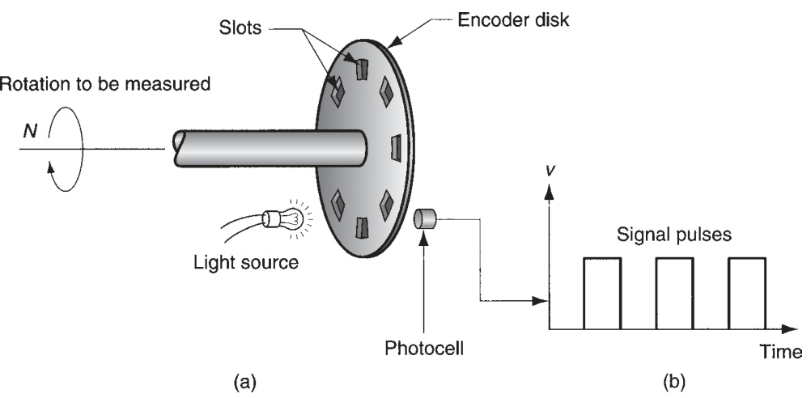  
FIGURE 37.11  Optical  encoder: (a) apparatus,  and (b) series of pulses  emitted to measure  rotation of disk.  

where $\alpha=$  angle between slots, degrees/slot; and $n_{s}=$  the number of slots in the disk,  slots/rev; and $360=$  degrees/rev. For a certain angular rotation of the leadscrew, the  encoder generates a number of pulses given by  

$$
n_{p}=\frac{A_{l s}}{\alpha}=\frac{A_{l s}n_{s}}{360}
$$  

where  $n_{p}=$  pulse count; $A_{l s}=$  angle of rotation of the leadscrew, degrees; and  $\alpha\,=$ angle between slots in the encoder, degrees/pulse. The pulse count can be used to  determine the linear $x$ -axis position of the worktable by factoring in the leadscrew  pitch. Thus,  

$$
x=\frac{p n_{p}}{n_{s}}=\frac{p A_{l s}}{360}
$$  

Similarly, the feed rate at which the worktable moves is obtained from the frequency  of the pulse train:  

$$
\nu_{t}=f_{r}=\frac{60p f_{p}}{n_{s}}
$$  

where  $\nu_{t}=$  table travel speed,  $\mathrm{mm/min}\ (\mathrm{in/min});f_{r}=$ feed rate,  $\mathrm{mm/min}$   $(\mathrm{in}/\mathrm{min})$ );  $p\,=$  pitch, $\mathrm{mm/rev}\;(\mathrm{in/rev});f_{p}=$  frequency of the pulse train,  $\mathrm{Hz}$  (pulses/sec);  $n_{s}=$ number of slots in the encoder disk, pulses/rev; and 60 converts seconds to minutes.  The speed relationship given by Equation (37.10) is also valid for a closed-loop posi- tioning system.  

The series of pulses generated by the encoder is compared with the coordinate  position and feed rate specifi  ed in the part program, and the difference is used by  the machine control unit to drive a servomotor that in turn drives the leadscrew and  worktable. As with the open-loop system, a gear reduction between the servomotor  and the leadscrew can also be used, so Equations  $(37.7\,\mathrm{a,b)}$  are applicable. A digital- to-analog converter is used to convert the digital signals used by the MCU into a  continuous analog signal to operate the drive motor. Closed-loop NC systems of the  type described here are appropriate when there is force resisting the movement of  the table. Most metal-machining operations fall into this category, particularly those  involving continuous path control such as milling and turning.  

  

An NC worktable is driven by a closed-loop positioning system consisting of  a servomotor, leadscrew, and optical encoder. The leadscrew has a pitch $=$   $5.0\:\mathrm{mm}$  and is coupled to the motor shaft with a gear ratio of 4:1 (four turns  of the motor for each turn of the leadscrew). The optical encoder generates  100 pulses/rev of the leadscrew. The table has been programmed to move a  distance of $75.0\:\mathrm{mm}$  at a feed rate $=400\:\mathrm{mm/min}$ . Determine (a) how many  pulses are received by the control system to verify that the table has moved  exactly $75.0\:\mathrm{mm}$  (b) pulse rate, and (c) motor speed that correspond to the  specifi  ed feed rate.  

Solution :  (a) Rearranging Equation (37.15) to fi  nd $n_{p}$ .  

$$
n_{p}={\frac{x n_{s}}{p}}={\frac{75(100)}{5}}=\mathbf{1500\pumless}
$$  

(b) The pulse rate corresponding to $400\:\mathrm{mm/min}$  can be obtained by rearrang- ing Equation (37.16):  

$$
f_{p}={\frac{f_{r}n_{s}}{60p}}={\frac{400(100)}{60(5)}}=\mathbf{133.33\,H z}
$$  

(c) Leadscrew rotational speed is the table velocity divided by the pitch:  

$$
N_{l s}=\frac{f_{r}}{p}\,80\,\mathrm{rev/min}
$$  

With a gear ratio $r_{g}=4.0$ , the motor speed $N=4(80)=320$  rev/min  

Precision in Positioning   Three critical measures of precision in positioning are  control resolution, accuracy, and repeatability. These terms are most easily explained  by considering a single axis of the position system.  

Control resolution refers to the system’s ability to divide the total range of the axis  movement into closely spaced points that can be distinguished by the control unit.  Control resolution  is defi  ned as the distance separating two adjacent control points in  the axis movement. Control points are sometimes called  addressable points  because  they are locations along the axis to which the worktable can be directed to go. It is de- sirable for the control resolution to be as small as possible. This depends on limitations  imposed by (1) the electromechanical components of the positioning system, and/or  (2) the number of bits used by the controller to defi  ne the axis coordinate location.  

The electromechanical factors that limit resolution include leadscrew pitch, gear  ratio in the drive system, and the step angle in a stepping motor (for an open-loop  system) or the angle between slots in an encoder disk (for a closed-loop system).  Together, these factors determine a control resolution, or minimum distance that  the worktable can be moved. For example, the control resolution for an open-loop  system driven by a stepper motor with a gear reduction between the motor shaft and  the leadscrew is given by  

$$
C R_{1}=\!\frac{p}{n_{s}r_{g}}
$$  

where  ${C R}_{1}=$  control resolution of the electromechanical components, mm (in); $p=$   leadscrew pitch, mm/rev (in/rev); $n_{s}=$  number of steps/rev; and $r_{g}=$  gear reduction.  

The corresponding expression for a closed-loop positioning system is similar but  does not include the gear reduction because the encoder is connected directly to  the leadscrew. There is no gear reduction. Thus, control resolution for a closed-loop  system is defi  ned as follows:  

$$
C R_{1}={\frac{p}{n_{s}}}
$$  

where $n_{s}$  in this case refers to the number of slots in the optical encoder.  

Although unusual in modern computer technology, the second possible factor  that could limit control resolution is the number of bits defi  ning the axis coordinate  value. For example, this limitation may be imposed by the bit storage capacity of  the controller. If  $B=$  the number of bits in the storage register for the axis, then the  number of control points into which the axis range can be divided $=2^{B}$ . Assuming  that the control points are separated equally within the range, then  

$$
C R_{2}={\frac{L}{2^{B}-1}}
$$  

where  $C R_{2}=$  control resolution of the computer control system, mm (in); and $L=$ axis range, mm (in). The control resolution of the positioning system is the maximum  of the two values; that is,  

$$
C R=\mathrm{Max}\{C R_{I},C R_{2}\}
$$  

It is generally desirable for  $C R_{2}\leq C R_{1}$ , meaning that the electromechanical system  is the limiting factor in control resolution.  

When a positioning system is directed to move the worktable to a given con- trol point, the capability of the system to move to that point will be limited by  mechanical errors. These errors are due to a variety of inaccuracies and imper- fections in the mechanical system, such as play between the leadscrew and the  worktable, backlash in the gears, and defl  ection of machine components. It is  convenient to assume that the errors form a statistical distribution about the  control point that is an unbiased normal distribution with mean $=0$ . If it is also  assumed that the standard deviation of the distribution is constant over the  range of the axis under consideration, then nearly all of the mechanical errors  $(99.73\,\%)$  are contained within $\pm\nobreakspace3\nobreakspace$  standard deviations of the control point. This  is pictured in Figure 37.12 for a portion of the axis range, which includes three  control points.  

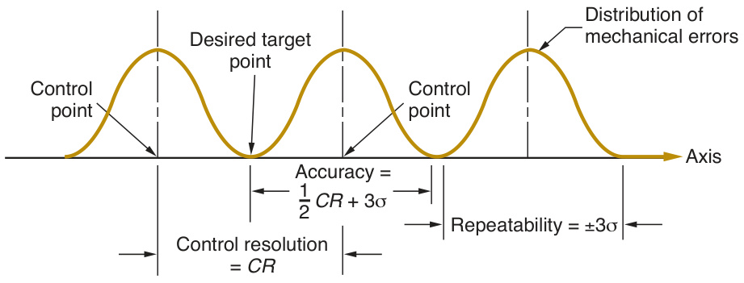  
FIGURE 37.12  A portion of a linear  positioning system axis,  with defi  nition of con- trol resolution, accu- racy, and repeatability.  

Given these defi  nitions of control resolution and mechanical error distribution,  consider accuracy and repeatability. Accuracy is defi  ned in a worst-case scenario  in which the desired target point lies exactly between two adjacent control points.  Since the system can only move to one or the other of the control points, there will  be an error in the fi  nal position of the worktable. If the target were closer to one of  the control points, then the table would be moved to the closer control point and the  error would be smaller. It is appropriate to defi  ne accuracy in the worst case. The  accuracy  of any given axis of a positioning system is the maximum possible error  that can occur between the desired target point and the actual position taken by the  system; in equation form,  

$$
\mathrm{Accuracy}=0.5\;C R+3\sigma
$$  

where  $C R=$  control resolution, mm (in); and  $\sigma=$ standard deviation of the error  distribution, mm (in).  

Repeatability refers to the capability of a positioning system to return to a given  control point that has been previously programmed. This capability can be measured  in terms of the location errors encountered when the system attempts to position  itself at the control point. Location errors are a manifestation of the mechanical  errors of the positioning system, which are defi  ned by an assumed normal distribu- tion, as described above. Thus, the  repeatability  of any given axis of a positioning  system can be defi  ned as the range of mechanical errors associated with the axis; this  reduces to  

$$
\mathrm{RPABilde}=\pm3\upsigma
$$  

# Example 37.3  Control resolu- tion, accuracy,  and repeata- bility  

Referring back to Example 37.1, the mechanical inaccuracies in the open-loop  positioning system can be described by a normal distribution whose standard  deviation $=0.005\:\mathrm{mm}$ . The range of the worktable axis is  $550\;\mathrm{mm}$ , and there  are 16 bits in the binary register used by the digital controller to store the  programmed position. Determine (a) control resolution, (b) accuracy, and (c)  repeatability for the positioning system.  

Solution:  (a) Control resolution is the greater of  $C R_{1}$  and  $C R_{2}$  as defi  ned by  Equations (37.17a) and (37.18):  

$$
\begin{array}{l}{{C R_{l}=\displaystyle\frac{p}{n_{s}r_{g}}=\frac{5.0}{48(4)}=0.0260\,\mathrm{mm}}}\\ {{\displaystyle C R_{2}=\!\!\frac{L}{2^{B}-1}=\frac{550}{2^{16}-1}=\frac{550}{65,\!535}=0.0084\,\mathrm{mm}}}\\ {{\displaystyle C R=\mathrm{Max}\{0.0260,\!0.0084\}=0.0260\,\mathrm{mm}}}\end{array}
$$  

(b) Accuracy is given by Equation (37.20):  

$$
\mathrm{Accuracy}=0.5\,(0.0260)+3(0.005)=\mathbf{0.0280}\,\mathbf{mm}
$$  

(c) Repeatability  

# 37.3.3  NC PART PROGRAMMING  

In machine tool applications, the task of programming the system is called NC part  programming because the program is prepared for a given part. It is usually accom- plished by someone familiar with the metalworking process who has learned the  programming procedure for the particular equipment in the plant. For other proc- esses, other terms may be used for programming, but the principles are similar and  a trained individual is needed to prepare the program. Computer systems are used  extensively to prepare NC programs.  

Part programming requires the programmer to defi  ne the points, lines, and sur- faces of the work part in the axis system, and to control the movement of the cutting  tool relative to these defi  ned part features. Several part programming techniques  are available, the most important of which are (1) manual part programming, (2)  computer-assisted part programming, (3) CAD/CAM-assisted part programming,  and (4) manual data input.  

Manual Part Programming   For simple point-to-point machining jobs, such as  drilling operations, manual programming is often the easiest and most economical  method. Manual part programming uses basic numerical data and special alphanu- meric codes to defi  ne the steps in the process. For example, to perform a drilling  operation, a command of the following type is entered:  

$\mathsf{n010\x70.0\y85.5\f175\s500}$  

Each “word” in the statement specifi  es a detail in the drilling operation. The  $n$ -word  (n010) is simply a sequence number for the statement. The  $x$ - and  $y$ -words indicate  the $x$  and $y$  coordinate positions ( $(x=70.0\ \mathrm{mm}$  and $y\,=\,85.5\ \mathrm{mm})$ ). The $f\cdot$ word and  $s$ -word specify the feed rate and spindle speed to be used in the drilling operation  (feed rate $=175\:\mathrm{mm/min}$  and spindle speed $=500\;\mathrm{rev/min}$ ). The complete NC part  program consists of a sequence of statements similar to the above command.  

Computer-Assisted Part Programming   Computer-assisted part program- ming involves the use of a high-level programming language. It is suited to the  programming of more complex jobs than manual programming. The fi  rst part pro- gramming language was APT (Automatically Programmed Tooling), developed as  an extension of the original NC machine tool research and fi  rst used in production  around 1960.  

In APT, the part programming task is divided into two steps: (1) defi  nition of part  geometry and (2) specifi  cation of tool path and operation sequence. In step 1, the part  programmer defi  nes the geometry of the work part by means of basic geometric ele- ments such as points, lines, planes, circles, and cylinders. These elements are defi  ned  using APT geometry statements, such as  

$$
\begin{array}{r}{\mathrm{P1}=\mathrm{P0INT}/25.0,150.0}\\ {\mathrm{L1}=\mathrm{LINE}/\mathrm{P1},\mathrm{P2}}\end{array}
$$  

P1 is a point defi  ned in the $x{-}y$  plane located at  $x=25\,\mathrm{{mm}}$  and  $y=150\:\mathrm{mm.L1}$  is a  line that goes through points P1 and P2. Similar statements can be used to defi  ne cir- cles, cylinders, and other geometry elements. Most work part shapes can be described  using statements like these to defi  ne their surfaces, corners, edges, and hole locations.  

Specifi  cation of the tool path is accomplished with APT motion statements. A  typical statement for point-to-point operation is  

# GOTO/P1  

This directs the tool to move from its current location to a position defi  ned by P1,  where P1 has been defi  ned by a previous APT geometry statement. Continuous path  commands use geometry elements such as lines, circles, and planes. For example, the  command  

# GORGT/L3, PAST, L4  

directs the tool to go right (GORGT) along line L3 until it is positioned just past line  L4 (of course, L4 must be a line that intersects L3).  

Additional APT statements are used to defi  ne operating parameters such as feed  rates, spindle speeds, tool sizes, and tolerances. When completed, the part program- mer enters the APT program into the computer, where it is processed to generate  low-level statements (similar to statements prepared in manual part programming)  that can be used by a particular machine tool.  

CAD/CAM-Assisted Part Programming   The use of CAD/CAM takes com- puter-assisted part programming a step further by using a computer graphics system  (CAD/CAM system) to interact with the programmer as the part program is being  prepared. In the conventional use of APT, a complete program is written and then  entered into the computer for processing. Many programming errors are not detect- ed until computer processing. When a CAD/CAM system is used, the programmer  receives immediate visual verifi  cation when each statement is entered, to determine  whether the statement is correct. When part geometry is entered by the program- mer, the element is graphically displayed on the monitor. When the tool path is con- structed, the programmer can see exactly how the motion commands will move the  tool relative to the part. Errors can be corrected immediately rather than after the  entire program has been written.  

Interaction between programmer and programming system is a signifi  cant benefi  t  of CAD/CAM-assisted programming. There are other important benefi  ts of using  CAD/CAM in NC part programming. First, the design of the product and its com- ponents may have been accomplished on a CAD/CAM system. The resulting design  database, including the geometric defi  nition of each part, can be retrieved by the NC  programmer to use as the starting geometry for part programming. This retrieval  saves valuable time compared to reconstructing the part from scratch using the APT  geometry statements.  

Second, special software routines are available in CAD/CAM-assisted part pro- gramming to automate portions of the tool path generation, such as profi  le milling  around the outside periphery of a part, milling a pocket into the surface of a part,  surface contouring, and certain point-to-point operations. These routines are called  by the part programmer as special  macro  commands. Their use results in signifi  cant  savings in programming time and effort.  

Manual Data Input   Manual data input (MDI) is a method in which a machine  operator enters the part program in the factory. The method involves use of a CRT  display with graphics capability at the machine tool controls. NC part programming  statements are entered using a menu-driven procedure that requires minimum train- ing of the machine tool operator. Because part programming is simplifi  ed and does  not require a special staff of NC part programmers, MDI is a way for small machine  shops to economically implement numerical control into their operations.  

# 37.3.4  APPLICATIONS OF NUMERICAL CONTROL  

Machining is an important application area for numerical control, but the operating  principle of NC can be applied to other operations as well. There are many industrial  processes in which the position of a work head must be controlled relative to the  part or product being worked on. The applications are divided into two categories:  (1) machine tool applications and (2) nonmachine tool applications. It should be  noted that the applications are not all identifi  ed by the name numerical control in  their respective industries.  

In the machine tool category, NC is widely used for machining operations such  as turning, drilling, and milling (Sections 21.2, 21.3, and 21.4, respectively). The use  of NC in these processes has motivated the development of highly automated ma- chine tools called machining centers, which change their own cutting tools to per- form a variety of machining operations under NC program control (Section 21.5).  In addition to machining, other numerically controlled machine tools include (1)  grinding machines (Section 24.1); (2) sheet metal pressworking machines (Section 

 19.5.2); (3) tube-bending machines (Section 19.7); and (4) thermal cutting processes 

 (Section 25.3).  

In the nonmachine tool category, NC applications include (1) tape-laying ma- chines and fi  lament-winding machines for composites (Sections 14.2.3 and 14.4.1);  (2) welding machines, both arc welding (Section 30.1) and resistance welding (Sec- tion 30.2); (3) component placement and insertion machines in electronics assembly  (Sections 34.3.1 and 34.3.2); (4) drafting machines; and (5) coordinate measuring  machines for inspection (Section 40.6.1).  

Benefi  ts of NC relative to manually operated equipment in these applications in- clude (1) reduced nonproductive time, which results in shorter cycle times, (2) lower  manufacturing lead times, (3) simpler fi  xturing, (4) greater manufacturing fl  exibility,  (5) improved accuracy, and (6) reduced human error.  

An industrial robot is a general-purpose programmable machine possessing certain  anthropomorphic features. The most obvious anthropomorphic, or human-like, fea- ture is the robot’s mechanical arm, or manipulator. The control unit for a modern  industrial robot is a computer that can be programmed to execute rather sophisticat- ed subroutines, thus providing the robot with an intelligence that sometimes seems  almost human. The robot’s manipulator, combined with a high-level controller, al- lows an industrial robot to perform a variety of tasks such as loading and unloading  production machine, spot welding, and spray painting. Robots are typically used as  substitutes for human workers in these tasks. The fi  rst industrial robot was installed  in a die-casting operation at Ford Motor Company. The robot’s job was to unload die  castings from the die-casting machine.  

This section considers various aspects of robot technology and applications, in- cluding how industrial robots are programmed to perform their tasks.  

# 37.4.1  ROBOT ANATOMY  

An industrial robot consists of a mechanical manipulator and a controller to move it  and perform other related functions. The mechanical manipulator consists of joints  and links that can position and orient the end of the manipulator relative to its base.  The controller unit consists of electronic hardware and software to operate the joints  in a coordinated fashion to execute the programmed work cycle.  Robot anatomy  is  concerned with the mechanical manipulator and its construction. Figure 37.13 shows  one of the common industrial robot confi  gurations.  

Manipulator Joints and Links   A joint in a robot is similar to a joint in a hu- man body. It provides relative movement between two parts of the body. Connected  to each joint are an input link and an output link. Each joint moves its output link  relative to its input link. The robot manipulator consists of a series of link–joint–link  combinations. The output link of one joint is the input link for the next joint. Typical  industrial robots have fi  ve or six joints. The coordinated movement of these joints  gives the robot its ability to move, position, and orient objects to perform useful  work. Manipulator joints can be classifi  ed as linear or rotating, indicating the motion  of the output link relative to the input link.  

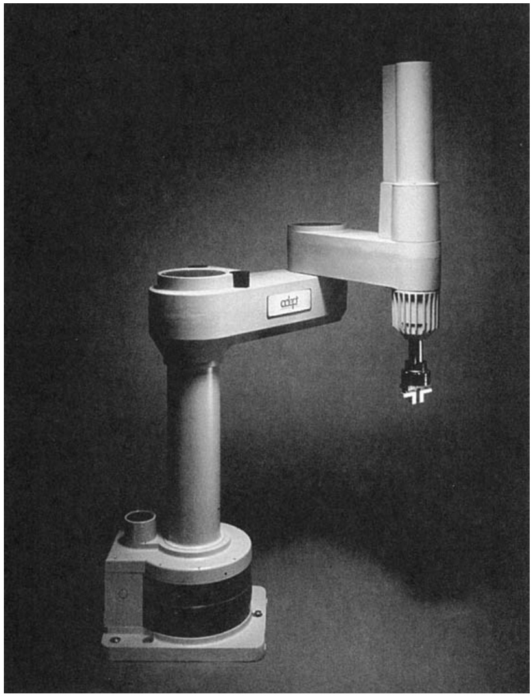  
FIGURE 37.13  The manipulator of a  modern industrial robot.  (Photo courtesy of  Adept Technology, Inc.)  

Manipulator Design   Using joints of the two basic types, each joint separated  from the previous by a link, the manipulator is constructed. Most industrial robots  are mounted to the fl  oor. The base is link 0; this is the input link to joint 1 whose  output is link 1, which is the input to joint 2 whose output link is link 2; and so forth,  for the number of joints in the manipulator.  

Robot manipulators can usually be divided into two sections: arm-and-body as- sembly and wrist assembly. There are typically three joints associated with the arm- and-body assembly, and two or three joints associated with the wrist. The function  of the arm-and-body is to position an object or tool, and the wrist function is to  properly orient the object or tool. Positioning is concerned with moving the part or  tool from one location to another. Orientation is concerned with precisely aligning  the object relative to some stationary location in the work area.  

To accomplish these functions, arm-and-body designs differ from those of the  wrist. Positioning requires large spatial movements, while orientation requires twist- ing and rotating motions to align the part or tool relative to a fi  xed position in the  workplace. The arm-and-body consists of large links and joints, whereas the wrist  consists of short links. The arm-and-body joints often consist of both linear and rotat- ing types, while the wrist joints are almost always rotating types.  

There are fi  ve basic arm-and-body confi  gurations available in commercial robots,  identifi  ed in Figure 37.14. The design shown in part (e) of the fi  gure and in Figure 37.13  

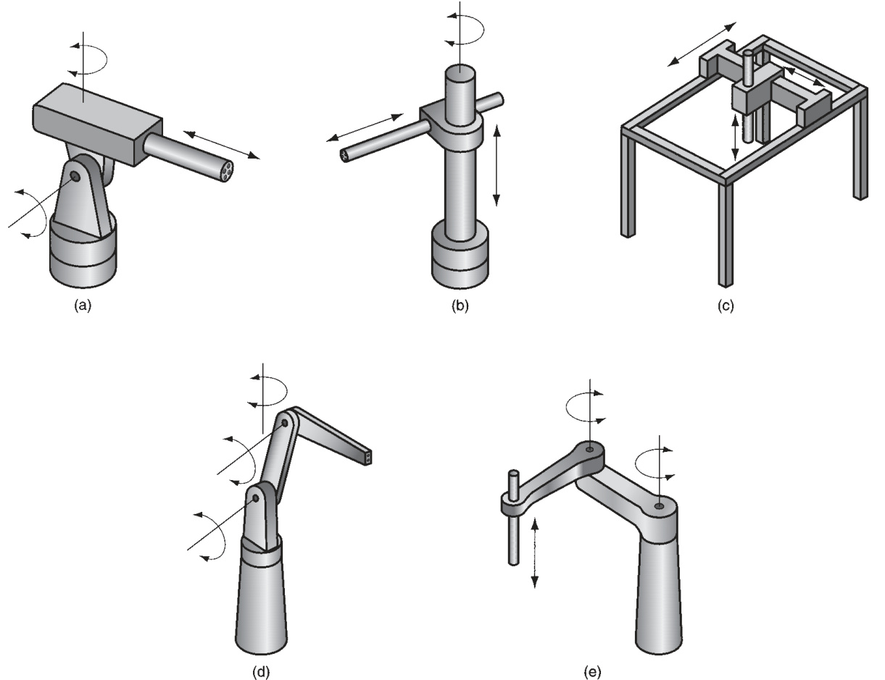  
FIGURE 37.14  Five common anatomies of commercial industrial robots: (a) polar, (b) cylindrical, (c) Cartesian coor- dinate, (d) jointed-arm, and (e) SCARA, or selectively compliant assembly robot arm.  

is called a SCARA robot, which stands for “selectively compliant assembly robot arm.”  It is similar to a jointed arm anatomy, except that the shoulder and elbow joints have  vertical axes of rotation, thus providing rigidity in the vertical direction but relative  compliance in the horizontal direction.  

The wrist is assembled to the last link in any of these arm-and-body confi  gura- tions. The SCARA is sometimes an exception because it is almost always used for  simple handling and assembly tasks involving vertical motions. Therefore, a wrist is  not usually present at the end of its manipulator. Substituting for the wrist on the  SCARA is usually a gripper to grasp components for movement and/or assembly.  

Work Volume and Precision of Motion   One of the important technical con- siderations of an industrial robot is the size of its work volume.  Work volume  is  defi  ned as the envelope within which a robot manipulator can position and orient  the end of its wrist. This envelope is determined by the number of joints, as well as  their types and ranges, and the sizes of the links. Work volume is important because  it plays a signifi  cant role in determining which applications a robot can perform.  

The defi  nitions of control resolution, accuracy, and repeatability developed in  Section 37.3.2 for NC positioning systems apply to industrial robots. A robot ma- nipulator is, after all, a positioning system. In general, the links and joints of robots  are not nearly as rigid as their machine tool counterparts, and so the accuracy and  repeatability of their movements are not as good.  

End Effectors   An industrial robot is a general-purpose machine. For a robot to be  useful in a particular application, it must be equipped with special tooling designed  for the application. An  end effector  is the special tooling that connects to the robot’s  wrist-end to perform the specifi  c task. There are two general types of end effector:  tools and grippers. A  tool  is used when the robot must perform a processing opera- tion. The special tools include spot-welding guns, arc-welding tools, spray-painting  nozzles, rotating spindles, heating torches, and assembly tools (e.g., automatic screw- driver). The robot is programmed to manipulate the tool relative to the work part  being processed.  

Grippers  are designed to grasp and move objects during the work cycle. The ob- jects are usually work parts, and the end effector must be designed specifi  cally for  the part. Grippers are used for part placement applications, machine loading and  unloading, and palletizing. Figure 37.15 shows a typical gripper confi  guration.  

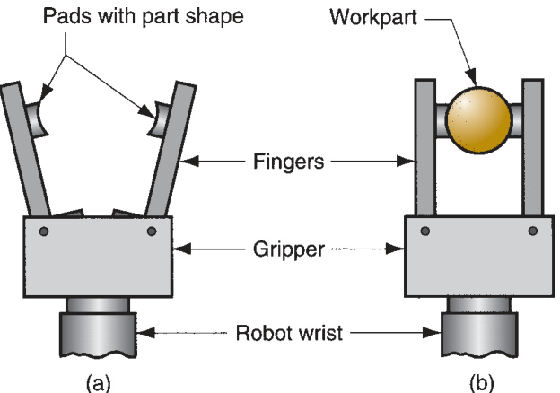  
FIGURE 37.15  A robot  gripper: (a) open and (b)  closed to grasp a work  part.  

# 37.4.2  CONTROL SYSTEMS AND ROBOT PROGRAMMING  

The robot’s controller consists of the electronic hardware and software to control  the joints during execution of a programmed work cycle. Most robot control units  today are based on a microcomputer system. The control systems in robotics can be  classifi  ed as follows:  

1.  Playback with point-to-point (PTP) control . As in numerical control, ro- bot motion systems can be divided into point-to-point and continuous path.  The program for a point-to-point playback robot consists of a series of point  locations and the sequence in which these points must be visited during the  work cycle. During programming, these points are recorded into memory,  and then subsequently played back during execution of the program. In a point- to-point motion, the path taken to get to the fi  nal position is not controlled.  

2.  Playback with continuous path  $(C P)$  control . Continuous path control is similar  to PTP , except motion paths rather than individual points are stored in memory.  In certain types of regular CP motions, such as a straight line path between two  point locations, the trajectory required by the manipulator is computed by the  controller unit for each move. For irregular continuous motions, such as a path  followed in spray painting, the path is defi  ned by a series of closely spaced points  that approximate the irregular smooth path. Robots capable of continuous path  motions can also execute point-to-point movements.  

3.  Intelligent control . Modern industrial robots exhibit characteristics that often  make them appear to be acting intelligently. These characteristics include the  ability to respond to sophisticated sensors such as machine vision, make de- cisions when things go wrong during the work cycle, make computations, and  communicate with humans. Robot intelligence is implemented using powerful  microprocessors and advanced programming techniques.  

Robots execute a stored program of instructions that defi  ne the sequence of mo- tions and positions in the work cycle, much like a part program in NC. In addition to  motion instructions, the program may include instructions for other functions such  as interacting with external equipment, responding to sensors, and processing data.  

There are two basic methods used to teach modern robots their programs:  leadthrough programming and computer programming languages.  Leadthrough  programming  involves a “teach-by-showing” method in which the manipulator is  moved by the programmer through the sequence of positions in the work cycle.  The controller records each position in memory for subsequent playback. Two pro- cedures for leading the robot through the motion sequence are available: powered  leadthrough and manual leadthrough. In  powered leadthrough , the manipulator  is driven by a control box that has toggle switches or press buttons to control the  movements of the joints. Using the control box, the programmer moves the ma- nipulator to each location, recording the corresponding joint positions into memory.  Powered leadthrough is the common method for programming playback robots with  point-to-point control.  Manual leadthrough  is typically used for playback robots  with continuous path control. In this method, the programmer physically moves the  manipulator wrist through the motion cycle. For spray painting and certain other  jobs, this is a more convenient means of programming the robot.  

Computer programming languages  for programming robots have evolved from  the use of microcomputer controllers. The fi  rst commercial language was introduced  around 1979. Computer languages provide a convenient way to integrate certain  nonmotion functions into the work cycle, such as decision logic, interlocking with  other equipment, and interfacing with sensors. A more thorough discussion of robot  programming is presented in reference [6].  

# 37.4.3  APPLICATIONS OF INDUSTRIAL ROBOTS  

Some industrial work lends itself to robot applications. The following are the im- portant characteristics of a work situation that tend to promote the substitution of  a robot in place of a human worker: (1) the work environment is hazardous for  humans, (2) the work cycle is repetitive, (3) the work is performed at a stationary  location, (4) part or tool handling would be diffi  cult for humans, (5) it is a multishift  operation, (6) there are long production runs and infrequent changeovers, and (7)  part positioning and orientation are established at the beginning of the work cycle,  since most robots cannot see.  

Applications of industrial robots that tend to match these characteristics can be  divided into three basic categories: (1) material handling, (2) processing operations,  and (3) assembly and inspection.  

Material handling  applications involve the movement of materials or parts from  one location and orientation to another. To accomplish this relocation task, the robot  is equipped with a gripper. As noted earlier, the gripper must be custom-designed to  grasp the particular part in the application. Material handling applications include  material transfer (part placement, palletizing, depalletizing) and machine loading  and/or unloading (e.g., machine tools, presses, and plastic molding).  

Processing operations  require the robot to manipulate a tool as its end effector.  The applications include spot welding, continuous arc welding, spray coating, and  certain metal cutting and deburring operations in which the robot manipulates a  special tool. In each of these operations, the tool is used as the robot’s end effector.  An application of spot welding is illustrated in Figure 37.16. Spot welding is a com- mon application of industrial robots in the automotive industry.  

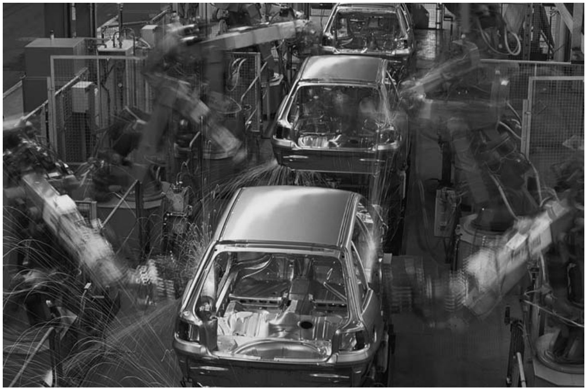  
FIGURE 37.16  A portion of an  automobile assembly  line in which robots  perform spot-welding  operations. (Photo  courtesy of Ocean/ Corbis Images.)  