# Integrated  Manufacturing  Systems  

# 38  

The manufacturing systems discussed in this chap- ter consist of multiple workstations and/or machines  whose operations are integrated by means of a mate- rial handling subsystem that moves parts or products  between stations. In addition, most of these systems use  computer control to coordinate the actions of the sta- tions and material handling equipment and to collect  data on overall system performance. Thus, the compo- nents of an integrated manufacturing system are (1)  workstations and/or machines, (2) material handling  equipment, and (3) computer control. In addition,  human workers are required to manage the system, and  workers may be used to operate the individual worksta- tions and machines.  

# Chapter Contents  

38.1 Material Handling  

38.2 Fundamentals of Production Lines  

38.2.1  Methods of Work Transport  38.2.2  Product Variations  

# 38.3 Manual Assembly Lines  

38.3.1  Cycle Time Analysis 38.3.2  Line Balancing and  Repositioning Losses  

Integrated manufacturing systems include man- ual and automated production lines, manufacturing  cells (from which the term “cellular manufacturing”  is derived), and fl  exible manufacturing systems, all of  which are described in this chapter. The fi  nal section  defi  nes computer integrated manufacturing (CIM), the  ultimate integrated manufacturing system. It is appro- priate to begin this chapter with a concise overview of  material handling, the physical integrator in integrated  manufacturing systems.  

# 38.4 Automated Production Lines  

38.4.1  Types of Automated Lines 38.4.2  Analysis of Automated  Production Lines  

# 38.5 Cellular Manufacturing  

38.5.1  Part Families  38.5.2  Machine Cells  

38.6 Flexible Manufacturing Systems  and Cells  

38.6.1  Integrating the FMS  Components 38.6.2  Applications of Flexible  Manufacturing Systems 38.6.3  Mass Customization  

#  

#  Material Handling  

Material handling is defi  ned as “the movement, storage,  protection and control of materials throughout the man- ufacturing and distribution process . . .” 1  The term is usu- ally associated with activities that occur inside a facility,  as contrasted with transportation between facilities that  involves rail, truck, air, or waterway delivery of goods.  

38.7 Computer Integrated Manufacturing  

Materials must be moved during the sequence of manufacturing operations  that convert them into fi  nal products. Material handling functions in manufacturing  include (1) loading and positioning work units at each workstation, (2) unloading  work units from the station, and (3) transporting work units between workstations.  Loading involves moving the work units into the production machine from a loca- tion in close proximity to or within the workstation. Positioning means locating the  work units in a fi  xed orientation relative to the processing or assembly operation. At  the end of the operation, the work units are unloaded or removed from the station.  Loading and unloading are accomplished manually or by automated devices such  as industrial robots. If the manufacturing operations require multiple workstations,  then the units must be transported from one station to the next in the sequence. In  many cases, a temporary storage function must also be provided by the material  handling system, as work units await their turn at each workstation. The purpose of  storage in this instance is to make sure that work is always present at each station, so  that idle time of workers and equipment is avoided.  

Material handling equipment and methods used in manufacturing can be  divided into the following general categories: (1) material transport, (2) storage,  and (3) unitizing.  

Material transport equipment is used to move parts and materials between work- stations in the factory. This movement may include intermediate stops for temporary  storage of work-in-process. There are fi  ve main types of material transport equip- ment: (1) industrial trucks, the most important of which are fork lift trucks, (2) auto- mated guided vehicles, (3) rail-guided vehicles, (4) conveyors, and (5) hoists and  cranes. This equipment is briefl  y described in Table 38.1.  

Two general categories of material transport equipment can be distinguished,  according to the type of routing between workstations: fi  xed and variable. In  fi  xed  routing , all of the work units are moved through the same sequence of stations. This  implies that the processing sequence required on all work units is either identical or  very similar. Fixed routing is used on manual assembly lines and automated production  lines. Typical material handling equipment used in fi  xed routing includes conveyors  and rail-guided vehicles. In  variable routing , different work units are moved through  different workstation sequences, meaning that the manufacturing system processes or  

TABLE •  38.1  Five types of material transport equipment. 
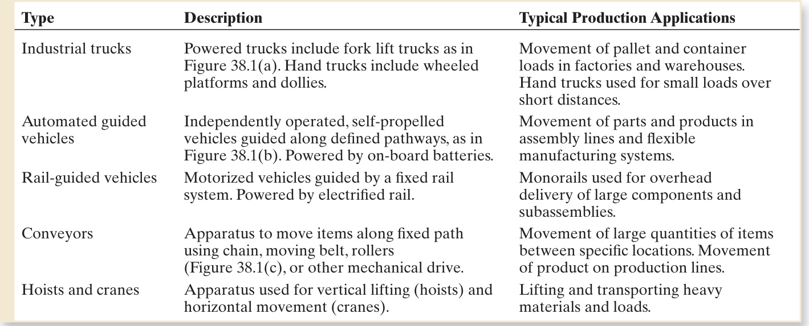  

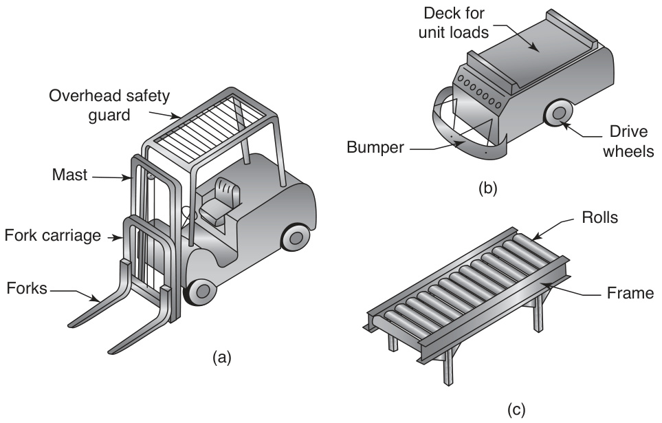  
FIGURE 38.1  Several types of  material handling  equipment: (a) fork lift  truck, (b) automated  guided vehicle, and  (c) roller conveyor.  

assembles different types of parts or products. Manufacturing cells and fl  exible manu- facturing systems usually operate this way. Typical handling equipment found in varia- ble routing includes industrial trucks, automated guided vehicles, and hoists and cranes.  

Storage systems in factories are used for temporary storage of raw materials, work- in-process, and fi  nished products. Storage systems can be classifi  ed into two general cat- egories: (1) conventional storage methods and equipment, which include bulk storage  in an open area, rack systems, and shelves; and (2) automated storage systems, which  include rack systems served by automatic cranes that store and retrieve pallet loads.  

Finally, unitizing refers to containers used to hold individual items during trans- port and storage, as well as equipment used to make up such unit loads. Containers  include pallets, tote pans, boxes, and baskets that hold parts during handling. Uni- tizing equipment includes palletizers that are used to load and stack cartons onto  pallets and depalletizers that are used to accomplish the unloading operation. Pal- letizers and depalletizers are generally associated with cartons of fi  nished product  leaving a facility and boxes of raw materials coming into the facility, respectively.  

Section 1.4.1 describes four types of plant layout: (1) fi  xed position layout, (2)  process layout, (3) cellular layout, and (4) product layout. In general, different types  of material handling methods and equipment are associated with these four types, as  summarized in Table 38.2.  

TABLE •  38.2  Types of material handling methods and systems generally associated with the four types of  plant layout. 
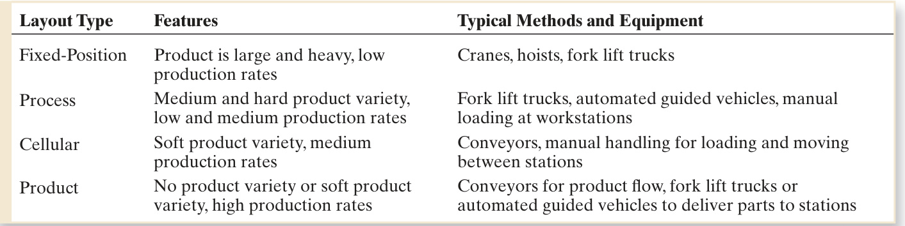  

#  Fundamentals of Production Lines  

Production lines are an important class of manufacturing system when large quan- tities of identical or similar products are to be made. They are suited to situations  where the total work to be performed on the product or part consists of many sepa- rate steps. Examples include assembled products (e.g., automobiles and appliances)  and mass-produced machined parts on which multiple machining operations are  required (e.g., engine blocks and transmission housings). In a production line, the  total work is divided into small tasks, and workers or machines perform these tasks  with great effi  ciency. For purposes of organization production lines are divided into  two basic types: manual assembly lines and automated production lines. However,  hybrid lines consisting of both manual and automated operations are not uncom- mon. Before examining these particular systems, some of the general issues involved  in production line design and operation are considered.  

A  production line  consists of a series of workstations arranged so that the product  moves from one station to the next, and at each location a portion of the total work is  performed on it, as depicted in Figure 38.2. The production rate of the line is limited by  its slowest station. Workstations whose pace is faster than the slowest will ultimately  be limited by that bottleneck station. Transfer of the product along the line is usu- ally accomplished by a conveyor system or mechanical transfer device, although some  manual lines simply pass the product from worker to worker by hand. Production lines  are associated with mass production. If the product quantities are high and the work  can be divided into separate tasks that can be assigned to individual workstations, then  a production line is the most appropriate manufacturing system.  

# 38.2.1  METHODS OF WORK TRANSPORT  

There are various ways of moving work units from one workstation to the next. The  two basic categories are manual and mechanized.  

Manual Methods of Work Transport  Manual methods involve passing the work  units between stations by hand. These methods are associated with manual assembly  lines. In some cases, the output of each station is collected in a box or tote pan; when  the box is full it is moved to the next station. This can result in a signifi  cant amount of  in-process inventory, which is undesirable. In other cases, work units are moved indi- vidually along a fl  at table or unpowered conveyor (e.g., a roller conveyor). When the  task is fi  nished at each station, the worker simply pushes the unit toward the down- stream station. Space is usually allowed for one or more units to collect between  stations, thereby relaxing the requirement for all workers to perform their respective  

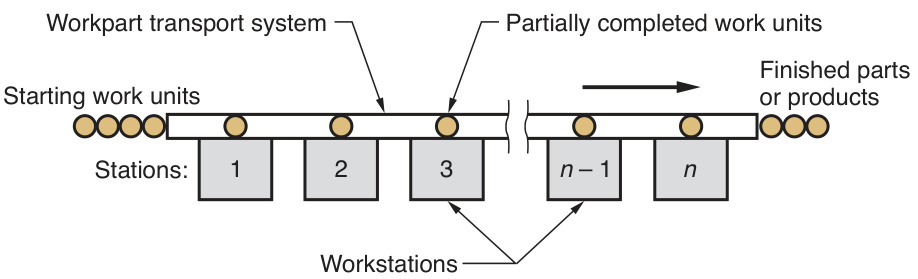  
FIGURE 38.2  General confi  guration  of a production line.  

tasks in sync. One problem associated with manual methods of work transport is the  diffi  culty in controlling the production rate on the line. Workers tend to work at a  slower pace unless some mechanical means of pacing them is provided.  

Mechanized Methods of Work Transport  Powered mechanical systems are com- monly used to move work units along a production line. These systems include lift- and-carry devices, pick-and-place mechanisms, powered conveyors (e.g., overhead  chain conveyors, belt conveyors, and chain-in-fl  oor conveyors), and other material  handling equipment, sometimes combining several types on the same line. Three  major types of work transfer systems are used on production lines: (1) continuous  transfer, (2) synchronous transfer, and (3) asynchronous transfer.  

Continuous transfer systems  consist of a continuously moving conveyor that  operates at a constant velocity. The continuous transfer system is most common on  manual assembly lines. Two cases are distinguished: (1) parts are fi  xed to the con- veyor and (2) parts can be removed from the conveyor. In the fi  rst case, the product is  usually large and heavy (e.g., automobile, washing machine) and cannot be removed  from the line. The worker must therefore walk along with the moving conveyor to  complete the assigned task for that unit while it is in the station. In the second case,  the product is small enough that it can be removed from the conveyor to facilitate  the work at each station. Some of the pacing benefi  ts are lost in this arrangement,  since each worker is not required to fi  nish the assigned tasks within a fi  xed time  period. On the other hand, this case allows greater fl  exibility to each worker to deal  with any technical problems that may be encountered on a particular work unit.  

In  synchronous transfer systems , work units are simultaneously moved between  stations with a quick, discontinuous motion. These systems are also known by the  name  intermittent transfer , which characterizes the type of motion experienced by  the work units. Synchronous transfer includes positioning of the work at the stations,  which is a requirement for automated lines that use this mode of transfer. Synchro- nous transfer is not common for manual lines, because the task at each and every  station must be fi  nished within the cycle time or the product will leave the station  as an incomplete unit. This rigid pacing discipline is stressful to human workers. By  contrast, this type of pacing lends itself to automated operation.  

Asynchronous transfer  allows each work unit to depart its current station when  processing has been completed. Each unit moves independently, rather than syn- chronously. Thus, at any given moment, some units on the line are moving between  stations, while others are positioned at stations. Associated with the operation of an  asynchronous transfer system is the tactical use of queues between stations. Small  queues of work units are permitted to form in front of each station, so that variations  in worker task times will be averaged and stations will always have work waiting for  them. Asynchronous transfer is used for both manual and automated manufacturing  systems.  

# 38.2.2  PRODUCT VARIATIONS  

Production lines can be designed to cope with variations in product models. Three  types of line can be distinguished: (1) single model line, (2) batch model line, and  (3) mixed model line. A  single model line  is one that produces only one model, and  there is no variation in the model. Thus, the tasks performed at each station are the  same on all product units.  

Batch model and mixed model lines are designed to produce two or more differ- ent product models on the same line, but they use different approaches for dealing  with the model variations. As its name suggests, a  batch model line  produces each  model in batches. The workstations are set up to produce the desired quantity of the  fi  rst model; then the stations are reconfi  gured to produce the desired quantity of  the next model; and so on. Production time is lost between batches due to the setup  changes. Assembled products are often made using this approach when the demand  for each product is medium and the product variety is also medium. The econom- ics in this case favor the use of one production line for several products rather than  using many separate lines for each model.  

A  mixed model line  also produces multiple models; however, the models are inter- mixed on the same line rather than being produced in batches. While a particular  model is being worked on at one station, a different model is being processed at  the next station. Each station is equipped with the necessary tools and is suffi  ciently  versatile to perform the variety of tasks needed to produce any model that moves  through it. Many consumer products are assembled on mixed model lines when the  level of product variety is soft. Prime examples are automobiles and major appliances,  which are characterized by variations in models and options.  

The manual assembly line was an important development in integrated manufactur- ing systems. It is of global importance today in the manufacture of assembled prod- ucts including automobiles and trucks, consumer electronic products, appliances,  power tools, and other products made in large quantities.  

A  manual assembly line  consists of multiple workstations arranged sequentially,  at which assembly operations are performed by human workers, as in Figure 38.3.  The usual procedure on a manual line begins with “launching” a base part onto the  

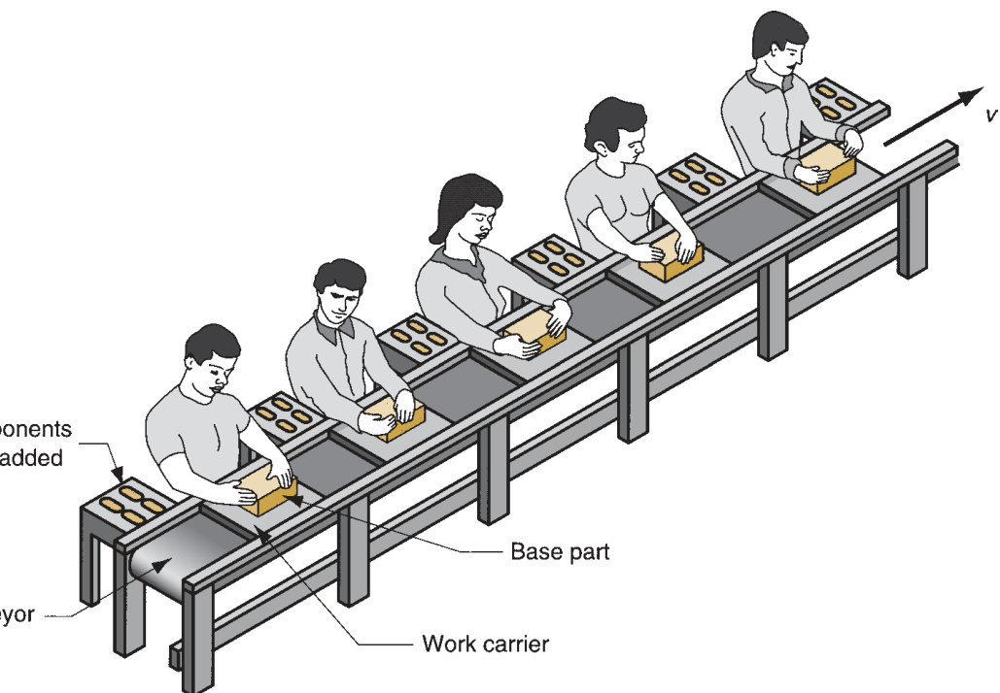  
FIGURE 38.3  A portion  of a manual  assembly line. Each  worker performs a task  at his or her  workstation.  A conveyor moves  parts on work carriers  from one station to the  next.  

front end of the line. A work carrier is often required to hold the part during its  movement along the line. The base part travels through each of the stations where  workers perform tasks that progressively build the product. Components are added  to the base part at each station, so that all tasks have been completed when the  product exits the fi  nal station. Processes accomplished on manual assembly lines  include mechanical fastening operations (Chapter 31), spot welding (Section 29.2),  hand soldering (Section 30.2), and adhesive joining (Section 30.3).  

# 38.3.1  CYCLE TIME ANALYSIS  

Equations can be developed to determine the required number of workers and  workstations on a manual assembly line to meet a given annual demand. Suppose  the problem is to design a single model line to satisfy annual demand for a certain  product. Management must decide how many shifts per week the line will operate  and the number of hours per shift. If it is assumed that the plant operates 50 weeks  per year, then the required hourly production rate of the line will be given by  

$$
R_{p}=\frac{D_{a}}{50S_{w}H_{s h}}
$$  

where  $R_{p}\,=$  the actual average production rate, units/hr;  $D_{a}=$  annual demand for  the product, units/year;  $S_{\scriptscriptstyle w}=$  number of shifts/wk; and  $H_{s h}=$  hours/shift. If the line  operates 52 weeks rather than 50, then $R_{p}=D_{a}/52S_{w}H_{s h}$ . The corresponding average  production time per unit is the reciprocal of $R_{p}$  

$$
T_{p}={\frac{60}{R_{p}}}
$$  

where  $T_{p}=$  actual average production time, converted to minutes.  

Unfortunately, the line may not be able to operate for the entire time given by  $50\ S_{w}H_{s h}$ , because of lost time due to reliability problems. These reliability prob- lems include mechanical and electrical failures, tools wearing out, power outages,  and similar malfunctions. Accordingly, the line must operate at a faster time than  $T_{p}$ to compensate for these problems. If  $E=$  line effi  ciency, which is the proportion of  uptime on the line, then the cycle time of the line  $T_{c}$  is given by  

$$
T_{c}=E T_{p}={\frac{60E}{R_{p}}}
$$  

Any product contains a certain work content that represents all of the tasks that  are to be accomplished on the line. This work content requires an amount of time  called the  work content time   $T_{w c}$ . This is the total time required to make the product  on the line. If it is assumed that the work content time is divided evenly among the  workers, so that every worker has an equal workload whose time to perform equals  $T_{c}$ ,  then the minimum possible number of workers  $w_{m i n}$  in the line can be determined as  

$$
w_{m i n}=\mathrm{Minimum~integer}\geq\frac{T_{w c}}{T_{c}}
$$  

If each worker is assigned to a separate workstation, then the number of worksta- tions is equal to the number of workers; that is  $n_{m i n}=w_{m i n}$ .  

There are two practical reasons why this minimum number of workers cannot be  achieved: (1)  imperfect balancing , in which some workers are assigned an amount  of work that requires less time than  $T_{c}$ , and this ineffi  ciency increases the total  number of workers needed on the line; and (2)  repositioning losses , in which some  time is lost at each station to reposition the work or the worker, so that the service  time actually available at each station is less than  $T_{c}$ , and this will also increase the  number of workers on the line.  

# 38.3.2   LINE BALANCING AND REPOSITIONING LOSSES  

One of the biggest technical problems in designing and operating a manual assembly  line is line balancing. This is the problem of assigning tasks to individual workers so  that all workers have an equal amount of work. Recall that the entirety of work to  be accomplished on the line is given by the work content. This total work content  can be divided into  minimum rational work elements , each element concerned with  adding a component or joining them or performing some other small portion of the  total work content. The notion of a minimum rational work element is that it is the  smallest practical amount of work into which the total job can be divided. Different  work elements require different times, and when they are grouped into logical tasks  and assigned to workers, the task times will not be equal. Thus, simply due to the  variable nature of element times, some workers will end up with more work, whereas  other workers will have less. The cycle time of the assembly line is determined by the  station with the longest task time.  

One might think that although the work element times are different, it should  be possible to fi  nd groups of elements whose sums (task times) are nearly equal, if  not perfectly equal. What makes it diffi  cult to fi  nd suitable groups is that there are  several constraints on this combinatorial problem. First, the line must be designed to  achieve some desired production rate, which establishes the cycle time  $T_{c}$  at which  the line must operate, as provided by Equation (38.3). Therefore, the sum of the  work element times assigned to each station must be less than or equal to  $T_{c}$ .  

Second, there are restrictions on the order in which the work elements can be  performed. Some elements must be done before others. For example, a hole must  be drilled before it can be tapped. A screw that will use the tapped hole to attach a  mating component cannot be fastened before the hole has been drilled and tapped.  These kinds of requirements on the work sequence are called  precedence constraints .  They complicate the line balancing problem. A certain element that might be allo- cated to a worker to obtain a task time $=\mathit{T_{c}}$  cannot be added because it violates a  precedence constraint.  

These and other limitations make it virtually impossible to achieve perfect bal- ancing of the line, which means that some workers will require more time to com- plete their tasks than others. Methods of solving the line balancing problem, that is,  allocating work elements to stations, are discussed in other references—excellent  references indeed, such as [10]. The inability to achieve perfect balancing results  in some idle time at most stations. Because of this idle time, the actual number of  workers required on the line will be greater than the number of workstations given  by Equation (38.4).  

A measure of the total idle time on a manual assembly line is given by the  bal- ancing effi  ciency   $E_{b}$ , defi  ned as the total work content time divided by the total  available service time on the line. The total work content time is equal to the sum  of the times of all work elements that are to be accomplished on the line. The total  available service time on the line $=w T_{s}$ , where $w=$  number of workers on the line;  

and  $T_{s}=$  the longest service time on the line; that is,  $T_{s}=\mathrm{Max}\{T_{s i}\}$  for  $i=1,2,\dots n$ ,  where  $T_{s i}=$  the service time (task time) at station $i$ , min.  

The reader may wonder why a new term  $T_{s}$  is being used rather than the previ- ously defi  ned cycle time  $T_{c}$ . The reason is that there is another time loss in the opera- tion of a production line in addition to idle time from imperfect balancing. Call it  the  repositioning time   $T_{r}$ . It is the time required in each cycle to reposition the  worker, or the work unit, or both. On a continuous transfer line where work units are  attached to the line and move at a constant speed,  $T_{r}$  is the time taken by the worker  to walk from the unit just completed to the next unit coming into the station. In all  manual assembly lines, there will be some lost time due to repositioning. Assume  $T_{r}$ is the same for all workers, although in fact repositioning may require different times  at different stations. Then  $T_{s},\,T_{c}$ , and  $T_{r}$  are related as follows:  

$$
T_{c}=T_{s}+T_{r}
$$  

The defi  nition of balancing effi  ciency  $E_{b}$  can now be written in equation form as  follows:  

$$
E_{b}=\frac{T_{w c}}{w T_{s}}
$$  

A perfect line balance yields a value of  $E_{b}=1.00.$ . Typical line balancing effi  ciencies  in industry range between 0.90 and 0.95.  

Equation (38.6) can be rearranged to obtain the actual number of workers  required on a manual assembly line:  

$$
w=\mathrm{Minimum\:integer}\geq\frac{T_{w c}}{T_{s}E_{b}}
$$  

The utility of this relationship suffers from the fact that the balancing effi  ciency  $E_{b}$ depends on $w$  in Equation (38.6). Unfortunately, this is an equation where the thing  to be determined depends on a parameter that, in turn, depends on the thing itself.  Notwithstanding this drawback, Equation (38.7) defi  nes the relationship among the  parameters in a manual assembly line. Using a typical value of  $E_{b}$  based on similar  previous lines, it can be used to estimate the number of workers required to produce  a given assembly.  

# Example 38.1  Manual  assembly line  

A manual assembly line is being planned for a product whose annual demand  $=90{,}000$  units. A continuously moving conveyor will be used with work units  attached. Work content time $=55$  min. The line will run $50\,\mathrm{wk}/\mathrm{yr},5$  shifts/wk,  and $8\,\mathrm{hr},$ /day. Each worker will be assigned to a separate workstation. Based  on previous experience, assume line effi  ciency $=0.95$ , balancing effi  ciency $=$   0.93, and repositioning time $=9$  sec. Determine (a) hourly production rate to  meet demand, (b) number of workers and workstations required, and (c) for  comparison, the ideal minimum value as given by $w_{m i n}$  in Equation (38.4).  

Solution :  (a) Hourly production rate required to meet annual demand is  given by Equation (38.1):  

$$
R_{p}={\frac{90{,}000}{50(5)(8)}}=45\,\mathbf{u}\mathbf{n}\mathbf{i}t s/\mathbf{h}\mathbf{r}
$$  

  

(b) With a line effi  ciency of 0.95, the ideal cycle time is  

$$
T_{c}={\frac{60(0.95)}{45}}=1.2667\,\mathbf{min}
$$  

Given that repositioning time $T_{r}=9\,\mathrm{sec}=0.15\,\mathrm{min}$ , the service time is  

$$
T_{s}=1.2667-0.150=1.1167\,\mathrm{min}
$$  

Workers required to operate the line, by Equation (38.7) equals  

$$
w={\mathrm{Minimum~integer}}\geq{\frac{55}{1.1167(0.93)}}=52.96\rightarrow53{\mathrm{~work}}
$$  

With one worker per station, $n={\bf53}$  workstations .  

(c) This compares with the ideal minimum number of workers given by  Equation (38.4):  

$$
w_{m i n}=\mathrm{Minimum~integer}\geq\frac{55}{1.2667}=43.42\rightarrow44
$$  

It is clear from Example 38.1 that the lost time due to repositioning and imperfect  line balancing take a heavy toll on the overall effi  ciency of a manual assembly line.  

The number of workstations on a manual assembly line does not necessarily equal  the number of workers. For large products, it may be possible to assign more than  one worker to a station. This practice is common in fi  nal assembly plants that build  cars and trucks. For example, two workers in a station might perform assembly tasks  on opposite sides of the vehicle. The number of workers in a given station is called  the station  manning level   $M_{i}.$ . Averaging the manning levels over the entire line,  

$$
M={\frac{w}{n}}
$$  

where $M=$  average manning level for the assembly line;  $w=$  number of workers on  the line; and $n=$  number of stations. Naturally,  $w$  and $n$  must be integers. Multiple  manning conserves valuable fl  oor space in the factory because it reduces the number  of stations required.  

Another factor that affects manning level on an assembly line is the number of  automated stations  on the line, including stations that employ industrial robots  (Section 38.4). Automation reduces the required labor force on the line, although  it increases the need for technically trained personnel to service and maintain the  automated stations. The automobile industry makes extensive use of robotic work- stations to perform spot welding and spray painting on sheet-metal car bodies. The  robots accomplish these operations with greater repeatability than human workers  can, which translates into higher product quality.  

#  Automated Production Lines  

Manual assembly lines generally use a mechanized transfer system to move parts  between workstations, but the stations themselves are operated by human workers.  An  automated production line  consists of automated workstations connected by a  parts transfer system that is coordinated with the stations. In the ideal, no human  workers are on the line, except to perform auxiliary functions such as tool chang- ing, loading and unloading parts at the beginning and end of the line, and repair  and maintenance activities. Modern automated lines are highly integrated systems,  operating under computer control.  

Operations performed by automated stations tend to be simpler than those per- formed by humans on manual lines. The reason is that simpler tasks are easier to  automate. Operations that are diffi  cult to automate are those requiring multiple  steps, judgment, or human sensory capability. Tasks that are easy to automate con- sist of single work elements, quick actuating motions, and straight-line feed motions  as in machining.  

# 38.4.1 TYPES OF AUTOMATED LINES  

Automated production lines can be divided into two basic categories: (1) those that  perform processing operations such as machining, and (2) those that perform assem- bly operations. An important type in the processing category is the transfer line.  

Transfer Lines and Similar Processing Systems  A  transfer line  consists of a  sequence of workstations that perform production operations, with automatic trans- fer of work units between stations. Machining is the most common processing opera- tion, as depicted in Figure 38.4. Automatic transfer systems for sheet metalworking  and assembly are also available. In the case of machining, the workpiece typically  starts as a metal casting or forging, and a series of machining operations are per- formed to accomplish the high-precision details (e.g., holes, threads, and fi  nished fl  at  surfaces).  

Transfer lines are usually expensive pieces of equipment, sometimes costing mil- lions of dollars; they are designed for high part quantities. The amount of machin- ing accomplished on the work part is often signifi  cant, but since the work is divided  among many stations, production rates are high and unit costs are low compared to  alternative production methods. Synchronous transfer of work units between stations  is commonly used on automated machining lines.  

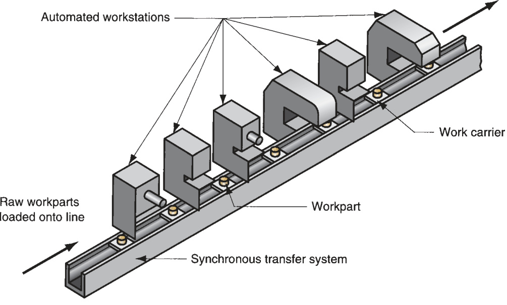  
FIGURE 38.4  A machining transfer  line, an important type  of automated  production line.  

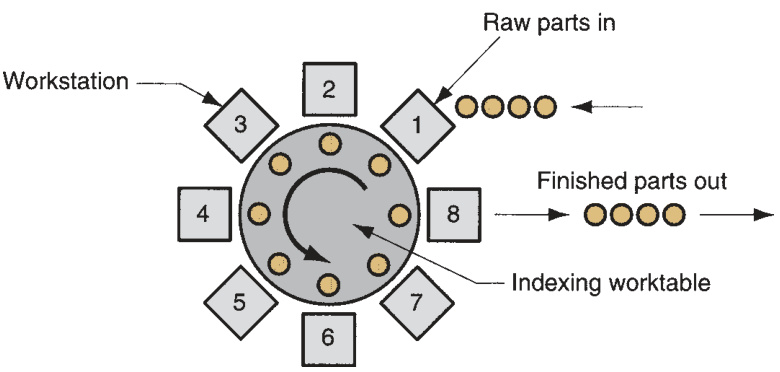  
FIGURE 38.5  Confi  guration of a  dial-indexing machine.  

A variation of the automated transfer line is the  dial indexing machine ,  Figure 38.5, in which workstations are arranged around a circular worktable, called a  dial. The worktable is actuated by a mechanism that provides partial rotation of the  table on each work cycle. The number of rotational positions is designed to match  the number of workstations around the periphery of the table. Although the confi  gu- ration of a dial-indexing machine is quite different from a transfer line, its operation  and application are quite similar.  

Automated Assembly Systems  Automated assembly systems consist of one or  more workstations that perform assembly operations, such as adding components  and/or affi  xing them to the work unit. Automated assembly systems can be divided  into single station cells and multiple station systems.  Single station assembly cells   are often organized around an industrial robot that has been programmed to per- form a sequence of assembly steps. The robot cannot work as fast as a series of  specialized automatic stations, so single station cells are used for jobs in the medium  production range.  

Multiple station assembly systems  are appropriate for high production. They are  widely used for mass production of small products such as ball-point pens, cigarette  lighters, fl  ashlights, and similar items consisting of a limited number of components.  The number of components and assembly steps is limited because system reliability  decreases rapidly with increasing complexity.  

Multiple station assembly systems are available in several confi  gurations, pictured  in Figure 38.6: (a) in-line, (b) rotary, and (c) carousel. The in-line confi  guration is the  conventional transfer line adapted to perform assembly work. These systems are not  as massive as their machining counterparts. Rotary systems are usually implemented  

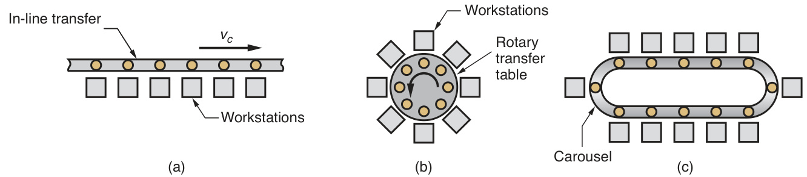  
FIGURE 38.6  Three common confi  gurations of multiple station assembly systems: (a) in-line, (b) rotary, and (c)  carousel.  

as dial indexing machines. Carousel assembly systems are arranged as a loop. They  can be designed with a greater number of workstations than a rotary system. Owing  to the loop confi  guration, the carousel allows the work carriers to be automatically  returned to the starting point for reuse, an advantage shared with rotary systems but  not with transfer lines unless provision for their return is made in the design.  

# 38.4.2 ANALYSIS OF AUTOMATED PRODUCTION LINES  

Line balancing is a problem on an automated line, just as it is on a manual assembly  line. The total work content must be allocated to individual workstations. However,  since the tasks assigned to automated stations are generally simpler, and the line  often contains fewer stations, the problem of defi  ning what work should be done at  each station is not as diffi  cult for an automated line as for a manual line.  

A more signifi  cant problem in automated lines is reliability. The line consists of  multiple stations, interconnected by a work transfer system. It operates as an inte- grated system, and when one station malfunctions, the entire system is adversely  affected. To analyze the operation of an automated production line, assume a sys- tem that performs processing operations and uses synchronous transfer. This model  includes transfer lines as well as dial indexing machines. It does not include auto- mated assembly systems, which require an adaptation of the model [10]. The termi- nology will borrow symbols from the fi  rst two sections:  $n=$  number of workstations  on the line;  $T_{c}\,=$  ideal cycle time on the line;  $T_{r}=$  repositioning time, called the  transfer time in a transfer line; and  $T_{s i}=$  the service time at station  i . The ideal cycle  time  $T_{c}$  is the service time (processing time) for the slowest station on the line plus  the transfer time; that is,  

$$
T_{c}=T_{r}+\operatorname{Max}{\{T_{s i}\}}
$$  

In the operation of a transfer line, periodic breakdowns cause downtime on the  entire line. Let $F=$  frequency with which breakdowns occur, causing a line stoppage;  and  $T_{d}=$  average time the line is down when a breakdown occurs. The downtime  includes the time for the repair crew to swing into action, diagnose the cause of the  failure, fi  x it, and restart the line.  

Based on these defi  nitions, the following expression can be formulated for the  actual average production time $T_{p}$ :  

$$
T_{p}=T_{c}+F T_{d}
$$  

where $F=$  downtime frequency, line stops/cycle; and  $T_{d}=$ downtime in minutes per  line stop. Thus,  $F T_{d}=$  average downtime per cycle. The actual average production  rate  $R_{p}=60/T_{p}$ , as previously given in Equation (38.2). It is of interest to compare  this rate with the ideal production rate given by  

$$
R_{c}=\frac{60}{T_{c}}
$$  

where  $R_{p}$  and  $R_{c}$  are expressed in pc/hour, given that  $T_{p}$  and  $T_{c}$  are expressed in  minutes.  

Using these defi  nitions, the line effi  ciency $E$  for a transfer line can be defi  ned. In the  context of automated manufacturing systems,  $E$  refers to the proportion of uptime  

on the line and is really a measure of availability (Section 1.5.2) rather than effi  - ciency:  

$$
E={\frac{T_{c}}{T_{c}+F T_{d}}}
$$  

This is the same relationship as earlier Equation (38.3), since  $T_{p}\;=\;T_{c}\;+\;F T_{d}.$ . It  should be noted that the same defi  nition of line effi  ciency applies to manual assem- bly lines, except that technological breakdowns are not as much of a problem on  manual lines (human workers are more reliable than electromechanical equipment,  at least in the sense discussed here).  

Line downtime is usually associated with failures at individual workstations.  Reasons for downtime include scheduled and unscheduled tool changes, mechani- cal and electrical malfunctions, hydraulic failures, and normal equipment wear. Let  $p_{i}=$  probability or frequency of a failure at station  $i$ , then  

$$
F={\sum_{i=1}^{n}}p_{i}
$$  

If all $p_{i}$  are assumed equal, or an average value of $p_{i}$  is computed, in either case call- ing it $p$ , then  

$$
F=n p
$$  

Both of these equations clearly indicate that the frequency of line stops increases  with the number of stations on the line. Stated another way, the reliability of the line  decreases as the number of stations is increased.  

# Example 38.2  Automated  

#  

An automated transfer line has 20 stations and an ideal cycle time of $1.0\;\mathrm{min}$ Probability of a station failure is $p=0.01$ , and the average downtime when a  breakdown occurs is $10\,\mathrm{{min}}$ . Determine (a) average production rate  $R_{p}$  and  (b) line effi  ciency $E$ .  

Solution:  The frequency of breakdowns on the line is given by $F=p n=

$ $0.01(20)=0.20.$ . The actual average production time is therefore  

$$
T_{p}=1.0+0.20(10)=3.0\,\mathrm{min}
$$  

(a) Production rate is therefore  

$$
R_{p}={\frac{60}{T_{p}}}={\frac{60}{3.0}}={\bf20}\;\bf{p c/h r}
$$  

Note that this is far lower than the ideal production rate:  

$$
R_{c}={\frac{60}{T_{c}}}={\frac{60}{1.0}}=60\;\mathrm{pc/hr}
$$  

(b) Line effi  ciency is computed as  

$$
E={\frac{T_{c}}{T_{p}}}={\frac{1.0}{3.0}}={\bf0.333\(or\;33.3\%)}
$$  

This example clearly demonstrates how a production line with many worksta- tions, a high average downtime per breakdown, and a seemingly low probability of  station failure can spend more time down than up. Achieving high line effi  ciencies is  a real problem in automated production lines.  

The cost of operating an automated production line is the investment cost of  the equipment and installation, plus the cost of maintenance, utilities, and labor  assigned to the line. These costs are converted to an equivalent uniform annual cost  and divided by the number of hours of operation per year to provide an hourly rate.  This hourly cost rate can be used to fi  gure the unit cost of processing a work part on  the line  

$$
C_{p}=\frac{C_{o}T_{p}}{60}
$$  

where  $C_{p}\,=$  unit processing cost,  $\S/$ part;  $C_{o}=$ hourly rate of operating the line, as  defi  ned above,  $\S/\mathrm{hr}$ ;  $T_{p}\,=$ actual average production time per work part, min/part;  and the constant 60 converts the hourly cost rate to  $\S/\mathrm{min}$  for consistency of units.  

Cellular manufacturing refers to the use of work cells that specialize in the produc- tion of families of parts or products made in medium quantities. Parts (and prod- ucts) in this quantity range are traditionally made in batches, and batch production  requires downtime for setup changeovers and has high inventory carrying costs. Cel- lular manufacturing is based on an approach called group technology (GT), which  minimizes the disadvantages of batch production by recognizing that although  the parts are different, they also possess similarities. When these similarities are  exploited in production, operating effi  ciencies are improved. The improvement is  typically achieved by organizing the production around manufacturing cells. Each  cell is designed to produce one part family (or a limited number of part families),  thereby following the principle of specialization of operations. The cell includes spe- cial production equipment and custom-designed tools and fi  xtures, so that the pro- duction of the part families can be optimized. In effect, each cell becomes a factory  within the factory.  

# 38.5.1  PART FAMILIES  

A central feature of cellular manufacturing and group technology is the part family.  A  part family  is a group of parts that possess similarities in geometric shape and  size, or in the processing steps used in their manufacture. It is not unusual for a  factory that produces 10,000 different parts to be able to group most of those parts  into 20 to 30 part families. In each part family the processing steps are similar. There  are always differences among parts in a family, but the similarities are close enough  that the parts can be grouped into the same family. Figures 38.7 and 38.8 show two  different part families. The parts shown in Figure 38.7 have the same size and shape;  however, their processing requirements are quite different because of differences  in work material, production quantities, and design tolerances. Figure 38.8 shows  several parts with geometries that differ, but their manufacturing requirements are  quite similar.  

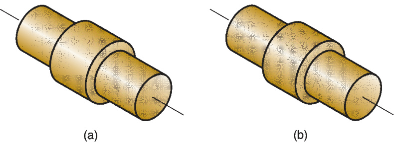  
FIGURE 38.7  Two  parts that are identical  in shape and size but  quite different in  manufacturing:  (a) 1,000,000 units/yr,  toleranc $\mathsf{e}=\pm0.010$  in.,  1015 CR steel, nickel  plate; and (b) 100/yr,  tolerance $=\pm0.001$  in,  18-8 stainless steel.  

There are several ways by which part families are identifi  ed in industry. One  method involves visual inspection of all the parts made in the factory (or photos of  the parts) and using best judgment to group them into appropriate families. Another  approach, called  production fl  ow analysis , uses information contained on route  sheets (Section 39.1.1) to classify parts. In effect, parts with similar manufacturing  steps are grouped into the same family.  

A third method, usually the most expensive but most useful, is parts classifi  cation  and coding.  Parts classifi  cation and coding  involve the identifi  cation of similarities  and differences among parts and relating these parts by means of a numerical coding  scheme. Most classifi  cation and coding systems are one of the following: (1) systems  based on part design attributes, (2) systems based on part manufacturing attributes,  and (3) systems based on both design and manufacturing attributes. Common part  design and manufacturing attributes used in GT systems are presented in Table 38.3.  Because each company produces a unique set of parts and products, a classifi  ca- tion and coding system that may be satisfactory for one company is not necessar- ily appropriate for another company. Each company must design its own coding  

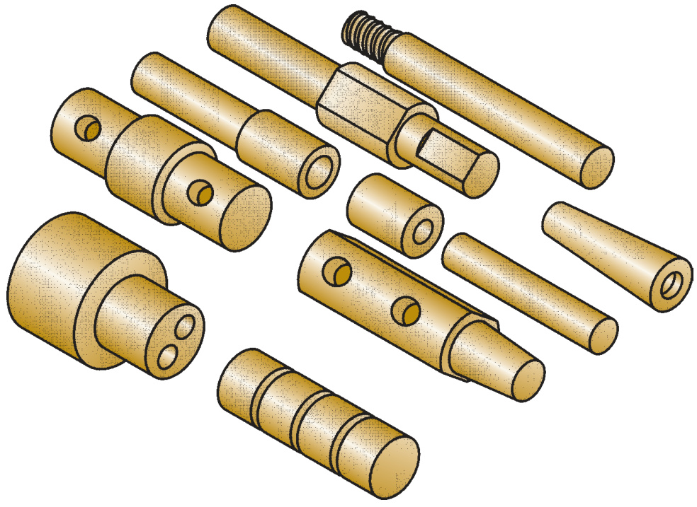  
FIGURE 38.8  Ten  parts that are different  in size and shape, but  quite similar in terms  of manufacturing. All  parts are machined  from cylindrical stock  by turning; some parts  require drilling and/or  milling.  

TABLE •  38.3  Design and manufacturing attributes typically included in a parts  classifi  cation and coding system. 
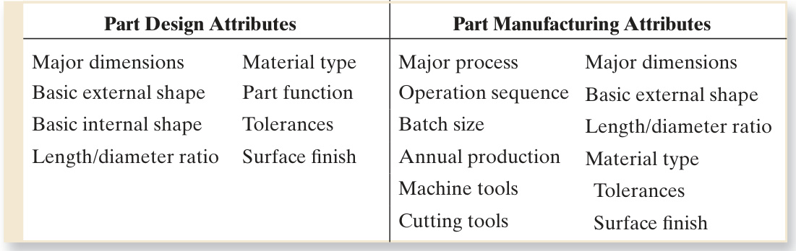  

scheme. Parts classifi  cation and coding systems are described more thoroughly in  several of the references [8], [10], [11].  

Benefi  ts often cited for a well-designed classifi  cation and coding system include  that it (1) facilitates formation of part families, (2) permits quick retrieval of part  design drawings, (3) reduces design duplication because similar or identical part  designs can be retrieved and reused rather than designed from scratch, (4) promotes  design standardization, (5) improves cost estimating and cost accounting, (6) facili- tates numerical control (NC) part programming by allowing new parts to use the  same basic part program as existing parts in the same family, (7) allows sharing of  tools and fi  xtures, and (8) aids computer-aided process planning (CAPP) (Section  39.1.3) because standard process plans can be correlated to part family code numbers,  so that existing process plans can be reused or edited for new parts in the same family.  

# 38.5.2  MACHINE CELLS  

To fully exploit the similarities among parts in a family, production should be organ- ized using machine cells designed to specialize in making those particular parts. One  of the principles in designing a group technology machine cell is the composite part  concept.  

Composite Part Concept  Members of a part family possess similar design and/ or manufacturing features. There is usually a correlation between part design fea- tures and the manufacturing operations that produce those features. Round holes  are made by drilling; cylindrical shapes are made by turning; and so on.  

The  composite part  for a given family (not to be confused with a part made of  composite material) is a hypothetical part that includes all of the design and manu- facturing attributes of the family. In general, an individual part in the family will have  some of the features that characterize the family, but not all of them. A production  cell designed for the part family would include those machines required to make the  composite part. Such a cell would be capable of producing any member of the family,  simply by omitting those operations corresponding to features not possessed by the  particular part. The cell would also be designed to allow for size variations within the  family as well as feature variations.  

To illustrate, consider the composite part in Figure 38.9(a). It represents a fam- ily of rotational parts with features defi  ned in part (b) of the fi  gure. Associated  

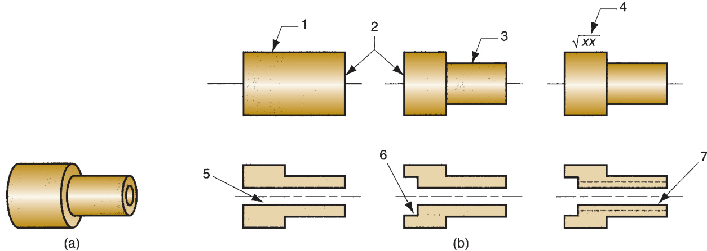  
FIGURE 38.9  Composite part concept: (a) the composite part for a family of machined rotational parts, and (b) the  individual features of the composite part.  

with each feature is a certain machining operation, as summarized in Table 38.4. A  machine cell to produce this part family would be designed with the capability to  accomplish all of the operations in the last column of the table.  

Machine Cell Designs  Machine cells can be classifi  ed according to number of  machines and level of automation. The possibilities are (a) single machine, (b) mul- tiple machines with manual handling, (c) multiple machines with mechanized han- dling, (d) fl  exible manufacturing cell, or (e) fl  exible manufacturing system. These  production cells are depicted in Figure 38.10.  

The single machine cell has one machine that is manually operated. The cell  would also include fi  xtures and tools to allow for feature and size variations within  the part family produced by the cell. The machine cell required for the part family of  Figure 38.9 would probably be of this type.  

Multiple machine cells have two or more manually operated machines. These  cells are distinguished by the method of work part handling in the cell, manual or  mechanized. Manual handling means that parts are moved within the cell by work- ers, usually the machine operators. Mechanized handling refers to conveyorized  

TABLE •  38.4  Design features of the composite part in Figure 38.3 and the  manufacturing operations required to shape those features. 
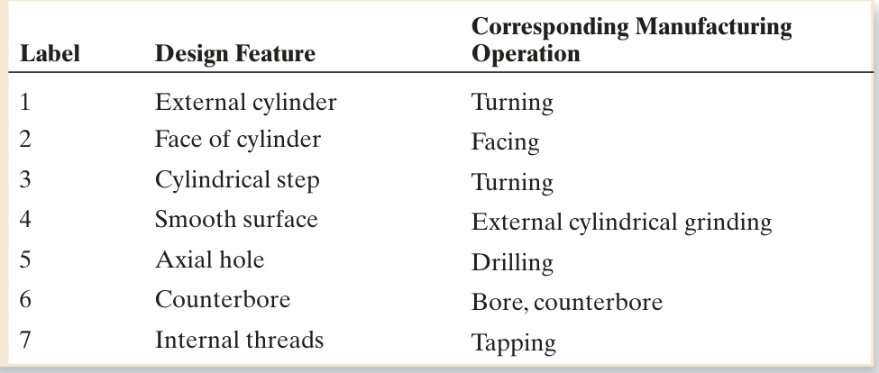  

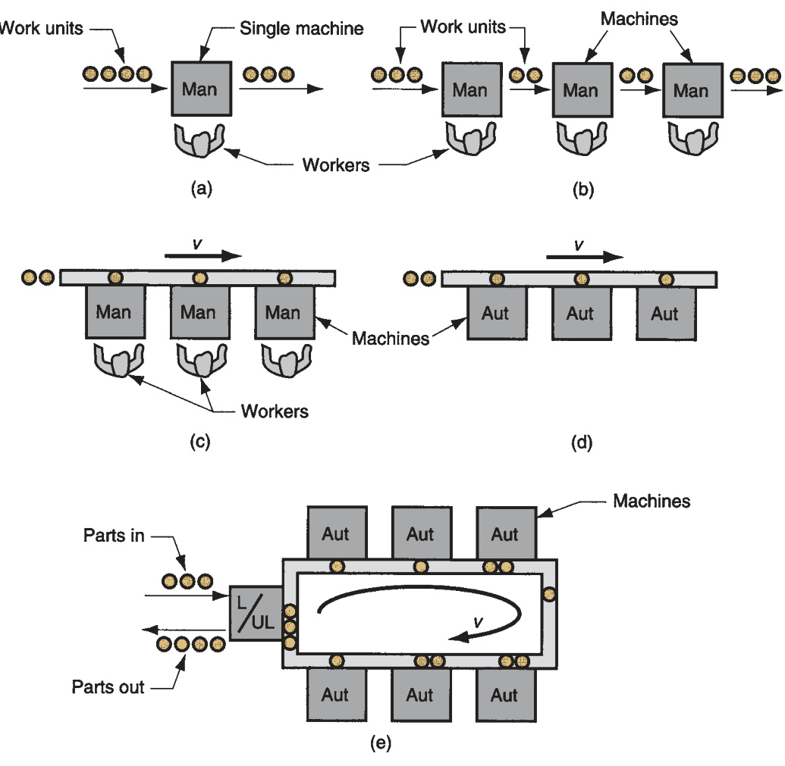  
FIGURE 38.10  Types of group  technology machine  cells: (a) single  machine, (b) multiple  machines with manual  handling, (c) multiple  machines with  mechanized handling,  (d) fl  exible  manufacturing cell, and  (e) fl  exible  manufacturing system.  Key: Man $=$  manual  operation; Aut $=$   automated station.  

transfer of parts from one machine to the next. This may be required by the size  and weight of the parts made in the cell, or simply to increase production rate. The  sketch depicts the work fl  ow as being a line; other layouts are also possible, such as  U-shaped or loop.  

Flexible manufacturing cells and fl  exible manufacturing systems consist of auto- mated machines with automated handling. Given the special nature of these inte- grated manufacturing systems and their importance, Section 38.6 is devoted to this  topic.  

Benefi  ts and Problems in Group Technology  The use of machine cells and  group technology provide substantial benefi  ts to companies that have the discipline  and perseverance to implement it. The potential benefi  ts include the following: (1)  GT promotes standardization of tooling, fi  xturing, and setups; (2) material handling  is reduced because parts are moved within a machine cell rather than the entire fac- tory; (3) production scheduling is simplifi  ed; (4) manufacturing lead time is reduced;  (5) work-in-process is reduced; (6) process planning is simpler; (7) worker satisfac- tion usually improves working in a cell; and (8) higher quality work is accomplished.  

There are several problems in implementing machine cells, however. One obvi- ous problem is rearranging production machines in the plant into the appropriate  machine cells. It takes time to plan and accomplish this rearrangement, and the  machines are not producing during the changeover. The biggest problem in starting  a GT program is identifying the part families. If the plant makes 10,000 different  parts, reviewing all of the part drawings and grouping the parts into families are  substantial tasks that consume a signifi  cant amount of time.  

#  Flexible Manufacturing Systems and Cells  

A fl  exible manufacturing system (FMS) is a highly automated group technology  machine cell, consisting of a multiple processing stations (usually computer numeri- cal control machine tools), interconnected by an automated material handling and  storage system, and controlled by an integrated computer system. An FMS is capa- ble of processing a variety of different part styles simultaneously under NC program  control at the different workstations.  

An FMS relies on the principles of group technology. No manufacturing system  can be completely fl  exible. It cannot produce an infi  nite range of parts or products.  There are limits to how much fl  exibility can be incorporated into an FMS. Accord- ingly, a fl  exible manufacturing system is designed to produce parts (or products)  within a range of styles, sizes, and processes. In other words, an FMS is capable of  producing a single part family or a limited range of part families.  

Flexible manufacturing systems vary in terms of number of machine tools and level  of fl  exibility. When the system has only a few machines, the term  fl  exible manufactur- ing cell  (FMC) is sometimes used. Both cell and system are highly automated and  computer controlled. The difference between an FMS and an FMC is not always clear,  but it is sometimes based on the number of machines (workstations) included. The  fl  exible manufacturing system consists of four or more machines, whereas a fl  exible  manufacturing cell consists of three or fewer machines [10].  

To qualify as being fl  exible, a manufacturing system should satisfy several criteria.  The tests of fl  exibility in an automated manufacturing system are the capability to (1)  process different part styles in a nonbatch mode, (2) accept changes in production  schedule, (3) respond gracefully to equipment malfunctions and breakdowns in the  system, and (4) accommodate the introduction of new part designs. These capabilities  are made possible by the use of a central computer that controls and coordinates the  components of the system. The most important criteria are (1) and (2). Criteria (3)  and (4) are less critical and can be implemented at various levels of sophistication.  

# 38.6.1  INTEGRATING THE FMS COMPONENTS  

An FMS consists of hardware and software that must be integrated into an effi  - cient and reliable unit. It also includes human personnel. This section examines these  components and how they are integrated.  

Hardware Components  FMS hardware includes workstations, material han- dling system, and central control computer. The workstations are CNC machines in  a machining type system, plus inspection stations, parts cleaning and other stations,  as required. A central chip conveyor system is often installed below fl  oor level.  

The material handling system is the means by which parts are moved between  stations. The material handling system usually includes a limited capability to store  parts. Handling systems suitable for automated manufacturing include roller con- veyors, automated guided vehicles, and industrial robots. The most appropriate type  depends on part size and geometry, as well as factors relating to economics and  compatibility with other FMS components. Nonrotational parts are often moved in a  FMS on pallet fi  xtures, so the pallets are designed for the particular handling system,  and the fi  xtures are designed to accommodate the various part geometries in the  family. Rotational parts are often handled by robots, if weight is not a limiting factor.  

The handling system establishes the basic layout of the FMS. Five layout types  can be distinguished: (1) in-line, (2) loop, (3) ladder, (4) open fi  eld, and (5) robot- centered cell. Types 1, 3, 4, and 5 are shown in Figure 38.11. Type 2 is shown in Figure  38.10(e). The  in-line layout  uses a linear transfer system to move parts between  processing stations and load/unload station(s). The in-line transfer system is usually  capable of two-directional movement; if not, then the FMS operates much like a  transfer line, and the different part styles made on the system must follow the same  basic processing sequence due to the one-direction fl  ow. The  loop layout  consists of  a conveyor loop with workstations located around its periphery. This confi  guration  permits any processing sequence, because any station is accessible from any other  station. This is also true for the  ladder layout , in which workstations are located on  the rungs of the ladder. The  open fi  eld layout  is the most complex FMS confi  gu- ration, and consists of several loops tied together. Finally, the robot-centered cell  consists of a robot whose work volume includes the load/unload positions of the  machines in the cell.  

The FMS also includes a central computer that is interfaced to the other hard- ware components. In addition to the central computer, the individual machines and  other components generally have microcomputers as their individual control units.  The function of the central computer is to coordinate the activities of the compo- nents so as to achieve a smooth overall operation of the system. It accomplishes this  function by means of software.  

FMS Software and Control Functions  FMS software consists of modules asso- ciated with the various functions performed by the manufacturing system. For  example, one function involves downloading NC part programs to the individual  machine tools; another function is concerned with controlling the material han- dling system; another is concerned with tool management; and so on. Table 38.5  lists the functions included in the operation of a typical FMS. Associated with each  function are one or more software modules. The functions and modules are largely  application specifi  c.  

Human Labor  An additional component in the operation of a fl  exible manufac- turing system or cell is human labor. Duties performed by human workers include  (1) loading and unloading parts from the system, (2) changing and setting cutting  tools, (3) maintenance and repair of equipment, (4) NC part programming, (5) pro- gramming and operating the computer system, and (6) overall management of the  system.  

# 38.6.2  APPLICATIONS OF FLEXIBLE MANUFACTURING SYSTEMS  

Flexible manufacturing systems are typically used for mid-volume, mid-variety pro- duction. If the part or product is made in high quantities with no style variations,  then a transfer line or similar dedicated manufacturing system is most appropriate.  If the parts are low volume with high variety, then a stand-alone NC machine or even  

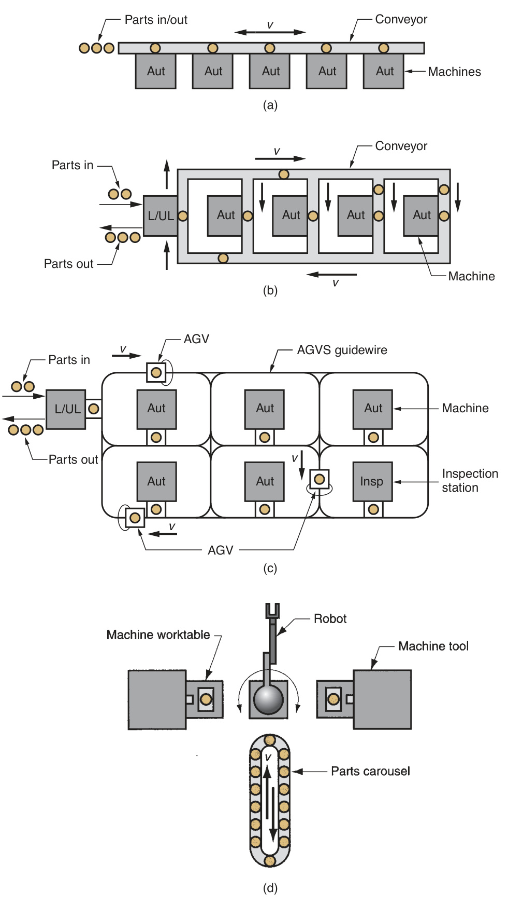  
FIGURE 38.11  Four  of the fi  ve FMS layout  types: (a) in-line,  (b) ladder, (c) open fi  eld,  and (d) robot-centered  cell. Key: Aut $=$  auto- mated station; ${\mathsf{L}}/{\mathsf{U L}}=$   load/unload station;  Insp $=$  inspection sta- tion; $\mathsf{A G V}=$  automated  guided vehicle; $\mathsf{A G V S}=$ automated guided vehi- cle system.  

TABLE •  38.5  Typical computer functions implemented by application software modules in a fl  exible  manufacturing system. 
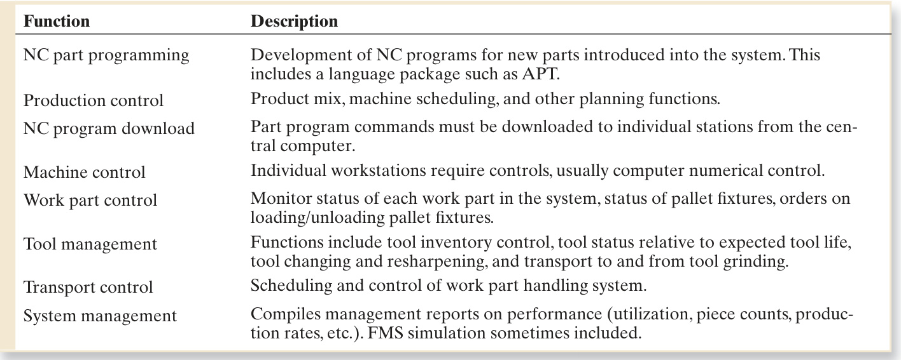  
Key: $\mathrm{NC}=$  numericals control, APT $=$  automatically programmed tooling, FMS $=$  fl  exible manufacturing system.  

manual methods would be more appropriate. These application characteristics are  summarized in Figure 38.12.  

Flexible machining systems comprise the most common application of FMS tech- nology. Owing to the inherent fl  exibilities and capabilities of computer numerical  control, it is possible to connect several CNC machine tools to a small central com- puter, and to devise automated material handling methods for transferring parts  between machines. Figure 38.13 shows a fl  exible machining system consisting of fi  ve  CNC machining centers and an in-line transfer system to pick up parts from a cen- tral load/unload station and move them to the appropriate machining stations.  

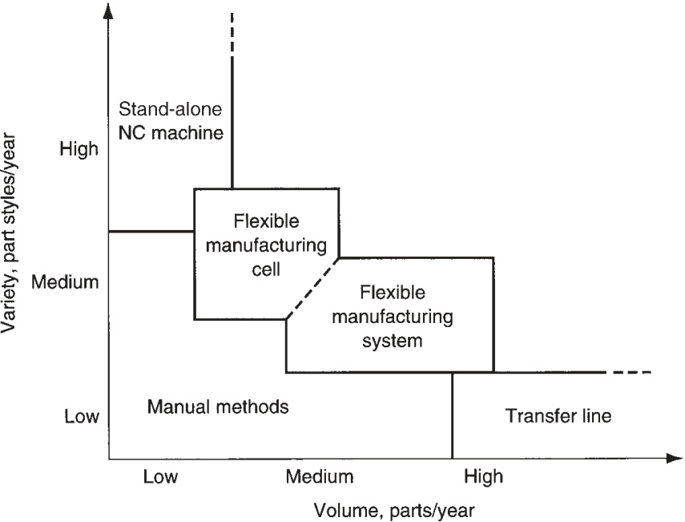  
FIGURE 38.12  Application  characteristics of  fl  exible manufacturing  systems and cells  relative to other types  of manufacturing  systems.  

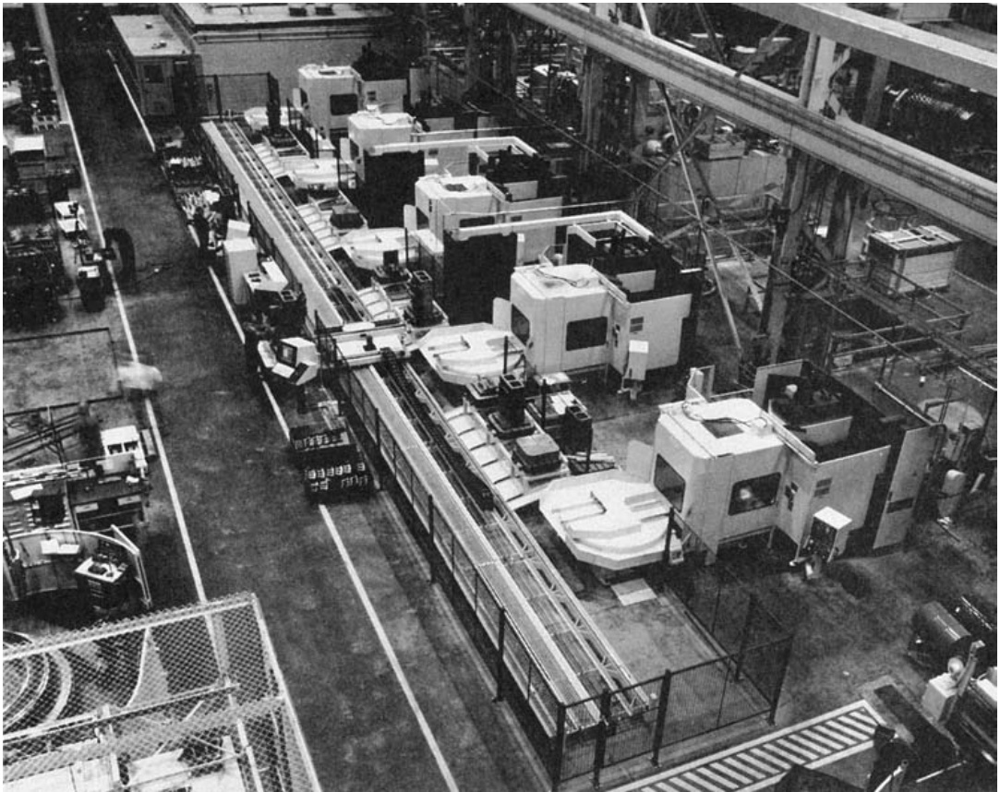  
FIGURE 38.13  A fi  ve-station fl  exible  manufacturing system.  (Photo courtesy of  Cincinnati Milacron.)  

In addition to machining systems, other types of fl  exible manufacturing systems  have also been developed, although the state of technology in these other processes  has not permitted the rapid implementation that has occurred in machining. The  other types of systems include assembly, inspection, sheet-metal processing (punch- ing, shearing, bending, and forming), and forging.  

Most of the experience in fl  exible manufacturing systems has been gained in  machining applications. For fl  exible machining systems, the benefi  ts usually given  are (1) higher machine utilization than a conventional machine shop (relative uti- lizations are $40\%$  to  $50\%$  for conventional batch type operations compared with  about $75\%$  for a FMS because of better work handling, offl  ine setups, and improved  scheduling); (2) reduced work-in-process due to continuous production rather than  batch production; (3) lower manufacturing lead times; and (4) greater fl  exibility in  production scheduling.  

# 38.6.3  MASS CUSTOMIZATION  

Taken to its limit, fl  exible manufacturing is capable of producing a unique product  for each customer. This capability is called mass customization, in which a large vari- ety of products are made at effi  ciencies approaching those of mass production. Each  product is individually customized according to specifi  cations of individual custom- ers. Referring back to the defi  nitions of production quantity and product variety in  Section 1.1.2, the distinction between mass production and mass customization is  indicated in Table 38.6. In the extreme, mass production is the production of very  

TABLE •  38.6  Comparison between mass production and mass customization. 
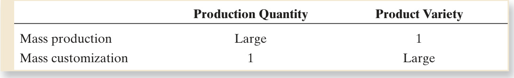  

large quantities of one product style. Similarly, mass customization involves large  product variety and only one unit is produced of each product style.  

The challenge for the mass customizer is to manage its design and produc- tion operations without the waste associated with needless product proliferation,  in which the company offers its customers so many choices among products and  available options that it is unprofi  table. The following example illustrates product  proliferation at its worst.  

# Example 38.3  Product  proliferation  

A few decades ago, one of the truck manufacturers in the United States of- fered its customers a wide variety of model choices and options. Any of more  than 100 truck models could be ordered, and each model was available in 7  different wheel bases. The customer could select among 42 basic engines, 43  different front axles, 62 transmissions, and 162 different rear axles. Thus, the  company offered its customers a choice among  

$100(7)(42)(43)(62)(162)=130(10^{8})$  possible combinations.  

At its peak, the company had an annual production of 130,000 trucks. If each  customer were to order a different truck, the company could produce trucks for  

$\frac{130(10^{8})}{130{,}000}=10{,}000$  10,000 years without ever producing the same truck twice.  

The negative consequences of product proliferation include (1) large raw mate- rial, work-in-process, and fi  nished product inventories; (2) high purchasing costs; (3)  large fl  oor space requirements, (4) too many setups and too much tooling, (5) a  costly overhead to manage the variety, (6) much marketing literature and design  data; and (7) customer confusion. So the question is: How can a company offer cus- tomized product variety while at the same time avoiding the negative consequences  of product proliferation?  

The successful mass customizer can use a number of strategies to operate effi  - ciently in the face of a large product variety. They include: (1) soft product variety,  (2) design modularity, (3) postponement, and (4) designing the product to be easily  customized.  

Large product variety does not mean hard product variety, recalling the terminol- ogy of Section 1.1.2. Indeed, mass customization would not be feasible unless soft  product variety were practiced by the company that offered customized products  to its customers. Soft product variety means that there are only small differences  among available products. The differences may appear signifi  cant to the customer,  but to the company, they are easily managed in production. The company’s strategy  is to minimize the real differences among its products while enticing the customer to  appreciate the product differentiation; for example, offering a product in which all  internal components are identical but the product is available in a variety of external  colors.  

Modularity in product design is another approach used by mass customizers, in  which the product consists of standard modules that can be assembled in unique  combinations to satisfy individual customers’ specifi  cations. The modules are stand- ard building blocks that are perhaps mass produced, but they combine in different  ways to achieve a singular product. Of course, the modules must be designed in such  a way that facilitates their assembly. An example is the personal computer. Each PC  customer specifi  es from a variety of features and options, all of which relate to hard- ware and software modules that are assembled and loaded to meet the specifi  cations.  

Postponement is closely related to design modularity. It means that the mass cus- tomizer waits until the last possible moment to complete the product which occurs  after a customer order has been received. The alternative is carrying a large inven- tory of fi  nished products that match all of the possible combinations of specifi  cations  that customers might want.  

Finally, the mass customizer designs the product so that it can be readily custom- ized. The customization can be accomplished at the last moment by the manufac- turer, as in postponement, or it can be accomplished by the merchant who deals  directly with the customer. An example of customization by the manufacturer is  when the customer can select among alternative design parameters and options that  are available, and the product is then made to those specifi  cations. Automobiles are  sometimes purchased this way. An example of merchant customization is when paint  dealers mix colorants with a standard neutral base paint to achieve the exact color  desired by the customer. The mass customizer may also design adjustability into the  product, so that the customers themselves can individualize the product. Examples of  product adjustability include car seat adjustments made by the driver and software  settings made by users of personal computers.  

#  Computer Integrated Manufacturing  

Distributed computer networks are widely used in modern manufacturing plants  to monitor and/or control the integrated systems described in this chapter. Even  though some of the operations are manually accomplished (e.g., manual assembly  lines and manned cells), computer systems are utilized for production schedul- ing, data collection, record keeping, performance tracking, and other information- related functions. In the more automated systems (e.g., transfer lines and fl  exible  manufacturing cells), computers directly control the operations. The term  computer  integrated manufacturing  (CIM) refers to the pervasive use of computer systems  throughout the organization, not only to monitor and control the operations, but  also to design the product, plan the manufacturing processes, and accomplish the  business functions related to production. One might say that CIM is the ultimate  integrated manufacturing system. In this fi  nal section of Part X, the scope of CIM  is outlined, and a bridge is provided to Part XI on manufacturing support systems.  

To begin, there are four general functions that have to be accomplished in most  manufacturing enterprises: (1) product design, (2) manufacturing planning, (3) man- ufacturing control, and (4) business functions. Product design is usually an iterative  process that includes recognition of a need for a product, problem defi  nition, creative  

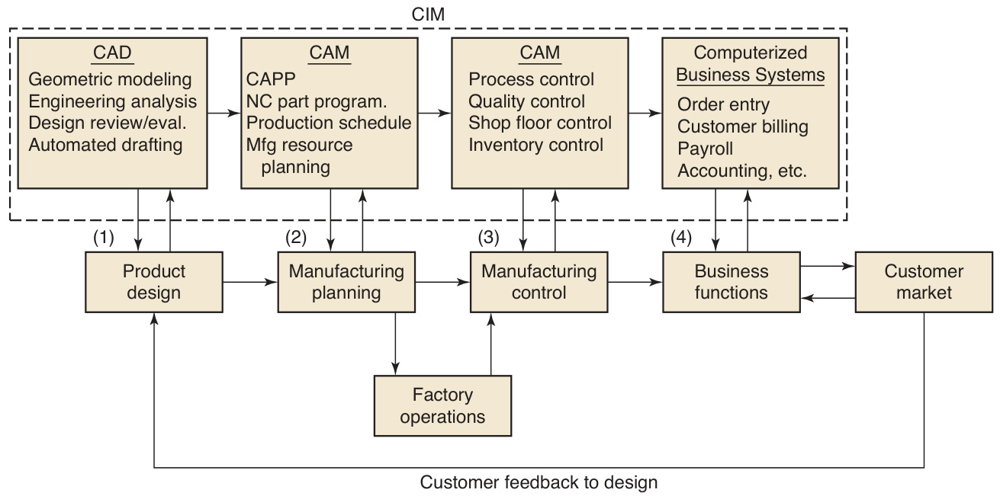  
FIGURE 38.14  Four general functions in a manufacturing organization, and how computer integrated manufacturing  systems support these functions.  

synthesis of a solution, analysis and optimization, evaluation, and documentation.  The overall quality of the resulting design is likely to be the most important factor  upon which the commercial success of a product depends. In addition, a very signifi  - cant portion of the fi  nal cost of the product is determined by decisions made during  product design. Manufacturing planning is concerned with converting the engineer- ing drawings and specifi  cations that defi  ne the product design into a plan for produc- ing the product. Manufacturing planning includes decisions on which parts will be  purchased (the “make-or-buy decision”), how each “make” part will be produced,  the equipment that will be used, how the work will be scheduled, and so on. Most  of these decisions are discussed in Chapter 39 on process planning and production  control. Manufacturing control includes not only control of the individual processes  and equipment in the plant, but also the supporting functions such as shop fl  oor con- trol (Section 39.3.4) and quality control (Chapter 40). Finally, the business functions  include order entry, cost accounting, payroll, customer billing, and other business- oriented information activities related to manufacturing.  

Computer systems play an important role in these four general functions, and  their integration within the organization is a distinguishing feature of computer  integrated manufacturing, as depicted in Figure 38.14. Computer systems associated  with product design are called CAD systems (for computer-aided design). Design  systems and software include geometric modeling, engineering analysis packages  such as fi  nite element modeling, design review and evaluation, and automated  drafting. Computer systems that support manufacturing planning are called CAM  systems (for computer-aided manufacturing) and include computer-aided process  planning (CAPP , Section 39.1.3), NC part programming (Section 38.3.3), production  scheduling (Section 39.3.1), and planning packages such as material requirements  planning (Section 39.3.2). Manufacturing control systems include those used in proc- ess control, shop fl  oor control, inventory control, and computer-aided inspection  for quality control. And computerized business systems are used for order entry,  customer billing, and other business functions. Customer orders are entered by the  company’s sales force or by the customers themselves into the computerized order  entry system. The orders include product specifi  cations that provide the inputs to  the design department. Based on these inputs, new products are designed on the  company’s CAD system. The design details serve as inputs to the manufacturing  engineering group, where computer-aided process planning, computer-aided tool  design, and related activities are performed in advance of actual production. The  output from manufacturing engineering provides much of the input data required  for manufacturing resource planning and production scheduling. Thus, computer  integrated manufacturing provides the information fl  ows required to accomplish the  actual production of the product.  

Today, computer integrated manufacturing is implemented in many companies  using  enterprise resource planning  (ERP), a computer software system that organ- izes and integrates the information fl  ows in an organization through a single, central  database. ERP is described in Section 39.3.5.  

# References  

[1] Black, J. T.  The Design of the Factory with a  Future , McGraw-Hill, New York, 1990.

  [2] Black, J. T. “An Overview of Cellular Manu- facturing Systems and Comparison to Con- ventional Systems,”  Industrial Engineering ,  November 1983, pp. 36–84.

  [3] Boothroyd, G., Poli, C., and Murch, L. E.  Auto- matic Assembly . Marcel Dekker, New York,  1982.

  [4] Buzacott, J. A. “Prediction of the Effi  ciency  of Production Systems without Internal Stor- age,”  International Journal of Production  Research , Vol. 6, No. 3, 1968, pp. 173–188.

  [5] Buzacott, J. A., and Shanthikumar, J. G.  Stochastic Models of Manufacturing Sys- tems . Prentice-Hall, Upper Saddle River,  New Jersey, 1993.

  [6] Chang, T-C, Wysk, R. A., and Wang, H-P .  Computer-Aided Manufacturing , 3rd ed. Pren- tice Hall, Upper Saddle River, New Jersey, 2005.

  [7] Chow, W-M.  Assembly Line Design . Marcel  Dekker, New York, 1990.

  [8] Gallagher, C. C., and Knight, W. A.  Group  Technology , Butterworth & Co., London, 1973.

  [9] Groover, M. P . “Analyzing Automatic Transfer  Lines,”  Industrial Engineering , Vol. 7, No. 11,  1975, pp. 26–31.

 [10] Groover, M. P .  Automation, Production Sys- tems, and Computer Integrated Manufacturing ,  3rd ed. Pearson Prentice-Hall, Upper Saddle  River, New Jersey, 2008.  

[11] Ham, I., Hitomi, K., and Yoshida, T.  Group  Technology , Kluwer Nijhoff Publishers, Hing- ham, Massachusetts, 1985.

 [12] Houtzeel, A. “The Many Faces of Group Tech- nology,”  American Machinist , January 1979,  pp. 115–120.

 [13] Luggen, W. W.  Flexible Manufacturing Cells  and Systems , Prentice Hall, Englewood Cliffs,  New Jersey, 1991.

 [14] Maleki, R. A.  Flexible Manufacturing Sys- tems: The Technology and Management , Pren- tice Hall, Englewood Cliffs, New Jersey, 1991.

 [15] Moodie, C., Uzsoy, R., and Yih, Y.  Manufactur- ing Cells: A Systems Engineering View , Taylor  & Francis, London, 1995.

 [16] Parsai, H., Leep, H., and Jeon, G.  The Prin- ciples of Group Technology and Cellular  Manufacturing , John Wiley & Sons, Hoboken,  New Jersey, 2006.

 [17] Pine II, B. J.  Mass Customization . Harvard  Business School Press, Cambridge, Massachu- setts, 1993.

 [18] Riley, F. J.  Assembly Automation, A Manage- ment Handbook , 2nd ed. Industrial Press, New  York, 1999.

 [19] Weber, A. “Is Flexibility a Myth?”  Assembly ,  May 2004, pp. 50–59.  