# Polymers  

# Chapter Contents  

8.1 Fundamentals of Polymer Science and  Technology  

8.1.1 Polymerization 8.1.2 Polymer Structures and  Copolymers 8.1.3 Crystallinity 8.1.4 Thermal Behavior of Polymers 8.1.5 Additives  

8.2 Thermoplastic Polymers  

8.2.1 Properties of Thermoplastic  Polymers 8.2.2 Important Commercial  Thermoplastics  

# 8.3 Thermosetting Polymers  

8.3.1 General Properties and  Characteristics 8.3.2 Important Thermosetting  Polymers  

# 8.4 Elastomers  

8.4.1 Characteristics of Elastomers 8.4.2 Natural Rubber 8.4.3 Synthetic Rubbers  

8.5 Polymer Recycling and Bio de grad ability  

8.5.1 Polymer Recycling 8.5.2 Biodegradable Polymers  

Of the three basic types of materials, polymers are the  newest and at the same time the oldest known to man.  Polymers form the living organisms and vital processes of  all life on earth. To ancient man, biological polymers were  the source of food, shelter, and many of his implements.  However, the focus in this chapter is on polymers other  than biological. With the exception of natural rubber,  nearly all of the polymeric materials used in engineering  today are synthetic. The materials themselves are made  by chemical processing, and most of the products are  made by solidifi  cation processes.  

A  polymer  is a compound consisting of long-chain  molecules, each molecule made up of repeating units  connected together. There may be thousands, even mil- lions of units in a single polymer molecule. The word  is derived from the Greek words  poly , meaning many,  and meros (reduced to  mer ), meaning part. Most poly- mers are based on carbon and are therefore considered  organic chemicals.  

Polymers can be separated into  plastics  and  rubbers .  As engineering materials, they are relatively new com- pared to metals and ceramics, dating only from around  the mid–1800s (Historical Note 8.1). For the purpose of  covering polymers as a technical subject, it is appropri- ate to divide them into three categories, where (1) and 

 (2) are plastics and (3) is the rubber category:  

1.  Thermoplastic polymers , also called  thermoplas- tics  (TP), are solid materials at room temperature,  but they become viscous liquids when heated to  tempera  tures of only a few hundred degrees. This  characteristic allows them to be easily and econom- ically shaped into products. They can be subjected  to this heating and cooling cycle repeatedly without  signifi  cant degradation of the polymer.  

2.  Thermosetting polymers , or  thermosets  (TS),  cannot tolerate repeated heating cycles as thermo- plastics can. When initially heated, they soften and  fl  ow for molding, but the elevated temperatures  also produce a chemical reaction that hardens the  

# Historical Note 8.1  History of polymers  

Certainly one of the milestones in the history of poly- mers was Charles Goodyear’s discovery of vulcaniza- tion of rubber in 1839 (Historical Note 8.2). In 1851, his  brother Nelson patented hard rubber, called  ebonite ,  which in reality is a thermosetting polymer. It was used  for many years for combs, battery cases, and dental  prostheses.  

At the 1862 International Exhibition in London, an  English chemist Alexander Parkes demonstrated the  possibilities of the fi  rst thermoplastic, a form of  cellulose  nitrate  (cellulose is a natural polymer in wood and cot- ton). He called it  Parkesine  and described it as a replace- ment for ivory and tortoiseshell. The material became  commercially important due to the efforts of American  John W. Hyatt, Jr., who combined cellulose nitrate and  camphor (which acts as a plasticizer) together with heat  and pressure to form the product he called  Celluloid .  His patent was issued in 1870. Celluloid plastic was  transparent, and the applications subsequently devel- oped for it included photographic and motion picture fi  lm  and windshields for carriages and early motorcars.  

Several additional products based on cellulose were  developed around the turn of the last century. Cellulose  fi  bers, called  Rayon , were fi  rst produced around 1890.  Packaging fi  lm, called  Cellophane , was fi  rst marketed  around 1910.  Cellulose acetate  was adopted as the  base for photographic fi  lm around the same time. This  material was to become an important thermoplastic  for injection molding during the next several decades.  

The fi  rst synthetic plastic was developed in the early  1900s by the Belgian-born American chemist L. H.  Baekeland. It involved the reaction and polymerization  of phenol and formaldehyde to form what its inventor  called  Bakelite . This thermosetting resin is still commer- cially important today. It was followed by other similar  polymers: urea-formaldehyde in 1918 and melamine- formaldehyde in 1939.  

The late 1920s and 1930s saw the development of  a number of thermoplastics of major importance today.  A Russian I. Ostromislensky had patented  polyvinylchlo- ride  in 1912, but it was fi  rst commercialized in 1927 as a  wall covering. Around the same time,  polystyrene  was  fi  rst produced in Germany. In England, fundamental re- search was started in 1932 that led to the synthesis of  polyethylene ; the fi  rst production plant came on line just  before the outbreak of World War II.  This was low density  polyethylene. Finally, a major research program initiated  in 1928 under the direction of W. Carothers at DuPont in  the United States led to the synthesis of the polyamide  nylon ; it was commercialized in the late 1930s. Its initial  use was in ladies’ hosiery; subsequent applications dur- ing the war included low friction bearings and wire insu- lation. Similar efforts in Germany provided an alternative  form of nylon in 1939.  

Several important special-purpose polymers were  developed in the 1940s:  fl  uorocarbons  ( Tefl  on ),  sili- cones , and  polyurethanes  in 1943;  epoxy  resins in  1947 , and  acrylonitrile-butadiene-styrene  copolymer  (ABS) in 1948. During the 1950s:  polyester  fi  bers in  1950; and  polypropylene ,  polycarbonate , and  high- density polyethylene  in 1957 .  Thermoplastic   elas- tomers  were fi  rst developed in the 1960s.  The ensuing  years have witnessed a tremendous growth in the use  of plastics.  

material into an infusible solid. If reheated, thermosetting polymers degrade and  char rather than soften.  

3.  Elastomers  are the rubbers. Elastomers (E) are polymers that exhibit extreme  elastic extensibility when subjected to relatively low mechanical stress. Some  elastomers can be stretched by a factor of 10 and yet completely recover to their  original shape. Although their properties are quite different from thermosets,  they have a similar molecular structure that is different from the thermoplastics.  

Thermoplastics are commercially the most important of the three types, constitut- ing around $70\%$  of the tonnage of all synthetic polymers produced. Thermosets and  elastomers share the remaining $30\%$  about evenly, with a slight edge for the former.  Common TP polymers include polyethylene, polyvinyl chloride, polypropylene,  poly  styrene, and nylon. Examples of TS polymers are phenolics, epoxies, and certain  polyesters. The most common example given for elastomers is natural (vulcanized)  rubber; however, synthetic rubbers exceed the tonnage of natural rubber.  

Although the classifi  cation of polymers into the TP , TS, and E categories suits the  purpose of organizing the topic in this chapter, note that the three types sometimes  overlap. Certain polymers that are normally thermoplastic can be made into ther- mosets. Some polymers can be either thermosets or elastomers (recall that their  molecular structures are similar). And some elastomers are thermoplastic. However,  these are exceptions to the general classifi  cation scheme.  

The growth in applications of synthetic polymers is truly impressive. On a volu- metric basis, current annual usage of polymers exceeds that of metals. There are  several reasons for the commercial and technological importance of polymers:  

$\succcurlyeq$ Plastics can be formed by molding into intricate part geometries, usually  with no further processing required. They are very compatible with  net shape processing.

 $\succcurlyeq$ Plastics possess an attractive list of properties for many engineering applications  where strength is not a factor: (1) low density relative to metals and ceramics; (2)  good strength-to-weight ratios for certain (but not all) polymers; (3) high corrosion  resistance; and (4) low electrical and thermal conductivity.

 $\succcurlyeq$ On a volumetric basis, polymers are cost competitive with metals.

 $\succcurlyeq$ On a volumetric basis, polymers generally require less energy to produce than  metals. This is generally true because the temperatures for working these materials  are much lower than for metals.

 $\succcurlyeq$ Certain plastics are translucent and/or transparent, which makes them competi- tive with glass in some applications.

 $\succcurlyeq$ Polymers are widely used in composite materials (Chapter 9).  

On the negative side, polymers in general have the following limitations: (1) strength  is low relative to metals and ceramics; (2) modulus of elasticity or stiffness is also low— in the case of elastomers, of course, this may be a desirable characteristic; (3) service  temperatures are limited to only a few hundred degrees because of the softening of  thermoplastic polymers or degradation of thermosetting polymers and elastomers;  (4) some polymers degrade when subjected to sunlight and other forms of radiation;  and (5) plastics exhibit viscoelastic properties (Section 3.5), which can be a distinct  limitation in load bearing applications.  

This chapter examines the technology of polymeric materials. The fi  rst section is  devoted to an introductory discussion of polymer science and technology. Subsequent  sections survey the three basic categories of polymers: thermoplastics, thermosets,  and elastomers.  

# Fundamentals of Polymer Science  and Technology  

Polymers are synthesized by joining many small molecules together to form very  large molecules, called  macromolecules , that possess a chain-like structure. The  small units, called  monomers , are generally simple unsaturated organic molecules  such as ethylene  $\mathrm{C_{2}H_{4}}$ . The atoms in these molecules are held together by covalent  bonds; and when joined to form the polymer, the same covalent bonding holds the  links of the chain together. Thus, each large molecule is characterized by strong  primary bonding. Synthesis of the polyethylene molecule is depicted in Figure 8.1.  

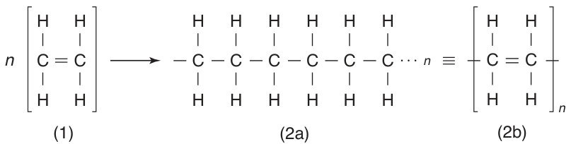  
FIGURE 8.1  Synthesis  of polyethylene from  ethylene monomers: (1)  $n$  ethylene monomers  yields (2a) polyethylene  of chain length $n,$  (2b)  concise notation for  depicting the polymer  structure of chain  length $n$ .  

As its structure is described here, polyethylene is a linear polymer; its mers form  one long chain.  

A mass of polymer material consists of many macromolecules; the analogy of  a bowl of just-cooked spaghetti (without sauce) is sometimes used to visualize the  relationship of the individual molecules to the bulk material. Entanglement among  the long strands helps to hold the mass together, but atomic bonding is more signifi  - cant. The bonding between macromolecules in the mass is due to van der Waals and  other secondary bonding types. Thus, the aggregate polymer material is held together  by forces that are substantially weaker than the primary bonds holding the molecules  together. This explains why plastics in general are not nearly as stiff and strong as  metals or ceramics.  

When a thermoplastic polymer is heated, it softens. The heat energy causes the  macromolecules to become thermally agitated, exciting them to move relative to each  other within the polymer mass (here, the wet spaghetti analogy loses its appeal). The  material begins to behave like a viscous liquid, viscosity decreasing (fl  uidity increasing)  with rising temperature.  

The following discussion will expand on these opening remarks, tracing how poly- mers are synthesized and examining the characteristics of the materials that result  from the synthesis.  

# 8.1.1  POLYMERIZATION  

As a chemical process, the synthesis of polymers can occur by either of two methods:  (1) addition polymerization and (2) step polymerization. Production of a given poly- mer is generally associated with one method or the other.  

Addition Polymerization  In this process, exemplifi  ed by polyethylene, the double  bonds between carbon atoms in the ethylene monomers are induced to open so that  they join with other monomer molecules. The connections occur on both ends of  the expanding macromolecule, developing long chains of repeating mers. Because  of the way the molecules are formed, the process is also known as  chain poly- merization . It is initiated using a chemical catalyst (called an  initiator ) to open the  carbon double bond in some of the monomers. These monomers, which are now  highly reactive because of their unpaired electrons, then capture other monomers  to begin forming chains that are reactive. The chains propagate by capturing still  other monomers, one at a time, until large molecules have been produced and the  reaction is terminated. The process proceeds as indicated in Figure 8.2. The entire  polymerization reaction takes only seconds for any given macromolecule. How- ever, in the industrial process, it may take many minutes or even hours to complete  

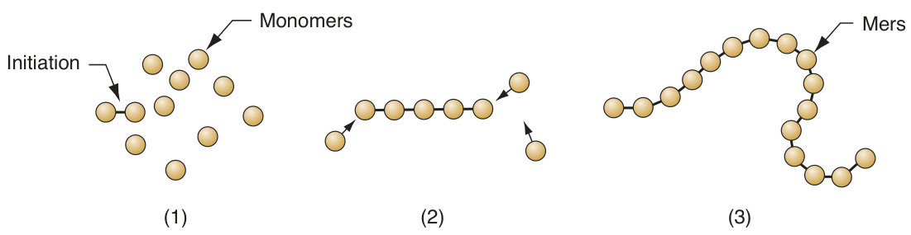  
FIGURE 8.2  Model of  addition (chain) polym- erization: (1) initiation,  (2) rapid addition  of monomers, and (3)  resulting long-chain  polymer molecule with  n  mers at termination  of reaction.  

the polymerization of a given batch, since all of the chain reactions do not occur  simultaneously in the mixture.  

Other polymers typically formed by addition polymerization are presented in  Figure 8.3, along with the starting monomer and the repeating mer. Note that the  chemical formula for the monomer is the same as that of the mer in the polymer.  This is a characteristic of this method of polymerization. Note also that many of  the common polymers involve substitution of some alternative atom or molecule in  place of one of the H atoms in polyethylene. Polypropylene, polyvinyl chloride, and  polystyrene are examples of this substitution. Polytetrafl  uoroethylene replaces all  four H atoms in the structure with atoms of fl  uorine (F). Most addition polymers are  thermoplastics. The exception in Figure 8.3 is polyisoprene, the polymer of natural  rubber. Although formed by addition polymerization, it is an elastomer.  

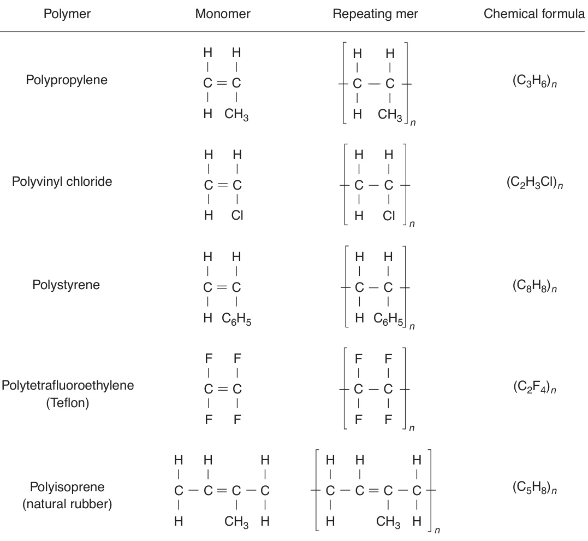  

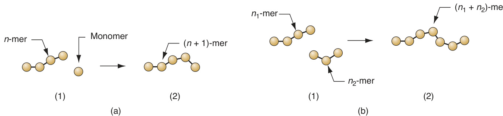  
FIGURE 8.4  Model of step polymerization showing the two types of reactions occurring: (a) $n$ -mer attaching a  single monomer to form a $\left(\dot{n}+\dot{\boldsymbol{\mathrm{\Omega}}}\right)$  -mer; and (b) $n_{1}$ -mer combining with $n_{2}$ -mer to form a  $\bar{(}n_{1}+n_{2})$  -mer. Sequence is  shown by (1) and (2).  

Step Polymerization  In this form of polymerization, two reacting monomers are  brought together to form a new molecule of the desired compound. In most (but  not all) step polymerization processes, a byproduct of the reaction is also produced.  The byproduct is typically water, which condenses; hence, the term  condensation  polymerization  is often used for processes that yield the condensate. As the reac- tion continues, more molecules of the reactants combine with the molecules fi  rst  synthesized to form polymers of length $n=2$ , then polymers of length  $n=3$ , and  so on. Polymers of increasing n are created in a slow, stepwise fashion. In addition  to this gradual elongation of the molecules, intermediate polymers of length $n_{1}$  and  $n_{2}$  also combine to form molecules of length $n=n_{1}+n_{2}$ , so that two types of reac- tions are proceeding simultaneously once the process is under way, as illustrated  in Figure 8.4. Accordingly, at any point in the process, the batch contains polymers  of various lengths. Only after suffi  cient time has elapsed are molecules of adequate  length formed.  

It should be noted that water is not always the byproduct of the reaction; for  example, ammonia  $\left(\mathrm{NH}_{3}\right)$  is another simple compound produced in some reac- tions. Nevertheless, the term condensation polymerization is still used. It should  also be noted that although most step polymerization processes involve condensa- tion of a byproduct, some do not. Examples of commercial polymers produced by  step (conden  sation) polymerization are given in Figure 8.5. Both thermoplastic and  thermosetting polymers are synthesized by this method; nylon-6,6 and polycarbonate  are TP polymers, while phenol formaldehyde and urea formaldehyde are TS polymers.  

Degree of Polymerization and Molecular Weight  A macromolecule produced  by polymerization consists of  $n$  repeating mers. Since molecules in a given batch  of polymerized material vary in length,  $n$  for the batch is an average; its statistical  distribution is normal. The mean value of  $n$  is called the  degree of polymerization   (DP) for the batch. The degree of polymerization affects the properties of the poly- mer: higher DP increases mechanical strength but also increases viscosity in the fl  uid  state, which makes processing more diffi  cult.  

The  molecular weight  (MW) of a polymer is the sum of the molecular weights  of the mers in the molecule; it is n times the molecular weight of each repeating  unit. Since $n$  varies for different molecules in a batch, the molecule weight must be  interpreted as an average. Typical values of DP and MW for selected polymers are  presented in Table 8.1.  

TABLE •  8.1  Typical values of degree of polymerization and molecular weight for  selected thermoplastic polymers. 
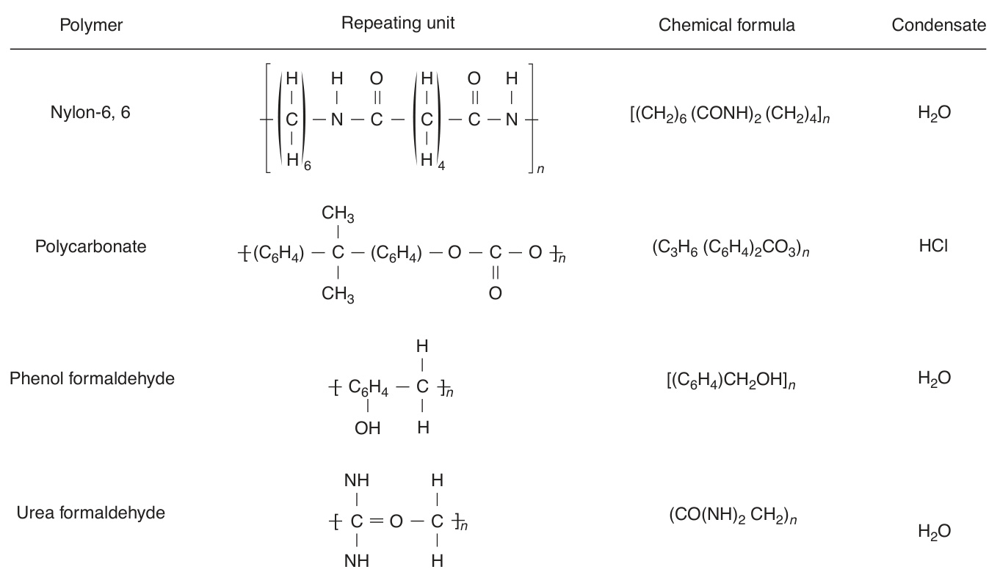  

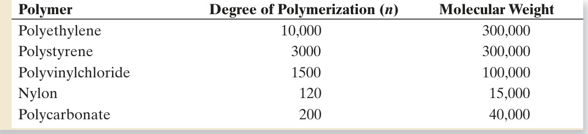  

Compiled from [7].  

H CH H CH H CH H CH H CH H H H CH H H 3 3 3 3 3 3 C C C C C C C C C C C C C C C C H H H H H H H H H H H CH H H H CH 3 3 (a) (b) 
$$
\begin{array}{r l}{\mathsf{H}}&{\mathsf{H}\quad\mathsf{H}\quad\mathsf{H}\quad\mathsf{H}\quad\mathsf{C}\mathsf{H}_{3}\quad\mathsf{H}\quad\mathsf{H}}\\ {\mathsf{I}}&{\mathsf{I}\quad\mathsf{I}\quad\mathsf{I}\quad\mathsf{I}\quad\mathsf{I}\quad\mathsf{I}\quad\mathsf{I}\quad\mathsf{I}}\\ {-\mathsf{C}-\mathsf{C}-\mathsf{C}-\mathsf{C}-\mathsf{C}-\mathsf{C}-\mathsf{C}-\mathsf{C}-\mathsf{C}-\mathsf{C}-\mathsf{C}-\mathsf{C}-\mathsf{C}}\\ {\mathsf{I}}&{\mathsf{I}\quad\mathsf{I}\quad\mathsf{I}\quad\mathsf{I}\quad\mathsf{I}\quad\mathsf{I}\quad\mathsf{I}\quad\mathsf{I}\quad\mathsf{I}\quad\mathsf{I}}\\ {\mathsf{H}}&{\mathsf{C}\mathsf{H}_{3}\quad\mathsf{H}\quad\mathsf{C}\mathsf{H}_{3}\quad\mathsf{H}\quad\mathsf{H}\quad\mathsf{H}\quad\mathsf{C}\mathsf{H}_{3}}\end{array}
$$
 (c)  

other atom or atom group. Polypropylene is an example; it is similar to polyethylene  except that  $\mathrm{CH}_{3}$  is substituted for one of the four H atoms in the mer. Three tactic  arrangements are possible, illustrated in Figure 8.6: (a)  isotactic , in which the odd  atom groups are all on the same side; (b)  syndiotactic , in which the atom groups  alternate on opposite sides; and (c)  atactic , in which the groups are randomly along  either side.  

The tactic structure is important in determining the properties of the polymer. It  also infl  uences the tendency of a polymer to crystallize (Section 8.1.3). Continuing with  the polypropylene example, this polymer can be synthesized in any of the three tactic  structures. In its isotactic form, it is strong and melts at $175^{\circ}\mathrm{C}\left(347^{\circ}\mathrm{F}\right)$ ; the syndiot  actic  structure is also strong, but melts at  $131^{\circ}\mathrm{C}$   $(268^{\circ}\mathrm{F})$ ; but atactic polypropylene is soft  and melts at around $75^{\circ}\mathrm{C}\left(165^{\circ}\mathrm{F}\right)$  and has little commercial use [6], [9].  

Linear, Branched, and Cross-Linked Polymers  The polymerization process has  been described as yielding macromolecules of a chain-like structure, called a  linear  polymer . This is the characteristic structure of a thermoplastic polymer. Other struc- tures are possible, as portrayed in Figure 8.7. One possibility is for side branches  to form along the chain, resulting in the  branched polymer  shown in Figure 8.7(b).  In polyethylene, this occurs because hydrogen atoms are replaced by carbon atoms  at random points along the chain, initiating the growth of a branch chain at each  location. For certain polymers, primary bonding occurs between branches and other  molecules at certain connection points to form  cross-linked polymers  as pictured in  Figure 8.7(c) and (d). Cross-linking occurs because a certain proportion of the mono- mers used to form the polymer are capable of bonding to adjacent monomers on  more than two sides, thus allowing branches from other molecules to attach. Lightly  cross-linked structures are characteristic of elastomers. When the polymer is highly  cross-linked, this is referred to as  network structure , as in (d); in effect, the entire mass  is one gigantic macro  molecule. Thermosetting plastics take this structure after curing.  

The presence of branching and cross-linking in polymers has a signifi  cant effect on  properties. It is the basis of the difference between the three categories of polymers:  TP , TS, and E. Thermoplastic polymers always possess linear or branched structures,  or a mixture of the two. Branching increases entanglement among the molecules,  usually making the polymer stronger in the solid state and more viscous at a given  temperature in the plastic or liquid state.  

Thermosetting plastics and elastomers are cross-linked polymers. Cross-linking  causes the polymer to become chemically set; the reaction cannot be reversed.  

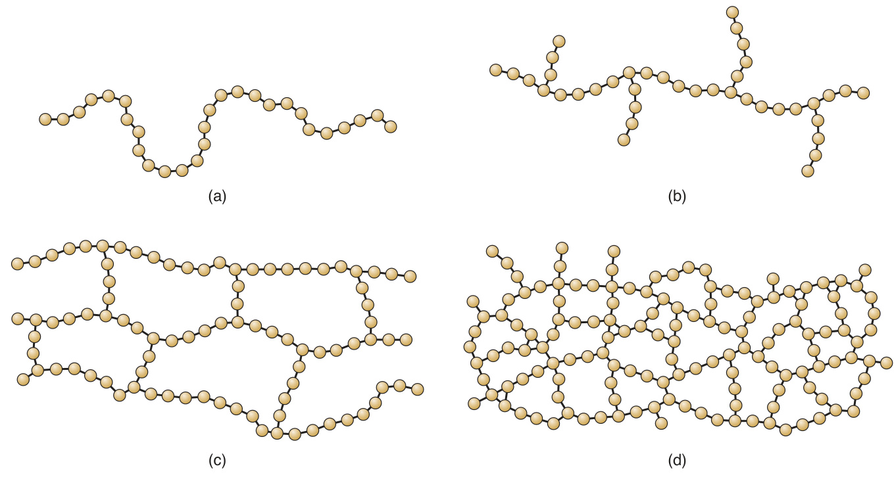  
FIGURE 8.7  Various structures of polymer molecules: (a) linear, characteristic of thermoplastics; (b) branched; (c)  loosely cross-linked as in an elastomer; and (d) tightly cross-linked or networked structure as in a thermoset.  

The effect is to permanently change the structure of the polymer; upon heating,  it degrades or burns rather than melts. Thermosets possess a high degree of cross- linking, while elastomers possess a low degree of cross-linking. Thermosets are hard  and brittle, while elastomers are elastic and resilient.  

Copolymers  Polyethylene is a  homopolymer ; so are polypropylene, polystyrene,  and many other common plastics; their molecules consist of repeating mers that are  all the same type.  Copolymers  are polymers whose molecules are made of repeating  units of two different types. An example is the copolymer synthesized from ethylene  and propylene to produce a copolymer with elastomeric properties. The ethylene- propylene copolymer can be represented as follows:  

$$
-(\mathrm{C}_{2}\mathrm{H}_{4})_{n}\left(\mathrm{C}_{3}\mathrm{H}_{6}\right)_{m}-
$$  

where $n$  and $m$  range between 10 and 20, and the proportions of the two constituents are  around  $50\%$  each. For example, the combination of polyethylene and poly  propylene  with small amounts of diene is an important synthetic rubber (Section 8.4.3).  

Copolymers can possess different arrangements of their constituent mers. The  possibilities are shown in Figure 8.8: (a)  alternating copolymer , in which the mers  repeat every other place; (b)  random , in which the mers are in random order, the fre- quency depending on the relative proportions of the starting monomers; (c)  block ,  in which mers of the same type tend to group themselves into long segments along  the chain; and (d)  graft , in which mers of one type are attached as branches to a  main backbone of mers of the other type. The ethylene–propylene diene rubber,  mentioned previously, is a block type.  

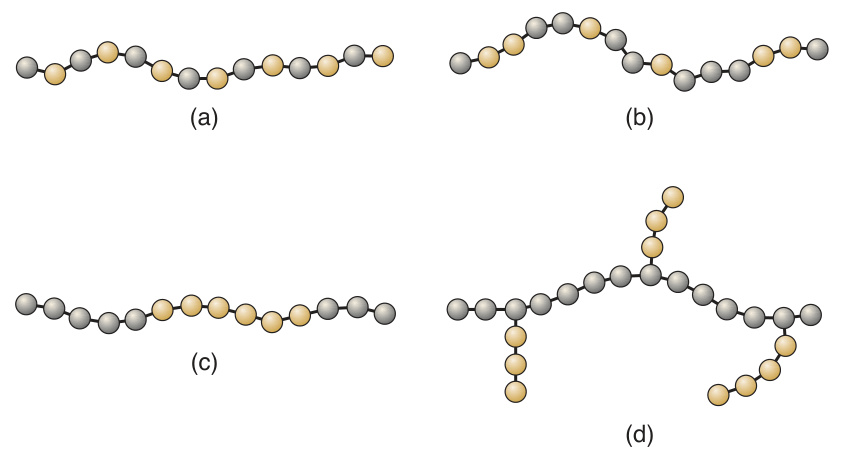  
FIGURE 8.8  Various  structures of copoly- mers: (a) alternating,  (b) random, (c) block,  and (d) graft.  

Synthesis of copolymers is analogous to alloying of metals to form solid solutions.  As with metallic alloys, differences in the ingredients and structure of copolymers can  have a substantial effect on properties. An example is the polyethylene–polypropylene  mixture discussed above. Each of these polymers alone is fairly stiff; yet a 50–50 mix- ture forms a copolymer of random structure that is rubbery.  

It is also possible to synthesize  ternary polymers , or  terpolymers , which consist of  mers of three different types. An example is the plastic ABS (acrylonitrile–butadiene– styrene—no wonder they call it ABS).  

# 8.1.3  CRYSTALLINITY  

Both amorphous and crystalline structures are possible with polymers, although  the tendency to crystallize is much less than for metals or nonglass ceramics. Not  all poly  mers can form crystals. For those that can, the  degree of crystallinity  (the  propor  tion of crystallized material in the mass) is always less than $100\%$ . As crystal- linity is increased in a polymer, so are (1) density, (2) stiffness, strength, and tough- ness, and (3) heat resistance. In addition, (4) if the polymer is transparent in the  amorphous state, it becomes opaque when partially crystallized. Many polymers  are transparent, but only in the amorphous (glassy) state. Some of these effects  can be illustrated by the differences between low-density and high-density poly- ethylene, presented in Table 8.2. The underlying reason for the property differences  between these materials is the degree of crystallinity.  

Linear polymers consist of long molecules with thousands of repeated mers. Crys- tallization in these polymers involves the folding back and forth of the long chains  

TABLE •  8.2  Comparison of low-density polyethylene and high-density polyethylene. 
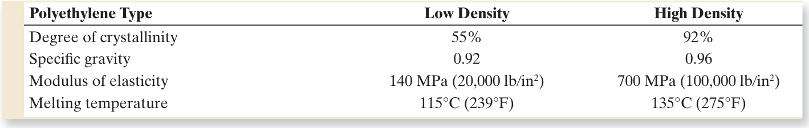  
Compiled from [6]. Values given are typical.  

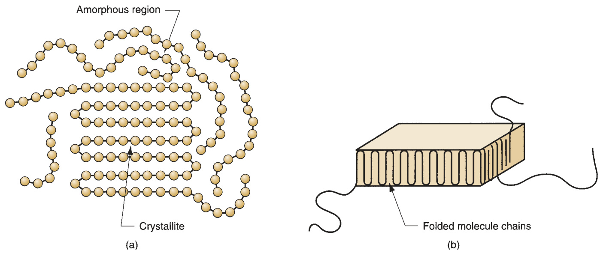  
FIGURE 8.9  Crystallized regions in a polymer: (a) long molecules forming crystals randomly mixed in with the  amorphous material; and (b) folded chain lamella, the typical form of a crystallized region.  

upon themselves to achieve a very regular arrangement of the mers, as pictured in  Figure 8.9(a). The crystallized regions are called  crystallites . Owing to the tremen- dous length of a single molecule (on an atomic scale), it may participate in more than  one crystallite. Also, more than one molecule may be combined in a single crystal  region. The crystallites take the form of lamellae, as pictured in Figure 8.9(b), that are  randomly mixed in with the amorphous material. Thus, a polymer that crystallizes  is a two-phase system—crystallites interspersed throughout an amorphous matrix.  

A number of factors determine the capacity and/or tendency of a polymer to form  crystalline regions within the material. The factors can be summarized as follows:  (1) as a general rule, only linear polymers can form crystals; (2) stereo regularity of  the molecule is critical [15]: isotactic polymers always form crystals; syndiotactic poly- mers sometimes form crystals; atactic polymers never form crystals; (3) copolymers,  due to their molecular irregularity, rarely form crystals; (4) slower cooling promotes  crystal formation and growth, as it does in metals and ceramics; (5) mechanical defor- mation, as in the stretching of a heated thermoplastic, tends to align the structure and  increase crystallization; and (6) plasticizers (chemicals added to a polymer to soften  it) reduce the degree of crystallinity.  

# 8.1.4  THERMAL BEHAVIOR OF POLYMERS  

The thermal behavior of polymers with crystalline structures is different from that  of amorphous polymers (Section 2.4). The effect of structure can be observed on a  plot of specifi  c volume (reciprocal of density) as a function of temperature, as plot- ted in Figure 8.10. A highly crystalline polymer has a melting point  $T_{m}$  at which its  volume undergoes an abrupt change. Also, at temperatures above  $T_{m}$ , the thermal  expansion of the molten material is greater than for the solid material below  $T_{m}$ . An  amorphous polymer does not undergo the same abrupt changes at  $T_{m}$ . As it is cooled  from the liquid, its coeffi  cient of thermal expansion continues to decline along the  

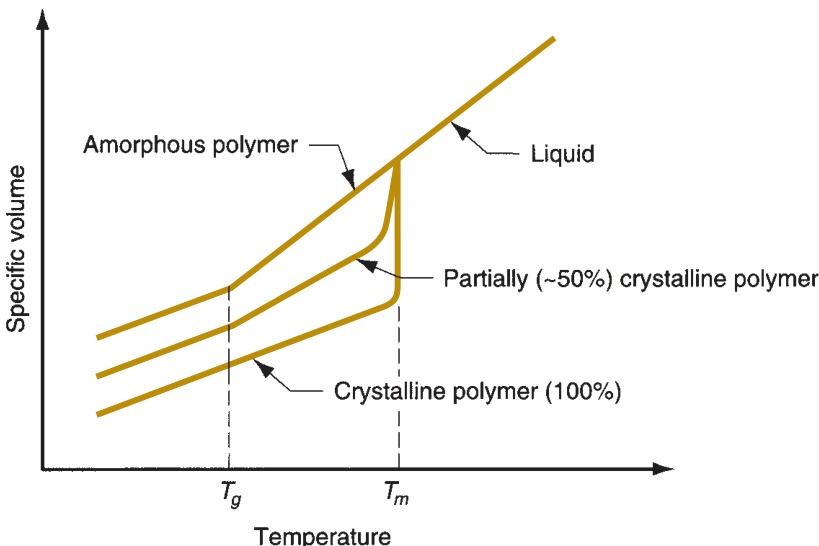  
FIGURE 8.10  Behavior  of polymers as a func- tion of temperature.  

same trajectory as when it was molten, and it becomes increasingly viscous with  decreasing temperature. During cooling below  $T_{m}$ , the polymer changes from liquid  to rubbery. As temperature continues to drop, a point is fi  nally reached at which the  thermal expansion of the amorphous polymer suddenly becomes lower. This is the  glass-transition temperature , $T_{g}$  (Section 3.5), seen as the change in slope. Below  $T_{g},$ ,  the material is hard and brittle.  

A partially crystallized polymer lies between these two extremes, as indicated  in Figure 8.10. It is an average of the amorphous and crystalline states, the average  depending on the degree of crystallinity. Above  $T_{m}$  it exhibits the viscous character- istics of a liquid; between  $T_{m}$  and $T_{g}$  it has viscoelastic properties; and below  $T_{g}$  it has  the conventional elastic properties of a solid.  

What is described in this section applies to thermoplastic materials, which can  move up and down the curve of Figure 8.10 multiple times. The manner in which they  are heated and cooled may change the path that is followed. For example, fast cool- ing rates may inhibit crystal formation and increase the glass-transition temperature.  Thermosets and elastomers cooled from the liquid state behave like an amorphous  polymer until cross-linking occurs. Their molecular structure restricts the formation  of crystals. And once their molecules are cross-linked, they cannot be reheated to the  molten state.  

# 8.1.5  ADDITIVES  

The properties of a polymer can often be benefi  cially changed by combining them  with additives. Additives either alter the molecular structure of the polymer or add  a second phase to the plastic, in effect transforming a polymer into a composite mate- rial.  Additives can be classifi  ed by function as (1) fi  llers, (2) plasticizers, (3) colorants,  (4) lubricants, (5) fl  ame retardants, (6) cross-linking agents, (7) ultraviolet light  absorbers, and (8) antioxidants.  

Filler   Fillers  are solid materials added to a polymer usually in particulate or fi  brous  form to alter its mechanical properties or to simply reduce material cost. Other rea- sons for using fi  llers are to improve dimensional and thermal stability. Examples  of fi  llers used in polymers include cellulosic fi  bers and powders (e.g., cotton fi  bers  and wood fl  our, respectively); powders of silica  $(\mathrm{SiO}_{2})$ , calcium carbonate  $(\mathrm{CaCO}_{3})$ ,  and clay (hydrous aluminum silicate); and fi  bers of glass, metal, carbon, or other  polymers. Fillers that improve mechanical properties are called  reinforcing agents ,  and composites thus created are referred to as  reinforced plastics ; they have higher  stiffness, strength, hardness, and toughness than the original polymer. Fibers provide  the greatest strengthening effect.  

Plasticizers   Plasticizers  are chemicals added to a polymer to make it softer and  more fl  exible, and to improve its fl  ow characteristics during forming. The plasticizer  works by reducing the glass transition temperature to below room temperature.  Whereas the polymer is hard and brittle below Tg, it is soft and tough above it. Addi- tion of a plasticizer 1  to polyvinyl chloride (PVC) is a good example; depending on the  proportion of plasticizer in the mix, PVC can be obtained in a range of properties,  from rigid and brittle to fl  exible and rubbery.  

Colorants  An advantage of many polymers over metals or ceramics is that the  material itself can be obtained in most any color. This eliminates the need for sec- ondary coating operations. Colorants for polymers are of two types: pigments and  dies.  Pigments  are fi  nely powdered materials that are insoluble in and must be uni- formly distributed throughout the polymer in very low concentrations, usually less  that  $1\%$ . They often add opacity as well as color to the plastic.  Dies  are chemicals,  usually supplied in liquid form, that are generally soluble in the polymer. They are  normally used to color transparent plastics such as styrene and acrylics.  

Other Additives   Lubricants  are sometimes added to the polymer to reduce fric- tion and promote fl  ow at the mold interface. Lubricants are also helpful in releasing  the part from the mold in injection molding. Mold release agents, sprayed onto the  mold surface, are often used for the same purpose.  

Nearly all polymers burn if the required heat and oxygen are supplied. Some  polymers are more combustible than others.  Flame retardants  are chemicals added  to polymers to reduce fl  ammability by any or a combination of the following  mechanisms: (1) interfering with fl  ame propagation, (2) producing large amounts  of incombustible gases, and/or (3) increasing the combustion temperature of the  material. The chemicals may also function to (4) reduce the emission of noxious or  toxic gases generated during combustion.  

Additives that cause cross-linking in thermosetting polymers and elastomers  should be included in the discussion here. The term  cross-linking agent  refers to a  variety of ingredients that cause a cross-linking reaction or act as a catalyst to pro- mote such a reaction. Important commercial examples are (1) sulfur in vulcanization  of natural rubber, (2) formaldehyde for phenolics to form phenolic thermosetting  plastics, and (3) peroxides for polyesters.  

Many polymers are susceptible to degradation by ultraviolet light (e.g., from sun- light) and oxidation. The degradation manifests itself as the breaking of links in the  long chain molecules. Polyethylene, for example, is vulnerable to both types of deg- radation, which lead to a loss of mechanical strength.  Ultraviolet light absorbers and  antio  xidants  are additives that reduce the susceptibility of the polymer to these  forms of attack.  

#  Thermoplastic Polymers  

This section discusses the properties of the thermoplastic polymer group and pro- vides a survey of its important members.  

# 8.2.1 PROPERTIES OF THERMOPLASTIC POLYMERS  

The defi  ning property of a thermoplastic polymer is that it can be heated from a  solid state to a viscous liquid state and then cooled back down to solid, and that  this heating and cooling cycle can be applied multiple times without degrading the  polymer. The reason for this property is that TP polymers consist of linear (and/or  branched) macromolecules that do not cross-link when heated. By contrast, thermo- sets and elastomers undergo a chemical change when heated, which cross-links their  molecules and permanently sets these polymers.  

In truth, thermoplastics do deteriorate chemically with repeated heating and  cooling. In plastic molding, a distinction is made between new or  virgin  material,  and plastic that has been previously molded (e.g., sprues, defective parts) and there- fore has experienced thermal cycling. For some applications, only virgin material  is acceptable. Thermoplastic polymers also degrade gradually when subjected to  continuous elevated temperatures below  $T_{m}$ . This long-term effect is called  thermal  aging  and involves slow chemical deterioration. Some TP polymers are more suscep- tible to thermal aging than others, and for a given material the rate of deterioration  depends on temperature.  

Mechanical Properties  In the discussion of mechanical properties in Chapter  3, polymers were compared with metals and ceramics. The typical thermoplastic at  room temperature is characterized by the following: (1) much lower stiffness, the  modulus of elasticity being two (in some cases, three) orders of magnitude lower than  metals and ceramics; (2) lower tensile strength, about  $10\%$  of the metals; (3) much  lower hardness; and (4) greater ductility on average, but there is a tremendous range  of values, from $1\%$  elongation for polystyrene to $500\%$  or more for polypropylene.  

Mechanical properties of thermoplastics depend on temperature. The func- tional relationships must be discussed in the context of amorphous and crystal- line structures. Amorphous thermoplastics are rigid and glass-like below their glass  transition temperature $T_{g}$  and fl  exible or rubber-like just above it. As temperature  increases above  $T_{g}$ , the polymer becomes increasingly soft, fi  nally becoming a vis- cous fl  uid (it never becomes a thin liquid due to its high molecular weight). The  effect on mechanical behavior can be portrayed as in Figure 8.11, in which mechan- ical behavior is defi  ned as deformation resistance. This is analogous to modulus of  elasti  city but it allows us to observe the effect of temperature on the amorphous  polymer as it transitions from solid to liquid. Below  $T_{g}$ , the material is elastic and  strong. At  $T_{g}$ , a rather sudden drop in deformation resistance is observed as the  material transforms into its rubbery phase; its behavior is viscoelastic in this region.  As temperature increases, it gradually becomes more fl  uid-like.  

A theoretical thermoplastic with  $100\%$  crystallinity would have a distinct melting  point  $T_{m}$  at which it transforms from solid to liquid, but would show no perceptible  $T_{g}$ point. Of course, real polymers have less than $100\%$  crystallinity. For partially crystal- lized polymers, the resistance to deformation is characterized by the curve that lies  between the two extremes, its position determined by the relative proportions of the  

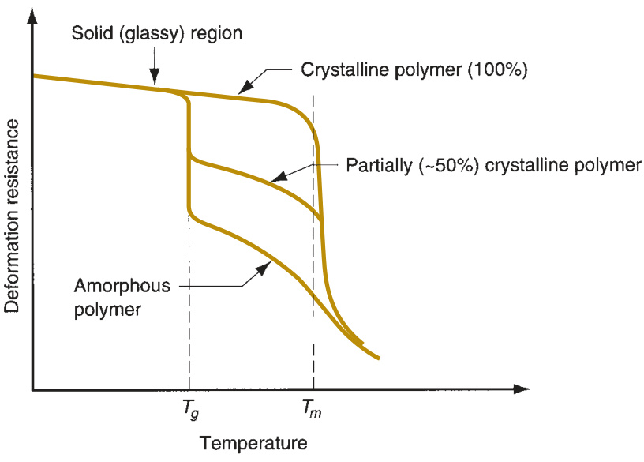  
FIGURE 8.11  Relation- ship of mechanical  properties, portrayed  as deformation resist- ance, as a function  of temperature for  an amorphous ther- moplastic, a $100\%$   crystalline (theoretical)  thermoplastic, and a  partially crystallized  thermoplastic.  

two phases. The partially crystallized polymer exhibits features of both amorphous  and fully crystallized plastics. Below $T_{g}$ , it is elastic with deformation resistance sloping  downward with rising temperatures. Above  $T_{g},$ , the amorphous portions of the polymer  soften, while the crystalline portions remain intact. The bulk material exhibits pro- perties that are generally viscoelastic. As  $T_{m}$  is reached, the crystals now melt, giving  the polymer a liquid consistency; resistance to deformation is now due to the fl  uid’s  viscous properties. The degree to which the polymer assumes liquid characteristics at  and above  $T_{m}$  depends on molecular weight and degree of polymerization. Higher DP  and MW reduces fl  ow of the polymer, making it more diffi  cult to process by molding  and similar shaping methods.  This is a dilemma faced by those who select these materials  because higher MW and DP mean higher strength.  

Physical Properties  Physical properties of materials are discussed in Chapter 4. In  general, thermoplastic polymers have the following characteristics: (1) lower densi- ties than metals or ceramics—typical specifi  c gravities for polymers are around 1.2,  for ceramics around 2.5, and for metals around 7.0; (2) much higher coeffi  cient of  thermal expansion—roughly fi  ve times the value for metals and 10 times the value  for ceramics; (3) much lower melting temperatures; (4) specifi  c heats that are two to  four times those of metals and ceramics; (5) thermal conductivities that are about  three orders of magnitude lower than those of metals; and (6) insulating electrical  properties.  

# 8.2.2  IMPORTANT COMMERCIAL THERMOPLASTICS  

Thermoplastic products include molded and extruded items, fi  bers, fi  lms, sheets, pack- aging materials, paints, and varnishes. The starting raw materials for these products are  normally supplied to the fabricator in the form of powders or pellets in bags, drums,  or larger loads by truck or rail car. The most important TP polymers are discussed in  alphabetical order in this section. For each plastic, Table 8.3 lists the chemical formula  and selected properties. Approximate market share is given relative to all plastics  (thermoplastic and thermosetting).  

TABLE  •  8.3  Important commercial thermoplastic polymers: (a) acetal a . 
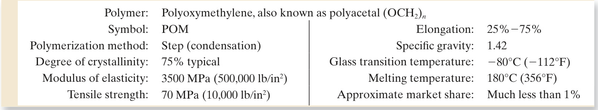  
a Table 8.3 is compiled from [2], [4], [6], [7], [9], [16], and other sources.  

Acetals   Acetal  is the popular name given to  poly oxy methylene , an engineering  polymer prepared from formaldehyde  $\mathrm{(CH_{2}O)}$  with high stiffness, strength, toughness,  and wear resistance. In addition, it has a high melting point, low moisture absorption,  and is insoluble in common solvents at ambient temperatures. Because of this combi- nation of properties, acetal resins are competitive with certain metals (e.g., brass and  zinc) in automotive components such as door handles, pump housings, and similar  parts; appliance hardware; and machinery components.  

Acrylics  The acrylics are polymers derived from acrylic acid  $(\mathrm{C}_{3}\mathrm{H}_{4}\mathrm{O}_{2})$  and com- pounds originating from it. The most important thermoplastic in the acrylics group  is  poly methyl meth a cry late  (PMMA) or Plexiglas (Rohm & Haas’s trade name for  PMMA). Data on PMMA are listed in Table 8.3(b). It is an amorphous linear poly- mer. Its outstanding property is excellent transparency, which makes it competitive  with glass in optical applications. Examples include automotive tail-light lenses,  optical instruments, and aircraft windows. Its limitation when compared with glass  is a much lower scratch resistance. Other uses of PMMA include fl  oor waxes and  emulsion latex paints. Another important use of acrylics is in fi  bers for textiles;  poly acrylonitrile (PAN) is an example that goes by the more familiar trade names  Orlon (DuPont) and Acrilan (Monsanto).  

Acrylonitrile–Butadiene–Styrene  ABS is called an engineering plastic due to  its excellent combination of mechanical properties, some of which are listed in  Table 8.3(c). ABS is a two-phase terpolymer, one phase being the hard copolymer  styrene–acrylonitrile, while the other phase is styrene-butadiene copolymer that  is rubbery. The name of the plastic is derived from the three starting monomers,  which may be mixed in various proportions. Typical applications include compo- nents for automotive, appliances, and business machines; and pipes and fi  ttings.  

TABLE  •  8.3  (continued): (b) acrylics (thermoplastic). 
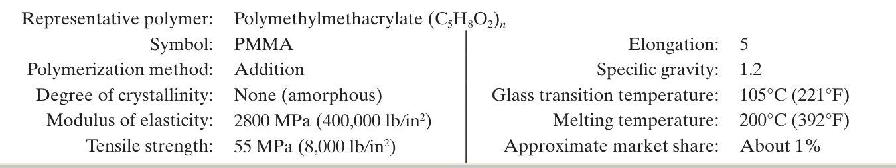  

TABLE  •  8.3   (continued): (c) acrylonitrile–butadiene–styrene. 
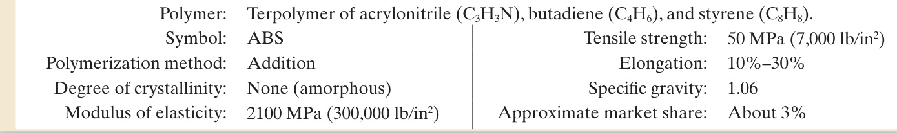  

Cellulosics   Cellulose   $\left(\mathrm{C_{6}H_{10}O}_{5}\right)$  is a carbohydrate polymer commonly occurring  in nature. Wood and cotton fi  bers, the chief industrial sources of cellulose, contain  about  $50\%$  and  $95\%$  of the polymer, respectively. When cellulose is dissolved and  reprecipitated during chemical processing, the resulting polymer is called  regener- ated cellulose . When this is produced as a fi  ber for apparel it is known as  rayon  (of  course, cotton itself is a widely used fi  ber for apparel). When it is produced as a thin  fi  lm, it is  cellophane , a common packaging material. Cellulose itself cannot be used  as a thermo  plastic because it decomposes before melting when its temperature is  increased. However, it can be combined with various compounds to form several  plastics of commercial importance; examples are  cellulose acetate  (CA) and  cellulose  acetate-butyrate  (CAB). CA, data for which are given in Table 8.3(d), is produced in  the form of sheets (for wrapping), fi  lm (for photography), and molded parts. CAB is  a better molding material than CA and has greater impact strength, lower moisture  absorption, and better compatibility with plasticizers. The cellulosic thermoplastics  share about $1\%$  of the market.  

Fluoropolymers   Polytetrafl  uorethylene  (PTFE), commonly known as  Tefl  on ,  accounts for about  $85\,\%$  of the family of polymers called  fl  uoropolymers , in which  F atoms replace H atoms in the hydrocarbon chain. PTFE is extremely resistant to  chemical and environmental attack, is unaffected by water, good heat resistance,  

# TABLE  •  8.3   (continued): (d) cellulosics.  

Representative polymer: Cellulose acetate  $(\mathrm{C_{6}H_{9}O_{5}-C O C H_{3}})_{n}$ Symbol: CA Elongation: $10\%–50\%$ Polymerization method: Step (condensation) Specifi  c gravity: 1.3 Degree of crystallinity: Amorphous Glass transition temperature: $105^{\circ}\mathrm{C}\left(221^{\circ}\mathrm{F}\right)$ Modulus of elasticity: $2800\,\mathrm{MPa}$   $(400,000\,\mathrm{lb}/\mathrm{in}^{2})$ ) Melting temperature: $306^{\circ}\mathrm{C}\left(583^{\circ}\mathrm{F}\right)$ Tensile strength: 30 MPa  $(4{,}000\,1\mathrm{b}/\mathrm{in}^{2})$ ) Approximate market share: Less than  $1\%$  

TABLE  •  8.3   (continued): (e) fl  uoropolymers.  

Representative polymer: Polytetrafl  uorethylene $(\mathrm{C}_{2}\mathrm{F}_{4})_{n}$ Symbol: PTFE Polymerization method: Addition Degree of crystallinity: About $95\%$  crystalline Modulus of elasticity: 425 MPa  $(60,\!000\,1\!b/\!\mathrm{in}^{2})$ ) Tensile strength: $20\,\mathrm{MPa}$   $(2500\,1\mathrm{b}/\mathrm{in}^{2})$ )  

Elongation: $100\%–300\%$ Specifi  c gravity: 2.2 Glass transition temperature: $127^{\circ}\mathrm{C}\left(260^{\circ}\mathrm{F}\right)$ Melting temperature: $327^{\circ}\mathrm{C}\left(620^{\circ}\mathrm{F}\right)$ Approximate market share: Less than  $1\%$  

# TABLE  •  8.3  (continued): (f) polyamides.  

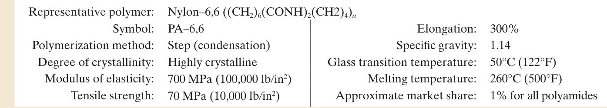  

and very low coeffi  cient of friction. These latter two properties have promoted  its use in nonstick household cookware. Other applications that rely on the same  property include nonlubricating bearings and similar components. PTFE also fi  nds  applications in chemical equipment and food processing.  

Polyamides  An important polymer family that forms characteristic amide link- ages (CO-NH) during polymerization is the polyamides (PA). The most important  members of the PA family are  nylons , of which the two principal grades are nylon–6  and nylon 6,6 (the numbers are codes that indicate the number of carbon atoms in the  monomer). The data given in Table 8.3(f) are for nylon–6,6, which was developed at  DuPont in the 1930s. Properties of nylon-6, developed in Germany are similar. Nylon  is strong, highly elastic, tough, abrasion resistant, and self-lubricating. It retains good  mechanical properties at temperatures up to about  $125^{\circ}\mathrm{C}$   $(250^{\circ}\mathrm{F})$ . One shortcoming  is that it absorbs water with an accompanying degradation in properties. The majority  of applications of nylon (about $90\%$ ) are in fi  bers for carpets, apparel, and tire cord.  The remainder  $(10\%)$  are in engineering components; nylon is commonly a good  substitute for metals in bearings, gears, and similar parts where strength and low fric- tion are needed.  

A second group of polyamides is the  aramids  (aromatic polyamides) of which  Kevlar  (DuPont trade name) is gaining in importance as a fi  ber in reinforced plastics.  The reason for the interest in Kevlar is that its strength is the same as steel at  $20\%$ of the weight.  

Polycarbonate  Polycarbonate (PC) is noted for its generally excellent mechani- cal properties, which include high toughness and good creep resistance. It is one of  the best thermoplastics for heat resistance—it can be used to temperatures around  $125^{\circ}\mathrm{C}$   $(250^{\circ}\mathrm{F})$ . In addition, it is transparent and fi  re resistant. Applications include  molded machinery parts, housings for business machines, pump impellers, safety  helmets, and compact disks (e.g., audio, video, and computer). It is also widely used  in glazing (window and windshield) applications.  

TABLE  •  8.3   (continued): (g) polycarbonate. 
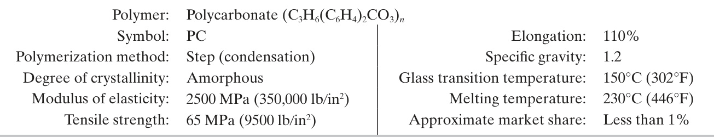  

TABLE  •  8.3   (continued): (h) polyesters (thermoplastic). 
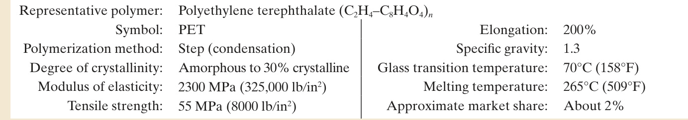  

Polyesters  The polyesters form a family of polymers made up of the characteristic  ester linkages (CO–O). They can be either thermoplastic or thermosetting, depending  on whether cross-linking occurs. Of the thermoplastic polyesters, a representa- tive example is  polyethylene terephthalate  (PET), data for which are compiled in  the table. It can be either amorphous or partially crystallized (up to about  $30\%$ ),  depend  ing on how it is cooled after shaping. Fast cooling favors the amorphous state,  which is highly transparent. Signifi  cant applications include blow-molded beverage  containers, photographic fi  lms, and magnetic recording tape. In addition, PET fi  b- ers are widely used in apparel. Polyester fi  bers have low moisture absorption and  good deformation recovery, both of which make them ideal for “wash and wear”  garments that resist wrinkling. The PET fi  bers are almost always blended with cot- ton or wool. Familiar trade names for polyester fi  bers include Dacron (DuPont) and  Fortrel (Celanese).  

Polyethylene  Polyethylene (PE) was fi  rst synthesized in the 1930s, and today it  accounts for the largest volume of all plastics. The features that make PE attractive  as an engineering material are low cost, chemical inertness, and easy processing. Poly- ethylene is available in several grades, the most common of which are  low-density  polyethylene  (LDPE) and  high-density polyethylene  (HDPE). The low-density grade  is a highly branched polymer with lower crystallinity and density. Applications include  squeezable bottles, frozen food bags, sheets, fi  lm, and wire insulation. HDPE has a  more linear structure, with higher crystallinity and density. These differences make  HDPE stiffer and stronger and give it a higher melting temperature. HDPE is used to  produce bottles, pipes, and housewares. Both grades can be processed by most polymer  shaping methods (Chapter 13). Properties for the two grades are given in Table 8.3(i).  

TABLE  •  8.3   (continued): (i) polyethylene.  

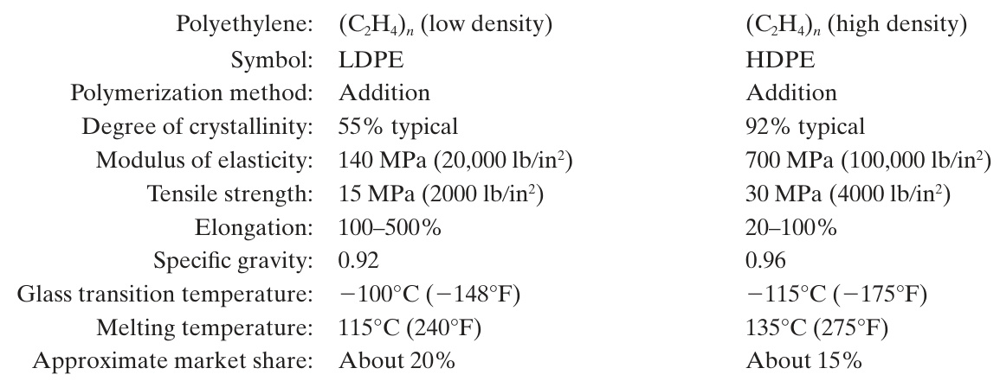  

# TABLE  •  8.3   (continued): (j) polypropylene.  

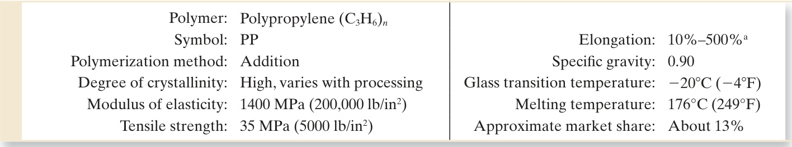  

Elongation depends on additives.  

Polypropylene  Polypropylene (PP) has become a major plastic, especially for injec- tion molding, since its introduction in the late 1950s. PP can be synthesized in isotactic,  syndiotactic, or atactic structures, the fi  rst of these being the most important and for  which the characteristics are given in the table. It is the lightest of the plastics, and its  strength-to-weight ratio is high. PP is frequently compared with HDPE because its  cost and many of its properties are similar. However, the high melting point of poly- propylene allows certain applications that preclude use of polyethylene—for exam- ple, components that must be sterilized. Other applications are injection molded parts  for automotive and houseware, and fi  ber products for carpeting. A special application  suited to polypropylene is one-piece hinges that can be subjected to a high number of  fl  exing cycles without failure.  

Polystyrene  There are several polymers, copolymers, and terpolymers based  on the monomer styrene  $\mathrm{(C_{8}H_{8})}$ , of which polystyrene (PS) is used in the highest  volume. It is a linear homopolymer with amorphous structure that is generally  noted for its brittleness. PS is transparent, easily colored, and readily molded, but  degrades at elevated temperatures and dissolves in various solvents. Because of its  brittleness, some PS grades contain $5\%$  to $15\%$  rubber and the term  high-impact  polystyrene  (HIPS) is used for these types. They have higher toughness, but trans- parency and tensile strength are reduced. In addition to injection molding applica- tions (e.g., molded toys, housewares), polystyrene also fi  nds uses in packaging in  the form of PS foams.  

Polyvinylchloride  Polyvinyl chloride (PVC) is a widely used plastic whose proper- ties can be varied by combining additives with the polymer. In particular, plasticizers  are used to achieve thermoplastics ranging from rigid PVC (no plasticizers) to fl  exible  PVC (high proportions of plasticizer). The range of properties makes PVC a versatile  polymer, with applications that include rigid pipe (used in construction, water and  

# TABLE  •  8.3   (continued): (k) polystyrene.  

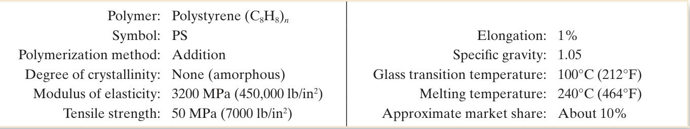  

TABLE  •  8.3   (continued): (l) polyvinyl chloride. 
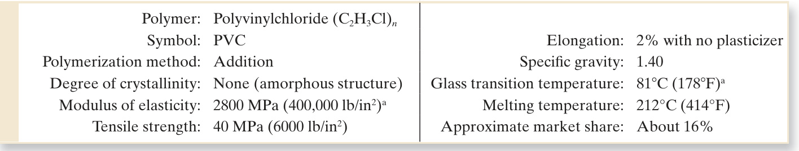  
a With no plasticizer.  

sewer systems, irrigation), fi  ttings, wire and cable insulation, fi  lm, sheets, food packag- ing, fl  ooring, and toys. PVC by itself is relatively unstable to heat and light, and stabi- lizers must be added to improve its resistance to these environmental conditions. Care  must be taken in the production and handling of the vinyl chloride monomer used to  polymerize PVC, due to its carcinogenic nature.  

#  Thermosetting Polymers  

Thermosetting (TS) polymers are distinguished by their highly cross-linked structure.  In effect, the formed part (e.g., the pot handle or electrical switch cover) becomes one  large macromolecule. Thermosets are always amorphous and exhibit no glass transi- tion temperature. This section examines the general characteristics of the TS plastics  and identify the important materials in this category.  

# 8.3.1 GENERAL PROPERTIES AND CHARACTERISTICS  

Owing to differences in chemistry and molecular structure, properties of thermoset- ting plastics are different from those of thermoplastics. In general, thermosets are  (1) more rigid—modulus of elasticity is two to three times greater; (2) brittle—they  possess virtually no ductility; (3) less soluble in common solvents; (4) capable of  higher service temperatures; and (5) not capable of being remelted—instead they  degrade or burn.  

The differences in properties of the TS plastics are attributable to cross-linking,  which forms a thermally stable, three-dimensional, covalently bonded structure  within the molecule. Cross-linking is accomplished in three ways [7]:  

1.  Temperature-activated systems —In the most common systems, the changes are  caused by heat supplied during the part shaping operation (e.g., molding). The  starting material is a linear polymer in granular form supplied by the chemi- cal plant. As heat is added, the material softens for molding; continued heating  results in cross-linking of the polymer. The term  thermosetting  is most aptly  applied to these polymers.

 2.  Catalyst-activated systems —Cross-linking in these systems occurs when small  amounts of a catalyst are added to the polymer, which is in liquid form. With- out the catalyst, the polymer remains stable; once combined with the catalyst, it  changes into solid form.  

3.  Mixing-activated systems —Most epoxies are examples of these systems. The  mixing of two chemicals results in a reaction that forms a cross-linked solid  polymer. Elevated temperatures are sometimes used to accelerate the reactions.  

The chemical reactions associated with cross-linking are called  curing  or  setting .  Curing is done at the fabrication plants that shape the parts rather than the chemical  plants that supply the starting materials to the fabricator.  

# 8.3.2  IMPORTANT THERMOSETTING POLYMERS  

Thermosetting plastics are not as widely used as the thermoplastics, perhaps because  of the added processing complications involved in curing the TS polymers. The larg- est volume thermosets are phenolic resins, whose annual volume is about $6\%$  of the  total plastics market. This is signifi  cantly less than polyethylene, the leading thermo- plastic, whose volume is about $35\%$  of the total. Technical data for these materials  are given in Table 8.4. Market share data refer to total plastics (TP plus TS).  

Amino Resins  Amino plastics, characterized by the amino group  $\left(\mathrm{NH}_{2}\right)$ , consist  of two thermosetting polymers, urea-formaldehyde and melamine-formaldehyde,  which are produced by the reaction of formaldehyde  $\mathrm{(CH_{2}O)}$  with either urea  $(\mathrm{CO(NH}_{2})_{2})$ ) or melamine  $(\mathrm{C}_{3}\mathrm{H}_{6}\mathrm{N}_{6})$ , respectively. In commercial importance, the  amino resins rank just below the other formaldehyde resin, phenol-formaldehyde,  discussed below.  Urea–formaldehyde  is competitive with the phenols in certain  applications, particularly as a plywood and particle-board adhesive. The resins are  also used as a molding compound. It is slightly more expensive than the phenol  material.  Melamine–formaldehyde  plastic is water resistant and is used for dishware  and as a coating in laminated table and counter tops (Formica, trade name of Cyana- mid Co.). When used as molding materials, amino plastics usually contain signifi  cant  proportions of fi  llers, such as cellulose.  

Epoxies  Epoxy resins are based on a chemical group called the  epoxides . The sim- plest formulation of epoxide is ethylene oxide  $\mathrm{(C_{2}H_{3}O)}$ ). Epichlorohydrin  $(\mathrm{C}_{3}\mathrm{H}_{5}\mathrm{OCl})$   is a much more widely used epoxide for producing epoxy resins. Uncured, epoxides  have a low degree of polymerization. To increase molecular weight and to cross-link  the epoxide, a curing agent must be used. Possible curing agents include polyamines  

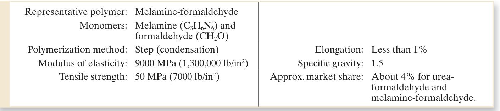  

# TABLE  •  8.4   (continued): (b) epoxy.  

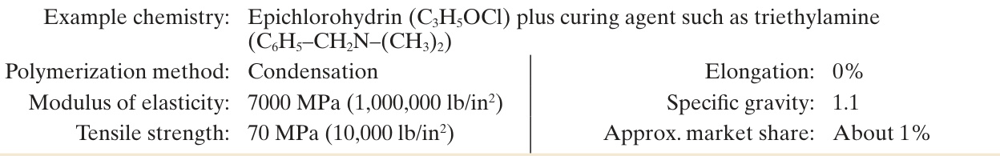  

# TABLE  •  8.4   (continued): (c) phenol formaldehyde.  

Monomer ingredients: Phenol  $\left(\mathrm{C_{6}H_{5}O H}\right)$  and formaldehyde  $\mathrm{(CH_{2}O)}$ Polymerization method: Step (condensation) Elongation: Less than $1\%$ Modulus of elasticity: $7000\,\mathrm{MPa}$   $(1{,}000{,}000{\,}1{\mathrm{b}}/{\mathrm{in}}^{2})$ ) Specifi  c gravity: 1.4 Tensile strength: $70\,\mathrm{MPa}$   $\langle10{,}000\,1\mathrm{b}/\mathrm{in}^{2}\rangle$ Approx. market share: $6\%$  

and acid anhydrides. Cured epoxies are noted for strength, adhesion, and heat and  chemical resistance. Applications include surface coatings, industrial fl  ooring, glass  fi  ber-reinforced composites, and adhesives. Insulating properties of epoxy thermo- sets make them useful in various electronic applications, such as encapsulation of  integrated circuits and lamination of printed circuit boards.  

Phenolics  Phenol  $\left(\mathrm{C_{6}H_{5}O H}\right)$  is an acidic compound that can be reacted with  aldehydes (dehydrogenated alcohols), formaldehyde  $\mathrm{(CH_{2}O)}$  being the most reac- tive.  Phenol-formaldehyde  is the most important of the phenolic polymers; it was  fi  rst commercialized around 1900 under the trade name  Bakelite . It is almost always  combined with fi  llers such as wood fl  our, cellulose fi  bers, and minerals when used as  a molding material. It is brittle, possesses good thermal, chemical, and dimensional  stability. Its capacity to accept colorants is limited—it is available only in dark colors.  Molded products constitute only about  $10\%$  of total phenolics use. Other applica- tions include adhesives for plywood, printed circuit boards, counter tops, and bonding  material for brake linings and abrasive wheels.  

Polyesters  Polyesters, which contain the characteristic ester linkages (CO–O), can  be thermosetting as well as thermoplastic. Thermosetting polyesters are used largely  in reinforced plastics (composites) to fabricate large items such as pipes, tanks,  boat hulls, auto body parts, and construction panels. They can also be used in vari- ous molding processes to produce smaller parts. Synthesis of the starting polymer  involves reaction of an acid or anhydride such as maleic anhydride  $\left(\mathrm{C_{4}H}_{2}\mathrm{O}_{3}\right)$  with a  glycol such as ethylene glycol  $\left(\mathrm{C}_{2}\mathrm{H}_{6}\mathrm{O}_{2}\right)$ . This produces an  unsaturated polyester  of  

TABLE  •  8.4   (continued): (d) unsaturated polyester. 
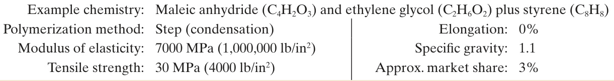  

# TABLE  •  8.4   (continued): (e) polyimides.  

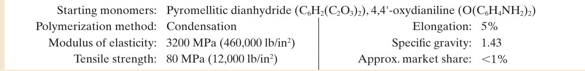  

relatively low molecular weight  $(\mathbf{MW}=1000$  to 3000). This ingredient is mixed with  a monomer capable of polymerizing and cross-linking with the polyester. Styrene  $\mathrm{(C_{8}H_{8})}$  is commonly used for this purpose, in proportions of  $30\%$  to  $50\%$ . A third  component, called an inhibitor, is added to prevent premature cross-linking. This  mixture forms the polyester resin system that is supplied to the fabricator. Polyesters  are cured either by heat (temperature-activated systems), or by means of a catalyst  added to the polyester resin (catalyst-activated systems). Curing is done at the time  of fabrication (molding or other forming process) and results in cross-linking of the  polymer.  

An important class of polyesters are the  alkyd  resins (the name derived by abbrevi- ating and combining the words alcohol and a cid  and changing a few letters). They are  used primarily as bases for paints, varnishes, and lacquers. Alkyd molding compounds  are also available, but their applications are limited.  

Polyimides  These plastics are available as both thermoplastics and thermo- sets, but the TS types are more important commercially. They are available under  brand names such as Kapton (Dupont) and Kaptrex (Professional Plastics) in sev- eral forms including tapes, fi  lms, coatings, and molding resins. TS polyimides (PI)  are noted for chemical resistance, high tensile strength and stiffness, and stability  at elevated temperatures. They are called high-temperature polymers due to their  excellent heat resistance. Applications that exploit these properties include insulat- ing fi  lms, molded parts used in elevated temperature service, fl  exible cables in laptop  computers, medical tubing, and fi  bers for protective clothing.  

Polyurethanes  This includes a large family of polymers, all characterized by the  urethane group (NHCOO) in their structure. The chemistry of the polyurethanes  is complex, and there are many chemical varieties in the family. The characteristic  feature is the reaction of a  polyol , whose molecules contain hydroxyl (OH) groups,  

TABLE  •  8.4   (continued): (f) polyurethane. 
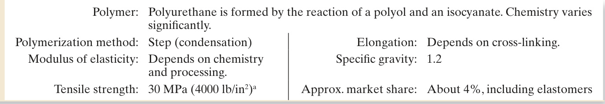  

# TABLE  •  8.4   (continued): (g) silicone thermosetting resins.  

Example chemistry: $\mathrm{((CH}_{3}\mathrm{)}_{6}\mathrm{-SiO)}_{n}$ Polymerization method: Step (condensation), usually Tensile strength: $30\,\mathrm{MPa}$   $(4000\,\mathrm{lb/in^{2}})$ )  

Elongation: $0\%$ Specifi  c gravity: 1.65 Approx. market share: Less than $1\%$ such as butylene ether glycol  $\left(\mathrm{C_{4}H_{10}O_{2}}\right)$ ; and an  isocyanate , such as diphenylmeth- ane diisocyanate  $\left(\mathrm{C}_{15}\mathrm{H}_{10}\mathrm{O}_{2}\mathrm{N}_{2}\right)$ ). Through variations in chemistry, cross-linking, and  processing, polyurethanes can be thermoplastic, thermosetting, or elastomeric mate- rials, the latter two being the most important commercially. The largest application  of polyurethane is in foams. These can range between elastomeric and rigid, the lat- ter being more highly cross-linked. Rigid foams are used as a fi  ller material in hollow  construction panels and refrigerator walls. In these types of applications, the mate- rial provides excellent thermal insulation, adds rigidity to the structure, and does  not absorb water in signifi  cant amounts. Many paints, varnishes, and similar coating  materials are based on urethane systems. Polyurethane elastomers are discussed in  Section 8.4.  

Silicones  Silicones are inorganic and semi-inorganic polymers, distinguished by  the presence of the repeating siloxane link  $(-\mathrm{Si}{-}\mathrm{O}{-})$  in their molecular structure.  A typical formulation combines the methyl radical  $\left(\mathrm{CH}_{3}\right)$  with (SiO) in various  proportions to obtain the repeating unit– $\mathrm{((CH}_{3}\mathrm{)}_{m}\mathrm{-SiO)-}$ , where  $\pmb{m}$  establishes the  proportionality. By variations in composition and processing, polysiloxanes can be  produced in three forms: (1) fl  uids, (2) elastomers, and (3) thermosetting resins.  Fluids are low molecular weight polymers used for lubricants, polishes, waxes, and  other liquid products—not really polymers in the sense of this chapter, but impor- tant commercially nevertheless. Silicone elastomers, covered in Section 8.4, and  thermosetting silicones, treated here, are cross-linked. When highly cross-linked,  polysiloxanes form rigid resin systems used for paints, varnishes, and other coat- ings; and laminates such as printed circuit boards. They are also used as molding  materials for electrical parts. Curing is accomplished by heating or by allowing  the solvents containing the polymers to evaporate. Silicones are noted for their  good heat resistance and water repellence, but their mechanical strength is not as  great as other cross-linked polymers. Data in Table $8.4(\mathrm{g})$  are for a typical silicone  thermosetting polymer.  

Elastomers are polymers capable of large elastic deformation when subjected to rel- atively low stresses. Some elastomers can withstand extensions of $500\%$  or more and  still return to their original shape. The more popular term for elastomer is, of course,  rubber. Rubbers can be divided into two categories: (1) natural rubber, derived from  certain biological plants; and (2) synthetic elastomers, produced by polymeriza- tion processes similar to those used for thermoplastic and thermosetting polymers.  Before discussing natural and synthetic rubbers, consider the general characteristics  of elastomers.  

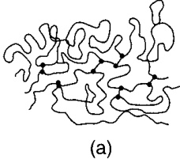  
FIGURE 8.12  Model  of long elastomer  molecules, with low  degree of cross-linking:  (a) unstretched, and (b)  under tensile stress.  

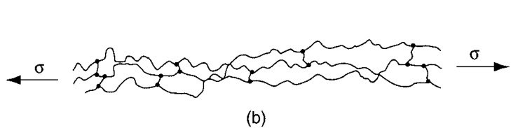  

# 8.4.1  CHARACTERISTICS OF ELASTOMERS  

Elastomers consist of long-chain molecules that are cross-linked. They owe their  impressive elastic properties to the combination of two features: (1) the long mole- cules are tightly kinked when unstretched, and (2) the degree of cross-linking is sub- stantially below that of the thermosets. These features are illustrated in the model of  Figure 8.12(a), which shows a tightly kinked cross-linked molecule under no stress.  

When the material is stretched, the molecules are forced to uncoil and straighten  as shown in Figure 8.12(b). The molecules’ natural resistance to uncoiling provides  the initial elastic modulus of the aggregate material. As further strain is experienced,  the covalent bonds of the cross-linked molecules begin to play an increasing role in  the modulus, and the stiffness increases as illustrated in Figure 8.13. With greater  cross-linking, the elastomer becomes stiffer and its modulus of elasticity is more  linear. These characteristics are shown in the fi  gure by the stress-strain curves for  three grades of rubber: natural crude rubber, whose cross-linking is very low; cured  (vulcanized) rubber with low-to-medium cross-linking; and hard rubber (ebonite),  whose high degree of cross-linking transforms it into a thermosetting plastic.  

For a polymer to exhibit elastomeric properties, it must be amorphous in the  unstretched condition, and its temperature must be above  $T_{g}$ . If below the glass transi- tion temperature, the material is hard and brittle; above  $T_{g}$  the polymer is in the “rub- bery” state. Any amorphous thermoplastic polymer will exhibit elastomeric properties  above $T_{g}$  for a short time, because its linear molecules are always coiled to some extent,  thus allowing for elastic extension. It is the absence of cross-linking in TP polymers  that prevents them from being truly elastic; instead they exhibit viscoelastic behavior.  

Curing is required to effect cross-linking in most of the common elastomers today.  The term for curing used in the context of natural rubber (and certain synthetic rub- bers) is  vulcanization , which involves the formation of chemical cross-links between  the polymer chains. Typical cross-linking in rubber is 1 to 10 links per 100 carbon  

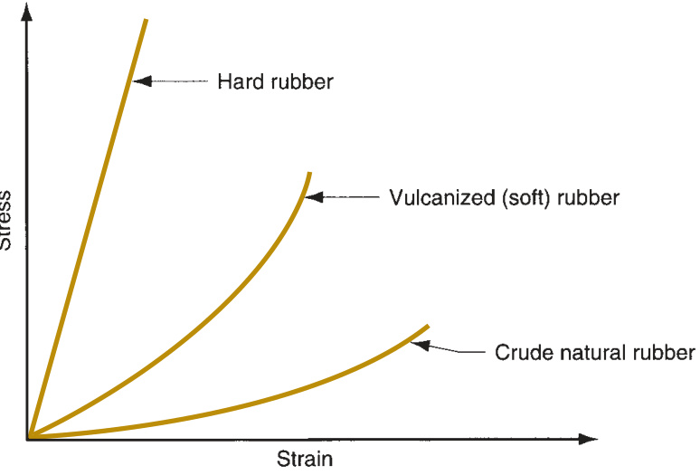  
FIGURE 8.13  Increase in stiffness  as a function of strain  for three grades of  rubber: natural rubber,  vulcanized rubber, and  hard rubber.  

atoms in the linear polymer chain, depending on the degree of stiffness desired in  the material. This is considerably less than the degree of cross-linking in thermosets.  

An alternative method of curing involves the use of starting chemicals that  react when mixed (sometimes requiring a catalyst or heat) to form elastomers with  relatively infrequent cross-links between molecules. These synthetic rubbers are  known as  reactive system elastomers . Certain polymers that cure by this means,  such as urethanes and silicones, can be classifi  ed as either thermosets or elastomers,  depending on the degree of cross-linking achieved during the reaction.  

A relatively new class of elastomers, called  thermoplastic elastomers , possesses  elastomeric properties that result from the mixture of two phases, both thermoplas- tic. One is above its  $T_{g}$  at room temperature while the other is below its  $T_{g}.$  Thus,  the polymer includes soft rubbery regions intermixed with hard particles that act as  cross-links. The composite material is elastic in its mechanical behavior, although not  as extensible as most other elastomers. Because both phases are thermoplastic, the  aggregate material can be heated above its  $T_{m}$  for forming, using processes that are  generally more economical than those used for rubber.  

The elastomers are discussed in the following two sections. The fi  rst deals with  natural rubber and how it is vulcanized to create a useful commercial material; the  second examines the synthetic rubbers.  

# 8.4.2  NATURAL RUBBER  

Natural rubber (NR) consists primarily of polyisoprene, a high-molecular-weight poly- mer of isoprene  $\mathrm{(C_{5}H_{8})}$ . It is derived from latex, a milky substance produced by various  plants, the most important of which is the rubber tree (Hevea brasiliensis) that grows in  tropical climates (Historical Note 8.2). Latex is a water emulsion of polyisoprene (about  one third by weight), plus various other ingredients. Rubber is extracted from the latex  by various methods (e.g., coagulation, drying, and spraying) that remove the water.  

# Historical Note 8.2  Natural rubber  

The fi  rst use of natural rubber seems to have been in  the form of rubber balls used for sport by the natives of  Central and South America at least 500 hundred years  ago. Columbus noted this during his second voyage to  the New World in 1493–96. The balls were made from  the dried gum of a rubber tree. The fi  rst white men  in South America called the tree  caoutchouc , which  was their way of pronouncing the Indian name for  it. The name  rubber  came from the English chemist  Joseph Priestley, who discovered (around 1770) that  gum rubber would “rub” away pencil marks.  

Early rubber goods were less than satisfactory;  they melted in summer heat and hardened in winter  cold. One of those in the business of making and sell- ing rubber goods was American Charles Goodyear.  Recog  nizing the defi  ciencies of the natural material,  he experimented with ways to improve its properties  and discovered that rubber could be cured by heating  it with sulfur. This was in 1839, and the process, later  called  vulcanization , was patented by him in 1844.  

Vulcanization and the emerging demand for rubber  products led to tremendous growth in rubber produc- tion and the industry that supported it. In 1876, Henry  Wickham collected thousands of rubber tree seeds  from the Brazilian jungle and planted them in England;  the sprouts were later transplanted to Ceylon and  Malaya (then British colonies) to form rubber planta- tions. Soon, other countries in the region followed the  British example. Southeast Asia became the base of the  rubber industry.  

In 1888, a British veterinary surgeon named John  Dunlop patented pneumatic tires for bicycles. By the  twentieth century, the motorcar industry was develop- ing in the United States and Europe.  Together, the auto- mobile and rubber industries grew to occupy positions  of unimagined importance.  

TABLE  •  8.5   Characteristics and typical properties of vulcanized rubber. 
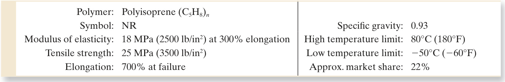  
Compiled from [2], [6], [9], and other sources.  

Natural crude rubber (without vulcanization) is sticky in hot weather, but stiff  and brittle in cold weather. To form an elastomer with useful properties, natural  rubber must be vulcanized. Traditionally, vulcanization has been accomplished by  mixing small amounts of sulfur and other chemicals with the crude rubber and  heating. The chemical effect of vulcanization is cross-linking; the mechanical result  is increased strength and stiffness, yet maintenance of extensibility. The dramatic  change in properties caused by vulcanization can be seen in the stress-strain curves  of Figure 8.13.  

Sulfur alone can cause cross-linking, but the process is slow, taking hours to  complete. Other chemicals are added to sulfur during vulcanization to accelerate  the process and serve other benefi  cial functions. Also, rubber can be vulcanized  using chemicals other than sulfur. Today, curing times have been reduced signifi  - cantly compared to the original sulfur curing of years ago.  

As an engineering material, vulcanized rubber is noted among elastomers for  its high tensile strength, tear strength, resilience (capacity to recover shape after  deformation), and resistance to wear and fatigue. Its weaknesses are that it degrades  when subjected to heat, sunlight, oxygen, ozone, and oil. Some of these limitations  can be reduced through the use of additives. Typical properties and other data for  vulcanized natural rubber are listed in Table 8.5. Market share is relative to total  annual rubber volume, natural plus synthetic. Rubber volume is about  $15\%$  of total  polymer market.  

The largest single market for natural rubber is automotive tires. In tires, carbon  black is an important additive; it reinforces the rubber, serving to increase tensile  strength and resistance to tearing and abrasion. Other products made of rubber  include shoe soles, bushings, seals, and shock-absorbing components. In each case,  the rubber is compounded to achieve the specifi  c properties required in the applica- tion. Besides carbon black, other additives used in rubber and some of the synthetic  elastomers include clay, kaolin, silica, talc, and calcium carbonate, as well as chemicals  that accelerate and promote vulcanization.  

# 8.4.3  SYNTHETIC RUBBERS  

Today, the tonnage of synthetic rubbers is more than three times that of natural rub- ber. Development of these synthetic materials was motivated largely by the world  wars when NR was diffi  cult to obtain (Historical Note 8.3). The most important of  the synthetics is styrene-butadiene rubber (SBR), a copolymer of butadiene  $\mathrm{(C_{4}H_{6})}$   and styrene  $\mathrm{(C_{8}H_{8})}$ . As with most other polymers, the predominant raw material for  the synthetic rubbers is petroleum. Only the synthetic rubbers of greatest commercial  

# Historical Note 8.3  Synthetic rubbers  

In 1826, Faraday recognized the formula of natural  rubber to be  $\mathsf{C}_{5}\mathsf{H}_{8}$ . Subsequent attempts at repro- ducing this molecule over many years were gener- ally unsuccessful. Regrettably, it was the world wars  that created the necessity which became the mother  of invention for synthetic rubber. In World War I, the  Germans, denied access to natural rubber, developed  a methyl-based substitute. This material was not very  successful, but it marks the fi  rst large-scale production  of synthetic rubber.  

After World War I, the price of natural rubber was so  low that many attempts at fabricating synthetics were  abandoned. However, the Germans, perhaps anticipating  a future confl  ict, renewed their development efforts. The  fi  rm I.G. Farben developed two synthetic rubbers, start- ing in the early 1930s, called Buna-S and Buna-N.  Buna is derived from  bu tadiene $(\mathsf C_{4}\mathsf H_{6})$ , which has become the  critical ingredient in many modern synthetic rubbers,  and  Na , the symbol for sodium, used to accelerate or  catalyze the polymerization process ( Natrium  is the  German word for sodium). The symbol  S  in Buna-S  stands for styrene. Buna-S is the copolymer known to- day as  styrene–butadiene rubber , or SBR. The  $N$ in  Buna-N stands for acrylo N itrile, and the synthetic rubber  is called  nitrile rubber  in current usage.  

Other efforts included the work at the DuPont  Company in the United States, which led to the  development of polychloroprene, fi  rst marketed in  1932 under the name Duprene, later changed to  Neoprene , its current name.  

During World War II, the Japanese cut off the  supply of natural rubber from Southeast Asia to the  United States. Production of Buna-S synthetic rubber  was begun on a large scale in America. The federal  government preferred to use the name  GR-S  (Govern- ment Rubber-Styrene) rather than Buna-S (the German  name). By 1944, the United States was outproducing  Germany in SBR 10-to-1. Since the early 1960s, world- wide production of synthetic rubbers has exceeded  that of natural rubbers.  

importance are discussed here. Technical data are presented in Table 8.6. Market share  data are for total volume of natural and synthetic rubbers. About  $10\%$  of total volume  of rubber production is reclaimed; thus, total tonnages in Tables 8.5 and 8.6 do not sum  to  $100\%$ .  

Butadiene Rubber   Polybutadiene  (BR) is important mainly in combination  with other rubbers. It is compounded with natural rubber and with styrene (styrene– butadiene rubber is discussed later) in the production of automotive tires. Without  compounding, the tear resistance, tensile strength, and ease of processing of poly- butadiene are less than desirable.  

Butyl Rubber   Butyl rubber is a copolymer of polyisobutylene  $(98–99\%)$  and  polyisoprene  $(1–2\%)$ . It can be vulcanized to provide a rubber with very low air  permeability, which has led to applications in infl  atable products such as inner tubes,  liners in tubeless tires, and sporting goods.  

TABLE  •  8.6   Characteristics and typical properties of synthetic rubbers: (a) butadiene rubber.  

Polymer: Polybutadiene  $(\mathrm{C_{4}H_{6}})_{n}$ Symbol: BR Tensile strength: $15\,\mathrm{MPa}$   $(2000\,\mathrm{lb/in^{2}})$ ) Elongation: $500\%$  at failure  

Specifi  c gravity: 0.93 High temperature limit: $100^{\circ}\mathrm{C}\left(210^{\circ}\mathrm{F}\right)$ Low temperature limit: $-50^{\circ}\mathrm{C}\left(-60^{\circ}\mathrm{F}\right)$ Approx. market share: $12\%$  

# TABLE  •  8.6   (continued): (b) butyl rubber.  

Polymer: Copolymer of isobutylene  $(\mathrm{C_{4}H_{8}})_{n}$  and isoprene  $(\mathrm{C}_{5}\mathrm{H}_{8})_{n}$ Symbol: PIB Specifi  c gravity: 0.92 Modulus of elasticity: 7 MPa  $(1000\,1\mathrm{b}/\mathrm{in}^{2})$  at  $300\%$  elongation High temperature limit: $110^{\circ}\mathrm{C}\left(220^{\circ}\mathrm{F}\right)$ Tensile strength: 20 MPa  $(3000\,1\mathrm{b}/\mathrm{in}^{2})$ ) Low temperature limit: $-50^{\circ}\mathrm{C}\left(-60^{\circ}\mathrm{F}\right)$ Elongation: $700\%$ Approx. market share: about $3\%$  

TABLE  •  8.6   (continued): (c) chloroprene rubber (neoprene).  

Polymer: Polychloroprene  $(\mathrm{C_{4}H_{5}C l})_{n}$ Symbol: CR Specifi  c gravity: 1.23 Modulus of elasticity: $7\;\mathrm{MPa}$   $(1000\,1\mathrm{b}/\mathrm{in}^{2})$  at $300\%$  elongation High temperature limit: $120^{\circ}\mathrm{C}$   $(250^{\circ}\mathrm{F})$ Tensile strength: $25\;\mathrm{MPa}$   $(3500\,\mathrm{lb/in^{2}})$ ) Low temperature limit: $-20^{\circ}\mathrm{C}\left(-10^{\circ}\mathrm{F}\right)$ Elongation: $500\%$  at failure Approx. market share: $2\%$  

Chloroprene Rubber  Polychloroprene was one of the fi  rst synthetic rubbers to  be developed (early 1930s). Commonly known today as  Neoprene , it is an important  special-purpose rubber. It crystallizes when strained to provide good mechanical  properties. Chloroprene rubber (CR) is more resistant to oils, weather, ozone, heat,  and fl  ame (chlorine makes this rubber self-extinguishing) than NR, but somewhat  more expensive. Its applications include fuel hoses (and other automotive parts),  conveyor belts, and gaskets, but not tires.  

Ethylene–Propylene Rubber  Polymerization of ethylene and propylene with  small proportions  $(3–8\%)$  of a diene monomer produces the terpolymer ethylene– propylene–diene (EPDM), a useful synthetic rubber. Applications are for parts mostly  in the automotive industry other than tires. Other uses are wire and cable insulation.  

Isoprene Rubber  Isoprene can be polymerized to synthesize a chemical equiva- lent of natural rubber. Synthetic (unvulcanized)  polyisoprene  is softer and more  easily molded than raw natural rubber. Applications of the synthetic material are  similar to those of its natural counterpart, car tires being the largest single market.  It is also used for footwear, conveyor belts, and caulking compound. Cost per unit  weight is about $35\%$  higher than for NR.  

TABLE  •  8.6   (continued): (d) ethylene–propylene–diene rubber.  

Representative polymer: Terpolymer of ethylene  $\mathrm{(C_{2}H_{4})}$ ), propylene  $\mathrm{(C_{3}H_{6})}$ ), and a diene monomer  $(3–8\%)$  for  cross-linking.  

Symbol: EPDM Tensile strength: $15\,\mathrm{MPa}$   $(2000\,1\mathrm{b}/\mathrm{in}^{2})$ ) Elongation: $300\%$  at failure  

Specifi  c gravity: 0.86 High temperature limit: $150^{\circ}\mathrm{C}\left(300^{\circ}\mathrm{F}\right)$ Low temperature limit: $-50^{\circ}\mathrm{C}\left(-60^{\circ}\mathrm{F}\right)$ Approx. market share: $5\%$  

#  

# TABLE  •  8.6   (continued): (e) isoprene rubber (synthetic).  

Polymer: Polyisoprene  $(\mathrm{C}_{5}\mathrm{H}_{8})_{n}$ Symbol: IR Specifi  c gravity: 0.93 Modulus of elasticity: 17 MPa  $(2500\,\mathrm{lb/in^{2}})$  at $300\%$  elongation High temperature limit: $80^{\circ}\mathrm{C}\left(180^{\circ}\mathrm{F}\right)$ Tensile strength: $25\,\mathrm{MPa}$   $(3500\,\mathrm{lb/in^{2}})$ ) Low temperature limit: $-50^{\circ}\mathrm{C}\left(-60^{\circ}\mathrm{F}\right)$ Elongation: $500\%$  at failure Approx. market share: $2\%$  

# TABLE  •  8.6   (continued): (f) nitrile rubber.  

Polymer: Copolymer of butadiene  $\mathrm{(C_{4}H_{6})}$ ) and acrylonitrile  $\left(\mathbf{C}_{3}\mathrm{H}_{3}\mathbf{N}\right)$ Symbol: NBR Specifi  c gravity: 1.00 (without fi  llers) Modulus of elasticity: $10\,\mathrm{MPa}$   $(1500\,\mathrm{lb/in^{2}})$ ) at $300\%$  elongation High temperature limit: $120^{\circ}\mathrm{C}$   $(250^{\circ}\mathrm{F})$ Tensile strength: $30\,\mathrm{MPa}$   $(4000\,1\mathrm{b}/\mathrm{in}^{2})$ ) Low temperature limit: $-50^{\circ}\mathrm{F}$   $(-60^{\circ}\mathrm{F})$ Elongation: $500\%$  at failure Approx. market share: $2\%$  

Nitrile Rubber  This is a vulcanizable copolymer of butadiene  $(50–75\%)$  and acrylo- nitrile  $(25–50\%)$ . Its more technical name is  butadiene-acrylonitrile rubber . It has  good strength and resistance to abrasion, oil, gasoline, and water. These properties  make it ideal for applications such as gasoline hoses and seals, and also for footwear.  

Polyurethanes  Thermosetting polyurethanes with minimum cross-linking are  elastomers, most commonly produced as fl  exible foams. In this form, they are widely  used as cushion materials for furniture and automobile seats. Unfoamed poly- urethane can be molded into products ranging from shoe soles to car bumpers, with  cross-linking adjusted to achieve the desired properties for the application. With no  cross-linking, the material is a thermoplastic elastomer that can be injection molded.  As an elastomer or thermoset, reaction injection molding and other shaping methods  are used.  

Silicones  Like the polyurethanes, silicones can be elastomeric or thermosetting,  depending on the degree of cross-linking. Silicone elastomers are noted for the wide  temperature range over which they can be used. Their resistance to oils is poor. The  silicones possess various chemistries, the most common being  poly dimethyl silo x a ne ,  Table 8.6(h). To obtain acceptable mechanical properties, silicone elastomers must  

# TABLE  •  8.6   (continued): (g) polyurethane.  

Polymer: Polyurethane (chemistry varies) Symbol: PUR Modulus of elasticity: $10\,\mathrm{MPa}$   $(1200\,\mathrm{lb/in^{2}})$ ) at $300\%$  elongation Tensile strength: $60\,\mathrm{MPa}$   $(8000\,1\mathrm{b}/\mathrm{in}^{2})$ ) Elongation: $700\%$  at failure  

Specifi  c gravity: 1.25 High temperature limit: $100^{\circ}\mathrm{C}$   $(210^{\circ}\mathrm{F})$ Low temperature limit: $-50^{\circ}\mathrm{C}$   $(-60^{\circ}\mathrm{F})$ Approx. market share: listed under thermo- sets, Table 8.4(e)  

# TABLE  •  8.6   (continued): (h) silicone rubber.  

Representative polymer: Poly dimethyl silo x a ne  $\textstyle(\mathrm{SiO}(\mathrm{CH}_{3})_{2})_{n}$ Symbol: VMQ Specifi  c gravity: 0.98 Tensile strength: 10 MPa  $(1500\,1\mathrm{b}/\mathrm{in}^{2})$ ) High temperature limit: $230^{\circ}\mathrm{C}\left(450^{\circ}\mathrm{F}\right)$ Elongation: $700\%$  at failure Low temperature limit: $-50^{\circ}\mathrm{C}$   $(-60^{\circ}\mathrm{F})$ Approx. market share: Less than $1\%$  

TABLE  •  8.6   (continued): (i) styrene–butadiene rubber  

Polymer: Copolymer of styrene  $\mathrm{(C_{8}H_{8,}}$  and butadiene  $\mathrm{(C_{4}H_{6}}$ ) Symbol: SBR Specifi  c gravity: 0.94 Modulus of elasticity: $17\,\mathrm{MPa}$   $(2500\,\mathrm{lb/in}^{2})$  at $300\%$  elongation High temperature limit: $110^{\circ}\mathrm{C}\left(230^{\circ}\mathrm{F}\right)$ Tensile strength: $20\,\mathrm{MPa}$   $(3000\,1\mathrm{b}/\mathrm{in}^{2})$ ) reinforced Low temperature limit: $-50^{\circ}\mathrm{C}\left(-60^{\circ}\mathrm{F}\right)$ Elongation: $700\%$  at failure Approx. market share: Slightly less than $30\%$  

be reinforced, usually with fi  ne silica powders. Owing to their high cost, they are  considered special-purpose rubbers for applications such as gaskets, seals, wire and  cable insulation, prosthetic devices, and bases for caulking materials.  

Styrene–Butadiene Rubber   SBR is a random copolymer of styrene (about  $25\%$ ) and butadiene (about $75\%$ ). It was originally developed in Germany as Buna-S  rubber before World War II. Today, it is the largest tonnage elastomer, totaling about  $40\%$  of all rubbers produced (natural rubber is second in tonnage). Its attractive  features are low cost, resistance to abrasion, and better uniformity than NR. When  reinforced with carbon black and vulcanized, its characteristics and applications are  very similar to those of natural rubber. Cost is also similar. A close comparison of  properties reveals that most of its mechanical properties except wear resistance are  inferior to NR, but its resistance to heat aging, ozone, weather, and oils is superior.  Applications include automotive tires, footwear, and wire and cable insulation. A  material chemically related to SBR is styrene–butadiene–styrene block copolymer,  a thermoplastic elastomer discussed below.  

Thermoplastic Elastomers   As previously described, a thermoplastic elastomer  (TPE) is a thermoplastic that behaves like an elastomer. It constitutes a family of  polymers that is a fast-growing segment of the elastomer market. TPEs derive their  elastomeric properties not from chemical cross-links, but from physical connections  between soft and hard phases that make up the material. Thermoplastic elastomers  include  styrene–butadiene–styrene  (SBS), a block copolymer as opposed to styrene– butadiene rubber (SBR) which is a random copolymer (Section 8.1.2);  thermoplastic  polyurethanes; thermoplastic polyester copolymers ; and other copolymers and pol- ymer blends. Table 8.6(j) gives data on SBS. The chemistry and structure of these  materials are generally complex, involving two materials that are incompatible so that  they form distinct phases whose room temperature properties are different. Owing to  their thermoplastic it y, the TPEs cannot match conventional cross-linked elastomers  in elevated temperature strength and creep resistance. Typical applications include  

  

# TABLE  •  8.6   (continued): (j) thermoplastic elastomers (TPE).  

Representative polymer: Styrene–butadiene–styrene block copolymer Symbol: SBS (also YSBR) Specifi  c gravity: 1.0 Tensile strength: 14 MPa  $(2000\,\mathrm{lb/in}^{2})$ High temperature limit: $65^{\circ}\mathrm{C}\left(150^{\circ}\mathrm{F}\right)$ Elongation: $400\%$ Low temperature limit: $-50^{\circ}\mathrm{C}\left(-60^{\circ}\mathrm{F}\right)$ Approx. market share: $12\%$  

footwear, rubber bands, extruded tubing, wire coating, and molded parts for automo- tive and other uses in which elastomeric properties are required. TPEs are not suit- able for tires.  

#  Polymer Recycling and Bio de grad ability  

It is estimated that since the 1950s, 1 billion tons of plastic have been discarded as  garbage.  This plastic trash could be around for centuries, because the primary bonds  that make plastics so durable also make them resistant to degradation by the envi- ronmental and biological processes of nature. This section considers two polymer  topics related to environmental concerns: (1) recycling of polymer products and (2)  biodegradable plastics.  

# 8.5.1  POLYMER RECYCLING  

Approximately 200 million tons of plastic products are made annually throughout  the world, more than one-eighth of which are produced in the United States.  Only  about $6\%$  of the U.S. tonnage is recycled as plastic waste; the rest either remains in  products and/or ends up in garbage landfi  lls.  Recycling  means recovering the dis- carded plastic items and reprocessing them into new products, in some cases products  that are quite different from the original discarded items.  

In general the recycling of plastics is more diffi  cult that recycling of glass and  metal products. There are several reasons for this: (1) compared to plastic parts,  many re  cycled metal items are much larger and heavier (e.g., structural steel from  buildings and bridges, steel car body frames), so the economics of recycling are more  favorable for recycling metals; most plastic items are lightweight; (2) compared to  plastics, which come in a variety of chemical compositions that do not mix well,  glass products are all based on silicon dioxide; and (3) many plastic products contain  fi  llers, dyes, and other additives that cannot be readily separated from the polymer  itself. Of course, a common problem in all recycling efforts is the fl  uctuation in prices  of recycled materials.  

To cope with the problem of mixing different types of plastics and to promote  re  cycling of plastics, the Plastic Identifi  cation Code (PIC) was developed by the Society  of the Plastics Industry. The code is a symbol consisting of a triangle formed by  three bent arrows enclosing a number. It is printed or molded on the plastic item.  

The number identifi  es the plastic for recycling purposes. The seven plastics (all  thermo  plastics) used in the PIC recycling program are (1) polyethylene terephtha- late, used in 2-liter beverage containers; (2) high-density polyethylene, used in milk  jugs and shopping bags; (3) polyvinyl chloride, used in juice bottles and PVC pipes; 

 (4) low-density polyethylene, used in squeezable bottles and fl  exible container lids; 

 (5) polypropylene, used in yogurt and margarine containers; (6) polystyrene, used in  egg cartons, disposable plates, cups, and utensils, and as foamed packing materials;  and (7) other, such as polycarbonate or ABS. The PIC facilitates the separation of  items made from the different types of plastics for reprocessing. Nevertheless, sort- ing the plastics is a labor-intensive activity.  

Once separated, the thermoplastic items can be readily reprocessed into new  products by remelting. This is not the case with thermosets and rubbers because  of the cross-linking in these polymers. Thus, these materials must be recycled and  reprocessed by different means. Recycled thermosets are typically ground up into  particulate matter and used as fi  llers, for example, in molded plastic parts. Most  recycled rubber comes from used tires. While some of these tires are retreaded,  others are ground up into granules in forms such as chunks and nuggets that can be  used for landscape mulch, playgrounds, and similar purposes.  

# 8.5.2  BIODEGRADABLE POLYMERS  

Another approach that addresses the environmental concerns about plastics  involves the development of biodegradable plastics, which are defi  ned as plastics  that are decomposed by the actions of microorganisms occurring in nature, such  as bacteria and fungi. Conventional plastic products usually consist of a combi- nation of a petroleum-based polymer and a fi  ller (Section 8.1.5). In effect, the  material is a polymer-matrix composite (Section 9.4). The purpose of the fi  ller  is to improve mechanical properties and/or reduce material cost. In many cases,  neither the polymer nor the fi  ller are biodegradable. Distinguished from these  non-biodegradable plastics are two forms of biodegradable plastics: (1) partially  degradable and (2) completely degradable.  

Partially biodegradable plastics  consist of a conventional polymer and a natural  fi  ller. The polymer matrix is petroleum-based, which is non-biodegradable, but the  natural fi  ller can be consumed by microorganisms (e.g., in a landfi  ll), thus convert- ing the polymer into a sponge-like structure and possibly leading to its degradation  over time.  

The plastics of greatest interest from an environmental viewpoint are the  completely  biodegradable plastics  (a.k.a.  bioplastics ) consisting of a polymer and fi  ller that are  both derived from natural and renewable sources. Various agricultural products are  used as the raw materials for biodegradable plastics. A common polymeric starting  material is starch, which is a major component in corn, wheat, rice, and potatoes. It con- sists of the two polymers amylose and amylopectin. Starch can be used to synthesize  several thermoplastic materials that are processable by conventional plastic shaping  methods, such as extrusion and injection molding (Chapter 13). Another starting point  for biodegradable plastics involves fermentation of either corn starch or sugar cane to  produce lactic acid, which can be polymerized to form polylactide, another thermo- plastic material. A common fi  ller used in bioplastics is cellulose, often in the form of  reinforcing fi  bers in the polymer-matrix composite. Cellulose is grown as fl  ax or hemp.  It is inexpensive and possesses good mechanical strength.  