# Composite  Materials  

# Chapter Contents  

9.1 Technology and Classifi  cation of  Composite Materials  

9.1.1 Components in a Composite  Material 9.1.2 The Reinforcing Phase 9.1.3 Properties of Composite  Materials 9.1.4 Other Composite Structures  

9.2 Metal Matrix Composites  

9.2.1 Cermets 9.2.2 Fiber-Reinforced Metal Matrix  Composites  

9.3 Ceramic Matrix Composites  

9.4 Polymer Matrix Composites 9.4.1 Fiber-Reinforced Polymers 9.4.2 Other Polymer Matrix  Composites  

In addition to metals, ceramics, and polymers, a fourth  material category can be distinguished: composites. A  composite material  is a material system composed of  two or more physically distinct phases whose combi- nation produces aggregate properties that are differ- ent from those of its constituents. In certain respects,  composites are the most interesting of the engineering  materials because their structure is more complex than  the other three types.  

The technological and commercial interest in com- posite materials derives from the fact that their proper- ties are not just different from their components but  are often far superior. Some of the possibilities include:  

➢   Composites can be designed that are very strong  and stiff, yet very light in weight, giving them  strength-to-weight and stiffness-to-weight ratios  several times greater than steel or aluminum. These  properties are highly desirable in applications rang- ing from commercial aircraft to sports equipment.

 $\succcurlyeq$   Fatigue properties are generally better than for the  common engineering metals. Toughness is often  greater, too.

 ➢   Composites can be designed that do not corrode  like steel; this is important in automotive and other  applications.

 ➢   With composite materials, it is possible to achieve  combinations of properties not attainable with  metals, ceramics, or polymers alone.

 $\succcurlyeq$ Better appearance and control of surface smooth- ness are possible with certain composite materials. Along with the advantages, there are disadvantages  and limitations associated with composite materials.  These include: (1) properties of many important com- posites are anisotropic, which means the properties  differ depending on the direction in which they are  measured; (2) many of the polymer-based composites  are subject to attack by chemicals or solvents, just as the  

polymers themselves are susceptible to attack; (3) composite materials are gener- ally expensive, although prices may drop as volume increases; and (4) certain of the  manufacturing methods for shaping composite materials are slow and costly.  

Several composite materials have already been encountered in the coverage of  the three other material types. Examples include cemented carbides (tungsten car- bide with cobalt binder); plastic molding compounds that contain fi  llers (e.g., cellu- lose fi  bers, wood fl  our); and rubber mixed with carbon black. These materials are not  always identifi  ed as composites; however, technically, they fi  t the above defi  nition. It  could even be argued that a two-phase metal alloy (e.g.,  $\mathrm{Fe}\,+\,\mathrm{Fe}_{3}\mathrm{C})$  is a composite  material, although it is not classifi  ed as such. Perhaps the most important composite  material of all is wood.  

In discussing composite materials, the appropriate starting point is their tech- nology and classifi  cation. There are many different materials and structures that  can be used to form composites. The various categories are discussed here, devot- ing the most time to fi  ber-reinforced plastics, which are commercially the most  important type.  

# Technology and Classifi  cation of Composite  Materials  

As noted in the defi  nition, a composite material consists of two or more distinct phases.  The term  phase  indicates a homogeneous material, such as a metal or ceramic in which  all of the grains have the same crystal structure, or a polymer with no fi  llers. By com- bining the phases, using methods yet to be described, a new material is created with  aggregate performance exceeding that of its parts. The effect is synergistic.  

Composite materials can be classifi  ed in various ways. One possible classifi  ca- tion distinguishes between (1) traditional and (2) synthetic composites.  Traditional  composites  are those that occur in nature or have been produced by civilizations  for many years. Wood is a naturally occurring composite material, while concrete  (Portland cement plus sand or gravel) and asphalt mixed with gravel are traditional  composites used in construction.  Synthetic composites  are modern material systems  normally associated with the manufacturing industries, in which the components are  fi  rst produced separately and then combined in a controlled way to achieve the de- sired structure, properties, and part geometry. These synthetic materials are the com- posites normally thought of in the context of engineered products, and this chapter  is focused on these materials.  

# 9.1.1  COMPONENTS IN A COMPOSITE MATERIAL  

In its simplest form, a composite material consists of two phases: a primary phase  and a secondary phase. The primary phase is the  matrix  within which the secondary  phase is imbedded. The imbedded phase is sometimes referred to as a  reinforcing  agent  (or similar term), because it usually serves to strengthen the composite. The  reinforcing phase may be in the form of fi  bers, particles, or various other geometries.  The phases are generally insoluble in each other, but strong adhesion must exist at  their interface(s).  

The matrix phase can be any of three basic material types: polymers, metals,  or ceramics. The secondary phase may also be one of the three basic materials, or  

TABLE  •  9.1  Possible combinations of two-component composite materials. 
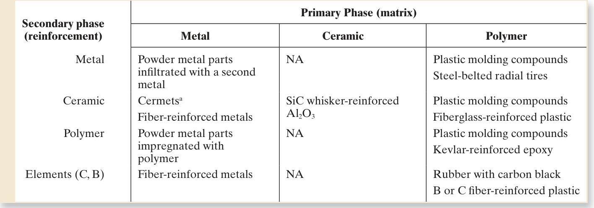  
NA $=$  not applicable currently. a Cermets include cemented carbides.  

it may be an element such as carbon or boron. Possible combinations in a two- component composite material can be organized as a $3\times4$  chart, as in Table 9.1.  Note that certain combinations are not feasible, such as a polymer in a ceramic  matrix. Also note that the possibilities include two-phase structures consisting  of components of the same material type, such as fi  bers of Kevlar (polymer) in  a plastic (polymer) matrix. In other composites the imbedded material is an ele- ment such as carbon or boron.  

The classifi  cation system for composite materials used in this book is based on the  matrix phase. The classes are listed here and discussed in Sections 9.2 through 9.4:  

1.  Metal Matrix Composites  (MMCs) include mixtures of ceramics and metals,  such as cemented carbides and other cermets, as well as aluminum or magne- sium reinforced by strong, high stiffness fi  bers.

 2.  Ceramic Matrix Composites  (CMCs) are the least common category. Alumi- num oxide and silicon carbide are materials that can be imbedded with fi  bers for  improved properties, especially in high temperature applications.

 3.  Polymer Matrix Composites  (PMCs). Thermosetting resins are the most widely  used polymers in PMCs. Epoxy and polyester are commonly mixed with fi  ber  reinforcement, and phenolic is mixed with powders. Thermoplastic molding  compounds are often reinforced, usually with powders (Section 8.1.5).  

The classifi  cation can be applied to traditional composites as well as synthetics.  Concrete is a ceramic matrix composite, while asphalt and wood are polymer matrix  composites.  

The matrix material serves several functions in the composite. First, it provides  the bulk form of the part or product made of the composite material. Second, it  holds the imbedded phase in place, usually enclosing and often concealing it. Third,  when a load is applied, the matrix shares the load with the secondary phase, in some  cases deforming so that the stress is essentially born by the reinforcing agent.  

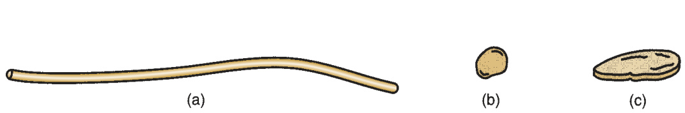  
FIGURE 9.1  Possible  physical shapes of  imbedded phases in  composite materials:  (a) fi  ber, (b) particle,  and (c) fl  ake.  

# 9.1.2  THE REINFORCING PHASE  

It is important to understand that the role played by the secondary phase is to rein- force the primary phase. The imbedded phase is most commonly one of the shapes  illustrated in Figure 9.1: fi  bers, particles, or fl  akes. In addition, the secondary phase  can take the form of an infi  ltrated phase in a skeletal or porous matrix.  

Fibers   Fibers  are fi  laments of reinforcing material, generally circular in cross- section, although alternative shapes are sometimes used (e.g., tubular, rectangular,  hexagonal). Diameters range from less than $0.0025\,\mathrm{mm}$  (0.0001 in) to about  $0.13\mathrm{\,mm}$ (0.005 in), depending on material.  

Fiber reinforcement provides the greatest opportunity for strength enhancement  of composite structures. In fi  ber-reinforced composites, the fi  ber is often considered  to be the principal constituent since it bears the major share of the load. Fibers are of  interest as reinforcing agents because the fi  lament form of most materials is signifi  - cantly stronger than the bulk form. The effect of fi  ber diameter on tensile strength  can be seen in Figure 9.2. As diameter is reduced, the material becomes oriented  in the direction of the fi  ber axis and the probability of defects in the structure de- creases signifi  cantly. As a result, tensile strength increases dramatically.  

Fibers used in composites can be either continuous or discontinuous.  Continu- ous fi  bers  are very long; in theory, they offer a continuous path by which a load  can be carried by the composite part. In reality, this is diffi  cult to achieve due to  variations in the fi  brous material and processing.  Discontinuous fi  bers  (chopped  sections of continuous fi  bers) are short lengths ( $(L/D\approx100)$ ). An important type of  discontinuous fi  ber are  whiskers —hair-like single crystals with diameters down to  about $0.001\;\mathrm{mm}$  (0.00004 in) and very high strength.  

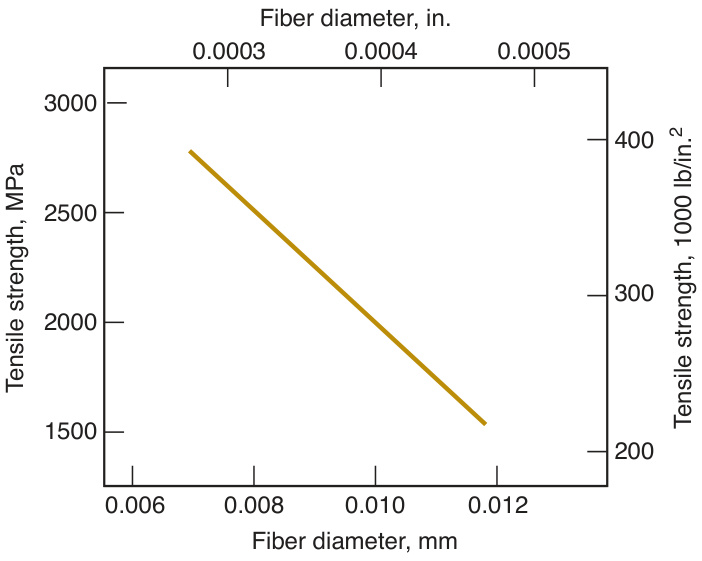  
FIGURE 9.2  Relationship  between tensile strength and  diameter for a carbon fi  ber  (Source: [1]). Other fi  lament  materials show similar  relationships.  

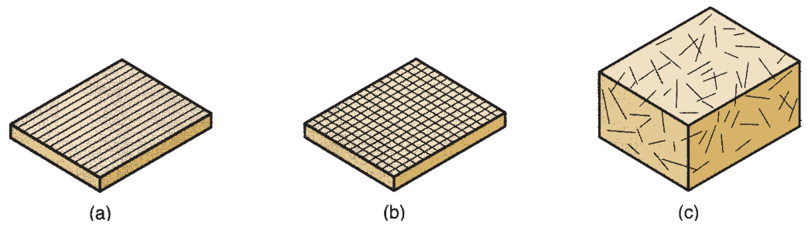  
FIGURE 9.3  Fiber  orientation in  composite materials:  (a) one-dimensional,  continuous fi  bers;  (b) planar,   continuous  fi  bers in the form  of a woven fabric;  and (c) random,  discontinuous fi  bers.  

Fiber orientation is another factor in composite parts. Three cases can be dis- tinguished, illustrated in Figure 9.3: (a) one-dimensional reinforcement, in which  maximum strength and stiffness are obtained in the direction of the fi  ber; (b) planar  reinforcement, in some cases in the form of a two-dimensional woven fabric; and  (c) random or three-dimensional in which the composite material tends to possess  isotropic properties.  

Various materials are used as fi  bers in fi  ber-reinforced composites: metals, ceram- ics, polymers, carbon, and boron. The most important commercial use of fi  bers is in  polymer composites. However, use of fi  ber-reinforced metals and ceramics is grow- ing. Following is a survey of the important types of fi  ber materials, with properties  listed in Table 9.2:  

➢   Glass —The most widely used fi  ber in polymers, the term  fi  berglass  is applied  to denote glass fi  ber-reinforced plastic (GFRP). The two common glass fi  bers  are E-glass and S-glass (compositions listed in Table 7.5). E-glass is strong and  low cost, but its modulus is less than other fi  bers. S-glass is stiffer, and its tensile  strength is one of the highest of all fi  ber materials; however, it is more expensive  than E-glass.  

➢   Carbon —Carbon (Section 7.5.1) can be made into high-modulus fi  bers. Besides  stiffness, other attractive properties include low-density and low-thermal  

TABLE  •  9.2  Typical properties of fi  ber materials used as reinforcement in composites. 
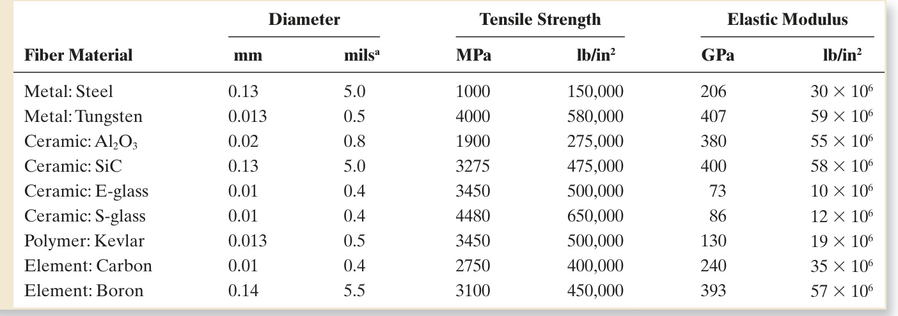  
Compiled from [3], [7], [11], and other sources. Note that strength depends on fi  ber diameter (Figure 9.2); the properties in this table  must be interpreted accordingly. $\mathrm{`1\milde{l}=0.001}$  in.  

expansion. C-fi  bers are generally a combination of graphite and amorphous  carbon.   Boron —Boron (Section 7.5.3) has a very high elastic modulus, but its high cost  limits applications to aerospace components in which this property (and others)  are critical. Kevlar 49 —This is the most important polymer fi  ber; it is a highly crystalline  aramid, a member of the polyamide family (Section 8.2.2). Its specifi  c gravity is  low, giving it one of the highest strength-to-weight ratios of all fi  bers. Ceramics —Silicon carbide (SiC) and aluminum oxide  $(\mathrm{Al}_{2}\mathrm{O}_{3})$  are the main fi  b- er materials among ceramics. Both have high elastic moduli and can be used to  strengthen low-density, low-modulus metals such as aluminum and magnesium.   Metal —Steel fi  laments, both continuous and discontinuous, are used as rein- forcing fi  bers in plastics. Other metals are currently less common as reinforcing  fi  bers.  

Particles and Flakes  A second common shape of the imbedded phase is  particu- late , ranging in size from microscopic to macroscopic. Particles are an important  material form for metals and ceramics. The characterization and production of engi- neering powders are discussed in Chapters 15 and 16.  

The distribution of particles in the composite matrix is random, and therefore  strength and other properties of the composite material are usually isotropic. The  strengthening mechanism depends on particle size. The microscopic size is repre- sented by very fi  ne powders (around  $1\;\mu\mathrm{m}$ ) distributed in the matrix in concentra- tions of  $15\%$  or less. The presence of these powders results in dispersion-hardening  of the matrix, in which dislocation movement in the matrix material is restricted by  the microscopic particles. In effect, the matrix itself is strengthened, and no signifi  - cant portion of the applied load is carried by the particles.  

As particle size increases to the macroscopic range, and the proportion of imbed- ded material increases to $25\%$  and more, the strengthening mechanism changes. In  this case, the applied load is shared between the matrix and the imbedded phase.  Strengthening occurs due to the load-carrying ability of the particles and the bond- ing of particles in the matrix. This form of composite strengthening occurs in ce- mented carbides, in which tungsten carbide (WC) is held in a cobalt (Co) binder. The  proportion of WC in the Co matrix is typically  $80\%$  or more.  

Flakes  are basically two-dimensional particles—small fl  at platelets. Two examples  of this shape are the minerals mica (silicate of K and Al) and talc  $(\mathrm{Mg}_{3}\mathrm{Si}_{4}\mathrm{O}_{10}(\mathrm{OH})_{2})$ ,  used as reinforcing agents in plastics. They are generally lower cost materials than  polymers, and they add strength and stiffness to plastic molding compounds. Platelet  sizes are usually in the range  $0.01{-}1~\mathrm{mm}$  (0.0004–0.040 in) across the fl  ake, with a  thickness of 0.001–0.005 mm (0.00004–0.00020 in).  

Infi  ltrated Phase  The fourth form of imbedded phase occurs when the matrix has  the form of a porous skeleton (like a sponge), and the second phase is simply a  fi  ller .  In this case, the imbedded phase assumes the shape of the pores in the matrix. Metal- lic fi  llers are sometimes used to infi  ltrate the open porous structure of parts made by  powder metallurgy techniques (Section 15.3.4), in effect creating a composite mate- rial. Oil-impregnated sintered PM components, such as bearings and gears, might be  considered another example of this category.  

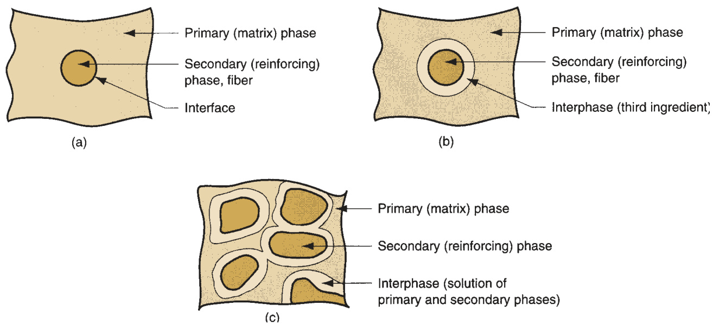  
FIGURE 9.4  Interfaces and interphases between phases in a composite material: (a) direct bonding between  primary and secondary phases; (b) addition of a third ingredient to bond the primary and secondary phases and form  an interphase; and (c) formation of an interphase by solution of the primary and secondary phases at their boundary.  

The Interface  There is always an  interface  between constituent phases in a com- posite material. For the composite to operate effectively, the phases must bond  where they join. In some cases, there is a direct bonding between the two ingredients,  as suggested by Figure 9.4(a). In other cases, a third ingredient is added to promote  bonding of the two primary phases. Called an  interphase , this third ingredient can  be thought of as an adhesive. An important example is the coating of glass fi  bers  to achieve adhesion with thermosetting resin in fi  berglass-reinforced plastics. As  illustrated in Figure 9.4(b), this case results in two interfaces, one on either bound- ary of the interphase. Finally, a third form of interface occurs when the two primary  components are not completely insoluble in each other; in this case, the interphase is  formed consisting of a solution of the phases, as in Figure 9.4(c). An example   occurs  in cemented carbides (Section 9.2.1); at the high sintering temperatures used on these  materials, some solubility results at the boundaries to create an interphase.  

# 9.1.3 PROPERTIES OF COMPOSITE MATERIALS  

In the selection of a composite material, an optimum combination of properties is  usually being sought, rather than one particular property. For example, the fuselage  and wings of an aircraft must be lightweight as well as strong, stiff, and tough. Find- ing a monolithic material that satisfi  es these requirements is diffi  cult. Several fi  ber- reinforced polymers possess this combination of properties.  

Another example is rubber. Natural rubber is a relatively weak material. In  the early 1900s, it was discovered that by adding signifi  cant amounts of carbon  black (almost pure carbon) to natural rubber, its strength is increased dramati- cally. The two ingredients interact to provide a composite material that is signifi  - cantly stronger than either one alone. Rubber, of course, must also be vulcanized  to achieve full strength.  

Rubber itself is a useful additive in polystyrene (PS). One of the distinctive and  disadvantageous properties of polystyrene is its brittleness. Although most other  polymers have considerable ductility, PS has virtually none. Rubber (natural or syn- thetic) can be added in modest amounts  $(5{-}15\%)$  to produce high-impact polysty- rene, which has much superior toughness and impact strength.  

Properties of a composite material are determined by three factors: (1) the ma- terials used as component phases in the composite, (2) the geometric shapes of the  constituents and resulting structure of the composite system, and (3) the manner in  which the phases interact with one another.  

Rule of Mixtures  The properties of a composite material are a function of the  starting materials. Certain properties of a composite material can be computed by  means of a  rule of mixtures , which involves calculating a weighted average of the  constituent material properties. Density is an example of this averaging rule. The  mass of a composite material is the sum of the masses of the matrix and reinforcing  phases:  

$$
m_{c}=m_{m}+m_{r}
$$  

where  $m={\mathrm{mass}},{\mathrm{kg}}$ (lb); and the subscripts  $c,m$ , and  $r$  indicate composite, matrix,  and reinforcing phases, respectively. Similarly, the volume of the composite is the  sum of its constituents:  

$$
V_{c}=V_{m}+V_{r}+V_{v}
$$  

where  $V=$  volume,  $\mathsf{c m}^{3}\;(\mathrm{in}^{3}).$ $V_{\nu}$  is the volume of any voids in the composite (e.g.,  pores). The density of the composite is the mass divided by the volume.  

$$
\rho_{c}={\frac{m_{c}}{V_{c}}}={\frac{m_{m}+m_{r}}{V_{c}}}
$$  

Because the masses of the matrix and reinforcing phase are their respective densi- ties multiplied by their volumes,  

$$
m_{m}=\rho_{m}\,V_{m}\quad\mathrm{and}\quad m_{r}=\rho_{r}\,V_{r}
$$  

these terms can be substituted into Equation (9.3) so that  

$$
\rho_{c}=f_{m}\,\rho_{m}+f_{r}\,\rho_{r}
$$  

where $f_{m}=V_{m}/V_{c}$  a nd $f_{r}=V_{r}/V_{c}$  are simply the volume fractions of the matrix and  reinforcing phases.  

Fiber-Reinforced Composites  Determining mechanical properties of compos- ites from constituent properties is usually more involved. The rule of mixtures can  sometimes be used to estimate the modulus of elasticity of a fi  ber-reinforced com- posite made of continuous fi  bers where $E_{c}$  is measured in the longitudinal direction.  The situation is depicted in Figure 9.5(a); it is assumed that the fi  ber material is much  stiffer than the matrix and that the bonding between the two phases is secure. Under  this model, the modulus of the composite can be predicted as follows:  

$$
E_{c}=f_{m}\,E_{m}+f_{r}\,E_{r}
$$  

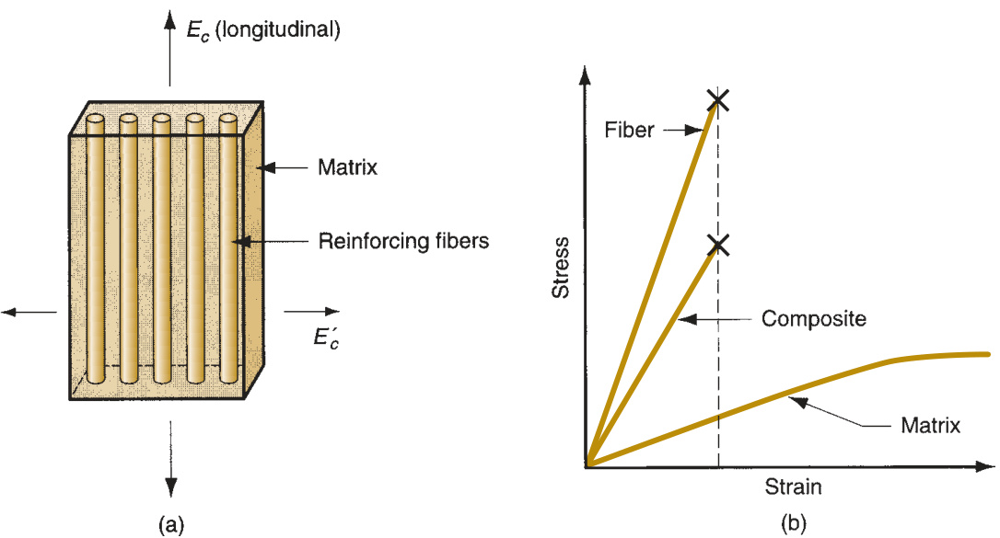  
FIGURE 9.5  (a) Model of a fi  ber-reinforced composite material showing direction in which  elastic modulus is being estimated by the rule of mixtures. (b) Stress–strain   relationships  for the composite material and its constituents. The fi  ber is stiff but brittle, while the matrix  (commonly a polymer) is soft but ductile. The composite’s modulus is a weighted average of  its components’ moduli. But when the reinforcing fi  bers fail, the composite does likewise.  

where  $E_{c},\,E_{m}$ , and  $E_{r}$  are the elastic moduli of the composite and its constituents,  MPa  $\mathrm{(lb/in^{2})}$ ); and $f_{m}$  and $f_{r}$  are again the volume fractions of the matrix and reinforc- ing phase. The effect of Equation (9.5) is seen in Figure 9.5(b).  

Perpendicular to the longitudinal direction, the fi  bers contribute little to the over- all stiffness except for their fi  lling effect. The composite modulus can be estimated in  this direction using the following:  

$$
E_{c}^{\,\prime}=\frac{E_{m}\,E_{r}}{f_{m}\,E_{r}+f_{r}\,E_{m}}
$$  

where  $E_{c}^{\,\prime}=$  elastic modulus perpendicular to the fi  ber direction, MPa  $\mathrm{(lb/in^{2})}$ . The  two equations for $E_{c}$  demonstrate the signifi  cant anisotropy of fi  ber-reinforced com- posites. This directional effect can be seen in Figure 9.6 for a fi  ber-reinforced polymer  

FIGURE 9.6  Variation  in elastic modulus and  tensile strength as a  function of direction of  measurement relative  to longitudinal axis of  carbon fi  ber-reinforced  epoxy composite.  (Source: [7]).  

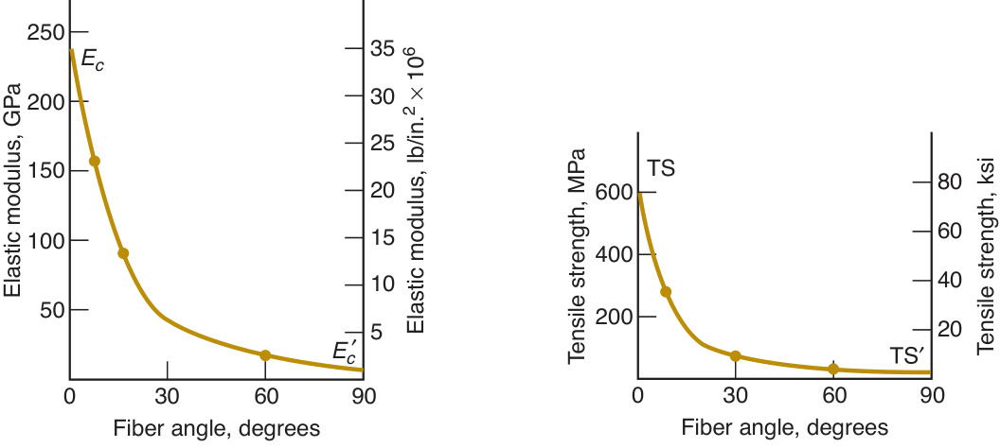  

composite, in which both elastic modulus and tensile strength are measured relative  to fi  ber direction.  

Fibers illustrate the importance of geometric shape. Most materials have tensile  strengths several times greater in a fi  brous form than in bulk. However, applica- tions of fi  bers are limited by surface fl  aws, buckling when subjected to compression,  and the inconvenience of the fi  lament geometry when a solid component is needed.  By imbedding the fi  bers in a polymer matrix, a composite material is obtained that  avoids the problems of fi  bers but utilizes their strengths. The matrix provides the  bulk shape to protect the fi  ber surfaces and resist buckling; and the fi  bers lend their  high strength to the composite. When a load is applied, the low-strength matrix de- forms and distributes the stress to the high-strength fi  bers, which then carry the load.  If individual fi  bers break, the load is redistributed through the matrix to other fi  bers.  

# 9.1.4  OTHER COMPOSITE STRUCTURES  

The model of a composite material described above is one in which a reinforcing  phase is imbedded in a matrix phase, the combination having properties that are  superior in certain respects to either of the constituents alone. However, composites  can take alternative forms that do not fi  t this model, some of which are of consider- able commercial and technological importance.  

A  laminar composite structure  consists of two or more layers bonded together to  form an integral piece, as in Figure 9.7(a). The layers are usually thick enough that  this composite can be readily identifi  ed—not always the case with other composites.  The layers are often of different materials, but not necessarily. Plywood is such an  example; the layers are of the same wood, but the grains are oriented differently to  increase overall strength of the laminated piece. A laminar composite often uses  different materials in its layers to gain the advantage of combining the particular  properties of each. In some cases, the layers themselves may be composite materials.  It was mentioned that wood is a composite material; therefore, plywood is a laminar  composite structure in which the layers themselves are composite materials. A list of  examples of laminar composites is compiled in Table 9.3.  

The  sandwich structure  is sometimes distinguished as a special case of the lami- nar composite structure. It consists of a relatively thick core of low-density material  bonded on both faces to thin sheets of a different material. The low-density core may  be a  foamed material , as in Figure 9.7(b), or a  honeycomb , as in (c). The reason for  using a sandwich structure is to obtain a material with high strength-to-weight and  stiffness-to-weight ratios.  

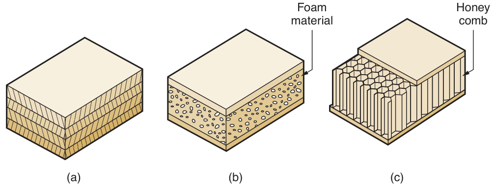  
FIGURE 9.7  Laminar  composite structures:  (a) conventional  laminar structure;  (b) sandwich structure  using a foam core,  and (c) honeycomb  sandwich structure.  

TABLE  •  9.3  Examples of laminar composite structures. 
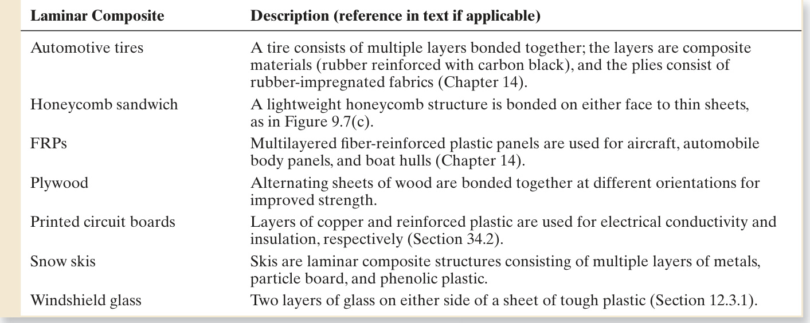  

#  Metal Matrix Composites  

Metal matrix composites (MMCs) consist of a metal matrix reinforced by a second  phase. Common reinforcing phases include (1) particles of ceramic and (2) fi  bers of  various materials, including other metals, ceramics, carbon, and boron. MMCs of the  fi  rst type are commonly called cermets.  

# 9.2.1  CERMETS  

A  cermet 1  is a composite material in which a ceramic is contained in a metallic ma- trix. The ceramic often dominates the mixture, sometimes ranging up to $96\%$  by vol- ume. Bonding can be enhanced by slight solubility between phases at the elevated  temperatures used in processing these composites. Cermets can be subdivided into  (1) cemented carbides and (2) oxide-based cermets.  

Cemented Carbides   Cemented carbides  are composed of one or more carbide  compounds bonded in a metallic matrix. The term  cermet  is not used for all of  these materials, even though it is technically correct. The common cemented car- bides are based on tungsten carbide (WC), titanium carbide (TiC), and chromium  carbide  $(\mathrm{Cr}_{3}\mathrm{C}_{2})$ . Tantalum carbide (TaC) and others are also used but less com- monly. The principal metallic binders are cobalt and nickel. The carbide ceramics  (Section 7.3.2) are the principal ingredient in cemented carbides, typically ranging  in content from $80\%$  to $95\%$  of total weight.  

Cemented carbide parts are produced by particulate processing techniques  (Section 16.3). Cobalt is the binder used for WC (see Figure 9.8), and nickel is a  common binder for TiC and $\mathrm{Cr}_{3}\mathrm{C}_{2}$ . Even though the binder constitutes only about  $5\%$  to  $15\%$ , its effect on mechanical properties is signifi  cant in the composite  

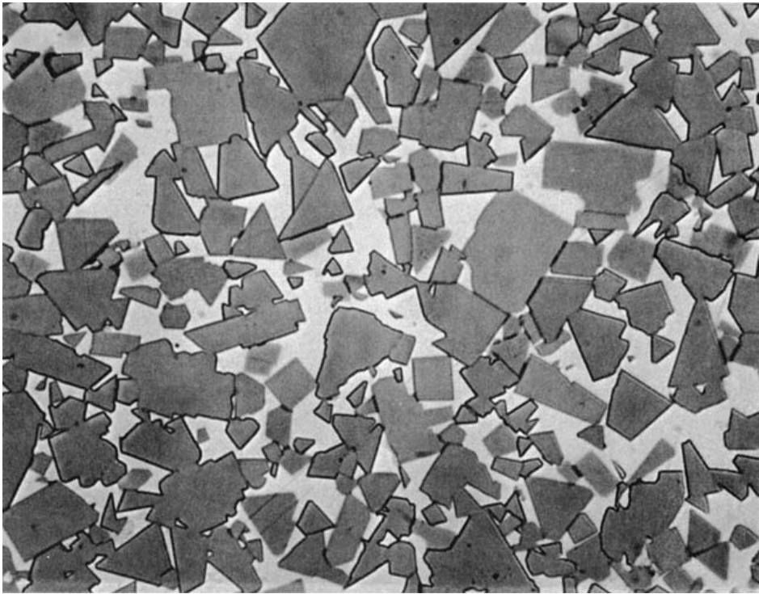  
FIGURE 9.8  Photomicrograph  (about 1500X) of  cemented carbide  with $85\%$  WC and  $15\%$  Co. (Photo   courtesy  of Kennametal Inc.)  

material. Using WC–Co as an example, as the percentage of Co is increased, hard- ness is decreased and transverse rupture strength (TRS) is increased, as shown in  Figure 9.9. TRS correlates with toughness of the WC–Co composite.  

Cutting tools are the most common application of cemented carbides based on  tungsten carbide . Other applications of WC–Co cemented carbides include wire  drawing dies, rock-drilling bits and other mining tools, dies for powder metallurgy,  indenters for hardness testers, and other applications where hardness and wear re- sistance are critical requirements.  

Titanium carbide  cermets are used principally for high temperature applications.  Nickel is the preferred binder; its oxidation resistance at high temperatures is  

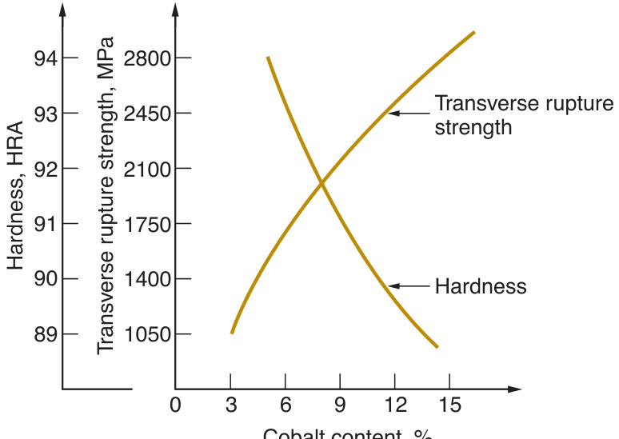  

superior to that of cobalt. Applications include gas-turbine nozzle vanes, valve seats,  thermocouple protection tubes, torch tips, and hot-working spinning tools [11].  TiC–Ni is also used as a cutting tool material in machining operations.  

Compared with WC–Co cemented carbides, nickel-bonded  chromium carbides are more brittle, but have excellent chemical stability and corrosion resistance. This  combination, together with good wear resistance, makes it suitable for applications  such as gage blocks, valve liners, spray nozzles, and bearing seal rings [11].  

Oxide-based Cermets  Most of these composites utilize ${\mathrm{Al}}_{2}{\mathrm{O}}_{3}$  as the particulate  phase; $\mathrm{MgO}$  is another oxide sometimes used. A common metal matrix is chromium,  although other metals can also be used as binders. Relative proportions of the two  phases vary signifi  cantly, with the possibility for the metal binder to be the major  ingredient. Applications include cutting tools, mechanical seals, and thermocouple  shields.  

# 9.2.2  FIBER-REINFORCED METAL MATRIX COMPOSITES  

These MMCs are of interest because they combine the high tensile strength and  modulus of elasticity of a fi  ber with metals of low density, thus achieving good  strength-to-weight and modulus-to-weight ratios in the resulting composite mate- rial. Typical metals used as the low-density matrix are aluminum, magnesium, and  titanium. Some of the important fi  ber materials used in the composite include ${\mathrm{Al}}_{2}{\mathrm{O}}_{3}$ ,  boron, carbon, and SiC.  

Properties of fi  ber-reinforced MMCs are anisotropic, as expected. Maximum ten- sile strength in the preferred direction is obtained by using continuous fi  bers bonded  strongly to the matrix metal. Elastic modulus and tensile strength of the composite  material increase with increasing fi  ber volume. MMCs with fi  ber reinforcement have  good high-temperature strength properties; and they are good electrical and thermal  conductors. Applications have largely been components in aircraft and turbine  machinery, where these properties can be exploited.  

#  Ceramic Matrix Composites  

Ceramics have certain attractive properties: high stiffness, hardness, hot hardness,  and compressive strength; and relatively low density. Ceramics also have several  faults: low toughness and bulk tensile strength, and susceptibility to thermal crack- ing. Ceramic matrix composites (CMCs) represent an attempt to retain the desirable  properties of ceramics while compensating for their weaknesses. CMCs consist of a  ceramic primary phase imbedded with a secondary phase. To date, most develop- ment work has focused on the use of fi  bers as the secondary phase. Success has been  elusive. Technical diffi  culties include thermal and chemical compatibility of the con- stituents in CMCs during processing. Also, as with any ceramic material, limitations  on part geometry must be considered.  

Ceramic materials used as matrices include alumina  $(\mathrm{Al}_{2}\mathrm{O}_{3})$ , boron carbide  $\mathrm{(B_{4}C)}$ , boron nitride (BN), silicon carbide (SiC), silicon nitride  $\mathrm{(Si}_{3}\mathrm{N}_{4}\mathrm{)}$ , titanium car- bide (TiC), and several types of glass [10]. Some of these materials are still in the  development stage as CMC matrices. Fiber materials in CMCs include carbon, SiC,  and ${\mathrm{Al}}_{2}{\mathrm{O}}_{3}$ .  

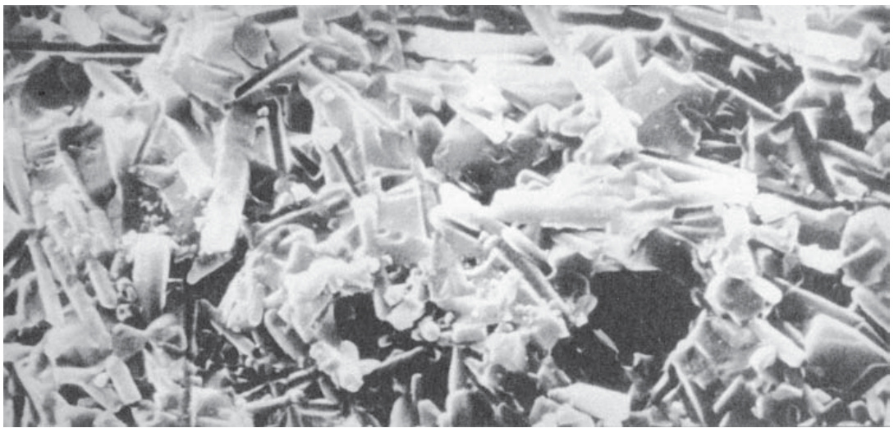  
FIGURE 9.10  Highly  magnifi  ed electron  microscopy photograph  (about 3000X)   showing  fracture surface of SiC  whisker reinforced  ceramic  $(\mathsf{A}!_{2}\mathsf{O}_{3})$  used as  cutting tool material.  (Courtesy of Greenleaf  Corporation.)  

The reinforcing phase in current CMC technology consists of either short fi  bers,  such as whiskers, or long fi  bers. Products with short fi  bers have been successfully  fabricated using particulate processing methods, the fi  bers being treated as a form of  powder in these materials. Although there are performance advantages in using long  fi  bers as reinforcement in ceramic matrix composites, development of economical  processing techniques for these materials has been diffi  cult. One promising com- mercial application of CMCs is in metal-cutting tools as a competitor of cemented  carbides, illustrated in Figure 9.10. The composite tool material has whiskers of SiC  in a matrix of ${\mathrm{Al}}_{2}{\mathrm{O}}_{3}$ . Other potential applications are in elevated temperatures and  environments that are chemically corrosive to other materials.  

A  polymer matrix composite  (PMC) consists of a polymer primary phase in which a  secondary phase is imbedded in the form of fi  bers, particles, or fl  akes. Commercially,  PMCs are the most important of the three classes of synthetic composites. They in- clude most plastic molding compounds, rubber reinforced with carbon black, and  fi  ber-reinforced polymers (FRPs). Of the three, FRPs are most closely identifi  ed  with the term composite. If one mentions “composite material” to a design engineer,  FRP is usually the composite that comes to mind.  

# 9.4.1  FIBER-REINFORCED POLYMERS  

A  fi  ber-reinforced polymer  is a composite material consisting of a polymer matrix  imbedded with high-strength fi  bers. The polymer matrix is usually a thermosetting  plastic such as unsaturated polyester or epoxy, but thermoplastic polymers, such as  nylons (polyamides), polycarbonate, polystyrene, and polyvinyl chloride, are also  used. In addition, elastomers are also reinforced by fi  bers for rubber products such  as tires and conveyor belts.  

Fibers in PMCs come in various forms: discontinuous (chopped), continuous, or  woven as a fabric. Principal fi  ber materials in FRPs are glass, carbon, and Kevlar 49.  Less common fi  bers include boron, SiC, and ${\bf A l}_{2}{\bf O}_{3}$ , and steel. Glass (in particular  E-glass) is the most common fi  ber material in today’s FRPs; its use to reinforce plas- tics dates from around 1920.  

The term  advanced composites  is sometimes used in connection with FRPs de- veloped since the late 1960s that use boron, carbon, or Kevlar, as the reinforcing  fi  bers [13]. Epoxy is the common matrix polymer. These composites generally have  high fi  ber content  $(\ge50\%$  by volume) and possess high strength and modulus of  elasticity. When two or more fi  ber materials are combined in the FRP composite,  it is called a  hybrid composite . Advantages cited for hybrids over conventional or  advanced FRPs include balanced strength and stiffness, improved toughness and  impact resistance, and reduced weight [11]. Advanced and hybrid composites are  used in aerospace applications.  

The most widely used form of the FRP itself is a laminar structure, made by stacking  and bonding thin layers of fi  ber and polymer until the desired thickness is obtained.  By varying the fi  ber orientation among the layers, a specifi  ed level of anisotropy in  properties can be achieved in the laminate. This method is used to form parts of thin  cross section, such as aircraft wing and fuselage sections, automobile and truck body  panels, and boat hulls.  

Properties  There are a number of attractive features that distinguish fi  ber-reinforced  plastics as engineering materials. Most notable are (1) high strength-to-weight ratio,  (2) high modulus-to-weight ratio, and (3) low specifi  c gravity. A typical FRP weighs  only about one fi  fth as much as steel; yet strength and modulus are comparable in the  fi  ber direction. Table 9.4 compares these properties for several FRPs, steels, and an  aluminum alloy. Properties listed in Table 9.4 depend on the proportion of fi  bers in the  composite. Both tensile strength and elastic modulus increase as the fi  ber content is  increased, by Equation (9.5). Other properties and characteristics of fi  ber-reinforced  plastics include (4) good fatigue strength; (5) good corrosion resistance, although  polymers are soluble in various chemicals; (6) low thermal expansion for many FRPs,  leading to good dimensional stability; and (7) signifi  cant anisotropy in properties. With  regard to this last feature, the mechanical properties of the FRPs given in Table 9.4 are  

TABLE  •  9.4  Comparison of typical properties of fi  ber-reinforced plastics and representative metal alloys. 
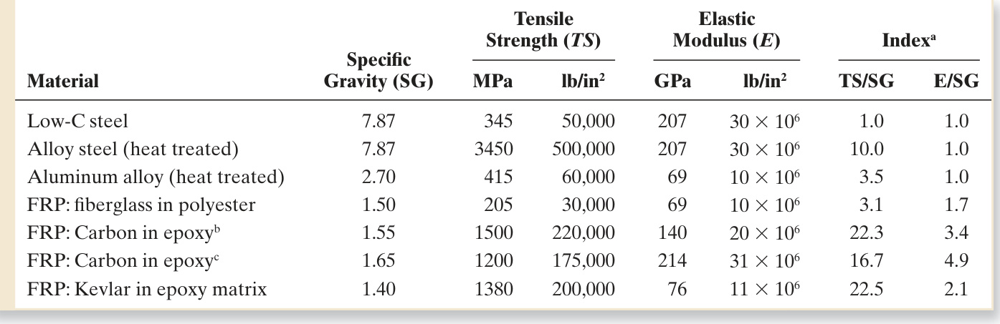  
Compiled from [3], [7], and other sources. Properties are measured in the fi  ber direction. a  Indices are relative tensile strength-to-weight (TS/SG) and elastic modulus-to-weight (E/SG) ratios compared to low-C steel as the  base (index $=1.0$  for the base). b  High tensile strength carbon fi  bers used in FRP. c  High modulus carbon fi  bers used in FRP.  

in the direction of the fi  ber. As previously noted, their values are signifi  cantly less when  measured in a different direction.  

Applications  During the last three decades there has been a steady growth in  the application of fi  ber-reinforced polymers in products requiring high strength and  low weight, often as substitutions for metals. The aerospace industry is one of the  biggest users of advanced composites. Designers are continually striving to reduce  aircraft weight to increase fuel effi  ciency and payload capacity. Applications of ad- vanced composites in both military and commercial aircraft have increased steadily.  Much of the structural weight of today’s airplanes and helicopters consists of FRPs.  The new Boeing 787 Dreamliner features $50\%$  (by weight) composite (carbon fi  ber- reinforced plastic). That’s about  $80\%$  of the volume of the aircraft. Composites are  used for the fuselage, wings, tail, doors, and interior. By comparison, Boeing’s 777 has  only about $12\%$  composites (by weight).  

The automotive industry is another important user of FRPs. The most obvious  applications are FRP body panels for cars and truck cabs. A notable example is the  Chevrolet Corvette that has been produced with FRP bodies for decades. Less ap- parent applications are in certain chassis and engine parts. Automotive applications  differ from those in aerospace in two signifi  cant respects. First, the requirement for  high strength-to-weight ratio is less demanding than for aircraft. Car and truck appli- cations can use conventional fi  berglass reinforced plastics rather than advanced com- posites. Second, production quantities are much higher in automotive applications,  requiring more economical methods of fabrication. Continued use of low-carbon  sheet steel in automobiles in the face of FRP’s advantages is evidence of the low cost  and processability of steel.  

FRPs have been widely adopted for sports and recreational equipment. Fiber- glass reinforced plastic has been used for boat hulls since the 1940s. Fishing rods  were another early application. Today, FRPs are represented in a wide assortment of  sports products, including tennis rackets, golf club shafts, football helmets, bows and  arrows, skis, and bicycle wheels.  

# 9.4.2  OTHER POLYMER MATRIX COMPOSITES  

In addition to FRPs, other PMCs contain particles, fl  akes, and short fi  bers. Ingredients  of the secondary phase are called  fi  llers  when used in polymer molding compounds  (Section 8.1.5). Fillers divide into two categories: (1) reinforcements and (2) extenders.  Reinforcing fi  llers  serve to strengthen or otherwise improve mechanical properties of  the polymer. Common examples include: wood fl  our and powdered mica in phenolic  and amino resins to increase strength, abrasion resistance, and dimensional stability;  and carbon black in rubber to improve strength, wear, and tear resistance.  Extenders   simply increase the bulk and reduce the cost-per-unit weight of the polymer, but have  little or no effect on mechanical properties. Extenders may be formulated to improve  molding characteristics of the resin.  

Foamed polymers (Section 13.11) are a form of composite in which gas bubbles  are imbedded in a polymer matrix. Styrofoam and polyurethane foam are the most  common examples. The combination of near-zero density of the gas and relatively  low density of the matrix makes these materials extremely light weight. The gas mix- ture also lends very low thermal conductivity for applications in which heat insula- tion is required.  